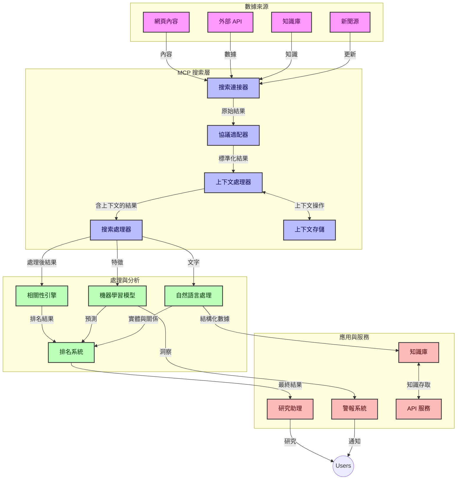
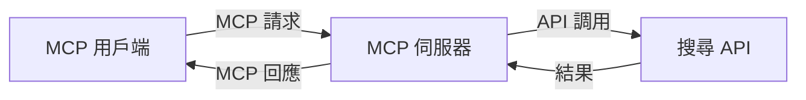
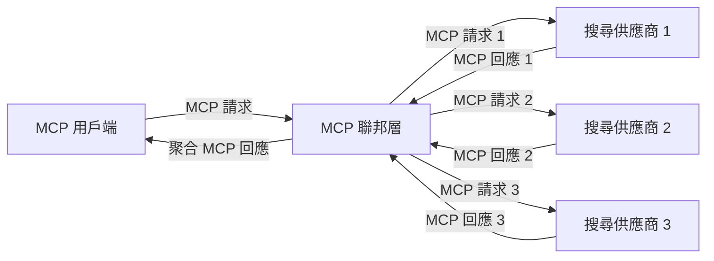
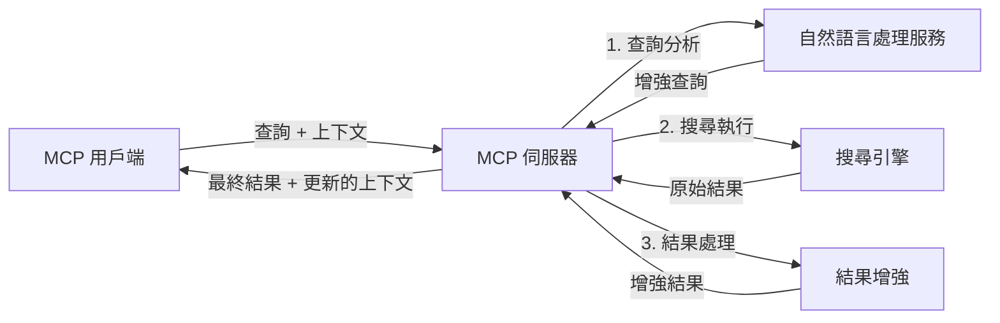

# 即時網絡搜尋的模型上下文協議

## 概覽

即時網絡搜尋已成為當今資訊驅動環境中的關鍵，因為應用程式需要即時存取互聯網上的最新資訊，以提供相關而及時的回應。模型上下文協議（MCP）代表了優化這些即時搜尋流程的重要進展，提升搜尋效率，維護上下文完整性，並改進整體系統性能。

本模組探討 MCP 如何透過在 AI 模型、搜尋引擎及應用程式之間提供標準化的上下文管理方法，改變即時網絡搜尋。

### 學習內容

在本綜合指南中，你將發現：

- MCP 如何在 AI 模型和即時網絡搜尋能力之間創造無縫橋樑
- 實施高效且可擴展搜尋解決方案的架構模式
- 在多次查詢及互動中保持搜尋上下文的技巧
- 使用 Python 和 JavaScript 的實際程式碼範例，適用於多種搜尋場景
- 在 MCP 支援的搜尋系統中平衡相關性、新穎性和性能的方法

## 即時網絡搜尋簡介

即時網絡搜尋是一種技術方法，可持續查詢、處理及分析發佈或更新的網絡資訊，使系統能夠以極低延遲提供新鮮且相關的資訊。與依賴可能已過數小時或數天的索引資料的傳統搜尋系統不同，即時搜尋處理來自網絡的即時資料，提供反映當前線上內容狀態的洞察與資訊。

### 即時網絡搜尋的核心概念：

- <strong>持續查詢處理</strong>：搜尋查詢持續對不斷更新的資料源進行處理
- <strong>優先新穎性</strong>：系統設計以優先呈現最新資訊
- <strong>相關性與新穎性的平衡</strong>：維持相關性與新鮮感之間的平衡
- <strong>可擴展架構</strong>：系統必須能應對變動的查詢負載與資料量
- <strong>上下文理解</strong>：在多次搜尋迭代中保持用戶上下文是取得有意義結果的關鍵
- <strong>動態查詢重構</strong>：根據上下文及先前結果自適應修改查詢
- <strong>多源整合</strong>：結合多個搜尋提供者和網絡來源的結果
- <strong>語意理解</strong>：根據意義而非僅靠關鍵字處理查詢與內容
- <strong>即時排名</strong>：隨著新資訊出現持續調整結果排名

### 模型上下文協議與即時網絡搜尋

模型上下文協議（MCP）解決了即時網絡搜尋環境中的多項關鍵挑戰：

1. <strong>搜尋上下文保存</strong>：MCP 標準化分散式搜尋元件之間如何維護上下文，確保 AI 模型及處理節點能存取相關查詢歷史和用戶偏好。

2. <strong>高效查詢管理</strong>：透過提供結構化的上下文傳輸機制，MCP 降低每次搜尋重複上下文的開銷。

3. <strong>互操作性</strong>：MCP 創建一種多種搜尋技術與 AI 模型之間共享上下文的通用語言，使架構更靈活與可擴展。

4. <strong>搜尋優化上下文</strong>：MCP 實現可優先處理最相關的上下文元素，提升性能與準確性。

5. <strong>自適應搜尋處理</strong>：透過 MCP 適當的上下文管理，搜尋系統能依據用戶需求及資訊環境動態調整處理。

在從新聞聚合到研究助理的現代應用中，MCP 與網絡搜尋技術的整合使搜尋更智慧、具上下文感知，能隨用戶互動持續提供更相關的結果。

## 學習目標

本課程結束時，你將能：

- 理解即時網絡搜尋的基本概念及其在現代應用中的挑戰
- 解釋模型上下文協議（MCP）如何增強即時網絡搜尋能力
- 使用流行框架與 API 實作基於 MCP 的搜尋解決方案
- 設計及部署可擴展且高性能的 MCP 搜尋架構
- 將 MCP 概念應用於語意搜尋、研究助理及 AI 增強瀏覽等多領域用例
- 評估 MCP 基礎搜尋技術的最新趨勢與未來創新
- 開發能從用戶互動中學習的上下文感知搜尋系統
- 使用標準化 MCP 協議將網絡搜尋能力整合進 AI 助理
- 創建逐步基於上下文細化結果的多階段搜尋流程
- 優化搜尋效能，同時保持完整上下文感知

### 定義與重要性

即時網絡搜尋涉及持續查詢、檢索及傳遞網絡資訊，且延遲極低。與傳統搜尋引擎定期爬行和索引網絡不同，即時搜尋目標為即時呈現資訊，使使用者能即刻接觸最現時內容。

即時網絡搜尋的主要特徵包括：

- <strong>新鮮度</strong>：優先考量最近的內容和更新
- <strong>持續處理</strong>：不斷監控新資訊
- <strong>查詢調整</strong>：根據上下文及回饋細化搜尋查詢
- <strong>即時傳遞</strong>：以最短延遲提供搜尋結果
- <strong>上下文保留</strong>：基於先前查詢提升相關性

### 傳統網絡搜尋的挑戰

傳統網絡搜尋方法在應用於即時場景時面臨多項侷限：

1. <strong>上下文碎片化</strong>：難以在多次查詢中維護搜尋上下文
2. <strong>資訊新鮮度</strong>：難以存取與優先最新資訊
3. <strong>整合複雜性</strong>：搜尋系統與應用之間互操作性問題
4. <strong>延遲問題</strong>：平衡全面搜尋與回應時間需求
5. <strong>相關性調整</strong>：在優先新穎性同時確保準確與相關

## 了解搜尋中的模型上下文協議（MCP）

### 搜尋上下文中的 MCP 是什麼？

模型上下文協議（MCP）是一種標準化的通訊協議，旨在促進 AI 模型與應用程式間的高效互動。在即時網絡搜尋的環境中，MCP 提供了以下框架：

- 保持查詢序列中的搜尋上下文
- 標準化搜尋查詢及結果格式
- 優化搜尋參數和結果的傳輸
- 加強模型到搜尋引擎的通訊

### 核心元件與架構

MCP 的即時網絡搜尋架構包含多個關鍵元件：

1. <strong>查詢上下文處理器</strong>：管理及維護多次查詢間的搜尋上下文
2. <strong>搜尋處理器</strong>：利用上下文感知技術處理進來的搜尋請求
3. <strong>協議轉換器</strong>：在不同搜尋 API 間轉換同時保持上下文
4. <strong>上下文儲存庫</strong>：高效儲存及檢索搜尋歷史與偏好
5. <strong>搜尋連接器</strong>：連接各種搜尋引擎及網絡 API



### MCP 如何改進即時網絡搜尋

MCP 透過以下方式解決傳統網絡搜尋的挑戰：

- <strong>上下文連續性</strong>：維持整個搜尋會話中查詢間關係
- <strong>優化傳輸</strong>：透過智慧上下文管理，減少搜尋參數冗餘
- <strong>標準化介面</strong>：為搜尋元件提供一致 API
- <strong>減少延遲</strong>：透過高效上下文處理降低處理開銷
- <strong>提升相關性</strong>：透過跨多查詢的用戶意圖保存提升搜尋相關性

## 整合與實作

即時網絡搜尋系統需謹慎架構設計與實作，方可維持性能及上下文完整性。模型上下文協議提供了標準化方法，整合 AI 模型與搜尋技術，使搜尋流程更複雜且具上下文感知。

### MCP 在搜尋架構中整合概覽

在即時網絡搜尋環境中實施 MCP 涉及多項關鍵考量：

1. <strong>搜尋上下文序列化</strong>：MCP 提供高效編碼上下文資訊於搜尋請求中的機制，確保重要上下文隨查詢在處理流程中傳遞。這包含為搜尋相關元數據優化的標準序列化格式。

2. <strong>有狀態搜尋處理</strong>：透過 MCP 在多次搜尋迭代中保持一致上下文表示，使搜尋處理更智能。此機制在多階段搜尋流水線中特別有價值，能透過上下文細化改善結果。

3. <strong>查詢擴展與細化</strong>：MCP 實現在搜尋系統中促進了根據累積上下文的複雜查詢擴展與細化，使搜尋會話進行中結果更相關。

4. <strong>結果快取與優先排序</strong>：通過標準化上下文處理，MCP 幫助管理結果快取與優先排序，元件可根據不斷演變的搜尋上下文調整行為。

5. <strong>搜尋聯邦與聚合</strong>：MCP 以結構化的搜尋上下文表示促進多後端搜尋的更複雜聯邦，實現多元來源結果更有意義的聚合。

MCP 在各種搜尋技術間的應用，創建了統一的上下文管理方式，減少客製化整合代碼需求，同時提升系統隨時間推演維持有意義上下文的能力。

### MCP 在多種網絡搜尋實作中

這些範例遵循目前以 JSON-RPC 為基礎、擁有不同傳輸機制的 MCP 規範。程式碼演示如何在保證與 MCP 協議完全兼容的前提下實作自訂搜尋整合。


<details>
<summary>使用通用搜尋 API 的 Python 實作</summary>

```python
import asyncio
import json
import aiohttp
from typing import Dict, Any, Optional, List
from contextlib import asynccontextmanager
from collections.abc import AsyncIterator

# 匯入標準 MCP 函式庫
from mcp.client.session import ClientSession
from mcp.client.streamable_http import streamablehttp_client
from mcp.types import TextContent, CreateMessageRequestParams, CreateMessageResult
from mcp.server.fastmcp import FastMCP

# 建立一個用於網頁搜尋的 FastMCP 伺服器
search_server = FastMCP("WebSearch")

# 處理網頁搜尋操作的類別
class WebSearchHandler:
    def __init__(self, api_endpoint: str, api_key: str):
        self.api_endpoint = api_endpoint
        self.api_key = api_key
        self.session = None
        
    async def initialize(self):
        """Initialize the HTTP session"""
        self.session = aiohttp.ClientSession(
            headers={"Authorization": f"Bearer {self.api_key}"}
        )
    
    async def close(self):
        """Close the HTTP session"""
        if self.session:
            await self.session.close()
            
    async def perform_search(self, query: str, max_results: int = 5, 
                           include_domains: List[str] = None, 
                           exclude_domains: List[str] = None,
                           time_period: str = "any") -> Dict[str, Any]:
        """Perform web search using the search API"""
        # 建立搜尋參數
        search_params = {
            "q": query,
            "limit": max_results,
            "time": time_period
        }
        
        if include_domains:
            search_params["site"] = ",".join(include_domains)
            
        if exclude_domains:
            search_params["exclude_site"] = ",".join(exclude_domains)
        
        # 執行搜尋請求
        try:
            async with self.session.get(
                self.api_endpoint,
                params=search_params
            ) as response:
                if response.status != 200:
                    error_text = await response.text()
                    raise Exception(f"Search API error: {response.status} - {error_text}")
                
                search_data = await response.json()
                
                # 將 API 特定回應轉換為標準格式
                results = []
                for item in search_data.get("results", []):
                    results.append({
                        "title": item.get("title", ""),
                        "url": item.get("url", ""),
                        "snippet": item.get("snippet", ""),
                        "date": item.get("published_date", ""),
                        "source": item.get("source", "")
                    })
                
                return {
                    "query": query,
                    "totalResults": len(results),
                    "results": results
                }
        except Exception as e:
            print(f"Search API request error: {e}")
            raise

# 初始化搜尋處理器
search_handler = WebSearchHandler(
    api_endpoint="https://api.search-service.example/search",
    api_key="your-api-key-here"
)

# 設定壽命週期以管理搜尋處理器
@asyncio.asynccontextmanager
async def app_lifespan(server: FastMCP):
    """Manage application lifecycle"""
    await search_handler.initialize()
    try:
        yield {"search_handler": search_handler}
    finally:
        await search_handler.close()

# 設定伺服器壽命週期
search_server = FastMCP("WebSearch", lifespan=app_lifespan)

# 註冊一個網頁搜尋工具
@search_server.tool()
async def web_search(query: str, max_results: int = 5, 
                   include_domains: List[str] = None,
                   exclude_domains: List[str] = None,
                   time_period: str = "any") -> Dict[str, Any]:
    """
    Search the web for information
    
    Args:
        query: The search query
        max_results: Maximum number of results to return (default: 5)
        include_domains: List of domains to include in search results
        exclude_domains: List of domains to exclude from search results
        time_period: Time period for results ("day", "week", "month", "any")
        
    Returns:
        Dictionary containing search results
    """
    ctx = search_server.get_context()
    search_handler = ctx.request_context.lifespan_context["search_handler"]
    
    results = await search_handler.perform_search(
        query=query,
        max_results=max_results,
        include_domains=include_domains,
        exclude_domains=exclude_domains,
        time_period=time_period
    )
    
    return results

# 用戶端使用範例
async def client_example():
    # 使用可串流 HTTP 傳輸連接搜尋伺服器
    async with streamablehttp_client("http://localhost:8000/mcp") as (read, write, _):
        async with ClientSession(read, write) as session:
            # 初始化連接
            await session.initialize()
            
            # 呼叫 web_search 工具
            search_results = await session.call_tool(
                "web_search", 
                {
                    "query": "latest developments in AI and Model Context Protocol",
                    "max_results": 5,
                    "time_period": "day",
                    "include_domains": ["github.com", "microsoft.com"]
                }
            )
            
            print(f"Search results: {search_results}")

# 伺服器執行範例
if __name__ == "__main__":
    # 使用可串流 HTTP 傳輸執行伺服器
    search_server.run(transport="streamable-http")
```
</details> 

<details>
<summary>基於瀏覽器搜尋的 JavaScript 實作</summary>


```javascript
// MCP 伺服器實現用於網絡搜尋
import { McpServer, ResourceTemplate } from '@modelcontextprotocol/sdk/server/mcp.js';
import { StreamableHTTPServerTransport } from '@modelcontextprotocol/sdk/server/streamableHttp.js';
import { z } from 'zod';

// 建立一個用於網絡搜尋的 MCP 伺服器
const searchServer = new McpServer({
    name: "BrowserSearch",
    description: "A server that provides web search capabilities"
});

// 搜尋服務類別
class SearchService {
    constructor(searchApiUrl, apiKey) {
        this.searchApiUrl = searchApiUrl;
        this.apiKey = apiKey;
    }

    async performSearch(parameters) {
        const {
            query = '',
            maxResults = 5,
            includeDomains = [],
            excludeDomains = [],
            timePeriod = 'any'
        } = parameters;
        
        // 使用參數構造搜尋 URL
        const url = new URL(this.searchApiUrl);
        url.searchParams.append('q', query);
        url.searchParams.append('limit', maxResults);
        url.searchParams.append('time', timePeriod);
        
        if (includeDomains.length > 0) {
            url.searchParams.append('site', includeDomains.join(','));
        }
        
        if (excludeDomains.length > 0) {
            url.searchParams.append('exclude_site', excludeDomains.join(','));
        }
        
        try {
            const response = await fetch(url.toString(), {
                method: 'GET',
                headers: {
                    'Authorization': `Bearer ${this.apiKey}`,
                    'Content-Type': 'application/json'
                }
            });
            
            if (!response.ok) {
                const errorText = await response.text();
                throw new Error(`Search API error: ${response.status} - ${errorText}`);
            }
            
            const searchData = await response.json();
            
            // 將 API 特定回應轉換為標準格式
            const results = searchData.results?.map(item => ({
                title: item.title || '',
                url: item.url || '',
                snippet: item.snippet || '',
                date: item.published_date || '',
                source: item.source || ''
            })) || [];
            
            return {
                query,
                totalResults: results.length,
                results
            };
        } catch (error) {
            console.error('Search API request error:', error);
            throw error;
        }
    }
}

// 初始化搜尋服務
const searchService = new SearchService(
    'https://api.search-service.example/search',
    'your-api-key-here'
);

// 為伺服器設定上下文提供者
searchServer.setContextProvider(() => {
    return {
        searchService
    };
});

// 註冊網絡搜尋工具
searchServer.tool({
    name: 'web_search',
    description: 'Search the web for information',
    parameters: {
        type: 'object',
        properties: {
            query: {
                type: 'string',
                description: 'The search query'
            },
            maxResults: {
                type: 'integer',
                description: 'Maximum number of results to return',
                default: 5
            },
            includeDomains: {
                type: 'array',
                items: { type: 'string' },
                description: 'List of domains to include in search results'
            },
            excludeDomains: {
                type: 'array',
                items: { type: 'string' },
                description: 'List of domains to exclude from search results'
            },
            timePeriod: {
                type: 'string',
                description: 'Time period for results',
                enum: ['day', 'week', 'month', 'any'],
                default: 'any'
            }
        },
        required: ['query']
    },
    handler: async (params, context) => {
        const { searchService } = context;
        return await searchService.performSearch(params);
    }
});

// 連接搜尋伺服器的範例客戶端程式碼
import { Client } from '@modelcontextprotocol/sdk/client/index.js';
import { StreamableHTTPClientTransport } from '@modelcontextprotocol/sdk/client/streamableHttp.js';

async function connectToSearchServer() {
    // 連接到搜尋伺服器
    const transport = new StreamableHTTPClientTransport(
        new URL('http://localhost:8000/mcp')
    );
    
    const client = new Client({
        name: 'search-client',
        version: '1.0.0'
    });
    
    await client.connect(transport);
    
    // 執行搜尋工具
    const searchResults = await client.callTool({
        name: 'web_search',
        arguments: {
            query: 'Model Context Protocol implementation examples',
            maxResults: 10,
            timePeriod: 'week',
            includeDomains: ['github.com', 'docs.microsoft.com']
        }
    });
    
    console.log('Search results:', searchResults);
    
    // 清理工作
    await client.disconnect();
}

// 啟動伺服器
const transport = new StreamableHTTPServerTransport();
await searchServer.connect(transport);
console.log('Search server running at http://localhost:8000/mcp');

// 在獨立進程或伺服器啟動後
// connectToSearchServer().catch(console.error);
```
</details> 


## 程式碼範例免責聲明

> <strong>重要提示</strong>：以下程式碼範例展示了模型上下文協議（MCP）與網絡搜尋功能的整合。雖遵循官方 MCP SDK 的模式與結構，但為教學簡化而成。
> 
> 這些範例展示：
> 
> 1. **Python 實作**：一個 FastMCP 伺服器實作，提供網絡搜尋工具並連接外部搜尋 API。此範例示範了正確的生命週期管理、上下文處理及工具實現，參考了[官方 MCP Python SDK](https://github.com/modelcontextprotocol/python-sdk)的模式。伺服器使用推薦的 Streamable HTTP 傳輸，已取代生產部署前的 SSE 傳輸。
> 
> 2. **JavaScript 實作**：基於[官方 MCP TypeScript SDK](https://github.com/modelcontextprotocol/typescript-sdk)的 FastMCP 模式，以 TypeScript/JavaScript 實作搜尋伺服器，具有正確工具定義與客戶端連接，遵從最新推薦的會話管理與上下文保存模式。
> 
> 這些範例在生產環境下需要額外的錯誤處理、認證及具體 API 整合程式碼。所示搜尋 API 端點（`https://api.search-service.example/search`）為佔位符，需替換為實際搜尋服務端點。
> 
> 詳盡實作細節及最新方法，請參閱[官方 MCP 規範](https://spec.modelcontextprotocol.io/)與 SDK 文件。

## 核心概念

### 模型上下文協議（MCP）框架

MCP 基礎上為 AI 模型、應用程式及服務之間交換上下文提供標準化方式。在即時網絡搜尋中，此框架對於創建連貫的多輪搜尋體驗至關重要。關鍵元件包括：

1. **客戶端-伺服器架構**：MCP 明確區分搜尋客戶端（請求端）與搜尋伺服器（提供端），允許彈性部署模型。

2. **JSON-RPC 通訊**：協議使用 JSON-RPC 進行消息交換，具備網絡技術兼容性並易於跨平台實作。

3. <strong>上下文管理</strong>：MCP 定義結構化方法，維護、更新及利用多次互動中的搜尋上下文。

4. <strong>工具定義</strong>：將搜尋能力作為標準化工具公開，具明確參數和返回值。

5. <strong>串流支持</strong>：協議支持結果串流，對於即時搜尋中逐步到達的結果至關重要。

### 網絡搜尋整合模式

整合 MCP 與網絡搜尋時，出現了幾種模式：

#### 1. 直接搜尋提供者整合



在此模式中，MCP 伺服器直接介面一個或多個搜尋 API，將 MCP 請求轉換為特定 API 調用及將結果格式化為 MCP 回應。

#### 2. 保持上下文的聯邦搜尋



此模式將搜尋查詢分配至多個 MCP 兼容搜尋提供者，各自專長於不同內容或搜尋能力，同時維持統一上下文。

#### 3. 上下文增強的搜尋鏈



此模式將搜尋過程分成多個階段，每階段上下文均得以豐富，最終產出逐步更相關的結果。

### 搜尋上下文元件

在 MCP 基礎的網絡搜尋中，上下文典型包括：

- <strong>查詢歷史</strong>：會話中的先前搜尋查詢
- <strong>用戶偏好</strong>：語言、地區、安全搜尋設定
- <strong>互動歷史</strong>：點擊哪些結果、在結果上的停留時間
- <strong>搜尋參數</strong>：過濾器、排序方式及其他搜尋修飾
- <strong>領域知識</strong>：與搜尋相關的特定主題上下文
- <strong>時間上下文</strong>：基於時間的相關性因素
- <strong>來源偏好</strong>：受信任或偏好的資訊來源

## 用例與應用

### 研究與資訊收集

MCP 透過以下方式提升研究工作流程：

- 跨搜尋會話保持研究上下文
- 促進更複雜且具上下文相關性的查詢
- 支持多源搜尋聯邦
- 便利從搜尋結果中提取知識

### 即時新聞與趨勢監測

MCP 支援的搜尋在新聞監控上有優勢：

- 近即時發現新興新聞故事
- 上下文過濾相關資訊
- 跨多來源追蹤主題與實體
- 根據用戶上下文提供個性化新聞提醒

### AI 增強的瀏覽與研究

MCP 為 AI 增強瀏覽創造新可能：

- 根據當前瀏覽活動提供上下文搜尋建議
- 無縫整合網絡搜尋與大型語言模型助理
- 保持上下文的多輪搜尋細化
- 強化事實核查與資訊驗證

## 未來趨勢與創新

### MCP 在網絡搜尋的演進

展望未來，我們預計 MCP 將持續演進，以應對：


- <strong>多模態搜尋</strong>：結合文字、圖片、音訊和影片搜尋，並保留上下文
- <strong>去中心化搜尋</strong>：支援分散式與聯邦搜尋生態系統
- <strong>搜尋隱私</strong>：具上下文感知的隱私保護搜尋機制
- <strong>查詢理解</strong>：對自然語言搜尋查詢進行深度語義解析

### 未來技術的潛在發展

將塑造 MCP 搜尋未來的新興技術：

1. <strong>神經搜尋架構</strong>：為 MCP 最佳化的嵌入式搜尋系統
2. <strong>個人化搜尋上下文</strong>：隨時間學習個別使用者的搜尋模式
3. <strong>知識圖譜整合</strong>：利用領域知識圖譜強化上下文搜尋
4. <strong>跨模態上下文</strong>：維持不同搜尋模態間的上下文連貫

## 實作練習

### 練習 1：建立基本的 MCP 搜尋流程

在本練習中，你將學會如何：
- 配置基本的 MCP 搜尋環境
- 實作網頁搜尋的上下文處理器
- 測試並驗證搜尋迭代中上下文的保留

### 練習 2：使用 MCP 搜尋打造研究助理

建立一個完整應用，能夠：
- 處理自然語言研究問題
- 執行具上下文感知的網路搜尋
- 從多來源合成資訊
- 呈現有組織的研究成果

### 練習 3：使用 MCP 實作多來源搜尋聯邦

進階練習涵蓋：
- 具上下文感知的查詢分派至多個搜尋引擎
- 結果排名與整合
- 搜尋結果的上下文重複刪除
- 處理來源特定的元資料

## 額外資源

- [Model Context Protocol 規範](https://spec.modelcontextprotocol.io/) - MCP 官方規範與詳細協議文件
- [Model Context Protocol 文件](https://modelcontextprotocol.io/) - 詳細教學與實作指南
- [MCP Python SDK](https://github.com/modelcontextprotocol/python-sdk) - MCP 協議的官方 Python 實作
- [MCP TypeScript SDK](https://github.com/modelcontextprotocol/typescript-sdk) - MCP 協議的官方 TypeScript 實作
- [MCP 參考伺服器](https://github.com/modelcontextprotocol/servers) - MCP 伺服器的參考實作
- [Bing 網路搜尋 API 文件](https://learn.microsoft.com/en-us/bing/search-apis/bing-web-search/overview) - 微軟的網路搜尋 API
- [Google 自訂搜尋 JSON API](https://developers.google.com/custom-search/v1/overview) - Google 的可程式化搜尋引擎
- [SerpAPI 文件](https://serpapi.com/search-api) - 搜尋引擎結果頁 API
- [Meilisearch 文件](https://www.meilisearch.com/docs) - 開源搜尋引擎
- [Elasticsearch 文件](https://www.elastic.co/guide/index.html) - 分散式搜尋與分析引擎
- [LangChain 文件](https://python.langchain.com/docs/get_started/introduction) - 利用大型語言模型打造應用

## 學習成果

完成本模組後，你將能夠：

- 理解即時網路搜尋的基本概念與挑戰
- 解釋 Model Context Protocol (MCP) 如何增強即時網路搜尋能力
- 使用熱門框架與 API 實作基於 MCP 的搜尋解決方案
- 設計與部署可擴充、高效能的 MCP 搜尋架構
- 將 MCP 概念應用於語義搜尋、研究助手及 AI 輔助瀏覽等多種使用案例
- 評估 MCP 搜尋技術的新興趨勢與未來創新


### 信任與安全考量

在實作基於 MCP 的網路搜尋解決方案時，請遵循 MCP 規範中的以下重要原則：

1. <strong>使用者同意與控制</strong>：使用者必須明確同意並理解所有資料存取與操作，尤其針對可能存取外部資料來源的網路搜尋實作。

2. <strong>資料隱私</strong>：確保妥善處理搜尋查詢與結果，特別是含敏感資訊時。實施適當存取控制以保護使用者資料。

3. <strong>工具安全</strong>：為搜尋工具實施適當授權與驗證，因為工具可能透過任意程式碼執行帶來安全風險。工具行為描述除非來自可信伺服器，否則視為不可信。

4. <strong>清楚文件</strong>：依照 MCP 規範的實作指引，提供清楚文件說明 MCP 搜尋實作的功能、限制與安全考量。

5. <strong>健全同意流程</strong>：建立健全的同意與授權流程，於授權使用前明確說明各工具功能，尤其是與外部網路資源互動的工具。

欲獲得 MCP 安全與信任考量的完整細節，請參考[官方文件](https://modelcontextprotocol.io/specification/2025-11-25/basic/security_best_practices)。

## 下一步

- [5.12 Model Context Protocol 伺服器的 Entra ID 認證](../mcp-security-entra/README.md)

---

<!-- CO-OP TRANSLATOR DISCLAIMER START -->
**免責聲明**：
本文件由 AI 翻譯服務 [Co-op Translator](https://github.com/Azure/co-op-translator) 翻譯而成。雖然我們致力於確保準確性，但請注意，機器自動翻譯可能包含錯誤或不準確之處。原始文件的母語版本應被視為權威來源。對於重要資訊，建議進行專業人工翻譯。我們不對因使用本翻譯而產生的任何誤解或誤釋承擔責任。
<!-- CO-OP TRANSLATOR DISCLAIMER END -->