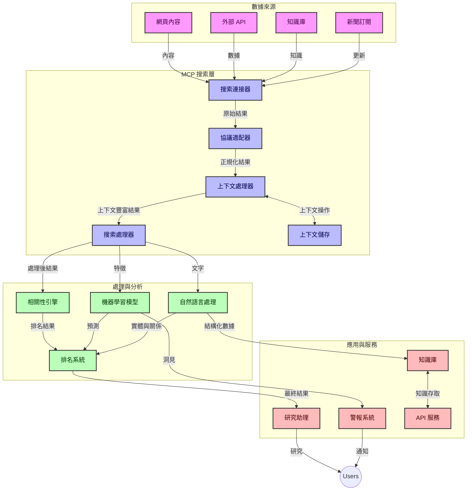
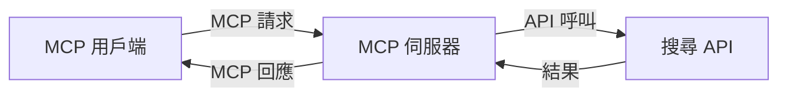
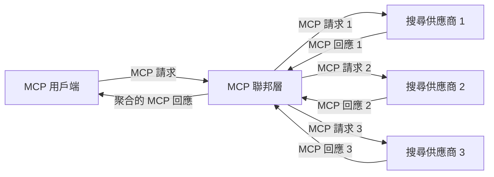
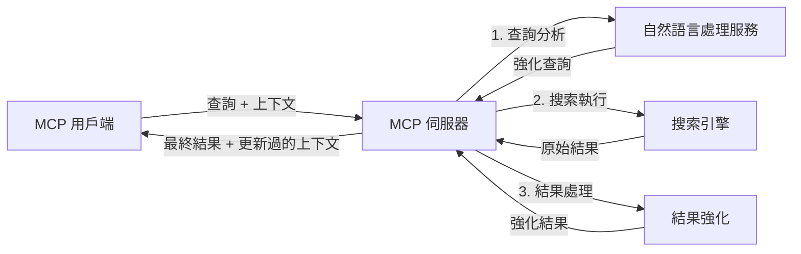

# 即時網絡搜尋的模型上下文協議

## 概覽

即時網絡搜尋已成為當今資訊驅動環境中的重要工具，應用程式需要即時存取來自互聯網的最新資訊，以提供相關且及時的回應。模型上下文協議（MCP）代表了優化這些即時搜尋流程的重要進展，提升搜尋效率，維護上下文完整性，並改善整體系統效能。

本模組探討 MCP 如何透過為 AI 模型、搜尋引擎及應用程式提供標準化的上下文管理方法，來改造即時網絡搜尋。

### 你將學到的內容

在這份綜合指南中，你將發現：

- MCP 如何在 AI 模型與即時網絡搜尋能力之間建立無縫橋樑
- 使用 MCP 實現高效且可擴展搜尋解決方案的架構模式
- 在多次查詢與互動間保存搜尋上下文的技術
- 針對各種搜尋場景的 Python 及 JavaScript 實務代碼實現
- 在 MCP 支援的搜尋系統中平衡相關性、新鮮度及效能的方法

## 即時網絡搜尋簡介

即時網絡搜尋是一種技術方法，能夠持續查詢、處理及分析網絡上發布或更新的資訊，使系統能夠在極低延遲下提供新鮮且相關的資訊。不同於傳統基於可能已延遲數小時或數日的索引資料運作的搜尋系統，即時搜尋處理來自網絡的即時資料，提供反映當前在線內容狀況的洞察與資訊。

### 即時網絡搜尋的核心概念：

- <strong>持續查詢處理</strong>：搜尋查詢對不斷更新的資料源進行處理
- <strong>優先新鮮度</strong>：系統設計以優先提供最新訊息
- <strong>相關性平衡</strong>：維持相關性與新鮮度的平衡
- <strong>可擴展架構</strong>：系統須能處理變動的查詢負載及資料規模
- <strong>上下文理解</strong>：多次搜尋中維持用戶上下文對於獲得有意義的結果至關重要
- <strong>動態查詢重構</strong>：根據上下文和先前結果自適應調整查詢
- <strong>多來源整合</strong>：結合多個搜尋供應商及網絡來源的結果
- <strong>語義理解</strong>：基於語意處理查詢與內容，而不僅僅是關鍵字
- <strong>即時排序</strong>：隨著新資訊可用，不斷調整結果排名

### 模型上下文協議與即時網絡搜尋

模型上下文協議（MCP）解決了即時網絡搜尋環境中的多項關鍵挑戰：

1. <strong>搜尋上下文保存</strong>：MCP 標準化跨分散搜尋元件的上下文維繫，確保 AI 模型和處理節點能存取相關的查詢歷史和用戶偏好。

2. <strong>高效查詢管理</strong>：通過提供結構化的上下文傳輸機制，MCP 減少了每次搜尋迭代中重複傳遞上下文的開銷。

3. <strong>互通性</strong>：MCP 創造了一種在不同搜尋技術與 AI 模型間共享上下文的共同語言，使架構更具彈性和可擴展性。

4. <strong>搜尋優化的上下文</strong>：MCP 實現能優先考慮最相關的上下文元素，優化效能與準確性。

5. <strong>自適應搜尋處理</strong>：透過 MCP 適當的上下文管理，搜尋系統能依據用戶需求及資訊環境的變化動態調整處理流程。

在從新聞聚合到研究助理等現代應用中，MCP 與網絡搜尋技術的整合使搜尋更智能、具上下文感知，能隨著用戶互動持續提供更相關的結果。

## 學習目標

在本課程結束時，你將能夠：

- 理解即時網絡搜尋的基本原理及其在現代應用的挑戰
- 解釋模型上下文協議（MCP）如何增強即時網絡搜尋能力
- 使用流行框架和 API 實作基於 MCP 的搜尋解決方案
- 設計及部署具可擴展性與高效能的 MCP 搜尋架構
- 將 MCP 概念應用於語義搜尋、研究助理及 AI 增強瀏覽等多種使用場景
- 評估 MCP 搜尋技術的新興趨勢與未來創新
- 開發從用戶互動中學習的上下文感知搜尋系統
- 使用標準化 MCP 協議將網絡搜尋功能整合進 AI 助手
- 創建多階段搜尋流程，根據上下文逐步優化結果
- 在保持完整上下文感知同時優化搜尋效能

### 定義與重要性

即時網絡搜尋是指以極低延遲持續查詢、檢索及交付網絡資訊。不同於週期性爬取並索引網頁的傳統搜尋引擎，即時搜尋目標是資訊發布後立即呈現，以便即時存取最新內容。

即時網絡搜尋的主要特點包括：

- <strong>新鮮度</strong>：優先處理最新的內容和更新
- <strong>持續處理</strong>：不斷監控新資訊
- <strong>查詢適應</strong>：根據上下文與反饋優化搜尋查詢
- <strong>即時交付</strong>：以最低延遲提供搜尋結果
- <strong>上下文保存</strong>：基於先前查詢提升相關性

### 傳統網絡搜尋的挑戰

傳統網絡搜尋在應用於即時場景時面臨若干限制：

1. <strong>上下文碎片化</strong>：難以跨多次查詢維持搜尋上下文
2. <strong>資訊新鮮度</strong>：存取及優先最新資訊的困難
3. <strong>整合複雜性</strong>：搜尋系統與應用間互通性問題
4. <strong>延遲問題</strong>：在全面搜尋與回應時間間取得平衡
5. <strong>相關性調整</strong>：在優先新鮮度同時保持準確和相關性

## 理解搜尋用的模型上下文協議 (MCP)

### MCP 在搜尋上下文中是什麼？

模型上下文協議（MCP）是一種標準化的通訊協議，旨在促進 AI 模型與應用之間的高效互動。於即時網絡搜尋中，MCP 提供了一個框架，用於：

- 保存查詢序列中的搜尋上下文
- 標準化搜尋查詢及結果格式
- 優化搜尋參數及結果的傳輸
- 強化模型與搜尋引擎之間的通訊

### 核心元件及架構

用於即時網絡搜尋的 MCP 架構包含若干關鍵元件：

1. <strong>查詢上下文處理器</strong>：管理並維持跨多次查詢的搜尋上下文
2. <strong>搜尋處理器</strong>：利用上下文感知技術處理進入的搜尋請求
3. <strong>協議轉接器</strong>：於不同搜尋 API 間轉換，同時保持上下文
4. <strong>上下文存儲</strong>：高效存取搜尋歷史與偏好
5. <strong>搜尋連接器</strong>：連接各種搜尋引擎及網絡 API



### MCP 如何提升即時網絡搜尋

MCP 通過以下方式解決傳統網絡搜尋的挑戰：

- <strong>上下文連續性</strong>：維持查詢間的關聯性，貫穿整個搜尋階段
- <strong>優化傳輸</strong>：透過智能上下文管理減少搜尋參數冗餘
- <strong>標準化介面</strong>：為搜尋元件提供一致的 API
- <strong>降低延遲</strong>：通過高效的上下文處理減少處理負擔
- <strong>提升相關性</strong>：透過保存多次查詢間的用戶意圖來增強搜尋結果的相關度

## 整合與實現

即時網絡搜尋系統需要精心的架構設計及實現，以維持效能與上下文完整性。模型上下文協議提供了標準化方法，將 AI 模型與搜尋技術整合，構建更先進、具上下文感知的搜尋流程。

### MCP 在搜尋架構中的整合概覽

在即時網絡搜尋環境中實施 MCP 時，需考慮多個重點：

1. <strong>搜尋上下文序列化</strong>：MCP 提供高效機制，將搜尋請求中的上下文信息編碼，確保關鍵上下文隨查詢流經處理流程。包括為搜尋相關元資料優化的標準化序列化格式。

2. <strong>有狀態搜尋處理</strong>：MCP 支援更智能的有狀態處理，透過維持跨搜尋迭代的一致上下文表示，特別適用於多階段搜尋流程中通過上下文優化結果。

3. <strong>查詢擴展與優化</strong>：MCP 在搜尋系統中的實踐可促進基於累積上下文的精密查詢擴展和優化，隨著搜尋階段推進，結果逐步提升相關性。

4. <strong>結果快取與優先排序</strong>：透過標準化的上下文處理，MCP 有助管理結果快取與優先排序，使組件能根據不斷變化的搜尋上下文調整。

5. <strong>搜尋聯邦與彙總</strong>：MCP 促進跨多個後端的搜尋聯邦，透過結構化的搜尋上下文表示，使來自不同來源的結果能更有意義地彙總。

在各種搜尋技術中實施 MCP，創造了統一的上下文管理方法，減少自訂整合代碼，同時增強系統隨著搜尋查詢演進保持上下文意義的能力。

### MCP 在多種網絡搜尋實作中的應用

這些範例遵循現行 MCP 規格，該規格聚焦於基於 JSON-RPC 的協議及不同的傳輸機制。代碼示範如何實現自訂搜尋整合，同時保持與 MCP 協議的完全相容性。


<details>
<summary>通用搜尋 API 的 Python 實作</summary>

```python
import asyncio
import json
import aiohttp
from typing import Dict, Any, Optional, List
from contextlib import asynccontextmanager
from collections.abc import AsyncIterator

# 載入標準 MCP 函式庫
from mcp.client.session import ClientSession
from mcp.client.streamable_http import streamablehttp_client
from mcp.types import TextContent, CreateMessageRequestParams, CreateMessageResult
from mcp.server.fastmcp import FastMCP

# 建立用於網絡搜索的 FastMCP 伺服器
search_server = FastMCP("WebSearch")

# 用於處理網絡搜索操作的類別
class WebSearchHandler:
    def __init__(self, api_endpoint: str, api_key: str):
        self.api_endpoint = api_endpoint
        self.api_key = api_key
        self.session = None
        
    async def initialize(self):
        """Initialize the HTTP session"""
        self.session = aiohttp.ClientSession(
            headers={"Authorization": f"Bearer {self.api_key}"}
        )
    
    async def close(self):
        """Close the HTTP session"""
        if self.session:
            await self.session.close()
            
    async def perform_search(self, query: str, max_results: int = 5, 
                           include_domains: List[str] = None, 
                           exclude_domains: List[str] = None,
                           time_period: str = "any") -> Dict[str, Any]:
        """Perform web search using the search API"""
        # 建構搜尋參數
        search_params = {
            "q": query,
            "limit": max_results,
            "time": time_period
        }
        
        if include_domains:
            search_params["site"] = ",".join(include_domains)
            
        if exclude_domains:
            search_params["exclude_site"] = ",".join(exclude_domains)
        
        # 執行搜尋請求
        try:
            async with self.session.get(
                self.api_endpoint,
                params=search_params
            ) as response:
                if response.status != 200:
                    error_text = await response.text()
                    raise Exception(f"Search API error: {response.status} - {error_text}")
                
                search_data = await response.json()
                
                # 將 API 專用回應轉換為標準格式
                results = []
                for item in search_data.get("results", []):
                    results.append({
                        "title": item.get("title", ""),
                        "url": item.get("url", ""),
                        "snippet": item.get("snippet", ""),
                        "date": item.get("published_date", ""),
                        "source": item.get("source", "")
                    })
                
                return {
                    "query": query,
                    "totalResults": len(results),
                    "results": results
                }
        except Exception as e:
            print(f"Search API request error: {e}")
            raise

# 初始化搜尋處理器
search_handler = WebSearchHandler(
    api_endpoint="https://api.search-service.example/search",
    api_key="your-api-key-here"
)

# 設定生命週期以管理搜尋處理器
@asyncio.asynccontextmanager
async def app_lifespan(server: FastMCP):
    """Manage application lifecycle"""
    await search_handler.initialize()
    try:
        yield {"search_handler": search_handler}
    finally:
        await search_handler.close()

# 設定伺服器的生命週期
search_server = FastMCP("WebSearch", lifespan=app_lifespan)

# 註冊一個網絡搜尋工具
@search_server.tool()
async def web_search(query: str, max_results: int = 5, 
                   include_domains: List[str] = None,
                   exclude_domains: List[str] = None,
                   time_period: str = "any") -> Dict[str, Any]:
    """
    Search the web for information
    
    Args:
        query: The search query
        max_results: Maximum number of results to return (default: 5)
        include_domains: List of domains to include in search results
        exclude_domains: List of domains to exclude from search results
        time_period: Time period for results ("day", "week", "month", "any")
        
    Returns:
        Dictionary containing search results
    """
    ctx = search_server.get_context()
    search_handler = ctx.request_context.lifespan_context["search_handler"]
    
    results = await search_handler.perform_search(
        query=query,
        max_results=max_results,
        include_domains=include_domains,
        exclude_domains=exclude_domains,
        time_period=time_period
    )
    
    return results

# 用戶端使用範例
async def client_example():
    # 使用可串流 HTTP 傳輸連接搜尋伺服器
    async with streamablehttp_client("http://localhost:8000/mcp") as (read, write, _):
        async with ClientSession(read, write) as session:
            # 初始化連線
            await session.initialize()
            
            # 呼叫網絡搜尋工具
            search_results = await session.call_tool(
                "web_search", 
                {
                    "query": "latest developments in AI and Model Context Protocol",
                    "max_results": 5,
                    "time_period": "day",
                    "include_domains": ["github.com", "microsoft.com"]
                }
            )
            
            print(f"Search results: {search_results}")

# 伺服器執行範例
if __name__ == "__main__":
    # 使用可串流 HTTP 傳輸執行伺服器
    search_server.run(transport="streamable-http")
```
</details> 

<details>
<summary>基於瀏覽器搜尋的 JavaScript 實作</summary>


```javascript
// 用於網頁搜索的 MCP 服務器實作
import { McpServer, ResourceTemplate } from '@modelcontextprotocol/sdk/server/mcp.js';
import { StreamableHTTPServerTransport } from '@modelcontextprotocol/sdk/server/streamableHttp.js';
import { z } from 'zod';

// 創建一個用於網頁搜索的 MCP 服務器
const searchServer = new McpServer({
    name: "BrowserSearch",
    description: "A server that provides web search capabilities"
});

// 搜索服務類別
class SearchService {
    constructor(searchApiUrl, apiKey) {
        this.searchApiUrl = searchApiUrl;
        this.apiKey = apiKey;
    }

    async performSearch(parameters) {
        const {
            query = '',
            maxResults = 5,
            includeDomains = [],
            excludeDomains = [],
            timePeriod = 'any'
        } = parameters;
        
        // 使用參數構建搜索 URL
        const url = new URL(this.searchApiUrl);
        url.searchParams.append('q', query);
        url.searchParams.append('limit', maxResults);
        url.searchParams.append('time', timePeriod);
        
        if (includeDomains.length > 0) {
            url.searchParams.append('site', includeDomains.join(','));
        }
        
        if (excludeDomains.length > 0) {
            url.searchParams.append('exclude_site', excludeDomains.join(','));
        }
        
        try {
            const response = await fetch(url.toString(), {
                method: 'GET',
                headers: {
                    'Authorization': `Bearer ${this.apiKey}`,
                    'Content-Type': 'application/json'
                }
            });
            
            if (!response.ok) {
                const errorText = await response.text();
                throw new Error(`Search API error: ${response.status} - ${errorText}`);
            }
            
            const searchData = await response.json();
            
            // 將 API 專用的回應轉換為標準格式
            const results = searchData.results?.map(item => ({
                title: item.title || '',
                url: item.url || '',
                snippet: item.snippet || '',
                date: item.published_date || '',
                source: item.source || ''
            })) || [];
            
            return {
                query,
                totalResults: results.length,
                results
            };
        } catch (error) {
            console.error('Search API request error:', error);
            throw error;
        }
    }
}

// 初始化搜索服務
const searchService = new SearchService(
    'https://api.search-service.example/search',
    'your-api-key-here'
);

// 為服務器設置上下文提供者
searchServer.setContextProvider(() => {
    return {
        searchService
    };
});

// 註冊網頁搜索工具
searchServer.tool({
    name: 'web_search',
    description: 'Search the web for information',
    parameters: {
        type: 'object',
        properties: {
            query: {
                type: 'string',
                description: 'The search query'
            },
            maxResults: {
                type: 'integer',
                description: 'Maximum number of results to return',
                default: 5
            },
            includeDomains: {
                type: 'array',
                items: { type: 'string' },
                description: 'List of domains to include in search results'
            },
            excludeDomains: {
                type: 'array',
                items: { type: 'string' },
                description: 'List of domains to exclude from search results'
            },
            timePeriod: {
                type: 'string',
                description: 'Time period for results',
                enum: ['day', 'week', 'month', 'any'],
                default: 'any'
            }
        },
        required: ['query']
    },
    handler: async (params, context) => {
        const { searchService } = context;
        return await searchService.performSearch(params);
    }
});

// 連接到搜索服務器的範例客戶端程式碼
import { Client } from '@modelcontextprotocol/sdk/client/index.js';
import { StreamableHTTPClientTransport } from '@modelcontextprotocol/sdk/client/streamableHttp.js';

async function connectToSearchServer() {
    // 連接到搜索服務器
    const transport = new StreamableHTTPClientTransport(
        new URL('http://localhost:8000/mcp')
    );
    
    const client = new Client({
        name: 'search-client',
        version: '1.0.0'
    });
    
    await client.connect(transport);
    
    // 執行搜索工具
    const searchResults = await client.callTool({
        name: 'web_search',
        arguments: {
            query: 'Model Context Protocol implementation examples',
            maxResults: 10,
            timePeriod: 'week',
            includeDomains: ['github.com', 'docs.microsoft.com']
        }
    });
    
    console.log('Search results:', searchResults);
    
    // 清理工作
    await client.disconnect();
}

// 啟動服務器
const transport = new StreamableHTTPServerTransport();
await searchServer.connect(transport);
console.log('Search server running at http://localhost:8000/mcp');

// 在單獨的進程中或服務器啟動後
// connectToSearchServer().catch(console.error);
```
</details> 


## 代碼範例免責聲明

> <strong>重要說明</strong>：下列代碼範例展示模型上下文協議（MCP）與網絡搜尋功能的整合。雖然遵循官方 MCP SDK 的結構與模式，但為教學目的已做簡化。
> 
> 這些範例展示：
> 
> 1. **Python 實作**：FastMCP 伺服器實現，提供網絡搜尋工具並連接外部搜尋 API。示範完善的生命週期管理、上下文處理及工具實現，遵循[官方 MCP Python SDK](https://github.com/modelcontextprotocol/python-sdk)的模式。該伺服器使用推薦的 Streamable HTTP 傳輸，已取代舊有的 SSE 傳輸作為正式部署標準。
> 
> 2. **JavaScript 實作**：使用[官方 MCP TypeScript SDK](https://github.com/modelcontextprotocol/typescript-sdk)中的 FastMCP 模式，以 TypeScript/JavaScript 編寫的搜尋伺服器，具有正確的工具定義及客戶端連接。遵循最新推薦的會話管理及上下文保存模式。
> 
> 這些範例在製品環境中需加入更多錯誤處理、身份驗證及特定 API 整合代碼。範例中的搜尋 API 端點 (`https://api.search-service.example/search`) 為範例佔位符，需替換為真實搜尋服務端點。
> 
> 有關完整實作細節及最新方法，
> 請參考[官方 MCP 規範](https://modelcontextprotocol.io/specification/2026-07-28/)
> 與 SDK 文件。

## 核心概念

### 模型上下文協議（MCP）框架

MCP 根本上為 AI 模型、應用及服務間交換上下文提供標準化方式。在即時網絡搜尋中，此框架對創建連貫的多輪搜尋體驗不可或缺。重要元件包括：

1. **客戶端-伺服器架構**：MCP 建立清晰的搜尋客戶端（請求者）與搜尋伺服器（提供者）分離，支援彈性部署模式。

2. **JSON-RPC 通訊**：協議利用 JSON-RPC 交換訊息，與網絡技術相容並易於跨平台實作。

3. <strong>上下文管理</strong>：MCP 定義了結構化方法，用於在多次互動中維護、更新並利用搜尋上下文。

4. <strong>工具定義</strong>：搜尋能力以標準化工具形式暴露，具明確的參數及回傳值。

5. <strong>串流支持</strong>：協議支持串流結果，適合即時搜尋中漸進式呈現結果的需求。

### 網絡搜尋整合模式

整合 MCP 與網絡搜尋時，出現多種模式：

#### 1. 直接搜尋供應商整合



此模式中，MCP 伺服器直接對接一個或多個搜尋 API，將 MCP 請求轉換為 API 專用呼叫，並將結果格式化為 MCP 回應。

#### 2. 保持上下文的聯邦搜尋



該模式將搜尋查詢分散到多個 MCP 相容的搜尋供應商，每個供應商可能專長不同內容或搜尋能力，同時維持統一上下文。

#### 3. 以上下文增強的搜尋鏈



此模式將搜尋流程分為多階段，於每一環節中增強上下文，結果逐漸提升相關性。

### 搜尋上下文元件

在基於 MCP 的網絡搜尋中，上下文通常包含：

- <strong>查詢歷史</strong>：會話中的先前搜尋查詢
- <strong>用戶偏好</strong>：語言、地區、安全搜尋設置
- <strong>互動歷史</strong>：已點擊結果、在結果上的停留時間
- <strong>搜尋參數</strong>：篩選器、排序規則及其他搜尋修飾符
- <strong>領域知識</strong>：與搜尋相關的主題特定上下文
- <strong>時間上下文</strong>：基於時間的相關性因素
- <strong>來源偏好</strong>：信任或偏好的資訊來源

## 使用案例與應用

### 研究及資訊蒐集

MCP 通過以下方式提升研究流程：

- 保存研究會話中的上下文
- 支援更複雜及上下文相關的查詢
- 支持多來源搜尋聯邦
- 促進從搜尋結果中萃取知識

### 即時新聞及趨勢監控

MCP 支援新聞監控提供以下優勢：

- 幾乎即時發掘新興新聞事件
- 上下文過濾相關資訊
- 多來源的主題與實體追蹤
- 基於用戶上下文的個人化新聞提醒

### AI 增強瀏覽與研究

MCP 開啟 AI 增強瀏覽的新可能：

- 根據當前瀏覽活動提供上下文搜尋建議
- 與 LLM 助手無縫整合網絡搜尋
- 維持上下文的多輪搜尋優化
- 強化事實查核與資訊驗證

## 未來趨勢與創新

### MCP 在網絡搜尋的演進

展望未來，我們預期 MCP 將發展以解決：


- <strong>多模態搜尋</strong>：整合文字、圖片、音訊及影片搜尋並保留上下文
- <strong>去中心化搜尋</strong>：支援分散式及聯邦式搜尋生態系統
- <strong>搜尋隱私</strong>：具上下文感知的隱私保護搜尋機制
- <strong>查詢理解</strong>：對自然語言搜尋查詢作深度語意解析

### 技術潛在進展

未來將塑造 MCP 搜尋的嶄新技術：

1. <strong>神經搜尋架構</strong>：為 MCP 優化的基於嵌入的搜尋系統
2. <strong>個人化搜尋上下文</strong>：隨時間學習個別用戶的搜尋模式
3. <strong>知識圖譜整合</strong>：藉由特定領域的知識圖譜提升上下文搜尋
4. <strong>跨模態上下文</strong>：維持不同搜尋模態間的上下文

## 實作練習

### 練習 1：設定基礎 MCP 搜尋流程

在此練習中，您將學習如何：
- 配置基本的 MCP 搜尋環境
- 實作網頁搜尋的上下文處理器
- 測試並驗證搜尋迭代中的上下文保存

### 練習 2：使用 MCP 搜尋構建研究助理

創建一個完整的應用程式，能夠：
- 處理自然語言研究問題
- 執行具上下文感知的網頁搜尋
- 從多重資訊來源綜合資訊
- 呈現組織良好的研究成果

### 練習 3：實作多來源搜尋聯合與 MCP

進階練習涵蓋：
- 具上下文感知的查詢分派至多個搜尋引擎
- 結果排序和合併
- 搜尋結果的上下文去重
- 處理來源特定的元數據

## 額外資源

- [Model Context Protocol 規範](https://modelcontextprotocol.io/specification/2026-07-28/) - 官方 MCP 規範與詳細協定文件
- [Model Context Protocol 文件](https://modelcontextprotocol.io/) - 詳盡教學及實作指南
- [MCP Python SDK](https://github.com/modelcontextprotocol/python-sdk) - MCP 協定官方 Python 實作
- [MCP TypeScript SDK](https://github.com/modelcontextprotocol/typescript-sdk) - MCP 協定官方 TypeScript 實作
- [MCP 參考伺服器](https://github.com/modelcontextprotocol/servers) - MCP 伺服器參考實作
- [Bing 網頁搜尋 API 文件](https://learn.microsoft.com/en-us/bing/search-apis/bing-web-search/overview) - 微軟網頁搜尋 API
- [Google 自訂搜尋 JSON API](https://developers.google.com/custom-search/v1/overview) - Google 可程式化搜尋引擎
- [SerpAPI 文件](https://serpapi.com/search-api) - 搜尋引擎結果頁 API
- [Meilisearch 文件](https://www.meilisearch.com/docs) - 開源搜尋引擎
- [Elasticsearch 文件](https://www.elastic.co/guide/index.html) - 分散式搜尋及分析引擎
- [LangChain 文件](https://python.langchain.com/docs/get_started/introduction) - 使用大型語言模型建立應用

## 學習成果

完成本模組後，您將能夠：

- 了解即時網頁搜尋的基本原理及挑戰
- 解釋 Model Context Protocol (MCP) 如何強化即時網頁搜尋能力
- 使用主流框架及 API 實作基於 MCP 的搜尋解決方案
- 設計並部署可擴展、高效能的 MCP 搜尋架構
- 將 MCP 概念應用於語意搜尋、研究助理及 AI 輔助瀏覽等多種使用案例
- 評估基於 MCP 的搜尋技術新興趨勢與未來創新


### 信任與安全考量

在實作基於 MCP 的網頁搜尋解決方案時，請記住 MCP 規範中的這些重要原則：

1. <strong>用戶同意與控制</strong>：用戶必須明確同意並了解所有資料存取與操作。對於可能存取外部資料來源的網頁搜尋實作而言，此原則尤為重要。

2. <strong>資料隱私</strong>：妥善處理搜尋查詢與結果，特別是可能含有敏感資訊時。實施適當的存取控制以保護用戶資料。

3. <strong>工具安全</strong>：對搜尋工具實作正確的授權與驗證，因其可能透過任意程式碼執行造成安全風險。工具行為的描述應被視為不可信，除非來自可信伺服器。

4. <strong>明確文件</strong>：按照 MCP 規範的實作指南，提供清楚的文件說明 MCP 搜尋實作的能力、限制及安全考量。

5. <strong>健全同意流程</strong>：建立明確解釋每個工具功能的健全同意與授權流程，特別是與外部網路資源互動的工具，於授權使用前應清楚說明。

有關 MCP 安全與信任考量的完整細節，請參考
[官方文件](https://modelcontextprotocol.io/specification/2026-07-28/basic/security_best_practices)。

## 下一步

- [5.12 Model Context Protocol 伺服器之 Entra ID 認證](../mcp-security-entra/README.md)

---

<!-- CO-OP TRANSLATOR DISCLAIMER START -->
**免責聲明**：
本文件由 AI 翻譯服務 [Co-op Translator](https://github.com/Azure/co-op-translator) 翻譯而成。雖然我們致力於確保準確性，但請注意，機器自動翻譯可能包含錯誤或不準確之處。原始文件的母語版本應被視為權威來源。對於重要資訊，建議進行專業人工翻譯。我們不對因使用本翻譯而產生的任何誤解或誤釋承擔責任。
<!-- CO-OP TRANSLATOR DISCLAIMER END -->