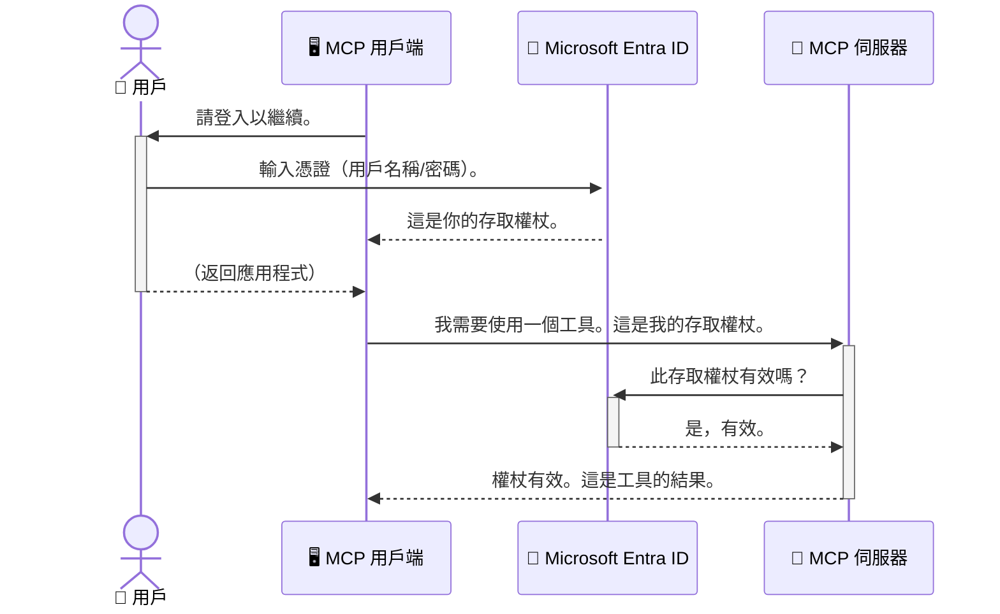

# 保護 AI 工作流程：Model Context Protocol 伺服器的 Entra ID 認證

> [!NOTE]
> 本課程中的遠端伺服器程式碼保護傳統的 `/sse` 和 `/message`
> 端點，並針對 MCP `2025-11-25`。請保留其身份和令牌驗證
> 實作，但對於新實作，請使用與 `2026-07-28` 兼容的 Streamable HTTP 傳輸。


## 介紹
保護您的 Model Context Protocol (MCP) 伺服器就像鎖好您家的前門一樣重要。讓 MCP 伺服器開放，就會讓您的工具和資料遭遇未經授權的存取風險，可能導致安全漏洞。Microsoft Entra ID 提供強大的雲端身份與存取管理解決方案，確保只有授權使用者與應用程式能與您的 MCP 伺服器互動。本節將教您如何使用 Entra ID 認證保護您的 AI 工作流程。

## 學習目標
在本節結束後，您將能夠：

- 了解保護 MCP 伺服器的重要性。
- 解釋 Microsoft Entra ID 及 OAuth 2.0 認證的基本知識。
- 辨識公開用戶端與機密用戶端的差異。
- 在本機（公開用戶端）及遠端（機密用戶端）MCP 伺服器場景中實作 Entra ID 認證。
- 在開發 AI 工作流程時，應用安全最佳實務。

## 安全與 MCP

就如同您不會將家門敞開不鎖一樣，也不應開放 MCP 伺服器予任何人存取。保護您的 AI 工作流程對於打造穩健、可靠且安全的應用程式至關重要。本章會介紹如何使用 Microsoft Entra ID 來保護您的 MCP 伺服器，確保只有授權的使用者與應用程式能使用您的工具和資料。

## 為何 MCP 伺服器的安全性至關重要

想像您的 MCP 伺服器中有一個工具可以寄送電子郵件或存取客戶資料庫。如果伺服器未受保護，任何人都可能使用該工具，導致未授權的資料存取、垃圾郵件或其他惡意活動。

實作認證即確保每一次向伺服器的請求均已驗證，確認發出請求的使用者或應用程式身分。這是保護 AI 工作流程的首要且最關鍵的步驟。

## Microsoft Entra ID 簡介

[**Microsoft Entra ID**](https://adoption.microsoft.com/microsoft-security/entra/) 是一項雲端身份與存取管理服務。可將其視為您應用程式的萬用安全守衛。它處理驗證使用者身份（驗證）及決定允許操作（授權）等複雜流程。

使用 Entra ID，您可以：

- 啟用使用者安全登入。
- 保護 API 與服務。
- 從中央位置管理存取政策。

對 MCP 伺服器來說，Entra ID 提供一套穩健且廣受信任的解決方案，管理誰能存取您的伺服器功能。

---

## 了解祕密：Entra ID 認證如何運作

Entra ID 採用像是 **OAuth 2.0** 的開放標準來處理認證。儘管細節可能複雜，但核心概念很簡單，可以用類比方式理解。

### OAuth 2.0 輕鬆入門：代客鑰匙

將 OAuth 2.0 想像成一項汽車代客泊車服務。當您抵達餐廳時，不會將您的主鑰匙交給代客，而是交給他一把<strong>代客鑰匙</strong>，其權限有限 — 可以啟動車輛並鎖門，但無法開啟車尾箱或手套箱。

在此類比中：

- <strong>您</strong> 是 <strong>使用者</strong>。
- <strong>您的車</strong> 是擁有寶貴工具和資料的 **MCP 伺服器**。
- <strong>代客</strong> 是 **Microsoft Entra ID**。
- <strong>停車場服務員</strong> 是 **MCP 用戶端**（試圖存取伺服器的應用程式）。
- <strong>代客鑰匙</strong> 是 <strong>存取令牌</strong>。

存取令牌是 MCP 用戶端在您登入後從 Entra ID 收到的一段安全文字字串。用戶端會在每次請求時將此令牌傳送給 MCP 伺服器。伺服器透過驗證令牌確保請求合法且用戶端具備必要權限，且全程無需處理您的實際認證（例如密碼）。

### 認證流程

實際運作流程如下：



### 認識 Microsoft Authentication Library (MSAL)

在開始程式碼示範前，先介紹範例中會用到的重要元件：「**Microsoft Authentication Library (MSAL)**」。

MSAL 是微軟開發的函式庫，讓開發者更輕鬆處理認證工作。您無需撰寫所有複雜程式碼來處理安全令牌、管理登入和重新整理會話，MSAL 會負責繁重的部分。

推薦使用 MSAL 是因為：

- **安全性高：** 它實作產業標準協定和安全最佳實務，讓您的程式碼風險降低。
- **簡化開發：** 它將 OAuth 2.0 和 OpenID Connect 協定的複雜性抽象化，讓您只需幾行程式碼即可添加強健的認證功能。
- **持續維護：** 微軟積極維護 MSAL，持續應對新的安全威脅與平臺變動。

MSAL 支援多種語言及應用程式框架，包括 .NET、JavaScript/TypeScript、Python、Java、Go，以及 iOS 和 Android 等行動平臺。這意味著您可在整個技術堆疊中使用一致的認證模式。

欲了解更多 MSAL 相關資訊，請參閱官方 [MSAL 概述文件](https://learn.microsoft.com/entra/identity-platform/msal-overview)。

---

## 使用 Entra ID 保護您的 MCP 伺服器：逐步教學

現在，讓我們實作如何使用 Entra ID 保護本機 MCP 伺服器（透過 `stdio` 通訊）。此範例使用的是<strong>公開用戶端</strong>，適用於運行於使用者機器上的應用程式，如桌面應用或本地開發伺服器。

### 情境一：保護本機 MCP 伺服器（以公開用戶端）

在此情境中，我們檢視一個本機執行且透過 `stdio` 通訊的 MCP 伺服器，它使用 Entra ID 來認證使用者，然後才允許存取其工具。該伺服器具備一個工具，用於從 Microsoft Graph API 取得使用者的資料。

#### 1. 在 Entra ID 中設定應用程式

寫程式碼前，您需先在 Microsoft Entra ID 中註冊您的應用程式。這告訴 Entra ID 您的應用程式資訊，並授予使用認證服務的權限。

1. 前往 **[Microsoft Entra 入口網站](https://entra.microsoft.com/)**。
2. 進入 <strong>應用程式註冊</strong>，點選 <strong>新增註冊</strong>。
3. 為您的應用程式命名（例如：「My Local MCP Server」）。
4. 在 <strong>支援的帳戶類型</strong> 選擇 <strong>僅限此組織目錄中的帳戶</strong>。
5. 這個範例可將 **重新導向 URI** 留空。
6. 點選 <strong>註冊</strong>。

註冊完成後，請記下 **應用程式 (用戶端) ID** 與 **目錄 (租戶) ID**，稍後程式中會用到。

#### 2. 程式碼解析

看看負責認證的程式碼重點。完整程式碼可參考[Entra ID - 本機 - WAM](https://github.com/Azure-Samples/mcp-auth-servers/tree/main/src/entra-id-local-wam) 資料夾，位於 [mcp-auth-servers GitHub 程式庫](https://github.com/Azure-Samples/mcp-auth-servers)。

**`AuthenticationService.cs`**

此類別負責處理與 Entra ID 的互動。

- **`CreateAsync`**：此方法會初始化 MSAL (Microsoft Authentication Library) 的 `PublicClientApplication`，並配置您的應用程式 `clientId` 與 `tenantId`。
- **`WithBroker`**：啟用使用代理（如 Windows Web Account Manager），提供更安全且無縫的單一登入體驗。
- **`AcquireTokenAsync`**：核心方法。它先嘗試靜默取得令牌（若已有有效登入會話，使用者不需重新登入）。若無法靜默取得，則會要求使用者互動登入。

```csharp
// Simplified for clarity
public static async Task<AuthenticationService> CreateAsync(ILogger<AuthenticationService> logger)
{
    var msalClient = PublicClientApplicationBuilder
        .Create(_clientId) // Your Application (client) ID
        .WithAuthority(AadAuthorityAudience.AzureAdMyOrg)
        .WithTenantId(_tenantId) // Your Directory (tenant) ID
        .WithBroker(new BrokerOptions(BrokerOptions.OperatingSystems.Windows))
        .Build();

    // ... cache registration ...

    return new AuthenticationService(logger, msalClient);
}

public async Task<string> AcquireTokenAsync()
{
    try
    {
        // Try silent authentication first
        var accounts = await _msalClient.GetAccountsAsync();
        var account = accounts.FirstOrDefault();

        AuthenticationResult? result = null;

        if (account != null)
        {
            result = await _msalClient.AcquireTokenSilent(_scopes, account).ExecuteAsync();
        }
        else
        {
            // If no account, or silent fails, go interactive
            result = await _msalClient.AcquireTokenInteractive(_scopes).ExecuteAsync();
        }

        return result.AccessToken;
    }
    catch (Exception ex)
    {
        _logger.LogError(ex, "An error occurred while acquiring the token.");
        throw; // Optionally rethrow the exception for higher-level handling
    }
}
```

**`Program.cs`**

這裡設定 MCP 伺服器並整合認證服務。

- **`AddSingleton<AuthenticationService>`**：註冊 `AuthenticationService` 到相依注入容器，方便應用程式其他部分（例如工具）使用。
- **`GetUserDetailsFromGraph` 工具**：此工具需 `AuthenticationService` 實例。它在執行前會呼叫 `authService.AcquireTokenAsync()` 以取得有效存取令牌。認證成功後，工具使用該令牌呼叫 Microsoft Graph API，取得使用者資料。

```csharp
// Simplified for clarity
[McpServerTool(Name = "GetUserDetailsFromGraph")]
public static async Task<string> GetUserDetailsFromGraph(
    AuthenticationService authService)
{
    try
    {
        // This will trigger the authentication flow
        var accessToken = await authService.AcquireTokenAsync();

        // Use the token to create a GraphServiceClient
        var graphClient = new GraphServiceClient(
            new BaseBearerTokenAuthenticationProvider(new TokenProvider(authService)));

        var user = await graphClient.Me.GetAsync();

        return System.Text.Json.JsonSerializer.Serialize(user);
    }
    catch (Exception ex)
    {
        return $"Error: {ex.Message}";
    }
}
```

#### 3. 功能整合流程

1. MCP 用戶端嘗試使用 `GetUserDetailsFromGraph` 工具，工具會先呼叫 `AcquireTokenAsync`。
2. `AcquireTokenAsync` 觸發 MSAL 檢查是否已有有效令牌。
3. 若無令牌，MSAL 會透過代理提示使用者使用 Entra ID 帳號登入。
4. 使用者登入後，Entra ID 發出存取令牌。
5. 工具取得令牌並使用它發起安全的 Microsoft Graph API 請求。
6. 使用者資料回傳給 MCP 用戶端。

此流程確保只有已認證使用者能使用該工具，有效保障本機 MCP 伺服器安全。

### 情境二：保護遠端 MCP 伺服器（以機密用戶端）

當 MCP 伺服器執行於遠端機器（例如雲端伺服器）且透過 HTTP Streaming 等協議通訊時，安全性需求不同。此時應使用<strong>機密用戶端</strong>及<strong>授權碼流程</strong>（Authorization Code Flow）。此法更安全，因為不會將應用程式機密公開於瀏覽器。

本範例以 TypeScript 為基礎，使用 Express.js 處理 HTTP 請求的 MCP 伺服器。

#### 1. 在 Entra ID 中設定應用程式

Entra ID 設定類似公開用戶端，只是要額外建立<strong>用戶端密鑰</strong>。

1. 前往 **[Microsoft Entra 入口網站](https://entra.microsoft.com/)**。
2. 在您的應用程式註冊中，前往 <strong>憑證與密鑰</strong> 頁籤。
3. 點選 <strong>新增用戶端密鑰</strong>，輸入描述後點選 <strong>新增</strong>。
4. **重要提示：** 請立即複製密鑰值，之後無法再次查看。
5. 您還需設定 **重新導向 URI**。前往 <strong>認證</strong> 頁籤，點選 <strong>新增平台</strong>，選擇 <strong>網站</strong>，並輸入應用程式的重新導向 URI（例如 `http://localhost:3001/auth/callback`）。

> **⚠️ 重要安全提醒：** 對於生產環境應用，微軟強烈建議使用 <strong>免密認證</strong> 方法，如 **Managed Identity** 或 **Workload Identity Federation**，取代用戶端密鑰。用戶端密鑰存在安全風險，可能被公開或外洩。Managed identity 提供更安全的方式，消除您在程式碼或設定中儲存憑證的需求。
>
> 如需了解 Managed identities 及如何實作，請參閱 [Azure 資源的 Managed identities 概述](https://learn.microsoft.com/entra/identity/managed-identities-azure-resources/overview)。

#### 2. 程式碼解析

本範例採用會話機制。使用者認證後，伺服器會在會話中儲存存取令牌與重新整理令牌，並發出會話令牌給使用者，供後續請求使用。完整程式碼可參考 [Entra ID - 機密用戶端](https://github.com/Azure-Samples/mcp-auth-servers/tree/main/src/entra-id-cca-session) 資料夾，位於 [mcp-auth-servers GitHub 程式庫](https://github.com/Azure-Samples/mcp-auth-servers)。

**`Server.ts`**

此檔案設定 Express 伺服器及 MCP 傳輸層。

- **`requireBearerAuth`**：此中介軟體用於保護 `/sse` 與 `/message` 端點。它會檢查請求的 `Authorization` 標頭中是否含有有效的 Bearer 令牌。
- **`EntraIdServerAuthProvider`**：自訂類別，實作了 `McpServerAuthorizationProvider` 介面，負責處理 OAuth 2.0 流程。
- **`/auth/callback`**：此端點用於處理使用者認證完成後來自 Entra ID 的重新導向。它會用授權碼換取存取令牌與重新整理令牌。

```typescript
// 簡化以提高清晰度
const app = express();
const { server } = createServer();
const provider = new EntraIdServerAuthProvider();

// 保護 SSE 端點
app.get("/sse", requireBearerAuth({
  provider,
  requiredScopes: ["User.Read"]
}), async (req, res) => {
  // ... 連接到傳輸層 ...
});

// 保護消息端點
app.post("/message", requireBearerAuth({
  provider,
  requiredScopes: ["User.Read"]
}), async (req, res) => {
  // ... 處理消息 ...
});

// 處理 OAuth 2.0 回調
app.get("/auth/callback", (req, res) => {
  provider.handleCallback(req.query.code, req.query.state)
    .then(result => {
      // ... 處理成功或失敗 ...
    });
});
```

**`Tools.ts`**

此檔案定義 MCP 伺服器提供的工具。`getUserDetails` 工具與先前範例類似，但它從會話中取得存取令牌。

```typescript
// 為清晰起見進行簡化
server.setRequestHandler(CallToolRequestSchema, async (request) => {
  const { name } = request.params;
  const context = request.params?.context as { token?: string } | undefined;
  const sessionToken = context?.token;

  if (name === ToolName.GET_USER_DETAILS) {
    if (!sessionToken) {
      throw new AuthenticationError("Authentication token is missing or invalid. Ensure the token is provided in the request context.");
    }

    // 從會話存儲中獲取 Entra ID 令牌
    const tokenData = tokenStore.getToken(sessionToken);
    const entraIdToken = tokenData.accessToken;

    const graphClient = Client.init({
      authProvider: (done) => {
        done(null, entraIdToken);
      }
    });

    const user = await graphClient.api('/me').get();

    // ... 返回用戶詳細資訊 ...
  }
});
```

**`auth/EntraIdServerAuthProvider.ts`**

此類別負責處理：

- 將使用者導向至 Entra ID 登入頁面。
- 用授權碼交換存取令牌。
- 將令牌儲存至 `tokenStore`。
- 在令牌過期時重新整理存取令牌。


#### 3. 它們如何協同運作

1. 當使用者首次嘗試連接到 MCP 伺服器時，`requireBearerAuth` 中介軟體會發現他們沒有有效的會話，並會將他們重定向到 Entra ID 登入頁面。
2. 使用者使用其 Entra ID 帳戶登入。
3. Entra ID 將使用者重定向回 `/auth/callback` 端點，並帶有授權碼。
4. 伺服器用該授權碼交換取得存取權杖和刷新權杖，將它們儲存，並建立一個會話權杖傳送給用戶端。
5. 用戶端現在可以在所有後續對 MCP 伺服器的請求中，於 `Authorization` 標頭中使用這個會話權杖。
6. 當呼叫 `getUserDetails` 工具時，它會使用會話權杖查找 Entra ID 存取權杖，然後使用該權杖呼叫 Microsoft Graph API。

這個流程比公共用戶端流程複雜，但對於公開的網路端點是必要的。由於遠端 MCP 伺服器可透過公共網際網路被存取，它們需要更強的安全措施來防止未經授權的存取和潛在攻擊。


## 安全最佳實踐

- **始終使用 HTTPS**：加密用戶端與伺服器間的通訊，以保護權杖不被攔截。
- **實施基於角色的存取控制（RBAC）**：不僅檢查使用者是否已驗證；還要檢查他們有權執行什麼操作。你可以在 Entra ID 中定義角色，並在你的 MCP 伺服器中進行檢查。
- <strong>監控與稽核</strong>：記錄所有驗證事件，以便偵測並回應可疑活動。
- <strong>處理速率限制和節流</strong>：Microsoft Graph 和其他 API 實施速率限制以防止濫用。在你的 MCP 伺服器中實作指數退避和重試邏輯，以優雅地處理 HTTP 429（請求過多）回應。考慮快取常用資料以減少 API 呼叫。
- <strong>安全儲存權杖</strong>：安全地儲存存取權杖和刷新權杖。對於本地應用，使用系統的安全儲存機制。對於伺服器應用，考慮使用加密儲存或安全金鑰管理服務，如 Azure Key Vault。
- <strong>處理權杖過期問題</strong>：存取權杖有有效期限。利用刷新權杖實現自動刷新，以維持無縫的用戶體驗，避免重複驗證。
- **考慮使用 Azure API Management**：雖然直接在 MCP 伺服器中實作安全性可獲得細緻的控制權，但 API 閘道如 Azure API Management 可自動處理許多安全相關問題，包括驗證、授權、速率限制與監控。它們提供一個集中式的安全層，位於用戶端和 MCP 伺服器之間。更多關於如何在 MCP 中使用 API 閘道的細節，請參見我們的[Azure API Management Your Auth Gateway For MCP Servers](https://techcommunity.microsoft.com/blog/integrationsonazureblog/azure-api-management-your-auth-gateway-for-mcp-servers/4402690)。


## 主要重點

- 保護你的 MCP 伺服器對於保障你的資料和工具至關重要。
- Microsoft Entra ID 提供了一個強大且可擴展的驗證和授權解決方案。
- 本地應用使用 <strong>公共用戶端</strong>，遠端伺服器則使用 <strong>機密用戶端</strong>。
- <strong>授權碼流程</strong> 是網頁應用中最安全的選擇。


## 練習

1. 想想你可能建置的一個 MCP 伺服器。它會是本地伺服器還是遠端伺服器？
2. 根據你的回答，你會使用公共用戶端還是機密用戶端？
3. 你的 MCP 伺服器會申請什麼權限來對 Microsoft Graph 執行操作？


## 實作練習

### 練習 1：在 Entra ID 登記應用程式
前往 Microsoft Entra 入口網站。
為你的 MCP 伺服器登記一個新應用程式。
記錄應用程式（用戶端）ID 和目錄（租戶）ID。

### 練習 2：保護本地 MCP 伺服器（公共用戶端）
- 按範例程式碼整合 MSAL（Microsoft Authentication Library）以進行用戶驗證。
- 通過呼叫從 Microsoft Graph 取得用戶詳細資料的 MCP 工具來測試驗證流程。

### 練習 3：保護遠端 MCP 伺服器（機密用戶端）
- 在 Entra ID 中註冊機密用戶端並建立用戶端祕密。
- 配置你的 Express.js MCP 伺服器以使用授權碼流程。
- 測試受保護的端點並確認基於權杖的存取。

### 練習 4：應用安全最佳實務
- 為你的本地或遠端伺服器啟用 HTTPS。
- 在伺服器邏輯中實作基於角色的存取控制（RBAC）。
- 新增權杖過期處理和安全的權杖儲存。

## 資源

1. **MSAL 概覽文件**  
   了解 Microsoft Authentication Library (MSAL) 如何在多平台上實現安全的權杖取得：  
   [Microsoft Learn 上的 MSAL 概覽](https://learn.microsoft.com/en-gb/entra/msal/overview)

2. **Azure-Samples/mcp-auth-servers GitHub 倉庫**  
   展示認證流程的 MCP 伺服器參考實作：  
   [GitHub 上的 Azure-Samples/mcp-auth-servers](https://github.com/Azure-Samples/mcp-auth-servers)

3. **Azure 資源的管理身分概覽**  
   了解如何透過系統指派或使用者指派的管理身分消除祕密：  
   [Microsoft Learn 上的管理身分概覽](https://learn.microsoft.com/en-us/entra/identity/managed-identities-azure-resources/)

4. **Azure API Management：你的 MCP 伺服器認證閘道**  
   深入探討如何使用 APIM 作為 MCP 伺服器的安全 OAuth2 閘道：  
   [Azure API Management Your Auth Gateway For MCP Servers](https://techcommunity.microsoft.com/blog/integrationsonazureblog/azure-api-management-your-auth-gateway-for-mcp-servers/4402690)

5. **Microsoft Graph 權限參考**  
   Microsoft Graph 代理與應用程式權限的完整列表：  
   [Microsoft Graph 權限參考](https://learn.microsoft.com/zh-tw/graph/permissions-reference)


## 學習成果
完成本節後，你將能夠：

- 清楚表達為何驗證對 MCP 伺服器及 AI 工作流程至關重要。
- 設置並配置 Entra ID 驗證，適用於本地和遠端 MCP 伺服器場景。
- 根據你的伺服器部署選擇適當的用戶端類型（公共或機密）。
- 實作安全的程式碼實務，包括權杖儲存和基於角色的授權。
- 自信地保護你的 MCP 伺服器和其工具免受未經授權的存取。

## 接下來的步驟

- [5.13 與 Microsoft Foundry 整合模型上下文協定 (MCP)](../mcp-foundry-agent-integration/README.md)

---

<!-- CO-OP TRANSLATOR DISCLAIMER START -->
**免責聲明**：
本文件由 AI 翻譯服務 [Co-op Translator](https://github.com/Azure/co-op-translator) 翻譯而成。雖然我們致力於確保準確性，但請注意，機器自動翻譯可能包含錯誤或不準確之處。原始文件的母語版本應被視為權威來源。對於重要資訊，建議進行專業人工翻譯。我們不對因使用本翻譯而產生的任何誤解或誤釋承擔責任。
<!-- CO-OP TRANSLATOR DISCLAIMER END -->