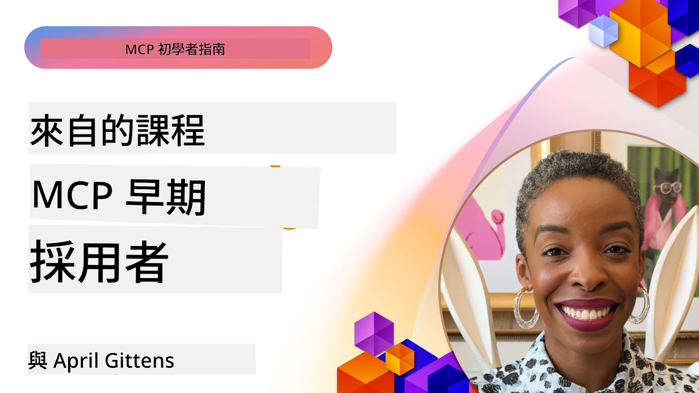

# 🌟 來自早期採用者的經驗教訓

[](https://youtu.be/jds7dSmNptE)

_(點擊上方圖片觀看本課程影片)_

## 🎯 本模組涵蓋內容

本模組探討真實組織和開發者如何利用 Model Context Protocol（MCP）解決實際挑戰並推動創新。透過詳細的案例研究、實作專案和實際範例，你將了解 MCP 如何實現安全、可擴展的 AI 整合，連接大型語言模型、工具和企業資料。

### 📚 觀摩 MCP 實作

想看這些原則如何應用於生產工具？請參閱我們的 [**10 個改變開發者生產力的 Microsoft MCP 伺服器**](microsoft-mcp-servers.md)，展示你今天就能使用的真實 Microsoft MCP 伺服器。

## 概述

本課程探討早期採用者如何利用 Model Context Protocol（MCP）解決跨產業的實際問題並推動創新。透過詳細案例研究和實作專案，你將看到 MCP 如何實現標準化、安全且可擴展的 AI 整合——在統一框架中連接大型語言模型、工具與企業資料。你將獲得設計與建置基於 MCP 解決方案的實務經驗，學習已驗證的實作模式，並發現 MCP 在生產環境部署的最佳實務。課程還強調新興趨勢、未來方向與開源資源，幫助你保持 MCP 技術及其生態系統的前沿地位。

## 學習目標

- 分析不同行業的真實 MCP 實作案例
- 設計並建置完整的 MCP 應用程式
- 探索 MCP 技術的新興趨勢與未來方向
- 在實際開發場景中應用最佳實務

## 真實世界的 MCP 實作案例

### 案例研究 1：企業客戶支援自動化

一家跨國企業實作了基於 MCP 的解決方案，以在其客戶支援系統中標準化 AI 互動。這讓他們能夠：

- 為多個大型語言模型提供者建立統一介面
- 在各部門間維持一致的提示管理
- 實施強健的安全與合規控制
- 根據需求輕鬆切換不同 AI 模型

**技術實作：**

```python
# Python MCP 伺服器實現用於客戶支援
import logging
import asyncio
from modelcontextprotocol import create_server, ServerConfig
from modelcontextprotocol.server import MCPServer
from modelcontextprotocol.transports import create_http_transport
from modelcontextprotocol.resources import ResourceDefinition
from modelcontextprotocol.prompts import PromptDefinition
from modelcontextprotocol.tool import ToolDefinition

# 配置日誌記錄
logging.basicConfig(level=logging.INFO)

async def main():
    # 創建伺服器配置
    config = ServerConfig(
        name="Enterprise Customer Support Server",
        version="1.0.0",
        description="MCP server for handling customer support inquiries"
    )
    
    # 初始化 MCP 伺服器
    server = create_server(config)
    
    # 註冊知識庫資源
    server.resources.register(
        ResourceDefinition(
            name="customer_kb",
            description="Customer knowledge base documentation"
        ),
        lambda params: get_customer_documentation(params)
    )
    
    # 註冊提示模板
    server.prompts.register(
        PromptDefinition(
            name="support_template",
            description="Templates for customer support responses"
        ),
        lambda params: get_support_templates(params)
    )
    
    # 註冊支援工具
    server.tools.register(
        ToolDefinition(
            name="ticketing",
            description="Create and update support tickets"
        ),
        handle_ticketing_operations
    )
    
    # 使用 HTTP 傳輸啟動伺服器
    transport = create_http_transport(port=8080)
    await server.run(transport)

if __name__ == "__main__":
    asyncio.run(main())
```

**成果：** 模型成本降低 30%，回應一致性提升 45%，並加強全球營運的合規性。

### 案例研究 2：醫療診斷助理

一家醫療機構建立了 MCP 基礎設施，整合多個專科醫療 AI 模型，同時確保敏感的患者資料受到保護：

- 在通用與專科醫療模型間無縫切換
- 嚴格的隱私控制與審計軌跡
- 與既有電子健康紀錄（EHR）系統整合
- 醫學術語的提示工程保持一致

**技術實作：**

```csharp
// C# MCP host application implementation in healthcare application
using Microsoft.Extensions.DependencyInjection;
using ModelContextProtocol.SDK.Client;
using ModelContextProtocol.SDK.Security;
using ModelContextProtocol.SDK.Resources;

public class DiagnosticAssistant
{
    private readonly MCPHostClient _mcpClient;
    private readonly PatientContext _patientContext;
    
    public DiagnosticAssistant(PatientContext patientContext)
    {
        _patientContext = patientContext;
        
        // Configure MCP client with healthcare-specific settings
        var clientOptions = new ClientOptions
        {
            Name = "Healthcare Diagnostic Assistant",
            Version = "1.0.0",
            Security = new SecurityOptions
            {
                Encryption = EncryptionLevel.Medical,
                AuditEnabled = true
            }
        };
        
        _mcpClient = new MCPHostClientBuilder()
            .WithOptions(clientOptions)
            .WithTransport(new HttpTransport("https://healthcare-mcp.example.org"))
            .WithAuthentication(new HIPAACompliantAuthProvider())
            .Build();
    }
    
    public async Task<DiagnosticSuggestion> GetDiagnosticAssistance(
        string symptoms, string patientHistory)
    {
        // Create request with appropriate resources and tool access
        var resourceRequest = new ResourceRequest
        {
            Name = "patient_records",
            Parameters = new Dictionary<string, object>
            {
                ["patientId"] = _patientContext.PatientId,
                ["requestingProvider"] = _patientContext.ProviderId
            }
        };
        
        // Request diagnostic assistance using appropriate prompt
        var response = await _mcpClient.SendPromptRequestAsync(
            promptName: "diagnostic_assistance",
            parameters: new Dictionary<string, object>
            {
                ["symptoms"] = symptoms,
                patientHistory = patientHistory,
                relevantGuidelines = _patientContext.GetRelevantGuidelines()
            });
            
        return DiagnosticSuggestion.FromMCPResponse(response);
    }
}
```

**成果：** 為醫師提供更佳診斷建議，同時完全符合 HIPAA 規範，並顯著減少系統間的上下文切換。

### 案例研究 3：金融服務風險分析

一家金融機構運用 MCP 來標準化不同部門的風險分析流程：

- 為信用風險、詐欺偵測與投資風險模型建立統一介面
- 實施嚴格的存取控制和模型版本管理
- 確保所有 AI 建議具備可審計性
- 在多樣系統中保持一致的資料格式化

**技術實作：**

```java
// 用於財務風險評估的 Java MCP 伺服器
import org.mcp.server.*;
import org.mcp.security.*;

public class FinancialRiskMCPServer {
    public static void main(String[] args) {
        // 創建具有財務合規功能的 MCP 伺服器
        MCPServer server = new MCPServerBuilder()
            .withModelProviders(
                new ModelProvider("risk-assessment-primary", new AzureOpenAIProvider()),
                new ModelProvider("risk-assessment-audit", new LocalLlamaProvider())
            )
            .withPromptTemplateDirectory("./compliance/templates")
            .withAccessControls(new SOCCompliantAccessControl())
            .withDataEncryption(EncryptionStandard.FINANCIAL_GRADE)
            .withVersionControl(true)
            .withAuditLogging(new DatabaseAuditLogger())
            .build();
            
        server.addRequestValidator(new FinancialDataValidator());
        server.addResponseFilter(new PII_RedactionFilter());
        
        server.start(9000);
        
        System.out.println("Financial Risk MCP Server running on port 9000");
    }
}
```

**成果：** 提升法規遵循，模型部署週期縮短 40%，部門間風險評估一致性增強。

### 案例研究 4：Microsoft Playwright MCP 伺服器用於瀏覽器自動化

Microsoft 開發了 [Playwright MCP 伺服器](https://github.com/microsoft/playwright-mcp)，透過 Model Context Protocol 實現安全、標準化的瀏覽器自動化。這個生產就緒的伺服器讓 AI 代理和大型語言模型能以可控、可稽核且可擴展的方式與網頁瀏覽器互動——實現自動化網頁測試、資料擷取及端對端工作流程等應用。

> **🎯 生產就緒工具**
>
> 本案例展示了你今天就可以使用的真實 MCP 伺服器！想了解更多 Playwright MCP 伺服器及其他 9 款生產就緒 Microsoft MCP 伺服器，請參閱我們的 [**Microsoft MCP 伺服器指南**](microsoft-mcp-servers.md#8--playwright-mcp-server)。

**主要特色：**
- 將瀏覽器自動化功能（導航、填表、截圖等）以 MCP 工具形式提供
- 實施嚴格存取控制與沙箱機制，防止未經授權操作
- 提供詳盡的瀏覽器互動審計日誌
- 支持與 Azure OpenAI 及其他大型語言模型提供者整合，實現代理驅動自動化
- 為 GitHub Copilot 的程式碼代理提供網頁瀏覽能力

**技術實作：**

```typescript
// TypeScript：在 MCP 伺服器中註冊 Playwright 瀏覽器自動化工具
import { createServer, ToolDefinition } from 'modelcontextprotocol';
import { launch } from 'playwright';

const server = createServer({
  name: 'Playwright MCP Server',
  version: '1.0.0',
  description: 'MCP server for browser automation using Playwright'
});

// 註冊一個用於導航到 URL 並截取屏幕截圖的工具
server.tools.register(
  new ToolDefinition({
    name: 'navigate_and_screenshot',
    description: 'Navigate to a URL and capture a screenshot',
    parameters: {
      url: { type: 'string', description: 'The URL to visit' }
    }
  }),
  async ({ url }) => {
    const browser = await launch();
    const page = await browser.newPage();
    await page.goto(url);
    const screenshot = await page.screenshot();
    await browser.close();
    return { screenshot };
  }
);

// 啟動 MCP 伺服器
server.listen(8080);
```

**成果：**

- 啟用 AI 代理和大型語言模型的安全程式化瀏覽器自動化
- 降低手動測試工作量並提升網頁應用程式測試覆蓋率
- 提供企業環境中可重用、可擴展的瀏覽器工具整合框架
- 支援 GitHub Copilot 的網頁瀏覽功能

**參考資料：**

- [Playwright MCP 伺服器 GitHub 倉庫](https://github.com/microsoft/playwright-mcp)
- [Microsoft AI 與自動化解決方案](https://azure.microsoft.com/en-us/products/ai-services/)

### 案例研究 5：Azure MCP —— 企業級作為服務的 Model Context Protocol

Azure MCP 伺服器 ([https://aka.ms/azmcp](https://aka.ms/azmcp)) 是 Microsoft 管理的企業級 Model Context Protocol 實作，旨在以雲端服務提供可擴展、安全且合規的 MCP 伺服器功能。Azure MCP 幫助組織快速部署、管理並整合 MCP 伺服器與 Azure AI、資料及安全服務，降低營運負擔，加速 AI 採用。

> **🎯 生產就緒工具**
>
> 這是一個你今天就能使用的真實 MCP 伺服器！想了解更多 Microsoft Foundry MCP 伺服器，請參閱我們的 [**Microsoft MCP 伺服器指南**](microsoft-mcp-servers.md)。


- 完全托管的 MCP 伺服器主機，具備內建的擴展性、監控與安全性
- 原生整合 Azure OpenAI、Azure AI Search 及其他 Azure 服務
- 透過 Microsoft Entra ID 實現企業身份驗證和授權
- 支援自訂工具、提示範本及資源連接器
- 符合企業安全與法規要求

**技術實作：**

```yaml
# Example: Azure MCP server deployment configuration (YAML)
apiVersion: mcp.microsoft.com/v1
kind: McpServer
metadata:
  name: enterprise-mcp-server
spec:
  modelProviders:
    - name: azure-openai
      type: AzureOpenAI
      endpoint: https://<your-openai-resource>.openai.azure.com/
      apiKeySecret: <your-azure-keyvault-secret>
  tools:
    - name: document_search
      type: AzureAISearch
      endpoint: https://<your-search-resource>.search.windows.net/
      apiKeySecret: <your-azure-keyvault-secret>
  authentication:
    type: EntraID
    tenantId: <your-tenant-id>
  monitoring:
    enabled: true
    logAnalyticsWorkspace: <your-log-analytics-id>
```

**成果：**  
- 透過提供即用且合規的 MCP 伺服器平台，縮短企業 AI 項目的價值實現時間
- 簡化大型語言模型、工具與企業資料源的整合
- 增強 MCP 工作負載的安全性、可觀察性與營運效率
- 透過 Azure SDK 最佳實務與現代身份驗證模式提升程式碼品質

**參考資料：**  
- [Azure MCP 文件](https://aka.ms/azmcp)
- [Azure MCP 伺服器 GitHub 倉庫](https://github.com/Azure/azure-mcp)

- [Azure AI Services](https://azure.microsoft.com/en-us/products/ai-services/)
- [Microsoft MCP Center](https://mcp.azure.com)

## 案例研究 6：NLWeb 
MCP（模型上下文協議）是一個新興的協議，用於聊天機器人和 AI 助理與工具互動。每個 NLWeb 實例也是一個 MCP 伺服器，支援一個核心方法 ask，用於用自然語言向網站提問。回傳的回應利用了 schema.org，一個廣泛使用的網頁數據描述詞彙。大致來說，MCP 就像 HTTP 對 HTML 一樣是 NLWeb。NLWeb 結合了協議、Schema.org 格式和範例代碼，幫助網站快速建立這些端點，既對人類提供對話介面，也讓機器透過自然的代理間互動受益。

NLWeb 有兩個明顯的組成部分。
- 一個協議，從非常簡單開始，用來以自然語言與網站介面交流，以及一種格式，利用 json 和 schema.org 回傳答案。更多詳情請參見 REST API 文件。
- 一個簡易實作 (1)，利用現有標記，適用於可抽象為項目列表的網站（如產品、食譜、景點、評論等）。結合一套使用者介面元件，網站可以輕鬆提供對話式內容介面。更多運作詳情請參考對話查詢生命週期文件。
 
**參考資料：**  
- [Azure MCP 文件](https://aka.ms/azmcp)
- [NLWeb](https://github.com/microsoft/NlWeb)

### 案例研究 7：Microsoft Foundry MCP 伺服器 – 企業 AI 代理整合

Microsoft Foundry MCP 伺服器展示了如何利用 MCP 來協調和管理企業環境中的 AI 代理和工作流。通過將 MCP 與 Microsoft Foundry 整合，組織可以標準化代理互動，利用 Foundry 的工作流管理，確保安全、可擴充的部署。

> **🎯 生產環境就緒工具**
> 
> 這是一個你現在就可以使用的真實 MCP 伺服器！在我們的 [**Microsoft MCP 伺服器指南**](microsoft-mcp-servers.md#9--microsoft-foundry-mcp-server) 中了解更多 Microsoft Foundry MCP 伺服器資訊。

**主要功能：**
- 全面存取 Azure 的 AI 生態系統，包括模型目錄和部署管理
- 使用 Azure AI 搜尋進行知識索引，以支援檢索增強生成 (RAG) 應用
- 評估 AI 模型表現和質量保證的工具
- 與 Microsoft Foundry 目錄和實驗室整合，支援前沿研究模型
- 生產場景下的代理管理與評估能力

**成果：**
- 快速原型設計與穩健的 AI 代理工作流監控
- 無縫整合 Azure AI 服務以支援複雜場景
- 統一界面以建置、部署和監控代理流程
- 改善企業的安全性、合規性與營運效率
- 加速 AI 採用，並維持對複雜代理驅動流程的控制

**參考資料：**
- [Microsoft Foundry MCP Server GitHub 倉庫](https://github.com/azure-ai-foundry/mcp-foundry)
- [使用 MCP 整合 Azure AI 代理（Microsoft Foundry 部落格）](https://devblogs.microsoft.com/foundry/integrating-azure-ai-agents-mcp/)

### 案例研究 8：Foundry MCP Playground – 實驗與原型製作

Foundry MCP Playground 提供了一個即用環境，用以實驗 MCP 伺服器與 Microsoft Foundry 整合。開發者可以快速原型、測試和評估 AI 模型及代理工作流，利用 Microsoft Foundry 目錄與實驗室的資源。此 Playground 簡化設定，提供範例專案並支援協作開發，使探索最佳實踐與新場景變得輕鬆且低成本。對於需要驗證想法、分享實驗和加速學習，而不需複雜基建的團隊尤其有用。此舉降低門檻，有助促進 MCP 與 Microsoft Foundry 生態系的創新與社群貢獻。

**參考資料：**

- [Foundry MCP Playground GitHub 倉庫](https://github.com/azure-ai-foundry/foundry-mcp-playground)

### 案例研究 9：Microsoft Learn Docs MCP 伺服器 – AI 驅動的文件存取

Microsoft Learn Docs MCP 伺服器是一個雲端託管服務，透過模型上下文協議為 AI 助理提供即時存取官方 Microsoft 文件的能力。此生產等級伺服器連結到完備的 Microsoft Learn 生態系統，支援跨所有官方 Microsoft 資源的語義搜尋。

> **🎯 生產環境就緒工具**
> 
> 這是一個你現在就可以使用的真實 MCP 伺服器！在我們的 [**Microsoft MCP 伺服器指南**](microsoft-mcp-servers.md#1--microsoft-learn-docs-mcp-server) 中了解更多 Microsoft Learn Docs MCP 伺服器資訊。

**主要功能：**
- 即時存取官方 Microsoft 文件、Azure 文件及 Microsoft 365 文件
- 具備理解上下文和意圖的進階語義搜尋能力
- 隨 Microsoft Learn 內容發布持續更新的資訊
- 涵蓋 Microsoft Learn、Azure 文件及 Microsoft 365 資源的全面內容
- 回傳最多 10 個高品質內容片段，包含文章標題與 URL

**重要性：**
- 解決 Microsoft 技術的「AI 知識過時」問題
- 確保 AI 助理能存取最新的 .NET、C#、Azure 和 Microsoft 365 功能
- 提供權威的一手資訊，以實現準確的程式碼生成
- 對於處理快速演進 Microsoft 技術的開發者至關重要

**成果：**
- 大幅提高 AI 生成 Microsoft 技術程式碼的準確性
- 減少尋找最新文件和最佳實踐的時間
- 透過上下文感知的文件檢索提升開發者生產力
- 無縫整合開發工作流程，無需離開 IDE

**參考資料：**
- [Microsoft Learn Docs MCP Server GitHub 倉庫](https://github.com/MicrosoftDocs/mcp)
- [Microsoft Learn 文件](https://learn.microsoft.com/)

## 實作專案

### 專案 1：建立多供應商 MCP 伺服器

**目標：** 建立一個 MCP 伺服器，可根據特定條件路由請求至多個 AI 模型供應商。

**需求：**

- 支援至少三個不同的模型供應商（例如 OpenAI、Anthropic、本地模型）
- 根據請求元資料實作路由機制
- 建立管理供應商憑證的配置系統
- 加入快取以優化效能和成本
- 建立簡單的監控儀表板來監視使用情況

**實作步驟：**

1. 建立基本的 MCP 伺服器架構
2. 為每個 AI 模型服務實作供應商轉接器
3. 根據請求屬性建立路由邏輯
4. 新增常用請求的快取機制
5. 開發監控儀表板
6. 使用各種請求模式進行測試

**技術：** 可選擇 Python（或依偏好選用 .NET/Java/Python）、Redis 作為快取，及簡單的網頁框架作為儀表板。

### 專案 2：企業提示詞管理系統


**目標：** 開發一個基於 MCP 的系統，用於管理、版本控制及部署整個機構內的提示模板。

**需求：**


- 建立一個集中式的提示範本存儲庫
- 實施版本控制與審批工作流程
- 構建帶有範例輸入的範本測試能力
- 開發基於角色的存取控制
- 創建範本檢索與部署的 API

**實施步驟：**

1. 設計範本存儲的資料庫結構
2. 創建範本的 CRUD 核心 API
3. 實施版本控制系統
4. 建立審批工作流程
5. 開發測試框架
6. 創建簡易的網頁管理介面
7. 與 MCP 伺服器整合

**技術選擇：** 您可自由選擇後端框架、SQL 或 NoSQL 資料庫，以及用於管理介面的前端框架。

### 專案 3：基於 MCP 的內容生成平台

**目標：** 建立一個利用 MCP 以提供不同內容類型一致結果的內容生成平台。

**需求：**

- 支援多種內容格式（部落格文章、社交媒體、行銷文案）
- 實施基於範本的生成並支援自訂選項
- 創建內容審核與反饋系統
- 追蹤內容效能指標
- 支援內容版本控制與迭代

**實施步驟：**

1. 設置 MCP 用戶端基礎設施
2. 創建不同內容類型的範本
3. 建立內容生成管線
4. 實施審核系統
5. 開發效能指標追蹤系統
6. 創建範本管理與內容生成的使用者介面

**技術選擇：** 您偏好的程式語言、網頁框架與資料庫系統。

## MCP 技術的未來方向

### 新興趨勢

1. **多模態 MCP**
   - 擴展 MCP 以標準化與圖像、音頻與視頻模型的互動
   - 發展跨模態推理能力
   - 不同模態的標準化提示格式

2. **聯邦 MCP 基礎設施**
   - 跨組織共享資源的分散式 MCP 網絡
   - 安全模型共享的標準化協定
   - 隱私保護計算技術

3. **MCP 市場**
   - 用於分享及貨幣化 MCP 範本和插件的生態系
   - 品質保證及認證流程
   - 與模型市場的整合

4. **適用於邊緣計算的 MCP**
   - 針對資源受限邊緣裝置調整 MCP 標準
   - 低帶寬環境的優化協定
   - 物聯網生態系的專用 MCP 實現

5. <strong>法規框架</strong>
   - 為符合法規要求而開發的 MCP 擴展
   - 標準化的審計追蹤與解釋性介面
   - 與新興的 AI 治理框架整合

### 微軟的 MCP 解決方案

微軟及 Azure 已開發多個開源儲存庫，協助開發者在各種場景落實 MCP：

#### 微軟組織

1. [playwright-mcp](https://github.com/microsoft/playwright-mcp) - 用於瀏覽器自動化和測試的 Playwright MCP 伺服器
2. [files-mcp-server](https://github.com/microsoft/files-mcp-server) - 本地測試及社群貢獻的 OneDrive MCP 伺服器實作
3. [NLWeb](https://github.com/microsoft/NlWeb) - 一系列開放協定及相關開源工具，專注於建立 AI 網絡的基礎層

#### Azure-Samples 組織

1. [mcp](https://github.com/Azure-Samples/mcp) - 連結多語言的 MCP 伺服器建置及整合範例、工具與資源
2. [mcp-auth-servers](https://github.com/Azure-Samples/mcp-auth-servers) - MCP 認證參考伺服器，符合現行 Model Context Protocol 規範
3. [remote-mcp-functions](https://github.com/Azure-Samples/remote-mcp-functions) - Azure Functions 上遠端 MCP 伺服器實作的入口頁和語言特定存儲庫連結
4. [remote-mcp-functions-python](https://github.com/Azure-Samples/remote-mcp-functions-python) - 使用 Python 在 Azure Functions 建置及部署自訂遠端 MCP 伺服器的快速入門範本
5. [remote-mcp-functions-dotnet](https://github.com/Azure-Samples/remote-mcp-functions-dotnet) - 使用 .NET/C# 在 Azure Functions 建置及部署自訂遠端 MCP 伺服器的快速入門範本
6. [remote-mcp-functions-typescript](https://github.com/Azure-Samples/remote-mcp-functions-typescript) - 使用 TypeScript 在 Azure Functions 建置及部署自訂遠端 MCP 伺服器的快速入門範本
7. [remote-mcp-apim-functions-python](https://github.com/Azure-Samples/remote-mcp-apim-functions-python) - 將 Azure API 管理作為 AI 閘道，連接 Python 實作的遠端 MCP 伺服器
8. [AI-Gateway](https://github.com/Azure-Samples/AI-Gateway) - 結合 Azure OpenAI 及 AI Foundry 的 APIM ❤️ AI 實驗與 MCP 能力

這些儲存庫涵蓋多種程式語言與 Azure 服務中使用 Model Context Protocol 的各種實現範例、範本和資源，包含基本伺服器架構、認證、雲端部署與企業整合場景。

#### MCP 資源目錄

官方微軟 MCP 儲存庫中的 [MCP 資源目錄](https://github.com/microsoft/mcp/tree/main/Resources) 提供一組精選範例資源、提示範本和工具定義，供 Model Context Protocol 伺服器使用。此目錄協助開發者快速起步 MCP，提供可重複使用的模組與最佳實踐範例，包括：

- **提示範本：** 預先製作的常見 AI 任務與場景提示範本，可調整用於您自己的 MCP 伺服器實作。
- **工具定義：** 標準化工具整合與呼叫的範例工具架構及元資料。
- **資源範例：** 在 MCP 框架內串接資料來源、API 與外部服務的範例資源定義。
- **參考實作：** 展示如何在實際 MCP 專案中構造與組織資源、提示與工具的範例。

這些資源加速開發，促進標準化，並協助在構建與部署基於 MCP 的解決方案時確保遵守最佳實踐。

#### MCP 資源目錄

- [MCP 資源（範例提示、工具及資源定義）](https://github.com/microsoft/mcp/tree/main/Resources)

### 研究機會

- MCP 框架中高效提示優化技術
- 多租戶 MCP 部署的安全模型
- 不同 MCP 實現間的效能基準測試
- MCP 伺服器的形式驗證方法

## 結論

Model Context Protocol (MCP) 正在迅速塑造跨產業標準化、安全和互操作性的 AI 整合未來。透過本課程的案例研究和實作專案，您已看到包括微軟和 Azure 在內的早期採用者如何利用 MCP 解決實際挑戰，加速 AI 採用，並確保合規、安全及可擴展性。MCP 的模組化方法使組織能在統一且可審計的框架內連接大型語言模型、工具和企業資料。隨著 MCP 持續演進，持續參與社群、探索開源資源並實踐最佳方案將是建構堅實且未來就緒 AI 解決方案的關鍵。

## 額外資源

- [MCP Foundry GitHub 儲存庫](https://github.com/azure-ai-foundry/mcp-foundry)
- [Foundry MCP Playground](https://github.com/azure-ai-foundry/foundry-mcp-playground)
- [將 Azure AI Agents 與 MCP 整合（微軟 Foundry 部落格）](https://devblogs.microsoft.com/foundry/integrating-azure-ai-agents-mcp/)
- [MCP GitHub 儲存庫 (微軟)](https://github.com/microsoft/mcp)
- [MCP 資源目錄（範例提示、工具及資源定義）](https://github.com/microsoft/mcp/tree/main/Resources)
- [MCP 社群與文檔](https://modelcontextprotocol.io/introduction)
- [MCP 規範 (2026-07-28)](https://modelcontextprotocol.io/specification/2026-07-28/)
- [Azure MCP 文件](https://aka.ms/azmcp)
- [OWASP MCP 十大](https://microsoft.github.io/mcp-azure-security-guide/mcp/) - 安全最佳實踐
- [Playwright MCP 伺服器 GitHub 儲存庫](https://github.com/microsoft/playwright-mcp)
- [Files MCP 伺服器 (OneDrive)](https://github.com/microsoft/files-mcp-server)
- [Azure-Samples MCP](https://github.com/Azure-Samples/mcp)
- [MCP 認證伺服器 (Azure-Samples)](https://github.com/Azure-Samples/mcp-auth-servers)
- [遠端 MCP 函數 (Azure-Samples)](https://github.com/Azure-Samples/remote-mcp-functions)
- [遠端 MCP 函數 Python (Azure-Samples)](https://github.com/Azure-Samples/remote-mcp-functions-python)
- [遠端 MCP 函數 .NET (Azure-Samples)](https://github.com/Azure-Samples/remote-mcp-functions-dotnet)
- [遠端 MCP 函數 TypeScript (Azure-Samples)](https://github.com/Azure-Samples/remote-mcp-functions-typescript)
- [遠端 MCP APIM 函數 Python (Azure-Samples)](https://github.com/Azure-Samples/remote-mcp-apim-functions-python)
- [AI-Gateway (Azure-Samples)](https://github.com/Azure-Samples/AI-Gateway)
- [微軟 AI 與自動化解決方案](https://azure.microsoft.com/en-us/products/ai-services/)

## 練習題

1. 分析其中一個案例研究並提出替代實作方案。
2. 選擇一個專案構想並擬定詳細技術規格。
3. 研究案例中未涵蓋的行業，並概述 MCP 如何解決其特定挑戰。
4. 探索其中一個未來方向，並構思支持該方向的新 MCP 擴展。

## 接下來的步驟

繼續探索：[Microsoft MCP Servers](./microsoft-mcp-servers.md)

閱讀下一章：[模組 8：最佳實踐](../08-BestPractices/README.md)

---

<!-- CO-OP TRANSLATOR DISCLAIMER START -->
**免責聲明**：
本文件由 AI 翻譯服務 [Co-op Translator](https://github.com/Azure/co-op-translator) 翻譯而成。雖然我們致力於確保準確性，但請注意，機器自動翻譯可能包含錯誤或不準確之處。原始文件的母語版本應被視為權威來源。對於重要資訊，建議進行專業人工翻譯。我們不對因使用本翻譯而產生的任何誤解或誤釋承擔責任。
<!-- CO-OP TRANSLATOR DISCLAIMER END -->