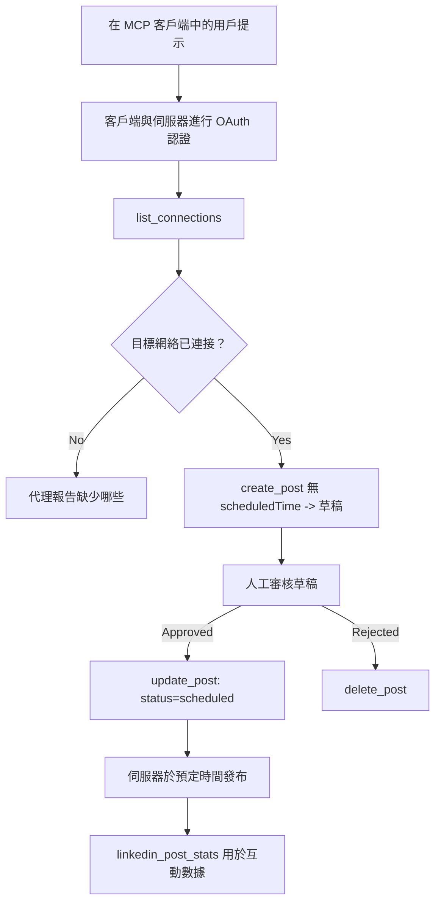

# 案例研究：從代理使用遠端 MCP 伺服器發佈到社交網絡

> **免責聲明：** 有多種服務和開源專案可以發佈到社交網絡，團隊也可以直接整合每個網絡的 API。下面的情境是展示如何設計和使用<strong>可寫入的遠端 MCP 伺服器</strong>的實作範例。Publora 是一個有免費方案的商業服務；這裡描述的模式適用於任何代表用戶執行不可逆操作的 MCP 伺服器。

## 概述

代理擅長草擬內容，但無法負責交付。一個模型可以在幾秒鐘內撰寫發布公告，然後工作就停止了：發佈意味著每個網絡都需要一套 API，OAuth 應用，還有不一樣的媒體規則。大多數團隊的解決方案是手動將文字複製到瀏覽器。

本案例研究探討如何通過單一遠端 MCP 伺服器完成最後這一步，並且 — 對於任何想建置此類伺服器的人更有用的 — 剖析一個<strong>可寫入</strong>伺服器必須正確處理的設計決策。讀取資料有容錯性，發佈則沒有：錯誤的工具呼叫會被受眾看見，且無法撤銷。

## 情境

一個小型開發者關係團隊在代理內草擬帖子（Claude、VS Code、Cursor — 用戶端無關緊要）。他們希望代理能夠：

- 查看團隊已連結的社交帳號，
- 草擬帖子並保留為草稿以供人工審核，
- 附加圖片，
- 在選定時間排程至多個網絡，
- 並在稍後報告績效。

關鍵是，他們希望代理在還在試驗階段時<em>無法</em>誤發佈。

## 使用工具

- [Publora MCP Server](https://github.com/publora/mcp-server) — 一個遠端 MCP 伺服器（`streamable-http`），提供發佈、排程、媒體與 LinkedIn 分析工具。在官方 MCP 登錄表中註冊為 `com.publora/mcp-server`。

## 逐步工作流程

1. **連接伺服器。** 支援 OAuth 的用戶端會經由 PKCE 的授權碼流程，使用伺服器自己的同意頁；不支援的用戶端，如無頭 CLI，則在標頭中使用 Publora API 鍵。兩條路徑皆支持，取決於用戶端而非伺服器。
2. **列出連結。** 代理呼叫 `list_connections`，接收已連結帳號及其識別碼。
3. **草擬。** 代理呼叫 `create_post` <em>不帶</em>排程時間。此時帖子存為草稿 — 不會實際發佈。
4. **附加媒體。** 公開圖片 URL 同時傳遞；伺服器下載並驗證它們。
5. **排程。** 經人工批准後，`update_post` 設定狀態為已排程並帶 ISO 8601 時間。
6. **衡量。** LinkedIn 方面，`linkedin_post_stats` 在帖子上線後返回互動數據。

## 範例提示

```text
Which social accounts do I have connected?
Draft a post announcing our new changelog page, attach the screenshot at
https://example.com/changelog.png, and keep it as a draft — do not publish it.
Once I approve, schedule it to LinkedIn and Bluesky for tomorrow at 09:00 UTC.
```

## Mermaid 流程圖



## 技術實現

以下經驗是本案例研究中可移植的方法。

### 公開發現，認證執行

`tools/list` 在無需憑證下提供；每個 `tools/call` 則需令牌，
否則回傳 `401` 並帶有指向受保護資源元數據的 `WWW-Authenticate` 標頭。
伺服器的舊版端點也能回應未認證的 `initialize` 用於協定版本早於
`2026-07-28` 的用戶端；現時客戶端不再使用該握手。


名稱、架構與標記，同時防止匿名執行。公開發現是部署選擇，而非 MCP 強制；
受保護部署或許也需授權 `tools/list`。

### 註冊：動態客戶端註冊，以及其替代方案

伺服器宣告 `/.well-known/oauth-protected-resource` 與 `/.well-known/oauth-authorization-server`，


請視其為相容性行為，而非理想設計。`2026-07-28` 規範修訂棄用動態註冊，改以客戶端 ID 元資料文件，

但新建伺服器應規劃支援 CIMD，只保留 DCR 以照顧舊用戶端。

### 工具標記非僅裝飾用途

每個工具都帶有 `title` 與適用提示：`readOnlyHint`、`destructiveHint`、`idempotentHint`、`openWorldHint`。

投資原因有二。第一，用戶端根據提示決定需向用戶確認的動作 — 例如用戶端可自動執行讀取查詢，再於刪除前停下等待批准。規範明確標記為非授權機制的不可置信提示：它塑造用戶端的行為範圍，不會阻擋伺服器作為，伺服器仍須執行規則。第二，主要連接器目錄現已<em>強制要求</em>標題及提示；缺少它們的伺服器不論功能多好均會遭退回。

### 使標識符無法自行捏造

平台標識符是 `list_connections` 回傳的不透明字串，並在架構描述中明確說明必須完全複製，絕不可猜測。伺服器會拒絕其他值。

模型善於猜測。任何具寫入能力的伺服器應假設標識符最終會被幻覺產生，並應迅速明確地使其失敗，而非作用於一個看似合理的值。

### 發佈前失敗，並帶有可行動的訊息

某些網絡不接受純文字貼文，必須附有圖片或影片。此在帖子排程時驗證，錯誤訊息會指出平台與缺失需求。

代理能針對「Instagram 需要媒體 — 請附加圖片或影片」這種錯誤做出恢復，無需重新往返；無法恢復通用 `400`。

### 讓重試無害

兩個用於創建內容的工具，`create_post` 和 `update_post`，皆接受冪等鍵：重複使用相同請求的鍵會重播原先回應，而不創建第二篇。代理運行時會在逾時時重試；沒有冪等性，慢速回應會造成重複發佈。其他寫入工具 — 刪除、媒體步驟、LinkedIn 互動與評論 — 沒有此功能，重試時風險自負。值得清楚知道自己的突變行為哪些受保護，哪些未受保護。

### 提供不發佈的測試方式


伺服器接受一個保留目標 `publora-playground`，該目標會被驗證並確認為真實的目的地，然後被丟棄——不會有任何內容抵達真實帳戶。它在工具結構中被描述，任何客戶端都可以在無需憑證的情況下讀取：`create_post` 的 `platforms` 欄位將其描述為「一個連接測試目標，無需真實連接——貼文會被確認並丟棄，不會發布」。呼叫時只需將其作為唯一項目傳入：`platforms: ["publora-playground"]`。

這被證明是整個表面上最有用的細節之一。連接器目錄的審查者、貢獻者和 CI 可以端到端地使用完整寫入路徑，而無風險影響真實觀眾。任何帶有不可逆操作的 MCP 伺服器都可從文檔化的無操作目標中受益。

## 結果與影響

- 發布步驟從瀏覽器移至創建內容的同一對話，草稿優先的習慣使人類持續介入。要明確這是什麼：草稿是一種慣例，而非邊界。相同的憑證可以排程或發布，因此任何需要真實審核門檻的人必須在工具外部實施——例如分離憑證，或伺服器前置的政策層。
- 各網絡差異——媒體需求、串接模式、回覆控制——集中由伺服器處理，而非每個與之通訊的代理分別處理。
- 相同伺服器可支援多個 MCP 客戶端，且無需事先發放憑證。
    現有客戶端可以使用 Client ID 元資料文件；舊客戶端則可繼續使用 DCR 作為後備方案。

- 上述設計限制同樣受到連接器目錄審查者與使用者的影響：工具註解、OAuth 以及安全的測試目標各有至少一方要求。

## 參考資料

- [Publora MCP Server（原始碼）](https://github.com/publora/mcp-server)
- [Publora API 與 MCP 文件](https://docs.publora.com)
- [MCP Registry 條目：`com.publora/mcp-server`](https://registry.modelcontextprotocol.io/v0/servers?search=com.publora/mcp-server)
- [MCP 規範 — 授權](https://modelcontextprotocol.io/specification/2026-07-28/basic/authorization)
- [MCP 規範 — 工具註解](https://modelcontextprotocol.io/docs/concepts/tools)

## 接下來

- 挑選你正在建置的 MCP 伺服器，檢查這裡三個成本最低的改進：每個工具上的註解、每次寫入帶有冪等鍵，以及文檔化的無操作目標。
- 嘗試公開發現分離：對公共遠程伺服器呼叫 `tools/list`，無需憑證，然後呼叫工具並檢查 `401` 認證提示。
- 考慮你領域中「還原」的意義。發布有草稿與刪除；若你的行為沒有相等對應，確認應該在工具設計中處理，不該在提示中強迫實作。

---

<!-- CO-OP TRANSLATOR DISCLAIMER START -->
**免責聲明**：
本文件由 AI 翻譯服務 [Co-op Translator](https://github.com/Azure/co-op-translator) 翻譯而成。雖然我們致力於確保準確性，但請注意，機器自動翻譯可能包含錯誤或不準確之處。原始文件的母語版本應被視為權威來源。對於重要資訊，建議進行專業人工翻譯。我們不對因使用本翻譯而產生的任何誤解或誤釋承擔責任。
<!-- CO-OP TRANSLATOR DISCLAIMER END -->