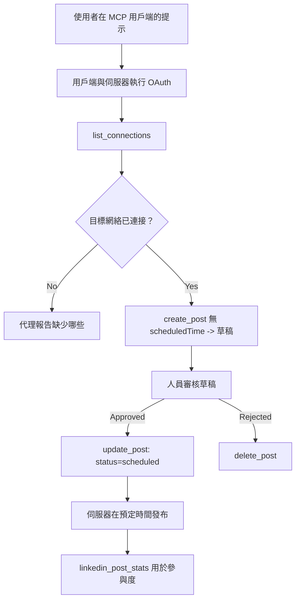

# 案例研究：從代理使用遠端 MCP 伺服器發佈到社交網絡

> **免責聲明：** 有多個服務和開源專案可發佈到社交網絡，團隊也可以直接整合每個網絡的 API。以下場景作為一個完整範例，說明如何設計及使用一個 **具有寫入能力的遠端 MCP 伺服器**。Publora 是一項具有免費方案的商業服務；本文所描述模式適用於任何代表使用者執行不可逆操作的 MCP 伺服器。

## 概覽

代理擅長擬稿，但不擅長發佈。模型可以在幾秒內撰寫發布公告，但接著工作就停了：發佈意味著每個網絡一個 API、每個網絡一個 OAuth 應用，還有一套不同的媒體規則。大多數團隊透過手動複製文字到瀏覽器解決此問題。

本案例研究檢視如何透過單一遠端 MCP 伺服器完成最後這一步；更實用的是，針對任何想打造此類伺服器者，探討一個 <strong>具寫入能力</strong> 伺服器必須正確做出的設計決策。讀取資料是寬容的，發佈則不然：錯誤的工具呼叫會被觀眾看見，且無法撤銷。

## 場景

一個小型的開發者關係團隊在代理中（Claude、VS Code、Cursor — 客戶端無關）擬定貼文。他們希望代理可以：

- 查看團隊已連接的社交帳號，
- 擬稿並保留為草稿，等待人工批准，
- 附加圖片，
- 在選定時間排程發佈到多個網絡，
- 並且後續報告貼文表現。

關鍵是，他們希望代理在仍在試驗時，<em>無法</em>意外發佈貼文。

## 使用工具

- [Publora MCP Server](https://github.com/publora/mcp-server) — 一個遠端 MCP 伺服器（`streamable-http`），提供發佈、排程、媒體及 LinkedIn 分析工具。在官方 MCP 登記為 `com.publora/mcp-server`。

## 分步工作流程

1. **連接伺服器。** 支援 OAuth 的客戶端透過授權碼流程及 PKCE 與伺服器自身的同意畫面完成授權；不支援 OAuth 的客戶端，如無頭 CLI，則在標頭中使用 Publora API 金鑰。兩種流程皆支援，使用哪種由客戶端決定，不由伺服器決定。
2. **列出連接。** 代理呼叫 `list_connections` 並接收帶有標識符的已連接帳號。
3. **擬稿。** 代理呼叫 `create_post` 時<em>不提供</em>排程時間。貼文儲存為草稿 — 尚未發佈。
4. **附加媒體。** 公開圖片 URL 在同一呼叫中傳入；伺服器下載並驗證它們。
5. **排程。** 人工批准後，`update_post` 設定狀態為排程並附上 ISO 8601 時間。
6. **衡量。** LinkedIn 上，當貼文公開後，呼叫 `linkedin_post_stats` 回傳互動數據。

## 範例提示詞

```text
Which social accounts do I have connected?
Draft a post announcing our new changelog page, attach the screenshot at
https://example.com/changelog.png, and keep it as a draft — do not publish it.
Once I approve, schedule it to LinkedIn and Bluesky for tomorrow at 09:00 UTC.
```

## Mermaid 流程圖



## 技術實作

以下經驗是此案例研究中可轉移的經驗。

### 開放發現，認證執行

`tools/list` 不需認證即可服務；每個 `tools/call` 需要權杖，無權杖時回傳 `401`，並附帶指向受保護資源元資料的 `WWW-Authenticate` 標頭。（伺服器亦可應答未認證的 `initialize`，此功能只對`2026-07-28`前協議版本的客戶端有用；該版本後移除了握手功能。）

這種區分在實務上很重要。目錄、清單和客戶端可以無秘密地探查工具介面 — 名稱、結構、註解 —，但不允許匿名執行任何操作。要求 `initialize` 需要權杖的伺服器，對工具來說幾乎不可見；允許匿名 `tools/call` 的伺服器則存在安全風險。

### 註冊：動態客戶端註冊及其替代方案

伺服器會宣告 `/.well-known/oauth-protected-resource` 和 `/.well-known/oauth-authorization-server`，並支援授權碼流程及 PKCE（`S256`）、刷新權杖，以及<strong>動態客戶端註冊</strong>。

動態註冊免除了手動步驟：若無此機制，每個客戶端需預先取得 `client_id`，意即每個新客戶端都要向供應商提出帶外請求。

將動態註冊視為相容性行為，而非必拷貝的設計模式。`2026-07-28` 版本的規範棄用動態註冊，改用客戶端 ID 元文件（Client ID Metadata Documents, CIMD），由客戶端主機穩定 HTTPS URL 上之元文件，該 URL 即為 `client_id`。目前動態註冊仍可運作，但新建伺服器應規劃支持 CIMD，並因應較舊客戶端保留動態註冊。

### 工具註解非裝飾品

每個工具都有 `title` 及適用的提示：`readOnlyHint`、`destructiveHint`、`idempotentHint`、`openWorldHint`。

注重它們有兩大理由。首先，客戶端利用提示決定向使用者確認什麼 — 如讀取型查詢可自動執行，刪除前則需中止並取得同意。規範明確指出，註解是無信任的提示，非授權機制：它們形塑客戶端願意執行的動作，不會在伺服器端阻止任何事，伺服器仍須自行強制規則。其次，主流的連接器目錄現在<em>要求</em>這些註解才能通過審核；工具缺乏標題和提示的伺服器，無論運作多好，都會被退回。

### 識別碼不可自行編造

平台識別碼為 `list_connections` 回傳的不透明字串，結構描述明確指出必須逐字複製，切勿猜測。伺服器拒絕任意篡改的識別碼。

模型擅長胡亂猜測。所有具寫入能力的伺服器都應假設識別碼最終會被幻想（hallucinate），務必讓錯誤路徑及早且明顯失敗，而非對貌似合理的值進行操作。

### 發佈前請失敗，並提供可採取行動的訊息

部分網絡拒絕純文字貼文，要求必須有圖片或影片。此類驗證在貼文排程時進行，錯誤中會標明該平台及其缺少的要求。

代理可從「Instagram 需要媒體 — 附加圖片或影片」此訊息中復原，無須再回來請求。它無法從通用的 `400` 錯誤復原。

### 重試必須安全

建立內容的兩個工具，`create_post` 和 `update_post`，接受冪等鍵：重複使用相同的冪等鍵對應相同請求會重播原始回應，而非建立第二則貼文。代理執行時會在逾時時重試；若無冪等性，緩慢回應就會造成重覆發佈。其他寫入工具 — 刪除、媒體操作、LinkedIn 回應和留言 — 不接受冪等鍵，故該處重試不保證安全。了解哪些變更受保護很重要。

### 提供不發佈測試方法

伺服器接受保留目標 `publora-playground`，此目標會被驗證並回應確認，但貼文會直接捨棄 — 不會真正發佈到任何帳號。此資訊寫在工具結構中，任何客戶端無需認證即可閱讀：`create_post` 的 `platforms` 欄位文件中說明它是「不需真實連接的連接測試目標 — 貼文會被確認並捨棄，不會發佈」。呼叫時傳入唯一的平台項：`platforms: ["publora-playground"]`。

這成為整個介面中最有用的細節之一。連接器目錄審查者、貢獻者及 CI 可端對端測試完整寫入流程，且不會對真實受眾造成風險。任何有不可逆操作的 MCP 伺服器都從有文件記載的無操作目標中獲益。

## 結果與影響

- 發佈步驟從瀏覽器移至內容撰寫所在同一會話，並以先草稿後發佈的習慣保持人工介入。必須明確此處意義：草稿是個約定，非隔離界線。相同憑證可用於排程或發佈，若需真正批准管制，必須在工具介面外執行 — 使用不同憑證，或於伺服器前方加設策略層。
- 各網絡差異（媒體需求、串接、回覆控制）只在伺服器端處理一次，不需每個代理重覆實作。
- 同一伺服器可支援多個 MCP 客戶端，無需為每個客戶端額外作業，因為發現是開放的，註冊是動態的。
- 上述設計限制，既由用戶塑造，也受到連接器目錄審查要求—註解、OAuth 及安全測試目標均為必要條件。

## 參考資料

- [Publora MCP Server（原始碼）](https://github.com/publora/mcp-server)
- [Publora API 與 MCP 文件](https://docs.publora.com)
- [MCP 登錄條目：`com.publora/mcp-server`](https://registry.modelcontextprotocol.io/v0/servers?search=com.publora/mcp-server)
- [MCP 規範 — 授權](https://modelcontextprotocol.io/specification/draft/basic/authorization)
- [MCP 規範 — 工具註解](https://modelcontextprotocol.io/docs/concepts/tools)

## 下一步

- 檢視你正在建置的 MCP 伺服器，優先完成三項最便宜且最有效的改進：每個工具加註解、每個寫入工具加冪等鍵，及一個有文件記載的無操作目標。
- 嘗試開放發現分離：無需認證呼叫公開遠端伺服器的 `tools/list`，再呼叫工具並查看 `401` 挑戰訊息。
- 思考「復原」對你領域的意義。發佈有草稿及刪除機制；若你的操作無等效物，則確認程序應放入工具設計，而非提示詞中。

---

<!-- CO-OP TRANSLATOR DISCLAIMER START -->
**免責聲明**：
本文件由 AI 翻譯服務 [Co-op Translator](https://github.com/Azure/co-op-translator) 翻譯而成。雖然我們致力於確保準確性，但請注意，機器自動翻譯可能包含錯誤或不準確之處。原始文件的母語版本應被視為權威來源。對於重要資訊，建議進行專業人工翻譯。我們不對因使用本翻譯而產生的任何誤解或誤釋承擔責任。
<!-- CO-OP TRANSLATOR DISCLAIMER END -->