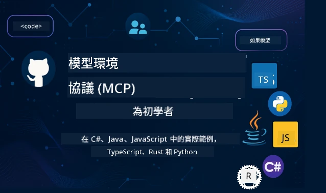

 

[](https://GitHub.com/microsoft/mcp-for-beginners/graphs/contributors)
[](https://GitHub.com/microsoft/mcp-for-beginners/issues)
[](https://GitHub.com/microsoft/mcp-for-beginners/pulls)
[](http://makeapullrequest.com)

[](https://GitHub.com/microsoft/mcp-for-beginners/watchers)
[](https://GitHub.com/microsoft/mcp-for-beginners/fork)
[](https://GitHub.com/microsoft/mcp-for-beginners/stargazers)


[](https://discord.gg/nTYy5BXMWG)

跟隨以下步驟開始使用這些資源：
1. **Fork 此儲存庫**: 點擊 [](https://GitHub.com/microsoft/mcp-for-beginners/fork)
2. **Clone 此儲存庫**:   `git clone https://github.com/microsoft/mcp-for-beginners.git`
3. **加入** [](https://discord.gg/nTYy5BXMWG)


### 🌐 多語言支援

#### 透過 GitHub Action 支援（自動且隨時更新）

<!-- CO-OP TRANSLATOR LANGUAGES TABLE START -->
[Arabic](../ar/README.md) | [Bengali](../bn/README.md) | [Bulgarian](../bg/README.md) | [Burmese (Myanmar)](../my/README.md) | [Chinese (Simplified)](../zh-CN/README.md) | [Chinese (Traditional, Hong Kong)](./README.md) | [Chinese (Traditional, Macau)](../zh-MO/README.md) | [Chinese (Traditional, Taiwan)](../zh-TW/README.md) | [Croatian](../hr/README.md) | [Czech](../cs/README.md) | [Danish](../da/README.md) | [Dutch](../nl/README.md) | [Estonian](../et/README.md) | [Finnish](../fi/README.md) | [French](../fr/README.md) | [German](../de/README.md) | [Greek](../el/README.md) | [Hebrew](../he/README.md) | [Hindi](../hi/README.md) | [Hungarian](../hu/README.md) | [Indonesian](../id/README.md) | [Italian](../it/README.md) | [Japanese](../ja/README.md) | [Kannada](../kn/README.md) | [Korean](../ko/README.md) | [Lithuanian](../lt/README.md) | [Malay](../ms/README.md) | [Malayalam](../ml/README.md) | [Marathi](../mr/README.md) | [Nepali](../ne/README.md) | [Nigerian Pidgin](../pcm/README.md) | [Norwegian](../no/README.md) | [Persian (Farsi)](../fa/README.md) | [Polish](../pl/README.md) | [Portuguese (Brazil)](../pt-BR/README.md) | [Portuguese (Portugal)](../pt-PT/README.md) | [Punjabi (Gurmukhi)](../pa/README.md) | [Romanian](../ro/README.md) | [Russian](../ru/README.md) | [Serbian (Cyrillic)](../sr/README.md) | [Slovak](../sk/README.md) | [Slovenian](../sl/README.md) | [Spanish](../es/README.md) | [Swahili](../sw/README.md) | [Swedish](../sv/README.md) | [Tagalog (Filipino)](../tl/README.md) | [Tamil](../ta/README.md) | [Telugu](../te/README.md) | [Thai](../th/README.md) | [Turkish](../tr/README.md) | [Ukrainian](../uk/README.md) | [Urdu](../ur/README.md) | [Vietnamese](../vi/README.md)

> **想本地 Clone？**
>
> 本儲存庫包含超過50種語言翻譯，會大幅增加下載大小。如欲不含翻譯地 Clone，請使用 sparse checkout：
>
> **Bash / macOS / Linux:**
> ```bash
> git clone --filter=blob:none --sparse https://github.com/microsoft/mcp-for-beginners.git
> cd mcp-for-beginners
> git sparse-checkout set --no-cone '/*' '!translations' '!translated_images'
> ```
>
> **CMD (Windows):**
> ```cmd
> git clone --filter=blob:none --sparse https://github.com/microsoft/mcp-for-beginners.git
> cd mcp-for-beginners
> git sparse-checkout set --no-cone "/*" "!translations" "!translated_images"
> ```
>
> 這樣能讓你更快下載完成課程所需內容。
<!-- CO-OP TRANSLATOR LANGUAGES TABLE END -->

# 🚀 Model Context Protocol (MCP) 初學者課程

## **使用 C#、Java、JavaScript、Rust、Python 和 TypeScript 的實作範例學習 MCP**

## 🧠 Model Context Protocol 課程總覽
歡迎踏上 Model Context Protocol 的學習之旅！如果你曾好奇 AI 應用程序如何與不同工具和服務溝通，你即將發現這個改變開發者構建智慧系統方式的優雅解決方案。

把 MCP 想像成 AI 應用的萬用翻譯器 — 就像 USB 埠讓你連接任何裝置到電腦一樣，MCP 使 AI 模型能以標準化方式連接至任何工具或服務。無論你是建立第一個聊天機器人，還是開發複雜的 AI 工作流程，了解 MCP 都會賦予你創造更強大、更彈性應用的能力。

本課程設計耐心照顧你的學習旅程。我們將從你已熟悉的簡單概念開始，並透過你喜愛的程式語言的實作逐步建立專業知識。每一步都包含清晰解說、實務範例及鼓勵支持。

完成本旅程時，你將有信心建立自己的 MCP 伺服器，將其整合到熱門 AI 平台，並理解此技術如何重新塑造 AI 開發的未來。讓我們一起開始這場令人興奮的冒險吧！

### 官方文件與規範

本課程與 **MCP 規範 2025-11-25** （最新穩定版本）相符。MCP 採用以日期作為版本號的方式（YYYY-MM-DD 格式），確保協議版本追蹤清晰明確。

這些資源隨著你的理解加深變得愈加寶貴，但不必急於立刻閱讀全部。先從你最感興趣的領域開始！
- 📘 [MCP 文件](https://modelcontextprotocol.io/) – 你的逐步教學與使用指南主資源。文件為初學者量身打造，提供清楚範例，讓你可依步調跟進。
- 📜 [MCP 規範](https://modelcontextprotocol.io/specification/2025-11-25) – 把它當作綜合參考手冊。隨著課程進行，你會常返查細節及探索進階功能。
- 📜 [MCP 規範版本控制](https://modelcontextprotocol.io/specification/versioning) – 內容有關協議版本歷史及 MCP 使用日期版本編排方式（YYYY-MM-DD 格式）。
- 🧑‍💻 [MCP GitHub 儲存庫](https://github.com/modelcontextprotocol) – 可找到多種程式語言的 SDK、工具與程式碼範例。猶如實用範例與現成組件的寶庫。
- 🌐 [MCP 社群](https://github.com/orgs/modelcontextprotocol/discussions) – 加入學習者與資深開發者的討論，共同探索 MCP。這裡是歡迎提問且自由分享知識的支持社群。
  
## 學習目標

完成課程後，你將更有自信且興奮掌握以下能力：

• **理解 MCP 基礎**：你會明白 Model Context Protocol 是什麼，為何它正革命性改變 AI 應用協作方式，透過貼切類比與範例使概念自然易懂。

• **建置你的第一個 MCP 伺服器**：你將使用偏好的程式語言建構一個可運作的 MCP 伺服器，從簡單範例開始，逐步增強技能。

• **連接 AI 模型與實際工具**：你會學習如何橋接 AI 模型與真實服務，賦予應用強大新功能。

• **實施安全最佳實務**：你將了解如何保障 MCP 實作的安全，保護應用程式及用戶。

• **信心滿滿地部署**：你會知道如何將 MCP 專案從開發推向生產環境，掌握實務可行的部署策略。

• **加入 MCP 社群**：你將成為不斷壯大的開發者社群一員，共同開拓 AI 應用開發的未來。 

## 必備背景知識

在深入 MCP 細節前，先確保你熟悉一些基石概念。不擔心，即使你不是專家，學習中我們會為你逐一說明所需內容！

### 理解協議（基礎）

把協議想像成對話規則。當你打電話給朋友，雙方知道要答“hello”，輪流說話，到結束時說“goodbye”。電腦程式也需要這類規則來有效溝通。

MCP 是一種協議 — 一套雙方同意的規則，幫助 AI 模型與工具及服務間「對話」。就像對話規則讓人與人交流更順暢，MCP 讓 AI 應用溝通更可靠且強大。

### 用戶端與伺服器關係（程式如何協作）

你每天都在使用用戶端-伺服器模式！當你使用網頁瀏覽器（用戶端）訪問網站，便連接到提供頁面內容的網頁伺服器。瀏覽器知道如何請求資訊，伺服器知道如何回應。

在 MCP 中，我們有類似關係：AI 模型作為用戶端請求資訊或動作，MCP 伺服器提供這些功能。就像 AI 的貼心助理（伺服器），接受並執行 AI 的指令。

### 為何標準化重要（讓系統能協同工作）

想像每家汽車廠的加油槍形狀都不一樣 — 你得為每台車配不同接頭！標準化就是訂定共通規格，讓不同系統無縫協作。

MCP 促成 AI 應用的標準化。AI 模型不須為每種工具寫客製程式碼，而是透過 MCP 的萬用溝通方式。開發者只需建立一次工具，即能支援多元 AI 系統。

## 🧭 你的學習路徑總覽

你的 MCP 旅程經過精心安排，循序漸進建立信心與技能。每一階段引入新概念，同時加固你既有的認知。

### 🌱 基礎階段：理解基本概念（模組0-2）

冒險從這裡啟程！我們將以熟悉的類比與簡單範例介紹 MCP 概念。你將明白 MCP 是什麼、為何存在以及它如何融入 AI 開發大環境。

• **模組 0 - MCP 簡介**：我們先探索 MCP 是什麼、對現代 AI 應用多重要。你將看到 MCP 實際運作範例及它如何解決開發者常見挑戰。

• **模組 1 - 核心概念解析**：這裡你會學習 MCP 的關鍵建構元。大量類比與視覺範例幫助你自然理解重要觀念。

• **模組 2 - MCP 的安全機制**：安全或許讓人望而卻步，但我們會示範 MCP 內建的安全防護，並教你從一開始就保護應用的最佳做法。

### 🔨 建置階段：打造你的第一個實作（模組3）

真正的樂趣來了！你將親手打造 MCP 伺服器與用戶端。別擔心 — 我們會從簡單示範開始，逐步指導每一步。
此模組包含多個實作指南，讓您能用偏好的程式語言練習。您將創建第一個伺服器、構建用於連接的客戶端，甚至整合像 VS Code 這樣熱門的開發工具。

每份指南都包含完整程式碼範例、故障排除技巧以及設計選擇背後的說明。完成此階段後，您將擁有能自豪的 MCP 實作作品！

### 🚀 成長階段：進階概念與實際應用（模組 4-5）

掌握基礎後，您將探索更複雜的 MCP 功能。我們將涵蓋實作策略、除錯技術，以及多模態 AI 整合等進階主題。

您還會學習如何將 MCP 實作擴展到生產環境，並與 Azure 等雲端平台整合。這些模組將讓您為建構能應付實際需求的 MCP 解決方案做好準備。

### 🌟 精通階段：社群與專精領域（模組 6-11）

最後階段著重於加入 MCP 社群以及專注您最感興趣的領域。您將學會如何為開源 MCP 專案貢獻、實作進階認證模式，以及構建完整的資料庫整合方案。

模組 11 值得特別提及 — 它是包含 13 個實作實驗的完整學習路徑，教您如何建置具備 PostgreSQL 整合的生產級 MCP 伺服器。它就像一個總結性的專案，將您所學全部融合！

### 📚 完整課程結構

| Module | Topic | Description | Link |
|--------|-------|-------------|------|
| **模組 0-3：基礎知識** | | | |
| 00 | MCP 簡介 | 模型上下文協定（Model Context Protocol）及其在 AI 管線中的重要性概述 | [閱讀更多](./00-Introduction/README.md) |
| 01 | 核心概念解析 | 深入探討 MCP 核心概念 | [閱讀更多](./01-CoreConcepts/README.md) |
| 02 | MCP 安全性 | 安全威脅與最佳實務 | [閱讀更多](./02-Security/README.md) |
| 03 | MCP 入門 | 環境設定、基本伺服器/客戶端、整合應用 | [閱讀更多](./03-GettingStarted/README.md) |
| **模組 3：建立您的第一個伺服器與客戶端** | | | |
| 3.1 | 第一個伺服器 | 建立您的第一個 MCP 伺服器 | [指南](./03-GettingStarted/01-first-server/README.md) |
| 3.2 | 第一個客戶端 | 開發基礎 MCP 客戶端 | [指南](./03-GettingStarted/02-client/README.md) |
| 3.3 | 搭配 LLM 的客戶端 | 整合大型語言模型 | [指南](./03-GettingStarted/03-llm-client/README.md) |
| 3.4 | VS Code 整合 | 在 VS Code 中使用 MCP 伺服器 | [指南](./03-GettingStarted/04-vscode/README.md) |
| 3.5 | stdio 伺服器 | 使用 stdio 傳輸建立伺服器 | [指南](./03-GettingStarted/05-stdio-server/README.md) |
| 3.6 | HTTP 串流 | 在 MCP 中實作 HTTP 串流 | [指南](./03-GettingStarted/06-http-streaming/README.md) |
| 3.7 | AI 工具包 | 與 MCP 一起使用 AI 工具包 | [指南](./03-GettingStarted/07-aitk/README.md) |
| 3.8 | 測試 | 測試您的 MCP 伺服器實作 | [指南](./03-GettingStarted/08-testing/README.md) |
| 3.9 | 部署 | 將 MCP 伺服器部署至生產環境 | [指南](./03-GettingStarted/09-deployment/README.md) |
| 3.10 | 進階伺服器使用 | 使用進階伺服器以使用進階功能並改善架構 | [指南](./03-GettingStarted/10-advanced/README.md) |
| 3.11 | 簡單認證 | 從基礎開始介紹認證及 RBAC | [指南](./03-GettingStarted/11-simple-auth/README.md) |
| 3.12 | MCP 主機 | 設定 Claude Desktop、Cursor、Cline 與其他 MCP 主機 | [指南](./03-GettingStarted/12-mcp-hosts/README.md) |
| 3.13 | MCP 檢視器 | 使用 Inspector 工具除錯與測試 MCP 伺服器 | [指南](./03-GettingStarted/13-mcp-inspector/README.md) |
| 3.14 | 取樣 | 使用取樣與客戶端協作 | [指南](./03-GettingStarted/14-sampling/README.md) |
| 3.15 | MCP 應用程式 | 建構 MCP 應用程式 | [指南](./03-GettingStarted/15-mcp-apps/README.md) |

| **模組 4-5：實務與進階** | | | |
| 04 | 實務實作 | SDK、除錯、測試、可重用提示範本 | [閱讀更多](./04-PracticalImplementation/README.md) |
| 4.1 | 分頁 | 使用游標分頁處理大量結果集 | [指南](./04-PracticalImplementation/pagination/README.md) |
| 05 | MCP 進階主題 | 多模態 AI、擴展、企業應用 | [閱讀更多](./05-AdvancedTopics/README.md) |
| 5.1 | Azure 整合 | MCP 與 Azure 整合 | [指南](./05-AdvancedTopics/mcp-integration/README.md) |
| 5.2 | 多模態 | 多種模態協作 | [指南](./05-AdvancedTopics/mcp-multi-modality/README.md) |
| 5.3 | OAuth2 範例 | 實作 OAuth2 認證 | [指南](./05-AdvancedTopics/mcp-oauth2-demo/README.md) |
| 5.4 | 根上下文 | 理解及實作根上下文 | [指南](./05-AdvancedTopics/mcp-root-contexts/README.md) |
| 5.5 | 路由 | MCP 路由策略 | [指南](./05-AdvancedTopics/mcp-routing/README.md) |
| 5.6 | 抽樣 | MCP 中的抽樣技術 | [指南](./05-AdvancedTopics/mcp-sampling/README.md) |
| 5.7 | 擴充性 | MCP 擴展實作 | [指南](./05-AdvancedTopics/mcp-scaling/README.md) |
| 5.8 | 安全性 | 進階安全性考量 | [指南](./05-AdvancedTopics/mcp-security/README.md) |
| 5.9 | 網頁搜尋 | 實作網頁搜尋功能 | [指南](./05-AdvancedTopics/web-search-mcp/README.md) |
| 5.10 | 即時串流 | 建置即時串流功能 | [指南](./05-AdvancedTopics/mcp-realtimestreaming/README.md) |
| 5.11 | 即時搜尋 | 實作即時搜尋 | [指南](./05-AdvancedTopics/mcp-realtimesearch/README.md) |
| 5.12 | Entra ID 認證 | 以 Microsoft Entra ID 進行認證 | [指南](./05-AdvancedTopics/mcp-security-entra/README.md) |
| 5.13 | Foundry 整合 | 與 Azure AI Foundry 整合 | [指南](./05-AdvancedTopics/mcp-foundry-agent-integration/README.md) |
| 5.14 | 上下文工程 | 有效上下文工程技巧 | [指南](./05-AdvancedTopics/mcp-contextengineering/README.md) |
| 5.15 | MCP 自訂傳輸 | 自訂傳輸實作 | [指南](./05-AdvancedTopics/mcp-transport/README.md) |
| 5.16 | 協定功能 | 進度通知、取消、資源範本 | [指南](./05-AdvancedTopics/mcp-protocol-features/README.md) |
| **模組 6-10：社群與最佳實踐** | | | |
| 06 | 社群貢獻 | 如何為 MCP 生態系統貢獻 | [指南](./06-CommunityContributions/README.md) |
| 07 | 早期採用經驗 | 實務實作故事分享 | [指南](./07-LessonsfromEarlyAdoption/README.md) |
| 08 | MCP 最佳實務 | 效能、容錯、韌性 | [指南](./08-BestPractices/README.md) |
| 09 | MCP 案例研究 | 實務實作範例 | [指南](./09-CaseStudy/README.md) |
| 10 | 實作工作坊 | 使用 AI 工具包建構 MCP 伺服器 | [實驗](./10-StreamliningAIWorkflowsBuildingAnMCPServerWithAIToolkit/README.md) |
| **模組 11：MCP 伺服器實作實驗室** | | | |
| 11 | MCP 伺服器資料庫整合 | 13 個實驗組成的完整學習路徑，整合 PostgreSQL | [實驗](./11-MCPServerHandsOnLabs/README.md) |
| 11.1 | 簡介 | MCP 與資料庫整合概述及零售分析使用案例 | [實驗 00](./11-MCPServerHandsOnLabs/00-Introduction/README.md) |
| 11.2 | 核心架構 | 了解 MCP 伺服器架構、資料庫層與安全模式 | [實驗 01](./11-MCPServerHandsOnLabs/01-Architecture/README.md) |
| 11.3 | 安全性與多租戶 | 行級安全、認證與多租戶資料存取 | [實驗 02](./11-MCPServerHandsOnLabs/02-Security/README.md) |
| 11.4 | 環境設定 | 設置開發環境、Docker 及 Azure 資源 | [實驗 03](./11-MCPServerHandsOnLabs/03-Setup/README.md) |
| 11.5 | 資料庫設計 | PostgreSQL 設定、零售資料模型設計與範例資料 | [實驗 04](./11-MCPServerHandsOnLabs/04-Database/README.md) |
| 11.6 | MCP 伺服器實作 | 建構結合資料庫的 FastMCP 伺服器 | [實驗 05](./11-MCPServerHandsOnLabs/05-MCP-Server/README.md) |
| 11.7 | 工具開發 | 創建資料庫查詢工具及結構探索 | [實驗 06](./11-MCPServerHandsOnLabs/06-Tools/README.md) |
| 11.8 | 語義搜尋 | 使用 Azure OpenAI 與 pgvector 實作向量嵌入 | [實驗 07](./11-MCPServerHandsOnLabs/07-Semantic-Search/README.md) |
| 11.9 | 測試與除錯 | 測試策略、除錯工具及驗證方法 | [實驗 08](./11-MCPServerHandsOnLabs/08-Testing/README.md) |
| 11.10 | VS Code 整合 | 設定 VS Code MCP 整合與 AI 聊天功能 | [實驗 09](./11-MCPServerHandsOnLabs/09-VS-Code/README.md) |
| 11.11 | 部署策略 | Docker 部署、Azure Container Apps 及擴展考量 | [實驗 10](./11-MCPServerHandsOnLabs/10-Deployment/README.md) |
| 11.12 | 監控 | Application Insights、日誌及效能監控 | [實驗 11](./11-MCPServerHandsOnLabs/11-Monitoring/README.md) |
| 11.13 | 最佳實務 | 效能優化、安全強化及生產環境建議 | [實驗 12](./11-MCPServerHandsOnLabs/12-Best-Practices/README.md) |

### 💻 範例程式碼專案

學習 MCP 最令人興奮的部分之一是您的程式能力將逐步成長。我們設計的程式碼範例從簡單到複雜，隨著理解加深而逐步進階。以下為概念介紹方式 — 使用易懂但真實展現 MCP 原則的程式碼，讓您不僅明白程式運作，也理解其結構原因及在更大 MCP 應用內的角色。

#### 基礎 MCP 計算機範例

| 語言 | 描述 | 連結 |
|----------|-------------|------|
| C# | MCP 伺服器範例 | [查看程式碼](./03-GettingStarted/samples/csharp/README.md) |
| Java | MCP 計算機 | [查看程式碼](./03-GettingStarted/samples/java/calculator/README.md) |
| JavaScript | MCP 示範 | [查看程式碼](./03-GettingStarted/samples/javascript/README.md) |
| Python | MCP 伺服器 | [查看程式碼](../../03-GettingStarted/samples/python/mcp_calculator_server.py) |
| TypeScript | MCP 範例 | [查看程式碼](./03-GettingStarted/samples/typescript/README.md) |
| Rust | MCP 範例 | [查看程式碼](./03-GettingStarted/samples/rust/README.md) |

#### 進階 MCP 實作

| 語言 | 描述 | 連結 |
|----------|-------------|------|
| C# | 進階範例 | [查看程式碼](./04-PracticalImplementation/samples/csharp/README.md) |
| Java with Spring | Container App 範例 | [查看程式碼](./04-PracticalImplementation/samples/java/containerapp/README.md) |
| JavaScript | 進階範例 | [查看程式碼](./04-PracticalImplementation/samples/javascript/README.md) |
| Python | 複雜實作 | [查看程式碼](./04-PracticalImplementation/samples/python/README.md) |
| TypeScript | Container 範例 | [查看程式碼](./04-PracticalImplementation/samples/typescript/README.md) |


## 🎯 學習 MCP 的前置條件

要最大效益地學習本課程，您應該具備：
- 至少具備以下其中一種語言的基本程式設計知識：C#、Java、JavaScript、Python 或 TypeScript
- 了解客戶端-伺服器模型及 API
- 熟悉 REST 與 HTTP 概念
- （選用）具備 AI/ML 概念背景

- 參與我們的社群討論以獲得支援

## 📚 學習指南及資源

本倉庫包含多種資源，助你有效導航及學習：

### 學習指南

提供一份詳細的[學習指南](./study_guide.md)，幫助你有效利用本倉庫。本視覺課程地圖展現所有主題的關聯，並提供如何使用範例專案的指引。對於喜歡「一覽全局」的視覺型學習者尤其有幫助。

指南內容包括：
- 顯示所有覆蓋主題的視覺課程地圖
- 詳細拆解各倉庫章節
- 指導如何使用範例專案
- 根據技能層級推薦學習路線
- 補充學習旅程的額外資源

### 變更日誌

我們維護一份詳細的[變更日誌](./changelog.md)，追蹤課程材料的所有重要更新，讓你隨時掌握最新改進與新增內容。
- 新增內容
- 結構調整
- 功能優化
- 文件更新

## 🛠️ 如何有效使用此課程

本指南的每課內容包含：

1. 明確解釋 MCP 概念  
2. 多種語言的即時程式範例  
3. 建立真實 MCP 應用程式的練習題  
4. 進階學習者的額外資源

### 一起用 C# 學習 MCP - 教學系列
讓我們一起了解 Model Context Protocol (MCP)，這是一個先進框架，旨在標準化 AI 模型與客戶端應用程式間的互動。透過此適合初學者的課程，我們將介紹 MCP，並引導你創建第一個 MCP 伺服器。
#### C#: [https://aka.ms/letslearnmcp-csharp](https://aka.ms/letslearnmcp-csharp)
#### Java: [https://aka.ms/letslearnmcp-java](https://aka.ms/letslearnmcp-java)
#### JavaScript: [https://aka.ms/letslearnmcp-javascript](https://aka.ms/letslearnmcp-javascript)
#### Python: [https://aka.ms/letslearnmcp-python](https://aka.ms/letslearnmcp-python)

## 🎓 你的 MCP 學習旅程啟程

恭喜你！你已踏出令人興奮的第一步，將擴展程式設計技能並連結到 AI 開發最前沿。

### 你已達成的成就

透過閱讀這份介紹，你已開始建立 MCP 知識基礎。你知道 MCP 是什麼、為何重要，以及這份課程如何支持你的學習旅程。這是重大成就，也代表你在這項重要技術上的專長起點。

### 前方的冒險

當你繼續完成各模組，請記得每位專家也是從初學者起步。那些現在看似複雜的概念，隨著練習與應用將成為第二天性。每一步都朝向強大能力邁進，將在你整個開發生涯中受用無窮。

### 你的支援網絡

你將加入一個熱情 MCP 學習者與專家的社群，大家都渴望互相支持成功。無論你在編碼挑戰遇阻，或高興分享突破，社群都在這裡支持你的旅程。

若你遇到困難或有任何關於 AI 應用開發的問題，加入與其他學習者與經驗豐富開發者關於 MCP 的討論。這是一個歡迎提問且自由共享知識的支持性社群。

[](https://discord.gg/nTYy5BXMWG)

若你有產品反饋或在建置時遇到錯誤，請造訪：

[](https://aka.ms/foundry/forum)

### 準備好開始了嗎？

你的 MCP 冒險即刻啟動！從模組 0 開始，投入第一堂實作課程，或先看看範例專案內將開發的內容。記住——每位專家都是從你現在的位置起步，耐心與練習會讓你驚喜於自己的成就。

歡迎來到 Model Context Protocol 開發的世界。讓我們一起創造驚奇！

## 🤝 為學習社群貢獻

這套課程因為像你一樣的學習者貢獻而日益強大！不論是修正錯字、建議更清楚的說明，或新增範例，你的貢獻將幫助其他初學者成功。

感謝 Microsoft 尊貴專家 [Shivam Goyal](https://www.linkedin.com/in/shivam2003/) 貢獻程式碼範例。

貢獻過程設計友善且具支援性。大多數貢獻需簽署貢獻者授權協議 (Contributor License Agreement, CLA)，但自動工具會引導你順利完成流程。

## 📜 開放原始碼學習

整套課程均在 MIT [LICENSE](../../LICENSE) 授權下公開，你可以自由使用、修改及分享。這支持我們讓 MCP 知識普及給全球開發者的使命。

## 🤝 貢獻指南

本專案歡迎貢獻及建議。大多數貢獻需你同意簽署一份「貢獻者授權協議」(CLA)，聲明你擁有並確實授權我們使用你的貢獻。詳情請訪問 <https://cla.opensource.microsoft.com>。

當你送出拉取請求 (Pull Request) 時，CLA 機器人會自動判定你是否需要提供 CLA，並在 PR 上加註相應標記（如狀態檢查、評論）。請依指示操作。使用本 CLA 的所有倉庫中你只需完成一次。

本專案採用 [Microsoft 開放原始碼行為守則](https://opensource.microsoft.com/codeofconduct/)。  
更多資訊請參閱 [行為守則常見問題](https://opensource.microsoft.com/codeofconduct/faq/) 或  
聯絡 [opencode@microsoft.com](mailto:opencode@microsoft.com) 以獲得額外協助。

---

*準備好開始你的 MCP 之旅了嗎？從[模組 00 - MCP 介紹](./00-Introduction/README.md)開始，踏出 Model Context Protocol 開發世界的第一步！*

## 🎒 其他課程
我們團隊還製作了其他課程！歡迎參考：

<!-- CO-OP TRANSLATOR OTHER COURSES START -->
### LangChain
[](https://aka.ms/langchain4j-for-beginners)
[](https://aka.ms/langchainjs-for-beginners?WT.mc_id=m365-94501-dwahlin)
[](https://github.com/microsoft/langchain-for-beginners?WT.mc_id=m365-94501-dwahlin)
---

### Azure / Edge / MCP / Agents
[](https://github.com/microsoft/AZD-for-beginners?WT.mc_id=academic-105485-koreyst)
[](https://github.com/microsoft/edgeai-for-beginners?WT.mc_id=academic-105485-koreyst)
[](https://github.com/microsoft/mcp-for-beginners?WT.mc_id=academic-105485-koreyst)
[](https://github.com/microsoft/ai-agents-for-beginners?WT.mc_id=academic-105485-koreyst)

---
 
### 生成式 AI 系列
[](https://github.com/microsoft/generative-ai-for-beginners?WT.mc_id=academic-105485-koreyst)
[-9333EA?style=for-the-badge&labelColor=E5E7EB&color=9333EA)](https://github.com/microsoft/Generative-AI-for-beginners-dotnet?WT.mc_id=academic-105485-koreyst)
[-C084FC?style=for-the-badge&labelColor=E5E7EB&color=C084FC)](https://github.com/microsoft/generative-ai-for-beginners-java?WT.mc_id=academic-105485-koreyst)
[-E879F9?style=for-the-badge&labelColor=E5E7EB&color=E879F9)](https://github.com/microsoft/generative-ai-with-javascript?WT.mc_id=academic-105485-koreyst)

---
 
### 核心學習
[](https://aka.ms/ml-beginners?WT.mc_id=academic-105485-koreyst)
[](https://aka.ms/datascience-beginners?WT.mc_id=academic-105485-koreyst)
[](https://aka.ms/ai-beginners?WT.mc_id=academic-105485-koreyst)
[](https://github.com/microsoft/Security-101?WT.mc_id=academic-96948-sayoung)
[](https://aka.ms/webdev-beginners?WT.mc_id=academic-105485-koreyst)
[](https://aka.ms/iot-beginners?WT.mc_id=academic-105485-koreyst)
[](https://github.com/microsoft/xr-development-for-beginners?WT.mc_id=academic-105485-koreyst)

---
 
### Copilot 系列
[](https://aka.ms/GitHubCopilotAI?WT.mc_id=academic-105485-koreyst)
[](https://github.com/microsoft/mastering-github-copilot-for-dotnet-csharp-developers?WT.mc_id=academic-105485-koreyst)
[](https://github.com/microsoft/CopilotAdventures?WT.mc_id=academic-105485-koreyst)
<!-- CO-OP TRANSLATOR OTHER COURSES END -->

---

<!-- CO-OP TRANSLATOR DISCLAIMER START -->
**免責聲明**：  
本文件使用 AI 翻譯服務 [Co-op Translator](https://github.com/Azure/co-op-translator) 進行翻譯。儘管我們致力於準確性，但請注意自動翻譯可能包含錯誤或不準確之處。原始語言版本的文件應視為權威來源。對於重要資訊，建議採用專業人工翻譯。我們對因使用本翻譯而引起的任何誤解或誤譯概不負責。
<!-- CO-OP TRANSLATOR DISCLAIMER END -->