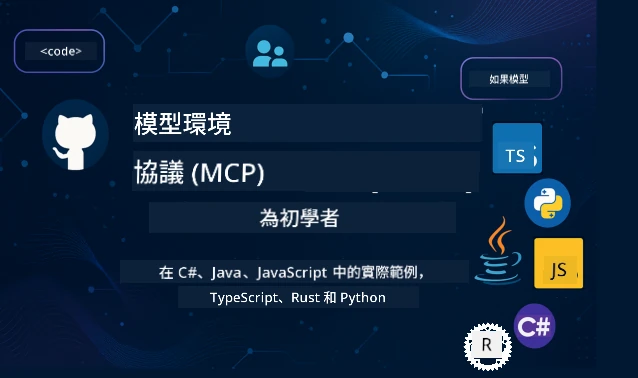

 

[](https://GitHub.com/microsoft/mcp-for-beginners/graphs/contributors)
[](https://GitHub.com/microsoft/mcp-for-beginners/issues)
[](https://GitHub.com/microsoft/mcp-for-beginners/pulls)
[](http://makeapullrequest.com)
[](https://mcptoplist.com/server/mcp.so%2Fmcp-for-beginners%2Fmicrosoft)

[](https://GitHub.com/microsoft/mcp-for-beginners/watchers)
[](https://GitHub.com/microsoft/mcp-for-beginners/fork)
[](https://GitHub.com/microsoft/mcp-for-beginners/stargazers)


[](https://discord.gg/nTYy5BXMWG)

跟隨以下步驟開始使用這些資源：
1. **Fork 存儲庫**：點擊 [](https://GitHub.com/microsoft/mcp-for-beginners/fork)
2. **Clone 存儲庫**：   `git clone https://github.com/microsoft/mcp-for-beginners.git`
3. <strong>加入</strong> [](https://discord.gg/nTYy5BXMWG)


### 🌐 多語言支援

#### 透過 GitHub Action 支援（自動且保持最新）

<!-- CO-OP TRANSLATOR LANGUAGES TABLE START -->
[Arabic](../ar/README.md) | [Bengali](../bn/README.md) | [Bulgarian](../bg/README.md) | [Burmese (Myanmar)](../my/README.md) | [Chinese (Simplified)](../zh-CN/README.md) | [Chinese (Traditional, Hong Kong)](./README.md) | [Chinese (Traditional, Macau)](../zh-MO/README.md) | [Chinese (Traditional, Taiwan)](../zh-TW/README.md) | [Croatian](../hr/README.md) | [Czech](../cs/README.md) | [Danish](../da/README.md) | [Dutch](../nl/README.md) | [Estonian](../et/README.md) | [Finnish](../fi/README.md) | [French](../fr/README.md) | [German](../de/README.md) | [Greek](../el/README.md) | [Hebrew](../he/README.md) | [Hindi](../hi/README.md) | [Hungarian](../hu/README.md) | [Indonesian](../id/README.md) | [Italian](../it/README.md) | [Japanese](../ja/README.md) | [Kannada](../kn/README.md) | [Khmer](../km/README.md) | [Korean](../ko/README.md) | [Lithuanian](../lt/README.md) | [Malay](../ms/README.md) | [Malayalam](../ml/README.md) | [Marathi](../mr/README.md) | [Nepali](../ne/README.md) | [Nigerian Pidgin](../pcm/README.md) | [Norwegian](../no/README.md) | [Persian (Farsi)](../fa/README.md) | [Polish](../pl/README.md) | [Portuguese (Brazil)](../pt-BR/README.md) | [Portuguese (Portugal)](../pt-PT/README.md) | [Punjabi (Gurmukhi)](../pa/README.md) | [Romanian](../ro/README.md) | [Russian](../ru/README.md) | [Serbian (Cyrillic)](../sr/README.md) | [Slovak](../sk/README.md) | [Slovenian](../sl/README.md) | [Spanish](../es/README.md) | [Swahili](../sw/README.md) | [Swedish](../sv/README.md) | [Tagalog (Filipino)](../tl/README.md) | [Tamil](../ta/README.md) | [Telugu](../te/README.md) | [Thai](../th/README.md) | [Turkish](../tr/README.md) | [Ukrainian](../uk/README.md) | [Urdu](../ur/README.md) | [Vietnamese](../vi/README.md)

> **想要本地 Clone？**
>
> 本存儲庫包含 50 多種語言翻譯，這會顯著增加下載大小。如欲 Clone 不包含翻譯的版本，請使用 sparse checkout：
>
> **Bash / macOS / Linux：**
> ```bash
> git clone --filter=blob:none --sparse https://github.com/microsoft/mcp-for-beginners.git
> cd mcp-for-beginners
> git sparse-checkout set --no-cone '/*' '!translations' '!translated_images'
> ```
>
> **CMD（Windows）：**
> ```cmd
> git clone --filter=blob:none --sparse https://github.com/microsoft/mcp-for-beginners.git
> cd mcp-for-beginners
> git sparse-checkout set --no-cone "/*" "!translations" "!translated_images"
> ```
>
> 這將提供完成課程所需的所有內容，下載速度更快。
<!-- CO-OP TRANSLATOR LANGUAGES TABLE END -->

# 🚀 初學者的 Model Context Protocol (MCP) 課程

## **通過 C#、Java、JavaScript、Rust、Python 及 TypeScript 的實戰代碼學習 MCP**

## 🧠 Model Context Protocol 課程綜覽
歡迎開始你的 Model Context Protocol 探索之旅！如果你曾好奇如何 AI 應用能與不同工具和服務溝通交流，你即將發現一個優雅的解決方案，正改變開發者構建智能系統的方式。

把 MCP 想象成 AI 應用的萬用翻譯器——就像 USB 接口讓你將任何裝置接駁到電腦一樣，MCP 讓 AI 模型能以標準化方式連接任何工具或服務。無論你是在建造第一個聊天機器人，還是處理複雜的 AI 工作流，理解 MCP 都能賦予你創建更強大、靈活應用的力量。

這套課程充滿耐心和細心設計，適合你的學習旅程。我們將從你已熟悉的簡單概念開始，通過實際操作和你喜愛的程式語言逐步建立專業知識。每個步驟都有清晰說明、實用範例，並隨時給予鼓勵。

完成這段旅程後，你將有信心自行構建 MCP 伺服器，將其整合到熱門 AI 平台，並了解這項技術如何重塑 AI 開發的未來。讓我們一起開始這激動人心的冒險吧！

### 官方文件與規範

本課程根據 **2025-11-25 MCP 規範**（最新穩定版本）制定。MCP 規範採用日期版本控制（YYYY-MM-DD 格式），確保協議版本清晰可追蹤。

> **展望未來：** 下一版本規範的候選釋出版本 **2026-07-28** 預計於 2026 年 7 月 28 日發布。該版本使協議在傳輸層上無狀態，正式化 Extensions 框架（MCP Apps, Tasks）、加強授權安全，並棄用 Roots、Sampling 和 Logging。詳情請參考 [MCP 的變革：2026-07-28 候選版本](./01-CoreConcepts/mcp-2026-07-28-release-candidate.md)。

這些資源隨著你的理解深入將更見價值，但不用急於一次讀完。先從你最感興趣的部分開始吧！
- 📘 [MCP 文件](https://modelcontextprotocol.io/) – 這是你的首選資源，提供循序漸進的教程和用戶指南。文件為初學者撰寫，提供清晰範例，讓你能跟隨並以自己的節奏學習。
- 📜 [MCP 規範](https://modelcontextprotocol.io/specification/2025-11-25) – 可視為你的全面參考手冊。學習過程中，你會回來查閱具體細節和探索高級功能。
- 📜 [MCP 規範版本控制](https://modelcontextprotocol.io/specification/versioning) – 含協議版本歷史信息及 MCP 如何使用日期版本控制（YYYY-MM-DD 格式）。
- 🧑‍💻 [MCP GitHub 存儲庫](https://github.com/modelcontextprotocol) – 這裡有多種程式語言的 SDK、工具與範例代碼，是一個實用範例和即用元件的寶庫。
- 🌐 [MCP 社區](https://github.com/orgs/modelcontextprotocol/discussions) – 加入其他學習者及經驗豐富的開發者，共同討論 MCP。這是個支持互助的社區，歡迎提問並自由分享知識。
  
## 學習目標

完成本課程後，你將感到自信且樂於運用所學。你將達成以下目標：

• **理解 MCP 基本原理**：你將掌握 Model Context Protocol 是什麼，為何它推動 AI 應用協作方式的革命，透過通俗類比和實例讓你易懂。

• **打造你的第一個 MCP 伺服器**：你將用喜歡的程式語言創建一個工作中的 MCP 伺服器，從簡單例子入手，逐步提升技能。

• **將 AI 模型連接至真實工具**：你將學會如何架起 AI 模型與實際服務之間的橋梁，賦予應用強大新功能。

• <strong>實施安全最佳實踐</strong>：你將明白如何保障 MCP 實現的安全性，保護你的應用和使用者。

• <strong>自信部署</strong>：你將了解如何將 MCP 項目從開發階段帶到生產環境，並掌握切實可行的部署策略。

• **加入 MCP 社群**：你將成為一個不斷壯大的開發者社群一員，共同開創 AI 應用開發的未來。 

## 基礎背景知識

在深入 MCP 細節之前，讓我們確保你對一些基礎概念感到熟悉。別擔心如果你不是這些領域的專家——我們會在過程中解釋所需的一切！

### 了解協議（基石）

把協議想象成對話規則。當你打電話給朋友時，你們都知道接電話要說「你好」、輪流講話，結束時要說「再見」。電腦程式也需要類似規則才能有效溝通。

MCP 是一種協議——一套約定俗成的規則，幫助 AI 模型與應用與工具和服務進行高效「對話」。就像規則讓人類溝通更順暢，MCP 讓 AI 應用溝通更可靠且強大。

### 客戶端-伺服器關係（程式如何協作）

你每天都在使用客戶端-伺服器關係！當你用瀏覽器（客戶端）訪問網站時，你是連接到伺服器，該伺服器會把頁面內容傳給你。瀏覽器知道如何提出請求，伺服器知道如何回應。

在 MCP 裡，我們有類似的關係：AI 模型作為客戶端來請求資料或行為，而 MCP 伺服器則提供這些功能。這就像有一位幫手（伺服器），AI 可以請它執行特定任務。

### 為何標準化重要（讓系統協同工作）

想像每個汽車廠商都用不同形狀的加油槍——你得為每輛車準備不同轉接頭！標準化就是統一規格，讓東西協調搭配。

MCP 為 AI 應用提供這樣的標準化。AI 模型不用針對每種工具寫特製代碼，MCP 建立通用溝通方式，讓開發者一次建好工具，就能用於多個不同 AI 系統。

## 🧭 你的學習路徑總覽

你的 MCP 旅程安排井然有序，逐步建立自信和技能。每個階段介紹新概念，同時鞏固已學知識。

### 🌱 基礎階段：理解基本概念（模組 0-2）

冒險就從這裡開始！我們會用熟悉的類比和簡單示例介紹 MCP 概念。你將明白 MCP 是什麼、它的存在意義，以及它如何融入 AI 開發更大生態。


• **模組 0 - MCP 介紹**：我們將從探索什麼是 MCP 及其對現代 AI 應用的重要性開始。你將看到 MCP 在現實世界中的實際例子，並了解它如何解決開發人員常遇到的問題。

• **模組 1 - 核心概念解析**：在這裡你將學習 MCP 的基本構建塊。我們將使用大量類比和視覺示例，確保這些概念自然而易於理解。

• **模組 2 - MCP 的安全性**：安全性可能聽起來令人畏懼，但我們會展示 MCP 如何內建安全功能，並教你從一開始就保護應用的最佳做法。

### 🔨 建構階段：創建你的首個實作（模組 3）

真正的樂趣現在開始了！你將實際動手構建 MCP 伺服器和客戶端。別擔心——我們會從簡單開始，並引導你完成每一步。

本模組包含多個動手指導，讓你能以偏好的程式語言實作。你將建立第一個伺服器，開發連接該伺服器的客戶端，甚至整合受歡迎的開發工具如 VS Code。

每個指導均附完整程式範例、故障排除技巧以及我們選擇特定設計的說明。結束該階段時，你會擁有可自豪的運作中 MCP 實作！

### 🚀 成長階段：進階概念與實務應用（模組 4-5）

掌握基礎後，你準備好探索更複雜的 MCP 功能。我們將涵蓋實務實作策略、除錯技術以及像多模態 AI 整合等進階主題。

你還會學習如何將你的 MCP 實作擴展到生產使用，並與像 Azure 這樣的雲端平台整合。這些模組幫助你建立能應對現實需求的 MCP 解決方案。

### 🌟 精通階段：社群與專精領域（模組 6-11）

最終階段著重於加入 MCP 社群並專注於你最感興趣的領域。你會學習如何為開源 MCP 專案貢獻代碼，實作進階認證模式，並建立綜合的資料庫整合解決方案。

模組 11 特別值得一提——它是完整的 13 個實驗室動手學習路徑，教你建立整合 PostgreSQL 的生產就緒 MCP 伺服器。就像一個結合你所學所有知識的頂點專案！

### 📚 完整課程結構

| 模組 | 主題 | 說明 | 連結 |
|--------|-------|-------------|------|
| **模組 0-3：基礎入門** | | | |
| 00 | MCP 介紹 | 模型上下文協議概覽及其在 AI 流程中的重要性 | [閱讀更多](./00-Introduction/README.md) |
| 01 | 核心概念解析 | 深入探討 MCP 核心概念 | [閱讀更多](./01-CoreConcepts/README.md) |
| 1.1 | MCP 變更概述 (2026-07-28 RC) | 無狀態協議、擴展框架及下一版本規範中即將廢除的功能 | [指南](./01-CoreConcepts/mcp-2026-07-28-release-candidate.md) |
| 02 | MCP 的安全性 | 安全威脅與最佳實踐 | [閱讀更多](./02-Security/README.md) |
| 03 | MCP 快速入門 | 環境設定、基礎伺服器/客戶端、整合 | [閱讀更多](./03-GettingStarted/README.md) |
| **模組 3：打造你的第一個伺服器與客戶端** | | | |
| 3.1 | 第一個伺服器 | 建立你的第一個 MCP 伺服器 | [指南](./03-GettingStarted/01-first-server/README.md) |
| 3.2 | 第一個客戶端 | 開發基礎 MCP 客戶端 | [指南](./03-GettingStarted/02-client/README.md) |
| 3.3 | 具備大型語言模型的客戶端 | 整合大型語言模型 | [指南](./03-GettingStarted/03-llm-client/README.md) |
| 3.4 | VS Code 整合 | 在 VS Code 中使用 MCP 伺服器 | [指南](./03-GettingStarted/04-vscode/README.md) |
| 3.5 | stdio 伺服器 | 使用 stdio 傳輸創建伺服器 | [指南](./03-GettingStarted/05-stdio-server/README.md) |
| 3.6 | HTTP 串流 | 在 MCP 中實作 HTTP 串流 | [指南](./03-GettingStarted/06-http-streaming/README.md) |
| 3.7 | Microsoft Foundry 工具組 | 使用 Microsoft Foundry 工具組搭配 MCP | [指南](./03-GettingStarted/07-aitk/README.md) |
| 3.8 | 測試 | 測試你的 MCP 伺服器實作 | [指南](./03-GettingStarted/08-testing/README.md) |
| 3.9 | 部署 | 將 MCP 伺服器部署到生產環境 | [指南](./03-GettingStarted/09-deployment/README.md) |
| 3.10 | 進階伺服器使用 | 使用進階伺服器以實現進階功能與改善架構 | [指南](./03-GettingStarted/10-advanced/README.md) |
| 3.11 | 簡易認證 | 從頭學習認證及 RBAC | [指南](./03-GettingStarted/11-simple-auth/README.md) |
| 3.12 | MCP 主機 | 設定 Claude Desktop、Cursor、Cline 及其他 MCP 主機 | [指南](./03-GettingStarted/12-mcp-hosts/README.md) |
| 3.13 | MCP 檢查器 | 使用 Inspector 工具除錯和測試 MCP 伺服器 | [指南](./03-GettingStarted/13-mcp-inspector/README.md) |
| 3.14 | 抽樣 | 使用抽樣與客戶端協作 | [指南](./03-GettingStarted/14-sampling/README.md) |
| 3.15 | MCP 應用程式 | 建立 MCP 應用程式 | [指南](./03-GettingStarted/15-mcp-apps/README.md) |
| **模組 4-5：實務與進階** | | | |
| 04 | 實務實作 | SDKs、除錯、測試、可重用提示範本 | [閱讀更多](./04-PracticalImplementation/README.md) |
| 4.1 | 分頁 | 使用游標分頁處理大量結果集 | [指南](./04-PracticalImplementation/pagination/README.md) |
| 05 | MCP 進階主題 | 多模態 AI、擴展、企業應用 | [閱讀更多](./05-AdvancedTopics/README.md) |
| 5.1 | Azure 整合 | MCP 與 Azure 的整合 | [指南](./05-AdvancedTopics/mcp-integration/README.md) |
| 5.2 | 多模態 | 處理多種模態資料 | [指南](./05-AdvancedTopics/mcp-multi-modality/README.md) |
| 5.3 | OAuth2 示範 | 實作 OAuth2 認證 | [指南](./05-AdvancedTopics/mcp-oauth2-demo/README.md) |
| 5.4 | 根上下文 | 理解並實作根上下文 | [指南](./05-AdvancedTopics/mcp-root-contexts/README.md) |
| 5.5 | 路由 | MCP 路由策略 | [指南](./05-AdvancedTopics/mcp-routing/README.md) |
| 5.6 | 抽樣 | MCP 中的抽樣技巧 | [指南](./05-AdvancedTopics/mcp-sampling/README.md) |
| 5.7 | 擴展 | 擴展 MCP 實作 | [指南](./05-AdvancedTopics/mcp-scaling/README.md) |
| 5.8 | 安全性 | 進階安全考量 | [指南](./05-AdvancedTopics/mcp-security/README.md) |
| 5.9 | 網頁搜尋 | 實作網頁搜尋功能 | [指南](./05-AdvancedTopics/web-search-mcp/README.md) |
| 5.10 | 即時串流 | 建構即時串流功能 | [指南](./05-AdvancedTopics/mcp-realtimestreaming/README.md) |
| 5.11 | 即時搜尋 | 實作即時搜尋 | [指南](./05-AdvancedTopics/mcp-realtimesearch/README.md) |
| 5.12 | Entra ID 認證 | 使用 Microsoft Entra ID 認證 | [指南](./05-AdvancedTopics/mcp-security-entra/README.md) |
| 5.13 | Foundry 整合 | 與 Microsoft Foundry 整合 | [指南](./05-AdvancedTopics/mcp-foundry-agent-integration/README.md) |
| 5.14 | 上下文工程 | 有效上下文工程技巧 | [指南](./05-AdvancedTopics/mcp-contextengineering/README.md) |
| 5.15 | MCP 自訂傳輸 | 自訂傳輸實作 | [指南](./05-AdvancedTopics/mcp-transport/README.md) |
| 5.16 | 協定功能 | 進度通知、取消、資源範本 | [指南](./05-AdvancedTopics/mcp-protocol-features/README.md) |
| 5.17 | 對抗性多代理推理 | 兩代理使用共享 MCP 工具辯論相反立場，由評審代理評估 | [指南](./05-AdvancedTopics/mcp-adversarial-agents/README.md) |
| **模組 6-10：社群與最佳實踐** | | | |
| 06 | 社群貢獻 | 如何為 MCP 生態系統貢獻 | [指南](./06-CommunityContributions/README.md) |
| 07 | 早期採用的心得 | 現實世界實作案例分享 | [指南](./07-LessonsfromEarlyAdoption/README.md) |
| 08 | MCP 最佳實踐 | 效能、容錯、韌性 | [指南](./08-BestPractices/README.md) |
| 09 | MCP 案例研究 | 實務實作範例 | [指南](./09-CaseStudy/README.md) |
| 10 | 實務工作坊 | 使用 Microsoft Foundry 工具組建立 MCP 伺服器 | [實驗室](./10-StreamliningAIWorkflowsBuildingAnMCPServerWithAIToolkit/README.md) |
| **模組 11：MCP 伺服器實作實驗室** | | | |
| 11 | MCP 伺服器資料庫整合 | 針對 PostgreSQL 整合的完整 13 個實驗室動手學習路徑 | [實驗室](./11-MCPServerHandsOnLabs/README.md) |
| 11.1 | 介紹 | MCP 與資料庫整合概覽及零售分析案例 | [實驗室 00](./11-MCPServerHandsOnLabs/00-Introduction/README.md) |
| 11.2 | 核心架構 | 理解 MCP 伺服器架構、資料庫層與安全模式 | [實驗室 01](./11-MCPServerHandsOnLabs/01-Architecture/README.md) |
| 11.3 | 安全性與多租戶 | 列級安全性、認證及多租戶資料存取 | [實驗室 02](./11-MCPServerHandsOnLabs/02-Security/README.md) |
| 11.4 | 環境設定 | 設置開發環境、Docker、Azure 資源 | [實驗室 03](./11-MCPServerHandsOnLabs/03-Setup/README.md) |
| 11.5 | 資料庫設計 | PostgreSQL 設定、零售架構設計與範例資料 | [實驗室 04](./11-MCPServerHandsOnLabs/04-Database/README.md) |
| 11.6 | MCP 伺服器實作 | 建立具資料庫整合的 FastMCP 伺服器 | [實驗室 05](./11-MCPServerHandsOnLabs/05-MCP-Server/README.md) |
| 11.7 | 工具開發 | 建立資料庫查詢工具與架構檢查 | [實驗室 06](./11-MCPServerHandsOnLabs/06-Tools/README.md) |
| 11.8 | 語意搜尋 | 使用 Azure OpenAI 與 pgvector 實作向量嵌入 | [實驗室 07](./11-MCPServerHandsOnLabs/07-Semantic-Search/README.md) |
| 11.9 | 測試與除錯 | 測試策略、除錯工具與驗證方法 | [實驗室 08](./11-MCPServerHandsOnLabs/08-Testing/README.md) |
| 11.10 | VS Code 整合 | 設定 VS Code MCP 整合與 AI 聊天使用 | [實驗室 09](./11-MCPServerHandsOnLabs/09-VS-Code/README.md) |
| 11.11 | 部署策略 | Docker 部署、Azure 容器應用與擴展考量 | [實驗室 10](./11-MCPServerHandsOnLabs/10-Deployment/README.md) |
| 11.12 | 監控 | 應用洞察、日誌記錄、效能監控 | [實驗室 11](./11-MCPServerHandsOnLabs/11-Monitoring/README.md) |
| 11.13 | 最佳實踐 | 性能優化、安全加固與生產建議 | [實驗室 12](./11-MCPServerHandsOnLabs/12-Best-Practices/README.md) |
| **模組 12：MCP 工具** | | | |
| 12.1 | 工具 | MCP 在 Copilot App 中的應用 | [指南](./12-tooling/README.md) |

### 💻 範例程式專案

學習 MCP 最令人興奮的部分之一是你程式技能的逐步提升。我們設計的程式範例從簡單開始，隨著你理解的加深，逐漸變得更精細。以下是我們介紹概念的方式——以容易理解卻展示真正 MCP 原理的程式碼，你不僅能理解這段程式碼做了什麼，還會明白為什麼要這樣設計，以及它如何融入更大的 MCP 應用中。

#### 基礎 MCP 計算器範例

| 語言 | 描述 | 連結 |
|----------|-------------|------|

| C# | MCP 伺服器範例 | [觀看程式碼](./03-GettingStarted/samples/csharp/README.md) |
| Java | MCP 計算機 | [觀看程式碼](./03-GettingStarted/samples/java/calculator/README.md) |
| JavaScript | MCP 演示 | [觀看程式碼](./03-GettingStarted/samples/javascript/README.md) |
| Python | MCP 伺服器 | [觀看程式碼](../../03-GettingStarted/samples/python/mcp_calculator_server.py) |
| TypeScript | MCP 範例 | [觀看程式碼](./03-GettingStarted/samples/typescript/README.md) |
| Rust | MCP 範例 | [觀看程式碼](./03-GettingStarted/samples/rust/README.md) |

#### 進階 MCP 實作

| 語言 | 描述 | 連結 |
|----------|-------------|------|
| C# | 進階範例 | [觀看程式碼](./04-PracticalImplementation/samples/csharp/README.md) |
| Java with Spring | 容器應用程式範例 | [觀看程式碼](./04-PracticalImplementation/samples/java/containerapp/README.md) |
| JavaScript | 進階範例 | [觀看程式碼](./04-PracticalImplementation/samples/javascript/README.md) |
| Python | 複雜實作 | [觀看程式碼](./04-PracticalImplementation/samples/python/README.md) |
| TypeScript | 容器範例 | [觀看程式碼](./04-PracticalImplementation/samples/typescript/README.md) |


## 🎯 MCP 學習先決條件

為了從此課程中獲益最大，您應該具備：

- 至少具備以下其中一種語言的基礎程式設計知識：C#、Java、JavaScript、Python 或 TypeScript
- 理解用戶端-伺服器模型及 API
- 熟悉 REST 與 HTTP 概念
- （選擇性）AI/機器學習概念背景

- 參與我們的社群討論以獲得支援

## 📚 學習指南與資源

本儲存庫包含多項資源，幫助您有效學習與導覽：

### 學習指南

提供完整的[學習指南](./study_guide.md)，協助您有效導覽本儲存庫。此視覺化課程地圖說明所有主題如何連結，並指導您如何有效使用範例專案。對喜歡全局視野的視覺型學習者尤其有幫助。

指南內容包括：
- 顯示涵蓋所有主題的視覺化課程地圖
- 各儲存庫部分的詳細拆解
- 使用範例專案的指引
- 依技能層級推薦的學習路徑
- 補充學習旅程的額外資源

### 更新紀錄

我們維護詳盡的[更新紀錄](./changelog.md)，追蹤課程教材中的所有重大更新，讓您隨時掌握最新改進與新增內容。
- 新增內容
- 結構變更
- 功能改進
- 文件更新

## 🛠️ 如何有效使用本課程

本指南中的每課包含：

1. 清晰解釋 MCP 概念  
2. 多語言實時程式碼範例  
3. 建構真實 MCP 應用的練習題  
4. 進階學習者的額外資源

### 一起用 C# 學 MCP - 教學系列
讓我們學習 Model Context Protocol (MCP)，這是設計用來標準化 AI 模型與用戶端應用交互的尖端框架。透過這個適合初學者的單元，我們將引導您認識 MCP 並建立第一個 MCP 伺服器。
#### C#: [https://aka.ms/letslearnmcp-csharp](https://aka.ms/letslearnmcp-csharp)
#### Java: [https://aka.ms/letslearnmcp-java](https://aka.ms/letslearnmcp-java)
#### JavaScript: [https://aka.ms/letslearnmcp-javascript](https://aka.ms/letslearnmcp-javascript)
#### Python: [https://aka.ms/letslearnmcp-python](https://aka.ms/letslearnmcp-python)

## 🎓 你的 MCP 旅程開始了

恭喜！你剛邁出了這段擴展程式技能並連結 AI 前沿的精彩旅程的第一步。

### 你已達成的目標

閱讀此入門介紹，即已開始建立你的 MCP 知識基礎。你理解了 MCP 是什麼、重要性，以及此課程如何支持你的學習之路。這是個重大成就，也是你在這項重要技術中累積專業知識的起點。

### 接下來的冒險

隨著你繼續學習各模組，請記得每位專家都曾是初學者。現在看似複雜的概念，透過練習與應用將成為你的第二天性。每一步微小的進步都會累積成強大的能力，陪伴你整個開發生涯。

### 你的支援網絡

你將加入一個熱衷 MCP 且樂於助人的學習者與專家社群。無論你遇到程式挑戰無法解決，或有突破想分享，社群都會支持你的旅程。

如果遇到困難或有關 AI 應用開發的問題，加入同伴學習者與資深開發者的 MCP 討論，這是一個歡迎提問且願意共享知識的支持性社區。

[](https://discord.gg/nTYy5BXMWG)

如果在開發過程中有產品回饋或錯誤，請訪問：

[](https://aka.ms/foundry/forum)

### 準備好開始了嗎？

你的 MCP 冒險即刻展開！從模組 0 開始，投入首次 MCP 實作體驗，或探索範例專案，看看你將建立什麼。記得——每位專家都是從你現在的位置開始，透過耐心和練習，你會為自己的成就感到驚喜。

歡迎來到 Model Context Protocol 開發的世界。讓我們一起打造非凡作品！

## 🤝 參與學習社群

此課程會隨著像你這樣的學習者貢獻而茁壯！不論是修正錯字、建議更清晰的說明，或新增範例，你的貢獻都幫助其他初學者成功。

感謝 Microsoft 杰出專業人士 [Shivam Goyal](https://www.linkedin.com/in/shivam2003/) 貢獻程式碼範例。

貢獻流程設計友善且支持絕大多數貢獻需簽署貢獻者授權協議（CLA），自動化工具將引導你順利完成。

## 📜 開放原始碼學習

本課程完全依 MIT [LICENSE](../../LICENSE) 開放，您可自由使用、修改及分享，支持我們推動 MCP 知識普及給所有開發者的使命。
## 🤝 貢獻指南

本專案歡迎貢獻及建議。絕大多數貢獻需同意一份
貢獻者授權協議（CLA），聲明您有權且實際授權我們
使用您的貢獻。詳情請參閱 <https://cla.opensource.microsoft.com>。

當您提交 pull request 時，CLA 機器人會自動判定您是否需要提供
CLA 並適當裝飾 PR（例如狀態檢查、留言）。請只需依機器人指示操作，
此流程在所有採用本 CLA 的儲存庫中只需執行一次。

本專案已採納 [Microsoft Open Source Code of Conduct](https://opensource.microsoft.com/codeofconduct/)。
詳細資訊請參閱 [行為準則 FAQ](https://opensource.microsoft.com/codeofconduct/faq/)，或
與我們聯絡 [opencode@microsoft.com](mailto:opencode@microsoft.com) 詢問其他問題或提出意見。

---

*準備好開始你的 MCP 旅程了嗎？從 [Module 00 - MCP 介紹](./00-Introduction/README.md) 開始，邁出進入 Model Context Protocol 開發世界的第一步！*


## 🎒 其他課程
我們團隊還製作其他課程！請查看：

<!-- CO-OP TRANSLATOR OTHER COURSES START -->
### LangChain
[](https://aka.ms/langchain4j-for-beginners)
[](https://aka.ms/langchainjs-for-beginners?WT.mc_id=m365-94501-dwahlin)
[](https://github.com/microsoft/langchain-for-beginners?WT.mc_id=m365-94501-dwahlin)
---

### Azure / Edge / MCP / Agents
[](https://github.com/microsoft/AZD-for-beginners?WT.mc_id=academic-105485-koreyst)
[](https://github.com/microsoft/edgeai-for-beginners?WT.mc_id=academic-105485-koreyst)
[](https://github.com/microsoft/mcp-for-beginners?WT.mc_id=academic-105485-koreyst)
[](https://github.com/microsoft/ai-agents-for-beginners?WT.mc_id=academic-105485-koreyst)

---
 
### 生成式 AI 系列
[](https://github.com/microsoft/generative-ai-for-beginners?WT.mc_id=academic-105485-koreyst)
[-9333EA?style=for-the-badge&labelColor=E5E7EB&color=9333EA)](https://github.com/microsoft/Generative-AI-for-beginners-dotnet?WT.mc_id=academic-105485-koreyst)
[-C084FC?style=for-the-badge&labelColor=E5E7EB&color=C084FC)](https://github.com/microsoft/generative-ai-for-beginners-java?WT.mc_id=academic-105485-koreyst)
[-E879F9?style=for-the-badge&labelColor=E5E7EB&color=E879F9)](https://github.com/microsoft/generative-ai-with-javascript?WT.mc_id=academic-105485-koreyst)

---
 
### 核心學習
[](https://aka.ms/ml-beginners?WT.mc_id=academic-105485-koreyst)
[](https://aka.ms/datascience-beginners?WT.mc_id=academic-105485-koreyst)
[](https://aka.ms/ai-beginners?WT.mc_id=academic-105485-koreyst)

[](https://github.com/microsoft/Security-101?WT.mc_id=academic-96948-sayoung)
[](https://aka.ms/webdev-beginners?WT.mc_id=academic-105485-koreyst)
[](https://aka.ms/iot-beginners?WT.mc_id=academic-105485-koreyst)
[](https://github.com/microsoft/xr-development-for-beginners?WT.mc_id=academic-105485-koreyst)

---
 
### Copilot 系列
[](https://aka.ms/GitHubCopilotAI?WT.mc_id=academic-105485-koreyst)
[](https://github.com/microsoft/mastering-github-copilot-for-dotnet-csharp-developers?WT.mc_id=academic-105485-koreyst)
[](https://github.com/microsoft/CopilotAdventures?WT.mc_id=academic-105485-koreyst)
<!-- CO-OP TRANSLATOR OTHER COURSES END -->

---

<!-- CO-OP TRANSLATOR DISCLAIMER START -->
**免責聲明**：
本文件由 AI 翻譯服務 [Co-op Translator](https://github.com/Azure/co-op-translator) 翻譯而成。雖然我們致力於確保準確性，但請注意，機器自動翻譯可能包含錯誤或不準確之處。原始文件的母語版本應被視為權威來源。對於重要資訊，建議進行專業人工翻譯。我們不對因使用本翻譯而產生的任何誤解或誤釋承擔責任。
<!-- CO-OP TRANSLATOR DISCLAIMER END -->