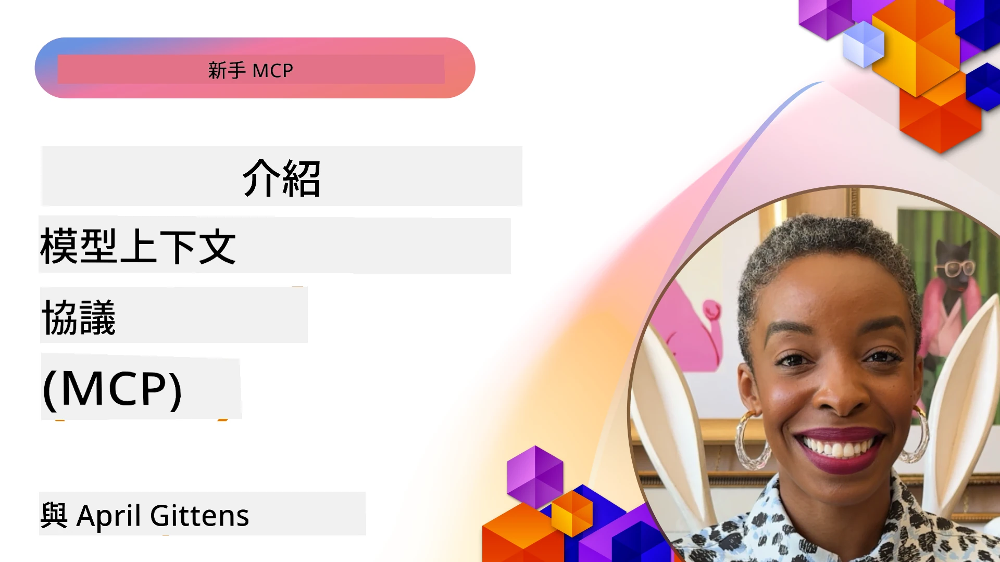
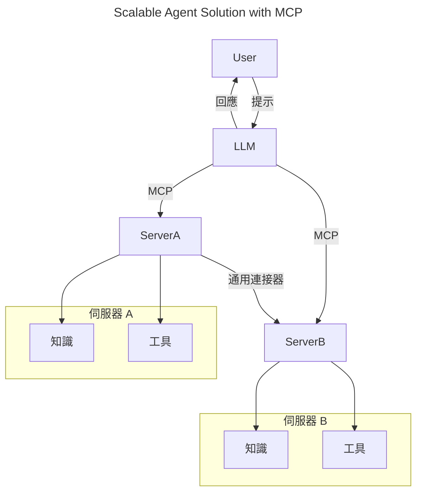
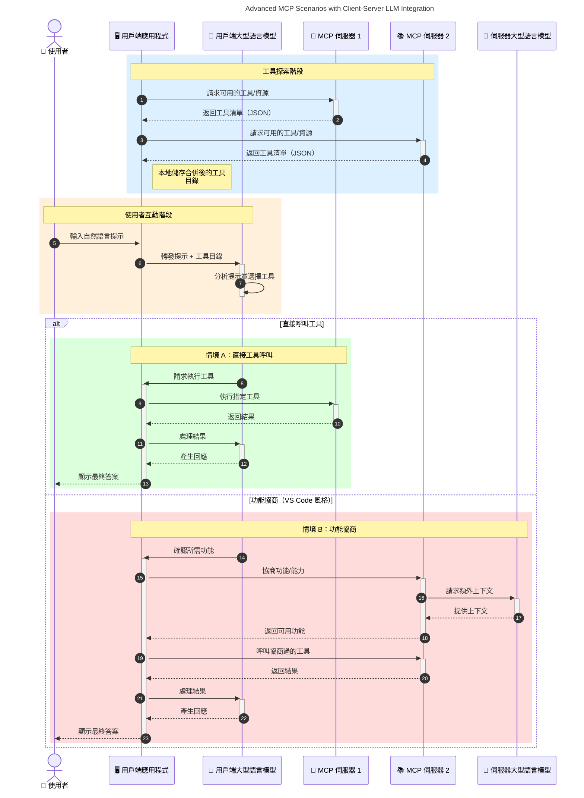

# 模型上下文協議（MCP）簡介：為何它對可擴展 AI 應用至關重要

[](https://youtu.be/agBbdiOPLQA)

_(點擊上方圖片觀看本課程影片)_

生成式 AI 應用是一大進步，因為它們通常讓用戶可以使用自然語言提示與應用互動。然而，隨著投入更多時間和資源於此類應用，您會希望能夠輕鬆整合功能和資源，使其易於擴展，您的應用能夠支援多個模型同時使用，並處理各種模型複雜性。簡而言之，構建生成式 AI 應用一開始很簡單，但隨著它們成長並變得更複雜，您需要開始定義架構，並可能需要依賴標準來確保應用一致地構建。這正是 MCP 出場，組織事務並提供標準的地方。

---

## **🔍 什麼是模型上下文協議（MCP）？**

**模型上下文協議（MCP）** 是一套 <strong>開放且標準化的介面</strong>，允許大型語言模型（LLMs）無縫地與外部工具、API 及資料源互動。它提供了一致的架構，以提升 AI 模型在訓練資料之外的功能，實現更智慧、可擴展且反應迅速的 AI 系統。

---

## **🎯 為何 AI 中的標準化很重要**

隨著生成式 AI 應用愈加複雜，採用標準以確保 **可擴展性、可延伸性、可維護性** 以及 <strong>避免供應商鎖定</strong> 顯得尤為重要。MCP 通過以下方式滿足這些需求：

- 統一模型與工具的整合
- 減少脆弱且一次性的客製化解決方案
- 允許來自不同供應商的多模型共存於同一生態系統

**注意：** 雖然 MCP 自稱為開放標準，但目前無計劃通過任何現有標準組織，如 IEEE、IETF、W3C、ISO 或其他標準機構予以標準化。

---

## **📚 學習目標**

在閱讀完本文後，您將能夠：

- 定義 **模型上下文協議（MCP）** 及其應用場景
- 了解 MCP 如何標準化模型與工具之間的通訊
- 識別 MCP 架構的核心組件
- 探索 MCP 在企業與開發領域的實際應用

---

## **💡 為何模型上下文協議（MCP）是遊戲規則改變者**

### **🔗 MCP 解決了 AI 互動的分散問題**

在 MCP 之前，將模型與工具整合需要：

- 每對工具與模型都需撰寫客製化程式碼
- 每個供應商使用非標準 API
- 版本更新常造成中斷
- 工具越多，可擴展性越差

### **✅ MCP 標準化帶來的好處**

| <strong>好處</strong>                | <strong>說明</strong>                                                                      |
|--------------------------|-------------------------------------------------------------------------------|
| 互通性                   | LLM 能無縫與不同供應商的工具協同作業                                         |
| 一致性                   | 各平台及工具間行為一致                                                        |
| 可重用性                 | 工具一次構建，可跨專案與系統使用                                             |
| 加速開發                 | 利用標準化即插即用介面縮短開發時間                                         |

---

## **🧱 MCP 架構高階概覽**

MCP 採用 **客戶端-伺服器模型**，其中：

- **MCP Hosts** 執行 AI 模型
- **MCP Clients** 發起請求
- **MCP Servers** 提供上下文、工具及功能

### **核心組件：**

- <strong>資源</strong> – 模型的靜態或動態數據  
- <strong>提示</strong> – 引導生成的預定義工作流程  
- <strong>工具</strong> – 可執行功能如搜尋、計算  
- <strong>取樣</strong> – 透過遞迴互動實現代理行為（在 MCP `2026-07-28` 版本廢止；新實作應直接與 LLM 供應商整合）  
 
 
- <strong>引導</strong> – 伺服器主動發起用戶輸入請求  
- <strong>根目錄</strong> – 與伺服器相關的資訊檔案系統位置  
    （在 MCP `2026-07-28` 版本廢止；建議使用工具參數、資源 URI 或  
    伺服器配置代替）  

### **協議架構：**

MCP 採用兩層架構：
- <strong>資料層</strong>：JSON-RPC 2.0 訊息、每請求元資料、發現及協議基元
- <strong>傳輸層</strong>：本地子程序使用 stdio，遠端伺服器則使用可串流 HTTP。可串流 HTTP 可使用 SSE 框架進行串流回應，但較舊的 HTTP+SSE 傳輸已被淘汰。


---

## MCP 伺服器工作方式

MCP 伺服器的運作流程如下：

- <strong>請求流程</strong>：
    1. 請求由最終用戶或代表其行動的軟體發起。
    2. **MCP Client** 將該請求發送給管理 AI 模型執行的 **MCP Host**。
    3. **AI 模型** 收到用戶提示後，可能透過一個或多個工具呼叫請求存取外部工具或資料。
    4. **MCP Host**（非模型直接）使用標準化協議與適當的 **MCP Server(s)** 通訊。
- **MCP Host 功能**：
    - <strong>工具登錄</strong>：維護可用工具及其功能的目錄。
    - <strong>身份驗證</strong>：驗證工具存取權限。
    - <strong>請求處理器</strong>：處理模型發出的工具請求。
    - <strong>回應格式化</strong>：將工具輸出結構化為模型可理解的格式。
- **MCP Server 執行**：
    - **MCP Host** 將工具呼叫路由到一個或多個 **MCP Server**，它們公開特化功能（如搜尋、計算、資料庫查詢）。
    - **MCP Server** 執行相應操作並以一致格式將結果返回給 **MCP Host**。
    - **MCP Host** 格式化並轉送結果給 **AI 模型**。
- <strong>回應完成</strong>：
    - **AI 模型** 整合工具輸出形成最終回應。
    - **MCP Host** 將該回應發回給 **MCP Client**，由其交付予最終用戶或呼叫軟體。
    

```mermaid
---
title: MCP Architecture and Component Interactions
description: A diagram showing the flows of the components in MCP.
---
graph TD
    Client[MCP 用戶端/應用程式] -->|發送請求| H[MCP 主機]
    H -->|調用| A[AI 模型]
    A -->|工具調用請求| H
    H -->|MCP Protocol| T1[MCP Server Tool 01: 網頁搜尋]
    H -->|MCP Protocol| T2[MCP Server Tool 02: 計算機工具]
    H -->|MCP Protocol| T3[MCP Server Tool 03: 資料庫存取工具]
    H -->|MCP Protocol| T4[MCP Server Tool 04: 檔案系統工具]
    H -->|發送回應| Client

    subgraph 「MCP 主機組件」
        H
        G[工具登記處]
        I[認證]
        J[請求處理器]
        K[回應格式化器]
    end

    H <--> G
    H <--> I
    H <--> J
    H <--> K

    style A fill:#f9d5e5,stroke:#333,stroke-width:2px
    style H fill:#eeeeee,stroke:#333,stroke-width:2px
    style Client fill:#d5e8f9,stroke:#333,stroke-width:2px
    style G fill:#fffbe6,stroke:#333,stroke-width:1px
    style I fill:#fffbe6,stroke:#333,stroke-width:1px
    style J fill:#fffbe6,stroke:#333,stroke-width:1px
    style K fill:#fffbe6,stroke:#333,stroke-width:1px
    style T1 fill:#c2f0c2,stroke:#333,stroke-width:1px
    style T2 fill:#c2f0c2,stroke:#333,stroke-width:1px
    style T3 fill:#c2f0c2,stroke:#333,stroke-width:1px
    style T4 fill:#c2f0c2,stroke:#333,stroke-width:1px
```

## 👨‍💻 如何建構 MCP 伺服器（附範例）

MCP 伺服器讓您能透過提供資料和功能擴展大型語言模型的能力。

準備好嚐試了嗎？以下是針對不同語言和/或技術棧的 SDK，並附有創建簡單 MCP 伺服器的範例：

- **Python SDK**: https://github.com/modelcontextprotocol/python-sdk

- **TypeScript SDK**: https://github.com/modelcontextprotocol/typescript-sdk

- **Java SDK**: https://github.com/modelcontextprotocol/java-sdk


- **C#/.NET SDK**: https://github.com/modelcontextprotocol/csharp-sdk


## 🌍 MCP 的真實世界應用案例

MCP 通過擴展 AI 能力，支持各種應用：

| <strong>應用</strong>                    | <strong>說明</strong>                                                                                   |
|----------------------------|--------------------------------------------------------------------------------------------|
| 企業數據整合                | 將大型語言模型連接到數據庫、客戶關係管理（CRM）或內部工具                                   |
| 自主型 AI 系統              | 使具備工具訪問和決策工作流程的自主代理人得以實現                                            |
| 多模態應用                  | 在單一統一的 AI 應用中結合文本、圖像和音頻工具                                             |
| 實時數據整合                | 將即時數據引入 AI 互動，提供更準確及時的輸出                                               |


### 🧠 MCP = AI 互動的通用標準

Model Context Protocol（MCP）就像 USB-C 標準化了裝置的物理連接一樣，充當 AI 互動的通用標準。在 AI 世界中，MCP 提供一致的介面，使模型（客戶端）能與外部工具和資料提供者（伺服器）無縫整合。如此一來，無需為每個 API 或資料來源開發不同且自訂的協議。

在 MCP 框架下，MCP 相容的工具（稱為 MCP 伺服器）遵循統一標準。這些伺服器能列出它們所提供的工具或行動，並在 AI 代理要求時執行這些行動。支援 MCP 的 AI 代理平台能發現伺服器上可用的工具，並透過此標準協議呼叫它們。

### 💡 促進知識存取

MCP 不僅提供工具，也促進對知識的存取。它使應用程式能將上下文提供給大型語言模型（LLM），透過連結多種資料來源。例如，一個 MCP 伺服器可能代表公司的文件庫，讓代理隨需檢索相關資訊。另一個伺服器則可能處理特定作業，如發送電郵或更新紀錄。對代理而言，這些都是它可用的工具——有些工具回傳資料（知識上下文），有些則執行操作。MCP 高效地管理兩者。

連接到 MCP 伺服器的代理會自動透過標準格式學習伺服器可用的功能與可存取資料。這種標準化支持工具動態可用性。例如，在代理系統中增加新 MCP 伺服器，其功能即刻可用，無需進一步調整代理指令。

這種流暢整合符合下圖所示流程，伺服器同時提供工具與知識，確保系統間無縫協作。

### 👉 範例：可擴展的代理解決方案


通用連接器允許 MCP 伺服器彼此溝通並分享能力，使 ServerA 可以將任務委派給 ServerB 或存取其工具和知識。這實現了跨伺服器的工具和資料聯邦，支援可擴展且模組化的代理架構。由於 MCP 將工具揭露標準化，代理能動態發現並在伺服器間路由請求，而無需硬編碼整合。


工具與知識聯邦：工具和數據可跨伺服器存取，實現更具擴展性和模組化的自主代理架構。

### 🔄 進階 MCP 場景與客戶端 LLM 整合

除了基本的 MCP 架構外，還有更複雜的場景，其中客戶端和伺服器皆包含大型語言模型，使互動更為先進。下圖中，**Client App** 可能是一個整合多個 MCP 工具供 LLM 使用的 IDE：



## 🔐 MCP 的實際好處

以下是使用 MCP 的實際優勢：

- <strong>資訊更新</strong>：模型能存取超出訓練資料的最新資訊
- <strong>能力擴展</strong>：模型可以利用未受訓練領域的專用工具
- <strong>減少幻覺</strong>：外部資料來源提供真實依據
- <strong>隱私保護</strong>：敏感資料可留在安全環境中，而不必嵌入提示詞

## 📌 主要重點

使用 MCP 的主要重點包括：

- **MCP** 標準化 AI 模型與工具及資料的互動方式
- 促進 **擴展性、一致性與互通性**
- MCP 幫助 **縮短開發時間、提升可靠性並擴展模型能力**
- 客戶端-伺服器架構 **實現靈活且可擴展的 AI 應用**

## 🧠 練習

思考一個你有興趣開發的 AI 應用。

- 哪些 <strong>外部工具或資料</strong> 可以提升它的能力？
- MCP 如何使整合 **更簡單且可靠？**

## 附加資源

- [MCP GitHub Repository](https://github.com/modelcontextprotocol)


## 下一步

下一章：[第一章：核心概念](../01-CoreConcepts/README.md)

---

<!-- CO-OP TRANSLATOR DISCLAIMER START -->
**免責聲明**：
本文件使用 AI 翻譯服務 [Co-op Translator](https://github.com/Azure/co-op-translator) 進行翻譯。雖然我們力求準確，但請注意，自動翻譯可能包含錯誤或不準確之處。原始文件的母語版本應被視為權威來源。對於重要資訊，建議尋求專業人工翻譯。我們不對因使用本翻譯而引起的任何誤解或曲解承擔責任。
<!-- CO-OP TRANSLATOR DISCLAIMER END -->