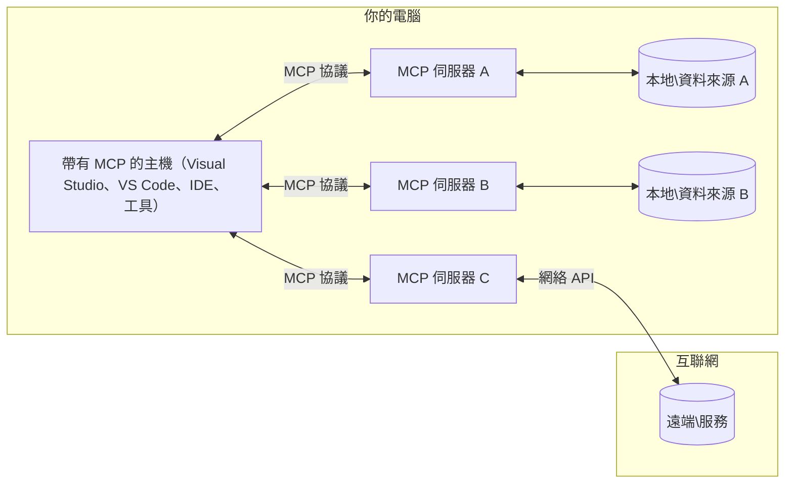

# MCP 核心概念：掌握模型上下文協議以整合 AI

[](https://youtu.be/earDzWGtE84)

_(點擊上方圖片觀看本課程影片)_

[模型上下文協議 (Model Context Protocol, MCP)](https://github.com/modelcontextprotocol) 是一個強大且標準化的框架，優化大型語言模型（LLM）與外部工具、應用程式及資料來源之間的通訊。  
本指南將帶您了解 MCP 的核心概念。您將學習其客戶端-伺服器架構、基本組件、通訊機制及實作最佳實務。

- **明確用戶同意**：所有資料存取與操作皆需用戶明確批准後方可執行。用戶必須清楚了解將存取哪些資料及執行哪些動作，並可細緻控制權限與授權。

- **資料隱私保護**：用戶資料僅在明確同意下揭露，且必須在整個互動生命週期中受到嚴格存取控制保護。實作必須防止未授權資料傳輸並維持嚴格隱私界限。

- **工具執行安全**：每次工具調用皆需用戶明確同意，並清楚了解工具功能、參數及潛在影響。必須有強健的安全邊界防止非預期、不安全或惡意的工具執行。

- **傳輸層安全**：所有通訊通道應使用適當的加密與驗證機制。遠端連線應實作安全傳輸協定及妥善的憑證管理。

#### 實作指引：

- **權限管理**：實作細粒度權限系統，允許用戶控制可存取的伺服器、工具及資源  
- **身份驗證與授權**：使用安全身份驗證方法（OAuth、API 金鑰），並妥善管理令牌與過期時間  
- **輸入驗證**：依定義的結構驗證所有參數與資料輸入，防止注入攻擊  
- **稽核日誌**：維護完整操作日誌以利安全監控與合規

## 概覽

本課程探討構成模型上下文協議（MCP）生態系的基本架構與組件。您將了解客戶端-伺服器架構、關鍵組件及驅動 MCP 互動的通訊機制。

## 主要學習目標

完成本課程後，您將能：

- 理解 MCP 的客戶端-伺服器架構。  
- 辨識主機、客戶端與伺服器的角色與責任。  
- 分析使 MCP 成為靈活整合層的核心特性。  
- 學習 MCP 生態系中資訊流動方式。  
- 透過 .NET、Java、Python 與 JavaScript 範例獲得實務見解。

## MCP 架構：深入解析

MCP 生態系建立於客戶端-伺服器模型。此模組化結構允許 AI 應用有效地與工具、資料庫、API 及上下文資源互動。以下將此架構拆解為核心組件。

MCP 核心遵循客戶端-伺服器架構，主機應用可連接多個伺服器：


- **MCP 主機**：如 VSCode、Claude Desktop、IDE 或欲透過 MCP 存取資料的 AI 工具  
- **MCP 客戶端**：維持與伺服器一對一連線的協議客戶端  
- **MCP 伺服器**：輕量程式，透過標準化模型上下文協議暴露特定功能  
- **本地資料來源**：您電腦上的檔案、資料庫及 MCP 伺服器可安全存取的服務  
- **遠端服務**：透過 API 連接的網際網路外部系統

MCP 協議為持續演進的標準，採用日期版本控制（YYYY-MM-DD 格式）。目前協議版本為 **2025-11-25**。您可查看最新的[協議規範](https://modelcontextprotocol.io/specification/2025-11-25/)

### 1. 主機

在模型上下文協議（MCP）中，**主機**是 AI 應用，作為用戶與協議互動的主要介面。主機透過為每個伺服器連線建立專屬 MCP 客戶端，協調並管理多個 MCP 伺服器的連線。主機範例包括：

- **AI 應用**：Claude Desktop、Visual Studio Code、Claude Code  
- **開發環境**：整合 MCP 的 IDE 與程式編輯器  
- **自訂應用**：專門打造的 AI 代理與工具

**主機**是協調 AI 模型互動的應用。它們：

- **編排 AI 模型**：執行或互動 LLM 以產生回應並協調 AI 工作流程  
- **管理客戶端連線**：為每個 MCP 伺服器連線建立並維護一個 MCP 客戶端  
- **控制使用者介面**：處理對話流程、用戶互動及回應呈現  
- **執行安全控管**：控制權限、安全限制與身份驗證  
- **處理用戶同意**：管理用戶對資料分享與工具執行的批准

### 2. 客戶端

**客戶端**是維持主機與 MCP 伺服器間專屬一對一連線的重要組件。每個 MCP 客戶端由主機實例化以連接特定 MCP 伺服器，確保通訊管道有序且安全。多個客戶端使主機能同時連接多個伺服器。

**客戶端**是主機應用內的連接器組件。它們：

- **協議通訊**：以 JSON-RPC 2.0 向伺服器發送提示與指令請求  
- **功能協商**：初始化時與伺服器協商支援的功能與協議版本  
- **工具執行**：管理模型的工具執行請求並處理回應  
- **即時更新**：處理伺服器的通知與即時更新  
- **回應處理**：處理並格式化伺服器回應以呈現給用戶

### 3. 伺服器

**伺服器**是向 MCP 客戶端提供上下文、工具與功能的程式。它們可在本地（與主機同機器）或遠端（外部平台）執行，負責處理客戶端請求並提供結構化回應。伺服器透過標準化模型上下文協議暴露特定功能。

**伺服器**是提供上下文與功能的服務。它們：

- **功能註冊**：向客戶端註冊並暴露可用的原語（資源、提示、工具）  
- **請求處理**：接收並執行工具調用、資源請求與提示請求  
- **上下文提供**：提供上下文資訊與資料以增強模型回應  
- **狀態管理**：維護會話狀態並在需要時處理有狀態互動  
- **即時通知**：向連線客戶端發送功能變更與更新通知

任何人皆可開發伺服器以擴展模型功能，並支援本地與遠端部署場景。

### 4. 伺服器原語

模型上下文協議（MCP）中的伺服器提供三種核心**原語**，定義客戶端、主機與語言模型間豐富互動的基本構件。這些原語指定協議可用的上下文資訊與動作類型。

MCP 伺服器可暴露以下三種核心原語的任意組合：

#### 資源

**資源**是提供上下文資訊給 AI 應用的資料來源。它們代表靜態或動態內容，可增強模型理解與決策：

- **上下文資料**：供 AI 模型使用的結構化資訊與上下文  
- **知識庫**：文件庫、文章、手冊與研究論文  
- **本地資料來源**：檔案、資料庫及本地系統資訊  
- **外部資料**：API 回應、網路服務與遠端系統資料  
- **動態內容**：根據外部條件更新的即時資料

資源以 URI 識別，並支援透過 `resources/list` 發現及 `resources/read` 讀取：

```text
file://documents/project-spec.md
database://production/users/schema
api://weather/current
```

#### 提示

**提示**是可重用的範本，幫助結構化與語言模型的互動。它們提供標準化的互動模式與範本化工作流程：

- **範本互動**：預先結構化的訊息與對話開場白  
- **工作流程範本**：常見任務與互動的標準化序列  
- **少量示例**：基於示例的模型指令範本  
- **系統提示**：定義模型行為與上下文的基礎提示  
- **動態範本**：可參數化並適應特定上下文的提示

提示支援變數替換，可透過 `prompts/list` 發現並用 `prompts/get` 取得：

```markdown
Generate a {{task_type}} for {{product}} targeting {{audience}} with the following requirements: {{requirements}}
```

#### 工具

**工具**是 AI 模型可調用以執行特定動作的可執行函式。它們代表 MCP 生態系的「動詞」，使模型能與外部系統互動：

- **可執行函式**：模型可帶特定參數調用的離散操作  
- **外部系統整合**：API 呼叫、資料庫查詢、檔案操作、計算  
- **唯一身份**：每個工具有獨特名稱、描述與參數結構  
- **結構化輸入輸出**：工具接受驗證參數並回傳結構化、類型化回應  
- **動作能力**：使模型能執行實際動作並取得即時資料

工具以 JSON Schema 定義參數驗證，透過 `tools/list` 發現並用 `tools/call` 執行：

```typescript
server.tool(
  "search_products", 
  {
    query: z.string().describe("Search query for products"),
    category: z.string().optional().describe("Product category filter"),
    max_results: z.number().default(10).describe("Maximum results to return")
  }, 
  async (params) => {
    // 執行搜尋並返回結構化結果
    return await productService.search(params);
  }
);
```

## 客戶端原語

在模型上下文協議（MCP）中，**客戶端**可暴露原語，使伺服器能向主機應用請求額外功能。這些客戶端原語允許更豐富、互動性更強的伺服器實作，能存取 AI 模型功能與用戶互動。

### 取樣

**取樣**允許伺服器向客戶端的 AI 應用請求語言模型完成。此原語使伺服器能在不嵌入自身模型依賴的情況下存取 LLM 功能：

- **模型獨立存取**：伺服器可請求完成，無需包含 LLM SDK 或管理模型存取  
- **伺服器主動 AI**：使伺服器能自主使用客戶端 AI 模型生成內容  
- **遞迴 LLM 互動**：支援伺服器需 AI 協助處理的複雜場景  
- **動態內容生成**：允許伺服器使用主機模型創建上下文回應

取樣透過 `sampling/complete` 方法啟動，伺服器向客戶端發送完成請求。

### 引導

**引導**使伺服器能透過客戶端介面向用戶請求額外資訊或確認：

- **用戶輸入請求**：伺服器可在執行工具時請求額外資訊  
- **確認對話框**：請求用戶批准敏感或具影響力的操作  
- **互動工作流程**：使伺服器能建立逐步用戶互動  
- **動態參數收集**：在工具執行過程中收集缺失或選用參數

引導請求使用 `elicitation/request` 方法，透過客戶端介面收集用戶輸入。

### 紀錄

**紀錄**允許伺服器向客戶端發送結構化日誌訊息，用於除錯、監控與運營可視化：

- **除錯支援**：使伺服器能提供詳細執行日誌以利故障排除  
- **運營監控**：向客戶端發送狀態更新與效能指標  
- **錯誤回報**：提供詳細錯誤上下文與診斷資訊  
- **稽核軌跡**：建立伺服器操作與決策的完整日誌

紀錄訊息發送給客戶端，以提供伺服器操作透明度並促進除錯。

## MCP 中的資訊流

模型上下文協議（MCP）定義主機、客戶端、伺服器與模型間的結構化資訊流。理解此流程有助於釐清用戶請求如何被處理，以及外部工具與資料如何整合進模型回應。

- **主機啟動連線**  
  主機應用（如 IDE 或聊天介面）建立與 MCP 伺服器的連線，通常透過 STDIO、WebSocket 或其他支援的傳輸方式。

- **功能協商**  
  客戶端（嵌入主機）與伺服器交換支援的功能、工具、資源與協議版本資訊。確保雙方了解本次會話可用的功能。

- **用戶請求**  
  用戶與主機互動（例如輸入提示或指令）。主機收集輸入並傳給客戶端處理。

- **資源或工具使用**  
  - 客戶端可能向伺服器請求額外上下文或資源（如檔案、資料庫條目或知識庫文章）以豐富模型理解。  
  - 若模型判斷需要工具（例如取得資料、執行計算或呼叫 API），客戶端會向伺服器發送工具調用請求，指定工具名稱與參數。

- **伺服器執行**  
  伺服器接收資源或工具請求，執行必要操作（如執行函式、查詢資料庫或取得檔案），並以結構化格式回傳結果給客戶端。

- **回應生成**  
  客戶端將伺服器回應（資源資料、工具輸出等）整合進持續的模型互動。模型利用這些資訊產生完整且具上下文相關性的回應。

- **結果呈現**  
  主機接收客戶端的最終輸出並呈現給用戶，通常包含模型生成的文字及工具執行或資源查詢的結果。

此流程使 MCP 能透過無縫連接模型與外部工具及資料來源，支援先進、互動且具上下文感知的 AI 應用。

## 協議架構與層級

MCP 由兩個不同的架構層級組成，協同提供完整的通訊框架：

### 資料層

**資料層**以 **JSON-RPC 2.0** 為基礎實作 MCP 核心協議。此層定義訊息結構、語意與互動模式：

#### 核心組件：

- **JSON-RPC 2.0 協議**：所有通訊使用標準化 JSON-RPC 2.0 訊息格式進行方法呼叫、回應與通知
- **生命週期管理**：處理客戶端與伺服器之間的連線初始化、功能協商及會話終止
- **伺服器原語**：使伺服器能透過工具、資源及提示提供核心功能
- **客戶端原語**：使伺服器能請求從大型語言模型取樣、引導用戶輸入及傳送日誌訊息
- **即時通知**：支援非同步通知以動態更新，無需輪詢

#### 主要功能：

- **協議版本協商**：使用基於日期的版本控制（YYYY-MM-DD）以確保相容性
- **功能發現**：客戶端與伺服器在初始化時交換支援的功能資訊
- **有狀態會話**：維持多次互動間的連線狀態以保持上下文連續性

### 傳輸層

**傳輸層**管理 MCP 參與者之間的通訊通道、訊息框架及身份驗證：

#### 支援的傳輸機制：

1. **STDIO 傳輸**：
   - 使用標準輸入/輸出串流進行直接的程序通訊
   - 適合同一台機器上的本地程序，無網路開銷
   - 常用於本地 MCP 伺服器實作

2. **可串流 HTTP 傳輸**：
   - 使用 HTTP POST 傳送客戶端至伺服器的訊息  
   - 可選擇使用伺服器推送事件（SSE）進行伺服器至客戶端的串流
   - 支援跨網路的遠端伺服器通訊
   - 支援標準 HTTP 身份驗證（承載令牌、API 金鑰、自訂標頭）
   - MCP 建議使用 OAuth 以實現安全的基於令牌的身份驗證

#### 傳輸抽象：

傳輸層將通訊細節從資料層抽象化，使所有傳輸機制均使用相同的 JSON-RPC 2.0 訊息格式。此抽象允許應用程式無縫切換本地與遠端伺服器。

### 安全考量

MCP 實作必須遵守多項關鍵安全原則，以確保所有協議操作的安全、可信及可靠互動：

- **用戶同意與控制**：用戶必須明確同意後，方可存取資料或執行操作。用戶應清楚掌控分享的資料及授權的行為，並透過直覺的使用者介面審核及批准活動。

- **資料隱私**：用戶資料僅在明確同意下揭露，並必須受到適當的存取控制保護。MCP 實作必須防止未授權的資料傳輸，確保隱私在所有互動中得到維護。

- **工具安全**：呼叫任何工具前需取得明確用戶同意。用戶應清楚了解每個工具的功能，並強制執行嚴格的安全邊界，防止非預期或不安全的工具執行。

遵循這些安全原則，MCP 確保用戶信任、隱私及安全在所有協議互動中得到維護，同時實現強大的 AI 整合。

## 程式碼範例：關鍵元件

以下為多種流行程式語言的程式碼範例，展示如何實作 MCP 伺服器的關鍵元件及工具。

### .NET 範例：建立簡單的 MCP 伺服器與工具

此實用的 .NET 程式碼範例示範如何實作簡單的 MCP 伺服器及自訂工具。範例展示如何定義及註冊工具、處理請求，並使用模型上下文協議連接伺服器。

```csharp
using System;
using System.Threading.Tasks;
using ModelContextProtocol.Server;
using ModelContextProtocol.Server.Transport;
using ModelContextProtocol.Server.Tools;

public class WeatherServer
{
    public static async Task Main(string[] args)
    {
        // Create an MCP server
        var server = new McpServer(
            name: "Weather MCP Server",
            version: "1.0.0"
        );
        
        // Register our custom weather tool
        server.AddTool<string, WeatherData>("weatherTool", 
            description: "Gets current weather for a location",
            execute: async (location) => {
                // Call weather API (simplified)
                var weatherData = await GetWeatherDataAsync(location);
                return weatherData;
            });
        
        // Connect the server using stdio transport
        var transport = new StdioServerTransport();
        await server.ConnectAsync(transport);
        
        Console.WriteLine("Weather MCP Server started");
        
        // Keep the server running until process is terminated
        await Task.Delay(-1);
    }
    
    private static async Task<WeatherData> GetWeatherDataAsync(string location)
    {
        // This would normally call a weather API
        // Simplified for demonstration
        await Task.Delay(100); // Simulate API call
        return new WeatherData { 
            Temperature = 72.5,
            Conditions = "Sunny",
            Location = location
        };
    }
}

public class WeatherData
{
    public double Temperature { get; set; }
    public string Conditions { get; set; }
    public string Location { get; set; }
}
```

### Java 範例：MCP 伺服器元件

此範例示範與上述 .NET 範例相同的 MCP 伺服器及工具註冊，但以 Java 實作。

```java
import io.modelcontextprotocol.server.McpServer;
import io.modelcontextprotocol.server.McpToolDefinition;
import io.modelcontextprotocol.server.transport.StdioServerTransport;
import io.modelcontextprotocol.server.tool.ToolExecutionContext;
import io.modelcontextprotocol.server.tool.ToolResponse;

public class WeatherMcpServer {
    public static void main(String[] args) throws Exception {
        // 建立一個MCP伺服器
        McpServer server = McpServer.builder()
            .name("Weather MCP Server")
            .version("1.0.0")
            .build();
            
        // 註冊一個天氣工具
        server.registerTool(McpToolDefinition.builder("weatherTool")
            .description("Gets current weather for a location")
            .parameter("location", String.class)
            .execute((ToolExecutionContext ctx) -> {
                String location = ctx.getParameter("location", String.class);
                
                // 獲取天氣數據（簡化版）
                WeatherData data = getWeatherData(location);
                
                // 返回格式化的回應
                return ToolResponse.content(
                    String.format("Temperature: %.1f°F, Conditions: %s, Location: %s", 
                    data.getTemperature(), 
                    data.getConditions(), 
                    data.getLocation())
                );
            })
            .build());
        
        // 使用stdio傳輸連接伺服器
        try (StdioServerTransport transport = new StdioServerTransport()) {
            server.connect(transport);
            System.out.println("Weather MCP Server started");
            // 保持伺服器運行直到程序終止
            Thread.currentThread().join();
        }
    }
    
    private static WeatherData getWeatherData(String location) {
        // 實作會調用天氣API
        // 為示例目的簡化處理
        return new WeatherData(72.5, "Sunny", location);
    }
}

class WeatherData {
    private double temperature;
    private String conditions;
    private String location;
    
    public WeatherData(double temperature, String conditions, String location) {
        this.temperature = temperature;
        this.conditions = conditions;
        this.location = location;
    }
    
    public double getTemperature() {
        return temperature;
    }
    
    public String getConditions() {
        return conditions;
    }
    
    public String getLocation() {
        return location;
    }
}
```

### Python 範例：建立 MCP 伺服器

此範例使用 fastmcp，請先確保已安裝：

```python
pip install fastmcp
```
程式碼範例：

```python
#!/usr/bin/env python3
import asyncio
from fastmcp import FastMCP
from fastmcp.transports.stdio import serve_stdio

# 建立一個 FastMCP 伺服器
mcp = FastMCP(
    name="Weather MCP Server",
    version="1.0.0"
)

@mcp.tool()
def get_weather(location: str) -> dict:
    """Gets current weather for a location."""
    return {
        "temperature": 72.5,
        "conditions": "Sunny",
        "location": location
    }

# 使用類別的替代方法
class WeatherTools:
    @mcp.tool()
    def forecast(self, location: str, days: int = 1) -> dict:
        """Gets weather forecast for a location for the specified number of days."""
        return {
            "location": location,
            "forecast": [
                {"day": i+1, "temperature": 70 + i, "conditions": "Partly Cloudy"}
                for i in range(days)
            ]
        }

# 註冊類別工具
weather_tools = WeatherTools()

# 啟動伺服器
if __name__ == "__main__":
    asyncio.run(serve_stdio(mcp))
```

### JavaScript 範例：建立 MCP 伺服器

此範例展示如何在 JavaScript 中建立 MCP 伺服器及註冊兩個與天氣相關的工具。

```javascript
// 使用官方模型上下文協議 SDK
import { McpServer } from "@modelcontextprotocol/sdk/server/mcp.js";
import { StdioServerTransport } from "@modelcontextprotocol/sdk/server/stdio.js";
import { z } from "zod"; // 用於參數驗證

// 建立 MCP 伺服器
const server = new McpServer({
  name: "Weather MCP Server",
  version: "1.0.0"
});

// 定義一個天氣工具
server.tool(
  "weatherTool",
  {
    location: z.string().describe("The location to get weather for")
  },
  async ({ location }) => {
    // 通常會調用天氣 API
    // 為示範而簡化
    const weatherData = await getWeatherData(location);
    
    return {
      content: [
        { 
          type: "text", 
          text: `Temperature: ${weatherData.temperature}°F, Conditions: ${weatherData.conditions}, Location: ${weatherData.location}` 
        }
      ]
    };
  }
);

// 定義一個預報工具
server.tool(
  "forecastTool",
  {
    location: z.string(),
    days: z.number().default(3).describe("Number of days for forecast")
  },
  async ({ location, days }) => {
    // 通常會調用天氣 API
    // 為示範而簡化
    const forecast = await getForecastData(location, days);
    
    return {
      content: [
        { 
          type: "text", 
          text: `${days}-day forecast for ${location}: ${JSON.stringify(forecast)}` 
        }
      ]
    };
  }
);

// 輔助函數
async function getWeatherData(location) {
  // 模擬 API 調用
  return {
    temperature: 72.5,
    conditions: "Sunny",
    location: location
  };
}

async function getForecastData(location, days) {
  // 模擬 API 調用
  return Array.from({ length: days }, (_, i) => ({
    day: i + 1,
    temperature: 70 + Math.floor(Math.random() * 10),
    conditions: i % 2 === 0 ? "Sunny" : "Partly Cloudy"
  }));
}

// 使用 stdio 傳輸連接伺服器
const transport = new StdioServerTransport();
server.connect(transport).catch(console.error);

console.log("Weather MCP Server started");
```

此 JavaScript 範例示範如何建立 MCP 客戶端，連接伺服器、傳送提示，並處理回應及任何工具呼叫。

## 安全與授權

MCP 包含多項內建概念與機制，用於管理整個協議的安全與授權：

1. **工具權限控制**：  
  客戶端可指定模型在會話中允許使用的工具。此機制確保僅有明確授權的工具可用，降低非預期或不安全操作的風險。權限可根據用戶偏好、組織政策或互動上下文動態配置。

2. **身份驗證**：  
  伺服器可要求身份驗證後，才授予工具、資源或敏感操作的存取權。可能涉及 API 金鑰、OAuth 令牌或其他身份驗證方案。適當的身份驗證確保只有受信任的客戶端與用戶能呼叫伺服器端功能。

3. **驗證**：  
  所有工具呼叫均強制參數驗證。每個工具定義其參數的預期類型、格式及限制，伺服器依此驗證傳入請求。此機制防止格式錯誤或惡意輸入影響工具實作，維護操作完整性。

4. **速率限制**：  
  為防止濫用並確保伺服器資源公平使用，MCP 伺服器可對工具呼叫及資源存取實施速率限制。限制可依用戶、會話或全域設定，有助防範拒絕服務攻擊或過度資源消耗。

結合這些機制，MCP 提供安全基礎，整合語言模型與外部工具及資料來源，同時賦予用戶與開發者細緻的存取與使用控制。

## 協議訊息與通訊流程

MCP 通訊使用結構化的 **JSON-RPC 2.0** 訊息，促進主機、客戶端與伺服器間清晰且可靠的互動。協議定義不同操作類型的特定訊息模式：

### 核心訊息類型：

#### **初始化訊息**
- **`initialize` 請求**：建立連線並協商協議版本與功能
- **`initialize` 回應**：確認支援的功能及伺服器資訊  
- **`notifications/initialized`**：表示初始化完成，會話已準備好

#### **發現訊息**
- **`tools/list` 請求**：發現伺服器可用工具
- **`resources/list` 請求**：列出可用資源（資料來源）
- **`prompts/list` 請求**：取得可用提示範本

#### **執行訊息**  
- **`tools/call` 請求**：執行指定工具並提供參數
- **`resources/read` 請求**：從特定資源讀取內容
- **`prompts/get` 請求**：取得提示範本及可選參數

#### **客戶端訊息**
- **`sampling/complete` 請求**：伺服器請求客戶端完成 LLM 取樣
- **`elicitation/request`**：伺服器透過客戶端介面請求用戶輸入
- **日誌訊息**：伺服器傳送結構化日誌訊息給客戶端

#### **通知訊息**
- **`notifications/tools/list_changed`**：伺服器通知客戶端工具清單變更
- **`notifications/resources/list_changed`**：伺服器通知客戶端資源清單變更  
- **`notifications/prompts/list_changed`**：伺服器通知客戶端提示清單變更

### 訊息結構：

所有 MCP 訊息遵循 JSON-RPC 2.0 格式：
- **請求訊息**：包含 `id`、`method` 及可選 `params`
- **回應訊息**：包含 `id` 及 `result` 或 `error`  
- **通知訊息**：包含 `method` 及可選 `params`（無 `id`，不需回應）

此結構化通訊確保可靠、可追蹤且可擴充的互動，支援即時更新、工具串接及強健錯誤處理等進階場景。

## 主要重點

- **架構**：MCP 採用客戶端-伺服器架構，主機管理多個客戶端與伺服器連線
- **參與者**：生態系包含主機（AI 應用）、客戶端（協議連接器）及伺服器（功能提供者）
- **傳輸機制**：通訊支援 STDIO（本地）及可串流 HTTP，並可選 SSE（遠端）
- **核心原語**：伺服器公開工具（可執行函式）、資源（資料來源）及提示（範本）
- **客戶端原語**：伺服器可請求客戶端進行取樣（LLM 完成）、引導（用戶輸入）及日誌
- **協議基礎**：建立於 JSON-RPC 2.0，採用基於日期的版本控制（目前版本：2025-11-25）
- **即時能力**：支援通知以動態更新及即時同步
- **安全優先**：明確用戶同意、資料隱私保護及安全傳輸為核心要求

## 練習

設計一個在您的領域中有用的簡單 MCP 工具。定義：
1. 工具名稱
2. 接受的參數
3. 回傳的輸出
4. 模型如何使用此工具解決用戶問題


---

## 下一步

下一章：[第 2 章：安全](../02-Security/README.md)

---

<!-- CO-OP TRANSLATOR DISCLAIMER START -->
**免責聲明**：
本文件係使用人工智能翻譯服務 [Co-op Translator](https://github.com/Azure/co-op-translator) 進行翻譯。雖然我哋致力於確保準確性，但請注意，自動翻譯可能包含錯誤或不準確之處。原始文件之母語版本應視為權威來源。對於重要資訊，建議採用專業人工翻譯。對於因使用本翻譯而引起之任何誤解或誤釋，我哋概不負責。
<!-- CO-OP TRANSLATOR DISCLAIMER END -->