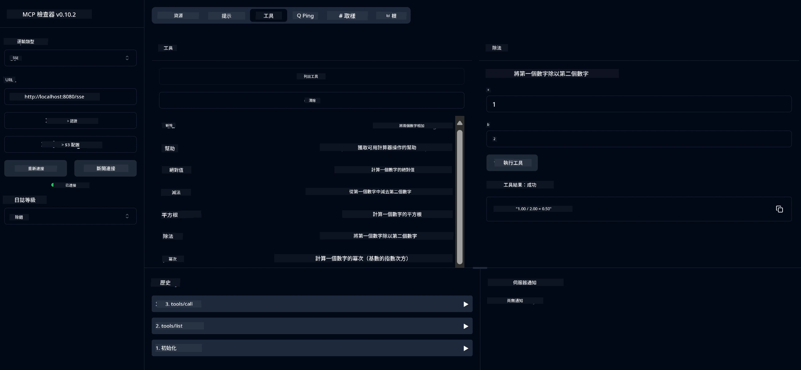

# 基本計算機 MCP 服務

> [!NOTE]
> 此 Java 解決方案使用傳統 HTTP+SSE 傳輸，並針對與 MCP `2025-11-25` 兼容的 SDK。
> 它保留與課程代碼相匹配；
> 新的遠端伺服器應使用 `2026-07-28` 支援可串流 HTTP。

此服務透過 Model Context Protocol (MCP) 使用 Spring Boot 和 WebFlux 傳輸方式提供基本計算機運算。它設計為給初學者學習 MCP 實作的一個簡單範例。

欲了解更多資訊，請參閱 [MCP Server Boot Starter](https://docs.spring.io/spring-ai/reference/api/mcp/mcp-server-boot-starter-docs.html) 參考文件。


## 使用此服務

本服務透過 MCP 協定公開以下 API 端點：

- `add(a, b)`: 將兩數相加
- `subtract(a, b)`: 從第一個數字中減去第二個數字
- `multiply(a, b)`: 將兩數相乘
- `divide(a, b)`: 將第一個數字除以第二個（帶零測試）
- `power(base, exponent)`: 計算數字的冪次方
- `squareRoot(number)`: 計算平方根（帶負數檢查）
- `modulus(a, b)`: 計算除法餘數
- `absolute(number)`: 計算絕對值

## 依賴項

專案需要以下主要依賴：

```xml
<dependency>
    <groupId>org.springframework.ai</groupId>
    <artifactId>spring-ai-starter-mcp-server-webflux</artifactId>
</dependency>
```

## 建置專案

使用 Maven 進行建置：
```bash
./mvnw clean install -DskipTests
```

## 啟動伺服器

### 使用 Java

```bash
java -jar target/calculator-server-0.0.1-SNAPSHOT.jar
```

### 使用 MCP Inspector

MCP Inspector 是一個與 MCP 服務互動的有用工具。使用此計算機服務時：

1. **安裝並啟動 MCP Inspector**，在新終端視窗中：
   ```bash
   npx @modelcontextprotocol/inspector
   ```

2. **通過應用程式顯示的網址訪問網頁 UI**（通常是 http://localhost:6274）

3. <strong>設定連線</strong>：
   - 將傳輸類型設定為 "SSE"
   - 將網址設定為您正在運行伺服器的 SSE 端點：`http://localhost:8080/sse`
   - 點擊「Connect」

4. <strong>使用工具</strong>：
   - 點擊「List Tools」以查看可用的計算機操作
   - 選擇一個工具並點擊「Run Tool」來執行操作



---

<!-- CO-OP TRANSLATOR DISCLAIMER START -->
**免責聲明**：
本文件使用 AI 翻譯服務 [Co-op Translator](https://github.com/Azure/co-op-translator) 進行翻譯。雖然我們力求準確，但請注意，自動翻譯可能包含錯誤或不準確之處。原始文件的母語版本應被視為權威來源。對於重要資訊，建議尋求專業人工翻譯。我們不對因使用本翻譯而引起的任何誤解或曲解承擔責任。
<!-- CO-OP TRANSLATOR DISCLAIMER END -->