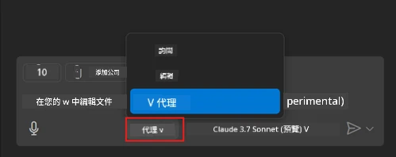
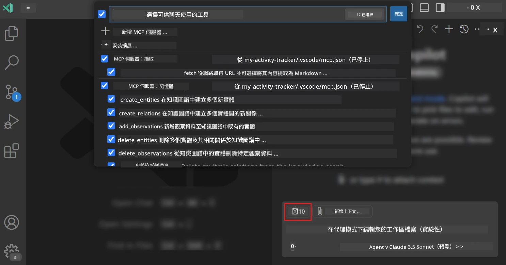
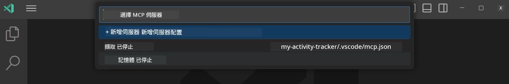
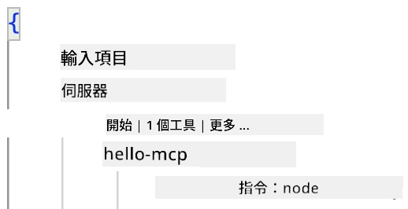
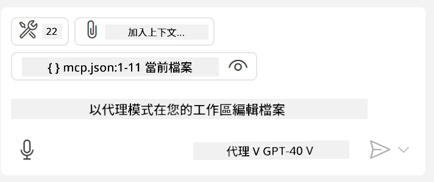
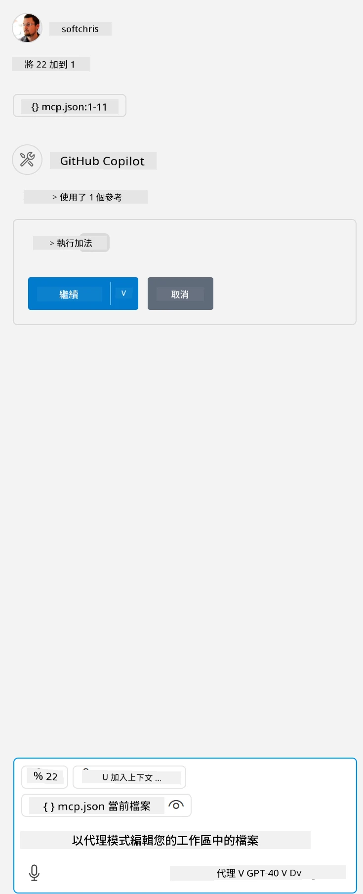

# 從 GitHub Copilot 代理模式消費伺服器

Visual Studio Code 與 GitHub Copilot 可以作為客戶端來消費 MCP 伺服器。你可能會問，為什麼我們要這樣做？這表示 MCP 伺服器所擁有的任何功能現在都可以在你的 IDE 中使用。想像一下，你加入了 GitHub 的 MCP 伺服器，這將允許你通過提示來控制 GitHub，而不是在終端機輸入特定命令。或者，想像任何能改善你開發者體驗的東西，都可以透過自然語言來控制。現在你開始看到這樣做的好處了吧？

## 概覽

本課程涵蓋如何使用 Visual Studio Code 與 GitHub Copilot 的代理模式作為你的 MCP 伺服器的客戶端。

## 學習目標

完成本課程後，你將能夠：

- 透過 Visual Studio Code 消費 MCP 伺服器。
- 透過 GitHub Copilot 運行功能如工具。
- 配置 Visual Studio Code 以尋找並管理你的 MCP 伺服器。

## 使用方式

你可以用兩種不同方式來控制你的 MCP 伺服器：

- 使用者介面，你將在本章稍後看到如何操作。
- 終端機，也可以利用 `code` 可執行檔從終端機控制：

  若要將 MCP 伺服器加入你的用戶設定檔，請使用 --add-mcp 命令列選項，並以 JSON 伺服器配置形式如 {\"name\":\"server-name\",\"command\":...} 提供。

  ```
  code --add-mcp "{\"name\":\"my-server\",\"command\": \"uvx\",\"args\": [\"mcp-server-fetch\"]}"
  ```

### 螢幕截圖





接下來的章節中，我們將詳細說明如何使用視覺介面。

## 方法

這是我們針對這件事的高階做法：

- 配置一個檔案來找到我們的 MCP 伺服器。
- 啟動/連接該伺服器，讓它列出其功能。
- 透過 GitHub Copilot 聊天介面使用這些功能。

很好，了解流程後，讓我們透過練習嘗試透過 Visual Studio Code 使用 MCP 伺服器。

## 練習：消費伺服器

在這個練習中，我們將配置 Visual Studio Code 以尋找你的 MCP 伺服器，讓它可以從 GitHub Copilot 聊天介面使用。

### -0- 預備步驟，啟用 MCP 伺服器發現功能

你可能需要啟用 MCP 伺服器的發現功能。

1. 前往 Visual Studio Code 的 `檔案 -> 偏好設定 -> 設定`。

1. 搜尋 "MCP" 並在 settings.json 檔案中啟用 `chat.mcp.discovery.enabled`。

### -1- 建立配置檔

首先在你的專案根目錄創建一個配置檔，你需要一個名為 MCP.json 的檔案，並將它放在一個名為 .vscode 的資料夾中。它看起來應如下：

```text
.vscode
|-- mcp.json
```

接著，讓我們看看怎麼新增伺服器條目。

### -2- 配置伺服器

將以下內容加入 *mcp.json*：

```json
{
    "inputs": [],
    "servers": {
       "hello-mcp": {
           "command": "node",
           "args": [
               "build/index.js"
           ]
       }
    }
}
```

上面是一個簡單的範例，說明如何啟動使用 Node.js 撰寫的伺服器，其他執行環境請用 `command` 和 `args` 指定啟動伺服器的正確指令。

### -3- 啟動伺服器

現在你已經加入條目，讓我們啟動伺服器：

1. 在 *mcp.json* 中找到你的條目，並確定看到「播放」圖示：

    

1. 點擊「播放」圖示，你應該會看到 GitHub Copilot 聊天介面中的工具圖示中可用工具數量增加。點擊該工具圖示，你會看到一份註冊工具清單。你可以勾選或取消勾選工具，決定是否要讓 GitHub Copilot 將它們當作上下文使用：

  

1. 要運行工具，輸入你知道會符合你工具描述的提示，例如像是「add 22 to 1」：

  

  你應該會看到回應為 23。

## 作業

嘗試在你的 *mcp.json* 檔案中新增伺服器條目，並確保你能啟動和停止伺服器。也確保你能通過 GitHub Copilot 聊天介面與伺服器上的工具溝通。

## 解答

[解答](./solution/README.md)

## 主要重點

本章的重點如下：

- Visual Studio Code 是一個很棒的客戶端，讓你可以消費多個 MCP 伺服器和其工具。
- GitHub Copilot 聊天介面是你與伺服器互動的方式。
- 你可提示用戶輸入像是 API 金鑰等資料，在配置 *mcp.json* 中的伺服器條目時傳遞到 MCP 伺服器。

## 範例

- [Java 計算機](../samples/java/calculator/README.md)
- [.Net 計算機](../../../../03-GettingStarted/samples/csharp)
- [JavaScript 計算機](../samples/javascript/README.md)
- [TypeScript 計算機](../samples/typescript/README.md)
- [Python 計算機](../../../../03-GettingStarted/samples/python)

## 額外資源

- [Visual Studio 文件](https://code.visualstudio.com/docs/copilot/chat/mcp-servers)

## 下一步

- 下一步：[建立 stdio 伺服器](../05-stdio-server/README.md)

---

<!-- CO-OP TRANSLATOR DISCLAIMER START -->
**免責聲明**：
本文件使用 AI 翻譯服務 [Co-op Translator](https://github.com/Azure/co-op-translator) 進行翻譯。雖然我們力求準確，但請注意，自動翻譯可能包含錯誤或不準確之處。原始文件的母語版本應被視為權威來源。對於重要資訊，建議尋求專業人工翻譯。我們不對因使用本翻譯而引起的任何誤解或曲解承擔責任。
<!-- CO-OP TRANSLATOR DISCLAIMER END -->