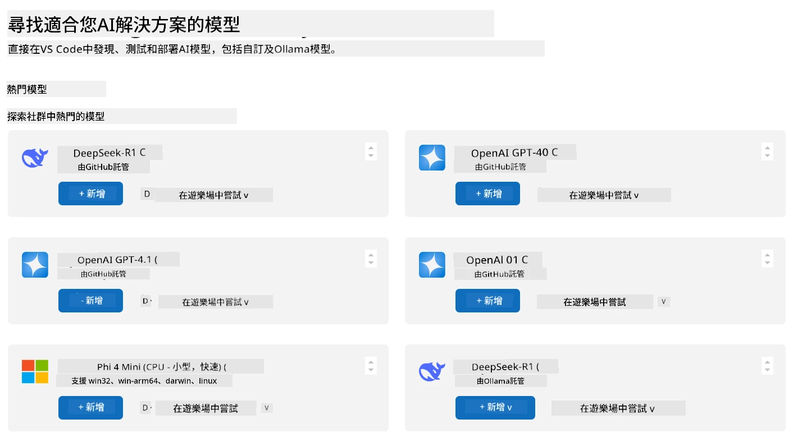
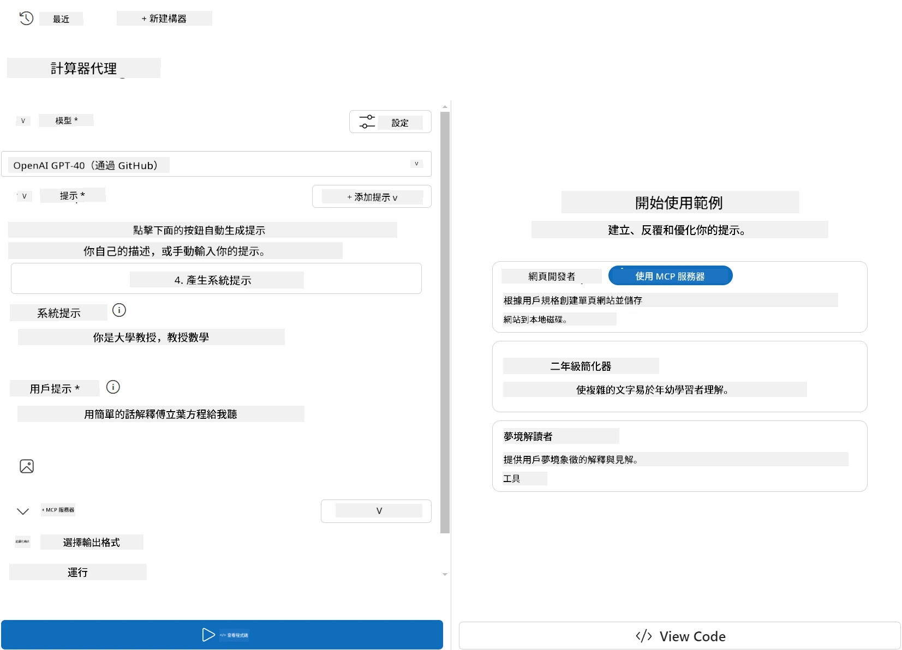
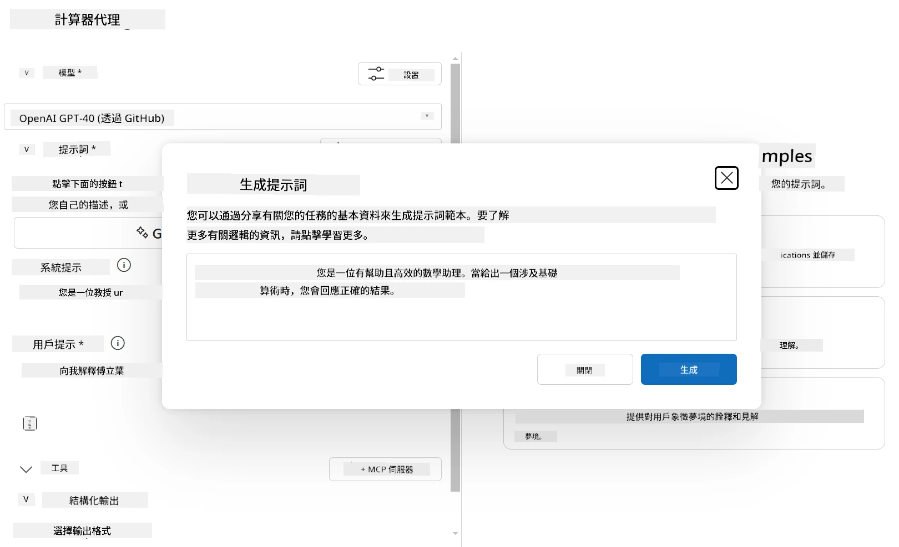

# 在 Visual Studio Code 的 AI Toolkit 擴充功能中使用伺服器

當您在打造 AI 代理時，不僅僅是要產生智能回應；更重要的是讓代理具備採取行動的能力。這就是模型上下文協議（Model Context Protocol，MCP）發揮作用的地方。MCP 使代理能以一致的方式輕鬆存取外部工具和服務。可以把它想像成把您的代理接駁到一個真正 <em>能用</em> 的工具箱裡。

假設您將代理連接到您的計算機 MCP 伺服器。突然間，您的代理只需收到像是「47 乘以 89 是多少？」這類的提示，就能執行數學運算—無需硬編碼邏輯或建構自訂 API。

## 概述

本課程涵蓋如何使用 Visual Studio Code 內的 [AI Toolkit](https://aka.ms/AIToolkit) 擴充功能，將計算機 MCP 伺服器連接至代理，讓您的代理能透過自然語言執行加、減、乘、除等數學運算。

AI Toolkit 是 Visual Studio Code 的強大擴充套件，簡化了代理的開發。AI 工程師可以輕鬆地透過開發及測試生成式 AI 模型（無論在本地或雲端）來構建 AI 應用程式。該擴充功能支援當今大多數主要的生成模型。

<em>註</em>：AI Toolkit 目前支援 Python 與 TypeScript。

## 學習目標

完成本課程後，您將能夠：

- 透過 AI Toolkit 使用 MCP 伺服器。
- 配置代理設定，使其能發現並使用 MCP 伺服器提供的工具。
- 透過自然語言利用 MCP 工具。

## 方法

下面是我們應該採取的高層次步驟：

- 建立代理並定義其系統提示。
- 創建具有計算工具的 MCP 伺服器。
- 將代理建立器連接到 MCP 伺服器。
- 透過自然語言測試代理的工具調用。

很好！既然了解流程，讓我們設定一個 AI 代理，透過 MCP 利用外部工具，提升其能力！

## 前置條件

- [Visual Studio Code](https://code.visualstudio.com/)
- [AI Toolkit for Visual Studio Code](https://aka.ms/AIToolkit)

## 練習：使用伺服器

> [!WARNING]
> macOS 使用者注意。目前我們正在調查一個影響 macOS 依賴項安裝的問題。因此，macOS 使用者暫時無法完成本教程。解決方案一出，我們將立即更新說明。感謝您的耐心和諒解！

在本練習中，您將使用 AI Toolkit 在 Visual Studio Code 內建構、執行並增強一個帶有 MCP 伺服器工具的 AI 代理。

### -0- 預備步驟，將 OpenAI GPT-4o 模型新增至「我的模型」

本練習使用 **GPT-4o** 模型。該模型應先新增至 <strong>我的模型</strong>，才開始建立代理。



1. 從 <strong>活動列</strong> 開啟 **AI Toolkit** 擴充功能。
1. 於 <strong>目錄</strong> 區域選擇 <strong>模型</strong>，以開啟 <strong>模型目錄</strong>。選擇後，模型目錄將於新編輯器分頁中開啟。
1. 在 <strong>模型目錄</strong> 搜尋列中輸入 **OpenAI GPT-4o**。
1. 點擊 **+ 新增** 將模型加入至 <strong>我的模型</strong> 清單。請確保所選模型為 **GitHub 託管**。
1. 在 <strong>活動列</strong> 確認 **OpenAI GPT-4o** 模型已出現在清單中。

### -1- 建立代理

**代理（提示）建立器** 讓您創建並自訂自己的 AI 驅動代理。在此章節中，您將創建新代理並指派模型以驅動對話。



1. 從 <strong>活動列</strong> 開啟 **AI Toolkit** 擴充功能。
1. 於 <strong>工具</strong> 區域選擇 **代理（提示）建立器**，將於新編輯器分頁中開啟該建立器。
1. 點擊 **+ 新代理** 按鈕。擴充功能會透過 <strong>命令面板</strong> 啟動設定嚮導。
1. 輸入名稱 <strong>計算機代理</strong>，按下 **Enter**。
1. 在 **代理（提示）建立器** 的 <strong>模型</strong> 欄位，選擇 **OpenAI GPT-4o（透過 GitHub）** 模型。

### -2- 為代理創建系統提示

代理骨架搭建完成後，接著定義它的個性及目的。在本節中，您將使用 <strong>產生系統提示</strong> 功能，描述代理的預期行為（在此為計算機代理），並由模型為您撰寫系統提示。



1. 在 <strong>提示</strong> 區域按下 <strong>產生系統提示</strong> 按鈕。此按鈕會開啟提示建立器，利用 AI 自動生成代理的系統提示。
1. 在 <strong>產生提示</strong> 視窗中輸入以下內容：`您是一位樂於幫助且高效率的數學助理。當遇到基礎算術問題時，您會回應正確結果。`
1. 點擊 <strong>產生</strong> 按鈕。右下角會顯示通知，確認系統提示正在生成。生成完成後，系統提示會出現在 **代理（提示）建立器** 的 <strong>系統提示</strong> 欄位。
1. 審閱 <strong>系統提示</strong>，並在必要時修改。

### -3- 創建 MCP 伺服器

現在您已定義代理的系統提示，引導其行為與回應，下一步是為代理配備實用能力。在本節中，您將創建一個具有加、減、乘、除運算工具的計算機 MCP 伺服器。該伺服器將使代理能根據自然語言提示執行即時數學運算。


AI Toolkit 內建範本，方便您創建自己的 MCP 伺服器。我們將使用 Python 範本來建立計算機 MCP 伺服器。

<em>註</em>：AI Toolkit 目前支援 Python 和 TypeScript。

1. 在 **代理（提示）建立器** 的 <strong>工具</strong> 區域，按下 **+ MCP Server** 按鈕。擴充功能會透過 <strong>命令面板</strong> 啟動設定嚮導。
1. 選擇 **+ 新增伺服器**。
1. 選擇 **創建新的 MCP 伺服器**。
1. 選擇 **python-weather** 範本。
1. 選擇 <strong>預設資料夾</strong> 以保存 MCP 伺服器範本。
1. 為伺服器輸入以下名稱：**Calculator**
1. 將開啟新的 Visual Studio Code 視窗。選擇 **是，我信任作者**。
1. 使用終端機（<strong>終端機</strong> > <strong>新終端機</strong>）建立虛擬環境：`python -m venv .venv`
1. 使用終端機啟用虛擬環境：
    1. Windows - `.venv\Scripts\activate`
    1. macOS/Linux - `source .venv/bin/activate`
1. 使用終端機安裝相依套件：`pip install -e .[dev]`
1. 在 <strong>活動列</strong> 的 <strong>檔案總管</strong> 視圖中，展開 **src** 目錄並選擇 **server.py**，於編輯器開啟檔案。
1. 將 **server.py** 檔案中的程式碼以以下內容取代並儲存：

    ```python
    """
    Sample MCP Calculator Server implementation in Python.

    
    This module demonstrates how to create a simple MCP server with calculator tools
    that can perform basic arithmetic operations (add, subtract, multiply, divide).
    """
    
    from mcp.server.fastmcp import FastMCP
    
    server = FastMCP("calculator")
    
    @server.tool()
    def add(a: float, b: float) -> float:
        """Add two numbers together and return the result."""
        return a + b
    
    @server.tool()
    def subtract(a: float, b: float) -> float:
        """Subtract b from a and return the result."""
        return a - b
    
    @server.tool()
    def multiply(a: float, b: float) -> float:
        """Multiply two numbers together and return the result."""
        return a * b
    
    @server.tool()
    def divide(a: float, b: float) -> float:
        """
        Divide a by b and return the result.
        
        Raises:
            ValueError: If b is zero
        """
        if b == 0:
            raise ValueError("Cannot divide by zero")
        return a / b
    ```

### -4- 執行帶有計算機 MCP 伺服器的代理

既然代理已具備工具，現在是時候使用它們了！本節中，您將向代理提交提示，以測試並驗證代理是否能利用來自計算機 MCP 伺服器的適當工具。


您將透過 <strong>代理建立器</strong> 作為 MCP 客戶端，在本機開發機器執行計算機 MCP 伺服器。

1. 按下 `F5` 開始調試 MCP 伺服器。**代理（提示）建立器** 將在新編輯器分頁中開啟。終端機中可見伺服器狀態。
1. 在 **代理（提示）建立器** 的 <strong>使用者提示</strong> 欄位中，輸入以下提示：`我買了 3 件商品，每件售價 25 美元，然後使用了 20 美元折扣。我付了多少錢？`
1. 點擊 <strong>執行</strong> 按鈕，生成代理的回應。
1. 審閱代理輸出。模型應該會判斷您支付了 **55 美元**。
1. 以下是應該發生的過程：
    - 代理選擇了 <strong>乘</strong> 和 <strong>減</strong> 兩個工具來協助計算。
    - 為 <strong>乘</strong> 工具指派了相應的 `a` 和 `b` 參數值。
    - 為 <strong>減</strong> 工具指派了相應的 `a` 和 `b` 參數值。
    - 各工具的回應會顯示在各自的 <strong>工具回應</strong>。
    - 模型的最終輸出則顯示在 <strong>模型回應</strong>。
1. 提交更多提示以進一步測試代理。您可以點擊 <strong>使用者提示</strong> 欄位，替換現有提示文字。
1. 測試完成後，您可透過終端機按 **CTRL/CMD+C** 停止伺服器。

## 作業

嘗試在您的 **server.py** 文件中新增額外的工具條目（例如：回傳數字的平方根）。提交需要代理使用新工具（或現有工具）的更多提示。請記得重新啟動伺服器以載入新添加的工具。

## 解答

[解答](./solution/README.md)

## 主要重點

本章節的重點如下：

- AI Toolkit 擴充功能是一款優秀的客戶端，可讓您輕鬆使用 MCP 伺服器及其工具。
- 您可以為 MCP 伺服器添加新工具，擴展代理能力以應對變化的需求。
- AI Toolkit 附帶範本（如 Python MCP 伺服器範本），簡化自訂工具的創建。

## 其他資源

- [AI Toolkit 文件](https://aka.ms/AIToolkit/doc)

## 下一步
- 下一課：[測試與除錯](../08-testing/README.md)

---

<!-- CO-OP TRANSLATOR DISCLAIMER START -->
**免責聲明**：
本文件使用 AI 翻譯服務 [Co-op Translator](https://github.com/Azure/co-op-translator) 進行翻譯。雖然我們力求準確，但請注意，自動翻譯可能包含錯誤或不準確之處。原始文件的母語版本應被視為權威來源。對於重要資訊，建議尋求專業人工翻譯。我們不對因使用本翻譯而引起的任何誤解或曲解承擔責任。
<!-- CO-OP TRANSLATOR DISCLAIMER END -->