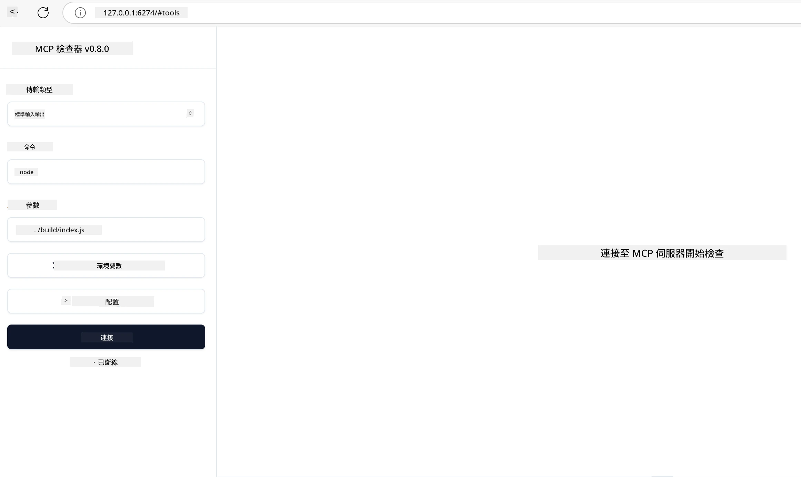

## 測試與偵錯

在開始測試您的 MCP 伺服器之前，了解可用的工具和偵錯的最佳實務非常重要。有效的測試可確保您的伺服器如預期般運作，並幫助您快速識別和解決問題。以下章節將概述驗證您的 MCP 實作的建議方法。

## 概述

本課程涵蓋如何選擇合適的測試方法及最有效的測試工具。

## 學習目標

在本課程結束時，您將能夠：

- 描述各種測試方法。
- 使用不同工具有效地測試您的程式碼。

## 測試 MCP 伺服器

MCP 提供工具來協助您測試和偵錯伺服器：

- **MCP Inspector**：一款可以作為 CLI 工具和視覺工具運行的命令列工具。
- **手動測試**：您可以使用 curl 之類的工具執行網絡請求，但任何能運行 HTTP 的工具皆可。
- **單元測試**：可以使用您喜愛的測試框架來測試伺服器和用戶端的功能。

### 使用 MCP Inspector

我們在之前的課程中已描述此工具的用法，這裡稍作介紹。這是一個以 Node.js 建立的工具，您可以透過呼叫 `npx` 執行檔來使用，該指令會暫時下載並安裝該工具，並在完成執行您的請求後自動清理。

[MCP Inspector](https://github.com/modelcontextprotocol/inspector) 幫助您：

- **探索伺服器功能**：自動偵測可用的資源、工具和提示
- **測試工具執行**：嘗試不同參數並即時查看回應
- **查看伺服器元資料**：檢查伺服器資訊、架構和設定

典型的執行指令如下：

```bash
npx @modelcontextprotocol/inspector node build/index.js
```

上述指令啟動 MCP 及其視覺介面，並在您的瀏覽器中啟動一個本地的網絡介面。您可以期望看到一個儀表板，顯示您註冊的 MCP 伺服器、其可用的工具、資源及提示。此介面允許您互動式測試工具執行、檢查伺服器元資料並查看即時回應，使驗證和偵錯 MCP 伺服器實作更為容易。

它的介面長這樣：

您也可以以 CLI 模式運行此工具，這時需要加上 `--cli` 參數。以下是以「CLI」模式運行該工具、列出伺服器上所有工具的範例：

```sh
npx @modelcontextprotocol/inspector --cli node build/index.js --method tools/list
```


### 手動測試

除了執行 inspector 工具以測試伺服器功能外，另一種類似方法是運行能使用 HTTP 的用戶端，舉例來說 curl。

利用 curl，您可以直接透過 HTTP 請求測試 MCP 伺服器：

```bash
# 範例：測試伺服器元資料
curl http://localhost:3000/v1/metadata

# 範例：執行工具
curl -X POST http://localhost:3000/v1/tools/execute \
  -H "Content-Type: application/json" \
  -d '{"name": "calculator", "parameters": {"expression": "2+2"}}'
```

從上述 curl 用法可見，您使用 POST 請求並以包含工具名稱及其參數的 payload 來呼叫工具。請選用最適合您的方法。一般來說，CLI 工具使用較快，且較容易被自動化腳本化，對於 CI/CD 環境十分有用。

### 單元測試

為您的工具和資源建立單元測試，以確保其按預期運作。以下是範例測試程式碼。

```python
import pytest

from mcp.server.fastmcp import FastMCP
from mcp.shared.memory import (
    create_connected_server_and_client_session as create_session,
)

# 標記整個模組進行非同步測試
pytestmark = pytest.mark.anyio


async def test_list_tools_cursor_parameter():
    """Test that the cursor parameter is accepted for list_tools.

    Note: FastMCP doesn't currently implement pagination, so this test
    only verifies that the cursor parameter is accepted by the client.
    """

 server = FastMCP("test")

    # 建立幾個測試工具
    @server.tool(name="test_tool_1")
    async def test_tool_1() -> str:
        """First test tool"""
        return "Result 1"

    @server.tool(name="test_tool_2")
    async def test_tool_2() -> str:
        """Second test tool"""
        return "Result 2"

    async with create_session(server._mcp_server) as client_session:
        # 測試不帶 cursor 參數（省略）
        result1 = await client_session.list_tools()
        assert len(result1.tools) == 2

        # 測試 cursor=None
        result2 = await client_session.list_tools(cursor=None)
        assert len(result2.tools) == 2

        # 使用字串作為 cursor 進行測試
        result3 = await client_session.list_tools(cursor="some_cursor_value")
        assert len(result3.tools) == 2

        # 使用空字串 cursor 進行測試
        result4 = await client_session.list_tools(cursor="")
        assert len(result4.tools) == 2
    
```

上述程式碼做了以下事情：

- 利用 pytest 框架，讓您用函式建立測試並使用 assert 陳述。
- 建立一個包含兩個不同工具的 MCP 伺服器。
- 使用 `assert` 陳述確認某些條件是否滿足。

請參考 [完整檔案](https://github.com/modelcontextprotocol/python-sdk/blob/main/tests/client/test_list_methods_cursor.py)

根據上述檔案，您可以測試自己的伺服器以確保功能正確建立。

所有主要 SDK 都提供類似的測試章節，因此您可以依照所用執行環境調整。

## 範例

- [Java 計算機](../samples/java/calculator/README.md)
- [.Net 計算機](../../../../03-GettingStarted/samples/csharp)
- [JavaScript 計算機](../samples/javascript/README.md)
- [TypeScript 計算機](../samples/typescript/README.md)
- [Python 計算機](../../../../03-GettingStarted/samples/python)

## 額外資源

- [Python SDK](https://github.com/modelcontextprotocol/python-sdk)

## 下一步

- 下一課程：[部署](../09-deployment/README.md)

---

<!-- CO-OP TRANSLATOR DISCLAIMER START -->
**免責聲明**：  
本文件係使用人工智能翻譯服務 [Co-op Translator](https://github.com/Azure/co-op-translator) 進行翻譯。雖然我們致力於追求準確性，但請注意自動翻譯可能存在錯誤或不準確之處。原始文件的母語版本應視為權威來源。對於重要信息，建議尋求專業人工翻譯。我們不對使用本翻譯所引起的任何誤解或誤譯承擔責任。
<!-- CO-OP TRANSLATOR DISCLAIMER END -->