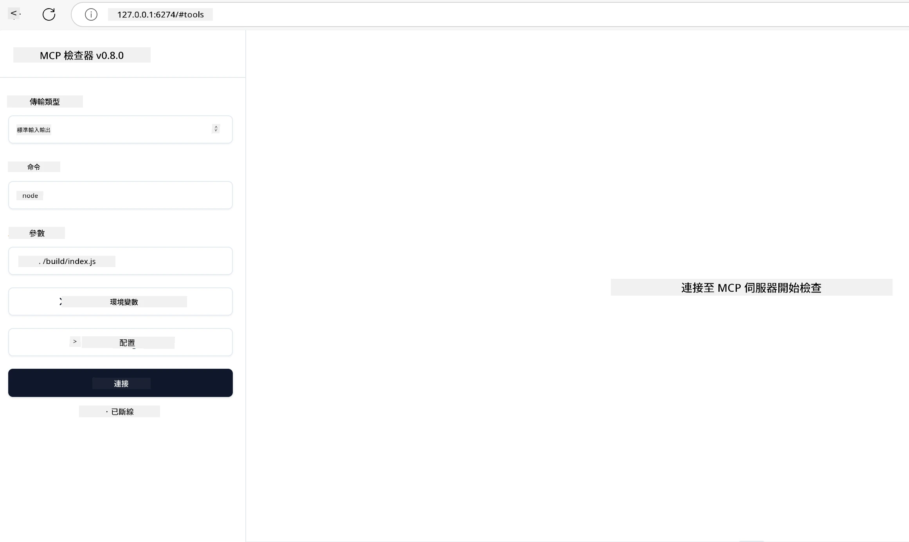

## 測試與除錯

在開始測試你的 MCP 伺服器之前，了解可用的工具和除錯最佳實務非常重要。有效的測試能確保你的伺服器行為如預期，並幫助你迅速識別和解決問題。以下章節將概述驗證你的 MCP 實作的建議方法。

## 概述

本課程涵蓋如何選擇合適的測試方法和最有效的測試工具。

## 學習目標

本課程結束時，你將能：

- 描述各種測試方法。
- 使用不同工具有效測試你的程式碼。


## 測試 MCP 伺服器

MCP 提供協助測試與除錯伺服器的工具：

- **MCP Inspector**：可作為命令列工具及視覺化工具運行的指令行工具。
- <strong>手動測試</strong>：你可以使用 curl 類似工具執行網絡請求，但任何能發出 HTTP 請求的工具都適用。
- <strong>單元測試</strong>：可以使用你偏好的測試框架來測試伺服器和用戶端的功能。

### 使用 MCP Inspector

我們之前課程已介紹此工具的使用方法，這裡將做簡要說明。此工具是以 Node.js 建置，你可以透過 `npx` 可執行檔使用它，它會暫時下載並安裝工具，執行完請求後自動進行清理。

[MCP Inspector](https://github.com/modelcontextprotocol/inspector) 功能包括：

- <strong>發掘伺服器能力</strong>：自動偵測可用的資源、工具與提示
- <strong>測試工具執行</strong>：嘗試不同參數並即時查看回應
- <strong>檢視伺服器元資料</strong>：檢查伺服器資訊、結構與設定

工具的典型運行範例如下：

```bash
npx @modelcontextprotocol/inspector node build/index.js
```

上述指令啟動 MCP 及其視覺介面，並在瀏覽器中開啟本地端網頁介面。你會看到儀表板，顯示註冊的 MCP 伺服器、其可用的工具、資源和提示。此介面允許你互動式地測試工具執行、檢視伺服器元資料及即時回應，使你更輕鬆驗證和除錯 MCP 伺服器實作。

介面示意圖如下： 

你也可以在 CLI 模式下執行此工具，只需加上 `--cli` 參數。以下示範在「CLI」模式下運行，列出伺服器上的所有工具：

```sh
npx @modelcontextprotocol/inspector --cli node build/index.js --method tools/list
```

### 手動測試

除了使用 Inspector 工具測試伺服器功能外，另一類似方法是透過具有 HTTP 功能的客戶端工具，例如 curl。

使用 curl，你可以直接通過 HTTP 請求測試 MCP 伺服器：

```bash
# 例子：測試伺服器元數據
curl http://localhost:3000/v1/metadata

# 例子：執行一個工具
curl -X POST http://localhost:3000/v1/tools/execute \
  -H "Content-Type: application/json" \
  -d '{"name": "calculator", "parameters": {"expression": "2+2"}}'
```

如上所示的 curl 用法，你是用 POST 請求呼叫工具，並在負載中包含工具名稱和參數。請依照你喜好的方式使用。CLI 工具通常用起來較快且易於撰寫腳本，這在 CI/CD 環境中非常實用。

### 單元測試

為你的工具和資源撰寫單元測試，確保它們如預期運作。以下是示範的測試程式碼。

```python
import pytest

from mcp.server.fastmcp import FastMCP
from mcp.shared.memory import (
    create_connected_server_and_client_session as create_session,
)

# 標記整個模組作為非同步測試
pytestmark = pytest.mark.anyio


async def test_list_tools_cursor_parameter():
    """Test that the cursor parameter is accepted for list_tools.

    Note: FastMCP doesn't currently implement pagination, so this test
    only verifies that the cursor parameter is accepted by the client.
    """

 server = FastMCP("test")

    # 創建幾個測試工具
    @server.tool(name="test_tool_1")
    async def test_tool_1() -> str:
        """First test tool"""
        return "Result 1"

    @server.tool(name="test_tool_2")
    async def test_tool_2() -> str:
        """Second test tool"""
        return "Result 2"

    async with create_session(server._mcp_server) as client_session:
        # 測試無游標參數（省略）
        result1 = await client_session.list_tools()
        assert len(result1.tools) == 2

        # 使用游標=None 測試
        result2 = await client_session.list_tools(cursor=None)
        assert len(result2.tools) == 2

        # 使用字串作為游標測試
        result3 = await client_session.list_tools(cursor="some_cursor_value")
        assert len(result3.tools) == 2

        # 使用空字串游標測試
        result4 = await client_session.list_tools(cursor="")
        assert len(result4.tools) == 2
    
```

上述程式碼涵蓋以下內容：

- 使用 pytest 框架，允許你將測試寫成函式並用 assert 陳述式。
- 建立包含兩個不同工具的 MCP 伺服器。
- 使用 `assert` 陳述句檢查特定條件是否符合。

可參考此[完整檔案](https://github.com/modelcontextprotocol/python-sdk/blob/main/tests/client/test_list_methods_cursor.py)

根據上述檔案，你可以測試自己的伺服器，確保功能依預期被建立。

所有主要 SDK 都有類似的測試範例，你可以依據所選運行環境做調整。

## 範例

- [Java 計算器](../samples/java/calculator/README.md)
- [.Net 計算器](../../../../03-GettingStarted/samples/csharp)
- [JavaScript 計算器](../samples/javascript/README.md)
- [TypeScript 計算器](../samples/typescript/README.md)
- [Python 計算器](../../../../03-GettingStarted/samples/python)

## 延伸資源

- [Python SDK](https://github.com/modelcontextprotocol/python-sdk)

## 接下來

- 下一步：[部署](../09-deployment/README.md)

---

<!-- CO-OP TRANSLATOR DISCLAIMER START -->
**免責聲明**：
本文件使用 AI 翻譯服務 [Co-op Translator](https://github.com/Azure/co-op-translator) 進行翻譯。雖然我們力求準確，但請注意，自動翻譯可能包含錯誤或不準確之處。原始文件的母語版本應被視為權威來源。對於重要資訊，建議尋求專業人工翻譯。我們不對因使用本翻譯而引起的任何誤解或曲解承擔責任。
<!-- CO-OP TRANSLATOR DISCLAIMER END -->