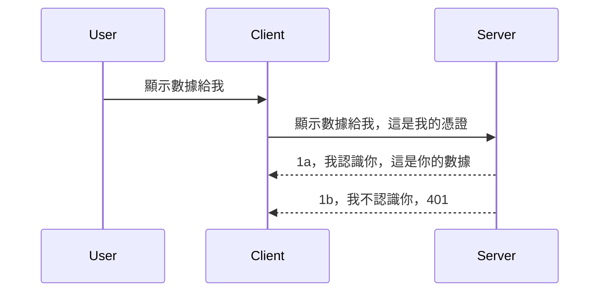

# Simple auth

MCP SDKs 支援使用 OAuth 2.1，公平地說，這是一個相當複雜的流程，涉及認證伺服器、資源伺服器、發送憑證、取得授權碼、用授權碼交換承載令牌，直到最終獲取資源資料。如果你沒有使用過 OAuth，雖然這是很棒的實作方法，但建議先從一些基本的認證開始，逐步建立更完善的安全性。這就是本章存在的原因，幫助你逐步進階至更複雜的認證。

## 認證，我們指的是什麼？

Auth 是 authentication（身份驗證）與 authorization（授權）的縮寫。重點是我們需要做兩件事：

- **身份驗證（Authentication）**，用來判斷是否讓某人進入我們的「房子」，是否擁有「在這裡」存在的權利，也就是是否能存取我們 MCP 伺服器的資源伺服器。
- **授權（Authorization）**，是判斷使用者是否應該有權限存取他們請求的特定資源，例如某些訂單、產品，或者他們是否只能讀取內容但無法刪除，這是另一個例子。

## 憑證：我們如何告訴系統我們是誰

大多數網頁開發者首先會想到向伺服器提供憑證，通常是一段秘密字串，表明他們是否有權限「Authentication」。這個憑證通常是使用 base64 編碼的使用者名稱和密碼，或是唯一識別特定使用者的 API key。

這會透過一個叫做「Authorization」的標頭傳送，如下：

```json
{ "Authorization": "secret123" }
```

這通常稱為基本認證（basic authentication）。整個流程運作如下：


現在我們了解流程是怎麼運作的，如何實作呢？多數網頁伺服器都有 middleware（中介軟體）的概念，它是一段在請求流程中執行的程式碼，可以驗證憑證，如果憑證有效則讓請求通過。如果請求沒有有效憑證，則會返回身份驗證錯誤。讓我們看看如何實作：

**Python**

```python
class AuthMiddleware(BaseHTTPMiddleware):
    async def dispatch(self, request, call_next):

        has_header = request.headers.get("Authorization")
        if not has_header:
            print("-> Missing Authorization header!")
            return Response(status_code=401, content="Unauthorized")

        if not valid_token(has_header):
            print("-> Invalid token!")
            return Response(status_code=403, content="Forbidden")

        print("Valid token, proceeding...")
       
        response = await call_next(request)
        # 添加任何客戶端標頭或以某種方式更改回應
        return response


starlette_app.add_middleware(CustomHeaderMiddleware)
```

這裡我們：

- 建立名為 `AuthMiddleware` 的中介軟體，其 `dispatch` 方法會由網頁伺服器呼叫。
- 將中介軟體加入至網頁伺服器：

    ```python
    starlette_app.add_middleware(AuthMiddleware)
    ```

- 撰寫驗證邏輯，檢查是否存在 Authorization 標頭，且送出的秘密是否有效：

    ```python
    has_header = request.headers.get("Authorization")
    if not has_header:
        print("-> Missing Authorization header!")
        return Response(status_code=401, content="Unauthorized")

    if not valid_token(has_header):
        print("-> Invalid token!")
        return Response(status_code=403, content="Forbidden")
    ```

    如果秘密存在且有效，我們會呼叫 `call_next` 讓請求繼續並回應結果。

    ```python
    response = await call_next(request)
    # 加入任何自訂標頭或以某種方式更改回應內容
    return response
    ```

流程是這樣的：如果有人向伺服器發起網頁請求，中介軟體就會被觸發，依實作內容會讓請求通過，或回傳錯誤代表客戶端無權繼續。

**TypeScript**

這裡我們使用流行的 Express 框架去建立中介軟體，在請求抵達 MCP 伺服器之前攔截。程式碼如下：

```typescript
function isValid(secret) {
    return secret === "secret123";
}

app.use((req, res, next) => {
    // 1. 授權標頭是否存在？
    if(!req.headers["Authorization"]) {
        res.status(401).send('Unauthorized');
    }
    
    let token = req.headers["Authorization"];

    // 2. 檢查有效性。
    if(!isValid(token)) {
        res.status(403).send('Forbidden');
    }

   
    console.log('Middleware executed');
    // 3. 將請求傳遞到請求流程中的下一步。
    next();
});
```

在這段程式中，我們：

1. 檢查是否存在 Authorization 標頭，若無，回傳 401 錯誤。
2. 確認憑證/令牌是否有效，若無，回傳 403 錯誤。
3. 最終繼續請求流程並回傳所要求的資源。

## 練習：實作身份驗證

讓我們用已學知識實作看看，計劃如下：

伺服器端

- 建立網頁伺服器與 MCP 實例。
- 為伺服器實作中介軟體。

客戶端

- 使用標頭送出帶憑證的網頁請求。

### -1- 建立網頁伺服器與 MCP 實例

第一步，我們要建立網頁伺服器實例及 MCP 伺服器。

**Python**

這裡我們建立 MCP 伺服器實例，建立 starlette 網頁應用，並透過 uvicorn 來呈現。

```python
# 建立 MCP 伺服器

app = FastMCP(
    name="MCP Resource Server",
    instructions="Resource Server that validates tokens via Authorization Server introspection",
    host=settings["host"],
    port=settings["port"],
    debug=True
)

# 建立 starlette 網頁應用程式
starlette_app = app.streamable_http_app()

# 透過 uvicorn 提供應用服務
async def run(starlette_app):
    import uvicorn
    config = uvicorn.Config(
            starlette_app,
            host=app.settings.host,
            port=app.settings.port,
            log_level=app.settings.log_level.lower(),
        )
    server = uvicorn.Server(config)
    await server.serve()

run(starlette_app)
```

程式說明：

- 建立 MCP 伺服器。
- 從 MCP 伺服器建立 starlette 網頁應用 `app.streamable_http_app()`。
- 使用 uvicorn 的 `server.serve()` 來執行並服務這個網頁應用。

**TypeScript**

這裡我們建立 MCP 伺服器實例。

```typescript
const server = new McpServer({
      name: "example-server",
      version: "1.0.0"
    });

    // ... 設置伺服器資源、工具和提示 ...
```

這裡 MCP 伺服器的建立需要放在我們定義的 POST /mcp 路由中，因此將上述程式碼改成：

```typescript
import express from "express";
import { randomUUID } from "node:crypto";
import { McpServer } from "@modelcontextprotocol/sdk/server/mcp.js";
import { StreamableHTTPServerTransport } from "@modelcontextprotocol/sdk/server/streamableHttp.js";
import { isInitializeRequest } from "@modelcontextprotocol/sdk/types.js"

const app = express();
app.use(express.json());

// 用以會話 ID 儲存傳輸的映射
const transports: { [sessionId: string]: StreamableHTTPServerTransport } = {};

// 處理用戶端至伺服器的 POST 請求
app.post('/mcp', async (req, res) => {
  // 檢查是否已有會話 ID
  const sessionId = req.headers['mcp-session-id'] as string | undefined;
  let transport: StreamableHTTPServerTransport;

  if (sessionId && transports[sessionId]) {
    // 重用現有的傳輸
    transport = transports[sessionId];
  } else if (!sessionId && isInitializeRequest(req.body)) {
    // 新初始化請求
    transport = new StreamableHTTPServerTransport({
      sessionIdGenerator: () => randomUUID(),
      onsessioninitialized: (sessionId) => {
        // 依會話 ID 儲存傳輸
        transports[sessionId] = transport;
      },
      // DNS 重新綁定保護預設為關閉，以向後兼容。若您在本地執行此伺服器，
      // 請務必設定：
      // enableDnsRebindingProtection: true,
      // allowedHosts: ['127.0.0.1'],
    });

    // 傳輸關閉時清理資源
    transport.onclose = () => {
      if (transport.sessionId) {
        delete transports[transport.sessionId];
      }
    };
    const server = new McpServer({
      name: "example-server",
      version: "1.0.0"
    });

    // … 設定伺服器資源、工具及提示 …

    // 連接到 MCP 伺服器
    await server.connect(transport);
  } else {
    // 無效的請求
    res.status(400).json({
      jsonrpc: '2.0',
      error: {
        code: -32000,
        message: 'Bad Request: No valid session ID provided',
      },
      id: null,
    });
    return;
  }

  // 處理此請求
  await transport.handleRequest(req, res, req.body);
});

// GET 與 DELETE 請求可重用的處理器
const handleSessionRequest = async (req: express.Request, res: express.Response) => {
  const sessionId = req.headers['mcp-session-id'] as string | undefined;
  if (!sessionId || !transports[sessionId]) {
    res.status(400).send('Invalid or missing session ID');
    return;
  }
  
  const transport = transports[sessionId];
  await transport.handleRequest(req, res);
};

// 處理透過 SSE 用於伺服器到用戶端通知的 GET 請求
app.get('/mcp', handleSessionRequest);

// 處理結束會話的 DELETE 請求
app.delete('/mcp', handleSessionRequest);

app.listen(3000);
```

可以看到 MCP 伺服器的建立被搬到 `app.post("/mcp")` 裡面。

接著進行下一步實作中介軟體去驗證傳入的憑證。

### -2- 為伺服器實作中介軟體

接著來看中介軟體的部分。我們要建立一個會檢查 `Authorization` 標頭裡有無憑證並驗證它的中介軟體。如果通過驗證，請求就能繼續處理其他作業（例如列出工具、讀取資源或客戶端想使用的 MCP 功能）。

**Python**

要建立中介軟體，需要撰寫一個繼承 `BaseHTTPMiddleware` 的類別。主要有兩個部分：

- 請求 `request`，我們從中讀取標頭資訊。
- `call_next` 是當客戶端有帶有效憑證時需要呼叫的回呼函式。

首先我們處理缺少 `Authorization` 標頭的狀況：

```python
has_header = request.headers.get("Authorization")

# 無標頭，回應 401 錯誤，否則繼續。
if not has_header:
    print("-> Missing Authorization header!")
    return Response(status_code=401, content="Unauthorized")
```

這裡回傳 401 未授權訊息，代表客戶端驗證失敗。

接著如果有送出憑證，我們驗證它的有效性如下：

```python
 if not valid_token(has_header):
    print("-> Invalid token!")
    return Response(status_code=403, content="Forbidden")
```

上面出現 403 禁止存取訊息。接著看完整的中介軟體程式碼，包含我們之前說的邏輯：

```python
class AuthMiddleware(BaseHTTPMiddleware):
    async def dispatch(self, request, call_next):

        has_header = request.headers.get("Authorization")
        if not has_header:
            print("-> Missing Authorization header!")
            return Response(status_code=401, content="Unauthorized")

        if not valid_token(has_header):
            print("-> Invalid token!")
            return Response(status_code=403, content="Forbidden")

        print("Valid token, proceeding...")
        print(f"-> Received {request.method} {request.url}")
        response = await call_next(request)
        response.headers['Custom'] = 'Example'
        return response

```

很好，那 `valid_token` 函式怎麼寫？如下：

```python
# 不要用於生產環境 - 改進它！！
def valid_token(token: str) -> bool:
    # 移除 "Bearer " 前綴
    if token.startswith("Bearer "):
        token = token[7:]
        return token == "secret-token"
    return False
```

當然這還可以改進。

重要提醒：絕對不要把這種秘密寫死在程式碼裡。理想情況是從資料來源或 IDP（身份識別服務提供者）取得比較值，更好的是讓 IDP 負責驗證。

**TypeScript**

在 Express 裡實作，我們會呼叫 `use` 并傳入中介軟體函式。

這裡要：

- 讀取請求裡的 `Authorization`。
- 驗證憑證，如果有效，讓請求繼續，並讓 MCP 請求照常執行（如列出工具、讀取資源等 MCP 功能）。

先確認有沒有 `Authorization` 標頭，若沒有，停止請求：

```typescript
if(!req.headers["authorization"]) {
    res.status(401).send('Unauthorized');
    return;
}
```

如果第一時間沒有標頭，回傳 401。

接著驗證憑證，若無效，再次停止請求，這次訊息不一樣：

```typescript
if(!isValid(token)) {
    res.status(403).send('Forbidden');
    return;
} 
```

取得 403 錯誤。

完整程式碼如下：

```typescript
app.use((req, res, next) => {
    console.log('Request received:', req.method, req.url, req.headers);
    console.log('Headers:', req.headers["authorization"]);
    if(!req.headers["authorization"]) {
        res.status(401).send('Unauthorized');
        return;
    }
    
    let token = req.headers["authorization"];

    if(!isValid(token)) {
        res.status(403).send('Forbidden');
        return;
    }  

    console.log('Middleware executed');
    next();
});
```

我們設定好網頁伺服器可以接受此中介軟體檢查客戶端希望發送的憑證。那客戶端要怎麼做？

### -3- 使用標頭帶憑證送出網頁請求

我們要確保客戶端有用標頭帶上憑證。既然使用 MCP 客戶端，就看怎麼做。

**Python**

客戶端要帶有憑證的標頭，如下：

```python
# 不要硬編碼該值，至少應該放在環境變數或更安全的儲存空間中
token = "secret-token"

async with streamablehttp_client(
        url = f"http://localhost:{port}/mcp",
        headers = {"Authorization": f"Bearer {token}"}
    ) as (
        read_stream,
        write_stream,
        session_callback,
    ):
        async with ClientSession(
            read_stream,
            write_stream
        ) as session:
            await session.initialize()
      
            # 待辦，您想在客戶端執行的操作，例如列出工具、呼叫工具等。
```

注意我們如何填寫 `headers` 屬性，形式為 ` headers = {"Authorization": f"Bearer {token}"}`。

**TypeScript**

有兩步驟：

1. 建立帶憑證的設定物件。
2. 把設定物件傳給傳輸層。

```typescript

// 唔好似呢度咁硬編碼個值。最少要用環境變量，喺開發模式用啲似dotenv嘅嘢。
let token = "secret123"

// 定義一個客戶端傳輸選項對象
let options: StreamableHTTPClientTransportOptions = {
  sessionId: sessionId,
  requestInit: {
    headers: {
      "Authorization": "secret123"
    }
  }
};

// 將選項對象傳畀傳輸端口
async function main() {
   const transport = new StreamableHTTPClientTransport(
      new URL(serverUrl),
      options
   );
```

上面程式碼示範如何建立 `options` 物件，把標頭放置在 `requestInit` 屬性裡。

重要提醒：那怎麼改進呢？目前方式有風險，除非至少使用 HTTPS。即使如此，憑證也可能被盜取，所以需要能輕鬆撤銷令牌的機制，以及其他檢查，比如請求來自哪裡，是否太頻繁（像機器人行為），總之有很多考量。

但也得說，對於非常簡單的 API，只是想要沒有身份驗證者不能呼叫你的 API，這已經是個不錯的起點。

接下來，我們嘗試利用標準格式改用 JSON Web Token，即 JWT 或稱 JOT 令牌，來加強安全性。

## JSON Web Tokens，JWT

我們嘗試改進原本傳送非常簡單憑證的方式，採用 JWT 後有什麼直接好處？

- **安全性提升**。基本認證反覆傳送 base64 編碼的使用者名稱和密碼（或 API key），風險較高。JWT 則是傳送一次使用者名稱和密碼後換得令牌，且有時間限制會過期。JWT 容易實現角色、範圍與權限的細緻存取控制。
- **無狀態與可擴展性**。JWT 自帶使用者資訊，無需伺服器端 session 儲存，且令牌可以本地驗證。
- **互操作性與聯合認證**。JWT 是 Open ID Connect 的核心，並與已知的身份供應商如 Entra ID、Google Identity、Auth0 廣泛使用。也支援單點登入等企業級功能。
- **模組化與彈性**。JWT 可用於 API 網關如 Azure API Management、NGINX 等，支援用戶身份驗證與服務間通訊，包含模仿與委派場景。
- **效能與快取**。JWT 解碼後可快取，減少解析次數，有助處理大量請求，提高吞吐量並降低基礎架構負載。
- **進階功能**。支援 introspection（伺服器驗證有效性）與撤銷（使令牌失效）。

綜合多項好處，我們看看如何將程式改造升級。

## 從基本認證轉成 JWT

我們需要高層次改動：

- **學會建立 JWT 令牌**，讓客戶端能發送給伺服器。
- **驗證 JWT 令牌**，確保有效後讓客戶端存取資源。
- **安全儲存令牌**。令牌怎麼存。
- **保護路由**。保護路由及 MCP 的特定功能。
- **新增刷新令牌**。短期限令牌搭配長期限刷新令牌，失效時能取得新令牌，並有刷新端點與更新策略。

### -1- 建立 JWT 令牌

一個 JWT 令牌包含以下部分：

- **header**，使用的演算法與令牌類型。
- **payload**，宣告訊息，如 sub（令牌代表的使用者或主體，通常是 userid）、exp（過期時間）、role（角色）。
- **signature**，用秘密或私鑰簽署。

我們需建立 header、payload 並產出編碼令牌。

**Python**

```python

import jwt
import jwt
from jwt.exceptions import ExpiredSignatureError, InvalidTokenError
import datetime

# 用於簽署 JWT 的秘密金鑰
secret_key = 'your-secret-key'

header = {
    "alg": "HS256",
    "typ": "JWT"
}

# 使用者資訊及其聲明和過期時間
payload = {
    "sub": "1234567890",               # 主體（使用者 ID）
    "name": "User Userson",                # 自訂聲明
    "admin": True,                     # 自訂聲明
    "iat": datetime.datetime.utcnow(),# 簽發時間
    "exp": datetime.datetime.utcnow() + datetime.timedelta(hours=1)  # 過期時間
}

# 編碼它
encoded_jwt = jwt.encode(payload, secret_key, algorithm="HS256", headers=header)
```

以上程式我們：

- 以 HS256 演算法定義 header，類型為 JWT。
- 建立 payload，包含主體或使用者編號、使用者名稱、角色、簽發時間與過期時間，實作了前述的時間限制。

**TypeScript**

這裡需要額外套件協助構造 JWT。

依賴項：

```sh

npm install jsonwebtoken
npm install --save-dev @types/jsonwebtoken
```

確定安裝完，接著建立 header、payload 並製作編碼令牌。

```typescript
import jwt from 'jsonwebtoken';

const secretKey = 'your-secret-key'; // 在生產環境使用環境變量

// 定義有效載荷
const payload = {
  sub: '1234567890',
  name: 'User usersson',
  admin: true,
  iat: Math.floor(Date.now() / 1000), // 發行時間
  exp: Math.floor(Date.now() / 1000) + 60 * 60 // 1小時後過期
};

// 定義標頭（可選，jsonwebtoken 設置默認值）
const header = {
  alg: 'HS256',
  typ: 'JWT'
};

// 創建令牌
const token = jwt.sign(payload, secretKey, {
  algorithm: 'HS256',
  header: header
});

console.log('JWT:', token);
```

這個令牌：

採用 HS256 簽署
有效時間為 1 小時
包含 sub、name、admin、iat、exp 等宣告。

### -2- 驗證令牌

我們還要驗證令牌，應在伺服器端做這件事，確認客戶端送來的令牌真有效。需做多項檢查，從結構有效性到權限。建議加更多檢查確認使用者在系統裡，並具備聲稱的權限。

驗證令牌需先解碼，便於讀取與後續檢查：

**Python**

```python

# 解碼並驗證 JWT
try:
    decoded = jwt.decode(token, secret_key, algorithms=["HS256"])
    print("✅ Token is valid.")
    print("Decoded claims:")
    for key, value in decoded.items():
        print(f"  {key}: {value}")
except ExpiredSignatureError:
    print("❌ Token has expired.")
except InvalidTokenError as e:
    print(f"❌ Invalid token: {e}")

```

這段程式呼叫 `jwt.decode`，輸入令牌、密鑰和指定演算法。以 try-catch 包裹，避免驗證失敗產生錯誤。

**TypeScript**

這裡呼叫 `jwt.verify` 得到解碼後令牌，可進一步分析。若呼叫失敗，表示令牌結構錯誤或已無效。

```typescript

try {
  const decoded = jwt.verify(token, secretKey);
  console.log('Decoded Payload:', decoded);
} catch (err) {
  console.error('Token verification failed:', err);
}
```

注意：如前述，應額外檢查此令牌是否對應系統中的使用者，且該使用者擁有聲稱的權利。

接著，我們來看看角色基礎的存取控制，也稱為 RBAC。
## 新增基於角色的存取控制

概念是我們希望表達不同角色有不同的權限。例如，我們假設管理員可以做所有事情，普通用戶可以讀寫，而訪客只能讀取。因此，這裡有幾個可能的權限級別：

- Admin.Write 
- User.Read
- Guest.Read

讓我們看看如何用中介軟體實作這樣的控制。中介軟體可以按路由添加，也可以為所有路由添加。

**Python**

```python
from starlette.middleware.base import BaseHTTPMiddleware
from starlette.responses import JSONResponse
import jwt

# 不要將秘密寫在代碼中，這只是用於示範目的。請從安全的地方讀取它。
SECRET_KEY = "your-secret-key" # 將此放在環境變量中
REQUIRED_PERMISSION = "User.Read"

class JWTPermissionMiddleware(BaseHTTPMiddleware):
    async def dispatch(self, request, call_next):
        auth_header = request.headers.get("Authorization")
        if not auth_header or not auth_header.startswith("Bearer "):
            return JSONResponse({"error": "Missing or invalid Authorization header"}, status_code=401)

        token = auth_header.split(" ")[1]
        try:
            decoded = jwt.decode(token, SECRET_KEY, algorithms=["HS256"])
        except jwt.ExpiredSignatureError:
            return JSONResponse({"error": "Token expired"}, status_code=401)
        except jwt.InvalidTokenError:
            return JSONResponse({"error": "Invalid token"}, status_code=401)

        permissions = decoded.get("permissions", [])
        if REQUIRED_PERMISSION not in permissions:
            return JSONResponse({"error": "Permission denied"}, status_code=403)

        request.state.user = decoded
        return await call_next(request)


```

有幾種不同的方式可以新增中介軟體，如下所示：

```python

# 選項 1：在構建 starlette 應用程式時添加中介軟件
middleware = [
    Middleware(JWTPermissionMiddleware)
]

app = Starlette(routes=routes, middleware=middleware)

# 選項 2：在 starlette 應用程式已構建後添加中介軟件
starlette_app.add_middleware(JWTPermissionMiddleware)

# 選項 3：每個路由添加中介軟件
routes = [
    Route(
        "/mcp",
        endpoint=..., # 處理器
        middleware=[Middleware(JWTPermissionMiddleware)]
    )
]
```

**TypeScript**

我們可以使用 `app.use` 以及一個會針對所有請求執行的中介軟體。

```typescript
app.use((req, res, next) => {
    console.log('Request received:', req.method, req.url, req.headers);
    console.log('Headers:', req.headers["authorization"]);

    // 1. 檢查授權標頭是否已發送

    if(!req.headers["authorization"]) {
        res.status(401).send('Unauthorized');
        return;
    }
    
    let token = req.headers["authorization"];

    // 2. 檢查令牌是否有效
    if(!isValid(token)) {
        res.status(403).send('Forbidden');
        return;
    }  

    // 3. 檢查令牌用戶是否存在於我們系統中
    if(!isExistingUser(token)) {
        res.status(403).send('Forbidden');
        console.log("User does not exist");
        return;
    }
    console.log("User exists");

    // 4. 驗證令牌是否擁有正確的權限
    if(!hasScopes(token, ["User.Read"])){
        res.status(403).send('Forbidden - insufficient scopes');
    }

    console.log("User has required scopes");

    console.log('Middleware executed');
    next();
});

```

我們可以讓中介軟體做很多事情，而且中介軟體應該要做的事情包括：

1. 檢查授權標頭是否存在
2. 檢查令牌是否有效，我們呼叫 `isValid` 這是我們撰寫的方法，檢查 JWT 令牌的完整性與有效性。
3. 驗證使用者是否存在於我們的系統中，我們應該進行此檢查。

   ```typescript
    // 數據庫中的用戶
   const users = [
     "user1",
     "User usersson",
   ]

   function isExistingUser(token) {
     let decodedToken = verifyToken(token);

     // 待辦，檢查用戶是否存在於數據庫
     return users.includes(decodedToken?.name || "");
   }
   ```

   上面，我們建立了一個非常簡單的 `users` 清單，顯然這應該儲存在資料庫中。

4. 此外，我們還應該檢查令牌是否擁有正確的權限。

   ```typescript
   if(!hasScopes(token, ["User.Read"])){
        res.status(403).send('Forbidden - insufficient scopes');
   }
   ```

   在上面中介軟體的程式碼中，我們檢查令牌是否包含 User.Read 權限，如果沒有則返回 403 錯誤。下面是 `hasScopes` 輔助方法。

   ```typescript
   function hasScopes(scope: string, requiredScopes: string[]) {
     let decodedToken = verifyToken(scope);
    return requiredScopes.every(scope => decodedToken?.scopes.includes(scope));
  }
   ```

Have a think which additional checks you should be doing, but these are the absolute minimum of checks you should be doing.

Using Express as a web framework is a common choice. There are helpers library when you use JWT so you can write less code.

- `express-jwt`, helper library that provides a middleware that helps decode your token.
- `express-jwt-permissions`, this provides a middleware `guard` that helps check if a certain permission is on the token.

Here's what these libraries can look like when used:

```typescript
const express = require('express');
const jwt = require('express-jwt');
const guard = require('express-jwt-permissions')();

const app = express();
const secretKey = 'your-secret-key'; // put this in env variable

// Decode JWT and attach to req.user
app.use(jwt({ secret: secretKey, algorithms: ['HS256'] }));

// Check for User.Read permission
app.use(guard.check('User.Read'));

// multiple permissions
// app.use(guard.check(['User.Read', 'Admin.Access']));

app.get('/protected', (req, res) => {
  res.json({ message: `Welcome ${req.user.name}` });
});

// Error handler
app.use((err, req, res, next) => {
  if (err.code === 'permission_denied') {
    return res.status(403).send('Forbidden');
  }
  next(err);
});

```

現在你已經看到中介軟體如何能同時用於身份驗證和授權，那 MCP 呢？它會改變我們如何做身份驗證嗎？讓我們在下一節中找答案。

### -3- 為 MCP 新增 RBAC

到目前為止，你已經看到如何透過中介軟體新增 RBAC，但是對 MCP 而言，沒有簡單的方法可以針對每個 MCP 功能新增 RBAC，那該怎麼辦？嗯，我們只能新增這種檢查碼，用來判斷客戶端是否有權限呼叫某個特定工具：

你有幾種不同方式來實現每個功能的 RBAC，舉例如下：

- 在每個工具、資源、提示中新增檢查權限等級。

   **python**

   ```python
   @tool()
   def delete_product(id: int):
      try:
          check_permissions(role="Admin.Write", request)
      catch:
        pass # 用戶端授權失敗，引發授權錯誤
   ```

   **typescript**

   ```typescript
   server.registerTool(
    "delete-product",
    {
      title: Delete a product",
      description: "Deletes a product",
      inputSchema: { id: z.number() }
    },
    async ({ id }) => {
      
      try {
        checkPermissions("Admin.Write", request);
        // 待辦，將 ID 發送到 productService 和遠端入口
      } catch(Exception e) {
        console.log("Authorization error, you're not allowed");  
      }

      return {
        content: [{ type: "text", text: `Deletected product with id ${id}` }]
      };
    }
   );
   ```


- 使用進階伺服器方法和請求處理器，盡量減少需要檢查的位置數量。

   **Python**

   ```python
   
   tool_permission = {
      "create_product": ["User.Write", "Admin.Write"],
      "delete_product": ["Admin.Write"]
   }

   def has_permission(user_permissions, required_permissions) -> bool:
      # user_permissions: 使用者擁有的權限清單
      # required_permissions: 工具所需的權限清單
      return any(perm in user_permissions for perm in required_permissions)

   @server.call_tool()
   async def handle_call_tool(
     name: str, arguments: dict[str, str] | None
   ) -> list[types.TextContent]:
    # 假設 request.user.permissions 是使用者的權限清單
     user_permissions = request.user.permissions
     required_permissions = tool_permission.get(name, [])
     if not has_permission(user_permissions, required_permissions):
        # 引發錯誤「您沒有權限調用工具 {name}」
        raise Exception(f"You don't have permission to call tool {name}")
     # 繼續執行並調用工具
     # ...
   ```   
   

   **TypeScript**

   ```typescript
   function hasPermission(userPermissions: string[], requiredPermissions: string[]): boolean {
       if (!Array.isArray(userPermissions) || !Array.isArray(requiredPermissions)) return false;
       // 如果用戶擁有至少一項所需權限，返回 true
       
       return requiredPermissions.some(perm => userPermissions.includes(perm));
   }
  
   server.setRequestHandler(CallToolRequestSchema, async (request) => {
      const { params: { name } } = request;
  
      let permissions = request.user.permissions;
  
      if (!hasPermission(permissions, toolPermissions[name])) {
         return new Error(`You don't have permission to call ${name}`);
      }
  
      // 繼續..
   });
   ```

   注意，你需要確保中介軟體將解碼後的令牌賦值給請求的 user 屬性，這樣上面的程式碼才能簡化。

### 總結

現在我們已討論如何一般地新增 RBAC 支援以及針對 MCP 新增 RBAC，是時候嘗試自己實作安全機制，以確保你理解這裡所介紹的概念。

## 作業 1：使用基本身份驗證建立 MCP 伺服器與 MCP 用戶端

這裡你將運用你所學的在標頭中傳送憑證的方法。

## 解答 1

[解答 1](./code/basic/README.md)

## 作業 2：將作業 1 的方案升級為使用 JWT

採用第一個方案，但這次讓我們進行改進。

不要使用基本驗證，改用 JWT。

## 解答 2

[解答 2](./solution/jwt-solution/README.md)

## 挑戰

新增我們在「新增 RBAC 到 MCP」章節中描述的每個工具的 RBAC。

## 總結

希望你在這一章學到很多，從完全沒有安全，到基本安全，再到 JWT 以及它如何被加入 MCP。

我們建立了使用自訂 JWT 的堅實基礎，但隨著擴展，我們正向標準化的身份模型邁進。採用像 Entra 或 Keycloak 這樣的身份提供者(IdP)能讓我們把令牌發行、驗證以及生命週期管理等重任交給受信任的平台——讓我們可以專注於應用程式邏輯和使用者體驗。

相關內容請參考我們更 [進階的 Entra 章節](../../05-AdvancedTopics/mcp-security-entra/README.md)

## 後續內容

- 下一篇：[設定 MCP 主機](../12-mcp-hosts/README.md)

---

<!-- CO-OP TRANSLATOR DISCLAIMER START -->
**免責聲明**：  
本文件是透過人工智能翻譯服務 [Co-op Translator](https://github.com/Azure/co-op-translator) 翻譯而成。雖然我們力求準確，但請注意自動翻譯可能包含錯誤或不準確之處。原始語言版本的文件應被視為權威來源。對於關鍵資訊，建議採用專業人工翻譯。我們不對因使用本翻譯而產生的任何誤解或誤釋負責。
<!-- CO-OP TRANSLATOR DISCLAIMER END -->