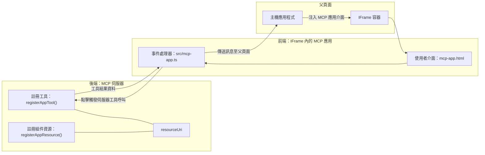
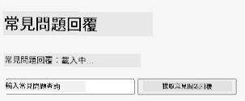
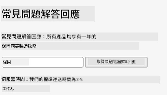
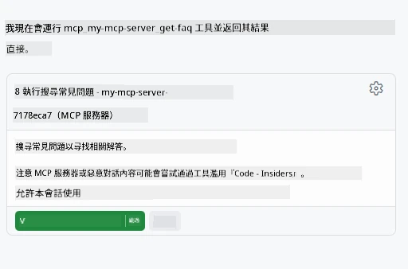
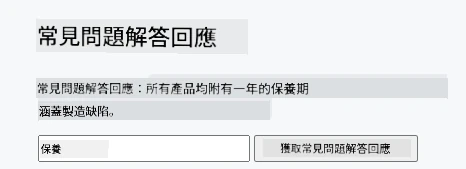

# MCP Apps

MCP Apps 是 MCP 中一個新範式。其構想不僅是從工具呼叫回傳資料，還同時提供這些資料應如何互動的資訊。這代表工具結果現在可以包含使用者介面資訊。不過，為什麼我們會需要這樣呢？試想你今天的做法。你很可能會在 MCP Server 前方加入某種前端介面，這是你需要編寫且維護的程式碼。有時候這是你想要的，但有時如果你能直接帶入一段自包含的資訊，從資料到使用者介面全都有，那就非常棒。

## 概觀

本課程提供有關 MCP Apps 的實務指導，包含如何開始使用及如何將其整合到現有的網頁應用程式中。MCP Apps 是 MCP 標準中新推出的功能。

## 學習目標

完成本課程後，你將能夠：

- 解釋 MCP Apps 是什麼。
- 何時該使用 MCP Apps。
- 建立並整合你自己的 MCP Apps。

## MCP Apps – 運作方式

MCP Apps 的構想是回傳本質上可呈現的元件。這樣的元件可以擁有視覺效果和互動性，例如按鈕點擊、使用者輸入等。先從伺服器端和我們的 MCP Server 開始說明。要建立一個 MCP App 元件，你需要創建一個工具和一個應用程式資源。這兩個部分藉由 resourceUri 連接。

以下是一個範例。我們試著視覺化牽涉到的東西及各部分負責什麼：

```text
server.ts -- responsible for registering tools and the component as a UI component
src/
  mcp-app.ts -- wiring up event handlers
mcp-app.html -- the user interface
```

此視覺描述創建元件及其邏輯的架構。


接著我們嘗試分別描述後端和前端的責任。

### 後端

這裡有兩件事需要完成：

- 註冊我們想要交互的工具。
- 定義元件。

**註冊工具**

```typescript
registerAppTool(
    server,
    "get-time",
    {
      title: "Get Time",
      description: "Returns the current server time.",
      inputSchema: {},
      _meta: { ui: { resourceUri } }, // 將此工具連結到其用戶介面資源
    },
    async () => {
      const time = new Date().toISOString();
      return { content: [{ type: "text", text: time }] };
    },
  );

```

上方程式碼描述行為，公開了一個名為 `get-time` 的工具，不需輸入參數，但會產生當前時間。我們確實有能力為需要接受使用者輸入的工具定義 `inputSchema` 。

**註冊元件**

在同一文件中，我們也需要註冊元件：

```typescript
const resourceUri = "ui://get-time/mcp-app.html";

// 註冊資源，返回用於用戶界面的打包 HTML/JavaScript。
registerAppResource(
  server,
  resourceUri,
  resourceUri,
  { mimeType: RESOURCE_MIME_TYPE },
  async () => {
    const html = await fs.readFile(path.join(DIST_DIR, "mcp-app.html"), "utf-8");

    return {
    contents: [
        { uri: resourceUri, mimeType: RESOURCE_MIME_TYPE, text: html },
    ],
    };
  },
);
```

注意我們提到 `resourceUri` 用來將元件與其工具連接。還值得留意的是回呼函式（callback），其中載入 UI 文件並回傳元件。

### 元件前端

與後端類似，這裡也有兩部分：

- 使用純 HTML 撰寫的前端。
- 處理事件及行為的程式碼，例如呼叫工具或向父視窗傳訊。

**使用者介面**

先看看使用者介面。

```html
<!-- mcp-app.html -->
<!DOCTYPE html>
<html lang="en">
  <head>
    <meta charset="UTF-8" />
    <title>Get Time App</title>
  </head>
  <body>
    <p>
      <strong>Server Time:</strong> <code id="server-time">Loading...</code>
    </p>
    <button id="get-time-btn">Get Server Time</button>
    <script type="module" src="/src/mcp-app.ts"></script>
  </body>
</html>
```

**事件連結**

最後部分是事件綁定，也就是找出 UI 中需要事件處理器的部分，並定義事件發生後的行為：

```typescript
// mcp-app.ts

import { App } from "@modelcontextprotocol/ext-apps";

// 獲取元素引用
const serverTimeEl = document.getElementById("server-time")!;
const getTimeBtn = document.getElementById("get-time-btn")!;

// 建立應用程式實例
const app = new App({ name: "Get Time App", version: "1.0.0" });

// 處理伺服器傳來嘅工具結果。應喺 `app.connect()` 之前設定，以避免
// 錯過初始嘅工具結果。
app.ontoolresult = (result) => {
  const time = result.content?.find((c) => c.type === "text")?.text;
  serverTimeEl.textContent = time ?? "[ERROR]";
};

// 綁定按鈕點擊事件
getTimeBtn.addEventListener("click", async () => {
  // `app.callServerTool()` 令用戶介面向伺服器請求最新資料
  const result = await app.callServerTool({ name: "get-time", arguments: {} });
  const time = result.content?.find((c) => c.type === "text")?.text;
  serverTimeEl.textContent = time ?? "[ERROR]";
});

// 連接到主機
app.connect();
```

如上所示，這是普通的程式碼用於將 DOM 元素連接到事件。值得一提的是呼叫 `callServerTool`，它會呼叫後端的一個工具。

## 處理使用者輸入

到目前為止，我們看到元件中有一個按鈕，點擊後會呼叫工具。現在試著加入更多 UI 元素，如輸入框，並嘗試向工具傳送參數。我們實作一個 FAQ 功能。功能設計如下：

- 應有一個按鈕和輸入欄位，使用者可輸入關鍵字搜尋，例如「Shipping」。此動作會呼叫後端一個工具，對 FAQ 資料進行搜尋。
- 支援上述 FAQ 搜尋的工具。

先為後端加入必要支援：

```typescript
const faq: { [key: string]: string } = {
    "shipping": "Our standard shipping time is 3-5 business days.",
    "return policy": "You can return any item within 30 days of purchase.",
    "warranty": "All products come with a 1-year warranty covering manufacturing defects.",
  }

registerAppTool(
    server,
    "get-faq",
    {
      title: "Search FAQ",
      description: "Searches the FAQ for relevant answers.",
      inputSchema: zod.object({
        query: zod.string().default("shipping"),
      }),
      _meta: { ui: { resourceUri: faqResourceUri } }, // 將此工具連結至其用戶界面資源
    },
    async ({ query }) => {
      const answer: string = faq[query.toLowerCase()] || "Sorry, I don't have an answer for that.";
      return { content: [{ type: "text", text: answer }] };
    },
  );
```

此處可看到我們如何填寫 `inputSchema` 並傳入一個 `zod` 架構，如下：

```typescript
inputSchema: zod.object({
  query: zod.string().default("shipping"),
})
```

在上述架構中我們宣告有個 `query` 輸入參數，為選填且預設為 "shipping" 。

接著，前往 *mcp-app.html* 看看我們需要建立什麼 UI：

```html
<div class="faq">
    <h1>FAQ response</h1>
    <p>FAQ Response: <code id="faq-response">Loading...</code></p>
    <input type="text" id="faq-query" placeholder="Enter FAQ query" />
    <button id="get-faq-btn">Get FAQ Response</button>
  </div>
```

很好，現在有一個輸入欄位和一個按鈕。接著到 *mcp-app.ts* 綁定事件：

```typescript
const getFaqBtn = document.getElementById("get-faq-btn")!;
const faqQueryInput = document.getElementById("faq-query") as HTMLInputElement;

getFaqBtn.addEventListener("click", async () => {
  const query = faqQueryInput.value;
  const result = await app.callServerTool({ name: "get-faq", arguments: { query } });
  const faq = result.content?.find((c) => c.type === "text")?.text;
  faqResponseEl.textContent = faq ?? "[ERROR]";
});
```

上面程式碼我們：

- 取得有趣的 UI 元素參考。
- 處理按鈕點擊事件，解析輸入欄位的值，並呼叫 `app.callServerTool()`，傳入 `name` 及 `arguments`，後者以 `query` 作為值。

實際呼叫 `callServerTool` 會傳訊息至父視窗，父視窗再呼叫 MCP Server。

### 試用看看

嘗試後我們應該看到如下：



接著這是用如「warranty」的輸入試用結果：



要執行這段程式碼，請參考 [程式碼區](./code/README.md)

## 在 Visual Studio Code 測試

Visual Studio Code 對 MVP Apps 支援優良，可能是測試 MCP Apps 最簡單的方式。使用 Visual Studio Code，於 *mcp.json* 裡新增伺服器條目，如下：

```json
"my-mcp-server-7178eca7": {
    "url": "http://localhost:3001/mcp",
    "type": "http"
  }
```

啟動伺服器後，你應該能透過聊天室視窗和你的 MVP App 通訊，前提是你已安裝 GitHub Copilot。

並藉由提示詞觸發，例如「#get-faq」：



就像你在瀏覽器中執行時一樣，呈現效果相同：



## 作業

製作一個石頭剪刀布遊戲。應包含以下：

UI：

- 帶選項的下拉清單
- 用以提交選擇的按鈕
- 顯示誰選了什麼及勝利者的標籤

伺服器：

- 建立一個石頭剪刀布工具，接受「choice」作為輸入。並產生電腦的選擇及判定勝負。

## 解答

[解答](./assignment/README.md)

## 總結

我們了解這個 MCP Apps 新範式。這是個新標準，讓 MCP Servers 不僅對資料有意見，也能決定資料如何呈現。

此外，我們認識到 MCP Apps 被置於 IFrame 中，和 MCP Servers 通訊時需要向父網頁應用程式傳送訊息。目前有多種純 JavaScript、React 等函式庫可協助簡化這種通訊。

## 重點回顧

你學到：

- MCP Apps 是新標準，方便同時運送資料與 UI 功能。
- 為安全起見，這類應用程式運行在 IFrame 中。

## 接下來

- [第 4 章](../../04-PracticalImplementation/README.md)

---

<!-- CO-OP TRANSLATOR DISCLAIMER START -->
**免責聲明**：
本文件係利用人工智能翻譯服務 [Co-op Translator](https://github.com/Azure/co-op-translator) 進行翻譯。雖然我哋力求準確，但請注意，自動翻譯可能包含錯誤或不準確之處。原文件之母語版本應被視為具權威性嘅資料來源。針對重要資訊，建議採用專業人類翻譯。我哋不會對因使用本翻譯而引起嘅任何誤解或誤譯負責。
<!-- CO-OP TRANSLATOR DISCLAIMER END -->