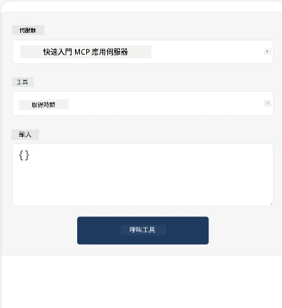

Here's a sample demonstrating MCP App

## Install 

1. 導航到 *mcp-app* 資料夾
1. 執行 `npm install`，此步驟會安裝前端及後端依賴

透過執行以下命令檢查後端是否編譯成功：

```sh
npx tsc --noEmit
```

如一切正常，應不會有任何輸出。

## Run backend

> 如果你使用的是 Windows 機器，這步會稍微麻煩一些，因為 MCP Apps 解決方案使用 `concurrently` 函式庫執行，你需要找替代品。以下是在 MCP App 的 *package.json* 中的錯誤行：

    ```json
    "start": "concurrently \"cross-env NODE_ENV=development INPUT=mcp-app.html vite build --watch\" \"tsx watch main.ts\""
    ```

此應用程式包含兩個部分，後端部分和主機部分。

呼叫以下命令啟動後端：

```sh
npm start
```

這會啟動後端，網址為 `http://localhost:3001/mcp`。

> 注意，如果你在 Codespace 環境中，可能需要將端口可見性設為公開。請在瀏覽器中透過 https://<name of Codespace>.app.github.dev/mcp 確認是否能連線。

## Choice -1 Test the app in Visual Studio Code

要在 Visual Studio Code 測試此解決方案，請執行以下步驟：

- 在 `mcp.json` 新增一個伺服器條目，如下所示：

    ```json
    {
        "servers": {
            "my-mcp-server-7178eca7": {
                "url": "http://localhost:3001/mcp",
                "type": "http"
            }
        },
        "inputs": []
    }
    ```

1. 在 *mcp.json* 中點擊「start」按鈕
1. 確認開啟聊天視窗並輸入 `get-faq`，你應該會看到以下結果：

    

## Choice -2- Test the app with a host

此 repo <https://github.com/modelcontextprotocol/ext-apps> 提供好幾種不同的 host 可以用來測試你的 MVP Apps。

這裡向你介紹兩種不同的選項：

### Local machine

- 複製 repo 後，導航到 *ext-apps*。

- 安裝依賴

   ```sh
   npm install
   ```

- 開啟另一個終端機視窗，導航到 *ext-apps/examples/basic-host*

    > 如果你使用 Codespace，需要前往 serve.ts 並在第 27 行將 http://localhost:3001/mcp 替換為你 Codespace 後端的 URL，例如 https://psychic-xylophone-657rpjgvxpc5g64-3001.app.github.dev/mcp

- 執行主機：

    ```sh
    npm start
    ```

    這會將主機連線至後端，你應該看到應用程式像這樣運行：

    

### Codespace

要讓 Codespace 環境正常運行需要額外工作。透過 Codespace 使用主機：

- 查看 *ext-apps* 目錄並導航到 *examples/basic-host*。
- 執行 `npm install` 安裝依賴。
- 執行 `npm start` 啟動主機。

## Test out the app

用以下方式嘗試此應用程式：

- 選擇「Call Tool」按鈕，你應該會看到如下結果：

    

太好了，一切正常運作。

---

<!-- CO-OP TRANSLATOR DISCLAIMER START -->
**免責聲明**：
本文件係使用 AI 翻譯服務 [Co-op Translator](https://github.com/Azure/co-op-translator) 翻譯所得。雖然我們致力於譯文的準確性，但請注意，自動翻譯可能包含錯誤或不準確之處。原始文件之母語版本應被視為權威資料來源。對於重要資訊，建議聘請專業人工翻譯。我們不對因使用本翻譯而引致之任何誤解或誤釋負責。
<!-- CO-OP TRANSLATOR DISCLAIMER END -->