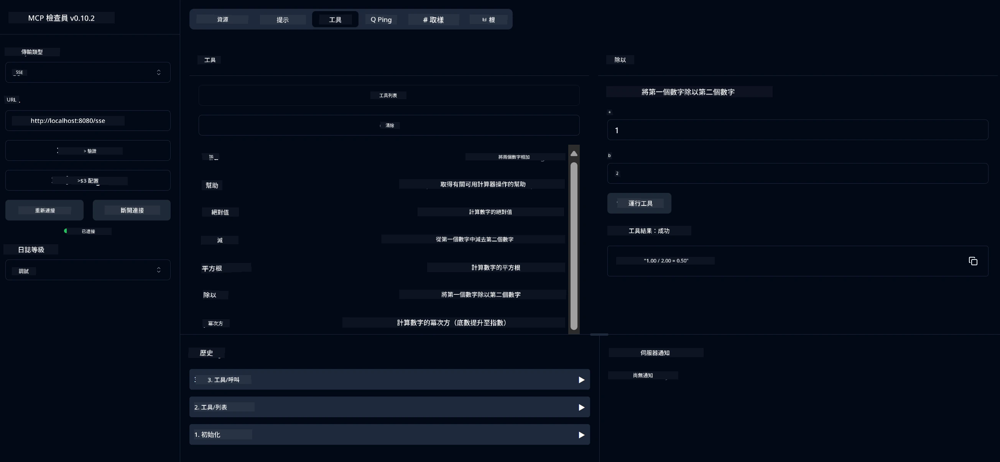

# 基本計算器 MCP 服務

> [!NOTE]
> 此範例使用舊版 HTTP+SSE 傳輸，目標是與 MCP `2025-11-25` 相容的 SDK。
> 新的遠端伺服器應使用 `2026-07-28` 支援 Streamable HTTP。


- 支援 SSE (Server-Sent Events)
- 使用 Spring AI 的 `@Tool` 註解自動註冊工具
- 基本計算器功能：
  - 加法、減法、乘法、除法
  - 次方運算與平方根
  - 餘數（取模）與絕對值
  - 用於操作說明的輔助功能


   - 兩數相加
   - 一數減另一數
   - 兩數相乘
   - 一數除另一數（含除零檢查）


   - 次方運算（以底數為基數求指數冪）
   - 平方根運算（含負數檢查）
   - 取模（餘數）計算
   - 絕對值計算


   - 內建助手功能，說明所有可用的運算


- `subtract(a, b)`: 用第一數減第二數
- `multiply(a, b)`: 兩數相乘
- `divide(a, b)`: 用第一數除以第二數（含除零檢查）
- `power(base, exponent)`: 計算次方
- `squareRoot(number)`: 計算平方根（含負數檢查）
- `modulus(a, b)`: 計算除法餘數
- `absolute(number)`: 計算絕對值
- `help()`: 獲取可用運算的說明資訊


   
   如需使用 GitHub 的 AI 模型（例如 phi-4），您需要一個 GitHub 個人存取權杖：


   
   b. 點選「生成新權杖」→「生成新權杖（經典版）」
   
   c. 給您的權杖命名一個描述性名稱
   
   d. 選擇以下權限範圍：
      - `repo`（私有倉庫的完全控制權）
      - `read:org`（讀取組織和團隊成員身份、讀取組織專案）
      - `gist`（創建 gists）


      - `user:email` (存取使用者電郵地址（唯讀）)
   
   e. 點擊「Generate token」並複製你的新 token
   
   f. 將其設定為環境變量：
      
      在 Windows 上：
      ```
      set GITHUB_TOKEN=your-github-token
      ```
      
      在 macOS/Linux 上：
      ```bash
      export GITHUB_TOKEN=your-github-token
      ```

   g. 若要持久設定，通過系統設定將其加入環境變量

2. 將 LangChain4j GitHub 依賴加入你的專案中（已包含於 pom.xml）：
   ```xml
   <dependency>
       <groupId>dev.langchain4j</groupId>
       <artifactId>langchain4j-github</artifactId>
       <version>${langchain4j.version}</version>
   </dependency>
   ```

3. 確保計算器伺服器正在 `localhost:8080` 運行

### 運行 LangChain4j 客戶端

此範例示範：
- 透過 SSE 傳輸連接至計算器 MCP 伺服器
- 使用 LangChain4j 創建利用計算器操作的聊天機械人
- 集成 GitHub AI 模型（現使用 phi-4 模型）

客戶端發送以下範例查詢以示範功能：
1. 計算兩個數字的加總
2. 尋找一個數字的平方根
3. 獲取可用計算器操作的幫助資訊

運行範例並檢查控制台輸出，查看 AI 模型如何使用計算器工具回應查詢。

### GitHub 模型配置

LangChain4j 客戶端配置為使用 GitHub 的 phi-4 模型，設定如下：

```java
ChatLanguageModel model = GitHubChatModel.builder()
    .apiKey(System.getenv("GITHUB_TOKEN"))
    .timeout(Duration.ofSeconds(60))
    .modelName("phi-4")
    .logRequests(true)
    .logResponses(true)
    .build();
```

若要使用不同的 GitHub 模型，只需將 `modelName` 參數更改為其他支援的模型（例如："claude-3-haiku-20240307"、"llama-3-70b-8192" 等）。

## 依賴項

專案需要以下主要依賴：

```xml
<!-- For MCP Server -->
<dependency>
    <groupId>org.springframework.ai</groupId>
    <artifactId>spring-ai-starter-mcp-server-webflux</artifactId>
</dependency>

<!-- For LangChain4j integration -->
<dependency>
    <groupId>dev.langchain4j</groupId>
    <artifactId>langchain4j-mcp</artifactId>
    <version>${langchain4j.version}</version>
</dependency>

<!-- For GitHub models support -->
<dependency>
    <groupId>dev.langchain4j</groupId>
    <artifactId>langchain4j-github</artifactId>
    <version>${langchain4j.version}</version>
</dependency>
```

## 建置專案

使用 Maven 建置專案：
```bash
./mvnw clean install -DskipTests
```

## 運行伺服器

### 使用 Java

```bash
java -jar target/calculator-server-0.0.1-SNAPSHOT.jar
```

### 使用 MCP Inspector

MCP Inspector 是與 MCP 服務互動的有用工具。要與此計算器服務一起使用它：

1. **安裝並運行 MCP Inspector** 於新的終端視窗：
   ```bash
   npx @modelcontextprotocol/inspector
   ```

2. **透過應用程式顯示的 URL（通常是 http://localhost:6274）訪問 Web UI**

3. <strong>配置連線</strong>：
   - 將傳輸類型設為「SSE」
   - 將 URL 設置為正在運行的伺服器 SSE 端點：`http://localhost:8080/sse`
   - 點擊「Connect」

4. <strong>使用工具</strong>：
   - 點擊「List Tools」查看可用的計算器操作
   - 選擇工具並點擊「Run Tool」執行操作



### 使用 Docker

專案包含用於容器化部署的 Dockerfile：

1. **建置 Docker 映像**：
   ```bash
   docker build -t calculator-mcp-service .
   ```

2. **運行 Docker 容器**：
   ```bash
   docker run -p 8080:8080 calculator-mcp-service
   ```

這將會：
- 使用 Maven 3.9.9 和 Eclipse Temurin 24 JDK 建置多階段 Docker 映像
- 創建優化的容器映像
- 在 8080 埠暴露服務
- 在容器內啟動 MCP 計算器服務

容器運行後，你可以透過 `http://localhost:8080` 訪問服務。

## 疑難排解

### GitHub Token 的常見問題


1. **Token 權限問題**：如果您遇到 403 Forbidden 錯誤，請檢查您的 token 是否具有先決條件中所述的正確權限。

2. **找不到 Token**：如果出現「No API key found」錯誤，請確保 GITHUB_TOKEN 環境變量已正確設置。

3. <strong>速率限制</strong>：GitHub API 有速率限制。如果遇到速率限制錯誤（狀態碼 429），請等待幾分鐘後再嘗試。

4. **Token 過期**：GitHub token 可能會過期。如果在一段時間後收到身份驗證錯誤，請生成新 token 並更新您的環境變量。

如需進一步幫助，請查看 [LangChain4j 文檔](https://github.com/langchain4j/langchain4j) 或 [GitHub API 文檔](https://docs.github.com/en/rest)。

---

<!-- CO-OP TRANSLATOR DISCLAIMER START -->
**免責聲明**：
本文件使用 AI 翻譯服務 [Co-op Translator](https://github.com/Azure/co-op-translator) 進行翻譯。雖然我們力求準確，但請注意，自動翻譯可能包含錯誤或不準確之處。原始文件的母語版本應被視為權威來源。對於重要資訊，建議尋求專業人工翻譯。我們不對因使用本翻譯而引起的任何誤解或曲解承擔責任。
<!-- CO-OP TRANSLATOR DISCLAIMER END -->