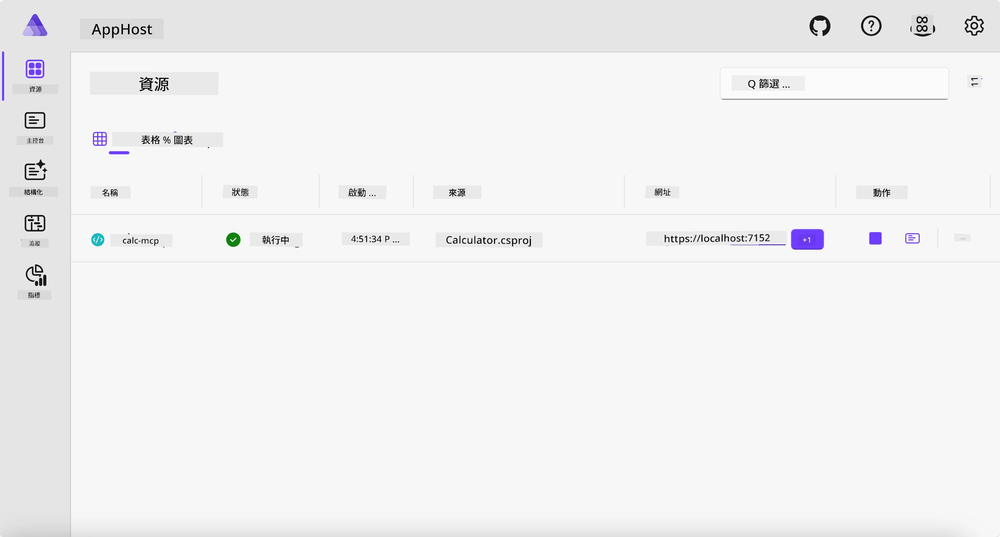
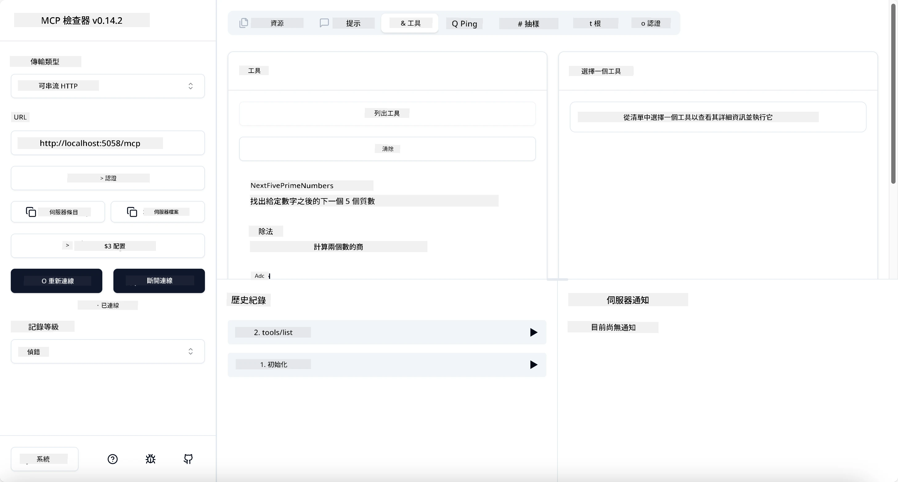
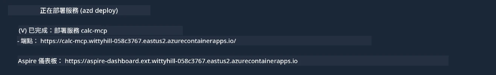

# 範例

前一個範例展示了如何使用本地 .NET 專案與 `stdio` 類型，以及如何在容器中本地運行伺服器。這在很多情況下都是不錯的解決方案。然而，讓伺服器遠端運行（例如在雲端環境中）也是很有用的。這就是 `http` 類型的用武之地。

看一下 `04-PracticalImplementation` 資料夾裡的解決方案，可能看起來比之前的複雜得多。但實際上並非如此。仔細看看專案 `src/Calculator`，你會發現它與先前範例大致相同。唯一的差異是我們使用了不同的函式庫 `ModelContextProtocol.AspNetCore` 來處理 HTTP 請求，且我們將方法 `IsPrime` 改為私有，只是為了展示你可以在代碼中擁有私有方法。其他程式碼跟之前一樣。

其他專案來自 [Aspire](https://aspire.dev/get-started/what-is-aspire/)。在解決方案中有 Aspire 將提升開發者開發和測試的體驗，並協助觀察性。啟動伺服器並非必要，但在解決方案中加入它是很好的做法。

## 本地啟動伺服器

1. 從 VS Code（安裝 C# DevKit 擴展）導覽到 `04-PracticalImplementation/samples/csharp` 目錄。
1. 執行以下指令來啟動伺服器：

   ```bash
    dotnet watch run --project ./src/AppHost
   ```

1. 當網頁瀏覽器打開 Aspire 儀表板時，注意 `http` URL，應該類似於 `http://localhost:5058/`。

   

## 使用 MCP Inspector 測試 Streamable HTTP

如果你有 Node.js 22.7.5 或以上版本，你可以利用 MCP Inspector 來測試你的伺服器。

啟動伺服器，然後在終端機執行以下指令：

```bash
npx @modelcontextprotocol/inspector http://localhost:5058
```



- 選擇 `Streamable HTTP` 作為傳輸類型。
- 在 Url 欄位輸入先前記下的伺服器 URL，並在後面加上 `/mcp`。應為 `http`（非 `https`），類似 `http://localhost:5058/mcp`。
- 點選連接按鈕。

Inspector 的好處之一是它提供良好的可視性，能清楚看到正在發生什麼。

- 嘗試列出可用工具
- 嘗試其中一些工具，它們應該會像之前一樣運作。

## 使用 VS Code 中的 GitHub Copilot Chat 測試 MCP 伺服器

若要使用 Streamable HTTP 傳輸與 GitHub Copilot Chat，請將之前建立的 `calc-mcp` 伺服器配置修改如下：

```jsonc
// .vscode/mcp.json
{
  "servers": {
    "calc-mcp": {
      "type": "http",
      "url": "http://localhost:5058/mcp"
    }
  }
}
```

做些測試：

- 詢問「6780 之後的 3 個質數」。注意 Copilot 會使用新的工具 `NextFivePrimeNumbers`，並只回傳前三個質數。
- 詢問「111 之後的 7 個質數」，看看會發生什麼。
- 詢問「John 有 24 個棒棒糖，要分給他的 3 個小孩。每個小孩有多少個棒棒糖？」看看結果如何。

## 部署伺服器至 Azure

讓我們將伺服器部署到 Azure，使更多人可以使用它。

從終端機導覽至資料夾 `04-PracticalImplementation/samples/csharp`，然後執行以下指令：

```bash
azd up
```

部署結束後，應該會看到類似下方的訊息：



拿取 URL 並在 MCP Inspector 及 GitHub Copilot Chat 中使用。

```jsonc
// .vscode/mcp.json
{
  "servers": {
    "calc-mcp": {
      "type": "http",
      "url": "https://calc-mcp.gentleriver-3977fbcf.australiaeast.azurecontainerapps.io/mcp"
    }
  }
}
```

## 接下來呢？

我們嘗試不同的傳輸類型和測試工具，也將 MCP 伺服器部署到 Azure。但如果伺服器需要存取私有資源呢？例如一個資料庫或私有 API？下一章中，我們將探索如何提升伺服器的安全性。

---

<!-- CO-OP TRANSLATOR DISCLAIMER START -->
**免責聲明**：
本文件使用 AI 翻譯服務 [Co-op Translator](https://github.com/Azure/co-op-translator) 進行翻譯。雖然我們力求準確，但請注意，自動翻譯可能包含錯誤或不準確之處。原始文件的母語版本應被視為權威來源。對於重要資訊，建議尋求專業人工翻譯。我們不對因使用本翻譯而引起的任何誤解或曲解承擔責任。
<!-- CO-OP TRANSLATOR DISCLAIMER END -->