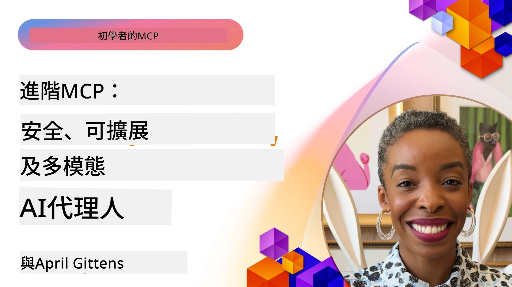

# MCP 高階主題

_(點擊上方圖片觀看本課程影片)_

本章涵蓋 Model Context Protocol (MCP) 實作中的一系列高階主題，包括多模態整合、可擴展性、安全最佳實踐及企業整合。這些主題對於建造堅固且可上線的 MCP 應用程式，以迎合現代 AI 系統的需求至關重要。

## 概覽

本課程探索 Model Context Protocol 實作中的高階概念，聚焦於多模態整合、可擴展性、安全最佳實踐及企業整合。這些主題對於建立能夠應付企業環境複雜需求的生產級 MCP 應用程式非常重要。

> **當前規範說明：** MCP `2026-07-28` 廢棄了第 5.4 和 5.6 課程中涵蓋的 Roots 與 Sampling 原語。它也將協議功能（5.16）中提及的試驗性 Tasks 功能移至專屬的 Tasks 擴充套件。這些課程保留用於傳承 `2025-11-25` 實作並包含遷移指引。詳見 [MCP 變更紀錄：2026-07-28 規範](../01-CoreConcepts/mcp-2026-07-28.md)。

## 學習目標

完成本課程後，您將能夠：

- 在 MCP 框架中實作多模態能力
- 設計適用於高需求場景的可擴展 MCP 架構
- 應用與 MCP 安全原則相符的安全最佳實踐
- 將 MCP 與企業 AI 系統及框架整合
- 優化生產環境中的效能與可靠性

## 課程與範例專案

| 連結 | 標題 | 說明 |
|------|-------|-------------|
| [5.1 Integration with Azure](./mcp-integration/README.md) | 與 Azure 整合 | 學習如何在 Azure 中整合您的 MCP 伺服器 |
| [5.2 Multi modal sample](./mcp-multi-modality/README.md) | MCP 多模態範例 | 音訊、影像及多模態回應範例 |
| [5.3 MCP OAuth2 sample](../../../05-AdvancedTopics/mcp-oauth2-demo) | MCP OAuth2 範例 | 簡易 Spring Boot 應用展示 MCP 的 OAuth2，作為授權伺服器與資源伺服器。示範安全令牌發行、受保護端點、Azure Container Apps 部署及 API 管理整合。 |
| [5.4 Root Contexts](./mcp-root-contexts/README.md) | 根語境 | 學習傳承 `2025-11-25` 的 Roots 原語與目前的遷移方案（於 `2026-07-28` 權廢止） |
| [5.5 Routing](./mcp-routing/README.md) | 路由 | 學習各種路由類型 |
| [5.6 Sampling](./mcp-sampling/README.md) | 取樣 | 學習傳承 `2025-11-25` 的取樣原語與目前的遷移方案（於 `2026-07-28` 權廢止） |
| [5.7 Scaling](./mcp-scaling/README.md) | 擴展 | 了解擴展方式 |
| [5.8 Security](./mcp-security/README.md) | 安全 | 保護您的 MCP 伺服器 |

| [5.9 網絡搜索範例](./web-search-mcp/README.md) | 網絡搜索 MCP | Python MCP 伺服器和客戶端整合 SerpAPI，實現實時網頁、新聞、產品搜索和問答。展示多工具協調、外部 API 整合及強健的錯誤處理。 |
| [5.10 實時串流](./mcp-realtimestreaming/README.md) | 串流  | 實時數據串流已成為當今數據驅動世界的核心，企業和應用程式需要即時取得資訊以作出及時決策。|
| [5.11 實時網絡搜索](./mcp-realtimesearch/README.md) | 網絡搜索 | 實時網絡搜索如何通過 MCP 提供標準化的方法，於 AI 模型、搜索引擎及應用程式間達成上下文管理。| 
| [5.12 Model Context Protocol 伺服器的 Entra ID 認證](./mcp-security-entra/README.md) | Entra ID 認證 | Microsoft Entra ID 提供強健的雲端身份與存取管理解決方案，確保只有獲授權的用戶及應用程式能與您的 MCP 伺服器互動。|
| [5.13 Microsoft Foundry 代理整合](./mcp-foundry-agent-integration/README.md) | Microsoft Foundry 整合 | 學習如何將 Model Context Protocol 伺服器與 Microsoft Foundry 代理整合，透過標準化外部數據源連接，實現強大的工具協調及企業 AI 能力。|
| [5.14 上下文工程](./mcp-contextengineering/README.md) | 上下文工程 | MCP 伺服器上下文工程技術的未來機會，包括上下文優化、動態上下文管理，及 MCP 框架內有效提示工程的策略。|
| [5.15 MCP 自訂傳輸](./mcp-transport/README.md) | 自訂傳輸 | 學習如何為專門的 MCP 通訊場景實作自訂傳輸機制。|
| [5.16 協定功能深度探討](./mcp-protocol-features/README.md) | 協定功能 | 精通進階協定功能，包括進度通知、請求取消、資源樣板及錯誤處理模式。|
| [5.17 對抗性多代理推理](./mcp-adversarial-agents/README.md) | 對抗代理 | 透過兩個持相反立場、共享單一 MCP 工具集的代理進行結構化辯論，捕捉幻覺、揭示邊緣案例並產生更精準的輸出。|

> **歷史性「2025-11-25」附註：** 該版本引入了實驗性
> 任務及擴充了多項協定功能。在「2026-07-28」版本中，任務移至
> 正式擴展，並停用 Roots。請勿以
> 「2025-11-25」的功能狀態作為當前指引；詳見
> [2026-07-28 變更日誌](https://modelcontextprotocol.io/specification/2026-07-28/changelog)。

## 附加參考資料

有關先進 MCP 主題的最新資訊，請參閱：
- [MCP 文件](https://modelcontextprotocol.io/)
- [MCP 規範（2026-07-28）](https://modelcontextprotocol.io/specification/2026-07-28/)
- [GitHub 倉庫](https://github.com/modelcontextprotocol)
- [OWASP MCP 十大](https://microsoft.github.io/mcp-azure-security-guide/mcp/) - 安全風險與緩解措施

- [MCP 安全高峰工作坊 (Sherpa)](https://azure-samples.github.io/sherpa/) - 實作安全培訓

## 主要重點

- 多模態 MCP 實作擴展 AI 能力超越文本處理
- 可擴展性對企業部署至關重要，可透過橫向和縱向擴展來解決
- 全面安全措施保護數據並確保適當的存取控制
- 與 Azure OpenAI 和 Microsoft AI Foundry 等平台的企業整合強化 MCP 能力
- 先進的 MCP 實作受益於優化的架構及謹慎的資源管理

## 練習

為特定使用案例設計企業級 MCP 實作：

1. 識別您的使用案例中的多模態需求
2. 概述保護敏感數據所需的安全控制
3. 設計可處理不同負載的可擴展架構
4. 規劃與企業 AI 系統的整合點
5. 記錄潛在效能瓶頸及緩解策略

## 額外資源

- [Azure OpenAI 文件](https://learn.microsoft.com/en-us/azure/ai-services/openai/)
- [Microsoft AI Foundry 文件](https://learn.microsoft.com/en-us/ai-services/)

---

## 下一步

從以下課程開始探索本模組的內容：[5.1 MCP 整合](./mcp-integration/README.md)

完成本模組後，繼續前往：[模組 6：社群貢獻](../06-CommunityContributions/README.md)

---

<!-- CO-OP TRANSLATOR DISCLAIMER START -->
**免責聲明**：
本文件使用 AI 翻譯服務 [Co-op Translator](https://github.com/Azure/co-op-translator) 進行翻譯。雖然我們力求準確，但請注意，自動翻譯可能包含錯誤或不準確之處。原始文件的母語版本應被視為權威來源。對於重要資訊，建議尋求專業人工翻譯。我們不對因使用本翻譯而引起的任何誤解或曲解承擔責任。
<!-- CO-OP TRANSLATOR DISCLAIMER END -->