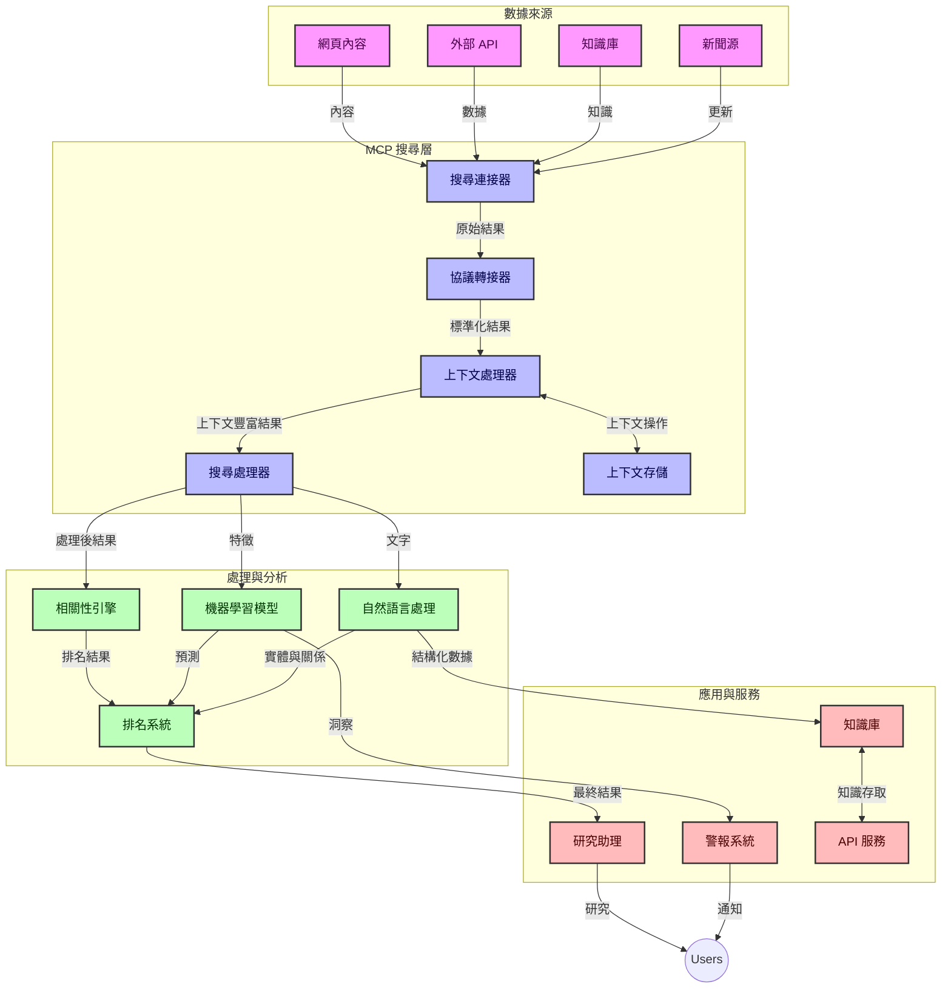
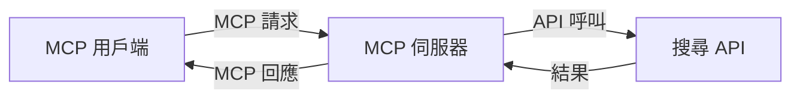
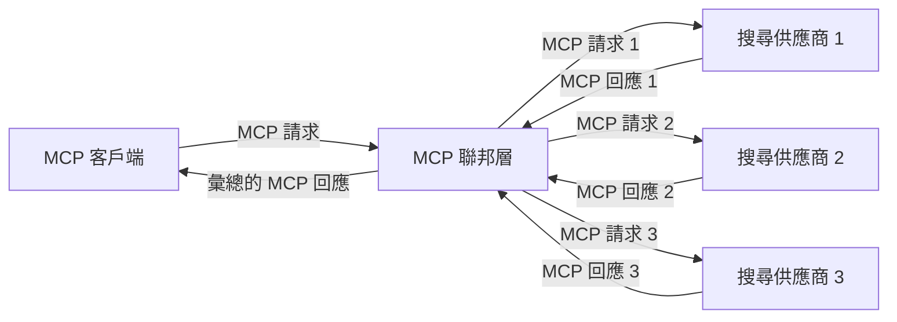
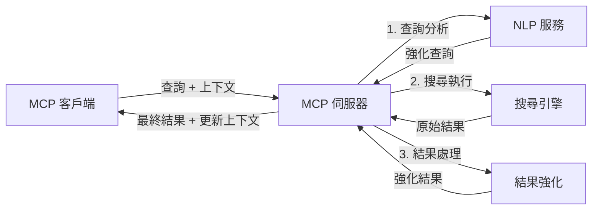

# 用於實時網絡搜索的模型上下文協議

## 總覽

實時網絡搜索已成為當今以資訊為驅動的環境中不可或缺的一部分，應用程序需要即時獲取互聯網上的最新資訊，以提供相關且及時的回應。模型上下文協議（MCP）代表了優化這些實時搜索流程的重要進展，提升搜索效率、維護上下文完整性並改善整體系統性能。

本模塊探討 MCP 如何透過提供一種跨 AI 模型、搜索引擎和應用的標準化上下文管理方法，改造實時網絡搜索。

### 您將學到的內容

在這份全面指南中，您將發現：

- MCP 如何建立 AI 模型與實時網絡搜索能力之間的無縫橋樑
- 使用 MCP 實現高效且可擴展搜索解決方案的架構模式
- 保持多重查詢與互動中的搜索上下文的技術
- 針對各種搜索場景的 Python 和 JavaScript 實作範例
- 在 MCP 支援的搜索系統中平衡相關性、時效性與效能的方法

## 實時網絡搜索簡介

實時網絡搜索是一種技術方法，能夠持續查詢、處理及分析網絡上的資訊，當資訊被發布或更新時即時反映，讓系統能以最小延遲提供新鮮且相關的資訊。不同於傳統依靠可能是數小時甚至數天前的索引資料來運作的搜索系統，實時搜索直接處理網絡上的即時資料，提供反映當前網絡內容狀態的見解與資訊。

### 實時網絡搜索的核心概念：

- <strong>持續查詢處理</strong>：搜索查詢基於持續更新的資料來源進行處理
- <strong>時效性優先</strong>：系統設計以優先處理新鮮資訊
- <strong>相關性平衡</strong>：在相關性與時效性之間保持平衡
- <strong>可擴展架構</strong>：系統必須能處理變動的查詢負載與資料量
- <strong>上下文理解</strong>：維持用戶上下文於多次搜索迭代中對結果的意義至關重要
- <strong>動態查詢重構</strong>：依據上下文與先前結果自適應調整查詢
- <strong>多來源整合</strong>：結合多個搜索提供者和網絡來源的結果
- <strong>語義理解</strong>：根據意義而非僅是關鍵字來處理查詢與內容
- <strong>實時排名</strong>：隨著新資訊可用持續調整結果排名

### 模型上下文協議與實時網絡搜索

模型上下文協議（MCP）解決了實時網絡搜索環境中的多項關鍵挑戰：

1. <strong>搜索上下文維護</strong>：MCP 標準化跨分散搜索組件的上下文維護，確保 AI 模型與處理節點可存取相關查詢歷史與用戶喜好。

2. <strong>高效查詢管理</strong>：透過提供結構化的上下文傳輸機制，MCP 減少每次搜索迭代重複上下文的開銷。

3. <strong>互操作性</strong>：MCP 建立了多種搜索技術和 AI 模型之間共享上下文的通用語言，促進更靈活與可擴展的架構。

4. <strong>搜索優化上下文</strong>：MCP 實作能優先考量對有效搜索最相關的上下文元素，於效能及準確性上優化。

5. <strong>自適應搜索處理</strong>：透過 MCP 妥善的上下文管理，搜索系統可根據用戶需求和資訊環境的演變動態調整處理。

在從新聞聚合到研究助理等現代應用中，MCP 與網絡搜索技術的整合，讓搜索更加智慧且具有上下文感知能力，隨著用戶互動持續，能提供越來越相關的結果。

## 學習目標

本課程結束時，您將能夠：

- 理解實時網絡搜索的基本原理及其在現代應用中的挑戰
- 解釋模型上下文協議（MCP）如何提升實時網絡搜索能力
- 使用流行框架和 API 實作基於 MCP 的搜索解決方案
- 設計及部署具可擴展性且高效能的 MCP 搜索架構
- 將 MCP 概念應用於語義搜索、研究輔助及 AI 增強瀏覽等不同用例
- 評估 MCP 基礎搜索技術的最新趨勢與未來創新
- 開發從用戶互動中學習的上下文感知搜索系統
- 利用標準化 MCP 協議將網絡搜索能力整合至 AI 助理
- 創建多階段搜索管道，根據上下文逐步優化結果
- 在維持全面上下文感知的同時優化搜索性能

### 定義與重要性

實時網絡搜索涉及持續查詢、檢索及交付網絡信息，延遲極低。不同於定期爬網並索引網頁的傳統搜索引擎，實時搜索旨在曝光資訊於其可用時，使用戶能即時接觸最新內容。

實時網絡搜索的關鍵特性包括：

- <strong>新鮮度</strong>：優先考慮最新內容及更新
- <strong>持續處理</strong>：持續監控新資訊
- <strong>查詢適應</strong>：依據上下文及反饋優化搜索查詢
- <strong>即時交付</strong>：以最短延遲提供搜索結果
- <strong>上下文保持</strong>：基於先前查詢累積提高相關性

### 傳統網絡搜索面臨的挑戰

傳統網絡搜索方法在實時場景中存在多重限制：

1. <strong>上下文碎片化</strong>：難以於多次查詢中維持搜索上下文
2. <strong>資訊新鮮度</strong>：難以存取及優先最新資訊
3. <strong>整合複雜性</strong>：搜索系統與應用間互操作問題
4. <strong>延遲問題</strong>：在全面搜索與響應時間間的平衡
5. <strong>相關性調整</strong>：在優先時效性的同時確保準確性與相關性

## 理解搜索領域中的模型上下文協議（MCP）

### MCP 在搜索上下文中是什麼？

模型上下文協議（MCP）是一種標準化的通訊協議，旨在促進 AI 模型與應用間高效互動。在實時網絡搜索領域，MCP 提供一個框架以：

- 在查詢序列中保存搜索上下文
- 標準化搜索查詢與結果格式
- 優化搜索參數與結果的傳輸
- 強化模型與搜索引擎間的通信

### 核心組件與架構

MCP 用於實時網絡搜索的架構包含數個關鍵組件：

1. <strong>查詢上下文處理器</strong>：管理及維持多重查詢中的搜索上下文
2. <strong>搜索處理器</strong>：運用上下文感知技術處理進入的搜索請求
3. <strong>協議轉換器</strong>：在保留上下文的情況下轉換不同搜索 API
4. <strong>上下文存儲</strong>：高效存取搜索歷史和偏好設定
5. <strong>搜索連接器</strong>：連接各種搜索引擎及網絡 API



### MCP 如何改善實時網絡搜索

MCP 通過以下方式解決傳統網絡搜索的挑戰：

- <strong>上下文連續性</strong>：於整個搜索期間維持查詢間關聯
- <strong>傳輸優化</strong>：通過智能上下文管理減少搜索參數冗餘
- <strong>標準化接口</strong>：為搜索組件提供一致 API
- <strong>降低延遲</strong>：高效處理上下文降低處理負擔
- <strong>提升相關性</strong>：透過保存多查詢用戶意圖提升搜索相關性

## 整合與實作

實時網絡搜索系統需要精心的架構設計與實作，以兼顧性能與上下文完整性。模型上下文協議提供了標準化方法來整合 AI 模型與搜索技術，實現更先進且具上下文感知的搜索管道。

### MCP 在搜索架構中的整合概述

在實時網絡搜索環境中實施 MCP 需考慮多項要點：

1. <strong>搜索上下文序列化</strong>：MCP 提供高效編碼上下文資訊於搜索請求中機制，確保關鍵上下文隨查詢流經處理流程。包括針對搜索相關元資料優化的標準化序列化格式。

2. <strong>有狀態搜索處理</strong>：MCP 透過於多次搜索迭代中維持一致的上下文表示促進更智慧的有狀態處理。在多階段搜索管道中上下文的精煉能提升結果。

3. <strong>查詢擴展與優化</strong>：MCP 實作支援基於累積上下文的複雜查詢擴展與優化，使得搜索會話持續推進中結果更相關。

4. <strong>結果快取與優先排序</strong>：經由標準化上下文處理，MCP 幫助管理結果快取與優先級，使組件能依據變化中的搜索上下文做調整。

5. <strong>搜索聯邦與聚合</strong>：MCP 透過提供結構化的搜索上下文表示，促進跨多個後端更複雜的搜索聯邦，實現來自多元來源的結果有意義聚合。

MCP 在不同搜索技術中的實施創建了統一的上下文管理方法，減少了自訂整合代碼需求，並提升系統隨查詢演進維持有意義上下文的能力。

### MCP 在多種網絡搜索實作中的應用

這些範例依據目前 MCP 規範，該規範集中於一種基於 JSON-RPC 的協議，含有明確的傳輸機制。程式碼示範如何實作自訂搜索整合，同時保持與 MCP 協議完全相容。


<details>
<summary>使用通用搜索 API 的 Python 實作</summary>

```python
import asyncio
import json
import aiohttp
from typing import Dict, Any, Optional, List
from contextlib import asynccontextmanager
from collections.abc import AsyncIterator

# 匯入標準MCP庫
from mcp.client.session import ClientSession
from mcp.client.streamable_http import streamablehttp_client
from mcp.types import TextContent, CreateMessageRequestParams, CreateMessageResult
from mcp.server.fastmcp import FastMCP

# 建立一個用於網絡搜索的FastMCP伺服器
search_server = FastMCP("WebSearch")

# 用於處理網絡搜索操作的類別
class WebSearchHandler:
    def __init__(self, api_endpoint: str, api_key: str):
        self.api_endpoint = api_endpoint
        self.api_key = api_key
        self.session = None
        
    async def initialize(self):
        """Initialize the HTTP session"""
        self.session = aiohttp.ClientSession(
            headers={"Authorization": f"Bearer {self.api_key}"}
        )
    
    async def close(self):
        """Close the HTTP session"""
        if self.session:
            await self.session.close()
            
    async def perform_search(self, query: str, max_results: int = 5, 
                           include_domains: List[str] = None, 
                           exclude_domains: List[str] = None,
                           time_period: str = "any") -> Dict[str, Any]:
        """Perform web search using the search API"""
        # 建構搜尋參數
        search_params = {
            "q": query,
            "limit": max_results,
            "time": time_period
        }
        
        if include_domains:
            search_params["site"] = ",".join(include_domains)
            
        if exclude_domains:
            search_params["exclude_site"] = ",".join(exclude_domains)
        
        # 執行搜索請求
        try:
            async with self.session.get(
                self.api_endpoint,
                params=search_params
            ) as response:
                if response.status != 200:
                    error_text = await response.text()
                    raise Exception(f"Search API error: {response.status} - {error_text}")
                
                search_data = await response.json()
                
                # 將API特定響應轉換為標準格式
                results = []
                for item in search_data.get("results", []):
                    results.append({
                        "title": item.get("title", ""),
                        "url": item.get("url", ""),
                        "snippet": item.get("snippet", ""),
                        "date": item.get("published_date", ""),
                        "source": item.get("source", "")
                    })
                
                return {
                    "query": query,
                    "totalResults": len(results),
                    "results": results
                }
        except Exception as e:
            print(f"Search API request error: {e}")
            raise

# 初始化搜索處理器
search_handler = WebSearchHandler(
    api_endpoint="https://api.search-service.example/search",
    api_key="your-api-key-here"
)

# 設定壽命週期以管理搜索處理器
@asyncio.asynccontextmanager
async def app_lifespan(server: FastMCP):
    """Manage application lifecycle"""
    await search_handler.initialize()
    try:
        yield {"search_handler": search_handler}
    finally:
        await search_handler.close()

# 設定伺服器的壽命週期
search_server = FastMCP("WebSearch", lifespan=app_lifespan)

# 註冊一個網絡搜索工具
@search_server.tool()
async def web_search(query: str, max_results: int = 5, 
                   include_domains: List[str] = None,
                   exclude_domains: List[str] = None,
                   time_period: str = "any") -> Dict[str, Any]:
    """
    Search the web for information
    
    Args:
        query: The search query
        max_results: Maximum number of results to return (default: 5)
        include_domains: List of domains to include in search results
        exclude_domains: List of domains to exclude from search results
        time_period: Time period for results ("day", "week", "month", "any")
        
    Returns:
        Dictionary containing search results
    """
    ctx = search_server.get_context()
    search_handler = ctx.request_context.lifespan_context["search_handler"]
    
    results = await search_handler.perform_search(
        query=query,
        max_results=max_results,
        include_domains=include_domains,
        exclude_domains=exclude_domains,
        time_period=time_period
    )
    
    return results

# 客戶端使用範例
async def client_example():
    # 使用Streamable HTTP傳輸連接搜索伺服器
    async with streamablehttp_client("http://localhost:8000/mcp") as (read, write, _):
        async with ClientSession(read, write) as session:
            # 初始化連線
            await session.initialize()
            
            # 呼叫web_search工具
            search_results = await session.call_tool(
                "web_search", 
                {
                    "query": "latest developments in AI and Model Context Protocol",
                    "max_results": 5,
                    "time_period": "day",
                    "include_domains": ["github.com", "microsoft.com"]
                }
            )
            
            print(f"Search results: {search_results}")

# 伺服器執行範例
if __name__ == "__main__":
    # 使用Streamable HTTP傳輸執行伺服器
    search_server.run(transport="streamable-http")
```
</details> 

<details>
<summary>基於瀏覽器搜索的 JavaScript 實作</summary>


```javascript
// 網絡搜尋的 MCP 伺服器實現
import { McpServer, ResourceTemplate } from '@modelcontextprotocol/sdk/server/mcp.js';
import { StreamableHTTPServerTransport } from '@modelcontextprotocol/sdk/server/streamableHttp.js';
import { z } from 'zod';

// 建立一個用於網絡搜尋的 MCP 伺服器
const searchServer = new McpServer({
    name: "BrowserSearch",
    description: "A server that provides web search capabilities"
});

// 搜尋服務類別
class SearchService {
    constructor(searchApiUrl, apiKey) {
        this.searchApiUrl = searchApiUrl;
        this.apiKey = apiKey;
    }

    async performSearch(parameters) {
        const {
            query = '',
            maxResults = 5,
            includeDomains = [],
            excludeDomains = [],
            timePeriod = 'any'
        } = parameters;
        
        // 使用參數構造搜尋 URL
        const url = new URL(this.searchApiUrl);
        url.searchParams.append('q', query);
        url.searchParams.append('limit', maxResults);
        url.searchParams.append('time', timePeriod);
        
        if (includeDomains.length > 0) {
            url.searchParams.append('site', includeDomains.join(','));
        }
        
        if (excludeDomains.length > 0) {
            url.searchParams.append('exclude_site', excludeDomains.join(','));
        }
        
        try {
            const response = await fetch(url.toString(), {
                method: 'GET',
                headers: {
                    'Authorization': `Bearer ${this.apiKey}`,
                    'Content-Type': 'application/json'
                }
            });
            
            if (!response.ok) {
                const errorText = await response.text();
                throw new Error(`Search API error: ${response.status} - ${errorText}`);
            }
            
            const searchData = await response.json();
            
            // 將 API 特定的回應轉換為標準格式
            const results = searchData.results?.map(item => ({
                title: item.title || '',
                url: item.url || '',
                snippet: item.snippet || '',
                date: item.published_date || '',
                source: item.source || ''
            })) || [];
            
            return {
                query,
                totalResults: results.length,
                results
            };
        } catch (error) {
            console.error('Search API request error:', error);
            throw error;
        }
    }
}

// 初始化搜尋服務
const searchService = new SearchService(
    'https://api.search-service.example/search',
    'your-api-key-here'
);

// 為伺服器設定上下文提供者
searchServer.setContextProvider(() => {
    return {
        searchService
    };
});

// 註冊網絡搜尋工具
searchServer.tool({
    name: 'web_search',
    description: 'Search the web for information',
    parameters: {
        type: 'object',
        properties: {
            query: {
                type: 'string',
                description: 'The search query'
            },
            maxResults: {
                type: 'integer',
                description: 'Maximum number of results to return',
                default: 5
            },
            includeDomains: {
                type: 'array',
                items: { type: 'string' },
                description: 'List of domains to include in search results'
            },
            excludeDomains: {
                type: 'array',
                items: { type: 'string' },
                description: 'List of domains to exclude from search results'
            },
            timePeriod: {
                type: 'string',
                description: 'Time period for results',
                enum: ['day', 'week', 'month', 'any'],
                default: 'any'
            }
        },
        required: ['query']
    },
    handler: async (params, context) => {
        const { searchService } = context;
        return await searchService.performSearch(params);
    }
});

// 連接至搜尋伺服器的範例客戶端代碼
import { Client } from '@modelcontextprotocol/sdk/client/index.js';
import { StreamableHTTPClientTransport } from '@modelcontextprotocol/sdk/client/streamableHttp.js';

async function connectToSearchServer() {
    // 連接搜尋伺服器
    const transport = new StreamableHTTPClientTransport(
        new URL('http://localhost:8000/mcp')
    );
    
    const client = new Client({
        name: 'search-client',
        version: '1.0.0'
    });
    
    await client.connect(transport);
    
    // 執行搜尋工具
    const searchResults = await client.callTool({
        name: 'web_search',
        arguments: {
            query: 'Model Context Protocol implementation examples',
            maxResults: 10,
            timePeriod: 'week',
            includeDomains: ['github.com', 'docs.microsoft.com']
        }
    });
    
    console.log('Search results:', searchResults);
    
    // 清理工作
    await client.disconnect();
}

// 啟動伺服器
const transport = new StreamableHTTPServerTransport();
await searchServer.connect(transport);
console.log('Search server running at http://localhost:8000/mcp');

// 在獨立進程中或伺服器啟動後
// connectToSearchServer().catch(console.error);
```
</details> 


## 程式碼範例免責聲明

> <strong>重要提示</strong>：以下程式碼範例展示了模型上下文協議（MCP）與網絡搜索功能的整合。儘管遵循官方 MCP SDK 的模式與結構，但已簡化以利教學使用。
> 
> 這些範例展示：
> 
> 1. **Python 實作**：一個 FastMCP 伺服器實作，提供網絡搜索工具並連接至外部搜索 API。此範例展示依據[官方 MCP Python SDK](https://github.com/modelcontextprotocol/python-sdk) 的模式正確管理生命期、上下文處理與工具實作。服務器採用推薦的 Streamable HTTP 傳輸，已取代更舊的 SSE 傳輸，適合正式部署。
> 
> 2. **JavaScript 實作**：運用官方 MCP TypeScript SDK 的 FastMCP 模式，使用 TypeScript/JavaScript 編寫搜索伺服器，包含正確的工具定義和客戶端連接。遵循最新推薦模式管理會話與上下文保存。
> 
> 這些範例在正式使用中需增加錯誤處理、認證與特定 API 整合代碼。示範的搜索 API 端點（`https://api.search-service.example/search`）為預留位址，需替換為實際搜索服務地址。
> 
> 詳盡實作細節及最新方法，請參考[官方 MCP 規範](https://spec.modelcontextprotocol.io/)與 SDK 文檔。

## 核心概念

### 模型上下文協議（MCP）框架

本質上，模型上下文協議為 AI 模型、應用與服務之間交換上下文提供標準化方式。在實時網絡搜索中，該框架是創建連貫多輪搜索體驗的要素。關鍵組件包括：

1. **客戶端-伺服器架構**：MCP 建立搜索客戶端（請求端）與搜索伺服器（提供端）間的明確分離，支持靈活部署模式。

2. **JSON-RPC 通信**：協議使用 JSON-RPC 交換訊息，與網絡技術相容且跨平台易於實現。

3. <strong>上下文管理</strong>：MCP 定義結構化的方法以維護、更新及運用跨多次互動的搜索上下文。

4. <strong>工具定義</strong>：搜索功能以標準化工具形式暴露，具備明確參數與返回值。

5. <strong>串流支持</strong>：協議支持串流結果，必要於實時搜索中結果逐步返回。

### 網絡搜索整合模式

MCP 與網絡搜索整合時，幾種模式浮現：

#### 1. 直接搜索提供者整合



在此模式中，MCP 伺服器直接接口一個或多個搜索 API，將 MCP 請求轉為 API 專用調用並格式化為 MCP 回應。

#### 2. 保持上下文的聯邦搜索



此模式將搜索查詢分散至多個 MCP 兼容的搜索提供者，各自由專長不同內容或搜索能力，同時維持統一上下文。

#### 3. 強化上下文的搜索鏈



此模式將搜索流程分為多階段，於每階段豐富上下文，產生逐步更相關的結果。

### 搜索上下文組件

於基於 MCP 的網絡搜索中，上下文通常包含：

- <strong>查詢歷史</strong>：會話中的先前搜索查詢
- <strong>用戶偏好</strong>：語言、地區、安全搜索設定
- <strong>互動歷史</strong>：被點擊結果、在結果上的停留時間
- <strong>搜索參數</strong>：過濾器、排序方式及其他搜索修飾符
- <strong>領域知識</strong>：與搜索相關的特定主題上下文
- <strong>時間上下文</strong>：基於時間的相關因素
- <strong>來源偏好</strong>：可信或首選資訊來源

## 用例與應用

### 研究與資訊收集

MCP 透過以下方式增強研究流程：

- 在搜索會話中保存研究上下文
- 支援更複雜且具上下文相關性的查詢
- 支持多來源搜索聯邦
- 促進從搜索結果中萃取知識

### 實時新聞與趨勢監控

MCP 驅動的搜索為新聞監控提供優勢：

- 近實時發現新興新聞事件
- 相關資訊的上下文篩選
- 跨多來源的主題與實體追蹤
- 基於用戶上下文的個人化新聞提醒

### AI 增強瀏覽與研究

MCP 為 AI 增強瀏覽創造新可能：

- 基於當前瀏覽活動的上下文搜索建議
- 網絡搜索與大型語言模型助理的無縫整合
- 維持上下文的多輪搜索優化
- 強化事實核查與信息驗證

## 未來趨勢與創新

### MCP 在網絡搜索的演進

展望未來，我們預期 MCP 將發展以解決：


- <strong>多模態搜尋</strong>：整合文字、圖片、音訊及影片搜尋並保留上下文
- <strong>去中心化搜尋</strong>：支援分散式及聯邦搜尋生態系統
- <strong>搜尋隱私</strong>：具上下文感知的隱私保護搜尋機制
- <strong>查詢理解</strong>：深入語意解析自然語言搜尋查詢

### 潛在技術進展

將塑造 MCP 搜尋未來的新興技術：

1. <strong>神經搜尋架構</strong>：為 MCP 優化的嵌入式搜尋系統
2. <strong>個人化搜尋上下文</strong>：隨時間學習個別用戶搜尋模式
3. <strong>知識圖譜整合</strong>：透過領域專屬知識圖譜強化上下文搜尋
4. <strong>跨模態上下文</strong>：維持不同搜尋模態間的上下文

## 動手練習

### 練習 1：建立基本 MCP 搜尋管線

在此練習中，您將學習如何：
- 配置基本 MCP 搜尋環境
- 為網絡搜尋實作上下文處理功能
- 測試並驗證搜尋迭代間的上下文保留

### 練習 2：利用 MCP 搜尋打造研究助理

製作完整應用程式，能夠：
- 處理自然語言研究問題
- 執行具上下文感知的網絡搜尋
- 彙整多來源資訊
- 呈現有組織的研究結果

### 練習 3：實作多來源搜尋聯邦與 MCP

高階練習涵蓋：
- 具上下文感知的查詢指派至多個搜尋引擎
- 結果排名與整合
- 搜尋結果的上下文去重
- 處理來源特定的元資料

## 額外資源

- [Model Context Protocol 規格](https://spec.modelcontextprotocol.io/) - MCP 官方規格及詳細協定文件
- [Model Context Protocol 文件](https://modelcontextprotocol.io/) - 詳盡教學與實作指南
- [MCP Python SDK](https://github.com/modelcontextprotocol/python-sdk) - MCP 協定 Python 官方實作
- [MCP TypeScript SDK](https://github.com/modelcontextprotocol/typescript-sdk) - MCP 協定 TypeScript 官方實作
- [MCP 參考伺服器](https://github.com/modelcontextprotocol/servers) - MCP 伺服器參考實作
- [Bing 網絡搜尋 API 文件](https://learn.microsoft.com/en-us/bing/search-apis/bing-web-search/overview) - 微軟網絡搜尋 API
- [Google 自訂搜尋 JSON API](https://developers.google.com/custom-search/v1/overview) - 谷歌可程式搜尋引擎
- [SerpAPI 文件](https://serpapi.com/search-api) - 搜尋結果頁面 API
- [Meilisearch 文件](https://www.meilisearch.com/docs) - 開源搜尋引擎
- [Elasticsearch 文件](https://www.elastic.co/guide/index.html) - 分散式搜尋與分析引擎
- [LangChain 文件](https://python.langchain.com/docs/get_started/introduction) - 使用大型語言模型構建應用程式

## 學習成效

完成本單元後，您將能夠：

- 理解實時網絡搜尋的基本原理及挑戰
- 說明 Model Context Protocol (MCP) 如何增強實時網絡搜尋功能
- 使用流行框架與 API 實作基於 MCP 的搜尋解決方案
- 設計與部署具擴展性、高效能的 MCP 搜尋架構
- 將 MCP 概念應用於語意搜尋、研究輔助及 AI 增強瀏覽等多種情境
- 評估 MCP 基於搜尋技術的新興趨勢與未來創新


### 信任與安全考量

實作基於 MCP 的網絡搜尋解決方案時，請記住 MCP 規格中的以下重要原則：

1. <strong>用戶同意與控制權</strong>：用戶必須明確同意並理解所有資料存取和操作，這對於可能存取外部資料源的網絡搜尋實作尤其重要。

2. <strong>資料隱私</strong>：確保適當處理搜尋查詢及結果，特別是其中可能包含敏感資訊的情況。實施適當存取控管以保護用戶資料。

3. <strong>工具安全</strong>：為搜尋工具實作妥善授權與驗證，因其可能透過任意程式碼執行帶來安全風險。除非從可信伺服器取得，否則工具行為描述應視為不可信。

4. <strong>明確文件</strong>：根據 MCP 規格的實作指南，清楚說明 MCP 搜尋實作的能力、限制及安全考量。

5. <strong>強固的同意流程</strong>：建立強健的同意及授權流程，清楚解釋每個工具的功能，特別是與外部網絡資源互動的工具，在授權使用前告知用戶。

有關 MCP 安全性及信任考量的完整細節，請參閱 [官方文件](https://modelcontextprotocol.io/specification/2025-11-25/basic/security_best_practices)。

## 下一步

- [5.12 Entra ID 身份驗證給 Model Context Protocol 伺服器](../mcp-security-entra/README.md)

---

<!-- CO-OP TRANSLATOR DISCLAIMER START -->
**免責聲明**：
本文件使用 AI 翻譯服務 [Co-op Translator](https://github.com/Azure/co-op-translator) 進行翻譯。雖然我們力求準確，但請注意，自動翻譯可能包含錯誤或不準確之處。原始文件的母語版本應被視為權威來源。對於重要資訊，建議尋求專業人工翻譯。我們不對因使用本翻譯而引起的任何誤解或曲解承擔責任。
<!-- CO-OP TRANSLATOR DISCLAIMER END -->