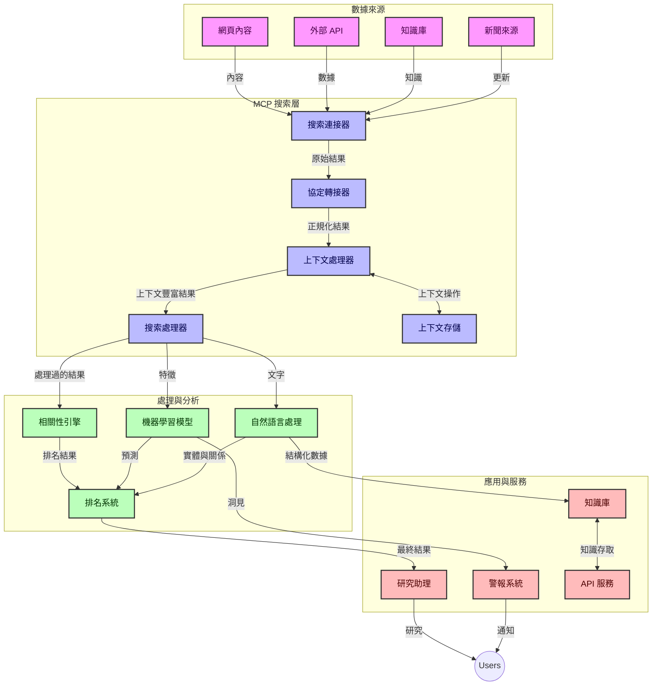
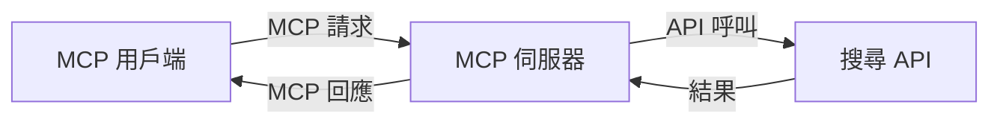
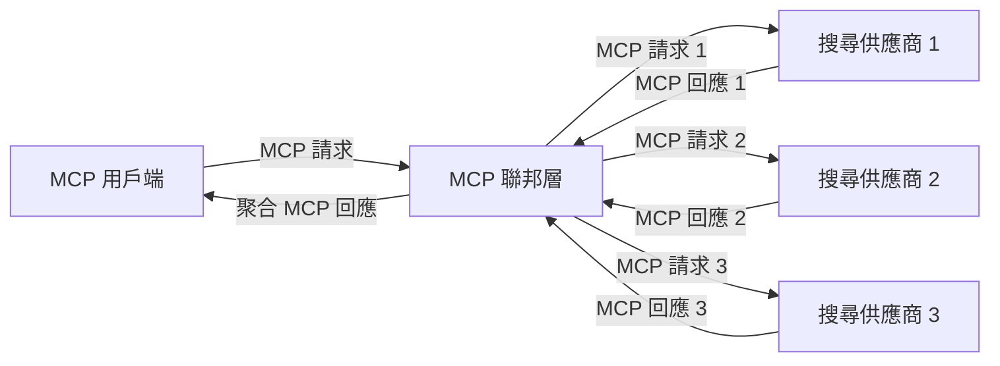
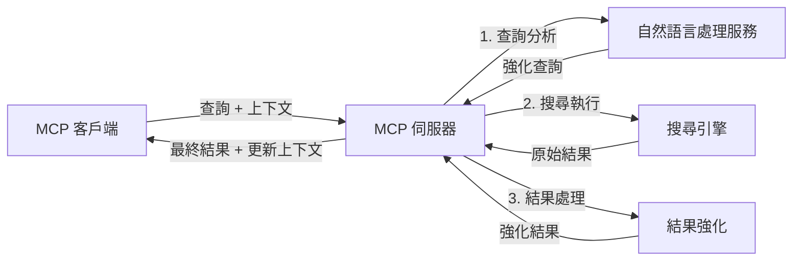

# 即時網絡搜索的模型上下文協議

## 概述

即時網絡搜索在當今以資訊為驅動的環境中變得至關重要，應用程式需要即時獲取互聯網上最新的資訊，以提供相關且及時的回應。模型上下文協議（MCP）代表了優化這些即時搜索過程的重要進展，提升搜索效率、維持上下文完整性，並改善整體系統性能。

本模組探討 MCP 如何通過為 AI 模型、搜索引擎和應用程式提供標準化的上下文管理方法，改變即時網絡搜索。

### 您將學到的內容

在這本全面指南中，您將發現：

- MCP 如何在 AI 模型與即時網絡搜索能力之間建立無縫橋樑
- 使用 MCP 實現高效且可擴展搜索解決方案的架構模式
- 跨多次查詢和互動保持搜索上下文的技術
- 在各種搜索場景中使用 Python 和 JavaScript 的實踐程式碼實現
- 平衡 MCP 驅動的搜索系統中相關性、新鮮度與性能的方法

## 即時網絡搜索簡介

即時網絡搜索是一種技術方法，使系統能夠在網絡信息發布或更新時，持續查詢、處理和分析，從而以極低延遲提供新鮮且相關的信息。與依賴可能是數小時或數天前索引數據的傳統搜索系統不同，即時搜索處理網絡中的實時數據，提供反映網上內容當前狀態的洞見和資訊。

### 即時網絡搜索的核心概念：

- <strong>持續查詢處理</strong>：對不斷更新的數據源進行搜索查詢處理
- <strong>新鮮度優先</strong>：系統設計優先處理最新資訊
- <strong>相關性平衡</strong>：保持相關性與新鮮度的平衡
- <strong>可擴展架構</strong>：系統需處理變動的查詢負載和數據量
- <strong>上下文理解</strong>：跨搜索迭代保持使用者上下文對於意義結果至關重要
- <strong>動態查詢重構</strong>：根據上下文和先前結果自適應修改查詢
- <strong>多源整合</strong>：結合多個搜索供應商和網絡來源的結果
- <strong>語義理解</strong>：基於含義而非僅關鍵字處理查詢和內容
- <strong>即時排名</strong>：隨著新資訊出現，持續調整結果排名

### 模型上下文協議與即時網絡搜索

模型上下文協議（MCP）解決了即時網絡搜索環境中的幾個關鍵挑戰：

1. <strong>搜索上下文保存</strong>：MCP 標準化了在分布式搜索組件間維護上下文的方法，確保 AI 模型和處理節點可存取相關查詢歷史和使用者偏好。

2. <strong>高效查詢管理</strong>：通過提供結構化的上下文傳輸機制，MCP 減少了每次搜索迭代中 重複上下文的開銷。

3. <strong>互操作性</strong>：MCP 建立了在多樣搜索技術和 AI 模型間共享上下文的通用語言，使架構更靈活及可擴展。

4. <strong>搜索優化上下文</strong>：MCP 實現可優先調整對有效搜索最重要的上下文元素，優化性能及準確性。

5. <strong>自適應搜索處理</strong>：通過 MCP 的適當上下文管理，搜索系統能根據變化的使用者需求和信息環境，動態調整處理流程。

在從新聞聚合到研究助手的現代應用中，MCP 與網絡搜索技術整合，促成更智能、上下文感知的搜索，隨著使用者互動持續，提供愈來愈相關的結果。

## 學習目標

在本課程結束時，您將能夠：

- 理解即時網絡搜索的基本原理及其在現代應用中的挑戰
- 解釋模型上下文協議（MCP）如何增強即時網絡搜索能力
- 使用流行框架和 API 實現基於 MCP 的搜索解決方案
- 設計並部署具可擴展性和高性能的 MCP 搜索架構
- 將 MCP 概念應用於語義搜索、研究協助及 AI 輔助瀏覽等多種使用案例
- 評估 MCP 基礎搜索技術的新興趨勢和未來創新
- 開發能從使用者互動中學習的上下文感知搜索系統
- 使用標準化 MCP 協議將網絡搜索能力整合進 AI 助手
- 創建多階段搜索管道，根據上下文逐步細化結果
- 優化搜索性能，同時維持全面的上下文感知

### 定義與重要性

即時網絡搜索包括持續查詢、檢索和傳送網絡資訊，延遲極低。與傳統搜索引擎定期爬行和索引網絡不同，即時搜索旨在在資訊可用時即時揭示，使用者可立即存取最新內容。

即時網絡搜索的關鍵特徵包括：

- <strong>新鮮度</strong>：優先考慮最新內容和更新
- <strong>持續處理</strong>：不斷監控新資訊
- <strong>查詢調整</strong>：根據上下文與反饋優化搜索查詢
- <strong>即時傳送</strong>：以最低延遲提供搜索結果
- <strong>上下文保留</strong>：基於先前查詢提升相關性

### 傳統網絡搜索的挑戰

傳統網絡搜索方法在應用於即時場景時面臨多項限制：

1. <strong>上下文分裂</strong>：難以跨多次查詢維護搜索上下文
2. <strong>資訊新鮮度</strong>：難以存取及優先處理最新資訊
3. <strong>整合複雜性</strong>：搜索系統與應用之間的互操作性問題
4. <strong>延遲問題</strong>：在全面搜索與響應時間要求之間取得平衡
5. <strong>相關性調整</strong>：在優先處理新鮮度時確保準確性和相關性

## 理解搜索中的模型上下文協議（MCP）

### 搜索上下文中的 MCP 是什麼？

模型上下文協議（MCP）是一種標準化的通信協議，旨在促進 AI 模型與應用之間的高效互動。在即時網絡搜索背景下，MCP 提供框架以：

- 保存查詢序列中的搜索上下文
- 標準化搜索查詢及結果格式
- 優化搜索參數和結果的傳輸
- 加強模型與搜索引擎的通信

### 核心組件與架構

MCP 即時網絡搜索架構包含若干主要組件：

1. <strong>查詢上下文處理器</strong>：管理並維護跨多次查詢的搜索上下文
2. <strong>搜索處理器</strong>：使用上下文感知技術處理接收的搜索請求
3. <strong>協議適配器</strong>：在不同搜索 API 間轉換同時保存上下文
4. <strong>上下文儲存庫</strong>：高效存取搜索歷史和偏好
5. <strong>搜索連接器</strong>：連接各種搜索引擎和網絡 API



### MCP 如何改進即時網絡搜索

MCP 通過以下方式解決傳統網絡搜索的挑戰：

- <strong>上下文連續性</strong>：維持整個搜索會話中查詢間的關聯
- <strong>優化傳輸</strong>：藉由智能上下文管理減少搜索參數冗餘
- <strong>標準化介面</strong>：為搜索組件提供一致 API
- <strong>減少延遲</strong>：透過有效的上下文處理最小化處理開銷
- <strong>增強相關性</strong>：通過保持使用者意圖跨多查詢提升搜索相關性


## 集成與實作

即時網絡搜索系統需要謹慎的架構設計與實作，以維持效能與語境完整性。模型語境協定（Model Context Protocol）提供一種標準化方法，整合 AI 模型與搜索技術，支持更先進、具語境感知的搜索流程。

### MCP 在搜索架構中的整體概覽

在即時網絡搜索環境中實作 MCP 涉及若干關鍵考量：

1. <strong>搜索語境序列化</strong>：MCP 提供高效的機制，將語境訊息編碼於搜尋請求中，確保重要語境於查詢流程中持續傳遞。此包括為搜索相關元資料優化的標準序列化格式。

2. <strong>有狀態的搜索處理</strong>：MCP 能維持一致的語境表示於多次搜索迭代中，支持更智能的有狀態處理。此對於多階段搜索流程尤為重要，可通過語境細化改善結果。

3. <strong>查詢擴充與精煉</strong>：搜索系統中 MCP 實作可基於累積的語境推動先進的查詢擴充與精煉，讓搜索階段推進時結果更相關。

4. <strong>結果快取與優先排序</strong>：透過標準化語境處理，MCP 助於管理結果快取與排序，使組件能依據不斷變化的搜尋語境調整。

5. <strong>搜索聯邦與整合</strong>：MCP 以結構化的搜索語境表示促進跨多個後端更複雜的搜索聯邦化，支持從多元來源整合更有意義的結果。

在各種搜索技術中推行 MCP 形成統一的語境管理方法，減少客製集成代碼需求，同時增強系統在搜尋查詢演進過程中維持有效語境的能力。

### MCP 在多種網絡搜索實作的應用

下述範例遵循目前 MCP 規範，聚焦於基於 JSON-RPC 的協定與不同傳輸機制。這些範例展示如何實作自訂搜索整合，同時保持與 MCP 協定的完全相容性。


<details>
<summary>Python 與通用搜索 API 的實作</summary>

```python
import asyncio
import json
import aiohttp
from typing import Dict, Any, Optional, List
from contextlib import asynccontextmanager
from collections.abc import AsyncIterator

# 匯入標準 MCP 函式庫
from mcp.client.session import ClientSession
from mcp.client.streamable_http import streamablehttp_client
from mcp.types import TextContent, CreateMessageRequestParams, CreateMessageResult
from mcp.server.fastmcp import FastMCP

# 建立一個用於網頁搜尋的 FastMCP 伺服器
search_server = FastMCP("WebSearch")

# 處理網頁搜尋操作的類別
class WebSearchHandler:
    def __init__(self, api_endpoint: str, api_key: str):
        self.api_endpoint = api_endpoint
        self.api_key = api_key
        self.session = None
        
    async def initialize(self):
        """Initialize the HTTP session"""
        self.session = aiohttp.ClientSession(
            headers={"Authorization": f"Bearer {self.api_key}"}
        )
    
    async def close(self):
        """Close the HTTP session"""
        if self.session:
            await self.session.close()
            
    async def perform_search(self, query: str, max_results: int = 5, 
                           include_domains: List[str] = None, 
                           exclude_domains: List[str] = None,
                           time_period: str = "any") -> Dict[str, Any]:
        """Perform web search using the search API"""
        # 建構搜尋參數
        search_params = {
            "q": query,
            "limit": max_results,
            "time": time_period
        }
        
        if include_domains:
            search_params["site"] = ",".join(include_domains)
            
        if exclude_domains:
            search_params["exclude_site"] = ",".join(exclude_domains)
        
        # 執行搜尋請求
        try:
            async with self.session.get(
                self.api_endpoint,
                params=search_params
            ) as response:
                if response.status != 200:
                    error_text = await response.text()
                    raise Exception(f"Search API error: {response.status} - {error_text}")
                
                search_data = await response.json()
                
                # 將特定 API 的回應轉換為標準格式
                results = []
                for item in search_data.get("results", []):
                    results.append({
                        "title": item.get("title", ""),
                        "url": item.get("url", ""),
                        "snippet": item.get("snippet", ""),
                        "date": item.get("published_date", ""),
                        "source": item.get("source", "")
                    })
                
                return {
                    "query": query,
                    "totalResults": len(results),
                    "results": results
                }
        except Exception as e:
            print(f"Search API request error: {e}")
            raise

# 初始化搜尋處理器
search_handler = WebSearchHandler(
    api_endpoint="https://api.search-service.example/search",
    api_key="your-api-key-here"
)

# 設定生命週期以管理搜尋處理器
@asyncio.asynccontextmanager
async def app_lifespan(server: FastMCP):
    """Manage application lifecycle"""
    await search_handler.initialize()
    try:
        yield {"search_handler": search_handler}
    finally:
        await search_handler.close()

# 設定伺服器的生命週期
search_server = FastMCP("WebSearch", lifespan=app_lifespan)

# 註冊一個網頁搜尋工具
@search_server.tool()
async def web_search(query: str, max_results: int = 5, 
                   include_domains: List[str] = None,
                   exclude_domains: List[str] = None,
                   time_period: str = "any") -> Dict[str, Any]:
    """
    Search the web for information
    
    Args:
        query: The search query
        max_results: Maximum number of results to return (default: 5)
        include_domains: List of domains to include in search results
        exclude_domains: List of domains to exclude from search results
        time_period: Time period for results ("day", "week", "month", "any")
        
    Returns:
        Dictionary containing search results
    """
    ctx = search_server.get_context()
    search_handler = ctx.request_context.lifespan_context["search_handler"]
    
    results = await search_handler.perform_search(
        query=query,
        max_results=max_results,
        include_domains=include_domains,
        exclude_domains=exclude_domains,
        time_period=time_period
    )
    
    return results

# 範例客戶端用法
async def client_example():
    # 使用可串流 HTTP 傳輸連接搜尋伺服器
    async with streamablehttp_client("http://localhost:8000/mcp") as (read, write, _):
        async with ClientSession(read, write) as session:
            # 初始化連線
            await session.initialize()
            
            # 呼叫 web_search 工具
            search_results = await session.call_tool(
                "web_search", 
                {
                    "query": "latest developments in AI and Model Context Protocol",
                    "max_results": 5,
                    "time_period": "day",
                    "include_domains": ["github.com", "microsoft.com"]
                }
            )
            
            print(f"Search results: {search_results}")

# 伺服器執行範例
if __name__ == "__main__":
    # 使用可串流 HTTP 傳輸執行伺服器
    search_server.run(transport="streamable-http")
```
</details> 

<details>
<summary>以瀏覽器為基礎的 JavaScript 搜索實作</summary>


```javascript
// 網頁搜尋的 MCP 服務器實作
import { McpServer, ResourceTemplate } from '@modelcontextprotocol/sdk/server/mcp.js';
import { StreamableHTTPServerTransport } from '@modelcontextprotocol/sdk/server/streamableHttp.js';
import { z } from 'zod';

// 建立一個用於網頁搜尋的 MCP 服務器
const searchServer = new McpServer({
    name: "BrowserSearch",
    description: "A server that provides web search capabilities"
});

// 搜尋服務類別
class SearchService {
    constructor(searchApiUrl, apiKey) {
        this.searchApiUrl = searchApiUrl;
        this.apiKey = apiKey;
    }

    async performSearch(parameters) {
        const {
            query = '',
            maxResults = 5,
            includeDomains = [],
            excludeDomains = [],
            timePeriod = 'any'
        } = parameters;
        
        // 使用參數構造搜尋 URL
        const url = new URL(this.searchApiUrl);
        url.searchParams.append('q', query);
        url.searchParams.append('limit', maxResults);
        url.searchParams.append('time', timePeriod);
        
        if (includeDomains.length > 0) {
            url.searchParams.append('site', includeDomains.join(','));
        }
        
        if (excludeDomains.length > 0) {
            url.searchParams.append('exclude_site', excludeDomains.join(','));
        }
        
        try {
            const response = await fetch(url.toString(), {
                method: 'GET',
                headers: {
                    'Authorization': `Bearer ${this.apiKey}`,
                    'Content-Type': 'application/json'
                }
            });
            
            if (!response.ok) {
                const errorText = await response.text();
                throw new Error(`Search API error: ${response.status} - ${errorText}`);
            }
            
            const searchData = await response.json();
            
            // 將特定 API 的回應轉換成標準格式
            const results = searchData.results?.map(item => ({
                title: item.title || '',
                url: item.url || '',
                snippet: item.snippet || '',
                date: item.published_date || '',
                source: item.source || ''
            })) || [];
            
            return {
                query,
                totalResults: results.length,
                results
            };
        } catch (error) {
            console.error('Search API request error:', error);
            throw error;
        }
    }
}

// 初始化搜尋服務
const searchService = new SearchService(
    'https://api.search-service.example/search',
    'your-api-key-here'
);

// 為服務器設置上下文提供者
searchServer.setContextProvider(() => {
    return {
        searchService
    };
});

// 註冊網頁搜尋工具
searchServer.tool({
    name: 'web_search',
    description: 'Search the web for information',
    parameters: {
        type: 'object',
        properties: {
            query: {
                type: 'string',
                description: 'The search query'
            },
            maxResults: {
                type: 'integer',
                description: 'Maximum number of results to return',
                default: 5
            },
            includeDomains: {
                type: 'array',
                items: { type: 'string' },
                description: 'List of domains to include in search results'
            },
            excludeDomains: {
                type: 'array',
                items: { type: 'string' },
                description: 'List of domains to exclude from search results'
            },
            timePeriod: {
                type: 'string',
                description: 'Time period for results',
                enum: ['day', 'week', 'month', 'any'],
                default: 'any'
            }
        },
        required: ['query']
    },
    handler: async (params, context) => {
        const { searchService } = context;
        return await searchService.performSearch(params);
    }
});

// 連接搜尋服務器的範例客戶端程式碼
import { Client } from '@modelcontextprotocol/sdk/client/index.js';
import { StreamableHTTPClientTransport } from '@modelcontextprotocol/sdk/client/streamableHttp.js';

async function connectToSearchServer() {
    // 連接到搜尋服務器
    const transport = new StreamableHTTPClientTransport(
        new URL('http://localhost:8000/mcp')
    );
    
    const client = new Client({
        name: 'search-client',
        version: '1.0.0'
    });
    
    await client.connect(transport);
    
    // 執行搜尋工具
    const searchResults = await client.callTool({
        name: 'web_search',
        arguments: {
            query: 'Model Context Protocol implementation examples',
            maxResults: 10,
            timePeriod: 'week',
            includeDomains: ['github.com', 'docs.microsoft.com']
        }
    });
    
    console.log('Search results:', searchResults);
    
    // 清理資源
    await client.disconnect();
}

// 啟動服務器
const transport = new StreamableHTTPServerTransport();
await searchServer.connect(transport);
console.log('Search server running at http://localhost:8000/mcp');

// 在另一個進程或服務器啟動後
// connectToSearchServer().catch(console.error);
```
</details> 


## 程式碼範例免責聲明

> <strong>重要提示</strong>：以下程式碼範例展示如何將模型語境協定（MCP）與網絡搜索功能整合。雖遵循官方 MCP SDK 的結構和模式，但為教育目的簡化。
> 
> 這些範例說明：
> 
> 1. **Python 實作**：FastMCP 伺服器實作，提供網絡搜索工具並連接外部搜尋 API。示範了正確的壽命週期管理、語境處理及工具實作，遵循[官方 MCP Python SDK](https://github.com/modelcontextprotocol/python-sdk)模式。伺服器採用建議的 Streamable HTTP 傳輸，已取代舊有 SSE 傳輸，適用於生產環境。
> 
> 2. **JavaScript 實作**：使用[官方 MCP TypeScript SDK](https://github.com/modelcontextprotocol/typescript-sdk) 的 FastMCP 模式，以 TypeScript/JavaScript 實作搜索伺服器，包含正確的工具定義與客戶端連接。遵循最新建議的會話管理及語境保持模式。
> 
> 這些範例在生產使用上需要增加錯誤處理、認證及特定 API 整合代碼。所示搜尋 API 端點（`https://api.search-service.example/search`）為佔位符，須替換為實際搜尋服務端點。
> 
> 關於完整實作細節及最新方法，請參閱
> [官方 MCP 規範](https://modelcontextprotocol.io/specification/2026-07-28/)
> 及 SDK 文件。

## 核心概念

### 模型語境協定（MCP）框架

基本上，模型語境協定為 AI 模型、應用與服務提供標準化交換語境的方式。在即時網絡搜索中，此框架對打造連貫的多輪搜尋體驗至關重要。主要組件包括：

1. **客戶端－伺服器架構**：MCP 建立搜尋客戶端（請求方）與搜尋伺服器（提供方）之間的明確分工，支持彈性部署模型。

2. **JSON-RPC 通訊**：協定使用 JSON-RPC 作訊息交換，使其與網絡技術相容且跨平台易於實作。

3. <strong>語境管理</strong>：MCP 定義組織化方法以維護、更新及利用搜索過程中的多輪語境。

4. <strong>工具定義</strong>：搜尋功能以標準化工具展示，擁有明確的參數與返回值定義。

5. <strong>串流支援</strong>：協定支持串流結果，對於可能逐步返回結果的即時搜索至關重要。

### 網絡搜索整合模式

整合 MCP 與網絡搜索時，出現數種常見模式：

#### 1. 直接搜索提供者整合



此模式中，MCP 伺服器直接介面一個或多個搜索 API，將 MCP 請求轉換為特定 API 調用，並格式化結果為 MCP 回應。

#### 2. 保持語境的聯邦搜索



此模式將搜索查詢分散至多個 MCP 相容的搜索提供者，可能各自專精不同內容或搜索能力，同時維持統一語境。

#### 3. 語境強化的搜索鏈



此模式中，搜索流程分為多階段，每步豐富語境，產生逐步更相關的結果。

### 搜索語境組件

在基於 MCP 的網絡搜索中，語境典型包含：

- <strong>查詢歷史</strong>：會話中的先前搜索查詢
- <strong>用戶偏好</strong>：語言、地區、安全搜索設置
- <strong>互動歷史</strong>：點擊結果、在結果頁面的停留時間
- <strong>搜索參數</strong>：篩選條件、排序方式及其他修改器
- <strong>領域知識</strong>：與搜索相關的特定主題語境
- <strong>時間語境</strong>：基於時間的相關性因素
- <strong>來源偏好</strong>：值得信賴或優先的信息來源

## 用例與應用

### 研究與資訊蒐集

MCP 通過以下方式強化研究工作流程：

- 在搜索會話中保存研究語境
- 支持更複雜且具語境相關性的查詢
- 支援多來源的搜索聯邦
- 促進從搜索結果中萃取知識

### 即時新聞與趨勢監控

基於 MCP 的搜索於新聞監控方面提供優勢：

- 近實時發掘新興新聞事件
- 基於語境過濾相關資訊
- 在多個來源追蹤主題與實體
- 根據用戶語境推送個人化新聞提醒

### AI 強化的瀏覽與研究

MCP 為 AI 強化瀏覽創造新可能：

- 根據當前瀏覽活動提供語境化搜尋建議
- 無縫整合網絡搜索與大型語言模型助手
- 維持語境的多輪搜索精煉
- 強化事實查核與資訊驗證

## 未來趨勢與創新

### 網絡搜索中 MCP 的演變

展望未來，我們預期 MCP 將發展以因應：


- <strong>多模態搜尋</strong>：整合文字、圖像、音頻和影片搜尋並保留上下文
- <strong>去中心化搜尋</strong>：支持分散式及聯邦搜尋生態系統
- <strong>搜尋隱私</strong>：具上下文感知的隱私保護搜尋機制
- <strong>查詢理解</strong>：自然語言搜尋查詢的深層語意解析

### 技術潛在進展

將塑造 MCP 搜尋未來的新興技術：

1. <strong>神經搜尋架構</strong>：為 MCP 優化的嵌入式搜索系統
2. <strong>個人化搜尋上下文</strong>：學習個別用戶的搜尋模式
3. <strong>知識圖譜整合</strong>：透過特定領域知識圖譜加強語境搜尋
4. <strong>跨模態上下文</strong>：維持不同搜尋模態間的上下文

## 實作練習

### 練習 1：建立基礎 MCP 搜尋流程

在本練習中，您將學習如何：
- 設定基礎 MCP 搜尋環境
- 實作網路搜尋的上下文處理器
- 測試及驗證搜尋過程中的上下文保存

### 練習 2：利用 MCP 搜尋打造研究助理

建立完整應用，包含：
- 處理自然語言研究問題
- 執行具上下文感知的網路搜尋
- 從多個來源綜合資訊
- 呈現有組織的研究成果

### 練習 3：運用 MCP 實現多源搜尋聯邦

進階練習涵蓋：
- 具上下文感知的多搜尋引擎查詢派發
- 結果排名與彙整
- 搜尋結果的上下文去重複
- 處理來源特定的元資料

## 附加資源

- [Model Context Protocol 規範](https://modelcontextprotocol.io/specification/2026-07-28/) - 官方 MCP 規範和詳細協定文件
- [Model Context Protocol 文件](https://modelcontextprotocol.io/) - 詳細教學和實作指引
- [MCP Python SDK](https://github.com/modelcontextprotocol/python-sdk) - MCP 協定官方 Python 實作
- [MCP TypeScript SDK](https://github.com/modelcontextprotocol/typescript-sdk) - MCP 協定官方 TypeScript 實作
- [MCP 參考伺服器](https://github.com/modelcontextprotocol/servers) - MCP 伺服器參考實作
- [Bing 網頁搜尋 API 文件](https://learn.microsoft.com/en-us/bing/search-apis/bing-web-search/overview) - 微軟網頁搜尋 API
- [Google 自訂搜尋 JSON API](https://developers.google.com/custom-search/v1/overview) - Google 可程式化搜尋引擎
- [SerpAPI 文件](https://serpapi.com/search-api) - 搜尋引擎結果頁 API
- [Meilisearch 文件](https://www.meilisearch.com/docs) - 開源搜尋引擎
- [Elasticsearch 文件](https://www.elastic.co/guide/index.html) - 分散式搜尋與分析引擎
- [LangChain 文件](https://python.langchain.com/docs/get_started/introduction) - 使用大型語言模型建置應用

## 學習成果

完成本單元後，您將能夠：

- 理解即時網路搜尋的基礎和挑戰
- 解釋 Model Context Protocol (MCP) 如何強化即時網路搜尋功能
- 運用熱門框架和 API 實作基於 MCP 的搜尋解決方案
- 設計並部署可擴展、高效能的 MCP 搜尋架構
- 將 MCP 概念應用於語意搜尋、研究助理及 AI 增強瀏覽等多種使用場景
- 評估 MCP 搜尋技術的新趨勢與未來創新


### 信任與安全考量

實作基於 MCP 的網路搜尋解決方案時，請遵循 MCP 規範中的重要原則：

1. <strong>用戶同意與控制</strong>：用戶必須明確同意並理解所有資料存取與操作。這對於可能存取外部資料源的網路搜尋實作尤為重要。

2. <strong>資料隱私</strong>：確保搜尋查詢及結果的適當處理，尤其是可能包含敏感資訊時。實施適當的存取控制以保護用戶資料。

3. <strong>工具安全</strong>：對搜尋工具實施適當授權及驗證，因工具可能通過任意程式碼執行構成安全風險。除非來自可信伺服器，應視工具行為描述為不可信。

4. <strong>清楚文檔</strong>：根據 MCP 規範的實作指南，提供清楚說明您的 MCP 搜尋實作的能力、限制及安全考量的文檔。

5. <strong>完善同意流程</strong>：建立完善的同意與授權流程，明確說明每個工具作用，尤其是涉及外部網路資源的工具，方可授權使用。

有關 MCP 安全與信任考量的完整細節，請參閱
[官方文件](https://modelcontextprotocol.io/specification/2026-07-28/basic/security_best_practices)。

## 接下來的步驟

- [5.12 Entra ID 身份驗證用於 Model Context Protocol 伺服器](../mcp-security-entra/README.md)

---

<!-- CO-OP TRANSLATOR DISCLAIMER START -->
**免責聲明**：
本文件使用 AI 翻譯服務 [Co-op Translator](https://github.com/Azure/co-op-translator) 進行翻譯。雖然我們力求準確，但請注意，自動翻譯可能包含錯誤或不準確之處。原始文件的母語版本應被視為權威來源。對於重要資訊，建議尋求專業人工翻譯。我們不對因使用本翻譯而引起的任何誤解或曲解承擔責任。
<!-- CO-OP TRANSLATOR DISCLAIMER END -->