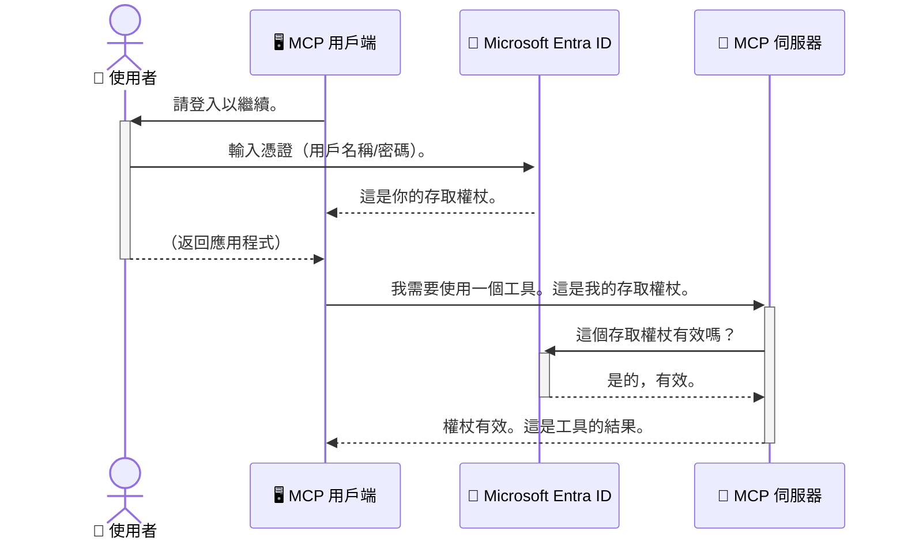

# 保護 AI 工作流程：Entra ID 認證用於模型上下文協議服務器

> [!NOTE]
> 本課程中的遠端伺服器代碼保護舊版的 `/sse` 和 `/message`
> 端點，並針對 MCP `2025-11-25`。請保持其身份識別和令牌驗證
> 作法，但對於新的實作，請使用與 `2026-07-28` 相容的可串流 HTTP 傳輸。


## 簡介
保護您的模型上下文協議（MCP）伺服器就像鎖好您家門口的前門一樣重要。若讓您的 MCP 伺服器開放，將會使您的工具和數據遭遇未經授權的存取，進而造成安全漏洞。Microsoft Entra ID 提供一個強大的雲端身份和存取管理解決方案，幫助確保只有授權的使用者與應用程式能與您的 MCP 伺服器互動。在本節中，您將學習如何使用 Entra ID 認證保護您的 AI 工作流程。

## 學習目標
到本節結束後，您將能夠：

- 理解保護 MCP 伺服器的重要性。
- 解釋 Microsoft Entra ID 和 OAuth 2.0 認證的基本概念。
- 辨識公開用戶端與機密用戶端的差異。
- 在本地（公開用戶端）及遠端（機密用戶端）MCP 伺服器場景中實作 Entra ID 認證。
- 在開發 AI 工作流程時應用安全最佳實務。

## 安全性與 MCP

就如同您不會把家門敞開不鎖一樣，您也不應把 MCP 伺服器開放給任何人進入。保護您的 AI 工作流程是打造穩健、可信且安全應用的關鍵。本章將介紹如何使用 Microsoft Entra ID 來保護您的 MCP 伺服器，確保只有授權的使用者和應用程式能與您的工具和數據互動。

## 為什麼 MCP 伺服器的安全性很重要

想像您的 MCP 伺服器具有可發送電子郵件或存取客戶資料庫的工具。若伺服器未經保護，任何人都有可能使用該工具，導致未經授權的資料存取、垃圾郵件或其他惡意行為。

透過實作認證，您能確保每一個對伺服器的請求都經過驗證，以確認發出請求的使用者或應用程式的身份。這是保護 AI 工作流程最重要的首要步驟。

## Microsoft Entra ID 簡介

[**Microsoft Entra ID**](https://adoption.microsoft.com/microsoft-security/entra/) 是一個雲端的身份及存取管理服務。您可以把它想像成您的應用程式的通用保全人員。它處理驗證使用者身份（認證）和決定使用者權限（授權）的複雜流程。

透過使用 Entra ID，您能夠：

- 啟用安全的使用者登入。
- 保護 API 與服務。
- 從中央位置管理存取政策。

對於 MCP 伺服器，Entra ID 提供一個強大且廣泛信賴的解決方案，幫助管理誰能存取伺服器的功能。

---

## 理解原理：Entra ID 認證如何運作

Entra ID 使用開放標準如 **OAuth 2.0** 來處理認證。雖然細節可能複雜，但核心概念很簡單，可以用比喻來理解。

### OAuth 2.0 溫和入門：代客鑰匙

把 OAuth 2.0 想像成一種代客泊車服務。當您抵達餐廳時，您不會把主鑰匙交給代客泊車人員，而是給予一把 <strong>有限權限的代客鑰匙</strong>——能啟動車輛並鎖門，但無法打開後車箱或手套箱。

在這個比喻中：

- <strong>您</strong> 是 <strong>使用者</strong>。
- <strong>您的車</strong> 是擁有寶貴工具和數據的 **MCP 伺服器**。
- <strong>代客泊車人</strong> 是 **Microsoft Entra ID**。
- <strong>停車場服務員</strong> 是 **MCP 用戶端**（嘗試存取伺服器的應用程式）。
- <strong>代客鑰匙</strong> 是 <strong>存取令牌</strong>。

存取令牌是一串安全的文字，使用者登入後由 Entra ID 發給 MCP 用戶端。用戶端每次送出請求時會攜帶此令牌。伺服器可以驗證令牌來確認請求的合法性和該用戶端是否擁有所需權限，且完全不需要處理您的實際憑證（例如密碼）。

### 認證流程

實際流程如下：



### 介紹 Microsoft Authentication Library (MSAL)

在進入程式碼之前，重要的是先介紹範例中會看到的主要元件：**Microsoft Authentication Library (MSAL)**。

MSAL 是微軟開發的函式庫，讓開發者輕鬆處理認證流程。不需自行撰寫複雜的程式碼來管理安全令牌、登入流程或會話續期，MSAL 會幫您搞定這些繁重的部分。

推薦使用 MSAL 函式庫，原因如下：

- **安全可靠：** 它實作業界標準協議與安全最佳實務，降低程式碼出現漏洞的風險。
- **簡化開發：** 抽象化 OAuth 2.0 和 OpenID Connect 協議的複雜性，讓您僅需幾行程式碼即可將強大的認證功能加入應用程式。
- **持續維護：** 微軟積極維護並更新 MSAL，應對新的安全威脅與平台變更。

MSAL 支援多種語言和應用框架，包括 .NET、JavaScript/TypeScript、Python、Java、Go，以及行動平台如 iOS 和 Android。這表示您可以在整個技術堆疊中使用一致的認證模式。

欲了解更多 MSAL 資訊，請參考官方的 [MSAL 概述文件](https://learn.microsoft.com/entra/identity-platform/msal-overview)。

---

## 使用 Entra ID 保護您的 MCP 伺服器：逐步指南

現在，我們將示範如何使用 Entra ID 來保護本地 MCP 伺服器（透過 `stdio` 通訊）。此範例使用 <strong>公開用戶端</strong>，適合在使用者裝置上運行的應用，如桌面應用或本地開發伺服器。

### 情境一：保護本地 MCP 伺服器（使用公開用戶端）

在此情境中，我們會看一個在本地運行、透過 `stdio` 通訊的 MCP 伺服器，使用 Entra ID 對使用者進行認證，方可使用伺服器上的工具。伺服器有一個工具用來從 Microsoft Graph API 取得使用者的個人資料資訊。

#### 1. 在 Entra ID 註冊應用程式

撰寫程式碼前，需要在 Microsoft Entra ID 中註冊您的應用。這告訴 Entra ID 有關您的應用並授權它使用認證服務。

1. 前往 **[Microsoft Entra 入口網站](https://entra.microsoft.com/)**。
2. 到 <strong>應用程式註冊</strong>，點擊 <strong>新增註冊</strong>。
3. 為您的應用命名（例如「我的本地 MCP 伺服器」）。
4. 在 <strong>支援的帳戶類型</strong> 選擇 <strong>僅此組織目錄中的帳戶</strong>。
5. 本範例中可將 **重新導向 URI** 留空。
6. 點擊 <strong>註冊</strong>。

註冊完成後，請記下 **應用程式（用戶端）ID** 和 **目錄（租戶）ID**，將在程式碼中使用。

#### 2. 程式碼解析

讓我們看負責認證的程式碼重點。完整範例程式碼可參考 [mcp-auth-servers GitHub 倉庫](https://github.com/Azure-Samples/mcp-auth-servers) 中的 [Entra ID - Local - WAM](https://github.com/Azure-Samples/mcp-auth-servers/tree/main/src/entra-id-local-wam) 資料夾。

**`AuthenticationService.cs`**

這個類別負責與 Entra ID 互動。

- **`CreateAsync`**：此方法初始化 MSAL（Microsoft Authentication Library）的 `PublicClientApplication`，並以您的應用 `clientId` 和 `tenantId` 設定。
- **`WithBroker`**：啟用使用代理服務（如 Windows Web Account Manager），提供更安全且無縫的單一登入體驗。
- **`AcquireTokenAsync`**：此為核心方法，會先嘗試靜默取得令牌（若已有有效會話，使用者就不需要再次登入）。若靜默取得失敗，則會互動提示使用者登入。

```csharp
// Simplified for clarity
public static async Task<AuthenticationService> CreateAsync(ILogger<AuthenticationService> logger)
{
    var msalClient = PublicClientApplicationBuilder
        .Create(_clientId) // Your Application (client) ID
        .WithAuthority(AadAuthorityAudience.AzureAdMyOrg)
        .WithTenantId(_tenantId) // Your Directory (tenant) ID
        .WithBroker(new BrokerOptions(BrokerOptions.OperatingSystems.Windows))
        .Build();

    // ... cache registration ...

    return new AuthenticationService(logger, msalClient);
}

public async Task<string> AcquireTokenAsync()
{
    try
    {
        // Try silent authentication first
        var accounts = await _msalClient.GetAccountsAsync();
        var account = accounts.FirstOrDefault();

        AuthenticationResult? result = null;

        if (account != null)
        {
            result = await _msalClient.AcquireTokenSilent(_scopes, account).ExecuteAsync();
        }
        else
        {
            // If no account, or silent fails, go interactive
            result = await _msalClient.AcquireTokenInteractive(_scopes).ExecuteAsync();
        }

        return result.AccessToken;
    }
    catch (Exception ex)
    {
        _logger.LogError(ex, "An error occurred while acquiring the token.");
        throw; // Optionally rethrow the exception for higher-level handling
    }
}
```

**`Program.cs`**

這裡是 MCP 伺服器設置及認證服務整合的地方。

- **`AddSingleton<AuthenticationService>`**：將 `AuthenticationService` 註冊在依賴注入容器中，讓應用其他部分（如我們的工具）可使用。
- **`GetUserDetailsFromGraph` 工具**：這個工具需要 `AuthenticationService` 實例，呼叫 `authService.AcquireTokenAsync()` 先取得有效存取令牌。認證成功後，使用該令牌呼叫 Microsoft Graph API 取得使用者資訊。

```csharp
// Simplified for clarity
[McpServerTool(Name = "GetUserDetailsFromGraph")]
public static async Task<string> GetUserDetailsFromGraph(
    AuthenticationService authService)
{
    try
    {
        // This will trigger the authentication flow
        var accessToken = await authService.AcquireTokenAsync();

        // Use the token to create a GraphServiceClient
        var graphClient = new GraphServiceClient(
            new BaseBearerTokenAuthenticationProvider(new TokenProvider(authService)));

        var user = await graphClient.Me.GetAsync();

        return System.Text.Json.JsonSerializer.Serialize(user);
    }
    catch (Exception ex)
    {
        return $"Error: {ex.Message}";
    }
}
```

#### 3. 協同運作流程

1. MCP 用戶端嘗試使用 `GetUserDetailsFromGraph` 工具，工具先呼叫 `AcquireTokenAsync`。
2. `AcquireTokenAsync` 觸發 MSAL 函式庫檢查有效令牌。
3. 若未找到令牌，MSAL 透過代理服務提示使用者使用 Entra ID 帳戶登入。
4. 使用者登入後，Entra ID 發出存取令牌。
5. 工具獲得令牌並用以安全地呼叫 Microsoft Graph API。
6. 使用者詳細資料返回給 MCP 用戶端。

該過程確保只有已認證的使用者能使用此工具，達成對本地 MCP 伺服器的有效保護。

### 情境二：保護遠端 MCP 伺服器（使用機密用戶端）

若 MCP 伺服器運行於遠端裝置（如雲端伺服器）且透過 HTTP Streaming 協議通訊，安全需求會不同。此時應使用 <strong>機密用戶端</strong> 和 <strong>授權碼流程</strong>，此流程較安全，因為應用的密鑰不會暴露在瀏覽器。

本範例採用 TypeScript 為基礎的 MCP 伺服器，使用 Express.js 來處理 HTTP 請求。

#### 1. 在 Entra ID 註冊應用程式

Entra ID 的設定與公開用戶端相似，但有一個重要差異：需建立 <strong>用戶端密鑰</strong>。

1. 前往 **[Microsoft Entra 入口網站](https://entra.microsoft.com/)**。
2. 在您的應用程式註冊頁面，切換到 <strong>憑證與密鑰</strong>（Certificates & secrets）標籤。
3. 點擊 <strong>新增用戶端密鑰</strong>，填寫描述，然後點擊 <strong>新增</strong>。
4. **重要提示：** 請立即複製密鑰值，日後將無法再查看。
5. 同時需要設定 **重新導向 URI**，至 <strong>認證</strong>（Authentication）標籤頁，點擊 <strong>新增平台</strong>，選擇 **Web**，然後輸入您的應用程式重導向 URI（例如 `http://localhost:3001/auth/callback`）。

> **⚠️ 重要安全提示：** 對於生產環境應用，微軟強烈建議使用 <strong>無密鑰認證</strong> 方法，例如 <strong>受管身份</strong>（Managed Identity）或 <strong>工作負載身份聯合</strong>（Workload Identity Federation），而非用戶端密鑰。用戶端密鑰存在暴露或外洩風險。受管身份透過消除在程式碼或設定中儲存憑證的需要，提供更安全的方案。
>
> 想了解更多關於受管身份及其實作方式，請參考 [Azure 資源的受管身份概述](https://learn.microsoft.com/entra/identity/managed-identities-azure-resources/overview)。

#### 2. 程式碼解析

本範例採用基於會話的方式。當使用者完成認證後，伺服器將存取令牌與續期令牌存入會話，並授予使用者會話令牌。此會話令牌用於後續請求。完整程式碼可參考 [mcp-auth-servers GitHub 倉庫](https://github.com/Azure-Samples/mcp-auth-servers) 的 [Entra ID - Confidential client](https://github.com/Azure-Samples/mcp-auth-servers/tree/main/src/entra-id-cca-session) 資料夾。

**`Server.ts`**

本檔案設置 Express 伺服器與 MCP 傳輸層。

- **`requireBearerAuth`**：這是中介軟體，用來保護 `/sse` 和 `/message` 端點，檢查請求中 `Authorization` 標頭的有效承載令牌。
- **`EntraIdServerAuthProvider`**：自訂類別，實作 `McpServerAuthorizationProvider` 介面，負責處理 OAuth 2.0 流程。
- **`/auth/callback`**：此端點處理使用者完成 Entra ID 認證後的重定向，交換授權碼以取得存取令牌及續期令牌。

```typescript
// 簡化以提高清晰度
const app = express();
const { server } = createServer();
const provider = new EntraIdServerAuthProvider();

// 保護 SSE 端點
app.get("/sse", requireBearerAuth({
  provider,
  requiredScopes: ["User.Read"]
}), async (req, res) => {
  // ... 連接到傳輸 ...
});

// 保護訊息端點
app.post("/message", requireBearerAuth({
  provider,
  requiredScopes: ["User.Read"]
}), async (req, res) => {
  // ... 處理訊息 ...
});

// 處理 OAuth 2.0 回調
app.get("/auth/callback", (req, res) => {
  provider.handleCallback(req.query.code, req.query.state)
    .then(result => {
      // ... 處理成功或失敗 ...
    });
});
```

**`Tools.ts`**

本檔案定義 MCP 伺服器提供的工具。`getUserDetails` 工具類似前一個範例，但透過會話取得存取令牌。

```typescript
// 簡化以提高清晰度
server.setRequestHandler(CallToolRequestSchema, async (request) => {
  const { name } = request.params;
  const context = request.params?.context as { token?: string } | undefined;
  const sessionToken = context?.token;

  if (name === ToolName.GET_USER_DETAILS) {
    if (!sessionToken) {
      throw new AuthenticationError("Authentication token is missing or invalid. Ensure the token is provided in the request context.");
    }

    // 從會話儲存取獲取 Entra ID 令牌
    const tokenData = tokenStore.getToken(sessionToken);
    const entraIdToken = tokenData.accessToken;

    const graphClient = Client.init({
      authProvider: (done) => {
        done(null, entraIdToken);
      }
    });

    const user = await graphClient.api('/me').get();

    // ... 返回使用者詳細資料 ...
  }
});
```

**`auth/EntraIdServerAuthProvider.ts`**

此類別負責：

- 將使用者導向 Entra ID 登入頁面。
- 用授權碼交換存取令牌。
- 將令牌存入 `tokenStore`。
- 當存取令牌過期時，執行續期。


#### 3. 整體運作方式

1. 當使用者首次嘗試連接 MCP 伺服器時，`requireBearerAuth` 中介軟體會看到他們沒有有效的會話，並將他們重新導向至 Entra ID 登入頁面。
2. 使用者使用其 Entra ID 帳戶登入。
3. Entra ID 將使用者重定向回 `/auth/callback` 端點，並附帶授權碼。
4. 伺服器使用該授權碼交換取得存取權杖與重新整理權杖，將它們儲存，並建立一個會話權杖回傳給用戶端。
5. 用戶端現在可以在之後所有對 MCP 伺服器的請求中，於 `Authorization` 標頭中使用此會話權杖。
6. 當呼叫 `getUserDetails` 工具時，它會用會話權杖查詢 Entra ID 存取權杖，然後使用該權杖呼叫 Microsoft Graph API。

這個流程比公共用戶端流程較複雜，但對於面向網際網路的端點是必須的。因為遠端 MCP 伺服器可被公開網際網路存取，所以需要更嚴格的安全措施以防止未授權存取及潛在攻擊。


## 安全最佳實務

- **始終使用 HTTPS**：加密用戶端與伺服器間的通訊，以保護權杖不被攔截。
- **實作基於角色的存取控制（RBAC）**：不要只檢查使用者是否已驗證；還要檢查他們被授權執行什麼。您可以在 Entra ID 中定義角色，並在 MCP 伺服器中檢查這些角色。
- <strong>監控與稽核</strong>：記錄所有驗證事件以便偵測並回應可疑活動。
- <strong>處理速率限制與節流</strong>：Microsoft Graph 與其他 API 實作速率限制以防止濫用。在 MCP 伺服器中實作指數回退與重試邏輯，以優雅地處理 HTTP 429（請求過多）回應。考慮快取經常存取的資料以減少 API 呼叫。
- <strong>安全儲存權杖</strong>：安全儲存存取權杖與重新整理權杖。對於本地應用程式，使用系統的安全儲存機制；對伺服器應用程式，考慮使用加密存儲或像 Azure Key Vault 這類安全金鑰管理服務。
- <strong>權杖過期處理</strong>：存取權杖的有效期限有限。利用重新整理權杖實作自動權杖更新，以保持無縫使用者體驗而不需重新驗證。
- **考慮使用 Azure API Management**：雖然直接在 MCP 伺服器中實作安全措施能提供細緻的控制，但像 Azure API Management 這類 API 閘道可以自動處理許多安全事項，包括驗證、授權、速率限制與監控。它們提供客戶端與 MCP 伺服器之間的集中安全層。詳情請參考本篇文章 [Azure API Management Your Auth Gateway For MCP Servers](https://techcommunity.microsoft.com/blog/integrationsonazureblog/azure-api-management-your-auth-gateway-for-mcp-servers/4402690)。


## 主要重點

- 保護您的 MCP 伺服器對於保障資料與工具安全至關重要。
- Microsoft Entra ID 提供強大且可擴充的驗證與授權解決方案。
- 當您開發本地應用程式使用 <strong>公共用戶端</strong>，遠端伺服器使用 <strong>機密用戶端</strong>。
- <strong>授權碼流程</strong> 是 Web 應用程式最安全的選擇。


## 練習

1. 想想你可能會建立的 MCP 伺服器。它會是一個本地伺服器還是遠端伺服器？
2. 根據你的回答，你會使用公共用戶端還是機密用戶端？
3. 你的 MCP 伺服器會請求什麼權限來對 Microsoft Graph 進行操作？


## 實作練習

### 練習 1：在 Entra ID 中註冊應用程式
前往 Microsoft Entra 入口網站。
為您的 MCP 伺服器註冊一個新應用程式。
記下應用程式（用戶端）ID 與目錄（租戶）ID。

### 練習 2：保護本地 MCP 伺服器（公共用戶端）
- 依照程式碼範例整合 MSAL（Microsoft Authentication Library）以進行使用者驗證。
- 通過呼叫從 Microsoft Graph 取得使用者細節的 MCP 工具來測試驗證流程。

### 練習 3：保護遠端 MCP 伺服器（機密用戶端）
- 在 Entra ID 中註冊一個機密用戶端並建立用戶端密鑰。
- 配置您的 Express.js MCP 伺服器以使用授權碼流程。
- 測試受保護的端點並確認基於權杖的存取。

### 練習 4：套用安全最佳實務
- 為您的本地或遠端伺服器啟用 HTTPS。
- 在伺服器邏輯中實作基於角色的存取控制（RBAC）。
- 新增權杖過期處理與安全權杖儲存。

## 資源

1. **MSAL 概述文件**  
   了解 Microsoft Authentication Library (MSAL) 如何跨平台提供安全的權杖擷取：  
   [MSAL Overview on Microsoft Learn](https://learn.microsoft.com/en-gb/entra/msal/overview)

2. **Azure-Samples/mcp-auth-servers GitHub 倉庫**  
   MCP 伺服器驗證流程的參考實作範例：  
   [Azure-Samples/mcp-auth-servers on GitHub](https://github.com/Azure-Samples/mcp-auth-servers)

3. **Azure 資源的管理身份概述**  
   瞭解如何透過系統或使用者指派的管理身份消除秘密資訊：  
   [Managed Identities Overview on Microsoft Learn](https://learn.microsoft.com/en-us/entra/identity/managed-identities-azure-resources/)

4. **Azure API Management：MCP 伺服器的驗證閘道**  
   深入探討使用 APIM 作為 MCP 伺服器安全 OAuth2 閘道：  
   [Azure API Management Your Auth Gateway For MCP Servers](https://techcommunity.microsoft.com/blog/integrationsonazureblog/azure-api-management-your-auth-gateway-for-mcp-servers/4402690)

5. **Microsoft Graph 權限參考**  
   Microsoft Graph 代表及應用程式權限的完整清單：  
   [Microsoft Graph Permissions Reference](https://learn.microsoft.com/zh-tw/graph/permissions-reference)


## 學習成果
完成本節後，您將能：

- 清楚說明為什麼驗證對 MCP 伺服器和 AI 工作流程至關重要。
- 為本地及遠端 MCP 伺服器場景設置與配置 Entra ID 驗證。
- 根據伺服器部署情況選擇適當的用戶端類型（公共或機密）。
- 實作安全程式設計實務，包括權杖儲存與基於角色的授權。
- 自信地保護您的 MCP 伺服器及其工具免受未授權存取。

## 下一步

- [5.13 與 Microsoft Foundry 整合的模型上下文協議 (MCP)](../mcp-foundry-agent-integration/README.md)

---

<!-- CO-OP TRANSLATOR DISCLAIMER START -->
**免責聲明**：
本文件使用 AI 翻譯服務 [Co-op Translator](https://github.com/Azure/co-op-translator) 進行翻譯。雖然我們力求準確，但請注意，自動翻譯可能包含錯誤或不準確之處。原始文件的母語版本應被視為權威來源。對於重要資訊，建議尋求專業人工翻譯。我們不對因使用本翻譯而引起的任何誤解或曲解承擔責任。
<!-- CO-OP TRANSLATOR DISCLAIMER END -->