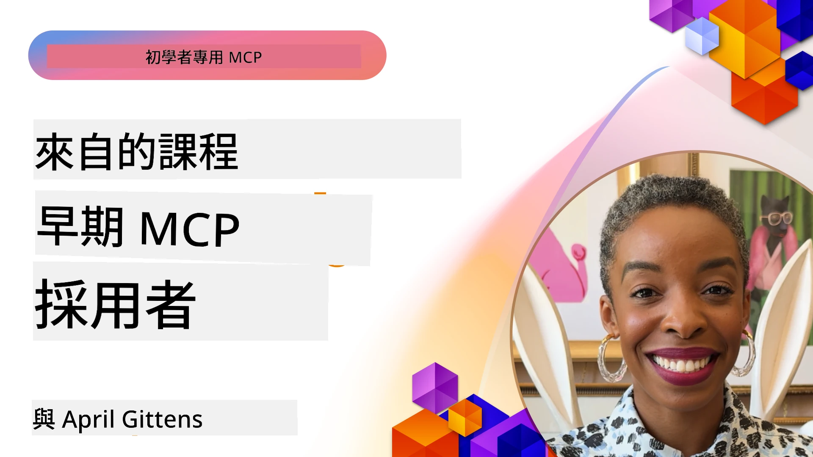

# 🌟 來自早期採用者的經驗教訓

[](https://youtu.be/jds7dSmNptE)

_(點擊上方圖片觀看本課程影片)_

## 🎯 本單元涵蓋內容

本單元探討真實組織與開發者如何利用 Model Context Protocol (MCP) 解決實際挑戰並推動創新。透過詳細案例研究、實作專案和實用範例，您將發現 MCP 如何實現安全、可擴展的 AI 整合，連接大型語言模型、工具及企業資料。

### 📚 見證 MCP 實際應用

想看看這些原則如何應用於生產就緒工具？參考我們的 [**10 個改變開發者生產力的 Microsoft MCP 伺服器**](microsoft-mcp-servers.md)，展示您今天即可使用的 Microsoft MCP 伺服器。

## 概覽

本課程探討早期採用者如何利用 Model Context Protocol (MCP) 解決真實世界挑戰並推動橫跨產業的創新。透過詳細案例研究和實作專案，您將見證 MCP 如何促成標準化、安全及可擴展的 AI 整合 —— 將大型語言模型、工具與企業資料統一連接。您將獲得設計和構建 MCP 解決方案的實務經驗，學習已證實的實作範例，並發掘部署 MCP 於生產環境的最佳實務。課程亦強調新興趨勢、未來走向以及開源資源，助您領先 MCP 技術及其不斷發展的生態系統。

## 學習目標

- 分析跨產業的真實世界 MCP 實作
- 設計及打造完整的 MCP 應用
- 探索 MCP 技術的新興趨勢與未來方向
- 在實際開發場景中應用最佳實務

## 真實世界 MCP 實作案例

### 案例研究 1：企業客服自動化

一家跨國企業實施基於 MCP 的解決方案，以標準化其客服系統中的 AI 互動。此舉助其：

- 建立多個大型語言模型供應商的統一介面
- 維護跨部門一致的提示管理
- 實施強健的安全及合規控管
- 根據特定需求輕鬆切換不同 AI 模型

**技術實作：**

```python
# 用於客戶支援的 Python MCP 服務器實現
import logging
import asyncio
from modelcontextprotocol import create_server, ServerConfig
from modelcontextprotocol.server import MCPServer
from modelcontextprotocol.transports import create_http_transport
from modelcontextprotocol.resources import ResourceDefinition
from modelcontextprotocol.prompts import PromptDefinition
from modelcontextprotocol.tool import ToolDefinition

# 配置日誌紀錄
logging.basicConfig(level=logging.INFO)

async def main():
    # 創建服務器配置
    config = ServerConfig(
        name="Enterprise Customer Support Server",
        version="1.0.0",
        description="MCP server for handling customer support inquiries"
    )
    
    # 初始化 MCP 服務器
    server = create_server(config)
    
    # 註冊知識庫資源
    server.resources.register(
        ResourceDefinition(
            name="customer_kb",
            description="Customer knowledge base documentation"
        ),
        lambda params: get_customer_documentation(params)
    )
    
    # 註冊提示範本
    server.prompts.register(
        PromptDefinition(
            name="support_template",
            description="Templates for customer support responses"
        ),
        lambda params: get_support_templates(params)
    )
    
    # 註冊支援工具
    server.tools.register(
        ToolDefinition(
            name="ticketing",
            description="Create and update support tickets"
        ),
        handle_ticketing_operations
    )
    
    # 以 HTTP 傳輸啟動服務器
    transport = create_http_transport(port=8080)
    await server.run(transport)

if __name__ == "__main__":
    asyncio.run(main())
```

**成果：** 模型成本降低 30%，回應一致性提升 45%，並強化全球業務的合規性。

### 案例研究 2：醫療診斷助手

一家醫療服務提供者開發 MCP 架構，以整合多個專業醫療 AI 模型，同時確保敏感的病患資料獲得保護：

- 在通用與專科醫療模型間無縫切換
- 嚴格的隱私控管與審計追蹤
- 與現有電子病歷系統(EHR)整合
- 醫學術語的一致提示工程

**技術實作：**

```csharp
// C# MCP host application implementation in healthcare application
using Microsoft.Extensions.DependencyInjection;
using ModelContextProtocol.SDK.Client;
using ModelContextProtocol.SDK.Security;
using ModelContextProtocol.SDK.Resources;

public class DiagnosticAssistant
{
    private readonly MCPHostClient _mcpClient;
    private readonly PatientContext _patientContext;
    
    public DiagnosticAssistant(PatientContext patientContext)
    {
        _patientContext = patientContext;
        
        // Configure MCP client with healthcare-specific settings
        var clientOptions = new ClientOptions
        {
            Name = "Healthcare Diagnostic Assistant",
            Version = "1.0.0",
            Security = new SecurityOptions
            {
                Encryption = EncryptionLevel.Medical,
                AuditEnabled = true
            }
        };
        
        _mcpClient = new MCPHostClientBuilder()
            .WithOptions(clientOptions)
            .WithTransport(new HttpTransport("https://healthcare-mcp.example.org"))
            .WithAuthentication(new HIPAACompliantAuthProvider())
            .Build();
    }
    
    public async Task<DiagnosticSuggestion> GetDiagnosticAssistance(
        string symptoms, string patientHistory)
    {
        // Create request with appropriate resources and tool access
        var resourceRequest = new ResourceRequest
        {
            Name = "patient_records",
            Parameters = new Dictionary<string, object>
            {
                ["patientId"] = _patientContext.PatientId,
                ["requestingProvider"] = _patientContext.ProviderId
            }
        };
        
        // Request diagnostic assistance using appropriate prompt
        var response = await _mcpClient.SendPromptRequestAsync(
            promptName: "diagnostic_assistance",
            parameters: new Dictionary<string, object>
            {
                ["symptoms"] = symptoms,
                patientHistory = patientHistory,
                relevantGuidelines = _patientContext.GetRelevantGuidelines()
            });
            
        return DiagnosticSuggestion.FromMCPResponse(response);
    }
}
```

**成果：** 提供更佳的醫師診斷建議，同時全面遵守 HIPAA，並大幅減少系統間的上下文切換。

### 案例研究 3：金融服務風險分析

一家金融機構使用 MCP 來標準化其跨部門的風險分析流程：

- 為信用風險、詐欺偵測及投資風險模型建立統一介面
- 實施嚴格存取控制和模型版本管理
- 確保所有 AI 建議皆可審計
- 維持多系統間一致的資料格式

**技術實作：**

```java
// 用於金融風險評估的 Java MCP 伺服器
import org.mcp.server.*;
import org.mcp.security.*;

public class FinancialRiskMCPServer {
    public static void main(String[] args) {
        // 建立具備金融合規功能的 MCP 伺服器
        MCPServer server = new MCPServerBuilder()
            .withModelProviders(
                new ModelProvider("risk-assessment-primary", new AzureOpenAIProvider()),
                new ModelProvider("risk-assessment-audit", new LocalLlamaProvider())
            )
            .withPromptTemplateDirectory("./compliance/templates")
            .withAccessControls(new SOCCompliantAccessControl())
            .withDataEncryption(EncryptionStandard.FINANCIAL_GRADE)
            .withVersionControl(true)
            .withAuditLogging(new DatabaseAuditLogger())
            .build();
            
        server.addRequestValidator(new FinancialDataValidator());
        server.addResponseFilter(new PII_RedactionFilter());
        
        server.start(9000);
        
        System.out.println("Financial Risk MCP Server running on port 9000");
    }
}
```

**成果：** 提升法規遵循，模型部署週期加快 40%，並強化跨部門風險評估一致性。

### 案例研究 4：Microsoft Playwright MCP 伺服器的瀏覽器自動化

Microsoft 開發了 [Playwright MCP 伺服器](https://github.com/microsoft/playwright-mcp)，透過 Model Context Protocol 實現安全且標準化的瀏覽器自動化。此生產就緒的伺服器允許 AI 代理和大型語言模型以受控、可審計且可擴充的方式與網頁瀏覽器互動，支援自動化網頁測試、資料擷取及端到端工作流程等用例。

> **🎯 生產就緒工具**
> 
> 本案例展示可立即使用的 MCP 伺服器！詳見我們的 [**Microsoft MCP 伺服器指南**](microsoft-mcp-servers.md#8--playwright-mcp-server)，了解 Playwright MCP 伺服器及其他 9 個生產就緒的 Microsoft MCP 伺服器。

**主要功能：**
- 將瀏覽器自動化能力（導航、表單填寫、截圖等）作為 MCP 工具暴露
- 實施嚴格存取控制和沙盒機制以防止未授權行為
- 提供所有瀏覽器互動的詳細審計日誌
- 支援與 Azure OpenAI 及其他大型語言模型供應商的代理驅動自動化整合
- 支援 GitHub Copilot 的碼農代理網頁瀏覽能力

**技術實作：**

```typescript
// TypeScript：喺MCP伺服器入面註冊Playwright瀏覽器自動化工具
import { createServer, ToolDefinition } from 'modelcontextprotocol';
import { launch } from 'playwright';

const server = createServer({
  name: 'Playwright MCP Server',
  version: '1.0.0',
  description: 'MCP server for browser automation using Playwright'
});

// 註冊一個用嚟導向URL同截取屏幕截圖嘅工具
server.tools.register(
  new ToolDefinition({
    name: 'navigate_and_screenshot',
    description: 'Navigate to a URL and capture a screenshot',
    parameters: {
      url: { type: 'string', description: 'The URL to visit' }
    }
  }),
  async ({ url }) => {
    const browser = await launch();
    const page = await browser.newPage();
    await page.goto(url);
    const screenshot = await page.screenshot();
    await browser.close();
    return { screenshot };
  }
);

// 啟動MCP伺服器
server.listen(8080);
```

**成果：**

- 為 AI 代理和大型語言模型實現安全且程式化的瀏覽器自動化
- 減少手動測試工作並提升網頁應用的測試覆蓋率
- 提供用於企業環境中基於瀏覽器工具整合的可重用且可擴充框架
- 支援 GitHub Copilot 網頁瀏覽功能

**參考資料：**

- [Playwright MCP Server GitHub 倉庫](https://github.com/microsoft/playwright-mcp)
- [Microsoft AI 與自動化解決方案](https://azure.microsoft.com/en-us/products/ai-services/)

### 案例研究 5：Azure MCP — 企業級 Model Context Protocol 即服務

Azure MCP Server ([https://aka.ms/azmcp](https://aka.ms/azmcp)) 是 Microsoft 管理的企業級 Model Context Protocol 實作，設計為提供可擴展、安全且合規的 MCP 伺服器作為雲端服務。Azure MCP 幫助組織快速部署、管理並與 Azure AI、資料及安全服務整合 MCP 伺服器，降低營運負擔並加速 AI 採用。

> **🎯 生產就緒工具**
> 
> 這是一個您今天即可使用的真實 MCP 伺服器！更多資訊請參閱我們的 [**Microsoft MCP 伺服器指南**](microsoft-mcp-servers.md)。


- 完全托管的 MCP 伺服器託管，具備內建擴展、監控與安全功能
- 原生整合 Azure OpenAI、Azure AI 搜尋及其他 Azure 服務
- 透過 Microsoft Entra ID 進行企業認證和授權
- 支援自訂工具、提示模板及資源連接器
- 遵循企業資安及法規要求

**技術實作：**

```yaml
# Example: Azure MCP server deployment configuration (YAML)
apiVersion: mcp.microsoft.com/v1
kind: McpServer
metadata:
  name: enterprise-mcp-server
spec:
  modelProviders:
    - name: azure-openai
      type: AzureOpenAI
      endpoint: https://<your-openai-resource>.openai.azure.com/
      apiKeySecret: <your-azure-keyvault-secret>
  tools:
    - name: document_search
      type: AzureAISearch
      endpoint: https://<your-search-resource>.search.windows.net/
      apiKeySecret: <your-azure-keyvault-secret>
  authentication:
    type: EntraID
    tenantId: <your-tenant-id>
  monitoring:
    enabled: true
    logAnalyticsWorkspace: <your-log-analytics-id>
```

**成果：**  
- 透過即用型且合規的 MCP 伺服器平台縮短企業 AI 項目的效益達成時間
- 簡化大型語言模型、工具及企業資料源的整合
- 增強 MCP 工作負載的安全性、可觀察性及營運效率
- 利用 Azure SDK 最佳實務與最新認證模式提升程式碼品質

**參考資料：**  
- [Azure MCP 文件](https://aka.ms/azmcp)
- [Azure MCP Server GitHub 倉庫](https://github.com/Azure/azure-mcp)
- [Azure AI 服務](https://azure.microsoft.com/en-us/products/ai-services/)
- [Microsoft MCP 中央站](https://mcp.azure.com)

## 案例研究 6：NLWeb
MCP（Model Context Protocol）是一種讓聊天機器人及 AI 助手與工具互動的新興協議。每個 NLWeb 實例同時也是 MCP 伺服器，支援一個核心方法 ask，使用自然語言詢問網站問題。回傳回應利用 schema.org，這是用於描述網頁資料的廣泛使用詞彙。粗略而言，MCP 對 NLWeb 的意義如同 HTTP 對 HTML。NLWeb 結合協議、Schema.org 格式與範例程式碼，協助網站快速創建這些端點，既惠及透過對話介面與人的互動，也支持透過自然的代理對代理交互與機器的互動。

NLWeb 包含兩個獨特組件。
- 一個協議，初期設計非常簡單，用以使用自然語言介面與網站互動，並採用 json 及 schema.org 格式回傳答案。詳情請參閱 REST API 文件。
- 一個直接實作 (1) 的方案，利用現有標記限制於可抽象成項目列表（產品、食譜、景點、評論等）的網站。結合一組使用者介面小工具，網站能輕鬆向其內容提供對話介面。詳細介紹請參閱「聊天查詢生命週期」文件，了解運作機制。
 
**參考資料：**  
- [Azure MCP 文件](https://aka.ms/azmcp)
- [NLWeb](https://github.com/microsoft/NlWeb)

### 案例研究 7：Microsoft Foundry MCP 伺服器 — 企業 AI 代理整合

Microsoft Foundry MCP 伺服器示範 MCP 在企業環境中如何用於協調與管理 AI 代理與工作流程。藉由將 MCP 與 Microsoft Foundry 整合，組織能標準化代理互動，利用 Foundry 的工作流程管理，並確保安全且可擴展的部署。

> **🎯 生產就緒工具**
> 
> 這是一個您今天即可使用的真實 MCP 伺服器！更多資訊請參閱我們的 [**Microsoft MCP 伺服器指南**](microsoft-mcp-servers.md#9--microsoft-foundry-mcp-server)。

**主要功能：**
- 全面存取 Azure AI 生態系，包括模型目錄及部署管理
- 透過 Azure AI 搜尋為 RAG 應用提供知識索引
- AI 模型效能與品質保證的評估工具
- 與 Microsoft Foundry 目錄與實驗室整合，獲取前沿研究模型
- 針對生產場景具代理管理與評估能力

**成果：**
- AI 代理工作流程的快速原型製作與穩健監控
- 與 Azure AI 服務無縫整合，應用於進階場景
- 建立、部署及監控代理流程的統一介面
- 提升企業的安全性、合規與營運效率
- 加速 AI 採用，並維持對複雜代理流程的控制

**參考資料：**
- [Microsoft Foundry MCP Server GitHub 倉庫](https://github.com/azure-ai-foundry/mcp-foundry)
- [整合 Azure AI 代理與 MCP（Microsoft Foundry 部落格）](https://devblogs.microsoft.com/foundry/integrating-azure-ai-agents-mcp/)

### 案例研究 8：Foundry MCP Playground — 實驗與原型開發

Foundry MCP Playground 提供即用環境，供開發者實驗 MCP 伺服器和 Microsoft Foundry 整合。開發者可快速原型、測試及評估 AI 模型與代理工作流程，利用 Microsoft Foundry 目錄與實驗室資源。此 Playground 簡化設定，提供範例專案，支援協作開發，讓使用者輕鬆探索最佳實務及新場景，降低入門門檻，促進 MCP 及 Microsoft Foundry 生態系統的創新與社群貢獻。

**參考資料：**

- [Foundry MCP Playground GitHub 倉庫](https://github.com/azure-ai-foundry/foundry-mcp-playground)

### 案例研究 9：Microsoft Learn Docs MCP 伺服器 — AI 驅動的文件存取

Microsoft Learn Docs MCP 伺服器是一項雲端託管服務，透過 Model Context Protocol 讓 AI 助手即時存取官方 Microsoft 文件。此生產就緒伺服器連接完整 Microsoft Learn 生態系，支援跨所有官方 Microsoft 資源的語意搜尋。

> **🎯 生產就緒工具**
> 
> 這是一個您今天即可使用的真實 MCP 伺服器！詳見我們的 [**Microsoft MCP 伺服器指南**](microsoft-mcp-servers.md#1--microsoft-learn-docs-mcp-server)。

**主要功能：**
- 即時存取官方 Microsoft 文件、Azure 文件及 Microsoft 365 文件
- 先進語意搜尋功能，理解上下文與意圖
- Microsoft Learn 內容發佈即時更新資訊
- 涵蓋 Microsoft Learn、Azure 文件和 Microsoft 365 資源
- 回傳最多 10 篇高質內容片段，附帶文章標題和網址

**重要性說明：**
- 解決 Microsoft 技術「AI 知識過時」問題
- 確保 AI 助手可存取最新 .NET、C#、Azure 和 Microsoft 365 功能
- 提供權威的第一方資訊以確保精確的程式碼生成
- 對開發快速演進 Microsoft 技術的開發者不可或缺

**成果：**
- 顯著提升 AI 生成 Microsoft 技術程式碼的準確性
- 減少搜尋最新文件與最佳實務的時間
- 透過上下文感知文件檢索提升開發者生產力
- 無需離開 IDE 即能無縫整合開發工作流程

**參考資料：**
- [Microsoft Learn Docs MCP Server GitHub 倉庫](https://github.com/MicrosoftDocs/mcp)
- [Microsoft Learn 文件](https://learn.microsoft.com/)

## 實作專案

### 專案 1：構建多供應商 MCP 伺服器

**目標：** 建立能根據特定條件路由請求至多個 AI 模型供應商的 MCP 伺服器。

**需求：**

- 支援至少三個不同模型供應商（例如 OpenAI、Anthropic、本地模型）
- 實作基於請求元資料的路由機制
- 創建管理供應商憑證的配置系統
- 新增快取以優化效能與成本
- 建立簡易儀表板以監控使用情況

**實作步驟：**

1. 設置基本 MCP 伺服器架構
2. 為每個 AI 模型服務實作供應商適配器
3. 根據請求屬性建立路由邏輯
4. 為頻繁請求加入快取機制
5. 開發監控儀表板
6. 使用不同請求模式進行測試

**技術：** 選擇 Python（.NET/Java/Python 視個人喜好）、Redis 作為快取方案，用簡易網頁框架開發儀表板。

### 專案 2：企業提示管理系統

**目標：** 開發基於 MCP 的系統，以管理、版本控制及部署組織內的提示模板。

**需求：**


- 建立一個集中式的提示模板庫
- 實施版本控制和審核工作流程
- 建立帶有樣本輸入的模板測試功能
- 開發基於角色的訪問控制
- 建立一個用於模板檢索和部署的 API

**實施步驟：**

1. 設計模板存儲的資料庫結構
2. 創建模板 CRUD 操作的核心 API
3. 實施版本控制系統
4. 建立審核工作流程
5. 開發測試框架
6. 創建簡單的管理用網頁介面
7. 與 MCP 伺服器整合

**技術：** 您可以選擇任意後端框架、SQL 或 NoSQL 資料庫，以及用於管理介面的前端框架。

### 專案 3：基於 MCP 的內容生成平台

**目標：** 建立一個利用 MCP 提供不同內容類型間一致結果的內容生成平台。

**需求：**

- 支援多種內容格式（博客文章、社交媒體、行銷文案）
- 實施工模板生成並帶有自訂選項
- 建立內容審核和反饋系統
- 追蹤內容效能指標
- 支援內容版本控制和迭代

**實施步驟：**

1. 設置 MCP 客戶端基礎設施
2. 為不同內容類型創建模板
3. 建立內容生成管道
4. 實施審核系統
5. 開發指標追蹤系統
6. 創建用於模板管理和內容生成的用戶介面

**技術：** 您偏好的程式語言、網頁框架和資料庫系統。

## MCP 技術未來發展方向

### 新興趨勢

1. **多模態 MCP**
   - 擴展 MCP 以標準化與影像、音訊及影片模型的互動
   - 發展跨模態推理能力
   - 針對不同模態的標準化提示格式

2. **聯邦 MCP 基礎設施**
   - 分散式 MCP 網絡，可於組織間共享資源
   - 用於安全模型共享的標準化協議
   - 隱私保護計算技術

3. **MCP 市場**
   - 用於分享和貨幣化 MCP 模板與外掛的生態系統
   - 品質保證與認證流程
   - 與模型市場整合

4. **用於邊緣運算的 MCP**
   - 針對資源受限邊緣裝置調整 MCP 標準
   - 優化的低頻寬環境通訊協議
   - 專門為物聯網生態系統設計的 MCP 實作

5. <strong>監管框架</strong>
   - 為符合法規開發 MCP 擴展
   - 標準化稽核軌跡與解釋介面
   - 與新興 AI 治理框架整合

### 微軟的 MCP 解決方案

微軟與 Azure 開發了數個開源庫，幫助開發者在不同情境中實作 MCP：

#### Microsoft Organization

1. [playwright-mcp](https://github.com/microsoft/playwright-mcp) - 用於瀏覽器自動化和測試的 Playwright MCP 伺服器
2. [files-mcp-server](https://github.com/microsoft/files-mcp-server) - OneDrive MCP 伺服器實作，用於本地測試和社群貢獻
3. [NLWeb](https://github.com/microsoft/NlWeb) - NLWeb 是一套開放協議集合及相關開源工具，重點在建立 AI 網路的基礎層

#### Azure-Samples Organization

1. [mcp](https://github.com/Azure-Samples/mcp) - 連結多種語言下於 Azure 上構建和整合 MCP 伺服器的示例、工具與資源
2. [mcp-auth-servers](https://github.com/Azure-Samples/mcp-auth-servers) - 展示使用當前 Model Context Protocol 規範進行驗證的參考 MCP 伺服器
3. [remote-mcp-functions](https://github.com/Azure-Samples/remote-mcp-functions) - Azure Functions 上遠端 MCP 伺服器實作的首頁，附語言專用庫連結
4. [remote-mcp-functions-python](https://github.com/Azure-Samples/remote-mcp-functions-python) - 使用 Python 於 Azure Functions 上構建及部署自訂遠端 MCP 伺服器的快速入門範本
5. [remote-mcp-functions-dotnet](https://github.com/Azure-Samples/remote-mcp-functions-dotnet) - 使用 .NET/C# 於 Azure Functions 上構建及部署自訂遠端 MCP 伺服器的快速入門範本
6. [remote-mcp-functions-typescript](https://github.com/Azure-Samples/remote-mcp-functions-typescript) - 使用 TypeScript 於 Azure Functions 上構建及部署自訂遠端 MCP 伺服器的快速入門範本
7. [remote-mcp-apim-functions-python](https://github.com/Azure-Samples/remote-mcp-apim-functions-python) - 使用 Python 的 Azure API 管理作為到遠端 MCP 伺服器的 AI 閘道
8. [AI-Gateway](https://github.com/Azure-Samples/AI-Gateway) - 包含 MCP 能力的 APIM ❤️ AI 實驗，整合 Azure OpenAI 及 AI Foundry

這些倉庫提供了多種實作、範本及資源，涵蓋不同程式語言和 Azure 服務中的 Model Context Protocol 工作，範圍包括基本伺服器實作、驗證、雲端部署及企業整合等場景。

#### MCP 資源目錄

官方微軟 MCP 倉庫中的 [MCP 資源目錄](https://github.com/microsoft/mcp/tree/main/Resources) 提供了一套精選範例資源、提示模板和工具定義集合，可用於 Model Context Protocol 伺服器。該目錄旨在幫助開發者快速啟動 MCP，提供可重用的構建模組和最佳實踐範例：

- **提示模板：** 針對常見 AI 任務及場景的現成提示模板，可調整用於您的 MCP 伺服器實作。
- **工具定義：** 範例工具架構與元數據，標準化不同 MCP 伺服器間的工具整合與調用。
- **資源範例：** MCP 框架中連接資料來源、API 及外部服務的範例資源定義。
- **參考實作：** 實際範例展示如何在真實 MCP 專案中結構化和組織資源、提示與工具。

這些資源加速開發、促進標準化，並有助於確保在構建與部署基於 MCP 的解決方案時採用最佳實踐。

#### MCP 資源目錄

- [MCP 資源（範例提示、工具和資源定義）](https://github.com/microsoft/mcp/tree/main/Resources)

### 研究機會

- MCP 框架內部的高效提示優化技術
- 多租戶 MCP 部署的安全模型
- 不同 MCP 實作間的效能基準測試
- MCP 伺服器的形式驗證方法

## 結論

Model Context Protocol (MCP) 正在迅速塑造標準化、安全且可互操作的 AI 融合未來。透過本課程中的案例研究與實作專案，您已看到早期採用者——包括微軟與 Azure——如何利用 MCP 解決真實挑戰，加速 AI 採用，並確保合規、安全及可擴展性。MCP 的模組化方法使組織能在統一、可稽核的架構中連結大型語言模型、工具與企業資料。隨著 MCP 持續演進，持續參與社群、探索開源資源並應用最佳實踐將是構建穩健、面向未來的 AI 解決方案的關鍵。

## 其他資源

- [MCP Foundry GitHub 倉庫](https://github.com/azure-ai-foundry/mcp-foundry)
- [Foundry MCP Playground](https://github.com/azure-ai-foundry/foundry-mcp-playground)
- [將 Azure AI 代理整合至 MCP（微軟 Foundry 部落格）](https://devblogs.microsoft.com/foundry/integrating-azure-ai-agents-mcp/)
- [MCP GitHub 倉庫（微軟）](https://github.com/microsoft/mcp)
- [MCP 資源目錄（範例提示、工具及資源定義）](https://github.com/microsoft/mcp/tree/main/Resources)
- [MCP 社群與文件](https://modelcontextprotocol.io/introduction)
- [MCP 規範（2026-07-28）](https://modelcontextprotocol.io/specification/2026-07-28/)
- [Azure MCP 文件](https://aka.ms/azmcp)
- [OWASP MCP 十大安全最佳實踐](https://microsoft.github.io/mcp-azure-security-guide/mcp/)
- [Playwright MCP 伺服器 GitHub 倉庫](https://github.com/microsoft/playwright-mcp)
- [Files MCP 伺服器（OneDrive）](https://github.com/microsoft/files-mcp-server)
- [Azure-Samples MCP](https://github.com/Azure-Samples/mcp)
- [MCP Auth Servers（Azure-Samples）](https://github.com/Azure-Samples/mcp-auth-servers)
- [Remote MCP Functions（Azure-Samples）](https://github.com/Azure-Samples/remote-mcp-functions)
- [Remote MCP Functions Python（Azure-Samples）](https://github.com/Azure-Samples/remote-mcp-functions-python)
- [Remote MCP Functions .NET（Azure-Samples）](https://github.com/Azure-Samples/remote-mcp-functions-dotnet)
- [Remote MCP Functions TypeScript（Azure-Samples）](https://github.com/Azure-Samples/remote-mcp-functions-typescript)
- [Remote MCP APIM Functions Python（Azure-Samples）](https://github.com/Azure-Samples/remote-mcp-apim-functions-python)
- [AI-Gateway（Azure-Samples）](https://github.com/Azure-Samples/AI-Gateway)
- [微軟 AI 與自動化解決方案](https://azure.microsoft.com/en-us/products/ai-services/)

## 練習題

1. 分析其中一個案例研究並提出替代實作方案。
2. 選擇一個專案構想並撰寫詳細技術規格。
3. 研究案例中未涵蓋的行業並概述 MCP 如何解決其特有挑戰。
4. 探索未來方向之一，構思一個新的 MCP 擴展以支持該方向。

## 接下來

探索更多：[Microsoft MCP Servers](./microsoft-mcp-servers.md)

繼續閱讀：[第 8 模組：最佳實踐](../08-BestPractices/README.md)

---

<!-- CO-OP TRANSLATOR DISCLAIMER START -->
**免責聲明**：
本文件使用 AI 翻譯服務 [Co-op Translator](https://github.com/Azure/co-op-translator) 進行翻譯。雖然我們力求準確，但請注意，自動翻譯可能包含錯誤或不準確之處。原始文件的母語版本應被視為權威來源。對於重要資訊，建議尋求專業人工翻譯。我們不對因使用本翻譯而引起的任何誤解或曲解承擔責任。
<!-- CO-OP TRANSLATOR DISCLAIMER END -->