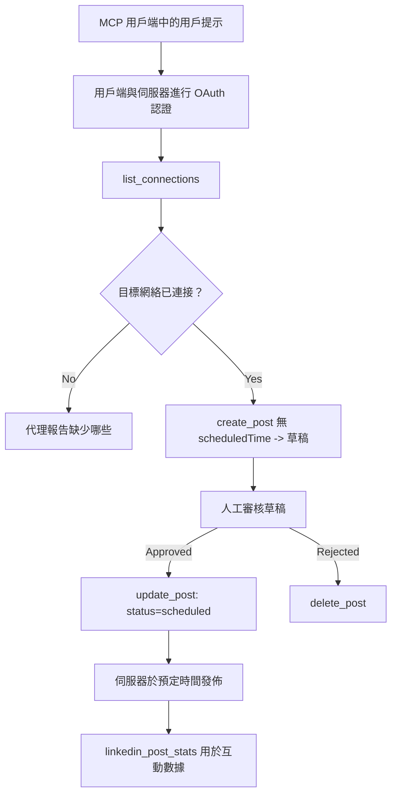

# 案例研究：從具有遠程 MCP 伺服器的代理程式發布至社交網絡

> **免責聲明：** 有多個服務和開源專案可以發佈到社交網絡，團隊亦可以直接整合各網絡的 API。以下情境作為如何設計及使用一個 **可寫入遠程 MCP 伺服器** 的範例。Publora 是一個提供免費方案的商業服務；此處描述的模式適用於任何代表使用者執行不可逆動作的 MCP 伺服器。

## 概述

代理程式擅長起草內容，卻不擅長發布。模型能在數秒內寫出發布公告，然後工作就中止了：發布需要為每個網絡建立 API，為每個網絡申請 OAuth 應用，還有一套不同的媒體規則。大多數團隊會通過手動將文字複製到瀏覽器來解決此問題。

本案例研究探討如何利用單一遠程 MCP 伺服器完成最後一步，並且——對任何構建者更為有用——探討一個 <strong>可寫入</strong> 伺服器必須正確處理的設計決策。資料讀取較為寬容，發布則不然：錯誤的工具調用會被觀眾察覺且無法撤銷。

## 情境

一個小型開發者關係團隊在代理程式（Claude、VS Code、Cursor——客戶端無所謂）內起草貼文。他們希望代理程式能：

- 查看團隊連結了哪些社交帳號，
- 起草貼文並保持草稿供人工批准，
- 附加圖片，
- 按選擇的時間排程至多個網絡，
- 並在之後報告貼文表現。

關鍵是，他們希望代理程式在仍在嘗試階段時 <em>無法</em> 意外發佈。

## 使用工具

- [Publora MCP Server](https://github.com/publora/mcp-server) — 一個遠程 MCP 伺服器（`streamable-http`），提供發佈、排程、媒體及 LinkedIn 分析工具。已在官方 MCP 登記為 `com.publora/mcp-server`。

## 逐步工作流程

1. **連接伺服器。** 支持 OAuth 的客戶端使用 PKCE 的授權碼流程，透過伺服器自有的同意畫面完成授權；不支持的客戶端，如無頭 CLI，則在標頭中使用 Publora API 金鑰。兩種方式皆支援，使用哪一種取決於客戶端，而非伺服器。
2. **列出連結。** 代理程式調用 `list_connections`，接收已連結帳戶及其識別碼。
3. **起草。** 代理程式呼叫不含排程時間的 `create_post`。貼文儲存為草稿——不會發佈。
4. **附加媒體。** 公開的圖片 URL 同時傳入調用，伺服器下載並驗證之。
5. **排程。** 人工批准後，使用 `update_post` 將狀態設定為排程並傳入 ISO 8601 格式的時間。
6. **測量。** 對於 LinkedIn，`linkedin_post_stats` 回傳貼文實時的互動數據。

## 範例提示

```text
Which social accounts do I have connected?
Draft a post announcing our new changelog page, attach the screenshot at
https://example.com/changelog.png, and keep it as a draft — do not publish it.
Once I approve, schedule it to LinkedIn and Bluesky for tomorrow at 09:00 UTC.
```

## Mermaid 流程圖



## 技術實現

以下經驗是此案例的可轉移部分。

### 開放發現，經身份驗證執行

`tools/list` 無需憑證即可取得；每個 `tools/call` 皆需帶令牌，
否則回傳 `401`，帶有指向
受保護資源元資料的 `WWW-Authenticate` 標頭。伺服器的舊有端點也對
早於 `2026-07-28` 協議版本的客戶端支持未經身份驗證的 `initialize`；
新版本客戶端不使用該握手。

此伺服器特定的分割使註冊表、目錄和客戶端能無祕密檢視工具
名稱、結構和註記，同時防止匿名執行。開放發現是部署選擇，非 MCP 必需；
受保護部署可能也會要求 `tools/list` 需授權。


每個客戶端需由廠商預先發放 `client_id`。


由客戶端在穩定 HTTPS URL 上託管元文件，該 URL 就是 `client_id`。DCR 目前仍能工作，但新建伺服器應規劃 CIMD，保留 DCR 供舊客戶端使用。

### 工具註記非裝飾品

每個工具攜帶一個 `title` 及適用提示：`readOnlyHint`、`destructiveHint`、`idempotentHint`、`openWorldHint`。

投入它們的理由有二。首先，客戶端利用提示決定向用戶確認什麼——客戶端可自動執行讀取查詢，刪除前停下等待批准。規範明確指出註解是非可信提示，不是授權機制：它們形塑客戶端行為，但不阻止伺服器執行，伺服器仍須執行自身規則。其次，主要連接目錄如今<em>要求</em>它們以通過審核；缺乏標題和提示的工具無論多好用都會被退回。

### 讓識別碼無法被隨意偽造

平台識別碼是 `list_connections` 回傳的不透明字串，結構說明明確表示須完整複製，絕不可猜測。伺服器拒絕其他任意內容。

模型擅長臆測。任何可寫入伺服器都應假設識別碼最終會被幻覺化，且此路徑應快速且大聲地失敗，而不是對看似合理的值採取行動。

### 發布前失敗，並提供可採取行動的訊息

有些網絡拒絕純文字貼文，需要附加圖片或影片。排程時進行驗證，錯誤會標明平台及缺少的需求。

代理程式可在無需回合往返的情況下修正「Instagram 需要媒體 — 附加圖片或影片」問題。它無法從通用的 `400` 中恢復。

### 使重試操作安全

兩個創建內容的工具，`create_post` 和 `update_post`，都接受冪等鍵（idempotency key）：重用相同的鍵和相同請求會重現原始回應，而不是創建第二個貼文。代理執行時會在逾時重試；若無冪等性，慢速回應會造成重複發布。其他寫入工具——刪除、媒體操作、LinkedIn 反應與評論——不接受冪等鍵，重試操作不一定安全。了解哪些變更有保護，哪些沒有，值得注意。

### 提供一種測試用且不會發布的方法


伺服器接受一個保留目標 `publora-playground`，該目標會被驗證並確認就像真實目的地一樣，然後丟棄 —— 不會有任何內容送達真實帳戶。它在工具架構中本身就有描述，任何客戶端都可以在無需憑證的情況下閱讀：`create_post` 文件中的 `platforms` 欄位將它描述為「一個不需要真實連接的連線測試目標——該貼文會被確認並丟棄，沒有任何內容被發布」。透過將它作為唯一項目傳遞即可調用：`platforms: ["publora-playground"]`。

這被證明是整個界面中最有用的細節之一。連接器目錄的審查者、貢獻者和持續整合（CI）可以無風險地端到端執行完整的寫入路徑。任何含有不可逆動作的 MCP 伺服器，都能從一個有文件記錄的無操作目標中受益。

## 結果與影響

- 發布步驟從瀏覽器轉移至內容撰寫所在的同一個對話中，且採用以草稿為先的習慣以保持人為審核環節。請明確這是什麼：草稿是一個慣例，而非界限。相同的憑證既可排程也可發布，因此需要真實審批門檻的人必須在工具界面之外實施 —— 例如分開的憑證，或伺服器前方的策略層。
- 每個網絡的差異——媒體需求、串聯、回覆控制——在伺服器中統一處理，而非在與之通訊的每個代理中分別處理。
- 相同的伺服器支援多個 MCP 用戶端，無需預先發行憑證。
    現有客戶端可使用客戶端 ID 元資料文件；DCR 仍為
    舊客戶端的後備方案。
- 上述設計限制是由連接器目錄審查與用戶共同塑造的：註解、OAuth 和安全測試目標各自都是至少一方的需求。

## 參考資料

- [Publora MCP 伺服器（原始碼）](https://github.com/publora/mcp-server)
- [Publora API 及 MCP 文件](https://docs.publora.com)
- [MCP 登錄條目：`com.publora/mcp-server`](https://registry.modelcontextprotocol.io/v0/servers?search=com.publora/mcp-server)
- [MCP 規範 — 授權](https://modelcontextprotocol.io/specification/2026-07-28/basic/authorization)
- [MCP 規範 — 工具註解](https://modelcontextprotocol.io/docs/concepts/tools)

## 下一步

- 取用您正在建立的 MCP 伺服器，檢查這三個最便宜的贏點：每個工具的註解、每次寫入上使用的冪等鍵，以及有文件記錄的無操作目標。
- 試試公開發現分離策略：對公共遠端伺服器呼叫 `tools/list`，無需憑證，然後呼叫一個工具並檢查 `401` 挑戰回應。
- 考慮在您的領域中「復原」的意義。發布有草稿與刪除；如果您的操作沒有對應項目，確認步驟應該在工具設計中，而非提示中。

---

<!-- CO-OP TRANSLATOR DISCLAIMER START -->
**免責聲明**：
本文件使用 AI 翻譯服務 [Co-op Translator](https://github.com/Azure/co-op-translator) 進行翻譯。雖然我們力求準確，但請注意，自動翻譯可能包含錯誤或不準確之處。原始文件的母語版本應被視為權威來源。對於重要資訊，建議尋求專業人工翻譯。我們不對因使用本翻譯而引起的任何誤解或曲解承擔責任。
<!-- CO-OP TRANSLATOR DISCLAIMER END -->