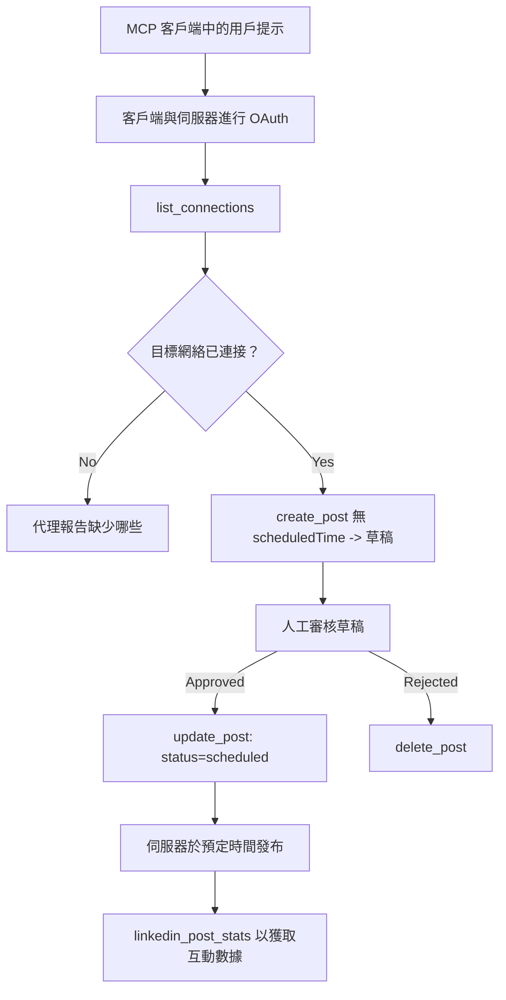

# 案例研究：從代理使用遠端 MCP 伺服器發佈至社交網絡

> **免責聲明：** 有多種服務和開源專案可以發佈到社交網絡，團隊也可以直接整合各網絡的 API。以下情境作為一個編寫可寫能力遠端 MCP 伺服器的設計與使用範例。Publora 是一家提供免費方案的商業服務；本文所述模式適用於任何代表用戶執行不可逆行動的 MCP 伺服器。

## 概述

代理擅長起草內容，但不擅長發布。模型能在數秒內撰寫發布公告，但後續工作中斷：發布意味著每個網絡需不同 API，每個網絡需不同 OAuth 應用程序，還有各異的媒體規則。多數團隊解決方式是手動將文字複製到瀏覽器。

此案例研究探討如何以單一遠端 MCP 伺服器完成最後一步，以及對任何構建此類服務者更有用的資訊——一個具有<strong>可寫能力</strong>的伺服器需做出的設計決策。讀取資料較寬容，發佈則不然：錯誤的工具調用即刻呈現給用戶，且無法撤銷。

## 情境

一個小型開發者關係團隊在代理中起草貼文（如 Claude、VS Code、Cursor——客戶端類型不重要）。他們希望代理能：

- 查看團隊已連接的社交賬號，
- 起草貼文並保留為草稿以待人批准，
- 附加圖片，
- 按選定時間排程發佈至多個網絡，
- 並在後續報告貼文表現。

關鍵是，他們希望代理<em>在實驗階段時無法</em>意外發佈。

## 使用工具

- [Publora MCP 伺服器](https://github.com/publora/mcp-server) — 一個遠端 MCP 伺服器（`streamable-http`），提供發佈、排程、媒體及 LinkedIn 分析工具。正式註冊於 MCP 登錄表中，識別為 `com.publora/mcp-server`。

## 步驟工作流程

1. **連接伺服器。** 支援 OAuth 的客戶端對伺服器自己的同意畫面完成 PKCE 授權碼流程；不支援 OAuth 的客戶端（如無頭 CLI）則使用發放的 Publora API 金鑰放在標頭。兩種路徑皆支援，取決於客戶端而非伺服器。
2. **列出連接。** 代理呼叫 `list_connections` 並接收已連結賬號及識別碼。
3. **起草。** 代理呼叫 `create_post` <em>不帶排程時間</em>。貼文存為草稿，未發佈。
4. **附加媒體。** 公開圖片 URL 同時傳入；伺服器下載及驗證。
5. **排程。** 經人工批准後，透過 `update_post` 設定為排程狀態並指定 ISO 8601 時間。
6. **量度。** 對 LinkedIn，`linkedin_post_stats` 貼文上線後回傳互動數據。

## 範例提示

```text
Which social accounts do I have connected?
Draft a post announcing our new changelog page, attach the screenshot at
https://example.com/changelog.png, and keep it as a draft — do not publish it.
Once I approve, schedule it to LinkedIn and Bluesky for tomorrow at 09:00 UTC.
```

## Mermaid 流程圖



## 技術實作

以下教訓是本案例研究的可遷移部分。

### 開放發現，受權執行

`tools/list` 不需憑證即可使用；每個 `tools/call` 則須提供令牌，否則回傳帶有 `WWW-Authenticate` 標頭的 `401`，指向受保護資源的元資料。（伺服器也回應未受權的 `initialize`，僅適用於協議版本 `2026-07-28` 之前，該版本刪除握手。）

這種分離在實務中很重要。登錄表、目錄及客戶端可無密鑰查看工具表面—名稱、結構、註解，但絕無法匿名執行。要求 `initialize` 須令牌的伺服器幾乎對工具隱形；允許匿名 `tools/call` 的伺服器則存在風險。

### 註冊：動態客戶端註冊與替代方案

伺服器宣告 `/.well-known/oauth-protected-resource` 與 `/.well-known/oauth-authorization-server`，支持 PKCE (`S256`) 授權碼流程、刷新令牌，及<strong>動態客戶端註冊</strong>。

動態註冊可免去手動步驟：否則每個客戶端都需事前獲得 `client_id`，這代表每新增一客戶端需向供應商提出通道外請求。

此處應視為相容行為，而非模仿設計。規範版 `2026-07-28` 弱化動態客戶端註冊，改用客戶端 ID 元資料文件（CIMD），該文件位於穩定 HTTPS URL，且此 URL 本身即為 `client_id`。動態註冊目前仍有效，但新建伺服器應規劃採用 CIMD，對舊客戶端保留 DCR。

### 工具註解非裝飾

每個工具攜帶 `title` 及適用提示：`readOnlyHint`、`destructiveHint`、`idempotentHint`、`openWorldHint`。

投資於此有兩原因。首先，客戶端透過提示決定須和用戶確認什麼—讀取工具可自動執行，只在刪除前尋求批准。規範明確表註解為不可信提示，非授權機制：它影響客戶端允諾執行事項，伺服器仍然嚴格執行規則。其次，大型連接目錄均<em>要求</em>此註解審核；缺少標題與提示的伺服器無論性能如何均被退回。

### 識別碼不可被揣測

平台識別碼為透過 `list_connections` 回傳的不透明字串，結構描述明確要求必須逐字複製，絕不可猜測。伺服器拒絕其他形式。

模型推理流暢。任何可寫伺服器應假設識別碼最終會被幻想出來，務必讓該路徑於早期明確錯誤，而非對似是而非值執行操作。

### 發佈前失敗並返回可執行的訊息

某些網絡拒絕純文字貼文，需要圖片或影片。此驗證於排程時進行，錯誤訊息指明平台與缺失條件。

代理可根據「Instagram 需要媒體 — 附加圖片或影片」消息恢復，且不需另一輪請求。但無法因通用 `400` 錯誤恢復。

### 使重試安全

創建內容的兩個工具 `create_post` 和 `update_post` 接受冪等鍵：重用相同鍵的相同請求會回放原始回應，避免創建第二篇貼文。代理執行時於逾時自動重試；無冪等性，慢回應會導致重複發布。其他寫操作—刪除、媒體步驟、LinkedIn 反應與評論—不接受此鍵，重試時不自動安全。需了解哪些自有變異受保護，哪些不受。

### 提供不發布的測試方式

伺服器接受保留目標 `publora-playground`，會像真實目標驗證並回應，但實際不達任何實帳號。此點在工具結構本身描述，所有客戶端無憑證即可讀：`create_post` 中的 `platforms` 欄位將其註明為「無需真實連接的連線測試目標 — 貼文獲確認然後丟棄，沒有發布」。呼叫時只傳此值：`platforms: ["publora-playground"]`。

此設計是整體表面最有用的細節之一。連接器目錄的審核者、貢獻者及持續集成可在不影響真實受眾的情況下施行完整寫作路徑。任何不可逆行動的 MCP 伺服器皆可受益於有文件化的空操作目標。

## 結果與影響

- 發布步驟由瀏覽器轉移至撰稿同一對話，草稿優先習慣令人工介入。需明確此習慣屬於慣例非邊界：同一憑證可控制排程或發布，任何需真批准路障者必須在工具表面外實現—分開憑證或在伺服器前置入策略層。
- 各網絡差異—媒體要求、串接、回覆控制—由伺服器統一處理，不需各代理重複實作。
- 同一伺服器支援多個 MCP 客戶端，無需針對每個客戶端額外工作，因發現為開放，註冊為動態。
- 前述設計限制同時受連接器目錄審核與使用者影響：註解、OAuth 及安全測試目標皆為至少一方的必需。

## 參考資料

- [Publora MCP 伺服器（原始碼）](https://github.com/publora/mcp-server)
- [Publora API 與 MCP 文件](https://docs.publora.com)
- [MCP 登錄表條目：`com.publora/mcp-server`](https://registry.modelcontextprotocol.io/v0/servers?search=com.publora/mcp-server)
- [MCP 規範 — 授權](https://modelcontextprotocol.io/specification/draft/basic/authorization)
- [MCP 規範 — 工具註解](https://modelcontextprotocol.io/docs/concepts/tools)

## 下一步

- 檢視你正構建的 MCP 伺服器，確認此處三個最便宜的改善項：每個工具註解、每個寫入具冪等鍵、且有文件化的空操作目標。
- 嘗試開放發現分離：先對公開遠端伺服器無憑證呼叫 `tools/list`，再呼叫工具並檢查 `401` 挑戰訊息。
- 思考你的領域中「回復」的意思。發布有草稿與刪除；若行動無介面，確認應放在工具設計而非提示。

---

<!-- CO-OP TRANSLATOR DISCLAIMER START -->
**免責聲明**：
本文件使用 AI 翻譯服務 [Co-op Translator](https://github.com/Azure/co-op-translator) 進行翻譯。雖然我們力求準確，但請注意，自動翻譯可能包含錯誤或不準確之處。原始文件的母語版本應被視為權威來源。對於重要資訊，建議尋求專業人工翻譯。我們不對因使用本翻譯而引起的任何誤解或曲解承擔責任。
<!-- CO-OP TRANSLATOR DISCLAIMER END -->