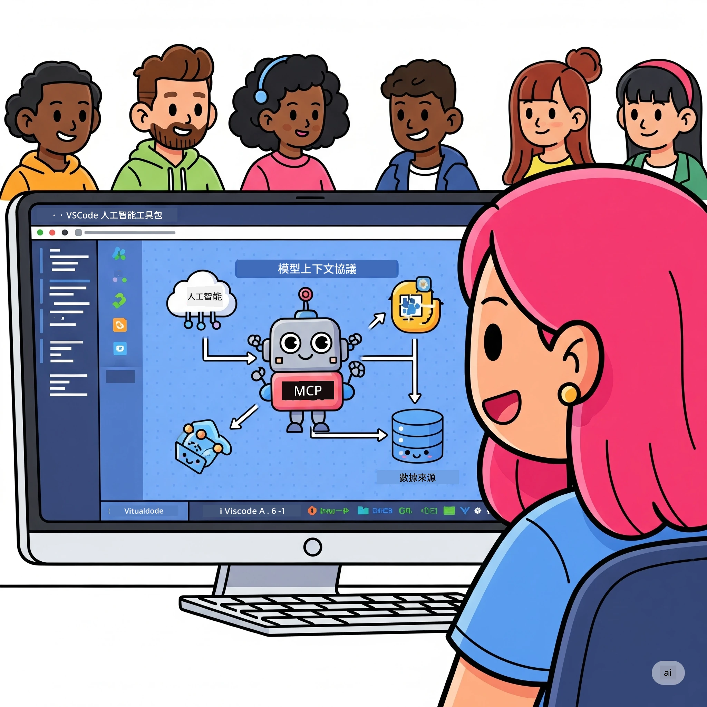
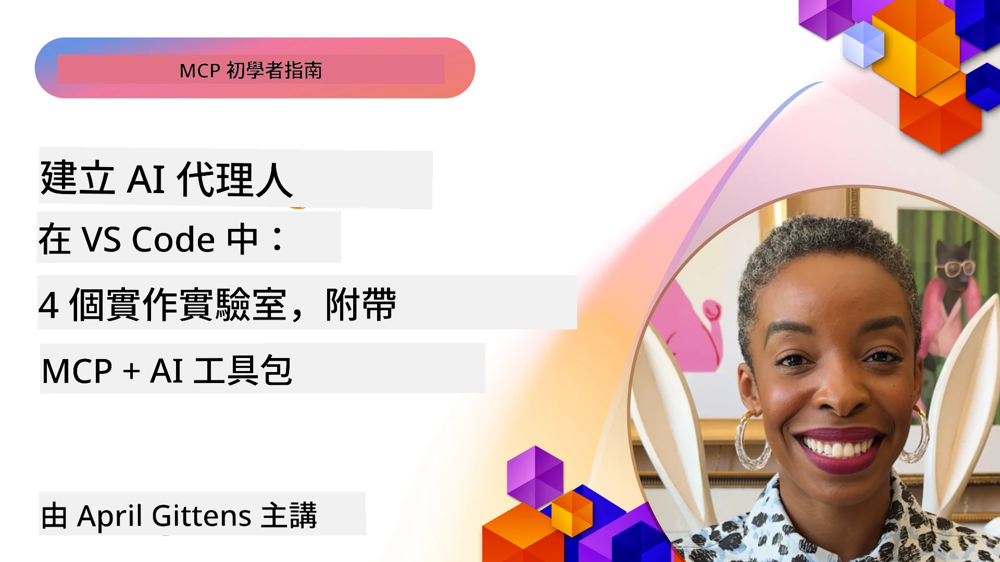

# 精簡 AI 工作流程：使用 Microsoft Foundry Toolkit 建立 MCP 伺服器

## 🎯 概覽

_(點擊上方圖片觀看本課程教學影片)_

歡迎參加 **模型語境協定 (MCP) 工作坊**！此全面的實作工作坊結合兩項尖端技術，革新 AI 應用程式開發：

> <strong>相容性說明：</strong>本工作坊程式碼已使用 MCP
> `2025-11-25` 版本建置與測試，詳見上方徽章。請使用
> [最新 `2026-07-28` 規範](https://modelcontextprotocol.io/specification/2026-07-28/)
> 來進行新協定實作，並於
> 進行實作遷移前審閱 SDK 版本說明。

- **🔗 模型語境協定 (MCP)**：無縫整合 AI 工具的開放標準
- **🛠️ Microsoft Foundry Toolkit VS Code 擴充功能**：微軟功能強大的 AI 開發擴充套件

### 🎓 你將學習

於本工作坊結束時，你將精通建構連結 AI 模型與實務工具及服務的智慧應用程式藝術。從自動化測試至自訂 API 整合，你將獲得實務技能以解決複雜的商業挑戰。

## 🏗️ 技術堆疊

### 🔌 模型語境協定 (MCP)

MCP 是 AI 的 **「USB-C」** — 一種將 AI 模型連接至外部工具與資料來源的通用標準。

**✨ 主要特色：**

- 🔄 <strong>標準化整合</strong>：AI 工具連接的通用介面
- 🏛️ <strong>彈性架構</strong>：本地端與遠端伺服器透過 stdio/SSE 傳輸
- 🧰 <strong>豐富生態系</strong>：工具、提示與資源整合於同一協定
- 🔒 <strong>企業級</strong>：內建安全性與可靠性

**🎯 MCP 重要性：**
就如同 USB-C 擺脫線材混亂，MCP 擺脫 AI 整合複雜性。一個協定，無限可能。

### 🤖 Microsoft Foundry Toolkit VS Code 擴充功能

微軟旗艦的 AI 開發擴充套件，將 VS Code 轉變為 AI 強大平台。

**🚀 核心功能：**

- 📦 <strong>模型目錄</strong>：存取 Azure AI、GitHub、Hugging Face、Ollama 等模型
- ⚡ <strong>本地推理</strong>：ONNX 優化的 CPU/GPU/NPU 執行
- 🏗️ <strong>代理建構器</strong>：具 MCP 整合的視覺化 AI 代理開發
- 🎭 <strong>多模態</strong>：文字、視覺與結構化輸出支援

**💡 開發優勢：**

- 零設定模型部署
- 視覺化提示工程
- 即時測試平台
- 無縫 MCP 伺服器整合

## 📚 學習旅程

### [🚀 模組 1：Microsoft Foundry Toolkit 基礎](./lab1/README.md)

<strong>時長</strong>：15 分鐘

- 🛠️ 安裝並配置 Microsoft Foundry Toolkit for VS Code
- 🗂️ 探索模型目錄（超過 100 個來自 GitHub、ONNX、OpenAI、Anthropic、Google 的模型）
- 🎮 精通互動式遊樂場，進行即時模型測試
- 🤖 建立你的第一個 AI 代理，使用代理建構器
- 📊 使用內建指標評估模型表現（F1、關連性、相似度、連貫性）
- ⚡ 學習批次處理與多模態支援功能

**🎯 學習成果**：建立功能完善的 AI 代理，全面理解 Microsoft Foundry Toolkit 功能

### [🌐 模組 2：Microsoft Foundry Toolkit 的 MCP 基礎](./lab2/README.md)

<strong>時長</strong>：20 分鐘

- 🧠 精通模型語境協定(MCP)架構與概念
- 🌐 探索微軟 MCP 伺服器生態系統
- 🤖 使用 Playwright MCP 伺服器建立瀏覽器自動化代理
- 🔧 將 MCP 伺服器整合至 Microsoft Foundry Toolkit 代理建構器
- 📊 在代理中設定與測試 MCP 工具
- 🚀 匯出並部署以 MCP 為動力的代理，投入生產使用

**🎯 學習成果**：部署以 MCP 超強外部工具驅動的 AI 代理

### [🔧 模組 3：進階 MCP 開發與 Microsoft Foundry Toolkit](./lab3/README.md)

<strong>時長</strong>：20 分鐘

- 💻 使用 Microsoft Foundry Toolkit 建立自訂 MCP 伺服器
- 🐍 配置並使用最新 MCP Python SDK（v1.9.3）
- 🔍 設定並使用 MCP Inspector 進行除錯
- 🛠️ 建立具專業除錯流程的天氣 MCP 伺服器
- 🧪 在代理建構器與 Inspector 環境中除錯 MCP 伺服器

**🎯 學習成果**：使用現代工具開發與除錯自訂 MCP 伺服器

### [🐙 模組 4：實務 MCP 開發 - 自訂 GitHub Clone 伺服器](./lab4/README.md)

<strong>時長</strong>：30 分鐘

- 🏗️ 建立實務使用的 GitHub Clone MCP 伺服器以支援開發工作流程
- 🔄 實作具驗證與錯誤處理的智能版本庫克隆
- 📁 創建智慧目錄管理並整合 VS Code
- 🤖 使用 GitHub Copilot 代理模式搭配自訂 MCP 工具
- 🛡️ 應用生產級可靠性與跨平台相容性

**🎯 學習成果**：部署生產準備好的 MCP 伺服器，精簡真實開發工作流程

## 💡 實務應用與影響

### 🏢 企業應用案例

#### 🔄 DevOps 自動化

以智慧自動化改造你的開發流程：

- <strong>智慧版本庫管理</strong>：AI 驅動的程式碼審查與合併決策
- **智慧 CI/CD**：基於程式碼變更的自動化流水線優化
- <strong>問題分流</strong>：自動錯誤分類與指派

#### 🧪 品質保證革新

以 AI 驅動的自動化提升測試品質：

- <strong>智慧測試生成</strong>：自動建立完整測試套件
- <strong>視覺回歸測試</strong>：AI 驅動的 UI 變更偵測
- <strong>效能監控</strong>：主動問題識別與排解

#### 📊 資料流程智能化

建立更智能的數據處理工作流程：

- **自適應 ETL 流程**：自我優化的數據轉換
- <strong>異常檢測</strong>：實時數據質量監控
- <strong>智能路由</strong>：智能數據流管理

#### 🎧 客戶體驗提升

創造卓越的客戶互動：

- <strong>上下文感知支持</strong>：擁有客戶歷史記錄的 AI 代理
- <strong>主動問題解決</strong>：預測性客戶服務
- <strong>多渠道整合</strong>：跨平台統一的 AI 體驗

## 🛠️ 前置條件與設定

### 💻 系統需求

| 元件 | 需求 | 備註 |
|-----------|-------------|-------|
| <strong>作業系統</strong> | Windows 10+、macOS 10.15+、Linux | 任何現代作業系統 |
| **Visual Studio Code** | 最新穩定版本 | Microsoft Foundry Toolkit 所需 |
| **Node.js** | v18.0+ 及 npm | 用於 MCP 伺服器開發 |
| **Python** | 3.10+ | Python MCP 伺服器的選用項目 |
| <strong>記憶體</strong> | 至少 8GB RAM | 本地模型建議 16GB |

### 🔧 開發環境

#### 推薦的 VS Code 擴充功能

- **Microsoft Foundry Toolkit** (ms-windows-ai-studio.windows-ai-studio)
- **Python** (ms-python.python)
- **Python 除錯器** (ms-python.debugpy)
- **GitHub Copilot** (GitHub.copilot) - 選用但有幫助

#### 選用工具

- **uv**：現代 Python 套件管理器
- **MCP Inspector**：MCP 伺服器的視覺除錯工具
- **Playwright**：用於網頁自動化示例

## 🎖️ 學習成果與認證路徑

### 🏆 技能掌握檢查表

完成本工作坊後，您將掌握：

#### 🎯 核心能力

- [ ] **MCP 協議精通**：深入瞭解架構與實作模式
- [ ] **Microsoft Foundry Toolkit 熟練**：專家級快速開發工具使用
- [ ] <strong>客製伺服器開發</strong>：建置、部署及維護生產環境 MCP 伺服器
- [ ] <strong>工具整合卓越</strong>：無縫連接 AI 與現有開發工作流程
- [ ] <strong>問題解決應用</strong>：將所學技能應用於實際商業挑戰

#### 🔧 技術技能

- [ ] 在 VS Code 中設置與配置 Microsoft Foundry Toolkit
- [ ] 設計與實作客製 MCP 伺服器
- [ ] 將 GitHub 模型整合到 MCP 架構
- [ ] 使用 Playwright 建立自動化測試工作流程
- [ ] 部署 AI 代理於生產環境
- [ ] 除錯並優化 MCP 伺服器效能

#### 🚀 進階能力

- [ ] 規劃企業級 AI 整合架構
- [ ] 實施 AI 應用安全最佳實務
- [ ] 設計可擴展的 MCP 伺服器架構
- [ ] 為特定領域打造客製化工具鏈
- [ ] 指導他人掌握 AI 原生開發

## 📖 其他資源

- [MCP 規範 (2026-07-28)](https://modelcontextprotocol.io/specification/2026-07-28/)
- [Microsoft Foundry Toolkit GitHub 倉庫](https://github.com/microsoft/vscode-ai-toolkit)
- [MCP 伺服器範例集](https://github.com/modelcontextprotocol/servers)
- [最佳實務指南](https://modelcontextprotocol.io/docs/best-practices)
- [OWASP MCP 十大](https://microsoft.github.io/mcp-azure-security-guide/mcp/) - 安全最佳實務

---

**🚀 準備好革新您的 AI 開發工作流程了嗎？**

讓我們與 MCP 及 Microsoft Foundry Toolkit 一同打造智能應用的未來！

## 接下來是

繼續至：[第11單元：MCP 伺服器實作實驗室](../11-MCPServerHandsOnLabs/README.md)

---

<!-- CO-OP TRANSLATOR DISCLAIMER START -->
**免責聲明**：
本文件使用 AI 翻譯服務 [Co-op Translator](https://github.com/Azure/co-op-translator) 進行翻譯。雖然我們力求準確，但請注意，自動翻譯可能包含錯誤或不準確之處。原始文件的母語版本應被視為權威來源。對於重要資訊，建議尋求專業人工翻譯。我們不對因使用本翻譯而引起的任何誤解或曲解承擔責任。
<!-- CO-OP TRANSLATOR DISCLAIMER END -->