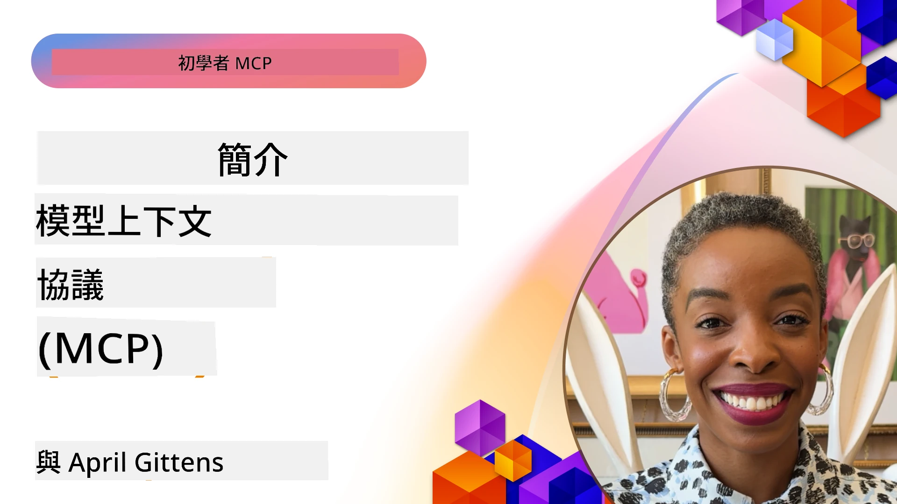
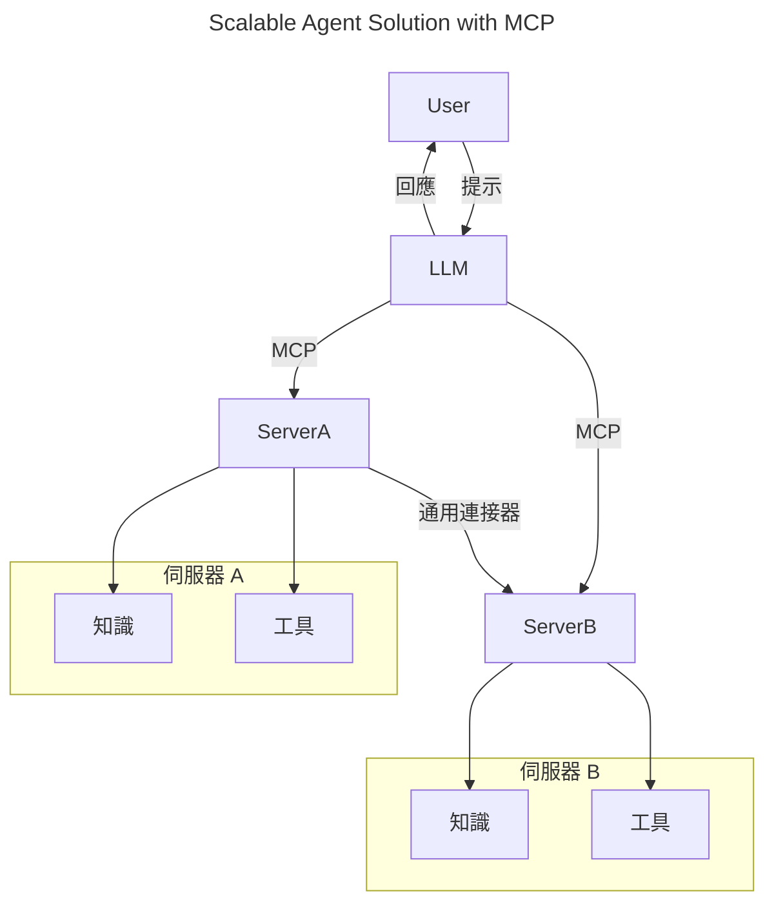
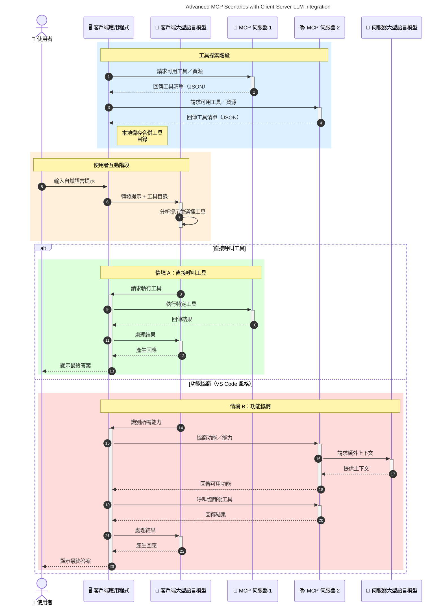

# 模型語境協議 (Model Context Protocol, MCP) 介紹：為何它對可擴展的 AI 應用至關重要

[](https://youtu.be/agBbdiOPLQA)

_(點擊上方圖片觀看本課程影片)_

生成式 AI 應用是一大進步，因為它們常讓用戶可透過自然語言提示與應用互動。然而，隨著投入更多時間和資源到這類應用，你會希望能輕鬆整合功能和資源，方便擴充，讓你的應用能支持多個模型並處理各式模型細節。簡言之，建立生成式 AI 應用起初容易，但當其成長變得更複雜時，你需要開始定義架構，並可能需依賴一套標準以確保應用建置的一致性。這就是 MCP 登場以組織結構並提供標準的原因。

---

## **🔍 什麼是模型語境協議 (Model Context Protocol, MCP)?**

**模型語境協議 (Model Context Protocol, MCP)** 是一個 <strong>開放且標準化的介面</strong>，可讓大型語言模型 (LLM) 與外部工具、API 及資料源無縫互動。它提供一致的架構以增強 AI 模型的功能，使其超越訓練資料，打造更智慧、可擴展且回應迅速的 AI 系統。

---

## **🎯 為何 AI 需要標準化**

隨著生成式 AI 應用的複雜度提升，採用標準以確保 **可擴展性、可擴充性、可維護性** 及 <strong>避免被廠商鎖定</strong> 變得至關重要。MCP 透過以下方式解決這些需求：

- 統一模型與工具之間的整合
- 減少脆弱且一次性的自訂解決方案
- 允許來自不同廠商的多模型共存在一個生態系統中

**注意：** 雖然 MCP 標榜為開放標準，但目前沒有計劃透過 IEEE、IETF、W3C、ISO 或其他任何標準機構正式標準化 MCP。

---

## **📚 學習目標**

閱讀本文後，你將能夠：

- 定義 **模型語境協議（MCP）** 及其應用場景
- 了解 MCP 如何標準化模型與工具間的通信
- 識別 MCP 架構的核心組件
- 探索 MCP 在企業及開發環境的實際應用

---

## **💡 為什麼模型語境協議 (MCP) 是改變遊戲規則的技術**

### **🔗 MCP 解決 AI 互動的碎片化問題**

在 MCP 出現之前，模型與工具的整合需要：

- 每對工具-模型的自訂程式碼
- 各廠商非標準化 API
- 因更新引起的頻繁中斷
- 工具增多時擴展性差

### **✅ MCP 標準化的好處**

| <strong>好處</strong>                | <strong>說明</strong>                                                                |
|--------------------------|-------------------------------------------------------------------------|
| 互操作性                 | LLM 能與不同廠商的工具無縫協作                                       |
| 一致性                   | 在各平台與工具中提供統一行為                                           |
| 可重用性                 | 工具建立一次即可跨專案和系統使用                                       |
| 加速開發                 | 使用標準化、即插即用的介面，減少開發時間                             |

---

## **🧱 MCP 高階架構概述**

MCP 採用 **客戶端-伺服器模型**，其中：

- **MCP 主機（Hosts）** 運行 AI 模型
- **MCP 客戶端（Clients）** 發起請求
- **MCP 伺服器（Servers）** 提供語境、工具和能力

### **主要組件：**

- **資源（Resources）** – 提供模型的靜態或動態資料  
- **提示（Prompts）** – 預定義的工作流程以引導生成  
- **工具（Tools）** – 可執行的功能，如搜尋、計算  
- **取樣（Sampling）** – 透過遞迴互動的代理行為 (MCP `2026-07-28` 廢止；新實作應直接與 LLM 供應商整合)
    

- **引出（Elicitation）** – 伺服器發起使用者輸入請求
- **根目錄（Roots）** – 與伺服器相關的資訊檔案系統位置 (MCP `2026-07-28` 廢止；建議改用工具參數、資源 URI 或伺服器配置)
    


### **協議架構：**

MCP 使用兩層架構：
- **資料層（Data Layer）**：JSON-RPC 2.0 訊息、每次請求的元資料、探索、協議原語
- **傳輸層（Transport Layer）**：本地子程序使用 stdio，遠端伺服器使用可串流 HTTP。可串流 HTTP 支援 SSE 框架以進行串流回應，但舊的 HTTP+SSE 傳輸已被廢止。


---

## MCP 伺服器如何運作

MCP 伺服器的操作流程如下：

- <strong>請求流程</strong>：
    1. 請求由終端用戶或其代理軟體發起。
    2. **MCP 客戶端** 將請求送至管理 AI 模型運行的 **MCP 主機**。
    3. **AI 模型** 接收使用者提示，並可能藉由一次或多次工具呼叫請求存取外部工具或資料。
    4. **MCP 主機**（非模型本身）使用標準化協議與對應的 **MCP 伺服器** 進行通訊。
- **MCP 主機功能**：
    - <strong>工具註冊表</strong>：維護可用工具及其能力目錄。
    - <strong>身份驗證</strong>：核實工具存取權限。
    - <strong>請求處理</strong>：處理模型發出的工具請求。
    - <strong>回應格式化</strong>：將工具輸出結構化為模型能理解的格式。
- **MCP 伺服器執行**：
    - **MCP 主機** 將工具呼叫導向一個或多個具有專門功能（如搜尋、計算、資料庫查詢）的 **MCP 伺服器**。
    - **MCP 伺服器** 執行各自任務並以一致格式將結果返回給 **MCP 主機**。
    - **MCP 主機** 格式化並轉發這些結果給 **AI 模型**。
- <strong>回應完成</strong>：
    - **AI 模型** 將工具輸出整合成最終回應。
    - **MCP 主機** 將該回應傳回 **MCP 客戶端**，由其遞送給終端用戶或調用軟體。
    

```mermaid
---
title: MCP Architecture and Component Interactions
description: A diagram showing the flows of the components in MCP.
---
graph TD
    Client[MCP 用戶端/應用程式] -->|發送請求| H[MCP 主機]
    H -->|呼叫| A[AI 模型]
    A -->|工具呼叫請求| H
    H -->|MCP Protocol| T1[MCP Server Tool 01: 網路搜尋]
    H -->|MCP Protocol| T2[MCP Server Tool 02: 計算機工具]
    H -->|MCP Protocol| T3[MCP Server Tool 03: 資料庫存取工具]
    H -->|MCP Protocol| T4[MCP Server Tool 04: 檔案系統工具]
    H -->|發送回應| Client

    subgraph 「MCP 主機元件」
        H
        G[工具註冊]
        I[身份驗證]
        J[請求處理器]
        K[回應格式化器]
    end

    H <--> G
    H <--> I
    H <--> J
    H <--> K

    style A fill:#f9d5e5,stroke:#333,stroke-width:2px
    style H fill:#eeeeee,stroke:#333,stroke-width:2px
    style Client fill:#d5e8f9,stroke:#333,stroke-width:2px
    style G fill:#fffbe6,stroke:#333,stroke-width:1px
    style I fill:#fffbe6,stroke:#333,stroke-width:1px
    style J fill:#fffbe6,stroke:#333,stroke-width:1px
    style K fill:#fffbe6,stroke:#333,stroke-width:1px
    style T1 fill:#c2f0c2,stroke:#333,stroke-width:1px
    style T2 fill:#c2f0c2,stroke:#333,stroke-width:1px
    style T3 fill:#c2f0c2,stroke:#333,stroke-width:1px
    style T4 fill:#c2f0c2,stroke:#333,stroke-width:1px
```

## 👨‍💻 如何構建 MCP 伺服器（含示範）

MCP 伺服器可擴充 LLM 的能力，提供資料與功能。

準備好試試看了嗎？以下是不同程式語言和堆疊的 SDK 及其簡單 MCP 伺服器建立範例：

- **Python SDK**: https://github.com/modelcontextprotocol/python-sdk

- **TypeScript SDK**: https://github.com/modelcontextprotocol/typescript-sdk

- **Java SDK**: https://github.com/modelcontextprotocol/java-sdk


- **C#/.NET SDK**: https://github.com/modelcontextprotocol/csharp-sdk


## 🌍 MCP 的實際應用案例

MCP 透過擴展 AI 能力，使各種應用成為可能：

| <strong>應用</strong>                     | <strong>描述</strong>                                                                       |
|------------------------------|--------------------------------------------------------------------------------|
| 企業資料整合                 | 連接大型語言模型 (LLMs) 至資料庫、客戶關係管理系統或內部工具                |
| 主動式 AI 系統               | 讓自主代理具備工具存取與決策工作流程                                         |
| 多模態應用                   | 結合文字、影像與音訊工具於單一統一的 AI 應用                                 |
| 即時資料整合                 | 引入即時資料至 AI 互動中，以產出更準確且即時的結果                           |


### 🧠 MCP = AI 互動的通用標準

模型上下文協議（MCP）作為 AI 互動的通用標準，就像 USB-C 為設備標準化實體連接一樣。於 AI 領域中，MCP 提供一致的介面，允許模型（用戶端）與外部工具和資料提供者（伺服器）無縫整合。如此一來，便免除為每個 API 或資料源設計多種自訂協議的需求。

根據 MCP，MCP 相容的工具（即 MCP 伺服器）遵循統一標準。這些伺服器能列出它們提供的工具或行動，並在 AI 代理要求時執行該些行動。支援 MCP 的 AI 代理平台能發現伺服器上的可用工具，並透過此標準協議調用它們。

### 💡 促進知識存取

除了提供工具外，MCP 也促進知識訪問。它讓應用能透過連結到多種資料來源，向大型語言模型（LLMs）提供上下文。例如，某 MCP 伺服器可能代表公司的文件庫，讓代理能按需檢索相關資訊。另一個伺服器則可處理特定行動，如發送電子郵件或更新紀錄。對代理而言，這些皆是可使用的工具—有些工具回傳資料（知識上下文），有些則執行操作。MCP 高效率地管理兩者。

連接到 MCP 伺服器的代理會透過標準格式自動瞭解該伺服器的可用功能與可存取資料。此標準化支援動態工具可用性。舉例而言，新增一個 MCP 伺服器到代理系統，其功能即可立即使用，無需額外調整代理指令。

這種流暢的整合與下方圖示流程一致，伺服器同時提供工具與知識，確保系統間的無縫協作。

### 👉 範例：可擴展的代理解決方案


通用連接器使 MCP 伺服器間能互相溝通與共享功能，讓 ServerA 能將任務委派給 ServerB 或存取其工具與知識。這實現了伺服器間的工具與資料聯邦，支持可擴展且模組化的代理架構。由於 MCP 標準化工具的揭露，代理可動態發現並於伺服器間路由請求，無需硬編碼整合。


工具及知識聯邦：工具與資料可跨伺服器訪問，促進更具擴展性和模組化的主動代理架構。

### 🔄 帶有客戶端 LLM 整合的進階 MCP 場景

除了基本 MCP 架構外，還有客戶端與伺服器雙方皆含 LLM 的進階場景，實現更複雜的互動。下圖中，**Client App** 可能是集成多個 MCP 工具供 LLM 使用的整合開發環境（IDE）：



## 🔐 MCP 的實際好處

以下是使用 MCP 的實際好處：

- <strong>資訊新鮮度</strong>：模型可獲取訓練資料之外的最新資訊
- <strong>能力擴充</strong>：模型可利用專門工具完成未受訓任務
- <strong>減少幻覺</strong>：外部資料源提供事實依據
- <strong>隱私保護</strong>：敏感資料可留在安全環境內，而非嵌入提示中

## 📌 重要結論

以下為使用 MCP 的重要結論：

- **MCP** 標準化 AI 模型與工具及資料的互動方式
- 促進 **擴充性、一致性及互操作性**
- MCP 有助於 **縮短開發時間、提升可靠度及延伸模型能力**
- 用戶端-伺服器架構 **啟用靈活且可擴充的 AI 應用**

## 🧠 練習

想想你有興趣開發的 AI 應用。

- 哪些 <strong>外部工具或資料</strong> 可提升其效能？
- MCP 如何讓整合變得 **更簡單可靠？**

## 延伸資源

- [MCP GitHub 倉庫](https://github.com/modelcontextprotocol)


## 接下來

接下來： [章節 1：核心概念](../01-CoreConcepts/README.md)

---

<!-- CO-OP TRANSLATOR DISCLAIMER START -->
**免責聲明**：
此文件已使用 AI 翻譯服務 [Co-op Translator](https://github.com/Azure/co-op-translator) 進行翻譯。雖然我們努力追求準確性，但請注意自動翻譯可能包含錯誤或不準確之處。原始文件的母語版本應視為權威來源。對於關鍵資訊，建議採用專業人工翻譯。我們不對因使用此翻譯所產生的任何誤解或誤譯承擔責任。
<!-- CO-OP TRANSLATOR DISCLAIMER END -->