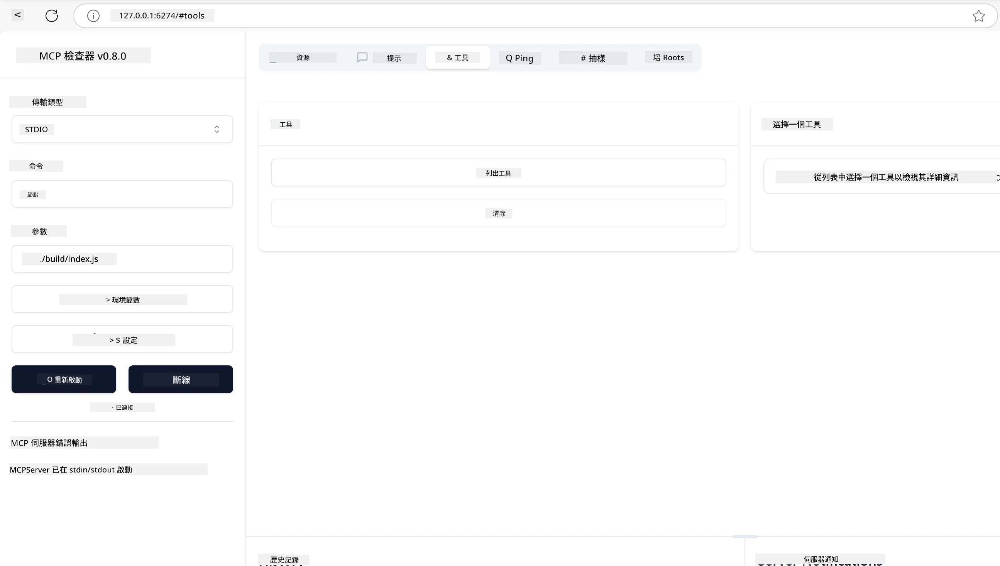
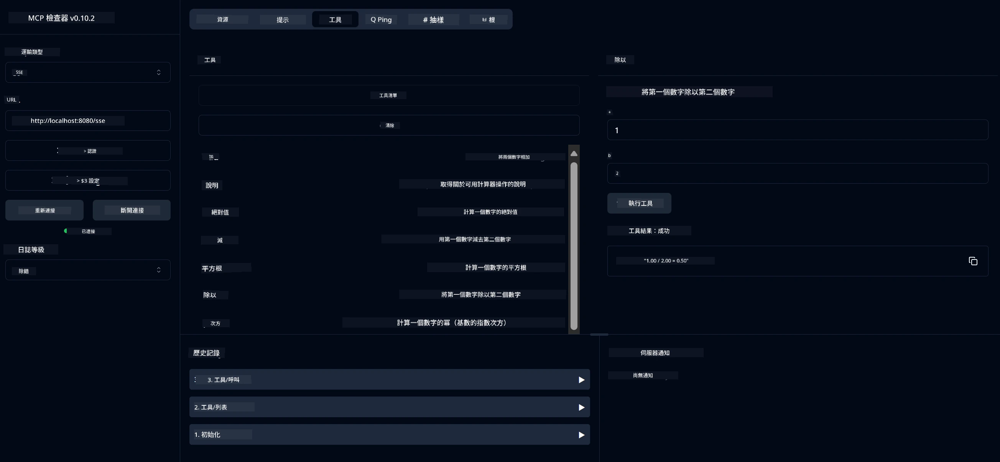
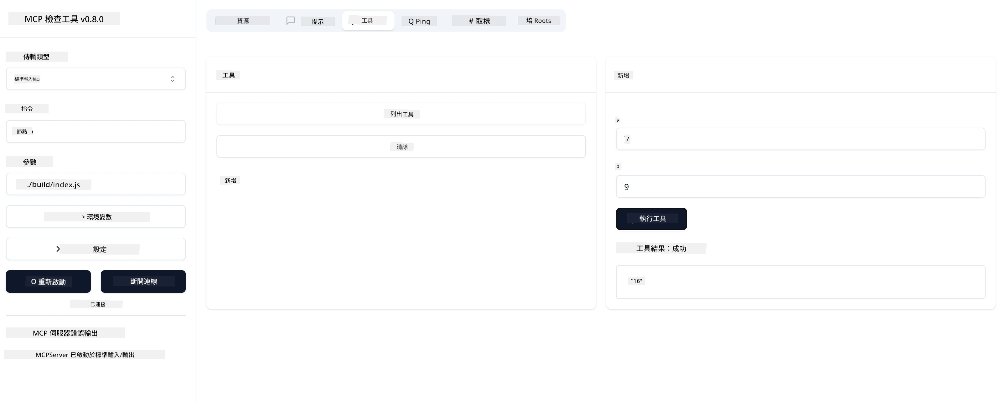

# MCP 入門指南

> [!NOTE]
> 本課程中的 Java HTTP 範例使用舊版 HTTP+SSE 傳輸，並
> 以 MCP `2025-11-25` 版本相容的 SDK 為目標。新建的遠端伺服器請使用
> `2026-07-28` 版 Streamable HTTP 傳輸，並確認您的 SDK 是否支援。

歡迎踏出使用 Model Context Protocol（MCP）的第一步！無論您是 MCP 新手還是想加深了解，本指南將帶您完成基本設定與開發流程。您將會瞭解 MCP 如何實現 AI 模型與應用程式的無縫整合，並學會如何快速準備環境，進行 MCP 解決方案的建置與測試。

> 簡短說明：如果您開發 AI 應用，您知道可以新增工具及其他資源給您的 LLM（大型語言模型），使之更具知識性。然而，若您將這些工具和資源部署在伺服器上，任何有或沒有 LLM 的客戶端都能使用應用程式和伺服器的功能。

## 概述

本課程將實務指導您如何設定 MCP 環境並開發您的第一個 MCP 應用。您將學會如何安裝必要工具與框架、建置基本 MCP 伺服器、建立主機應用，以及測試您的實作。

Model Context Protocol（MCP）是一個開放協議，標準化應用程式如何向大型語言模型提供上下文。您可以將 MCP 想像成 AI 應用的 USB-C 埠——提供一個標準方式，讓 AI 模型能連接不同的資料來源和工具。

## 學習目標

本課程結束後，您將能：

- 為 C#、Java、Python、TypeScript 與 Rust 設定 MCP 開發環境
- 建置並部署具自訂功能（資源、提示詞及工具）的基本 MCP 伺服器
- 建立連接 MCP 伺服器的主機應用程式
- 測試與除錯 MCP 實作

## 設定您的 MCP 環境

在開始 MCP 開發前，務必先準備好開發環境並了解基本工作流程。本節將引導您完成初始設定步驟，確保 MCP 開發順利啟動。

### 前置需求

在深入 MCP 開發前，請確認您已具備：

- <strong>開發環境</strong>：依您選擇的語言（C#、Java、Python、TypeScript 或 Rust）
- **IDE/編輯器**：Visual Studio、Visual Studio Code、IntelliJ、Eclipse、PyCharm，或任何現代程式碼編輯器
- <strong>套件管理工具</strong>：NuGet、Maven/Gradle、pip、npm/yarn 或 Cargo
- **API 金鑰**：用於您主機應用要調用的任何 AI 服務

## 基本 MCP 伺服器結構

MCP 伺服器通常包含：

- <strong>伺服器設定</strong>：設定埠號、驗證及其他參數
- <strong>資源</strong>：提供給 LLM 使用的資料與上下文
- <strong>工具</strong>：模型可調用的功能
- <strong>提示詞</strong>：用以生成或結構化文字的模板

以下是一個簡化的 TypeScript 範例：

```typescript
import { McpServer, ResourceTemplate } from "@modelcontextprotocol/sdk/server/mcp.js";
import { StdioServerTransport } from "@modelcontextprotocol/sdk/server/stdio.js";
import { z } from "zod";

// 建立一個 MCP 伺服器
const server = new McpServer({
  name: "Demo",
  version: "1.0.0"
});

// 添加一個加法工具
server.tool("add",
  { a: z.number(), b: z.number() },
  async ({ a, b }) => ({
    content: [{ type: "text", text: String(a + b) }]
  })
);

// 添加一個動態問候資源
server.resource(
  "file",
  // 'list' 參數控制資源如何列出可用檔案。將其設定為 undefined 可停用此資源的列出功能。
  new ResourceTemplate("file://{path}", { list: undefined }),
  async (uri, { path }) => ({
    contents: [{
      uri: uri.href,
      text: `File, ${path}!`
    }]
  })
);

// 添加一個讀取檔案內容的檔案資源
server.resource(
  "file",
  new ResourceTemplate("file://{path}", { list: undefined }),
  async (uri, { path }) => {
    let text;
    try {
      text = await fs.readFile(path, "utf8");
    } catch (err) {
      text = `Error reading file: ${err.message}`;
    }
    return {
      contents: [{
        uri: uri.href,
        text
      }]
    };
  }
);

server.prompt(
  "review-code",
  { code: z.string() },
  ({ code }) => ({
    messages: [{
      role: "user",
      content: {
        type: "text",
        text: `Please review this code:\n\n${code}`
      }
    }]
  })
);

// 開始從標準輸入接收訊息並在標準輸出發送訊息
const transport = new StdioServerTransport();
await server.connect(transport);
```

上述程式碼中，我們：

- 匯入 MCP TypeScript SDK 所需類別。
- 建立並設定新的 MCP 伺服器實例。
- 註冊自訂工具（`calculator`）並定義處理函數。
- 啟動伺服器以監聽傳入 MCP 請求。

## 測試與除錯

在開始測試 MCP 伺服器前，了解可使用的工具和除錯最佳實務非常重要。有效的測試可確保伺服器如預期運作，並協助您快速偵測與解決問題。以下章節將介紹驗證 MCP 實作的推薦方法。

MCP 提供以下工具幫助您測試與除錯伺服器：

- **Inspector 工具**，此圖形介面讓您連接伺服器，測試工具、提示詞和資源。
- **curl**，您也可使用 curl 等命令列工具或支援 HTTP 命令的其他客戶端連接伺服器。

### 使用 MCP Inspector

[MCP Inspector](https://github.com/modelcontextprotocol/inspector) 是一個視覺化測試工具，能協助您：

1. <strong>探索伺服器功能</strong>：自動偵測可用資源、工具及提示詞
2. <strong>測試工具執行</strong>：嘗試不同參數，即時查看回應
3. <strong>檢視伺服器元資料</strong>：檢查伺服器資訊、架構及設定

```bash
# 例如 TypeScript，安裝並運行 MCP Inspector
npx @modelcontextprotocol/inspector node build/index.js
```

執行上述指令時，MCP Inspector 將在瀏覽器中啟動本地網頁介面。您會看到顯示已註冊 MCP 伺服器、可用工具、資源和提示詞的儀表板。此介面允許您互動式測試工具執行、檢視伺服器元資料和即時回應，方便您驗證與除錯 MCP 伺服器實作。

下圖是介面範例截圖：



## 常見設定問題與解決方案

| 問題 | 可能解決方案 |
|-------|-------------------|
| 連線被拒絕 | 確認伺服器是否正在執行及埠號是否正確 |
| 工具執行錯誤 | 檢查參數驗證和錯誤處理 |
| 認證失敗 | 確認 API 金鑰與權限 |
| 架構驗證錯誤 | 確保參數符合定義架構 |
| 伺服器無法啟動 | 檢查埠號衝突或缺少依賴項 |
| CORS 錯誤 | 設定適當的 CORS 標頭以允許跨來源請求 |
| 認證問題 | 確認 Token 有效性及權限 |

## 本地開發

在本地開發及測試時，您可直接在您的機器上執行 MCP 伺服器：

1. <strong>啟動伺服器程序</strong>：執行您的 MCP 伺服器應用程式
2. <strong>設定網路</strong>：確保伺服器在預期埠號可存取
3. <strong>連接客戶端</strong>：使用本地連接網址如 `http://localhost:3000`

```bash
# 範例：在本地端運行 TypeScript MCP 伺服器
npm run start
# 伺服器運行於 http://localhost:3000
```

## 建立您的第一個 MCP 伺服器

我們已在先前課程中介紹了 [核心概念](../../01-CoreConcepts/README.md)，現在就讓我們將知識付諸實作。

### 伺服器能做什麼

在開始寫程式碼前，先回顧一下伺服器能完成哪些功能：

MCP 伺服器例如可以：

- 存取本地檔案與資料庫
- 連接遠端 API
- 執行計算運算
- 整合其他工具與服務
- 提供使用介面供互動

太好了！既然知道伺服器的作用，現在開始寫程式碼吧。

## 練習：建立伺服器

建立伺服器需要依序進行以下步驟：

- 安裝 MCP SDK。
- 建立專案並設定專案結構。
- 撰寫伺服器程式碼。
- 測試伺服器。

### -1- 建立專案

#### TypeScript

```sh
# 建立專案目錄並初始化 npm 專案
mkdir calculator-server
cd calculator-server
npm init -y
```

#### Python

```sh
# 建立專案資料夾
mkdir calculator-server
cd calculator-server
# 在 Visual Studio Code 中打開資料夾 - 如果你使用其他 IDE，請跳過此步驟
code .
```

#### .NET

```sh
dotnet new console -n McpCalculatorServer
cd McpCalculatorServer
```

#### Java

Java 請建立 Spring Boot 專案：

```bash
curl https://start.spring.io/starter.zip \
  -d dependencies=web \
  -d javaVersion=21 \
  -d type=maven-project \
  -d groupId=com.example \
  -d artifactId=calculator-server \
  -d name=McpServer \
  -d packageName=com.microsoft.mcp.sample.server \
  -o calculator-server.zip
```

解壓縮 ZIP 檔：

```bash
unzip calculator-server.zip -d calculator-server
cd calculator-server
# 選擇性移除未使用的測試
rm -rf src/test/java
```

將下列完整設定加入您的 *pom.xml* 檔案：

```xml
<?xml version="1.0" encoding="UTF-8"?>
<project xmlns="http://maven.apache.org/POM/4.0.0"
    xmlns:xsi="http://www.w3.org/2001/XMLSchema-instance"
    xsi:schemaLocation="http://maven.apache.org/POM/4.0.0 http://maven.apache.org/xsd/maven-4.0.0.xsd">
    <modelVersion>4.0.0</modelVersion>
    
    <!-- Spring Boot parent for dependency management -->
    <parent>
        <groupId>org.springframework.boot</groupId>
        <artifactId>spring-boot-starter-parent</artifactId>
        <version>3.5.0</version>
        <relativePath />
    </parent>

    <!-- Project coordinates -->
    <groupId>com.example</groupId>
    <artifactId>calculator-server</artifactId>
    <version>0.0.1-SNAPSHOT</version>
    <name>Calculator Server</name>
    <description>Basic calculator MCP service for beginners</description>

    <!-- Properties -->
    <properties>
        <java.version>21</java.version>
        <maven.compiler.source>21</maven.compiler.source>
        <maven.compiler.target>21</maven.compiler.target>
    </properties>

    <!-- Spring AI BOM for version management -->
    <dependencyManagement>
        <dependencies>
            <dependency>
                <groupId>org.springframework.ai</groupId>
                <artifactId>spring-ai-bom</artifactId>
                <version>1.0.0-SNAPSHOT</version>
                <type>pom</type>
                <scope>import</scope>
            </dependency>
        </dependencies>
    </dependencyManagement>

    <!-- Dependencies -->
    <dependencies>
        <dependency>
            <groupId>org.springframework.ai</groupId>
            <artifactId>spring-ai-starter-mcp-server-webflux</artifactId>
        </dependency>
        <dependency>
            <groupId>org.springframework.boot</groupId>
            <artifactId>spring-boot-starter-actuator</artifactId>
        </dependency>
        <dependency>
         <groupId>org.springframework.boot</groupId>
         <artifactId>spring-boot-starter-test</artifactId>
         <scope>test</scope>
      </dependency>
    </dependencies>

    <!-- Build configuration -->
    <build>
        <plugins>
            <plugin>
                <groupId>org.springframework.boot</groupId>
                <artifactId>spring-boot-maven-plugin</artifactId>
            </plugin>
            <plugin>
                <groupId>org.apache.maven.plugins</groupId>
                <artifactId>maven-compiler-plugin</artifactId>
                <configuration>
                    <release>21</release>
                </configuration>
            </plugin>
        </plugins>
    </build>

    <!-- Repositories for Spring AI snapshots -->
    <repositories>
        <repository>
            <id>spring-milestones</id>
            <name>Spring Milestones</name>
            <url>https://repo.spring.io/milestone</url>
            <snapshots>
                <enabled>false</enabled>
            </snapshots>
        </repository>
        <repository>
            <id>spring-snapshots</id>
            <name>Spring Snapshots</name>
            <url>https://repo.spring.io/snapshot</url>
            <releases>
                <enabled>false</enabled>
            </releases>
        </repository>
    </repositories>
</project>
```

#### Rust

```sh
mkdir calculator-server
cd calculator-server
cargo init
```

### -2- 新增依賴

現在專案已建立，接下來新增依賴：

#### TypeScript

```sh
# 如果尚未安裝，請全域安裝 TypeScript
npm install typescript -g

# 安裝 MCP SDK 及用於結構驗證的 Zod
npm install @modelcontextprotocol/sdk zod
npm install -D @types/node typescript
```

#### Python

```sh
# 建立虛擬環境並安裝相依套件
python -m venv venv
venv\Scripts\activate
pip install "mcp[cli]"
```

#### Java

```bash
cd calculator-server
./mvnw clean install -DskipTests
```

#### Rust

```sh
cargo add rmcp --features server,transport-io
cargo add serde
cargo add tokio --features rt-multi-thread
```

### -3- 建立專案檔案

#### TypeScript

開啟 *package.json* 檔案，替換內容為以下設定，確保可以建置與執行伺服器：

```json
{
  "name": "calculator-server",
  "version": "1.0.0",
  "main": "index.js",
  "type": "module",
  "scripts": {
    "build": "tsc",
    "start": "npm run build && node ./build/index.js",
  },
  "keywords": [],
  "author": "",
  "license": "ISC",
  "description": "A simple calculator server using Model Context Protocol",
  "dependencies": {
    "@modelcontextprotocol/sdk": "^1.16.0",
    "zod": "^3.25.76"
  },
  "devDependencies": {
    "@types/node": "^24.0.14",
    "typescript": "^5.8.3"
  }
}
```

新增 *tsconfig.json* 檔案，內容如下：

```json
{
  "compilerOptions": {
    "target": "ES2022",
    "module": "Node16",
    "moduleResolution": "Node16",
    "outDir": "./build",
    "rootDir": "./src",
    "strict": true,
    "esModuleInterop": true,
    "skipLibCheck": true,
    "forceConsistentCasingInFileNames": true
  },
  "include": ["src/**/*"],
  "exclude": ["node_modules"]
}
```

建立源碼資料夾：

```sh
mkdir src
touch src/index.ts
```

#### Python

新增檔案 *server.py*

```sh
touch server.py
```

#### .NET

安裝所需 NuGet 套件：

```sh
dotnet add package ModelContextProtocol --prerelease
dotnet add package Microsoft.Extensions.Hosting
```

#### Java

Spring Boot Java 專案會自動建立專案結構。

#### Rust

Rust 會在您執行 `cargo init` 時預設建立 *src/main.rs* 檔案。打開該檔案並刪除預設程式碼。

### -4- 撰寫伺服器程式碼

#### TypeScript

建立檔案 *index.ts* 並加入以下程式碼：

```typescript
import { McpServer, ResourceTemplate } from "@modelcontextprotocol/sdk/server/mcp.js";
import { StdioServerTransport } from "@modelcontextprotocol/sdk/server/stdio.js";
import { z } from "zod";
 
// 建立一個MCP伺服器
const server = new McpServer({
  name: "Calculator MCP Server",
  version: "1.0.0"
});
```

您現在有了伺服器，但功能有限，讓我們改善它。

#### Python

```python
# server.py
from mcp.server.fastmcp import FastMCP

# 創建一個 MCP 伺服器
mcp = FastMCP("Demo")
```

#### .NET

```csharp
using Microsoft.Extensions.DependencyInjection;
using Microsoft.Extensions.Hosting;
using Microsoft.Extensions.Logging;
using ModelContextProtocol.Server;
using System.ComponentModel;

var builder = Host.CreateApplicationBuilder(args);
builder.Logging.AddConsole(consoleLogOptions =>
{
    // Configure all logs to go to stderr
    consoleLogOptions.LogToStandardErrorThreshold = LogLevel.Trace;
});

builder.Services
    .AddMcpServer()
    .WithStdioServerTransport()
    .WithToolsFromAssembly();
await builder.Build().RunAsync();

// add features
```

#### Java

對 Java 來說，請建立核心伺服器元件。首先修改主應用類別：

*src/main/java/com/microsoft/mcp/sample/server/McpServerApplication.java*：

```java
package com.microsoft.mcp.sample.server;

import org.springframework.ai.tool.ToolCallbackProvider;
import org.springframework.ai.tool.method.MethodToolCallbackProvider;
import org.springframework.boot.SpringApplication;
import org.springframework.boot.autoconfigure.SpringBootApplication;
import org.springframework.context.annotation.Bean;
import com.microsoft.mcp.sample.server.service.CalculatorService;

@SpringBootApplication
public class McpServerApplication {

    public static void main(String[] args) {
        SpringApplication.run(McpServerApplication.class, args);
    }
    
    @Bean
    public ToolCallbackProvider calculatorTools(CalculatorService calculator) {
        return MethodToolCallbackProvider.builder().toolObjects(calculator).build();
    }
}
```

建立計算服務 *src/main/java/com/microsoft/mcp/sample/server/service/CalculatorService.java*：

```java
package com.microsoft.mcp.sample.server.service;

import org.springframework.ai.tool.annotation.Tool;
import org.springframework.stereotype.Service;

/**
 * Service for basic calculator operations.
 * This service provides simple calculator functionality through MCP.
 */
@Service
public class CalculatorService {

    /**
     * Add two numbers
     * @param a The first number
     * @param b The second number
     * @return The sum of the two numbers
     */
    @Tool(description = "Add two numbers together")
    public String add(double a, double b) {
        double result = a + b;
        return formatResult(a, "+", b, result);
    }

    /**
     * Subtract one number from another
     * @param a The number to subtract from
     * @param b The number to subtract
     * @return The result of the subtraction
     */
    @Tool(description = "Subtract the second number from the first number")
    public String subtract(double a, double b) {
        double result = a - b;
        return formatResult(a, "-", b, result);
    }

    /**
     * Multiply two numbers
     * @param a The first number
     * @param b The second number
     * @return The product of the two numbers
     */
    @Tool(description = "Multiply two numbers together")
    public String multiply(double a, double b) {
        double result = a * b;
        return formatResult(a, "*", b, result);
    }

    /**
     * Divide one number by another
     * @param a The numerator
     * @param b The denominator
     * @return The result of the division
     */
    @Tool(description = "Divide the first number by the second number")
    public String divide(double a, double b) {
        if (b == 0) {
            return "Error: Cannot divide by zero";
        }
        double result = a / b;
        return formatResult(a, "/", b, result);
    }

    /**
     * Calculate the power of a number
     * @param base The base number
     * @param exponent The exponent
     * @return The result of raising the base to the exponent
     */
    @Tool(description = "Calculate the power of a number (base raised to an exponent)")
    public String power(double base, double exponent) {
        double result = Math.pow(base, exponent);
        return formatResult(base, "^", exponent, result);
    }

    /**
     * Calculate the square root of a number
     * @param number The number to find the square root of
     * @return The square root of the number
     */
    @Tool(description = "Calculate the square root of a number")
    public String squareRoot(double number) {
        if (number < 0) {
            return "Error: Cannot calculate square root of a negative number";
        }
        double result = Math.sqrt(number);
        return String.format("√%.2f = %.2f", number, result);
    }

    /**
     * Calculate the modulus (remainder) of division
     * @param a The dividend
     * @param b The divisor
     * @return The remainder of the division
     */
    @Tool(description = "Calculate the remainder when one number is divided by another")
    public String modulus(double a, double b) {
        if (b == 0) {
            return "Error: Cannot divide by zero";
        }
        double result = a % b;
        return formatResult(a, "%", b, result);
    }

    /**
     * Calculate the absolute value of a number
     * @param number The number to find the absolute value of
     * @return The absolute value of the number
     */
    @Tool(description = "Calculate the absolute value of a number")
    public String absolute(double number) {
        double result = Math.abs(number);
        return String.format("|%.2f| = %.2f", number, result);
    }

    /**
     * Get help about available calculator operations
     * @return Information about available operations
     */
    @Tool(description = "Get help about available calculator operations")
    public String help() {
        return "Basic Calculator MCP Service\n\n" +
               "Available operations:\n" +
               "1. add(a, b) - Adds two numbers\n" +
               "2. subtract(a, b) - Subtracts the second number from the first\n" +
               "3. multiply(a, b) - Multiplies two numbers\n" +
               "4. divide(a, b) - Divides the first number by the second\n" +
               "5. power(base, exponent) - Raises a number to a power\n" +
               "6. squareRoot(number) - Calculates the square root\n" + 
               "7. modulus(a, b) - Calculates the remainder of division\n" +
               "8. absolute(number) - Calculates the absolute value\n\n" +
               "Example usage: add(5, 3) will return 5 + 3 = 8";
    }

    /**
     * Format the result of a calculation
     */
    private String formatResult(double a, String operator, double b, double result) {
        return String.format("%.2f %s %.2f = %.2f", a, operator, b, result);
    }
}
```

**生產環境可選元件：**

建立啟動設定 *src/main/java/com/microsoft/mcp/sample/server/config/StartupConfig.java*：

```java
package com.microsoft.mcp.sample.server.config;

import org.springframework.boot.CommandLineRunner;
import org.springframework.context.annotation.Bean;
import org.springframework.context.annotation.Configuration;

@Configuration
public class StartupConfig {
    
    @Bean
    public CommandLineRunner startupInfo() {
        return args -> {
            System.out.println("\n" + "=".repeat(60));
            System.out.println("Calculator MCP Server is starting...");
            System.out.println("SSE endpoint: http://localhost:8080/sse");
            System.out.println("Health check: http://localhost:8080/actuator/health");
            System.out.println("=".repeat(60) + "\n");
        };
    }
}
```

建立健康檢查控制器 *src/main/java/com/microsoft/mcp/sample/server/controller/HealthController.java*：

```java
package com.microsoft.mcp.sample.server.controller;

import org.springframework.http.ResponseEntity;
import org.springframework.web.bind.annotation.GetMapping;
import org.springframework.web.bind.annotation.RestController;
import java.time.LocalDateTime;
import java.util.HashMap;
import java.util.Map;

@RestController
public class HealthController {
    
    @GetMapping("/health")
    public ResponseEntity<Map<String, Object>> healthCheck() {
        Map<String, Object> response = new HashMap<>();
        response.put("status", "UP");
        response.put("timestamp", LocalDateTime.now().toString());
        response.put("service", "Calculator MCP Server");
        return ResponseEntity.ok(response);
    }
}
```

建立例外處理器 *src/main/java/com/microsoft/mcp/sample/server/exception/GlobalExceptionHandler.java*：

```java
package com.microsoft.mcp.sample.server.exception;

import org.springframework.http.HttpStatus;
import org.springframework.http.ResponseEntity;
import org.springframework.web.bind.annotation.ExceptionHandler;
import org.springframework.web.bind.annotation.RestControllerAdvice;

@RestControllerAdvice
public class GlobalExceptionHandler {

    @ExceptionHandler(IllegalArgumentException.class)
    public ResponseEntity<ErrorResponse> handleIllegalArgumentException(IllegalArgumentException ex) {
        ErrorResponse error = new ErrorResponse(
            "Invalid_Input", 
            "Invalid input parameter: " + ex.getMessage());
        return new ResponseEntity<>(error, HttpStatus.BAD_REQUEST);
    }

    public static class ErrorResponse {
        private String code;
        private String message;

        public ErrorResponse(String code, String message) {
            this.code = code;
            this.message = message;
        }

        // 取值函式
        public String getCode() { return code; }
        public String getMessage() { return message; }
    }
}
```

建立自訂啟動標語 *src/main/resources/banner.txt*：

```text
_____      _            _       _             
 / ____|    | |          | |     | |            
| |     __ _| | ___ _   _| | __ _| |_ ___  _ __ 
| |    / _` | |/ __| | | | |/ _` | __/ _ \| '__|
| |___| (_| | | (__| |_| | | (_| | || (_) | |   
 \_____\__,_|_|\___|\__,_|_|\__,_|\__\___/|_|   
                                                
Calculator MCP Server v1.0
Spring Boot MCP Application
```

</details>

#### Rust

在 *src/main.rs* 檔案頂端加入以下程式碼。這會匯入建置 MCP 伺服器所需的函式庫與模組。

```rust
use rmcp::{
    handler::server::{router::tool::ToolRouter, tool::Parameters},
    model::{ServerCapabilities, ServerInfo},
    schemars, tool, tool_handler, tool_router,
    transport::stdio,
    ServerHandler, ServiceExt,
};
use std::error::Error;
```

計算器伺服器將會是一個簡單的伺服器，可以將兩個數字相加。讓我們先建立一個結構體來表示計算請求。

```rust
#[derive(Debug, serde::Deserialize, schemars::JsonSchema)]
pub struct CalculatorRequest {
    pub a: f64,
    pub b: f64,
}
```

接著，建立一個結構體表示計算器伺服器。此結構體將包含工具路由器，用於註冊工具。

```rust
#[derive(Debug, Clone)]
pub struct Calculator {
    tool_router: ToolRouter<Self>,
}
```

現在，我們可以為 `Calculator` 結構體實作建立新的伺服器實例，並實作伺服器處理器以提供伺服器資訊。

```rust
#[tool_router]
impl Calculator {
    pub fn new() -> Self {
        Self {
            tool_router: Self::tool_router(),
        }
    }
}

#[tool_handler]
impl ServerHandler for Calculator {
    fn get_info(&self) -> ServerInfo {
        ServerInfo {
            instructions: Some("A simple calculator tool".into()),
            capabilities: ServerCapabilities::builder().enable_tools().build(),
            ..Default::default()
        }
    }
}
```

最後，我們需要實作主函式來啟動伺服器。此函式將建立 `Calculator` 結構體實例，並透過標準輸入輸出提供服務。

```rust
#[tokio::main]
async fn main() -> Result<(), Box<dyn Error>> {
    let service = Calculator::new().serve(stdio()).await?;
    service.waiting().await?;
    Ok(())
}
```

伺服器目前已能提供基本的自我資訊。接下來，我們將新增一個執行加法的工具。

### -5- 新增工具與資源

透過新增下列程式碼，加入工具與資源：

#### TypeScript

```typescript
server.tool(
  "add",
  { a: z.number(), b: z.number() },
  async ({ a, b }) => ({
    content: [{ type: "text", text: String(a + b) }]
  })
);

server.resource(
  "greeting",
  new ResourceTemplate("greeting://{name}", { list: undefined }),
  async (uri, { name }) => ({
    contents: [{
      uri: uri.href,
      text: `Hello, ${name}!`
    }]
  })
);
```

您的工具接收參數 `a` 與 `b`，並執行一個函式，產生如下形式的回應：

```typescript
{
  contents: [{
    type: "text", content: "some content"
  }]
}
```

您的資源以字串 "greeting" 被存取，接收參數 `name`，並產生類似工具的回應：

```typescript
{
  uri: "<href>",
  text: "a text"
}
```

#### Python

```python
# 新增一個加法工具
@mcp.tool()
def add(a: int, b: int) -> int:
    """Add two numbers"""
    return a + b


# 新增一個動態問候資源
@mcp.resource("greeting://{name}")
def get_greeting(name: str) -> str:
    """Get a personalized greeting"""
    return f"Hello, {name}!"
```

在上述程式碼中，我們：

- 定義了一個名為 `add` 的工具，接收參數 `a` 和 `b`，兩者皆為整數。
- 建立了一個名為 `greeting` 的資源，接收參數 `name`。

#### .NET

將以下程式碼加入您的 Program.cs 檔案：

```csharp
[McpServerToolType]
public static class CalculatorTool
{
    [McpServerTool, Description("Adds two numbers")]
    public static string Add(int a, int b) => $"Sum {a + b}";
}
```

#### Java

工具部分已在前述步驟建立完成。

#### Rust

在 `impl Calculator` 區塊內新增一個工具：

```rust
#[tool(description = "Adds a and b")]
async fn add(
    &self,
    Parameters(CalculatorRequest { a, b }): Parameters<CalculatorRequest>,
) -> String {
    (a + b).to_string()
}
```

### -6- 完整程式碼

加入最後程式碼，使伺服器能啟動執行：

#### TypeScript

```typescript
// 開始從標準輸入接收訊息並將訊息傳送至標準輸出
const transport = new StdioServerTransport();
await server.connect(transport);
```

以下是完整的程式碼：

```typescript
// index.ts
import { McpServer, ResourceTemplate } from "@modelcontextprotocol/sdk/server/mcp.js";
import { StdioServerTransport } from "@modelcontextprotocol/sdk/server/stdio.js";
import { z } from "zod";

// 建立一個 MCP 伺服器
const server = new McpServer({
  name: "Calculator MCP Server",
  version: "1.0.0"
});

// 新增一個加法工具
server.tool(
  "add",
  { a: z.number(), b: z.number() },
  async ({ a, b }) => ({
    content: [{ type: "text", text: String(a + b) }]
  })
);

// 新增一個動態問候資源
server.resource(
  "greeting",
  new ResourceTemplate("greeting://{name}", { list: undefined }),
  async (uri, { name }) => ({
    contents: [{
      uri: uri.href,
      text: `Hello, ${name}!`
    }]
  })
);

// 開始從 stdin 接收訊息並在 stdout 發送訊息
const transport = new StdioServerTransport();
server.connect(transport);
```

#### Python

```python
# server.py
from mcp.server.fastmcp import FastMCP

# 創建一個 MCP 伺服器
mcp = FastMCP("Demo")


# 添加一個加法工具
@mcp.tool()
def add(a: int, b: int) -> int:
    """Add two numbers"""
    return a + b


# 添加一個動態問候資源
@mcp.resource("greeting://{name}")
def get_greeting(name: str) -> str:
    """Get a personalized greeting"""
    return f"Hello, {name}!"

# 主執行區塊 - 運行伺服器時必須的
if __name__ == "__main__":
    mcp.run()
```

#### .NET

建立 Program.cs 檔案，內容如下：

```csharp
using Microsoft.Extensions.DependencyInjection;
using Microsoft.Extensions.Hosting;
using Microsoft.Extensions.Logging;
using ModelContextProtocol.Server;
using System.ComponentModel;

var builder = Host.CreateApplicationBuilder(args);
builder.Logging.AddConsole(consoleLogOptions =>
{
    // Configure all logs to go to stderr
    consoleLogOptions.LogToStandardErrorThreshold = LogLevel.Trace;
});

builder.Services
    .AddMcpServer()
    .WithStdioServerTransport()
    .WithToolsFromAssembly();
await builder.Build().RunAsync();

[McpServerToolType]
public static class CalculatorTool
{
    [McpServerTool, Description("Adds two numbers")]
    public static string Add(int a, int b) => $"Sum {a + b}";
}
```

#### Java

您的完整主應用類別應如下所示：

```java
// McpServerApplication.java
package com.microsoft.mcp.sample.server;

import org.springframework.ai.tool.ToolCallbackProvider;
import org.springframework.ai.tool.method.MethodToolCallbackProvider;
import org.springframework.boot.SpringApplication;
import org.springframework.boot.autoconfigure.SpringBootApplication;
import org.springframework.context.annotation.Bean;
import com.microsoft.mcp.sample.server.service.CalculatorService;

@SpringBootApplication
public class McpServerApplication {

    public static void main(String[] args) {
        SpringApplication.run(McpServerApplication.class, args);
    }
    
    @Bean
    public ToolCallbackProvider calculatorTools(CalculatorService calculator) {
        return MethodToolCallbackProvider.builder().toolObjects(calculator).build();
    }
}
```

#### Rust

Rust 伺服器的最終程式碼應如下：

```rust
use rmcp::{
    ServerHandler, ServiceExt,
    handler::server::{router::tool::ToolRouter, tool::Parameters},
    model::{ServerCapabilities, ServerInfo},
    schemars, tool, tool_handler, tool_router,
    transport::stdio,
};
use std::error::Error;

#[derive(Debug, serde::Deserialize, schemars::JsonSchema)]
pub struct CalculatorRequest {
    pub a: f64,
    pub b: f64,
}

#[derive(Debug, Clone)]
pub struct Calculator {
    tool_router: ToolRouter<Self>,
}

#[tool_router]
impl Calculator {
    pub fn new() -> Self {
        Self {
            tool_router: Self::tool_router(),
        }
    }
    
    #[tool(description = "Adds a and b")]
    async fn add(
        &self,
        Parameters(CalculatorRequest { a, b }): Parameters<CalculatorRequest>,
    ) -> String {
        (a + b).to_string()
    }
}

#[tool_handler]
impl ServerHandler for Calculator {
    fn get_info(&self) -> ServerInfo {
        ServerInfo {
            instructions: Some("A simple calculator tool".into()),
            capabilities: ServerCapabilities::builder().enable_tools().build(),
            ..Default::default()
        }
    }
}

#[tokio::main]
async fn main() -> Result<(), Box<dyn Error>> {
    let service = Calculator::new().serve(stdio()).await?;
    service.waiting().await?;
    Ok(())
}
```

### -7- 測試伺服器

使用下列指令啟動伺服器：

#### TypeScript

```sh
npm run build
```

#### Python

```sh
mcp run server.py
```

> 若要使用 MCP Inspector，可使用 `mcp dev server.py`，系統會自動啟動 Inspector 並提供所需代理會話令牌。若使用 `mcp run server.py`，您須手動啟動 Inspector 並設定連線。

#### .NET

請確認您在專案目錄中：

```sh
cd McpCalculatorServer
dotnet run
```

#### Java

```bash
./mvnw clean install -DskipTests
java -jar target/calculator-server-0.0.1-SNAPSHOT.jar
```

#### Rust

執行下列指令以格式化並執行伺服器：

```sh
cargo fmt
cargo run
```

### -8- 透過 Inspector 執行

Inspector 是一個絕佳工具，可以啟動您的伺服器，並讓您互動測試其功能是否正常。讓我們啟動它：

> [!NOTE]
> 「指令」欄位可能因應您的運行環境不同而有所差異，該欄位會顯示用來啟動伺服器的特定指令。

#### TypeScript

```sh
npx @modelcontextprotocol/inspector node build/index.js
```

或將其加入您的 *package.json* 如下：`"inspector": "npx @modelcontextprotocol/inspector node build/index.js"`，然後執行 `npm run inspector`

#### Python

Python 封裝了一個名為 inspector 的 Node.js 工具。您可以透過以下方式呼叫該工具：

```sh
mcp dev server.py
```


然而，它並未實現工具上所有可用的方法，因此建議您直接像下面這樣運行 Node.js 工具：

```sh
npx @modelcontextprotocol/inspector mcp run server.py
```

如果您使用的工具或 IDE 允許您配置運行腳本的命令和參數，
請確保在「Command」欄位設定 `python`，並將 `server.py` 設為「Arguments」。這樣能確保腳本正確執行。

#### .NET

請確保您位於專案目錄中：

```sh
cd McpCalculatorServer
npx @modelcontextprotocol/inspector dotnet run
```

#### Java

確保您的計算器伺服器正在運行
然後運行檢視器：

```cmd
npx @modelcontextprotocol/inspector
```

在檢視器的網頁介面中：

1. 選擇「SSE」作為傳輸類型
2. 將 URL 設為：`http://localhost:8080/sse`
3. 點選「Connect」



<strong>您已連接到伺服器</strong>
**Java 伺服器測試階段已完成**

下一部分是與伺服器互動。

您應該會看到以下使用者介面：


1. 按下 Connect 按鈕以連接伺服器
  連接伺服器後，您應該會看到以下畫面：

  

1. 選擇「Tools」然後「listTools」，您應該會看到「Add」出現，選擇「Add」並填入參數值。

  您會看到以下回應，即「add」工具的結果：

  

恭喜，您已成功建立並運行您的第一個伺服器！

#### Rust

要使用 MCP Inspector CLI 運行 Rust 伺服器，請使用以下命令：

```sh
npx @modelcontextprotocol/inspector cargo run --cli --method tools/call --tool-name add --tool-arg a=1 b=2
```

### 官方 SDK

MCP 提供多種語言的官方 SDK：

- [C# SDK](https://github.com/modelcontextprotocol/csharp-sdk) - 與 Microsoft 共同維護
- [Java SDK](https://github.com/modelcontextprotocol/java-sdk) - 與 Spring AI 共同維護
- [TypeScript SDK](https://github.com/modelcontextprotocol/typescript-sdk) - 官方 TypeScript 實作
- [Python SDK](https://github.com/modelcontextprotocol/python-sdk) - 官方 Python 實作
- [Kotlin SDK](https://github.com/modelcontextprotocol/kotlin-sdk) - 官方 Kotlin 實作
- [Swift SDK](https://github.com/modelcontextprotocol/swift-sdk) - 與 Loopwork AI 共同維護
- [Rust SDK](https://github.com/modelcontextprotocol/rust-sdk) - 官方 Rust 實作

## 主要重點

- 設置 MCP 開發環境透過特定語言的 SDK 非常簡單
- 建立 MCP 伺服器需創建並註冊具有明確結構的工具
- 測試和除錯是可靠的 MCP 實作的重要部分

## 範例

- [Java 計算器](../samples/java/calculator/README.md)
- [.NET 計算器](../../../../03-GettingStarted/samples/csharp)
- [JavaScript 計算器](../samples/javascript/README.md)
- [TypeScript 計算器](../samples/typescript/README.md)
- [Python 計算器](../../../../03-GettingStarted/samples/python)
- [Rust 計算器](../../../../03-GettingStarted/samples/rust)

## 作業

建立一個您選擇工具的簡單 MCP 伺服器：

1. 以您喜歡的語言實作該工具（.NET、Java、Python、TypeScript 或 Rust）。
2. 定義輸入參數和回傳值。
3. 執行檢視器工具確保伺服器正常運作。
4. 使用不同輸入測試您的實作。

## 解答

[解答](./solution/README.md)

## 附加資源

- [在 Azure 上使用 Model Context Protocol 建立代理](https://learn.microsoft.com/azure/developer/ai/intro-agents-mcp)
- [Azure Container Apps 上的遠端 MCP (Node.js/TypeScript/JavaScript)](https://learn.microsoft.com/samples/azure-samples/mcp-container-ts/mcp-container-ts/)
- [.NET OpenAI MCP 代理](https://learn.microsoft.com/samples/azure-samples/openai-mcp-agent-dotnet/openai-mcp-agent-dotnet/)

## 接下來

下一步：[MCP 客戶端入門](../02-client/README.md)

---

<!-- CO-OP TRANSLATOR DISCLAIMER START -->
**免責聲明**：
此文件已使用 AI 翻譯服務 [Co-op Translator](https://github.com/Azure/co-op-translator) 進行翻譯。雖然我們努力追求準確性，但請注意自動翻譯可能包含錯誤或不準確之處。原始文件的母語版本應視為權威來源。對於關鍵資訊，建議採用專業人工翻譯。我們不對因使用此翻譯所產生的任何誤解或誤譯承擔責任。
<!-- CO-OP TRANSLATOR DISCLAIMER END -->