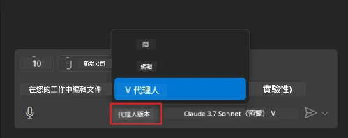
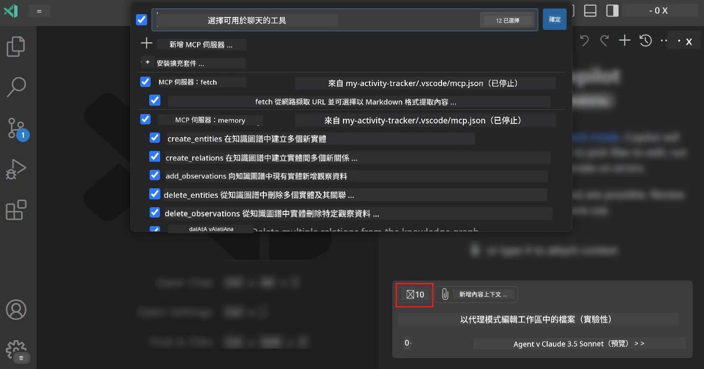
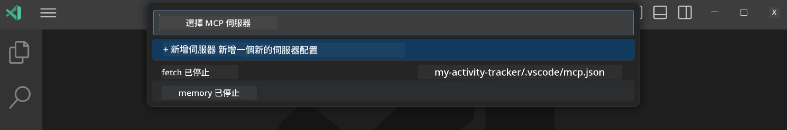
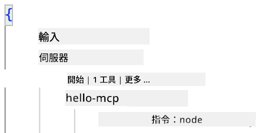
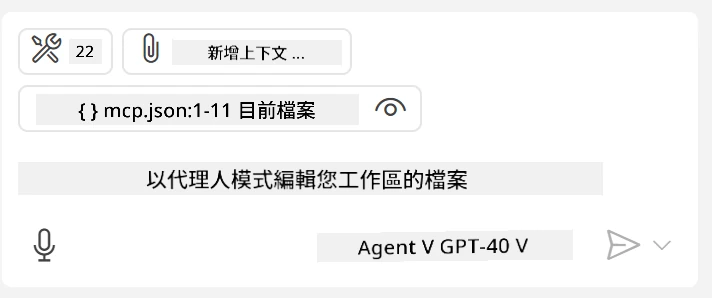
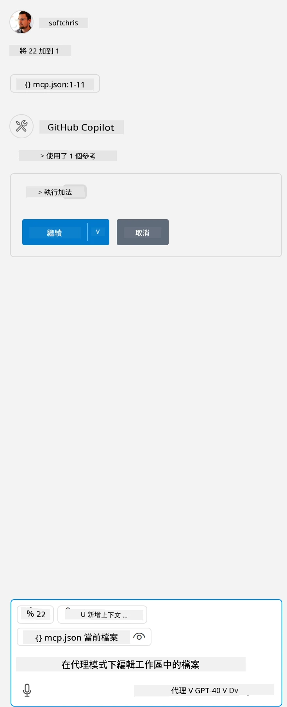

# 從 GitHub Copilot Agent 模式使用伺服器

Visual Studio Code 和 GitHub Copilot 可以作為客戶端來使用 MCP 伺服器。你可能會問為什麼我們想這麼做？這代表 MCP 伺服器擁有的任何功能現在都能在你的 IDE 中被使用。想像你加入了 GitHub 的 MCP 伺服器，這將允許你透過提示控制 GitHub，而不是在終端機輸入特定指令。或者想像任何能增進你開發者體驗的功能，全都能藉由自然語言控制。現在你開始看到其中的好處了吧？

## 概覽

本課程涵蓋如何使用 Visual Studio Code 和 GitHub Copilot 的 Agent 模式作為你的 MCP 伺服器的客戶端。

## 學習目標

完成本課程後，你將能：

- 透過 Visual Studio Code 使用 MCP 伺服器。
- 透過 GitHub Copilot 執行像工具的功能。
- 設定 Visual Studio Code 以尋找和管理你的 MCP 伺服器。

## 使用方式

你可以用兩種不同方式控制你的 MCP 伺服器：

- 使用者介面，稍後章節會示範如何使用。
- 終端機，可以用 `code` 可執行檔從終端機控制：

  要將 MCP 伺服器加入你的使用者設定，請使用 --add-mcp 命令參數，並提供 JSON 格式的伺服器設定，如 {\"name\":\"server-name\",\"command\":...}。

  ```
  code --add-mcp "{\"name\":\"my-server\",\"command\": \"uvx\",\"args\": [\"mcp-server-fetch\"]}"
  ```

### 截圖





接下來章節我們將更詳細說明如何使用視覺介面。

## 方式

我們需要這樣高階操作：

- 設定檔案以尋找我們的 MCP 伺服器。
- 啟動／連接至該伺服器以列出其功能。
- 透過 GitHub Copilot 聊天介面使用這些功能。

好的，既然我們了解流程，讓我們來試著透過 Visual Studio Code 使用 MCP 伺服器做個練習。

## 練習：使用伺服器

在這個練習中，我們將設定 Visual Studio Code 以尋找你的 MCP 伺服器，讓它能從 GitHub Copilot 聊天介面被使用。

### -0- 前置步驟，啟用 MCP 伺服器發現功能

你可能需要啟用 MCP 伺服器的發現功能。

1. 進入 Visual Studio Code 的 `檔案 -> 偏好設定 -> 設定`。

1. 搜尋 "MCP" 並在 settings.json 文件中啟用 `chat.mcp.discovery.enabled`。

### -1- 建立設定檔

先在你的專案根目錄建立一個設定檔，你需要一個名為 MCP.json 的檔案，並放入名為 .vscode 的資料夾中，看起來應該是這樣：

```text
.vscode
|-- mcp.json
```

接著，我們看看如何新增伺服器項目。

### -2- 設定伺服器

在 *mcp.json* 中加入以下內容：

```json
{
    "inputs": [],
    "servers": {
       "hello-mcp": {
           "command": "node",
           "args": [
               "build/index.js"
           ]
       }
    }
}
```

上面是一個簡單範例示範如何啟動一個用 Node.js 寫的伺服器，針對其他執行環境，請使用 `command` 和 `args` 指定啟動伺服器的正確指令。

### -3- 啟動伺服器

現在你已新增了項目，讓我們啟動伺服器：

1. 找到 *mcp.json* 中的項目，並確認看到「播放」圖示：

    

1. 點擊「播放」圖示，你應該會看到 GitHub Copilot 聊天中的工具圖示增加可用工具數量。點擊該工具圖示，你會看到已註冊工具清單。你可以依需求勾選／取消勾選，每個工具決定是否讓 GitHub Copilot 以此作為上下文：

  

1. 要執行工具，輸入你知道會符合你某個工具描述的提示語，例如像是「add 22 to 1」的提示：

  

  你應該會看到回應「23」。

## 作業

試著在你的 *mcp.json* 檔案中加入伺服器項目，並確保你能啟動／停止伺服器。也確保可以透過 GitHub Copilot 聊天介面與伺服器上的工具通訊。

## 解答

[解答](./solution/README.md)

## 重要重點

本章節的重點如下：

- Visual Studio Code 是一個很棒的客戶端，讓你能使用多個 MCP 伺服器及其工具。
- GitHub Copilot 聊天介面是你與伺服器互動的方式。
- 你可以提示使用者輸入 API 金鑰，並在 *mcp.json* 設定伺服器項目時傳遞給 MCP 伺服器。

## 範例

- [Java 計算機](../samples/java/calculator/README.md)
- [.Net 計算機](../../../../03-GettingStarted/samples/csharp)
- [JavaScript 計算機](../samples/javascript/README.md)
- [TypeScript 計算機](../samples/typescript/README.md)
- [Python 計算機](../../../../03-GettingStarted/samples/python)

## 額外資源

- [Visual Studio 文件](https://code.visualstudio.com/docs/copilot/chat/mcp-servers)

## 接下來

- 下一步：[建立 stdio 伺服器](../05-stdio-server/README.md)

---

<!-- CO-OP TRANSLATOR DISCLAIMER START -->
**免責聲明**：
此文件已使用 AI 翻譯服務 [Co-op Translator](https://github.com/Azure/co-op-translator) 進行翻譯。雖然我們努力追求準確性，但請注意自動翻譯可能包含錯誤或不準確之處。原始文件的母語版本應視為權威來源。對於關鍵資訊，建議採用專業人工翻譯。我們不對因使用此翻譯所產生的任何誤解或誤譯承擔責任。
<!-- CO-OP TRANSLATOR DISCLAIMER END -->