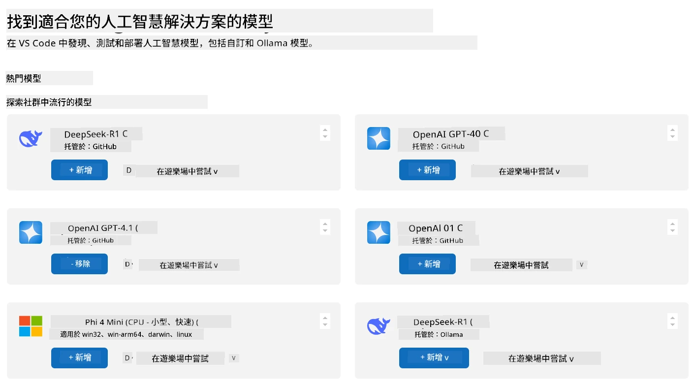
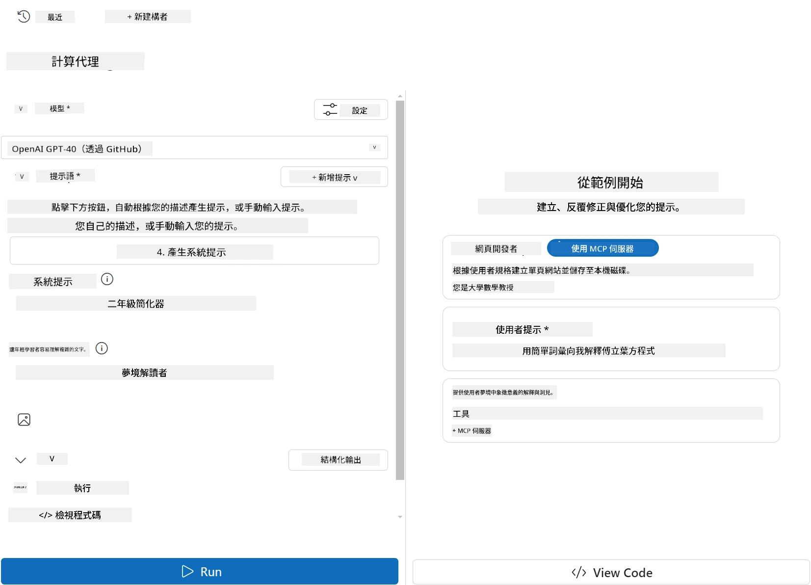
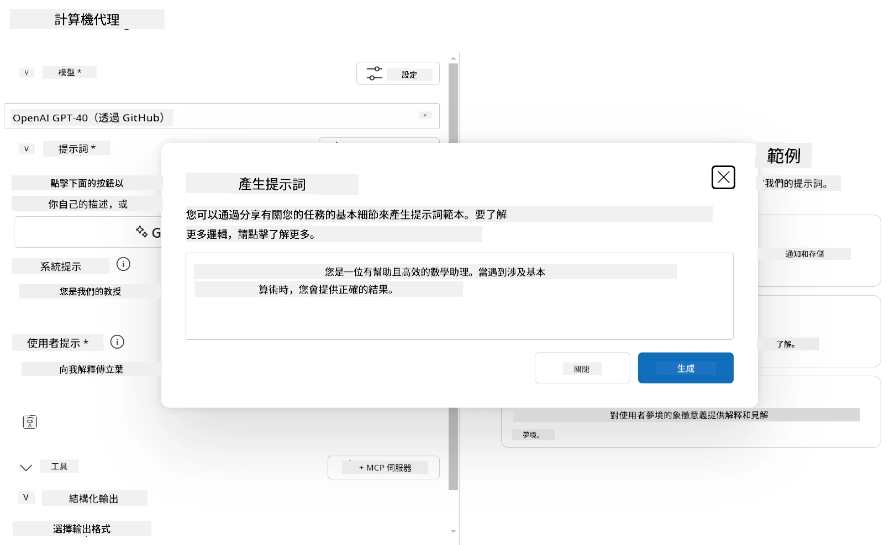
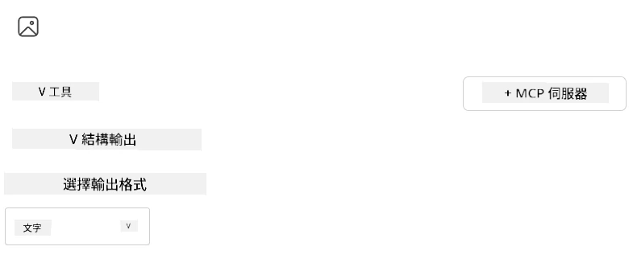

# 使用 Visual Studio Code 的 AI Toolkit 擴充套件消費伺服器

當你建立 AI 代理時，重點不僅是生成智能回應；還在於讓你的代理能夠採取行動。這就是模型上下文協議（MCP）的用武之地。MCP 使代理能以一致的方式存取外部工具和服務。可以把它想像成將你的代理插入一個它<em>真正</em>能用的工具箱。

假設你連接一個計算機 MCP 伺服器給代理。突然之間，你的代理只要收到像「47 乘以 89 是多少？」這樣的提示，就能執行數學運算——不需要硬編碼邏輯或建立自訂 API。

## 概覽

本課程將介紹如何使用 Visual Studio Code 中的 [AI Toolkit](https://aka.ms/AIToolkit) 擴充套件，連接一個計算機 MCP 伺服器到代理，使你的代理能夠透過自然語言執行加法、減法、乘法和除法等數學運算。

AI Toolkit 是一個強大的 Visual Studio Code 擴充套件，簡化了代理開發。AI 工程師能輕鬆地開發與測試生成式 AI 模型，無論是在本地或雲端。該擴充套件支援當今大部分主要的生成式模型。

<em>注意</em>：AI Toolkit 目前支援 Python 和 TypeScript。

## 學習目標

完成本課程後，你將能夠：

- 透過 AI Toolkit 消費 MCP 伺服器。
- 配置代理設定，使其能發現並使用 MCP 伺服器提供的工具。
- 透過自然語言使用 MCP 工具。

## 方法

我們大致上需要這樣進行：

- 建立代理並定義其系統提示。
- 建立附帶計算工具的 MCP 伺服器。
- 將代理建立器連接至 MCP 伺服器。
- 透過自然語言測試代理調用工具。

很好，理解流程後，讓我們配置一個 AI 代理來利用 MCP 的外部工具，增強其能力吧！

## 先決條件

- [Visual Studio Code](https://code.visualstudio.com/)
- [Visual Studio Code 的 AI Toolkit](https://aka.ms/AIToolkit)

## 練習：消費伺服器

> [!WARNING]
> macOS 使用者注意。我們目前正在調查影響 macOS 上依賴項安裝的問題。因此 macOS 使用者暫時無法完成此教學。我們會在修復方案出爐後立即更新指示。感謝你的耐心與理解！

在此練習中，你將使用 AI Toolkit 在 Visual Studio Code 內建立、執行及增強帶有 MCP 伺服器工具的 AI 代理。

### -0- 預備步驟，將 OpenAI GPT-4o 模型加入我的模型

此練習使用 **GPT-4o** 模型。建立代理前，模型應先加入到 <strong>我的模型</strong> 中。



1. 從 <strong>活動列</strong> 開啟 **AI Toolkit** 擴充。
1. 在 <strong>目錄</strong> 區段選擇 <strong>模型</strong>，打開 <strong>模型目錄</strong>。選擇 <strong>模型</strong> 將在新編輯器分頁開啟 <strong>模型目錄</strong>。
1. 在 <strong>模型目錄</strong> 搜尋欄輸入 **OpenAI GPT-4o**。
1. 點擊 **+ 新增** 將模型加入你的 <strong>我的模型</strong> 清單。確定已選擇 **GitHub 托管** 的模型。
1. 在 <strong>活動列</strong> 中，確認清單中出現 **OpenAI GPT-4o** 模型。

### -1- 建立代理

**代理（提示）建立器** 讓你建立和自訂自己的 AI 代理。在本節中，你將建立新代理並指派一個模型來動力對話。



1. 從 <strong>活動列</strong> 開啟 **AI Toolkit** 擴充。
1. 在 <strong>工具</strong> 區段選擇 **代理（提示）建立器**。選擇後將在新編輯器分頁開啟 **代理（提示）建立器**。
1. 點擊 **+ 新代理** 按鈕。擴充會透過 <strong>命令選擇器</strong> 啟動設置精靈。
1. 輸入名稱 <strong>計算機代理</strong> 並按 **Enter**。
1. 在 **代理（提示）建立器** 中，<strong>模型</strong> 欄位選擇 **OpenAI GPT-4o (via GitHub)** 模型。

### -2- 為代理建立系統提示

建立完代理架構後，是時候定義其性格和使命。在本節，你將使用 <strong>生成系統提示</strong> 功能，描述代理的預期行為（此例為計算機代理），並由模型為你撰寫系統提示。



1. 在 <strong>提示</strong> 區段，點擊 <strong>生成系統提示</strong> 按鈕。此按鈕會開啟提示產生器，利用 AI 生成代理的系統提示。
1. 在 <strong>生成提示</strong> 視窗輸入：`你是樂於助人且高效的數學助理。遇到基本算術問題時，你會回應正確結果。`
1. 點擊 <strong>生成</strong> 按鈕。右下角會跳出通知確認正在生成系統提示。生成完成後，提示會出現在 **代理（提示）建立器** 的 <strong>系統提示</strong> 欄位。
1. 檢視 <strong>系統提示</strong>，如有需要可修改。

### -3- 建立 MCP 伺服器

當你定義好代理的系統提示——指導其行為與回應——接著就是配備代理實用功能。在本節中，你將建立一個帶有加法、減法、乘法和除法運算工具的計算機 MCP 伺服器。這個伺服器將讓你的代理能即時響應自然語言提示，執行數學運算。



AI Toolkit 配備模板，方便你建立自己的 MCP 伺服器。本教學將使用 Python 範本建立計算機 MCP 伺服器。

<em>注意</em>：AI Toolkit 目前支持 Python 和 TypeScript。

1. 在 **代理（提示）建立器** 的 <strong>工具</strong> 區段，點擊 **+ MCP 伺服器** 按鈕。擴充將透過 <strong>命令選擇器</strong> 啟動設置精靈。
1. 選擇 **+ 新增伺服器**。
1. 選擇 **建立新的 MCP 伺服器**。
1. 選擇範本 **python-weather**。
1. 選擇 <strong>預設資料夾</strong> 儲存 MCP 伺服器範本。
1. 輸入伺服器名稱：<strong>計算機</strong>
1. 新的 Visual Studio Code 視窗會開啟。選擇 **是，我信任作者**。
1. 使用終端機（<strong>終端機</strong> > <strong>新終端機</strong>）建立虛擬環境：`python -m venv .venv`
1. 使用終端機啟用虛擬環境：
    1. Windows - `.venv\Scripts\activate`
    1. macOS/Linux - `source .venv/bin/activate`
1. 使用終端機安裝依賴：`pip install -e .[dev]`
1. 在 <strong>活動列</strong> 的 <strong>檔案總管</strong> 檢視中，展開 **src** 目錄並開啟 **server.py**。
1. 用以下程式碼取代 **server.py** 中的內容並儲存：

    ```python
    """
    Sample MCP Calculator Server implementation in Python.

    
    This module demonstrates how to create a simple MCP server with calculator tools
    that can perform basic arithmetic operations (add, subtract, multiply, divide).
    """
    
    from mcp.server.fastmcp import FastMCP
    
    server = FastMCP("calculator")
    
    @server.tool()
    def add(a: float, b: float) -> float:
        """Add two numbers together and return the result."""
        return a + b
    
    @server.tool()
    def subtract(a: float, b: float) -> float:
        """Subtract b from a and return the result."""
        return a - b
    
    @server.tool()
    def multiply(a: float, b: float) -> float:
        """Multiply two numbers together and return the result."""
        return a * b
    
    @server.tool()
    def divide(a: float, b: float) -> float:
        """
        Divide a by b and return the result.
        
        Raises:
            ValueError: If b is zero
        """
        if b == 0:
            raise ValueError("Cannot divide by zero")
        return a / b
    ```

### -4- 使用計算機 MCP 伺服器執行代理

現在你的代理擁有工具，是時候使用它們了！本節中，你將提交提示測試代理，驗證代理是否調用計算機 MCP 伺服器中的適當工具。


你將透過在本地開發機器上以 MCP 用戶端身份運行的 <strong>代理建立器</strong> 執行計算機 MCP 伺服器。

1. 按下 `F5` 以啟動 MCP 伺服器的除錯。**代理（提示）建立器** 會在新編輯器分頁中開啟。伺服器狀態會顯示在終端機。
1. 在 **代理（提示）建立器** 的 <strong>使用者提示</strong> 欄位輸入提示：`我買了 3 件商品，每件 25 美元，然後使用了 20 美元折扣。我總共付了多少錢？`
1. 點擊 <strong>執行</strong> 按鈕以生成代理的回應。
1. 檢視代理輸出。模型應該結論你付了 **55 美元**。
1. 以下是應該發生的步驟：
    - 代理選擇了 **multiply** 和 **subtract** 工具來協助計算。
    - 分別為 **multiply** 工具指派 `a` 和 `b` 的值。
    - 分別為 **subtract** 工具指派 `a` 和 `b` 的值。
    - 每個工具的回應會顯示在相應的 <strong>工具回應</strong> 中。
    - 模型的最終輸出顯示在 <strong>模型回應</strong> 中。
1. 提交更多提示以進一步測試代理。你可點擊 <strong>使用者提示</strong> 欄位替換提示內容。
1. 測試完成後，可透過 <strong>終端機</strong> 輸入 **CTRL/CMD+C** 停止伺服器。

## 作業

嘗試在你的 **server.py** 檔案中新增一個工具項目（例如：回傳數字的平方根）。輸入需要代理調用你新增或現有工具的提示。記得重啟伺服器以載入新增工具。

## 解答

[解答](./solution/README.md)

## 主要收穫

本章的重點如下：

- AI Toolkit 擴充是消費 MCP 伺服器及其工具的絕佳用戶端。
- 你可以新增工具到 MCP 伺服器，擴展代理的能力以滿足不斷演進的需求。
- AI Toolkit 包含範本（如 Python MCP 伺服器範本），簡化自定義工具的建立。

## 其他資源

- [AI Toolkit 文件](https://aka.ms/AIToolkit/doc)

## 接下來
- 下一步：[測試與除錯](../08-testing/README.md)

---

<!-- CO-OP TRANSLATOR DISCLAIMER START -->
**免責聲明**：
此文件已使用 AI 翻譯服務 [Co-op Translator](https://github.com/Azure/co-op-translator) 進行翻譯。雖然我們努力追求準確性，但請注意自動翻譯可能包含錯誤或不準確之處。原始文件的母語版本應視為權威來源。對於關鍵資訊，建議採用專業人工翻譯。我們不對因使用此翻譯所產生的任何誤解或誤譯承擔責任。
<!-- CO-OP TRANSLATOR DISCLAIMER END -->