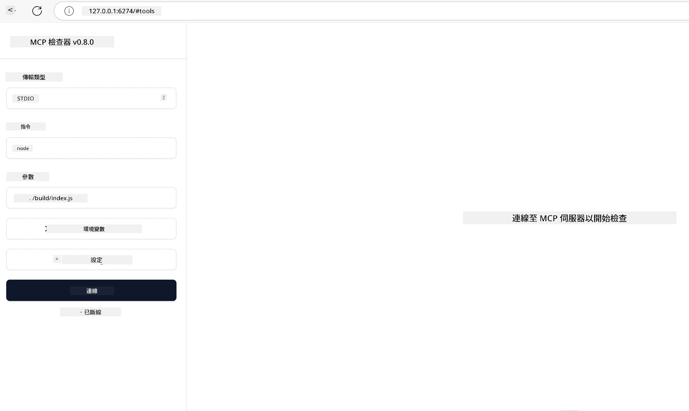

## 測試與除錯

在開始測試您的 MCP 伺服器之前，了解可用的工具和除錯最佳實踐非常重要。有效的測試能確保您的伺服器表現符合預期，並幫助您快速識別和解決問題。以下章節說明驗證您的 MCP 實作的建議方法。

## 概述

本課程涵蓋如何選擇合適的測試方法及最有效的測試工具。

## 學習目標

在本課程結束後，您將能夠：

- 描述各種測試方法。
- 使用不同工具有效測試您的程式碼。


## MCP 伺服器測試

MCP 提供工具協助您測試與除錯您的伺服器：

- **MCP Inspector**：一個可在命令列模式與視覺模式運行的工具。
- <strong>手動測試</strong>：您可以使用 curl 等工具執行網路請求，任何能運行 HTTP 的工具皆可。
- <strong>單元測試</strong>：可使用您喜歡的測試框架來測試伺服器和用戶端的功能。

### 使用 MCP Inspector

我們在先前課程中已介紹此工具的使用方式，這裡簡單提及。它是用 Node.js 建立的工具，可透過呼叫 `npx` 執行檔來使用，該指令會暫時下載並安裝工具，執行完您的請求後會自動清理。

[MCP Inspector](https://github.com/modelcontextprotocol/inspector) 可協助您：

- <strong>發現伺服器能力</strong>：自動偵測可用的資源、工具與提示
- <strong>測試工具執行</strong>：嘗試不同參數並即時查看回應
- <strong>檢視伺服器元資料</strong>：檢視伺服器資訊、結構與設定

工具的一般執行方式如下：

```bash
npx @modelcontextprotocol/inspector node build/index.js
```

上方指令會啟動 MCP 及其視覺介面，在您的瀏覽器開啟本機網頁介面。您將看到儀表板顯示已註冊的 MCP 伺服器、其可用的工具、資源及提示。介面允許您互動式測試工具執行、檢查伺服器元資料並即時查看回應，使驗證與除錯 MCP 伺服器實作更為方便。

介面範例如下：

您也可以使用 CLI 模式執行此工具，方法是加入 `--cli` 參數。以下是以「CLI」模式運行且列出伺服器上所有工具的範例：

```sh
npx @modelcontextprotocol/inspector --cli node build/index.js --method tools/list
```

### 手動測試

除了使用 Inspector 工具測試伺服器能力外，另一相似方法是使用支援 HTTP 的用戶端工具，例如 curl。

使用 curl，您可以直接透過 HTTP 請求測試 MCP 伺服器：

```bash
# 範例：測試伺服器元資料
curl http://localhost:3000/v1/metadata

# 範例：執行工具
curl -X POST http://localhost:3000/v1/tools/execute \
  -H "Content-Type: application/json" \
  -d '{"name": "calculator", "parameters": {"expression": "2+2"}}'
```

如上使用 curl 範例所示，您透過 POST 請求調用工具，並在請求負載中包含工具名稱及其參數。請選擇最適合您的方式。CLI 工具通常較快速且易於撰寫腳本，可適用於 CI/CD 環境。

### 單元測試

為您的工具與資源建立單元測試，確保其運作如預期。以下是部分測試程式碼範例。

```python
import pytest

from mcp.server.fastmcp import FastMCP
from mcp.shared.memory import (
    create_connected_server_and_client_session as create_session,
)

# 標記整個模組為非同步測試
pytestmark = pytest.mark.anyio


async def test_list_tools_cursor_parameter():
    """Test that the cursor parameter is accepted for list_tools.

    Note: FastMCP doesn't currently implement pagination, so this test
    only verifies that the cursor parameter is accepted by the client.
    """

 server = FastMCP("test")

    # 建立幾個測試工具
    @server.tool(name="test_tool_1")
    async def test_tool_1() -> str:
        """First test tool"""
        return "Result 1"

    @server.tool(name="test_tool_2")
    async def test_tool_2() -> str:
        """Second test tool"""
        return "Result 2"

    async with create_session(server._mcp_server) as client_session:
        # 測試無游標參數（省略）
        result1 = await client_session.list_tools()
        assert len(result1.tools) == 2

        # 測試游標為 None
        result2 = await client_session.list_tools(cursor=None)
        assert len(result2.tools) == 2

        # 測試游標為字串
        result3 = await client_session.list_tools(cursor="some_cursor_value")
        assert len(result3.tools) == 2

        # 測試游標為空字串
        result4 = await client_session.list_tools(cursor="")
        assert len(result4.tools) == 2
    
```

上述程式碼執行以下動作：

- 利用 pytest 框架，您可以撰寫函式形式的測試及 assert 陳述式。
- 創建一個含兩個不同工具的 MCP 伺服器。
- 使用 `assert` 陳述式檢查特定條件是否成立。

請參考 [完整檔案連結](https://github.com/modelcontextprotocol/python-sdk/blob/main/tests/client/test_list_methods_cursor.py)

依據以上檔案，您可測試自己的伺服器，確保其功能如預期建立。

所有主要 SDK 都有類似的測試部分，您可以依所選的執行環境做調整。

## 範例 

- [Java 計算器](../samples/java/calculator/README.md)
- [.Net 計算器](../../../../03-GettingStarted/samples/csharp)
- [JavaScript 計算器](../samples/javascript/README.md)
- [TypeScript 計算器](../samples/typescript/README.md)
- [Python 計算器](../../../../03-GettingStarted/samples/python) 

## 附加資源

- [Python SDK](https://github.com/modelcontextprotocol/python-sdk)

## 接下來做什麼

- 接下來： [部署](../09-deployment/README.md)

---

<!-- CO-OP TRANSLATOR DISCLAIMER START -->
**免責聲明**：
此文件已使用 AI 翻譯服務 [Co-op Translator](https://github.com/Azure/co-op-translator) 進行翻譯。雖然我們努力追求準確性，但請注意自動翻譯可能包含錯誤或不準確之處。原始文件的母語版本應視為權威來源。對於關鍵資訊，建議採用專業人工翻譯。我們不對因使用此翻譯所產生的任何誤解或誤譯承擔責任。
<!-- CO-OP TRANSLATOR DISCLAIMER END -->