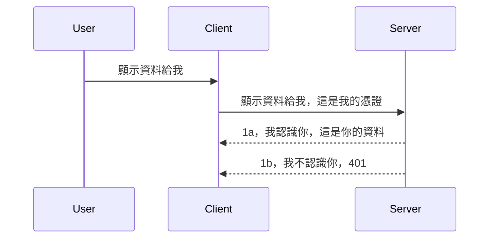

# 簡易認證

MCP SDK 支援使用 OAuth 2.1，說實話這是一個相當複雜的流程，涉及認證伺服器（auth server）、資源伺服器（resource server）、提交憑證、取得代碼、用代碼換取授權令牌（bearer token）直到終於取得資源資料。如果你不熟悉 OAuth，這是一個很棒且值得實作的東西，建議你先從基本的認證開始，然後逐步提升到更好的安全機制。這也是本章節存在的原因，幫助你逐步進入更進階的認證。

## 認證，我們指的是什麼？

認證是 authentication 和 authorization 的簡稱。重點是我們需要做兩件事：

- **身分驗證（Authentication）**，判斷是否讓這個人進入我們的「家」，也就是判斷他是否有權限「在這裡」，也就是是否有存取我們 MCP 伺服器功能所在的資源伺服器權限。
- **授權（Authorization）**，判斷使用者是否應該能存取他要求的特定資源，例如這些訂單、這些產品，或者他只能讀取內容，不能刪除等等。

## 憑證：我們如何告訴系統我們是誰

大多數網頁開發者會開始用提供給伺服器的憑證來思考，通常是一個秘密（secret），告訴它這個人是否被允許進入「身分驗證」。這個憑證通常是經過 base64 編碼的使用者名稱和密碼，或是一個能唯一識別特定使用者的 API 金鑰。

這通常是透過一個名為 "Authorization" 的標頭傳送，如下：

```json
{ "Authorization": "secret123" }
```

這通常稱為基本認證（basic authentication）。整體流程如下：


既然了解流程，我們該如何實作呢？大多數網頁伺服器都有一個叫做 middleware 的概念，它會作為請求的一部分執行，可用來驗證憑證，如果憑證有效就允許請求通過。如果請求沒有有效的憑證，則會收到認證錯誤。以下示範如何實作：

**Python**

```python
class AuthMiddleware(BaseHTTPMiddleware):
    async def dispatch(self, request, call_next):

        has_header = request.headers.get("Authorization")
        if not has_header:
            print("-> Missing Authorization header!")
            return Response(status_code=401, content="Unauthorized")

        if not valid_token(has_header):
            print("-> Invalid token!")
            return Response(status_code=403, content="Forbidden")

        print("Valid token, proceeding...")
       
        response = await call_next(request)
        # 在回應中新增任何客戶端標頭或以某種方式更改回應
        return response


starlette_app.add_middleware(CustomHeaderMiddleware)
```

在這裡我們：

- 建立了一個名為 `AuthMiddleware` 的中介軟體，其 `dispatch` 方法會由網頁伺服器呼叫。
- 將這個 middleware 加入網頁伺服器：

    ```python
    starlette_app.add_middleware(AuthMiddleware)
    ```

- 撰寫驗證邏輯，檢查是否有 Authorization 標頭且送出的秘密是否合法：

    ```python
    has_header = request.headers.get("Authorization")
    if not has_header:
        print("-> Missing Authorization header!")
        return Response(status_code=401, content="Unauthorized")

    if not valid_token(has_header):
        print("-> Invalid token!")
        return Response(status_code=403, content="Forbidden")
    ```

如果秘密存在且有效，我們就呼叫 `call_next` 讓請求通過並回傳回應。

    ```python
    response = await call_next(request)
    # 在回應中新增任何自訂標頭或進行某種更改
    return response
    ```

其運作方式是，當有網頁請求被送到伺服器時，中介軟體會被呼叫，根據實作要麼讓請求繼續通過，要麼回傳一個錯誤表示客戶端不被允許。

**TypeScript**

這裡以流行的 Express 框架建立 middleware，在請求抵達 MCP Server 前攔截。以下是程式碼：

```typescript
function isValid(secret) {
    return secret === "secret123";
}

app.use((req, res, next) => {
    // 1. 有授權標頭嗎？
    if(!req.headers["Authorization"]) {
        res.status(401).send('Unauthorized');
    }
    
    let token = req.headers["Authorization"];

    // 2. 檢查有效性。
    if(!isValid(token)) {
        res.status(403).send('Forbidden');
    }

   
    console.log('Middleware executed');
    // 3. 將請求傳遞到請求流程的下一個步驟。
    next();
});
```

程式中我們：

1. 先確認是否有 Authorization 標頭，沒有的話回傳 401 錯誤。
2. 驗證憑證／令牌是否有效，否則回傳 403 錯誤。
3. 最後讓請求繼續往下執行並回傳所請求的資源。

## 練習：實作認證

將我們的知識付諸實作，計畫如下：

伺服器端

- 建立網頁伺服器與 MCP 實例。
- 為伺服器實作 middleware。

客戶端

- 透過標頭傳送帶憑證的網路請求。

### -1- 建立網頁伺服器與 MCP 實例

第一步，建立網頁伺服器實例與 MCP Server。

**Python**

這裡建立 MCP Server 實例，建立 starlette 網頁應用並用 uvicorn 掛載。

```python
# 建立 MCP 伺服器

app = FastMCP(
    name="MCP Resource Server",
    instructions="Resource Server that validates tokens via Authorization Server introspection",
    host=settings["host"],
    port=settings["port"],
    debug=True
)

# 建立 starlette 網頁應用程式
starlette_app = app.streamable_http_app()

# 透過 uvicorn 提供應用程式服務
async def run(starlette_app):
    import uvicorn
    config = uvicorn.Config(
            starlette_app,
            host=app.settings.host,
            port=app.settings.port,
            log_level=app.settings.log_level.lower(),
        )
    server = uvicorn.Server(config)
    await server.serve()

run(starlette_app)
```

程式中我們：

- 建立 MCP Server。
- 從 MCP Server 建構 starlette 網頁應用 `app.streamable_http_app()`。
- 透過 uvicorn `server.serve()` 掛載與提供服務。

**TypeScript**

這裡建立 MCP Server 實例。

```typescript
const server = new McpServer({
      name: "example-server",
      version: "1.0.0"
    });

    // ... 設置伺服器資源、工具和提示 ...
```

這段 MCP Server 的建立需要放到 POST /mcp 路由定義裡，所以我們將程式移動成這樣：

```typescript
import express from "express";
import { randomUUID } from "node:crypto";
import { McpServer } from "@modelcontextprotocol/sdk/server/mcp.js";
import { StreamableHTTPServerTransport } from "@modelcontextprotocol/sdk/server/streamableHttp.js";
import { isInitializeRequest } from "@modelcontextprotocol/sdk/types.js"

const app = express();
app.use(express.json());

// 使用 session ID 儲存傳輸方式的映射
const transports: { [sessionId: string]: StreamableHTTPServerTransport } = {};

// 處理客戶端到伺服器的 POST 請求
app.post('/mcp', async (req, res) => {
  // 檢查是否存在 session ID
  const sessionId = req.headers['mcp-session-id'] as string | undefined;
  let transport: StreamableHTTPServerTransport;

  if (sessionId && transports[sessionId]) {
    // 重用現有的傳輸方式
    transport = transports[sessionId];
  } else if (!sessionId && isInitializeRequest(req.body)) {
    // 新的初始化請求
    transport = new StreamableHTTPServerTransport({
      sessionIdGenerator: () => randomUUID(),
      onsessioninitialized: (sessionId) => {
        // 透過 session ID 儲存傳輸方式
        transports[sessionId] = transport;
      },
      // DNS 重綁定保護預設為關閉，以保持向後相容性。如果你在本地運行此伺服器
      // 請確保設定：
      // enableDnsRebindingProtection: true,
      // allowedHosts: ['127.0.0.1'],
    });

    // 傳輸關閉時清理資源
    transport.onclose = () => {
      if (transport.sessionId) {
        delete transports[transport.sessionId];
      }
    };
    const server = new McpServer({
      name: "example-server",
      version: "1.0.0"
    });

    // ... 設置伺服器資源、工具和提示 ...

    // 連接 MCP 伺服器
    await server.connect(transport);
  } else {
    // 無效的請求
    res.status(400).json({
      jsonrpc: '2.0',
      error: {
        code: -32000,
        message: 'Bad Request: No valid session ID provided',
      },
      id: null,
    });
    return;
  }

  // 處理請求
  await transport.handleRequest(req, res, req.body);
});

// GET 和 DELETE 請求的可重用處理器
const handleSessionRequest = async (req: express.Request, res: express.Response) => {
  const sessionId = req.headers['mcp-session-id'] as string | undefined;
  if (!sessionId || !transports[sessionId]) {
    res.status(400).send('Invalid or missing session ID');
    return;
  }
  
  const transport = transports[sessionId];
  await transport.handleRequest(req, res);
};

// 處理透過 SSE 的伺服器到客戶端通知的 GET 請求
app.get('/mcp', handleSessionRequest);

// 處理會話終止的 DELETE 請求
app.delete('/mcp', handleSessionRequest);

app.listen(3000);
```

你可以看到 MCP Server 的建立已經移動到 `app.post("/mcp")` 中。

接下來我們要建立 middleware 來驗證進來的憑證。

### -2- 為伺服器實作 middleware

接著進入 middleware 部分。會建立一個 middleware 檢查 `Authorization` 標頭中的憑證是否有效。如果合格，請求就會繼續往下執行（例如列出工具、讀取資源或客戶端要求的 MCP 功能）。

**Python**

要建立 middleware，我們需要繼承 `BaseHTTPMiddleware` 類別。有兩個重要參數：

- `request`，我們用來讀取標頭資訊。
- `call_next`，如果客戶端帶來可接受的憑證，我們要呼叫它。

首先，處理 `Authorization` 標頭缺失的情況：

```python
has_header = request.headers.get("Authorization")

# 沒有標頭，回傳401錯誤，否則繼續。
if not has_header:
    print("-> Missing Authorization header!")
    return Response(status_code=401, content="Unauthorized")
```

當客戶端驗證失敗時，回傳 401 未授權訊息。

接著，如果有提交憑證，我們要檢查它是否合法：

```python
 if not valid_token(has_header):
    print("-> Invalid token!")
    return Response(status_code=403, content="Forbidden")
```

注意此處回傳 403 禁止存取訊息。以下是完整 middleware 實作：

```python
class AuthMiddleware(BaseHTTPMiddleware):
    async def dispatch(self, request, call_next):

        has_header = request.headers.get("Authorization")
        if not has_header:
            print("-> Missing Authorization header!")
            return Response(status_code=401, content="Unauthorized")

        if not valid_token(has_header):
            print("-> Invalid token!")
            return Response(status_code=403, content="Forbidden")

        print("Valid token, proceeding...")
        print(f"-> Received {request.method} {request.url}")
        response = await call_next(request)
        response.headers['Custom'] = 'Example'
        return response

```

很好，那 `valid_token` 函式呢？看下面：

```python
# 不要用於生產環境 - 請改進它 !!
def valid_token(token: str) -> bool:
    # 移除 "Bearer " 前綴
    if token.startswith("Bearer "):
        token = token[7:]
        return token == "secret-token"
    return False
```

此函式當然可改進。

重要提示：絕對不要將秘密鎖定在程式碼中。理想狀況是從資料來源或身份提供者（IDP）取得比較值，甚至讓 IDP 直接負責驗證。

**TypeScript**

用 Express 實作，我們呼叫 `use` 方法，並傳入 middleware 函式。

我們要：

- 檢查請求物件中 `Authorization` 屬性的憑證。
- 驗證憑證，如果正確就讓請求繼續執行，使 MCP 請求完成（例如列出工具、讀取資源或其它 MCP 相關功能）。

此段程式碼用來確認是否有 `Authorization` 標頭，沒有的話停止請求：

```typescript
if(!req.headers["authorization"]) {
    res.status(401).send('Unauthorized');
    return;
}
```

若標頭沒有送出，返回 401。

接著檢查憑證是否合法，不合法則用不同訊息停止請求：

```typescript
if(!isValid(token)) {
    res.status(403).send('Forbidden');
    return;
} 
```

此時回傳 403。

完整程式碼如下：

```typescript
app.use((req, res, next) => {
    console.log('Request received:', req.method, req.url, req.headers);
    console.log('Headers:', req.headers["authorization"]);
    if(!req.headers["authorization"]) {
        res.status(401).send('Unauthorized');
        return;
    }
    
    let token = req.headers["authorization"];

    if(!isValid(token)) {
        res.status(403).send('Forbidden');
        return;
    }  

    console.log('Middleware executed');
    next();
});
```

我們已經設好網頁伺服器接受 middleware 以檢查客戶端憑證。客戶端如何實作呢？

### -3- 用標頭傳送帶憑證的網路請求

要確保客戶端在標頭中帶憑證。因為要使用 MCP 客戶端，我們要知道怎麼做。

**Python**

客戶端需帶入包含憑證的標頭，如下：

```python
# 不要硬編碼該值，至少要放在環境變數或更安全的儲存中
token = "secret-token"

async with streamablehttp_client(
        url = f"http://localhost:{port}/mcp",
        headers = {"Authorization": f"Bearer {token}"}
    ) as (
        read_stream,
        write_stream,
        session_callback,
    ):
        async with ClientSession(
            read_stream,
            write_stream
        ) as session:
            await session.initialize()
      
            # 待辦，在客戶端你想做的事情，例如列出工具、呼叫工具等等。
```

注意我們如何填寫 `headers`，格式為 `headers = {"Authorization": f"Bearer {token}"}`。

**TypeScript**

我們分兩步驟做：

1. 建立帶憑證的設定物件。
2. 將該設定物件傳給傳輸層。

```typescript

// 不要像這裡顯示的那樣硬編碼值。至少應該將其設為環境變數，並在開發模式中使用 dotenv 之類的工具。
let token = "secret123"

// 定義一個客戶端傳輸選項物件
let options: StreamableHTTPClientTransportOptions = {
  sessionId: sessionId,
  requestInit: {
    headers: {
      "Authorization": "secret123"
    }
  }
};

// 將選項物件傳遞給傳輸層
async function main() {
   const transport = new StreamableHTTPClientTransport(
      new URL(serverUrl),
      options
   );
```

上面程式展示如何建立 `options` 物件，並把標頭放在 `requestInit` 屬性下。

重要提示：如何改進？目前寫法有風險，除非你至少使用 HTTPS，不然憑證易遭竊取。因此需要系統能輕易撤銷 Token，還要額外檢查來源位置、是否過於頻繁請求（機器人行為）、簡言之有一堆考量。

不過要說的是，對非常簡單的 API，且你不希望無權訪問，這樣已經是很好的開端。

話雖如此，我們嘗試用標準格式的 JSON Web Token（JWT，也稱 JOT 令牌）來強化安全。

## JSON Web Tokens，JWT

想從簡易憑證改進，有哪些立即好處？

- **安全性提升**。基本認證中，使用者名稱和密碼會一再以 base64 編碼方式發送（或是 API 金鑰），增加風險。JWT 則是先用姓名密碼換取令牌，且令牌有時效限制。JWT 讓細粒度存取控制成為可能，如角色、範圍及存取權限。
- **無狀態與可擴充性**。JWT 是自包含的，攜帶所有使用者資訊，不需伺服器狀態儲存。令牌也可本地驗證。
- **相容性與聯合身份**。JWT 是 Open ID Connect 核心，常用於知名身份提供者如 Entra ID、Google Identity 及 Auth0。也支援單一登入等企業級功能。
- **模組化與彈性**。JWT 可搭配 API Gateway 如 Azure API Management、NGINX 等使用，也支援使用者認證與伺服器間通訊（含代理與委派情境）。
- **效能與快取**。JWT 解碼後可快取，降低解析需求，有助於高流量應用提高吞吐量並減輕基礎架構負擔。
- **進階功能**。支援後設資料檢視（introspection，檢查令牌有效性）及撤銷（使令牌失效）。

有了這些優點，讓我們看看如何提升現有實作。

## 把基本認證改成 JWT

首先，我們需要做到：

- **建立 JWT 令牌**，讓客戶端發送到伺服器。
- **驗證 JWT 令牌**，符合條件就授權客戶端使用資源。
- **安全的令牌保存**。如何保存令牌。
- **保護路由**。保護特定路由和 MCP 功能。
- **加入更新令牌**。確保建立短期存活的存取令牌，以及長期存活的更新令牌以取得新令牌，同時有更新端點與旋轉策略。

### -1- 建立 JWT 令牌

JWT 令牌由下列部分組成：

- **header**，使用演算法和令牌類型。
- **payload**，攜帶的權益（claims），如 sub（代表令牌的使用者或實體，通常是 userId）、exp（過期時間）、role（角色）。
- **signature**，使用秘密或私鑰簽署。

我們需要建立 header、payload 並產生編碼令牌。

**Python**

```python

import jwt
import jwt
from jwt.exceptions import ExpiredSignatureError, InvalidTokenError
import datetime

# 用於簽署 JWT 的秘密金鑰
secret_key = 'your-secret-key'

header = {
    "alg": "HS256",
    "typ": "JWT"
}

# 使用者資訊及其聲明和過期時間
payload = {
    "sub": "1234567890",               # 主體（使用者 ID）
    "name": "User Userson",                # 自訂聲明
    "admin": True,                     # 自訂聲明
    "iat": datetime.datetime.utcnow(),# 發行時間
    "exp": datetime.datetime.utcnow() + datetime.timedelta(hours=1)  # 到期時間
}

# 編碼它
encoded_jwt = jwt.encode(payload, secret_key, algorithm="HS256", headers=header)
```

程式中：

- 定義 header，使用 HS256 以及類型為 JWT。
- 建立 payload，包含主體（user id）、使用者名稱、角色、發行時間與過期時間，實作了前述的時效性。

**TypeScript**

我們需要一些相依套件協助建立 JWT。

相依套件

```sh

npm install jsonwebtoken
npm install --save-dev @types/jsonwebtoken
```

安裝好後，建立 header、payload，從而產生編碼令牌。

```typescript
import jwt from 'jsonwebtoken';

const secretKey = 'your-secret-key'; // 在生產環境中使用環境變數

// 定義載荷
const payload = {
  sub: '1234567890',
  name: 'User usersson',
  admin: true,
  iat: Math.floor(Date.now() / 1000), // 發行時間
  exp: Math.floor(Date.now() / 1000) + 60 * 60 // 一小時後過期
};

// 定義標頭（可選，jsonwebtoken 設定預設值）
const header = {
  alg: 'HS256',
  typ: 'JWT'
};

// 創建令牌
const token = jwt.sign(payload, secretKey, {
  algorithm: 'HS256',
  header: header
});

console.log('JWT:', token);
```

此令牌：

使用 HS256 簽署  
有效期限 1 小時  
包含 sub、name、admin、iat 和 exp 欄位。

### -2- 驗證令牌

伺服器端需要驗證令牌，確保客戶端送上來的真確有效。驗證時要檢查結構、有效性等。建議也加上是否為系統使用者及是否有權限等額外檢查。

驗證令牌需要先對其解碼，解析後檢查有效性：

**Python**

```python

# 解碼並驗證 JWT
try:
    decoded = jwt.decode(token, secret_key, algorithms=["HS256"])
    print("✅ Token is valid.")
    print("Decoded claims:")
    for key, value in decoded.items():
        print(f"  {key}: {value}")
except ExpiredSignatureError:
    print("❌ Token has expired.")
except InvalidTokenError as e:
    print(f"❌ Invalid token: {e}")

```

程式呼叫 `jwt.decode`，使用令牌、祕密金鑰與指定演算法。利用 try-catch 處理錯誤，驗證失敗會產生例外。

**TypeScript**

呼叫 `jwt.verify` 取得解碼後的令牌，以便進一步分析。若失敗，說明令牌格式錯誤或已失效。

```typescript

try {
  const decoded = jwt.verify(token, secretKey);
  console.log('Decoded Payload:', decoded);
} catch (err) {
  console.error('Token verification failed:', err);
}
```

注意：如前所述，應進行額外檢查，確保該令牌確實對應系統中的使用者，且確保該使用者擁有宣稱的權限。

接下來，讓我們來看看基於角色的存取控制（RBAC）。
## 添加基於角色的存取控制

想法是我們希望表達不同角色擁有不同的權限。例如，我們假設管理員可以執行所有操作，而普通用戶可以讀取/寫入，訪客則只能讀取。因此，這裡有一些可能的權限級別：

- Admin.Write 
- User.Read
- Guest.Read

讓我們來看看如何用中介軟體實現這樣的控制。中介軟體可以針對每個路由或所有路由添加。

**Python**

```python
from starlette.middleware.base import BaseHTTPMiddleware
from starlette.responses import JSONResponse
import jwt

# 不要將密鑰寫在程式碼中，這只是示範用途。請從安全的地方讀取。
SECRET_KEY = "your-secret-key" # 放在環境變量中
REQUIRED_PERMISSION = "User.Read"

class JWTPermissionMiddleware(BaseHTTPMiddleware):
    async def dispatch(self, request, call_next):
        auth_header = request.headers.get("Authorization")
        if not auth_header or not auth_header.startswith("Bearer "):
            return JSONResponse({"error": "Missing or invalid Authorization header"}, status_code=401)

        token = auth_header.split(" ")[1]
        try:
            decoded = jwt.decode(token, SECRET_KEY, algorithms=["HS256"])
        except jwt.ExpiredSignatureError:
            return JSONResponse({"error": "Token expired"}, status_code=401)
        except jwt.InvalidTokenError:
            return JSONResponse({"error": "Invalid token"}, status_code=401)

        permissions = decoded.get("permissions", [])
        if REQUIRED_PERMISSION not in permissions:
            return JSONResponse({"error": "Permission denied"}, status_code=403)

        request.state.user = decoded
        return await call_next(request)


```

有幾種不同的方式可以添加中介軟體，如下所示：

```python

# 方案 1：在構建 starlette 應用時新增中介軟體
middleware = [
    Middleware(JWTPermissionMiddleware)
]

app = Starlette(routes=routes, middleware=middleware)

# 方案 2：在 starlette 應用已經構建後新增中介軟體
starlette_app.add_middleware(JWTPermissionMiddleware)

# 方案 3：為每個路由新增中介軟體
routes = [
    Route(
        "/mcp",
        endpoint=..., # 處理器
        middleware=[Middleware(JWTPermissionMiddleware)]
    )
]
```

**TypeScript**

我們可以使用 `app.use` 和一個會對所有請求運行的中介軟體。

```typescript
app.use((req, res, next) => {
    console.log('Request received:', req.method, req.url, req.headers);
    console.log('Headers:', req.headers["authorization"]);

    // 1. 檢查是否已傳送授權標頭

    if(!req.headers["authorization"]) {
        res.status(401).send('Unauthorized');
        return;
    }
    
    let token = req.headers["authorization"];

    // 2. 檢查令牌是否有效
    if(!isValid(token)) {
        res.status(403).send('Forbidden');
        return;
    }  

    // 3. 檢查令牌使用者是否存在於我們的系統中
    if(!isExistingUser(token)) {
        res.status(403).send('Forbidden');
        console.log("User does not exist");
        return;
    }
    console.log("User exists");

    // 4. 驗證令牌是否具有正確的權限
    if(!hasScopes(token, ["User.Read"])){
        res.status(403).send('Forbidden - insufficient scopes');
    }

    console.log("User has required scopes");

    console.log('Middleware executed');
    next();
});

```

我們可以讓中介軟體做不少事情，而且中介軟體應該做的事情包括：

1. 檢查是否存在授權標頭
2. 檢查令牌是否有效，我們呼叫 `isValid`，這是一個我們撰寫用來檢查 JWT 令牌完整性和有效性的方法。
3. 驗證使用者是否存在於我們的系統中，我們應該檢查這一點。

   ```typescript
    // 資料庫中的使用者
   const users = [
     "user1",
     "User usersson",
   ]

   function isExistingUser(token) {
     let decodedToken = verifyToken(token);

     // 待辦，檢查使用者是否存在於資料庫中
     return users.includes(decodedToken?.name || "");
   }
   ```

   如上所示，我們建立了一個非常簡單的 `users` 清單，當然這應該放在資料庫裡。

4. 此外，我們還應該檢查令牌是否具有正確的權限。

   ```typescript
   if(!hasScopes(token, ["User.Read"])){
        res.status(403).send('Forbidden - insufficient scopes');
   }
   ```

   在上述中介軟體程式碼中，我們檢查令牌是否包含 User.Read 權限，若沒有則回傳 403 錯誤。下面是 `hasScopes` 輔助方法。

   ```typescript
   function hasScopes(scope: string, requiredScopes: string[]) {
     let decodedToken = verifyToken(scope);
    return requiredScopes.every(scope => decodedToken?.scopes.includes(scope));
  }
   ```

Have a think which additional checks you should be doing, but these are the absolute minimum of checks you should be doing.

Using Express as a web framework is a common choice. There are helpers library when you use JWT so you can write less code.

- `express-jwt`, helper library that provides a middleware that helps decode your token.
- `express-jwt-permissions`, this provides a middleware `guard` that helps check if a certain permission is on the token.

Here's what these libraries can look like when used:

```typescript
const express = require('express');
const jwt = require('express-jwt');
const guard = require('express-jwt-permissions')();

const app = express();
const secretKey = 'your-secret-key'; // put this in env variable

// Decode JWT and attach to req.user
app.use(jwt({ secret: secretKey, algorithms: ['HS256'] }));

// Check for User.Read permission
app.use(guard.check('User.Read'));

// multiple permissions
// app.use(guard.check(['User.Read', 'Admin.Access']));

app.get('/protected', (req, res) => {
  res.json({ message: `Welcome ${req.user.name}` });
});

// Error handler
app.use((err, req, res, next) => {
  if (err.code === 'permission_denied') {
    return res.status(403).send('Forbidden');
  }
  next(err);
});

```

現在你已經看到中介軟體可用於身份驗證和授權，那 MCP 呢？它是否改變了我們做身份驗證的方式？讓我們在下一節中找出答案。

### -3- 為 MCP 添加 RBAC

到目前為止，你已經看到如何透過中介軟體添加 RBAC，然而對於 MCP，沒有簡單的方法可以為每個 MCP 功能添加 RBAC，那該怎麼辦？我們只能添加像這樣的程式碼，在該例中檢查用戶端是否有呼叫特定工具的權限：

你有幾種不同選擇來完成每個功能的 RBAC，這裡列出一些：

- 為每個工具、資源、提示添加權限級別檢查。

   **python**

   ```python
   @tool()
   def delete_product(id: int):
      try:
          check_permissions(role="Admin.Write", request)
      catch:
        pass # 用戶端授權失敗，引發授權錯誤
   ```

   **typescript**

   ```typescript
   server.registerTool(
    "delete-product",
    {
      title: Delete a product",
      description: "Deletes a product",
      inputSchema: { id: z.number() }
    },
    async ({ id }) => {
      
      try {
        checkPermissions("Admin.Write", request);
        // 待辦，將 id 傳送到 productService 和遠端入口
      } catch(Exception e) {
        console.log("Authorization error, you're not allowed");  
      }

      return {
        content: [{ type: "text", text: `Deletected product with id ${id}` }]
      };
    }
   );
   ```


- 使用進階伺服器方法和請求處理器以最小化檢查位置數量。

   **Python**

   ```python
   
   tool_permission = {
      "create_product": ["User.Write", "Admin.Write"],
      "delete_product": ["Admin.Write"]
   }

   def has_permission(user_permissions, required_permissions) -> bool:
      # user_permissions: 使用者擁有的權限列表
      # required_permissions: 工具所需的權限列表
      return any(perm in user_permissions for perm in required_permissions)

   @server.call_tool()
   async def handle_call_tool(
     name: str, arguments: dict[str, str] | None
   ) -> list[types.TextContent]:
    # 假設 request.user.permissions 是使用者的權限列表
     user_permissions = request.user.permissions
     required_permissions = tool_permission.get(name, [])
     if not has_permission(user_permissions, required_permissions):
        # 引發錯誤 "您沒有權限調用工具 {name}"
        raise Exception(f"You don't have permission to call tool {name}")
     # 繼續並調用工具
     # ...
   ```   
   

   **TypeScript**

   ```typescript
   function hasPermission(userPermissions: string[], requiredPermissions: string[]): boolean {
       if (!Array.isArray(userPermissions) || !Array.isArray(requiredPermissions)) return false;
       // 如果使用者至少擁有一項所需權限則回傳真
       
       return requiredPermissions.some(perm => userPermissions.includes(perm));
   }
  
   server.setRequestHandler(CallToolRequestSchema, async (request) => {
      const { params: { name } } = request;
  
      let permissions = request.user.permissions;
  
      if (!hasPermission(permissions, toolPermissions[name])) {
         return new Error(`You don't have permission to call ${name}`);
      }
  
      // 繼續..
   });
   ```

   注意，你需要確保你的中介軟體將解碼後的令牌指派給請求的 user 屬性，這樣上面的程式碼才能簡化。

### 總結

現在我們已經討論了如何一般性地以及特別針對 MCP 添加 RBAC 支援，是時候嘗試自行實作安全性，以確保你理解呈現給你的概念。

## 作業 1：使用基本身份驗證建立 MCP 伺服器和 MCP 用戶端

這裡你將應用之前學到的通過標頭發送憑證的知識。

## 解答 1

[Solution 1](./code/basic/README.md)

## 作業 2：將作業 1 的解決方案升級為使用 JWT

採用第一個解決方案，但這次讓我們改進它。

不使用基本身份驗證，改用 JWT。

## 解答 2

[Solution 2](./solution/jwt-solution/README.md)

## 挑戰

新增每個工具的 RBAC，如同「為 MCP 添加 RBAC」章節中描述。

## 摘要

你應該在本章學到許多東西，從完全沒有安全性、到基本安全性，再到 JWT 以及如何將其添加到 MCP。

我們已經建立了一個穩固的基礎，使用自訂 JWT，但隨著規模擴大，我們正朝著標準化的身份模型邁進。採用像 Entra 或 Keycloak 這樣的身份提供者（IdP）可以讓我們將令牌發行、驗證和生命週期管理委託給一個受信任的平台──讓我們能專注於應用程式邏輯和使用者體驗。

為此，我們有一章更[進階的 Entra](../../05-AdvancedTopics/mcp-security-entra/README.md)主題。

## 下一步

- 下一章：[設定 MCP 主機](../12-mcp-hosts/README.md)

---

<!-- CO-OP TRANSLATOR DISCLAIMER START -->
**免責聲明**：  
本文件係使用 AI 翻譯服務 [Co-op Translator](https://github.com/Azure/co-op-translator) 進行翻譯。雖然我們致力於確保翻譯準確，但請注意，自動翻譯可能包含錯誤或不準確之處。原始文件的原文版本應被視為權威來源。對於重要資訊，建議採用專業人工翻譯。我們不對因使用本翻譯所產生的任何誤解或誤釋負責。
<!-- CO-OP TRANSLATOR DISCLAIMER END -->