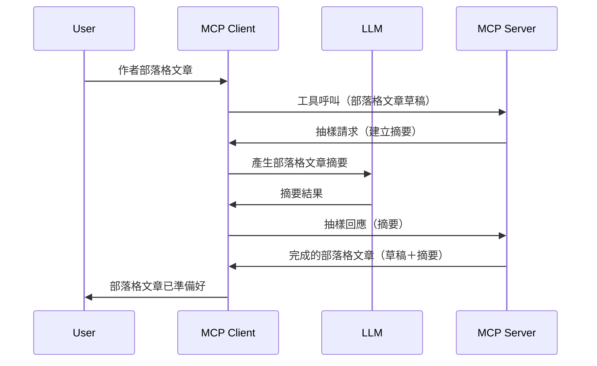

> [!WARNING]
> MCP `2026-07-28` 規範中已不建議使用 Sampling。本課程保留供舊有實作參考。新伺服器應直接與 LLM 供應商 API 整合。
> 
> 

# Sampling - 將功能委派給客戶端

> Sampling 仍在 `2026-07-28` 規範中以維持相容性，且可於 2027 年 7 月 28 日或之後釋出的首次修訂版中移除。本課程的範例可能使用實作了 `2025-11-25` 的 SDK API。請參閱 [MCP 變更說明：2026-07-28 規範](../../01-CoreConcepts/mcp-2026-07-28.md)。


## 概覽

本課程重點說明何時以及何處使用 Sampling 並說明其配置方法。

## 學習目標

在本章節中，我們將：

- 解釋 Sampling 是什麼以及何時使用。
- 示範如何在 MCP 中配置 Sampling。
- 提供 Sampling 實作的範例。

## Sampling 是什麼，為什麼使用它？

Sampling 是一項進階功能，其運作方式如下：



### Sampling 請求

好的，現在我們對一個合理場景有了宏觀了解，接著來談談伺服器發送回客戶端的 Sampling 請求。以下是該請求可能的 JSON-RPC 格式：

```json
{
  "jsonrpc": "2.0",
  "id": 1,
  "method": "sampling/createMessage",
  "params": {
    "messages": [
      {
        "role": "user",
        "content": {
          "type": "text",
          "text": "Create a blog post summary of the following blog post: <BLOG POST>"
        }
      }
    ],
    "modelPreferences": {
      "hints": [
        {
          "name": "claude-3-sonnet"
        }
      ],
      "intelligencePriority": 0.8,
      "speedPriority": 0.5
    },
    "systemPrompt": "You are a helpful assistant.",
    "maxTokens": 100
  }
}
```

這裡有幾點值得注意：

- 提示 (prompt)，位於 content -> text，是給 LLM 的指示，用於摘要部落格文章內容。

- **modelPreferences**。這部分僅是偏好，建議用於 LLM 的設定，使用者可以選擇採納或更改。在本例中建議了使用的模型、速度優先與智慧優先。
- **systemPrompt**，這是正常的系統提示，給 LLM 注入人格特質及指導說明。
- **maxTokens**，此屬性指定建議用於此任務的最大 token 數量。

### Sampling 回應

這個回應是 MCP 客戶端最後傳回給 MCP 伺服器的訊息，是客戶端呼叫 LLM、等待回應後組成的結果。以下為其 JSON-RPC 格式範例：

```json
{
  "jsonrpc": "2.0",
  "id": 1,
  "result": {
    "role": "assistant",
    "content": {
      "type": "text",
      "text": "Here's your abstract <ABSTRACT>"
    },
    "model": "gpt-5",
    "stopReason": "endTurn"
  }
}
```

請注意，回應是部落格文章的摘要，與我們的要求相符。另請注意使用的 `model` 不是請求時指定的，而是選擇了 "gpt-5" 而非 "claude-3-sonnet"。這是用來說明使用者สามารถ改變使用的模型，您的 sampling 請求只是建議。

好的，現在我們了解了主要流程及一個實用任務 "部落格文章創作＋摘要"，接著看如何實作使其運作。

### 訊息類型

Sampling 訊息不限於文字，也可以傳送圖片及音訊。以下為不同的 JSON-RPC 範例呈現：

<strong>文字</strong>

```json
{
  "type": "text",
  "text": "The message content"
}
```

<strong>圖片內容</strong>

```json
{
  "type": "image",
  "data": "base64-encoded-image-data",
  "mimeType": "image/jpeg"
}
```

<strong>音訊內容</strong>

```json
{
  "type": "audio",
  "data": "base64-encoded-audio-data",
  "mimeType": "audio/wav"
}
```

> 注意：關於目前狀態及遷移指引，請參閱
> [已棄用的 Sampling 文件](https://modelcontextprotocol.io/specification/2026-07-28/client/sampling)。

## 如何在客戶端配置 Sampling

> 注意：如果您僅構建伺服器，此處不需太多操作。

在客戶端，您需如下指定此功能：

```json
{
  "capabilities": {
    "sampling": {}
  }
}
```

這將在您選擇的客戶端與伺服器初始化時被讀取。

## Sampling 實作範例 - 創建部落格文章

我們來一起寫一個 sampling 伺服器，需做以下幾件事：

1. 在伺服器上建立一個工具。
1. 該工具應發出 sampling 請求。
1. 工具應等待客戶端回應 sampling 請求。
1. 然後產出工具結果。

讓我們一步步看程式碼：

### -1- 建立工具

**python**

```python
@mcp.tool()
async def create_blog(title: str, content: str, ctx: Context[ServerSession, None]) -> str:
    """Create a blog post and generate a summary"""

```

### -2- 發出 sampling 請求

扩展您的工具，加入以下程式碼：

**python**

```python
post = BlogPost(
        id=len(posts) + 1,
        title=title,
        content=content,
        abstract=""
    )

prompt = f"Create an abstract of the following blog post: title: {title} and draft: {content} "

result = await ctx.session.create_message(
        messages=[
            SamplingMessage(
                role="user",
                content=TextContent(type="text", text=prompt),
            )
        ],
        max_tokens=100,
)

```

### -3- 等待回應並返回結果

**python**

```python
post.abstract = result.content.text

posts.append(post)

# 返回完整的產品
return json.dumps({
    "id": post.title,
    "abstract": post.abstract
})
```

### -4- 完整程式碼

**python**

```python
from starlette.applications import Starlette
from starlette.routing import Mount, Host

from mcp.server.fastmcp import Context, FastMCP

from mcp.server.session import ServerSession
from mcp.types import SamplingMessage, TextContent

import json


from uuid import uuid4
from typing import List
from pydantic import BaseModel


mcp = FastMCP("Blog post generator")

# app = FastAPI()

posts = []

class BlogPost(BaseModel):
    id: int
    title: str
    content: str
    abstract: str

posts: List[BlogPost] = []

@mcp.tool()
async def create_blog(title: str, content: str, ctx: Context[ServerSession, None]) -> str:
    """Create a blog post and generate a summary"""

    post = BlogPost(
        id=len(posts) + 1,
        title=title,
        content=content,
        abstract=""
    )

    prompt = f"Create an abstract of the following blog post: title: {title} and draft: {content} "

    result = await ctx.session.create_message(
        messages=[
            SamplingMessage(
                role="user",
                content=TextContent(type="text", text=prompt),
            )
        ],
        max_tokens=100,
    )

    post.abstract = result.content.text

    posts.append(post)

    # 回傳完整的部落格文章
    return json.dumps({
        "id": post.title,
        "abstract": post.abstract
    })

if __name__ == "__main__":
    print("Starting server...")
    # mcp.run()
    mcp.run(transport="streamable-http")

# 使用以下方式執行應用程式：python server.py
```

### -5- 在 Visual Studio Code 中測試

在 Visual Studio Code 中測試，請執行以下步驟：

1. 在終端啟動伺服器
1. 將其加入 *mcp.json* （並確保啟動），大致如下：

   ```json
   "servers": {
      "blog-server": {
        "type": "http",
        "url": "http://localhost:8000/mcp"
      }
   }
   ```

1. 輸入提示：

   ```text
   create a blog post named "Where Python comes from", the content is "Python is actually named after Monty Python Flying Circus"
   ```

1. 允許 sampling 發生。首次測試時您會看到額外對話框需接受，隨後會出現正常詢問是否執行工具的對話框。

1. 檢視結果。您不僅會在 GitHub Copilot Chat 美觀呈現結果，也可檢視原始 JSON 回應。

<strong>獎勵</strong>。Visual Studio Code 工具支援 Sampling 非常完備。您可透過下列方式在已安裝伺服器上配置 Sampling 存取：

1. 進入擴充功能區。
1. 在 "MCP SERVERS - INSTALLED" 區段選擇您安裝的伺服器的齒輪圖示。
1 選擇「Configure Model Access」，此處可選擇 GitHub Copilot 在執行 Sampling 時允許使用的模型。您也可點選「Show Sampling requests」查看近期所有 Sampling 請求。

## 作業

在本作業中，您將構建一個稍不同的 Sampling，亦即支持生成產品描述的 sampling 整合。您的情境如下：

<strong>情境</strong>：電商後台人員感到生成產品描述耗時過長。因此，您要建構一個解決方案，允許以「title」與「keywords」作為參數呼叫一個名為 "create_product" 的工具，該工具會產出完整產品資料，其中 "description" 欄位由客戶端的 LLM 產生。

提示：利用先前所學，透過 sampling 請求來構建此伺服器及工具。

## 解決方案

[解決方案](./solution/README.md)

## 主要結論

Sampling 是一項強大的功能，讓伺服器在需要 LLM 協助時，能將任務委派給客戶端執行。

## 下一步

- [第 4 章 - 實務實作](../../04-PracticalImplementation/README.md)

---

<!-- CO-OP TRANSLATOR DISCLAIMER START -->
**免責聲明**：
此文件已使用 AI 翻譯服務 [Co-op Translator](https://github.com/Azure/co-op-translator) 進行翻譯。雖然我們努力追求準確性，但請注意自動翻譯可能包含錯誤或不準確之處。原始文件的母語版本應視為權威來源。對於關鍵資訊，建議採用專業人工翻譯。我們不對因使用此翻譯所產生的任何誤解或誤譯承擔責任。
<!-- CO-OP TRANSLATOR DISCLAIMER END -->