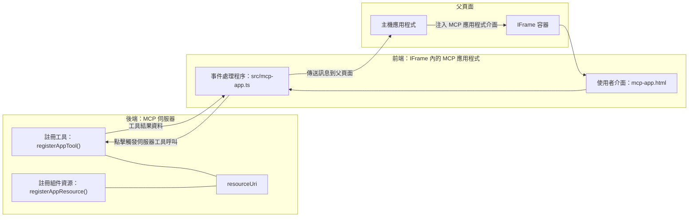
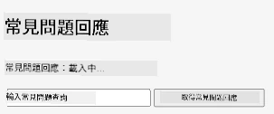
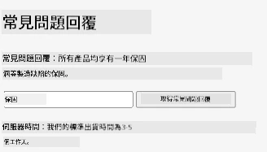
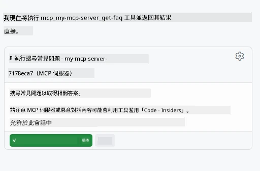
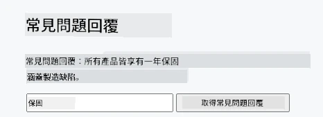

# MCP 應用程式

MCP 應用程式是 MCP 中的新範式。其概念不僅是從工具呼叫回傳資料，還提供了如何與這些資訊互動的方式。這表示工具結果現在可以包含 UI 資訊。那為什麼我們需要這樣呢？試想你目前的做法，你可能會透過在 MCP 伺服器前端放置某種前端介面來消費結果，這是你需要撰寫並維護的程式碼。有時候這正是你想要的，但有時候如果可以直接引入一段自包含從資料到使用者介面都齊全的資訊片段，那會非常好。

## 概覽

本課程提供 MCP 應用程式的實務指導，如何開始使用以及如何整合到你現有的 Web 應用程式中。MCP 應用程式是 MCP 標準中非常新的部分。

## 學習目標

完成本課程後，你將能夠：

- 解釋什麼是 MCP 應用程式。
- 何時使用 MCP 應用程式。
- 建立並整合你自己的 MCP 應用程式。

## MCP 應用程式 - 如何運作

MCP 應用程式的想法是提供一個回應，基本上是一個要被渲染的元件。這樣的元件可以同時具有視覺以及互動性，例如按鈕點擊、使用者輸入等等。我們先從伺服器端和 MCP 伺服器開始。要建立 MCP 應用程式元件，你需要同時建立一個工具以及一個應用程式資源。這兩個部分透過 resourceUri 連結。

這裡有一個範例。讓我們試著視覺化涉及的部分以及各部分的功能：

```text
server.ts -- responsible for registering tools and the component as a UI component
src/
  mcp-app.ts -- wiring up event handlers
mcp-app.html -- the user interface
```

此圖像說明建立元件及其邏輯的架構。


接著我們依序描述後端與前端的責任分工。

### 後端

有兩件事我們需要完成：

- 註冊我們想要互動的工具。
- 定義元件。

**註冊工具**

```typescript
registerAppTool(
    server,
    "get-time",
    {
      title: "Get Time",
      description: "Returns the current server time.",
      inputSchema: {},
      _meta: { ui: { resourceUri } }, // 將此工具連結到其 UI 資源
    },
    async () => {
      const time = new Date().toISOString();
      return { content: [{ type: "text", text: time }] };
    },
  );

```

上面程式碼描述該行為，曝光了一個名為 `get-time` 的工具。它不接受輸入，但會回傳當前時間。我們也可以為需要接收使用者輸入的工具定義 `inputSchema`。

**註冊元件**

在同一個檔案中，我們也需要註冊該元件：

```typescript
const resourceUri = "ui://get-time/mcp-app.html";

// 註冊資源，回傳用於介面的整合 HTML/JavaScript。
registerAppResource(
  server,
  resourceUri,
  resourceUri,
  { mimeType: RESOURCE_MIME_TYPE },
  async () => {
    const html = await fs.readFile(path.join(DIST_DIR, "mcp-app.html"), "utf-8");

    return {
    contents: [
        { uri: resourceUri, mimeType: RESOURCE_MIME_TYPE, text: html },
    ],
    };
  },
);
```

注意我們如何提及 `resourceUri` 以連結元件與其工具。值得關注的是回呼函式中載入 UI 檔案並回傳元件。

### 元件前端

與後端一樣，這裡有兩部分：

- 以純 HTML 撰寫的前端。
- 處理事件及操作的程式碼，例如呼叫工具或傳訊息給父視窗。

**使用者介面**

讓我們來看看使用者介面。

```html
<!-- mcp-app.html -->
<!DOCTYPE html>
<html lang="en">
  <head>
    <meta charset="UTF-8" />
    <title>Get Time App</title>
  </head>
  <body>
    <p>
      <strong>Server Time:</strong> <code id="server-time">Loading...</code>
    </p>
    <button id="get-time-btn">Get Server Time</button>
    <script type="module" src="/src/mcp-app.ts"></script>
  </body>
</html>
```

**事件綁定**

最後一部分是事件綁定。也就是我們辨識 UI 中哪個部分需要事件處理器，以及事件發生時該怎麼做：

```typescript
// mcp-app.ts

import { App } from "@modelcontextprotocol/ext-apps";

// 獲取元素參考
const serverTimeEl = document.getElementById("server-time")!;
const getTimeBtn = document.getElementById("get-time-btn")!;

// 創建應用實例
const app = new App({ name: "Get Time App", version: "1.0.0" });

// 處理來自伺服器的工具結果。設定在 `app.connect()` 之前以避免
// 錯過初始的工具結果。
app.ontoolresult = (result) => {
  const time = result.content?.find((c) => c.type === "text")?.text;
  serverTimeEl.textContent = time ?? "[ERROR]";
};

// 綁定按鈕點擊事件
getTimeBtn.addEventListener("click", async () => {
  // `app.callServerTool()` 讓 UI 從伺服器請求最新資料
  const result = await app.callServerTool({ name: "get-time", arguments: {} });
  const time = result.content?.find((c) => c.type === "text")?.text;
  serverTimeEl.textContent = time ?? "[ERROR]";
});

// 連接到主機
app.connect();
```

如上所示，這是用來將 DOM 元素連結到事件的標準程式碼。值得一提的是呼叫 `callServerTool`，它會最終呼叫後端的工具。

## 處理使用者輸入

到目前為止，我們看到一個元件，按鈕被點擊時會呼叫工具。讓我們試著加更多 UI 元素，例如一個輸入欄位，看看能否將參數傳送給工具。讓我們實作 FAQ 功能。它的工作方式如下：

- 應有一個按鈕和一個輸入元件，使用者可在輸入欄輸入像是「Shipping」的關鍵字搜尋。這會呼叫後端一個在 FAQ 資料中搜尋的工具。
- 一個支援上述 FAQ 搜尋的工具。

先在後端加入必要支援：

```typescript
const faq: { [key: string]: string } = {
    "shipping": "Our standard shipping time is 3-5 business days.",
    "return policy": "You can return any item within 30 days of purchase.",
    "warranty": "All products come with a 1-year warranty covering manufacturing defects.",
  }

registerAppTool(
    server,
    "get-faq",
    {
      title: "Search FAQ",
      description: "Searches the FAQ for relevant answers.",
      inputSchema: zod.object({
        query: zod.string().default("shipping"),
      }),
      _meta: { ui: { resourceUri: faqResourceUri } }, // 將此工具連結到其使用者介面資源
    },
    async ({ query }) => {
      const answer: string = faq[query.toLowerCase()] || "Sorry, I don't have an answer for that.";
      return { content: [{ type: "text", text: answer }] };
    },
  );
```

我們看到的是如何填寫 `inputSchema` 並給予 `zod` schema，如下：

```typescript
inputSchema: zod.object({
  query: zod.string().default("shipping"),
})
```

在上述 schema 中，我們宣告有個名為 `query` 的輸入參數，它是可選的，並預設為 "shipping"。

好，接著來看 *mcp-app.html* 我們需要建立哪些 UI：

```html
<div class="faq">
    <h1>FAQ response</h1>
    <p>FAQ Response: <code id="faq-response">Loading...</code></p>
    <input type="text" id="faq-query" placeholder="Enter FAQ query" />
    <button id="get-faq-btn">Get FAQ Response</button>
  </div>
```

很好，現在我們有一個輸入元素和按鈕。接下來看 *mcp-app.ts*，綁定這些事件：

```typescript
const getFaqBtn = document.getElementById("get-faq-btn")!;
const faqQueryInput = document.getElementById("faq-query") as HTMLInputElement;

getFaqBtn.addEventListener("click", async () => {
  const query = faqQueryInput.value;
  const result = await app.callServerTool({ name: "get-faq", arguments: { query } });
  const faq = result.content?.find((c) => c.type === "text")?.text;
  faqResponseEl.textContent = faq ?? "[ERROR]";
});
```

上述程式碼我們：

- 建立對有趣 UI 元素的參考。
- 處理按鈕點擊事件，解析輸入元件的值，並呼叫 `app.callServerTool()`，參數包含 `name` 和 `arguments`，後者傳送 `query` 做為值。

當你呼叫 `callServerTool` 時，它會發送訊息到父視窗，該視窗最終會呼叫 MCP 伺服器。

### 試試看

嘗試之後，我們現在應該會看到：



以下則是輸入像「warranty」的結果



要執行此程式碼，請前往 [Code section](./code/README.md)

## 在 Visual Studio Code 中測試

Visual Studio Code 對 MCP 應用程式有很棒的支援，且可能是測試 MCP 應用程式最簡單的方法。要使用 Visual Studio Code，請在 *mcp.json* 中新增一個伺服器條目，如下：

```json
"my-mcp-server-7178eca7": {
    "url": "http://localhost:3001/mcp",
    "type": "http"
  }
```

接著啟動伺服器，你應該可以透過聊天視窗與 MCP 應用程式通訊，只要你有安裝 GitHub Copilot。

以提示觸發，例如 "#get-faq"：



就像在瀏覽器中執行一樣，顯示的 UI 也相同：



## 作業

建立一個猜拳遊戲。應包含以下元素：

UI：

- 一個下拉選單，包含選項
- 一個按鈕用來提交選擇
- 一個標籤顯示誰選了什麼以及誰贏了

伺服器：

- 擁有一個猜拳工具，接受「choice」作為輸入。它還應該產生電腦選擇並判定勝負。

## 解答

[解答](./assignment/README.md)

## 總結

我們學習了 MCP 應用程式這種新範式。這是一種新方式，使 MCP 伺服器不僅對資料有看法，還有如何呈現這些資料的意見。

此外，我們了解到這些 MCP 應用程式置於 IFrame 中，與 MCP 伺服器通訊需要將訊息傳送給父級 Web 應用程式。目前市面上有多個針對純 JavaScript、React 等的函式庫，使這種通訊更容易。

## 主要收穫

這些是你學到的：

- MCP 應用程式是一個新標準，當你想同時傳送資料和 UI 功能時特別有用。
- 這類應用程式出於安全因素會運行於 IFrame 中。

## 下一步

- [第 4 章](../../04-PracticalImplementation/README.md)

---

<!-- CO-OP TRANSLATOR DISCLAIMER START -->
**免責聲明**：  
本文件由 AI 翻譯服務 [Co-op Translator](https://github.com/Azure/co-op-translator) 進行翻譯。雖然我們力求準確，但請注意自動翻譯可能含有錯誤或不準確之處。原文應視為權威來源。對於重要資訊，建議採用專業人工翻譯。本公司不對因使用本翻譯所產生的任何誤解或誤譯負責。
<!-- CO-OP TRANSLATOR DISCLAIMER END -->