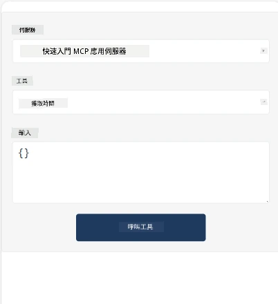
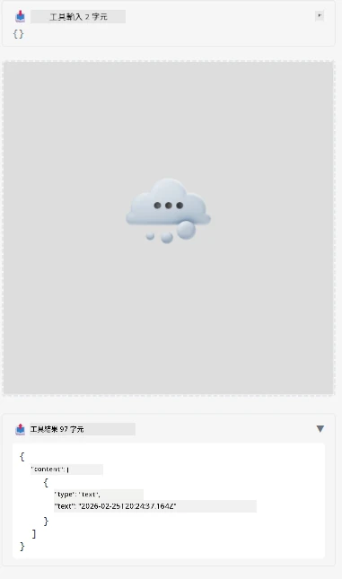

以下是展示 MCP 應用程式的範例

## 安裝

1. 移動到 *mcp-app* 資料夾
1. 執行 `npm install`，這將會安裝前端和後端的相依套件

透過執行以下指令來驗證後端是否編譯成功：

```sh
npx tsc --noEmit
```

如果一切正常，不應該有任何輸出。

## 執行後端

> 如果您使用的是 Windows 機器，這會需要一些額外的工作，因為 MCP 應用程式方案使用 `concurrently` 函式庫來執行，您必須找到替代方案。以下是 MCP App 中的 *package.json* 令人困擾的行：

    ```json
    "start": "concurrently \"cross-env NODE_ENV=development INPUT=mcp-app.html vite build --watch\" \"tsx watch main.ts\""
    ```

此應用程式包含兩部分，一個後端部分與一個主機部分。

呼叫以下指令啟動後端：

```sh
npm start
```

這應該會啟動後端，網址為 `http://localhost:3001/mcp`。

> 注意，如果您是在 Codespace 中，您可能需要將連接埠設定為公開。請確認您能透過瀏覽器連線至 https://<name of Codespace>.app.github.dev/mcp

## 選擇 1 - 在 Visual Studio Code 中測試應用程式

要在 Visual Studio Code 中測試此方案，請執行以下步驟：

- 在 `mcp.json` 新增一個伺服器條目，如下所示：

    ```json
    {
        "servers": {
            "my-mcp-server-7178eca7": {
                "url": "http://localhost:3001/mcp",
                "type": "http"
            }
        },
        "inputs": []
    }
    ```

1. 在 *mcp.json* 中按下「start」按鈕
1. 確認有開啟聊天視窗並輸入 `get-faq`，你應該會看到類似以下的結果：

    

## 選擇 2 - 使用主機測試應用程式

此儲存庫 <https://github.com/modelcontextprotocol/ext-apps> 含有多個不同的主機，可以用來測試您的 MVP 應用程式。

這裡提供兩種不同的選擇：

### 本地機器

- 在您已複製儲存庫後，移動到 *ext-apps*。

- 安裝相依套件

   ```sh
   npm install
   ```

- 在另一個終端機視窗，切換至 *ext-apps/examples/basic-host*

    > 如果您使用 Codespace，需要打開 serve.ts 並在第 27 行將 http://localhost:3001/mcp 替換成您的 Codespace 後端網址，例如 https://psychic-xylophone-657rpjgvxpc5g64-3001.app.github.dev/mcp

- 執行主機：

    ```sh
    npm start
    ```

    這應該會連接主機與後端，您應該會看到應用程式如圖運行：

    

### Codespace

要讓 Codespace 環境運作，需要一些額外設定。要透過 Codespace 使用主機：

- 進入 *ext-apps* 目錄並切換至 *examples/basic-host*。
- 執行 `npm install` 安裝相依
- 執行 `npm start` 啟動主機。

## 試用應用程式

嘗試以下步驟使用應用程式：

- 選擇「Call Tool」按鈕，應該會看到以下結果：

    

太好了，一切都正常運作。

---

<!-- CO-OP TRANSLATOR DISCLAIMER START -->
**免責聲明**：  
本文件係使用 AI 翻譯服務 [Co-op Translator](https://github.com/Azure/co-op-translator) 進行翻譯。雖然我們致力於達成準確性，但請注意自動翻譯可能包含錯誤或不準確之處。原文文件之母語版本應視為權威來源。對於關鍵資訊，建議採用專業人工翻譯。我們不對因使用本翻譯所產生之任何誤解或誤釋負責。
<!-- CO-OP TRANSLATOR DISCLAIMER END -->