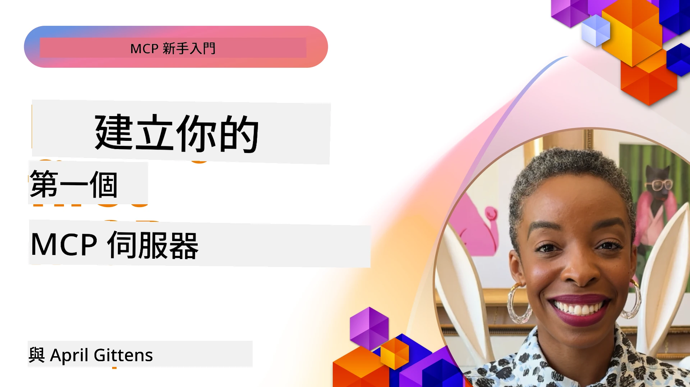

## 入門指南  

_(點擊上方圖片觀看本課程影音)_

本節包含多個課程：

- **1 您的第一個伺服器**，在第一堂課中，您將學會如何建立您的第一個伺服器並使用檢查器工具檢視它，這是測試和除錯伺服器的寶貴方式，[前往課程](01-first-server/README.md)

- **2 用戶端**，本課程將教您如何撰寫能連接到伺服器的用戶端，[前往課程](02-client/README.md)

- **3 搭配大型語言模型的用戶端**，透過加入大型語言模型（LLM），用戶端可以與伺服器「協商」應該如何互動，是更佳的用戶端撰寫方式，[前往課程](03-llm-client/README.md)

- **4 在 Visual Studio Code 中使用 GitHub Copilot Agent 模式消費伺服器**。這裡說明如何在 Visual Studio Code 中執行 MCP 伺服器，[前往課程](04-vscode/README.md)

- **5 stdio 傳輸伺服器** stdio 傳輸是建議用於本機 MCP 伺服器與用戶端通訊的標準，提供安全的子程序通信與內建程序隔離，[前往課程](05-stdio-server/README.md)

- **6 MCP 的 HTTP 串流（可串流的 HTTP）**。學習現代 HTTP 串流傳輸（根據 [MCP 規範 2025-11-25](https://spec.modelcontextprotocol.io/specification/2025-11-25/basic/transports/#streamable-http) 建議用於遠端 MCP 伺服器）、進度通知，以及如何使用可串流 HTTP 實作可擴展的即時 MCP 伺服器與用戶端，[前往課程](06-http-streaming/README.md)

- **7 使用 AI 工具組於 VSCode** 消費並測試您的 MCP 用戶端與伺服器，[前往課程](07-aitk/README.md)

- **8 測試**，本章將特別聚焦如何以不同方式測試您的伺服器與用戶端，[前往課程](08-testing/README.md)

- **9 部署**，本章將探討不同方式部署您的 MCP 解決方案，[前往課程](09-deployment/README.md)

- **10 進階伺服器使用**，本章涵蓋進階伺服器使用，[前往課程](./10-advanced/README.md)

- **11 認證**，本章介紹如何加入簡易認證，從 Basic Auth 到使用 JWT 與 RBAC。建議您從此開始，然後參考第 5 章的進階主題，以及第 2 章的安全強化建議，[前往課程](./11-simple-auth/README.md)

- **12 MCP 主機**。配置並使用熱門 MCP 主機客戶端，包括 Claude Desktop、Cursor、Cline 和 Windsurf。學習傳輸類型與除錯，[前往課程](./12-mcp-hosts/README.md)

- **13 MCP 檢查器**。利用 MCP 檢查工具互動除錯與測試 MCP 伺服器。學習工具、資源與協定訊息的故障排除，[前往課程](./13-mcp-inspector/README.md)

- **14 取樣**。建立 MCP 伺服器，與 MCP 用戶端協同處理 LLM 相關任務，[前往課程](./14-sampling/README.md)

- **15 MCP 應用**。建構可回覆 UI 指令的 MCP 伺服器，[前往課程](./15-mcp-apps/README.md)

Model Context Protocol（MCP）是一個開放協定，標準化應用程式如何向大型語言模型（LLM）提供上下文。可以將 MCP 想像成 AI 應用的 USB-C 連接埠——它提供標準化方式連接 AI 模型與各種資料來源和工具。

## 學習目標

完成本課程後，您將能夠：

- 設定 C#、Java、Python、TypeScript 與 JavaScript 的 MCP 開發環境
- 建立並部署具自訂功能（資源、提示與工具）的基本 MCP 伺服器
- 建立連接 MCP 伺服器的主機應用程式
- 測試與除錯 MCP 實作
- 了解常見設定挑戰與解決方案
- 連接 MCP 實作至熱門大型語言模型服務

## 設定您的 MCP 環境

開始使用 MCP 之前，請先準備您的開發環境並理解基本工作流程。本節將指導您完成初期設定步驟，確保您能順利開始 MCP 開發。

### 先決條件

在深入 MCP 開發前，請確保您擁有：

- **開發環境**：依您選擇的程式語言（C#、Java、Python、TypeScript 或 JavaScript）
- **整合開發環境（IDE）/ 編輯器**：Visual Studio、Visual Studio Code、IntelliJ、Eclipse、PyCharm 或其他現代程式編輯器
- **套件管理工具**：NuGet、Maven/Gradle、pip，或 npm/yarn
- **API 金鑰**：用於您計劃在主機應用中使用的任意 AI 服務

### 官方 SDK

在接下來的章節中，您將看到使用 Python、TypeScript、Java 和 .NET 建立的解決方案。這裡列出所有官方支援的 SDK。

MCP 提供多種語言的官方 SDK（對應 [MCP 規範 2025-11-25](https://spec.modelcontextprotocol.io/specification/2025-11-25/)）：
- [C# SDK](https://github.com/modelcontextprotocol/csharp-sdk) - 與微軟合作維護
- [Java SDK](https://github.com/modelcontextprotocol/java-sdk) - 與 Spring AI 合作維護
- [TypeScript SDK](https://github.com/modelcontextprotocol/typescript-sdk) - 官方 TypeScript 實作
- [Python SDK](https://github.com/modelcontextprotocol/python-sdk) - 官方 Python 實作 (FastMCP)
- [Kotlin SDK](https://github.com/modelcontextprotocol/kotlin-sdk) - 官方 Kotlin 實作
- [Swift SDK](https://github.com/modelcontextprotocol/swift-sdk) - 與 Loopwork AI 合作維護
- [Rust SDK](https://github.com/modelcontextprotocol/rust-sdk) - 官方 Rust 實作
- [Go SDK](https://github.com/modelcontextprotocol/go-sdk) - 官方 Go 實作

## 重要要點

- 設定 MCP 開發環境可透過語言專用 SDK 輕鬆完成
- 建置 MCP 伺服器需建立並註冊具明確結構的工具
- MCP 用戶端能連接伺服器與模型，發揮擴充功能
- 測試與除錯是 MCP 實作可靠性的關鍵
- 部署選項包含本機開發與雲端解決方案

## 練習範例

我們提供一組樣本專案，搭配本節所有章節的練習使用。此外，每個章節也包含其自身的練習與作業。

- [Java 計算機](./samples/java/calculator/README.md)
- [.Net 計算機](../../../03-GettingStarted/samples/csharp)
- [JavaScript 計算機](./samples/javascript/README.md)
- [TypeScript 計算機](./samples/typescript/README.md)
- [Python 計算機](../../../03-GettingStarted/samples/python)

## 額外資源

- [使用 Model Context Protocol 在 Azure 建立代理](https://learn.microsoft.com/azure/developer/ai/intro-agents-mcp)
- [Azure Container Apps 遠端 MCP（Node.js/TypeScript/JavaScript）](https://learn.microsoft.com/samples/azure-samples/mcp-container-ts/mcp-container-ts/)
- [.NET OpenAI MCP 代理](https://learn.microsoft.com/samples/azure-samples/openai-mcp-agent-dotnet/openai-mcp-agent-dotnet/)

## 接下來的步驟

請從第一堂課開始：[建立您的第一個 MCP 伺服器](01-first-server/README.md)

完成本模組後，繼續學習：[模組 4：實務實作](../04-PracticalImplementation/README.md)

---

<!-- CO-OP TRANSLATOR DISCLAIMER START -->
**免責聲明**：  
本文件係使用 AI 翻譯服務 [Co-op Translator](https://github.com/Azure/co-op-translator) 進行翻譯。雖然我們力求準確，但請注意，自動翻譯可能包含錯誤或不準確之處。原始文件之母語版本應視為權威資料來源。對於重要資訊，建議採用專業人工翻譯。因使用本翻譯所產生之任何誤解或誤譯，本方概不負責。
<!-- CO-OP TRANSLATOR DISCLAIMER END -->