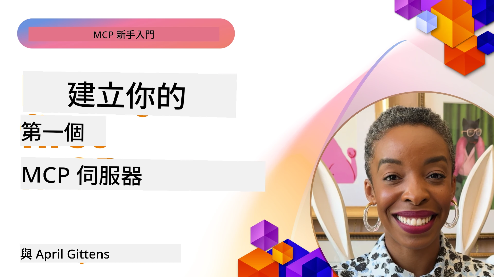

## 入門指南  

_(點擊上方圖片觀看本課程影片)_

本節包含多個課程：

- **1 你的第一個伺服器**，在這第一課中，您將學習如何建立您的第一個伺服器並使用檢視工具檢查它，這是測試與除錯伺服器的寶貴方式，[前往課程](01-first-server/README.md)

- **2 客戶端**，在這課程中，您將學習如何編寫一個可以連接到您的伺服器的客戶端，[前往課程](02-client/README.md)

- **3 帶有 LLM 的客戶端**，編寫客戶端更好的方法是加入 LLM，使其能與您的伺服器「協商」該執行什麼，[前往課程](03-llm-client/README.md)

- **4 在 Visual Studio Code 中使用 GitHub Copilot Agent 模式消費伺服器**。這裡我們探討如何在 Visual Studio Code 中運行 MCP 伺服器，[前往課程](04-vscode/README.md)

- **5 stdio 傳輸伺服器** stdio 傳輸是本地 MCP 伺服器到客戶端通信的推薦標準，提供安全的子程序級通信並內建程序隔離[前往課程](05-stdio-server/README.md)

- **6 MCP 的 HTTP 流式傳輸（可串流 HTTP）**。了解標準
	遠端傳輸在 [MCP 規範 2026-07-28](https://modelcontextprotocol.io/specification/2026-07-28/basic/transports/streamable-http)中，
	加上課程中保留的舊版基於會話的實現。
	[前往課程](06-http-streaming/README.md)

- **7 利用 AI 工具包 for VSCode** 來消費和測試您的 MCP 客戶端和伺服器 [前往課程](07-aitk/README.md)

- **8 測試**。此章節特別聚焦於如何以不同方式測試您的伺服器和客戶端，[前往課程](08-testing/README.md)

- **9 部署**。本章將探討部署 MCP 解決方案的不同方法，[前往課程](09-deployment/README.md)

- **10 進階伺服器使用**。本章涵蓋進階伺服器的使用，[前往課程](./10-advanced/README.md)

- **11 驗證**。本章涵蓋如何新增簡單的驗證，從基本驗證到使用 JWT 及 RBAC。建議先從此處開始，然後查看第五章進階主題並根據第二章的建議進行額外的安全強化，[前往課程](./11-simple-auth/README.md)

- **12 MCP 主機**。配置並使用熱門的 MCP 主機客戶端，包括 Claude Desktop、Cursor、Cline 和 Windsurf。學習傳輸類型和疑難排解，[前往課程](./12-mcp-hosts/README.md)

- **13 MCP 檢視器**。使用 MCP 檢視器工具互動式除錯與測試你的 MCP 伺服器。學習疑難排解工具、資源和協定訊息，[前往課程](./13-mcp-inspector/README.md)

- **14 取樣**。學習 `2025-11-25` 版的舊取樣原語以及
	如何遷移新的設計至直接 LLM 提供者整合。取樣在 MCP `2026-07-28` 中已
	被淘汰。[前往課程](./14-sampling/README.md)

- **15 MCP 應用程式**。建立同時回覆 UI 指令的 MCP 伺服器，[前往課程](./15-mcp-apps/README.md)

模型上下文協議（MCP）是一個開放協議，標準化應用程式如何向 LLM 提供上下文。可以把 MCP 想像成 AI 應用程式的 USB-C 介面——它提供一種標準方式連接 AI 模型至不同的數據來源和工具。

## 學習目標

完成本課程後，您將能夠：

- 為 C#、Java、Python、TypeScript 及 JavaScript 設定 MCP 開發環境
- 建構並部署具自訂功能（資源、提示及工具）的基礎 MCP 伺服器
- 建立可以連接 MCP 伺服器的主機應用程式
- 測試和除錯 MCP 實作
- 了解常見設定挑戰及其解決方案
- 將您的 MCP 實作連接到熱門的 LLM 服務

## 設定您的 MCP 環境

在開始使用 MCP 之前，重要的是準備您的開發環境並了解基本工作流程。本節將引導您完成初期設定步驟，確保 MCP 的順利起步。

### 先決條件

在深入 MCP 開發前，請確認您已具備：

- <strong>開發環境</strong>：針對您選擇的語言（C#、Java、Python、TypeScript 或 JavaScript）
- **IDE/編輯器**：Visual Studio、Visual Studio Code、IntelliJ、Eclipse、PyCharm 或任何現代代碼編輯器
- <strong>套件管理器</strong>：NuGet、Maven/Gradle、pip 或 npm/yarn
- **API 金鑰**：用於您計畫在主機應用中使用的任何 AI 服務

### 官方 SDK

在接下來的章節中，您將看到使用 Python、TypeScript、
Java 與 .NET 建構的解決方案。以下是官方 SDK。

MCP `2026-07-28` 的 SDK 支援正逐步按語言推出。
在運行範例前，請檢查其套件版本與 SDK 發布說明
以確認支援的協定版本。參閱
[官方 SDK 列表](https://modelcontextprotocol.io/docs/sdk):
- [C# SDK](https://github.com/modelcontextprotocol/csharp-sdk) - 與 Microsoft 合作維護
- [Java SDK](https://github.com/modelcontextprotocol/java-sdk) - 與 Spring AI 合作維護
- [TypeScript SDK](https://github.com/modelcontextprotocol/typescript-sdk) - 官方 TypeScript 實作
- [Python SDK](https://github.com/modelcontextprotocol/python-sdk) - 官方 Python 實作（FastMCP）
- [Kotlin SDK](https://github.com/modelcontextprotocol/kotlin-sdk) - 官方 Kotlin 實作
- [Swift SDK](https://github.com/modelcontextprotocol/swift-sdk) - 與 Loopwork AI 合作維護
- [Rust SDK](https://github.com/modelcontextprotocol/rust-sdk) - 官方 Rust 實作
- [Go SDK](https://github.com/modelcontextprotocol/go-sdk) - 官方 Go 實作

## 重要重點

- 使用特定語言的 SDK 設定 MCP 開發環境相當簡單
- 建立 MCP 伺服器涉及創建和註冊具明確結構的工具
- MCP 客戶端連接伺服器和模型以利用擴展功能
- 測試與除錯對於穩健的 MCP 實作至關重要
- 部署選項包括本地開發到雲端解決方案

## 練習

我們提供一組範例，補充本節各章節中的練習。此外，每個章節也有自己的練習和作業。

- [Java 計算機](./samples/java/calculator/README.md)
- [.NET 計算機](../../../03-GettingStarted/samples/csharp)
- [JavaScript 計算機](./samples/javascript/README.md)
- [TypeScript 計算機](./samples/typescript/README.md)
- [Python 計算機](../../../03-GettingStarted/samples/python)

## 額外資源

- [在 Azure 上使用 Model Context Protocol 建立代理](https://learn.microsoft.com/azure/developer/ai/intro-agents-mcp)
- [使用 Azure Container Apps 進行遠端 MCP (Node.js/TypeScript/JavaScript)](https://learn.microsoft.com/samples/azure-samples/mcp-container-ts/mcp-container-ts/)
- [.NET OpenAI MCP 代理](https://learn.microsoft.com/samples/azure-samples/openai-mcp-agent-dotnet/openai-mcp-agent-dotnet/)

## 接下來

從第一課開始：[建立你的第一個 MCP 伺服器](01-first-server/README.md)

完成本模組後，繼續前往：[模組 4：實務應用](../04-PracticalImplementation/README.md)

---

<!-- CO-OP TRANSLATOR DISCLAIMER START -->
**免責聲明**：
此文件已使用 AI 翻譯服務 [Co-op Translator](https://github.com/Azure/co-op-translator) 進行翻譯。雖然我們努力追求準確性，但請注意自動翻譯可能包含錯誤或不準確之處。原始文件的母語版本應視為權威來源。對於關鍵資訊，建議採用專業人工翻譯。我們不對因使用此翻譯所產生的任何誤解或誤譯承擔責任。
<!-- CO-OP TRANSLATOR DISCLAIMER END -->