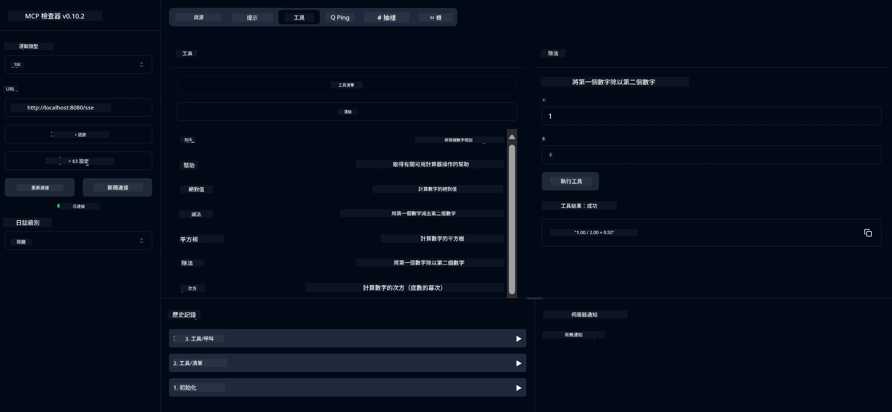

# 基本計算機 MCP 服務

> [!NOTE]
> 此範例使用舊版 HTTP+SSE 傳輸，並針對與 MCP `2025-11-25` 兼容的 SDK。
> 新的遠程伺服器應使用 `2026-07-28` 可串流 HTTP 支援。


- 支援 SSE (Server-Sent Events)
- 使用 Spring AI 的 `@Tool` 註解自動註冊工具
- 基本計算機功能：
  - 加法、減法、乘法、除法
  - 次方計算與平方根
  - 取模（餘數）與絕對值
  - 操作說明的說明函數


   - 兩數相加
   - 一數減去另一數
   - 兩數相乘
   - 一數除以另一數（含除以零檢查）


   - 次方計算（底數的冪次）
   - 平方根運算（含負數檢查）
   - 取模（餘數）運算
   - 絕對值計算


   - 內建說明函數，解釋所有可用操作


- `subtract(a, b)`: 從第一個數減去第二個數
- `multiply(a, b)`: 將兩數相乘
- `divide(a, b)`: 將第一個數除以第二個數（含零值檢查）
- `power(base, exponent)`: 計算次方
- `squareRoot(number)`: 計算平方根（含負數檢查）
- `modulus(a, b)`: 計算除法的餘數
- `absolute(number)`: 計算絕對值
- `help()`: 取得可用操作的說明


   
   要使用 GitHub 的 AI 模型（如 phi-4），需要 GitHub 個人存取權杖：


   
   b. 點擊「Generate new token」→「Generate new token (classic)」
   
   c. 為存取權杖取一個描述性名稱
   
   d. 選擇以下權限範圍：
      - `repo`（私有倉庫的完整控制權）
      - `read:org`（讀取組織與團隊成員身份，讀取組織專案）
      - `gist`（建立 Gist）


      - `user:email`（存取使用者電子郵件地址（唯讀））
   
   e. 點擊 "Generate token" 並複製您的新代幣
   
   f. 將其設定為環境變數：
      
      在 Windows 上：
      ```
      set GITHUB_TOKEN=your-github-token
      ```
      
      在 macOS/Linux 上：
      ```bash
      export GITHUB_TOKEN=your-github-token
      ```

   g. 若要永久設置，請透過系統設定將其新增至環境變數

2. 將 LangChain4j GitHub 依賴加入到您的專案中（已包含在 pom.xml 中）：
   ```xml
   <dependency>
       <groupId>dev.langchain4j</groupId>
       <artifactId>langchain4j-github</artifactId>
       <version>${langchain4j.version}</version>
   </dependency>
   ```

3. 確保計算機伺服器正在 `localhost:8080` 運行

### 執行 LangChain4j 客戶端

此範例示範：
- 透過 SSE 傳輸連接至計算機 MCP 伺服器
- 使用 LangChain4j 建立結合計算機運算的聊天機器人
- 整合 GitHub AI 模型（目前使用 phi-4 模型）

客戶端發送以下樣本查詢以展示功能：
1. 計算兩數之和
2. 求出一個數字的平方根
3. 獲取有關可用計算機運算的幫助訊息

執行範例並查看控制台輸出，觀察 AI 模型如何使用計算工具來回應查詢。

### GitHub 模型設定

LangChain4j 客戶端設定為使用 GitHub 的 phi-4 模型，設定如下：

```java
ChatLanguageModel model = GitHubChatModel.builder()
    .apiKey(System.getenv("GITHUB_TOKEN"))
    .timeout(Duration.ofSeconds(60))
    .modelName("phi-4")
    .logRequests(true)
    .logResponses(true)
    .build();
```

若要使用不同的 GitHub 模型，只需將 `modelName` 參數改為支援的其它模型（例如 "claude-3-haiku-20240307"、"llama-3-70b-8192" 等）。

## 依賴項目

專案需要以下主要依賴項：

```xml
<!-- For MCP Server -->
<dependency>
    <groupId>org.springframework.ai</groupId>
    <artifactId>spring-ai-starter-mcp-server-webflux</artifactId>
</dependency>

<!-- For LangChain4j integration -->
<dependency>
    <groupId>dev.langchain4j</groupId>
    <artifactId>langchain4j-mcp</artifactId>
    <version>${langchain4j.version}</version>
</dependency>

<!-- For GitHub models support -->
<dependency>
    <groupId>dev.langchain4j</groupId>
    <artifactId>langchain4j-github</artifactId>
    <version>${langchain4j.version}</version>
</dependency>
```

## 建置專案

使用 Maven 建置專案：
```bash
./mvnw clean install -DskipTests
```

## 執行伺服器

### 使用 Java

```bash
java -jar target/calculator-server-0.0.1-SNAPSHOT.jar
```

### 使用 MCP Inspector

MCP Inspector 是一個便於與 MCP 服務互動的工具。要搭配本計算機服務使用：

1. **安裝並執行 MCP Inspector**，在新終端視窗中：
   ```bash
   npx @modelcontextprotocol/inspector
   ```

2. **點擊應用程式顯示的 URL**（通常是 http://localhost:6274）以進入網頁 UI

3. <strong>設定連線</strong>：
   - 將傳輸類型設為 "SSE"
   - URL 設為您正在運行的伺服器 SSE 端點：`http://localhost:8080/sse`
   - 點擊 "Connect"

4. <strong>使用工具</strong>：
   - 點擊 "List Tools" 以查看可用的計算機運算
   - 選擇工具並點擊 "Run Tool" 執行操作



### 使用 Docker

專案附帶 Dockerfile 用於容器化部署：

1. **建置 Docker 映像檔**：
   ```bash
   docker build -t calculator-mcp-service .
   ```

2. **執行 Docker 容器**：
   ```bash
   docker run -p 8080:8080 calculator-mcp-service
   ```

這會：
- 使用 Maven 3.9.9 和 Eclipse Temurin 24 JDK 建置多階段 Docker 映像
- 建立優化過的容器映像
- 在埠 8080 開放服務
- 在容器內啟動 MCP 計算機服務

容器運行後，您可在 `http://localhost:8080` 訪問服務。

## 疑難排解

### GitHub 代幣常見問題


1. <strong>權杖權限問題</strong>：如果您收到 403 Forbidden 錯誤，請檢查您的權杖是否具有前置條件中列出的正確權限。

2. <strong>找不到權杖</strong>：如果您遇到「No API key found」錯誤，請確保 GITHUB_TOKEN 環境變數已正確設定。

3. <strong>頻率限制</strong>：GitHub API 有頻率限制。如果您遇到頻率限制錯誤（狀態碼 429），請稍等幾分鐘後再嘗試。

4. <strong>權杖過期</strong>：GitHub 權杖會有過期時間。如果您在一段時間後收到驗證錯誤，請生成新權杖並更新您的環境變數。

如果您需要進一步協助，請查看 [LangChain4j documentation](https://github.com/langchain4j/langchain4j) 或 [GitHub API documentation](https://docs.github.com/en/rest)。

---

<!-- CO-OP TRANSLATOR DISCLAIMER START -->
**免責聲明**：
此文件已使用 AI 翻譯服務 [Co-op Translator](https://github.com/Azure/co-op-translator) 進行翻譯。雖然我們努力追求準確性，但請注意自動翻譯可能包含錯誤或不準確之處。原始文件的母語版本應視為權威來源。對於關鍵資訊，建議採用專業人工翻譯。我們不對因使用此翻譯所產生的任何誤解或誤譯承擔責任。
<!-- CO-OP TRANSLATOR DISCLAIMER END -->