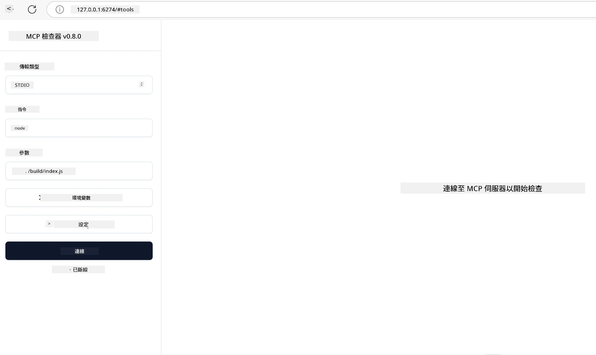

# 實務實作

[](https://youtu.be/vCN9-mKBDfQ)

_(點擊上方圖片觀看本課程影片)_

實務實作是模型上下文協定 (Model Context Protocol, MCP) 力量具體展現的地方。雖然理解 MCP 的理論與架構很重要，但當你將這些概念應用於建置、測試和部署解決真實世界問題的方案時，真正的價值才會浮現。本章節將彌補概念知識與實作開發的差距，帶領你完成基於 MCP 的應用程式實際落地過程。

無論你是在開發智慧助理、將 AI 整合到商業工作流程，或是建構資料處理的自訂工具，MCP 都提供了彈性的基礎。它採用語言無關的設計，並針對熱門程式語言提供官方 SDK，使各種開發者都能輕鬆上手。透過這些 SDK，你能快速 prototype、反覆調整，並在不同平台與環境中擴展你的解決方案。

接下來的章節中，你將會看到實務範例、範例程式碼與部署策略，示範如何使用 C#、Java（Spring）、TypeScript、JavaScript 及 Python 實作 MCP。你也將學習如何除錯與測試 MCP 伺服器，管理 API，並利用 Azure 將方案部署至雲端。這些實作資源能加速你的學習，幫助你自信地打造穩健且適合生產環境的 MCP 應用程式。

## 概覽

本課程聚焦 MCP 實作的實務面，涵蓋多種程式語言。我們將探討如何在 C#、Java（Spring）、TypeScript、JavaScript 和 Python 中運用 MCP SDK，來建置穩固的應用程式，並進行 MCP 伺服器的除錯和測試，還有創建可重用的資源、提示與工具。

## 學習目標

完成本課程後，你將能夠：

- 利用官方 SDK，使用多種程式語言實作 MCP 解決方案
- 系統化地除錯與測試 MCP 伺服器
- 建立及使用伺服器功能（資源、提示和工具）
- 為複雜任務設計高效的 MCP 工作流程
- 優化 MCP 實作的效能與可靠性

## 官方 SDK 資源

模型上下文協定為多種程式語言提供官方 SDK（依據 [MCP 規範 2025-11-25](https://spec.modelcontextprotocol.io/specification/2025-11-25/)）：

- [C# SDK](https://github.com/modelcontextprotocol/csharp-sdk)
- [Java（Spring）SDK](https://github.com/modelcontextprotocol/java-sdk) **注意：** 需要依賴 [Project Reactor](https://projectreactor.io)。（詳見[討論議題 246](https://github.com/orgs/modelcontextprotocol/discussions/246)。）
- [TypeScript SDK](https://github.com/modelcontextprotocol/typescript-sdk)
- [Python SDK](https://github.com/modelcontextprotocol/python-sdk)
- [Kotlin SDK](https://github.com/modelcontextprotocol/kotlin-sdk)
- [Go SDK](https://github.com/modelcontextprotocol/go-sdk)

## 使用 MCP SDK

本節將示範多種程式語言中實作 MCP 的實務範例。範例程式碼整理於 `samples` 目錄，依語言分類。

### 可用範例

本儲存庫包含以下語言的[範例實作](../../../04-PracticalImplementation/samples)：

- [C#](./samples/csharp/README.md)
- [Java（Spring）](./samples/java/containerapp/README.md)
- [TypeScript](./samples/typescript/README.md)
- [JavaScript](./samples/javascript/README.md)
- [Python](./samples/python/README.md)

每個範例演示該語言及生態系統中 MCP 的核心概念與實作模式。

### 實務指南

其他實務 MCP 實作指南：

- [分頁與大型結果集](./pagination/README.md) - 針對工具、資源與大型資料集處理基於游標的分頁

## 核心伺服器功能

MCP 伺服器可實作以下任意組合的功能：

### 資源

資源提供使用者或 AI 模型所需的上下文與資料：

- 文件庫
- 知識庫
- 結構化資料源
- 檔案系統

### 提示

提示為使用者準備的模板訊息和工作流：

- 預定義的對話範本
- 導引互動模式
- 專用對話結構

### 工具

工具是 AI 模型執行的函式：

- 資料處理工具
- 外部 API 整合
- 計算能力
- 搜尋功能

## 範例實作：C# 實作

官方 C# SDK 儲存庫包含多個示範不同 MCP 面向的範例實作：

- **基本 MCP 用戶端**：範例演示如何建立 MCP 用戶端並呼叫工具
- **基本 MCP 伺服器**：實作基本工具註冊的極簡伺服器
- **進階 MCP 伺服器**：提供工具註冊、身份驗證及錯誤處理的完整伺服器
- **ASP.NET 整合**：示範與 ASP.NET Core 的整合
- **工具實作模式**：展示多種不同複雜度的工具實作模式

MCP 的 C# SDK 正在預覽階段，API 可能會變動。我們會隨著 SDK 的演進持續更新本部落格。

### 主要功能

- [C# MCP Nuget ModelContextProtocol](https://www.nuget.org/packages/ModelContextProtocol)
- 建立你的[第一個 MCP 伺服器](https://devblogs.microsoft.com/dotnet/build-a-model-context-protocol-mcp-server-in-csharp/)。

欲取得完整的 C# 實作範例，請參考[官方 C# SDK 範例儲存庫](https://github.com/modelcontextprotocol/csharp-sdk)

## 範例實作：Java（Spring）實作

Java（Spring）SDK 提供強健的 MCP 實作選項，具備企業級功能。

### 主要功能

- Spring Framework 整合
- 強型別安全
- 支援反應式程式設計
- 全面錯誤處理

完整 Java（Spring）實作範例請參考範例目錄中的 [Java with Spring sample](samples/java/containerapp/README.md)。

## 範例實作：JavaScript 實作

JavaScript SDK 提供輕量且彈性的 MCP 實作方式。

### 主要功能

- 支援 Node.js 與瀏覽器
- Promise-based API
- 容易與 Express 等框架整合
- 支援 WebSocket 串流

完整 JavaScript 實作範例請參考範例目錄中的 [JavaScript sample](samples/javascript/README.md)。

## 範例實作：Python 實作

Python SDK 提供 Pythonic 風格 MCP 實作，且具出色的機器學習框架整合。

### 主要功能

- 支援 asyncio 的 async/await
- FastAPI 整合
- 簡單的工具註冊
- 原生整合熱門機器學習庫

完整 Python 實作範例請參考範例目錄中的 [Python sample](samples/python/README.md)。

## API 管理

Azure API 管理是保護 MCP 伺服器的絕佳方案。其概念是在 MCP 伺服器前端部署 Azure API 管理，交由它處理你可能需要的功能，如：

- 流量速率限制
- 令牌管理
- 監控
- 負載平衡
- 安全性

### Azure 範例

這裡有一個 Azure 範例，正是此用途，即[建立 MCP 伺服器並利用 Azure API 管理保護](https://github.com/Azure-Samples/remote-mcp-apim-functions-python)。

下圖說明授權流程：


在上圖中，流程包含：

- 透過 Microsoft Entra 進行身份驗證／授權。
- Azure API 管理作為閘道，使用政策導引與管理流量。
- Azure 監控紀錄所有請求供後續分析。

#### 授權流程細節

讓我們更詳細地看看授權流程：


#### MCP 授權規範

了解更多關於[MCP 授權規範](https://spec.modelcontextprotocol.io/specification/2025-11-25/basic/authorization/)

## 將遠端 MCP 伺服器部署到 Azure

接下來示範如何部署我們之前提及的範例：

1. 複製儲存庫

    ```bash
    git clone https://github.com/Azure-Samples/remote-mcp-apim-functions-python.git
    cd remote-mcp-apim-functions-python
    ```

1. 註冊 `Microsoft.App` 資源提供者。

   - 若使用 Azure CLI，請執行 `az provider register --namespace Microsoft.App --wait`。
   - 若使用 Azure PowerShell ，執行 `Register-AzResourceProvider -ProviderNamespace Microsoft.App`。稍後可透過 `(Get-AzResourceProvider -ProviderNamespace Microsoft.App).RegistrationState` 確認註冊是否完成。

1. 執行此 [azd](https://aka.ms/azd) 命令來佈建 API 管理服務、函式應用程式（含程式碼）及所有其他所需的 Azure 資源

    ```shell
    azd up
    ```

    此命令將部署所有 Azure 雲端資源

### 使用 MCP Inspector 測試你的伺服器

1. 在 **新的終端視窗**，安裝並執行 MCP Inspector

    ```shell
    npx @modelcontextprotocol/inspector
    ```

    你將看到類似的介面：

    

1. 按下 CTRL 並點擊以從 MCP Inspector 應用程式顯示的 URL (例如 [http://127.0.0.1:6274/#resources](http://127.0.0.1:6274/#resources)) 載入網頁
1. 將傳輸類型設為 `SSE`
1. 將 URL 設為指令 `azd up` 後顯示的 API 管理 SSE 端點並按 **Connect**：

    ```shell
    https://<apim-servicename-from-azd-output>.azure-api.net/mcp/sse
    ```

1. **列出工具**。點擊工具後按 **執行工具**。

若所有步驟成功完成，你現在應已連線至 MCP 伺服器，並成功呼叫一個工具。

## Azure MCP 伺服器

[Remote-mcp-functions](https://github.com/Azure-Samples/remote-mcp-functions-dotnet)：這組儲存庫為使用 Azure Functions 以 Python、C# .NET 或 Node/TypeScript 快速建置及部署自訂遠端 MCP（模型上下文協定）伺服器的範本。

該範例提供完整解決方案，使開發者能：

- 本機建置與執行：在本機端開發並除錯 MCP 伺服器
- 部署至 Azure：透過簡單的 azd up 指令輕鬆佈署至雲端
- 從用戶端連線：支援多種用戶端連接 MCP 伺服器，含 VS Code Copilot 代理模式及 MCP Inspector 工具

### 主要功能

- 以安全設計保障：MCP 伺服器使用金鑰與 HTTPS 保障安全
- 身份驗證選項：支援使用內建身分驗證和/或 API 管理的 OAuth
- 網路隔離：透過 Azure 虛擬網路（VNET）實現網路隔離
- 無伺服器架構：利用 Azure Functions 提供可擴展且事件驅動的執行
- 本機開發支援：完善本機開發及除錯功能
- 簡化部署流程：流暢的 Azure 部署流程

此儲存庫包含所有必要配置檔、原始碼與基礎建設定義，讓你快速展開生產就緒的 MCP 伺服器實作。

- [Azure 遠端 MCP Functions Python](https://github.com/Azure-Samples/remote-mcp-functions-python) - 使用 Azure Functions 與 Python 的 MCP 範例實作

- [Azure 遠端 MCP Functions .NET](https://github.com/Azure-Samples/remote-mcp-functions-dotnet) - 使用 Azure Functions 與 C# .NET 的 MCP 範例實作

- [Azure 遠端 MCP Functions Node/Typescript](https://github.com/Azure-Samples/remote-mcp-functions-typescript) - 使用 Azure Functions 與 Node/TypeScript 的 MCP 範例實作

## 重要重點

- MCP SDK 提供各語言專屬工具用於實作穩健的 MCP 解決方案
- 除錯與測試過程對於可靠的 MCP 應用至關重要
- 可重用的提示模板可確保 AI 互動一致性
- 良好設計的工作流程能藉多工具協同完成複雜任務
- 實作 MCP 解決方案時需重視安全性、效能及錯誤處理

## 練習

設計一個實務 MCP 工作流程，解決你領域中的真實問題：

1. 識別 3-4 個有助於解決此問題的工具
2. 繪製工作流程圖，展示這些工具如何互動
3. 使用你偏好的程式語言實作該工具的基本版本
4. 建立一個提示模板，協助模型有效使用你的工具

## 其他資源

---

## 接下來

下一課程：[進階主題](../05-AdvancedTopics/README.md)

---

<!-- CO-OP TRANSLATOR DISCLAIMER START -->
**免責聲明**：
本文件係使用 AI 翻譯服務 [Co-op Translator](https://github.com/Azure/co-op-translator) 進行翻譯。雖然我們力求準確，但請注意，自動翻譯可能包含錯誤或不準確之處。原始文件的原文版本應被視為權威來源。對於重要資訊，建議聘請專業人工翻譯。我們不對因使用本翻譯所導致的任何誤解或錯誤詮釋承擔責任。
<!-- CO-OP TRANSLATOR DISCLAIMER END -->