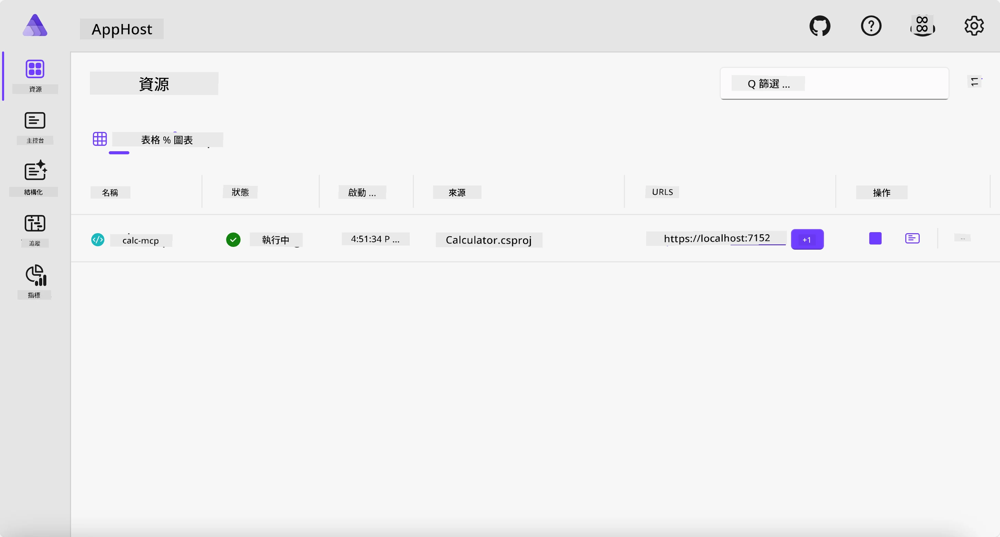
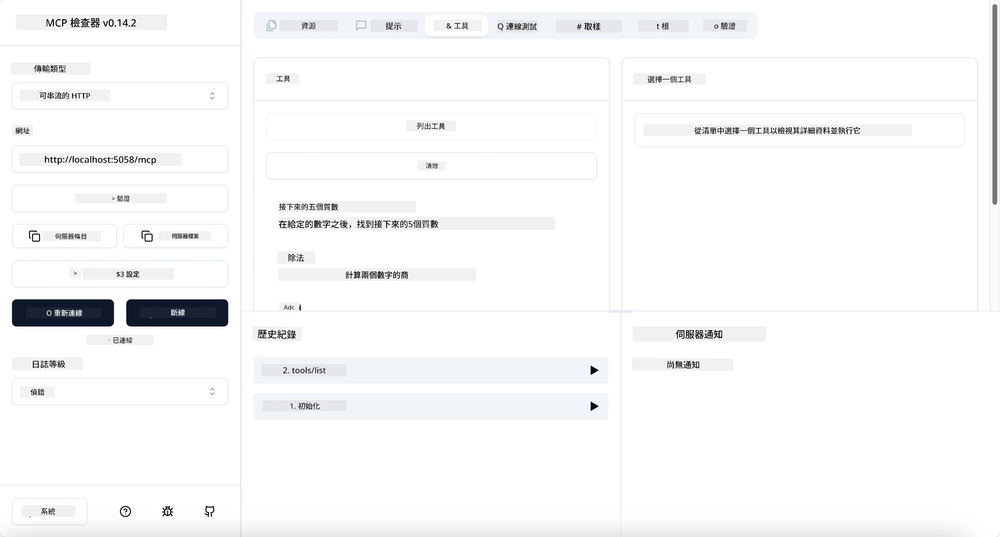
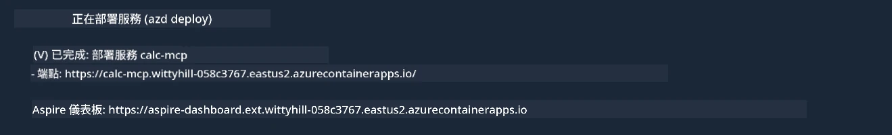

# 範例

先前的範例展示了如何使用本地 .NET 專案搭配 `stdio` 類型，還有如何在容器中本地執行伺服器。這在許多情況下是個不錯的解決方案。不過，有時候讓伺服器遠端執行，例如在雲端環境中，也是很有用的。這時 `http` 類型就派上用場了。

看看 `04-PracticalImplementation` 資料夾中的解決方案，看起來可能比先前例子複雜許多。但實際上並不是這樣。如果仔細觀察 `src/Calculator` 專案，你會發現它的程式碼大多和之前的例子相同。唯一的差別是我們使用了另一個函式庫 `ModelContextProtocol.AspNetCore` 來處理 HTTP 請求。同時，我們將方法 `IsPrime` 改為私有，以示範程式碼中也能有私有方法。其餘程式碼則和之前一樣。

其他專案來自於 [Aspire](https://aspire.dev/get-started/what-is-aspire/)。在方案中加入 Aspire 可以提升開發者在開發與測試時的體驗，並協助提高可觀察性。雖然運行伺服器時不一定要用 Aspire，但把它納入方案中是個好習慣。

## 在本機啟動伺服器

1. 從 VS Code（搭配 C# DevKit 擴充套件）導航至 `04-PracticalImplementation/samples/csharp` 目錄。
1. 執行以下指令來啟動伺服器：

   ```bash
    dotnet watch run --project ./src/AppHost
   ```

1. 當瀏覽器打開 Aspire 儀表板時，注意 `http` URL，應是類似 `http://localhost:5058/` 的網址。

   

## 使用 MCP Inspector 測試可串流 HTTP

如果你有 Node.js 22.7.5 以上版本，可以使用 MCP Inspector 來測試你的伺服器。

啟動伺服器後，在終端機執行下列指令：

```bash
npx @modelcontextprotocol/inspector http://localhost:5058
```



- 選擇 `Streamable HTTP` 作為傳輸類型。
- 在 Url 欄位輸入之前記下的伺服器網址，並在後面加上 `/mcp`。它應該是 `http`（非 `https`），像 `http://localhost:5058/mcp` 這樣。
- 點選連線按鈕。

Inspector 的好處是它能清楚顯示正在發生的事情。

- 試著列出可用的工具清單。
- 試著使用其中一些工具，應該會像之前一樣正常運作。

## 在 VS Code 使用 GitHub Copilot Chat 測試 MCP 伺服器

要讓 GitHub Copilot Chat 使用 Streamable HTTP 傳輸，請修改之前建立的 `calc-mcp` 伺服器設定如下：

```jsonc
// .vscode/mcp.json
{
  "servers": {
    "calc-mcp": {
      "type": "http",
      "url": "http://localhost:5058/mcp"
    }
  }
}
```

做一些測試：

- 詢問「6780 之後的 3 個質數」。注意 Copilot 將會使用新工具 `NextFivePrimeNumbers` ，且只回傳前三個質數。
- 詢問「111 之後的 7 個質數」，看看會發生什麼事情。
- 詢問「John 有 24 顆棒棒糖，想要分給他 3 個孩子，每個孩子會分到多少顆？」看看結果如何。

## 部署伺服器至 Azure

讓我們把伺服器部署到 Azure，好讓更多人能使用它。

於終端機中導航至 `04-PracticalImplementation/samples/csharp` 資料夾並執行下列指令：

```bash
azd up
```

部署完成後，應該會看到類似以下訊息：



拿取該 URL，並將其用於 MCP Inspector 與 GitHub Copilot Chat。

```jsonc
// .vscode/mcp.json
{
  "servers": {
    "calc-mcp": {
      "type": "http",
      "url": "https://calc-mcp.gentleriver-3977fbcf.australiaeast.azurecontainerapps.io/mcp"
    }
  }
}
```

## 下一步？

我們嘗試了不同的傳輸類型和測試工具，也將 MCP 伺服器部署到 Azure。不過如果伺服器需要存取私人資源呢？例如資料庫或私人 API？在下一章，我們將了解如何加強伺服器的安全性。

---

<!-- CO-OP TRANSLATOR DISCLAIMER START -->
**免責聲明**：
此文件已使用 AI 翻譯服務 [Co-op Translator](https://github.com/Azure/co-op-translator) 進行翻譯。雖然我們努力追求準確性，但請注意自動翻譯可能包含錯誤或不準確之處。原始文件的母語版本應視為權威來源。對於關鍵資訊，建議採用專業人工翻譯。我們不對因使用此翻譯所產生的任何誤解或誤譯承擔責任。
<!-- CO-OP TRANSLATOR DISCLAIMER END -->