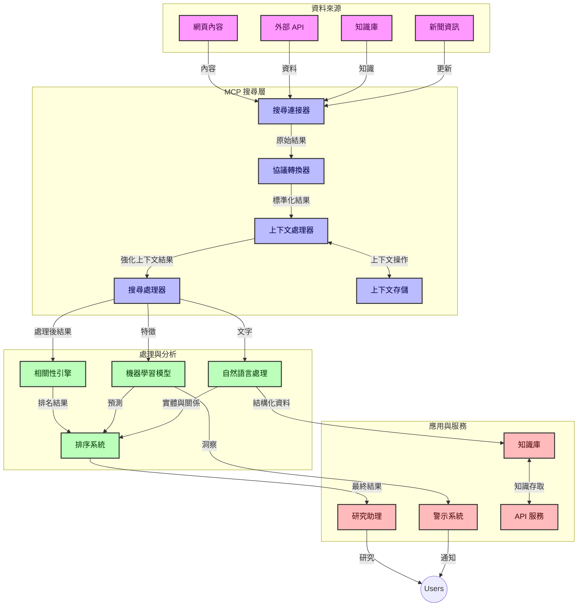
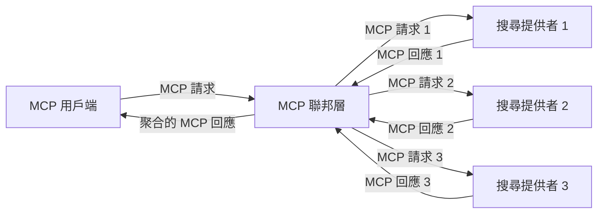
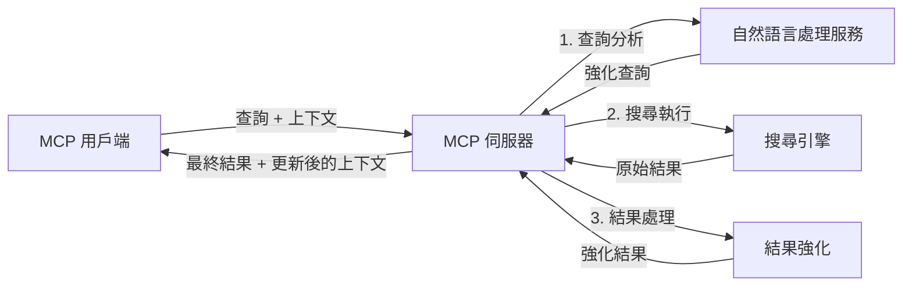

# 即時網路搜尋的模型上下文協議

## 概覽

即時網路搜尋在當今以資訊為主導的環境中已成為必需，應用程式需要即時存取整個網路上的最新資訊，以提供相關且及時的回應。模型上下文協議（MCP）代表了優化這些即時搜尋流程的重大進展，提升搜尋效率、保持上下文完整性並改善整體系統性能。

本模組探討 MCP 如何透過為 AI 模型、搜尋引擎和應用程式提供標準化的上下文管理方法，轉變即時網路搜尋。

### 您將學到的內容

在這本完整指南中，您將發現：

- MCP 如何在 AI 模型與即時網路搜尋功能間創造無縫橋樑
- 使用 MCP 實作高效且可擴充搜尋解決方案的架構模式
- 保存多次搜尋查詢與互動的搜尋上下文技術
- 使用 Python 與 JavaScript 處理各種搜尋場景的實務程式碼範例
- 在 MCP 支援的搜尋系統中平衡相關性、新穎性與效能的方法

## 即時網路搜尋介紹

即時網路搜尋是一種技術方法，允許系統持續查詢、處理並分析網路上發布或更新的資訊，使系統能以極低延遲提供最新且相關的資訊。與傳統運作於可能已有數小時或數天歷史的索引資料之搜尋系統不同，即時搜尋處理的是網路上的即時資料，提供反映線上內容當前狀態的見解和資訊。

### 即時網路搜尋的核心概念：

- <strong>連續查詢處理</strong>：針對持續更新的資料來源處理搜尋查詢
- <strong>新穎性優先</strong>：系統被設計成優先處理最新資訊
- <strong>相關性平衡</strong>：維持相關性與新穎性之間的平衡
- <strong>可擴充架構</strong>：系統必須能因應可變的查詢負載與資料量
- <strong>上下文理解</strong>：跨多次搜尋保持使用者上下文對於有意義的結果很重要
- <strong>動態查詢重構</strong>：根據上下文與先前結果自適性調整查詢
- <strong>多源整合</strong>：結合來自多個搜尋供應商與網路來源的結果
- <strong>語意理解</strong>：基於意義，而非純粹關鍵字，處理查詢與內容
- <strong>即時排名</strong>：隨著新資訊到達持續調整結果排名

### 模型上下文協議與即時網路搜尋

模型上下文協議（MCP）解決了即時網路搜尋環境中的多項關鍵挑戰：

1. <strong>搜尋上下文保存</strong>：MCP 標準化如何在分散式搜尋元件間維持上下文，確保 AI 模型與處理節點能存取相關查詢歷史和使用者偏好。

2. <strong>高效查詢管理</strong>：透過提供結構化的上下文傳輸機制，MCP 減少每次搜尋迭代中重複上下文的開銷。

3. <strong>互操作性</strong>：MCP 建立多元搜尋技術與 AI 模型間共享上下文的通用語言，提升架構的靈活性與擴展性。

4. <strong>搜尋優化上下文</strong>：MCP 實作能優先考量對有效搜尋最重要的上下文元素，在效能與準確性間取得最佳化。

5. <strong>自適應搜尋處理</strong>：透過 MCP 適宜的上下文管理，搜尋系統可根據使用者需求與資訊環境的演變動態調整處理流程。

在從新聞彙整到研究助理等現代應用中，MCP 與網路搜尋技術結合，使得智慧且具上下文感知的搜尋成為可能，隨著使用者互動持續，越來越能提供相關結果。

## 學習目標

本課程結束時，您將能：

- 理解即時網路搜尋的基本原理及其在現代應用中的挑戰
- 說明模型上下文協議（MCP）如何增強即時網路搜尋能力
- 使用流行框架與 API 實作基於 MCP 的搜尋解決方案
- 設計及部署具擴充性與高效能的 MCP 搜尋架構
- 將 MCP 概念應用於語意搜尋、研究助理和 AI 強化瀏覽等多種用例
- 評估 MCP 基礎搜尋技術的新興趨勢與未來創新
- 開發能從使用者互動學習的上下文感知搜尋系統
- 使用標準化 MCP 協議整合網路搜尋功能到 AI 助理中
- 建立多階段搜尋管線，依據上下文逐步優化結果
- 在維持完整上下文感知的同時優化搜尋效能

### 定義與重要性

即時網路搜尋涵蓋持續查詢、擷取與快速呈現網路資訊。與透過定期爬蟲並建立網頁索引的傳統搜尋引擎不同，即時搜尋致力於資料一產生即輔助曝光，讓使用者立即取得最新內容。

即時網路搜尋的主要特徵包括：

- <strong>新鮮度</strong>：優先最新內容與更新
- <strong>持續處理</strong>：不斷監測新資訊
- <strong>查詢調整</strong>：根據上下文及反饋精煉搜尋查詢
- <strong>即時交付</strong>：以最小延遲提供搜尋結果
- <strong>上下文保留</strong>：基於先前查詢提升相關性

### 傳統網路搜尋的挑戰

傳統網路搜尋在應用於即時場景時面臨多項限制：

1. <strong>上下文分散</strong>：難以跨多次查詢維持搜尋上下文
2. <strong>資訊新鮮度</strong>：難以存取並優先考量最新資訊
3. <strong>整合複雜</strong>：搜尋系統與應用間互操作性問題
4. <strong>延遲問題</strong>：在全面搜尋與回應時間間取得平衡
5. <strong>相關性調整</strong>：在優先新穎性同時確保準確性與相關性

## 理解搜尋中的模型上下文協議（MCP）

### MCP 在搜尋上下文中是什麼？

模型上下文協議（MCP）是一種標準化的通訊協議，旨在促進 AI 模型與應用系統間的高效互動。在即時網路搜尋中，MCP 提供一個架構用以：

- 在查詢序列中保存搜尋上下文
- 標準化搜尋查詢與結果格式
- 優化搜尋參數與結果的傳輸
- 改善模型與搜尋引擎間的通訊

### 核心元件與架構

MCP 用於即時網路搜尋的架構包含以下關鍵元件：

1. <strong>查詢上下文處理器</strong>：管理並維持跨多次查詢的搜尋上下文
2. <strong>搜尋處理器</strong>：使用上下文感知技術處理進入的搜尋請求
3. <strong>協議轉接器</strong>：在不同搜尋 API 間轉換同時保持上下文
4. <strong>上下文存儲</strong>：有效儲存和擷取搜尋歷史與偏好
5. <strong>搜尋連接器</strong>：連接各種搜尋引擎與網路 API



### MCP 如何改善即時網路搜尋

MCP 透過以下方式解決傳統網路搜尋挑戰：

- <strong>上下文連續性</strong>：維持整個搜尋階段中查詢之間的關聯性
- <strong>優化傳輸</strong>：透過智慧上下文管理減少搜尋參數重複
- <strong>標準化介面</strong>：提供一致的搜尋元件 API
- <strong>降低延遲</strong>：透過有效上下文處理減少系統開銷
- <strong>提升相關性</strong>：保存使用者意圖並增強多次查詢的搜尋結果相關性

## 整合與實作

即時網路搜尋系統需精心的架構設計與實作，才能兼顧性能與上下文完整性。模型上下文協議提供一種標準化方法，整合 AI 模型與搜尋技術，打造更智慧且具上下文感知的搜尋管線。

### MCP 在搜尋架構中的整合概覽

在即時網路搜尋環境中實作 MCP 需考慮以下重點：

1. <strong>搜尋上下文序列化</strong>：MCP 提供高效編碼搜尋請求中上下文資訊的機制，確保重要上下文隨查詢貫穿整個處理流程。包括對搜尋相關元資料優化的標準化序列化格式。

2. <strong>有狀態搜尋處理</strong>：MCP 透過在多次搜尋迭代中維持一致上下文表示，促成更智慧的有狀態處理。對於多階段搜尋管線尤其有用，因為上下文精煉能提升結果品質。

3. <strong>查詢擴展與細化</strong>：MCP 在搜尋系統中實作可促使基於累積上下文的複雜查詢擴展與細化，隨著搜尋階段推進得到越來越相關的結果。

4. <strong>結果快取與優先排序</strong>：標準化上下文處理使 MCP 有助於結果快取與優先排序管理，讓元件可根據搜尋上下文演化調整策略。

5. <strong>搜尋整合與聚合</strong>：MCP 透過提供結構化的搜尋上下文表示，促進多後端搜尋的更高階聯合，能更有意義地聚合來自多元來源的結果。

MCP 在各種搜尋技術的實作上創造了統一的上下文管理方法，減少客製整合程式碼需求，同時增強系統隨搜尋查詢演進維持有意義上下文的能力。

### MCP 在不同網路搜尋實作中的應用

這些範例遵循現行 MCP 規範，該規範聚焦基於 JSON-RPC 的協議與獨特的傳輸機制。程式碼示範您如何實作自訂搜尋整合，同時保持完全相容於 MCP 協議。


<details>
<summary>Python 實作與通用搜尋 API</summary>

```python
import asyncio
import json
import aiohttp
from typing import Dict, Any, Optional, List
from contextlib import asynccontextmanager
from collections.abc import AsyncIterator

# 匯入標準的 MCP 函式庫
from mcp.client.session import ClientSession
from mcp.client.streamable_http import streamablehttp_client
from mcp.types import TextContent, CreateMessageRequestParams, CreateMessageResult
from mcp.server.fastmcp import FastMCP

# 建立一個 FastMCP 伺服器用於網路搜尋
search_server = FastMCP("WebSearch")

# 處理網路搜尋操作的類別
class WebSearchHandler:
    def __init__(self, api_endpoint: str, api_key: str):
        self.api_endpoint = api_endpoint
        self.api_key = api_key
        self.session = None
        
    async def initialize(self):
        """Initialize the HTTP session"""
        self.session = aiohttp.ClientSession(
            headers={"Authorization": f"Bearer {self.api_key}"}
        )
    
    async def close(self):
        """Close the HTTP session"""
        if self.session:
            await self.session.close()
            
    async def perform_search(self, query: str, max_results: int = 5, 
                           include_domains: List[str] = None, 
                           exclude_domains: List[str] = None,
                           time_period: str = "any") -> Dict[str, Any]:
        """Perform web search using the search API"""
        # 建立搜尋參數
        search_params = {
            "q": query,
            "limit": max_results,
            "time": time_period
        }
        
        if include_domains:
            search_params["site"] = ",".join(include_domains)
            
        if exclude_domains:
            search_params["exclude_site"] = ",".join(exclude_domains)
        
        # 執行搜尋請求
        try:
            async with self.session.get(
                self.api_endpoint,
                params=search_params
            ) as response:
                if response.status != 200:
                    error_text = await response.text()
                    raise Exception(f"Search API error: {response.status} - {error_text}")
                
                search_data = await response.json()
                
                # 將 API 特定回應轉換為標準格式
                results = []
                for item in search_data.get("results", []):
                    results.append({
                        "title": item.get("title", ""),
                        "url": item.get("url", ""),
                        "snippet": item.get("snippet", ""),
                        "date": item.get("published_date", ""),
                        "source": item.get("source", "")
                    })
                
                return {
                    "query": query,
                    "totalResults": len(results),
                    "results": results
                }
        except Exception as e:
            print(f"Search API request error: {e}")
            raise

# 初始化搜尋處理器
search_handler = WebSearchHandler(
    api_endpoint="https://api.search-service.example/search",
    api_key="your-api-key-here"
)

# 設定壽命週期以管理搜尋處理器
@asyncio.asynccontextmanager
async def app_lifespan(server: FastMCP):
    """Manage application lifecycle"""
    await search_handler.initialize()
    try:
        yield {"search_handler": search_handler}
    finally:
        await search_handler.close()

# 設定伺服器的壽命週期
search_server = FastMCP("WebSearch", lifespan=app_lifespan)

# 註冊一個網路搜尋工具
@search_server.tool()
async def web_search(query: str, max_results: int = 5, 
                   include_domains: List[str] = None,
                   exclude_domains: List[str] = None,
                   time_period: str = "any") -> Dict[str, Any]:
    """
    Search the web for information
    
    Args:
        query: The search query
        max_results: Maximum number of results to return (default: 5)
        include_domains: List of domains to include in search results
        exclude_domains: List of domains to exclude from search results
        time_period: Time period for results ("day", "week", "month", "any")
        
    Returns:
        Dictionary containing search results
    """
    ctx = search_server.get_context()
    search_handler = ctx.request_context.lifespan_context["search_handler"]
    
    results = await search_handler.perform_search(
        query=query,
        max_results=max_results,
        include_domains=include_domains,
        exclude_domains=exclude_domains,
        time_period=time_period
    )
    
    return results

# 用戶端使用範例
async def client_example():
    # 使用可串流 HTTP 傳輸連線至搜尋伺服器
    async with streamablehttp_client("http://localhost:8000/mcp") as (read, write, _):
        async with ClientSession(read, write) as session:
            # 初始化連線
            await session.initialize()
            
            # 呼叫 web_search 工具
            search_results = await session.call_tool(
                "web_search", 
                {
                    "query": "latest developments in AI and Model Context Protocol",
                    "max_results": 5,
                    "time_period": "day",
                    "include_domains": ["github.com", "microsoft.com"]
                }
            )
            
            print(f"Search results: {search_results}")

# 伺服器執行範例
if __name__ == "__main__":
    # 使用可串流 HTTP 傳輸執行伺服器
    search_server.run(transport="streamable-http")
```
</details> 

<details>
<summary>JavaScript 實作與瀏覽器基礎搜尋</summary>


```javascript
// MCP 伺服器實作用於網頁搜尋
import { McpServer, ResourceTemplate } from '@modelcontextprotocol/sdk/server/mcp.js';
import { StreamableHTTPServerTransport } from '@modelcontextprotocol/sdk/server/streamableHttp.js';
import { z } from 'zod';

// 建立一個用於網頁搜尋的 MCP 伺服器
const searchServer = new McpServer({
    name: "BrowserSearch",
    description: "A server that provides web search capabilities"
});

// 搜尋服務類別
class SearchService {
    constructor(searchApiUrl, apiKey) {
        this.searchApiUrl = searchApiUrl;
        this.apiKey = apiKey;
    }

    async performSearch(parameters) {
        const {
            query = '',
            maxResults = 5,
            includeDomains = [],
            excludeDomains = [],
            timePeriod = 'any'
        } = parameters;
        
        // 使用參數建構搜尋 URL
        const url = new URL(this.searchApiUrl);
        url.searchParams.append('q', query);
        url.searchParams.append('limit', maxResults);
        url.searchParams.append('time', timePeriod);
        
        if (includeDomains.length > 0) {
            url.searchParams.append('site', includeDomains.join(','));
        }
        
        if (excludeDomains.length > 0) {
            url.searchParams.append('exclude_site', excludeDomains.join(','));
        }
        
        try {
            const response = await fetch(url.toString(), {
                method: 'GET',
                headers: {
                    'Authorization': `Bearer ${this.apiKey}`,
                    'Content-Type': 'application/json'
                }
            });
            
            if (!response.ok) {
                const errorText = await response.text();
                throw new Error(`Search API error: ${response.status} - ${errorText}`);
            }
            
            const searchData = await response.json();
            
            // 將 API 特定的回應轉換為標準格式
            const results = searchData.results?.map(item => ({
                title: item.title || '',
                url: item.url || '',
                snippet: item.snippet || '',
                date: item.published_date || '',
                source: item.source || ''
            })) || [];
            
            return {
                query,
                totalResults: results.length,
                results
            };
        } catch (error) {
            console.error('Search API request error:', error);
            throw error;
        }
    }
}

// 初始化搜尋服務
const searchService = new SearchService(
    'https://api.search-service.example/search',
    'your-api-key-here'
);

// 設定伺服器的上下文提供者
searchServer.setContextProvider(() => {
    return {
        searchService
    };
});

// 註冊網頁搜尋工具
searchServer.tool({
    name: 'web_search',
    description: 'Search the web for information',
    parameters: {
        type: 'object',
        properties: {
            query: {
                type: 'string',
                description: 'The search query'
            },
            maxResults: {
                type: 'integer',
                description: 'Maximum number of results to return',
                default: 5
            },
            includeDomains: {
                type: 'array',
                items: { type: 'string' },
                description: 'List of domains to include in search results'
            },
            excludeDomains: {
                type: 'array',
                items: { type: 'string' },
                description: 'List of domains to exclude from search results'
            },
            timePeriod: {
                type: 'string',
                description: 'Time period for results',
                enum: ['day', 'week', 'month', 'any'],
                default: 'any'
            }
        },
        required: ['query']
    },
    handler: async (params, context) => {
        const { searchService } = context;
        return await searchService.performSearch(params);
    }
});

// 連接搜尋伺服器的範例客戶端程式碼
import { Client } from '@modelcontextprotocol/sdk/client/index.js';
import { StreamableHTTPClientTransport } from '@modelcontextprotocol/sdk/client/streamableHttp.js';

async function connectToSearchServer() {
    // 連接搜尋伺服器
    const transport = new StreamableHTTPClientTransport(
        new URL('http://localhost:8000/mcp')
    );
    
    const client = new Client({
        name: 'search-client',
        version: '1.0.0'
    });
    
    await client.connect(transport);
    
    // 執行搜尋工具
    const searchResults = await client.callTool({
        name: 'web_search',
        arguments: {
            query: 'Model Context Protocol implementation examples',
            maxResults: 10,
            timePeriod: 'week',
            includeDomains: ['github.com', 'docs.microsoft.com']
        }
    });
    
    console.log('Search results:', searchResults);
    
    // 清理
    await client.disconnect();
}

// 啟動伺服器
const transport = new StreamableHTTPServerTransport();
await searchServer.connect(transport);
console.log('Search server running at http://localhost:8000/mcp');

// 在獨立程序中或伺服器啟動後
// connectToSearchServer().catch(console.error);
```
</details> 


## 程式碼範例免責聲明

> <strong>重要說明</strong>：下方程式碼範例展示了模型上下文協議（MCP）與網路搜尋功能的整合。雖然其遵循官方 MCP SDK 的模式與結構，但為了教育目的已簡化。
> 
> 這些範例涵蓋：
> 
> 1. **Python 實作**：一個 FastMCP 伺服器實作，提供網路搜尋工具並連接外部搜尋 API。此範例展現了適當的生命週期管理、上下文處理與工具實作，遵循官方 MCP Python SDK ([GitHub連結](https://github.com/modelcontextprotocol/python-sdk)) 模式。伺服器使用推薦的 Streamable HTTP 傳輸機制，此方案已取代舊的 SSE 傳輸，適用於生產部署。
> 
> 2. **JavaScript 實作**：使用官方 MCP TypeScript SDK ([GitHub連結](https://github.com/modelcontextprotocol/typescript-sdk)) 的 FastMCP 模式建立搜尋伺服器，包含適當工具定義與客戶端連接。程式碼遵循最新推薦的會話管理與上下文保存模式。
> 
> 這些範例在生產環境中還需要額外的錯誤處理、認證與特定 API 整合程式碼。展示的搜尋 API 端點 (`https://api.search-service.example/search`) 為占位符，需替換成實際搜尋服務端點。
> 
> 有關完整實作細節及最新方法，請參考
> [官方 MCP 規範](https://modelcontextprotocol.io/specification/2026-07-28/)
> 與 SDK 文件。

## 核心概念

### 模型上下文協議（MCP）框架

MCP 基本上是一種標準化方式，讓 AI 模型、應用與服務能交換上下文。在即時網路搜尋中，此框架對建立連貫的多回合搜尋體驗至關重要。核心元件包含：

1. **客戶端-伺服器架構**：MCP 建立搜尋客戶端（請求者）與搜尋伺服器（提供者）間明確分離，允許彈性部署模型。

2. **JSON-RPC 通訊**：該協議使用 JSON-RPC 進行訊息交換，與網路技術相容且便於跨平台實作。

3. <strong>上下文管理</strong>：MCP 定義結構化方法，以跨多次互動維持、更新與運用搜尋上下文。

4. <strong>工具定義</strong>：將搜尋能力以標準化工具形式暴露，具備明確參數與回傳值。

5. <strong>串流支援</strong>：協議支援串流結果，對即時搜尋中逐步回傳結果至關重要。

### 網路搜尋整合模式

整合 MCP 與網路搜尋時，出現若干典型模式：

#### 1. 直接搜尋供應商介接


在此模式中，MCP 伺服器直接介接一個或多個搜尋 API，將 MCP 請求轉換為 API 專用呼叫，並將結果格式化為 MCP 反應。

#### 2. 保持上下文的整合型搜尋



此模式將搜尋查詢分散到多個相容 MCP 的搜尋供應商，各自可能專長於不同內容或搜尋能力，同時維持統一的上下文。

#### 3. 上下文強化搜尋鏈



此模式將搜尋過程分多階段，每階段擴充上下文，產出逐步更相關的結果。

### 搜尋上下文元件

在基於 MCP 的網路搜尋中，上下文通常包括：

- <strong>查詢歷史</strong>：會話中的先前搜尋查詢
- <strong>使用者偏好</strong>：語言、區域、安全搜尋設定
- <strong>互動歷史</strong>：點擊了哪些結果、在結果花費的時間
- <strong>搜尋參數</strong>：篩選條件、排序規則及其他搜尋修飾符
- <strong>領域知識</strong>：與搜尋相關的主題特定上下文
- <strong>時間上下文</strong>：基於時間的相關性因素
- <strong>來源偏好</strong>：可信任或優先資訊來源

## 使用案例與應用

### 研究與資訊蒐集

MCP 透過以下方式強化研究工作流程：

- 跨搜尋會話保存研究上下文
- 啟用更複雜且語境相關的查詢
- 支援多源搜尋整合
- 促進從搜尋結果中萃取知識

### 即時新聞與趨勢監控

MCP 支援的搜尋在新聞監控上帶來優勢：

- 接近即時的新聞事件發現
- 上下文過濾相關資訊
- 跨多來源追蹤主題與實體
- 基於使用者上下文的個人化新聞提醒

### AI 強化瀏覽與研究

MCP 為 AI 強化瀏覽開創新可能：

- 根據當前瀏覽活動提供上下文搜尋建議
- 無縫整合網路搜尋與大型語言模型助理
- 維持上下文的多回合搜尋細化
- 加強事實查證與資訊驗證

## 未來趨勢與創新

### MCP 在網路搜尋的演進

展望未來，我們預期 MCP 將演進以解決：


- <strong>多模態搜尋</strong>：整合文字、圖片、音訊和影片搜尋並保持上下文
- <strong>去中心化搜尋</strong>：支援分散式與聯邦式搜尋生態系統
- <strong>搜尋隱私</strong>：上下文感知的隱私保護搜尋機制
- <strong>查詢理解</strong>：自然語言搜尋查詢的深度語意解析

### 潛在技術進展

將塑造MCP搜尋未來的新興技術：

1. <strong>神經搜尋架構</strong>：優化用於MCP的嵌入式搜尋系統
2. <strong>個人化搜尋上下文</strong>：隨時間學習個別用戶的搜尋模式
3. <strong>知識圖譜整合</strong>：由特定領域知識圖譜增強的上下文搜尋
4. <strong>跨模態上下文</strong>：在不同搜尋模態間維持上下文

## 實作練習

### 練習 1：建立基礎的 MCP 搜尋流程

在此練習中，您將學到：
- 設定基本的 MCP 搜尋環境
- 實作網頁搜尋的上下文處理器
- 測試並驗證搜尋迭代間的上下文保存

### 練習 2：用 MCP 搜尋打造研究助理

創建一個完整應用，能夠：
- 處理自然語言研究問題
- 執行上下文感知的網頁搜尋
- 從多個來源綜合資訊
- 呈現有組織的研究結果

### 練習 3：使用 MCP 實作多來源搜尋聯邦

進階練習，涵蓋：
- 對多個搜尋引擎的上下文感知查詢分派
- 結果排序與整合
- 搜尋結果的上下文重複刪除
- 處理來源特定的元資料

## 附加資源

- [Model Context Protocol 規範](https://modelcontextprotocol.io/specification/2026-07-28/) - MCP 官方規範與詳細協議文件
- [Model Context Protocol 文件](https://modelcontextprotocol.io/) - 詳細教學與實作指南
- [MCP Python SDK](https://github.com/modelcontextprotocol/python-sdk) - MCP 協議的官方 Python 實作
- [MCP TypeScript SDK](https://github.com/modelcontextprotocol/typescript-sdk) - MCP 協議的官方 TypeScript 實作
- [MCP 參考伺服器](https://github.com/modelcontextprotocol/servers) - MCP 伺服器的參考實作
- [Bing 網頁搜尋 API 文件](https://learn.microsoft.com/en-us/bing/search-apis/bing-web-search/overview) - 微軟的網頁搜尋 API
- [Google 自訂搜尋 JSON API](https://developers.google.com/custom-search/v1/overview) - Google 的可程式搜尋引擎
- [SerpAPI 文件](https://serpapi.com/search-api) - 搜尋引擎結果頁 API
- [Meilisearch 文件](https://www.meilisearch.com/docs) - 開源搜尋引擎
- [Elasticsearch 文件](https://www.elastic.co/guide/index.html) - 分散式搜尋與分析引擎
- [LangChain 文件](https://python.langchain.com/docs/get_started/introduction) - 使用大型語言模型構建應用

## 學習成果

完成此模組後，您將能夠：

- 了解即時網頁搜尋的基本原理與挑戰
- 解釋 Model Context Protocol（MCP）如何增強即時網頁搜尋功能
- 使用熱門框架與 API 實作基於 MCP 的搜尋解決方案
- 設計並部署可擴展、高效能的 MCP 搜尋架構
- 將 MCP 概念應用於語義搜尋、研究助理及 AI 輔助瀏覽等多種用例
- 評估 MCP 搜尋技術的新興趨勢與未來創新


### 信任與安全考量

在實作基於 MCP 的網頁搜尋解決方案時，請注意 MCP 規範中的重要原則：

1. <strong>使用者同意與控制</strong>：用戶必須明確同意並理解所有資料存取與操作。對於可能存取外部資料來源的網頁搜尋實作，這一點尤其重要。

2. <strong>資料隱私</strong>：確保妥善處理搜尋查詢與結果，特別是其中可能包含敏感資訊。實施適當的存取控制以保護用戶資料。

3. <strong>工具安全</strong>：對搜尋工具執行妥善的授權與驗證，因為它們可能藉由任意程式碼執行構成安全風險。除非來自可信伺服器，否則工具行為描述應視為不可信。

4. <strong>清晰文件</strong>：依照 MCP 規範的實作指引，提供清晰的使用說明，涵蓋功能、限制與安全考量。

5. <strong>健全的同意流程</strong>：建立健全的同意與授權流程，清楚說明每個工具的功能，特別是與外部網路資源互動的工具，在授權使用前向用戶說明。

有關 MCP 安全與信任考量的完整細節，請參閱
[官方文件](https://modelcontextprotocol.io/specification/2026-07-28/basic/security_best_practices)。

## 接下來的步驟

- [5.12 使用 Entra ID 驗證 Model Context Protocol 伺服器](../mcp-security-entra/README.md)

---

<!-- CO-OP TRANSLATOR DISCLAIMER START -->
**免責聲明**：
此文件已使用 AI 翻譯服務 [Co-op Translator](https://github.com/Azure/co-op-translator) 進行翻譯。雖然我們努力追求準確性，但請注意自動翻譯可能包含錯誤或不準確之處。原始文件的母語版本應視為權威來源。對於關鍵資訊，建議採用專業人工翻譯。我們不對因使用此翻譯所產生的任何誤解或誤譯承擔責任。
<!-- CO-OP TRANSLATOR DISCLAIMER END -->