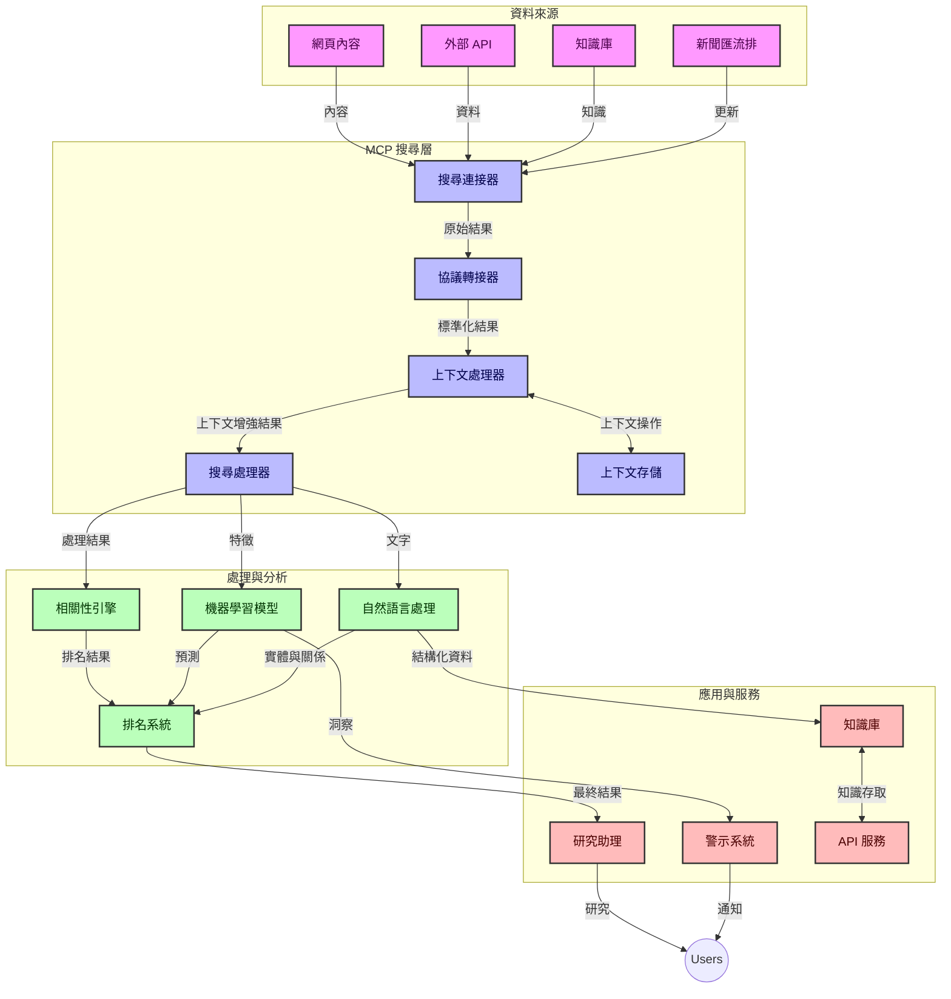
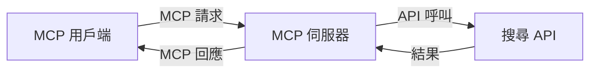
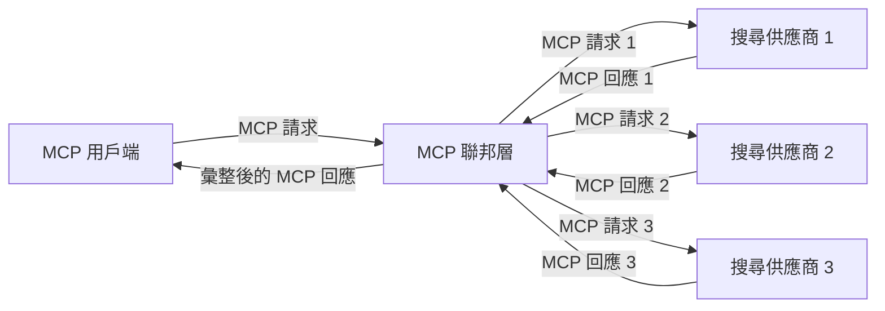
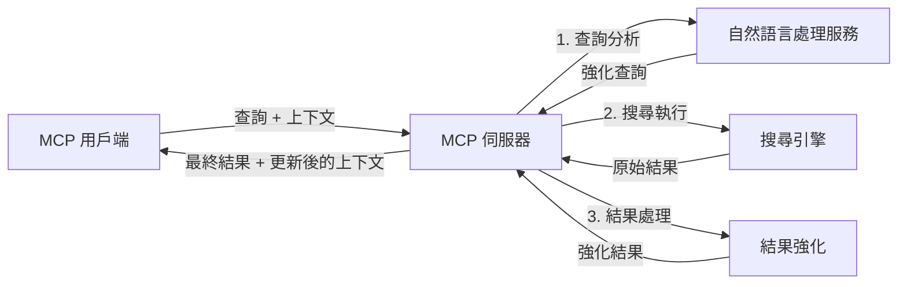

# 即時網路搜尋的模型上下文協議

## 概述

即時網路搜尋在當今資訊驅動的環境中已成為必要，應用程式需要即時存取遍布網際網路的最新資訊，以提供相關且及時的回應。模型上下文協議（MCP）代表了優化這些即時搜尋流程的重要進展，提升搜尋效率、維持上下文完整性並增進整體系統效能。

本模組探討 MCP 如何透過在 AI 模型、搜尋引擎和應用程式間提供標準化的上下文管理方法，改變即時網路搜尋。

### 您將學到的內容

在本完整指南中，您將發現：

- MCP 如何在 AI 模型與即時網路搜尋能力之間建立無縫橋樑
- 利用 MCP 實現高效且可擴展搜尋解決方案的架構模式
- 保存多次查詢與互動間搜尋上下文的技術
- 用 Python 與 JavaScript 實作多種搜尋情境的範例程式碼
- 在 MCP 驅動的搜尋系統中，平衡相關性、新鮮度與效能的方法

## 即時網路搜尋簡介

即時網路搜尋是一項技術方法，使系統能持續對網頁資訊進行查詢、處理與分析，同時獲取與處理發布或更新的資訊，從而在最低延遲下提供最新且相關的資訊。與傳統基於已編製索引且可能數小時或數天前的資料的搜尋系統不同，即時搜尋處理來自網路的即時資料，提供反映線上內容當前狀態的見解與資訊。

### 即時網路搜尋的核心概念：

- <strong>持續查詢處理</strong>：對持續更新的資料來源處理搜尋查詢
- <strong>最新優先</strong>：系統設計以優先取得新鮮資訊
- <strong>相關性平衡</strong>：維持相關性與新鮮度之間的平衡
- <strong>可擴展架構</strong>：系統必須能處理變動的查詢負載與資料量
- <strong>上下文理解</strong>：在多次搜尋中維持用戶上下文，對取得有意義的結果至關重要
- <strong>動態查詢重構</strong>：根據上下文與先前結果自適應調整查詢
- <strong>多來源整合</strong>：結合多個搜尋供應商與網路資源的結果
- <strong>語意理解</strong>：基於含義處理查詢與內容，而非僅關鍵字
- <strong>即時排序</strong>：隨著新資訊出現，持續調整結果排序

### 模型上下文協議與即時網路搜尋

模型上下文協議（MCP）解決了即時網路搜尋環境中的多項關鍵挑戰：

1. <strong>搜尋上下文保存</strong>：MCP 標準化在分散式搜尋元件間維持上下文的方式，確保 AI 模型和處理節點能存取相關的查詢歷史與使用者偏好。

2. <strong>高效查詢管理</strong>：透過提供結構化的上下文傳遞機制，MCP 降低在每次搜尋迭代中重複上下文的負擔。

3. <strong>互通性</strong>：MCP 為多樣搜尋技術與 AI 模型間的上下文分享建立共通語言，使架構更具彈性與擴展性。

4. <strong>搜尋優化上下文</strong>：MCP 實作可優先排序對有效搜尋最有用的上下文元素，優化效能與準確性。

5. <strong>自適應搜尋處理</strong>：透過 MCP 的妥善上下文管理，搜尋系統能根據不斷變化的用戶需求與資訊環境動態調整處理。

在從新聞聚合到研究輔助等現代應用中，MCP 與網路搜尋技術的整合，使搜尋更智慧且具備上下文感知能力，隨著用戶互動持續提供更相關的結果。

## 學習目標

本課程結束後，您將能夠：

- 理解即時網路搜尋的基礎及其在現代應用中的挑戰
- 說明模型上下文協議（MCP）如何增強即時網路搜尋能力
- 使用主流程式框架與 API 實作基於 MCP 的搜尋解決方案
- 設計並部署可擴展且高效能的 MCP 搜尋架構
- 將 MCP 概念應用於語意搜尋、研究輔助與 AI 增強瀏覽等各種案例
- 評估 MCP 搜尋技術中的新趨勢與未來創新
- 開發從用戶互動中學習的上下文感知搜尋系統
- 利用標準 MCP 協議將網路搜尋能力整合至 AI 助理
- 建構多階段搜尋管線，依據上下文逐步精煉結果
- 優化搜尋效能並維護全面的上下文感知能力

### 定義與重要性

即時網路搜尋涵蓋以最小延遲持續查詢、擷取與提供基於網路的資訊。與周期性爬網和編制索引的傳統搜尋引擎不同，即時搜尋旨在隨資訊發布即時呈現內容，實現最快速存取最新資訊。

即時網路搜尋的關鍵特徵包括：

- <strong>新鮮度</strong>：優先呈現最新內容與更新
- <strong>持續處理</strong>：持續監控新資訊
- <strong>查詢調整</strong>：根據上下文與反饋優化搜尋查詢
- <strong>即時提供</strong>：以最小延遲提供搜尋結果
- <strong>上下文保留</strong>：基於先前查詢累積，提高相關性

### 傳統網路搜尋的挑戰

傳統網路搜尋在即時場景中面臨多項限制：

1. <strong>上下文碎片化</strong>：難以在多次查詢中維持上下文
2. <strong>資訊新鮮度</strong>：取得及優先最新資訊具挑戰
3. <strong>整合複雜度</strong>：搜尋系統與應用間互通性問題
4. <strong>延遲問題</strong>：在全面搜尋與回應時間間取得平衡
5. <strong>相關性調校</strong>：優先新鮮度同時確保準確與相關

## 理解搜尋領域的模型上下文協議（MCP）

### 搜尋上下文中的 MCP 是什麼？

模型上下文協議（MCP）是一個標準化的通訊協議，旨在促進 AI 模型與應用程式間的高效互動。在即時網路搜尋領域，MCP 提供框架：

- 保存查詢序列中的搜尋上下文
- 標準化搜尋查詢及結果格式
- 優化搜尋參數及結果的傳輸
- 加強模型與搜尋引擎間的溝通

### 核心組件與架構

MCP 用於即時網路搜尋的架構包含多個關鍵組件：

1. <strong>查詢上下文處理器</strong>：管理並維持多次查詢間的搜尋上下文
2. <strong>搜尋處理器</strong>：利用上下文感知技術處理進入的搜尋請求
3. <strong>協議轉接器</strong>：在不同搜尋 API 間轉換，同時保留上下文
4. <strong>上下文存儲庫</strong>：高效存取搜尋歷史與偏好
5. <strong>搜尋連接器</strong>：連接多種搜尋引擎及網路 API



### MCP 如何改進即時網路搜尋

MCP 通過以下方式解決傳統網路搜尋挑戰：

- <strong>上下文持續性</strong>：維護整個搜尋階段中查詢間的關聯
- <strong>優化傳輸</strong>：透過智慧上下文管理減少搜尋參數的重複
- <strong>標準介面</strong>：為搜尋元件提供一致的 API
- <strong>降低延遲</strong>：通過高效上下文處理減少運算負擔
- <strong>提高相關性</strong>：保存用戶意圖，提升多次查詢間的搜尋相關性

## 整合與實作

即時網路搜尋系統需要細心的架構設計與實作，以維持效能及上下文的完整。模型上下文協議提供了標準化的路徑來整合 AI 模型與搜尋技術，實現更先進、具上下文感知能力的搜尋流程。

### MCP 在搜尋架構中整合概述

在即時網路搜尋環境中實施 MCP 需考慮多項關鍵因素：

1. <strong>搜尋上下文序列化</strong>：MCP 提供高效機制於搜尋請求中編碼上下文資訊，確保重要上下文隨查詢於處理流程中傳遞，包含為搜尋相關元資料優化的標準序列化格式。

2. <strong>有狀態搜尋處理</strong>：MCP 可維持一致上下文表示，讓搜尋迭代更智慧，特別是在多階段搜尋管線中上下文優化能提升結果。

3. <strong>查詢擴充與優化</strong>：MCP 實作可利用彙整的上下文進行複雜的查詢擴展與優化，使搜尋階段結果更相關。

4. <strong>結果快取與優先排序</strong>：藉由標準化上下文處理，MCP 幫助管理結果快取與排序，讓元件可依演變的搜尋上下文調整。

5. <strong>搜尋聯邦與聚合</strong>：MCP 透過提供結構化搜尋上下文表示，促進跨多個後端更先進的搜尋聯邦，實現來自不同來源的結果更有意義的聚合。

MCP 在多項搜尋技術中的實作創造統一的上下文管理方法，減少客製整合程式碼需求，並強化系統隨著搜尋查詢演進維持有意義上下文的能力。

### MCP 在各種網路搜尋實作中的應用

以下範例遵循當前 MCP 規範，專注於基於 JSON-RPC 的協議與獨立的傳輸機制。程式碼展示如何在實作自訂搜尋整合時，保持與 MCP 協議的完美兼容。


<details>
<summary>使用通用搜尋 API 的 Python 實作</summary>

```python
import asyncio
import json
import aiohttp
from typing import Dict, Any, Optional, List
from contextlib import asynccontextmanager
from collections.abc import AsyncIterator

# 匯入標準 MCP 函式庫
from mcp.client.session import ClientSession
from mcp.client.streamable_http import streamablehttp_client
from mcp.types import TextContent, CreateMessageRequestParams, CreateMessageResult
from mcp.server.fastmcp import FastMCP

# 建立用於網頁搜尋的 FastMCP 伺服器
search_server = FastMCP("WebSearch")

# 處理網頁搜尋操作的類別
class WebSearchHandler:
    def __init__(self, api_endpoint: str, api_key: str):
        self.api_endpoint = api_endpoint
        self.api_key = api_key
        self.session = None
        
    async def initialize(self):
        """Initialize the HTTP session"""
        self.session = aiohttp.ClientSession(
            headers={"Authorization": f"Bearer {self.api_key}"}
        )
    
    async def close(self):
        """Close the HTTP session"""
        if self.session:
            await self.session.close()
            
    async def perform_search(self, query: str, max_results: int = 5, 
                           include_domains: List[str] = None, 
                           exclude_domains: List[str] = None,
                           time_period: str = "any") -> Dict[str, Any]:
        """Perform web search using the search API"""
        # 建構搜尋參數
        search_params = {
            "q": query,
            "limit": max_results,
            "time": time_period
        }
        
        if include_domains:
            search_params["site"] = ",".join(include_domains)
            
        if exclude_domains:
            search_params["exclude_site"] = ",".join(exclude_domains)
        
        # 執行搜尋請求
        try:
            async with self.session.get(
                self.api_endpoint,
                params=search_params
            ) as response:
                if response.status != 200:
                    error_text = await response.text()
                    raise Exception(f"Search API error: {response.status} - {error_text}")
                
                search_data = await response.json()
                
                # 將 API 特定的回應轉換成標準格式
                results = []
                for item in search_data.get("results", []):
                    results.append({
                        "title": item.get("title", ""),
                        "url": item.get("url", ""),
                        "snippet": item.get("snippet", ""),
                        "date": item.get("published_date", ""),
                        "source": item.get("source", "")
                    })
                
                return {
                    "query": query,
                    "totalResults": len(results),
                    "results": results
                }
        except Exception as e:
            print(f"Search API request error: {e}")
            raise

# 初始化搜尋處理器
search_handler = WebSearchHandler(
    api_endpoint="https://api.search-service.example/search",
    api_key="your-api-key-here"
)

# 設定生命週期以管理搜尋處理器
@asyncio.asynccontextmanager
async def app_lifespan(server: FastMCP):
    """Manage application lifecycle"""
    await search_handler.initialize()
    try:
        yield {"search_handler": search_handler}
    finally:
        await search_handler.close()

# 設定伺服器的生命週期
search_server = FastMCP("WebSearch", lifespan=app_lifespan)

# 註冊一個網頁搜尋工具
@search_server.tool()
async def web_search(query: str, max_results: int = 5, 
                   include_domains: List[str] = None,
                   exclude_domains: List[str] = None,
                   time_period: str = "any") -> Dict[str, Any]:
    """
    Search the web for information
    
    Args:
        query: The search query
        max_results: Maximum number of results to return (default: 5)
        include_domains: List of domains to include in search results
        exclude_domains: List of domains to exclude from search results
        time_period: Time period for results ("day", "week", "month", "any")
        
    Returns:
        Dictionary containing search results
    """
    ctx = search_server.get_context()
    search_handler = ctx.request_context.lifespan_context["search_handler"]
    
    results = await search_handler.perform_search(
        query=query,
        max_results=max_results,
        include_domains=include_domains,
        exclude_domains=exclude_domains,
        time_period=time_period
    )
    
    return results

# 範例用戶端使用方式
async def client_example():
    # 使用 Streamable HTTP 傳輸連接搜尋伺服器
    async with streamablehttp_client("http://localhost:8000/mcp") as (read, write, _):
        async with ClientSession(read, write) as session:
            # 初始化連線
            await session.initialize()
            
            # 呼叫 web_search 工具
            search_results = await session.call_tool(
                "web_search", 
                {
                    "query": "latest developments in AI and Model Context Protocol",
                    "max_results": 5,
                    "time_period": "day",
                    "include_domains": ["github.com", "microsoft.com"]
                }
            )
            
            print(f"Search results: {search_results}")

# 伺服器執行範例
if __name__ == "__main__":
    # 使用 Streamable HTTP 傳輸執行伺服器
    search_server.run(transport="streamable-http")
```
</details> 

<details>
<summary>在瀏覽器中使用 JavaScript 實作搜尋</summary>


```javascript
// MCP 伺服器實作，用於網路搜尋
import { McpServer, ResourceTemplate } from '@modelcontextprotocol/sdk/server/mcp.js';
import { StreamableHTTPServerTransport } from '@modelcontextprotocol/sdk/server/streamableHttp.js';
import { z } from 'zod';

// 建立一個用於網路搜尋的 MCP 伺服器
const searchServer = new McpServer({
    name: "BrowserSearch",
    description: "A server that provides web search capabilities"
});

// 搜尋服務類別
class SearchService {
    constructor(searchApiUrl, apiKey) {
        this.searchApiUrl = searchApiUrl;
        this.apiKey = apiKey;
    }

    async performSearch(parameters) {
        const {
            query = '',
            maxResults = 5,
            includeDomains = [],
            excludeDomains = [],
            timePeriod = 'any'
        } = parameters;
        
        // 使用參數建立搜尋網址
        const url = new URL(this.searchApiUrl);
        url.searchParams.append('q', query);
        url.searchParams.append('limit', maxResults);
        url.searchParams.append('time', timePeriod);
        
        if (includeDomains.length > 0) {
            url.searchParams.append('site', includeDomains.join(','));
        }
        
        if (excludeDomains.length > 0) {
            url.searchParams.append('exclude_site', excludeDomains.join(','));
        }
        
        try {
            const response = await fetch(url.toString(), {
                method: 'GET',
                headers: {
                    'Authorization': `Bearer ${this.apiKey}`,
                    'Content-Type': 'application/json'
                }
            });
            
            if (!response.ok) {
                const errorText = await response.text();
                throw new Error(`Search API error: ${response.status} - ${errorText}`);
            }
            
            const searchData = await response.json();
            
            // 將 API 特定的回應轉換為標準格式
            const results = searchData.results?.map(item => ({
                title: item.title || '',
                url: item.url || '',
                snippet: item.snippet || '',
                date: item.published_date || '',
                source: item.source || ''
            })) || [];
            
            return {
                query,
                totalResults: results.length,
                results
            };
        } catch (error) {
            console.error('Search API request error:', error);
            throw error;
        }
    }
}

// 初始化搜尋服務
const searchService = new SearchService(
    'https://api.search-service.example/search',
    'your-api-key-here'
);

// 設定伺服器的上下文提供者
searchServer.setContextProvider(() => {
    return {
        searchService
    };
});

// 註冊網路搜尋工具
searchServer.tool({
    name: 'web_search',
    description: 'Search the web for information',
    parameters: {
        type: 'object',
        properties: {
            query: {
                type: 'string',
                description: 'The search query'
            },
            maxResults: {
                type: 'integer',
                description: 'Maximum number of results to return',
                default: 5
            },
            includeDomains: {
                type: 'array',
                items: { type: 'string' },
                description: 'List of domains to include in search results'
            },
            excludeDomains: {
                type: 'array',
                items: { type: 'string' },
                description: 'List of domains to exclude from search results'
            },
            timePeriod: {
                type: 'string',
                description: 'Time period for results',
                enum: ['day', 'week', 'month', 'any'],
                default: 'any'
            }
        },
        required: ['query']
    },
    handler: async (params, context) => {
        const { searchService } = context;
        return await searchService.performSearch(params);
    }
});

// 連線到搜尋伺服器的範例客戶端程式碼
import { Client } from '@modelcontextprotocol/sdk/client/index.js';
import { StreamableHTTPClientTransport } from '@modelcontextprotocol/sdk/client/streamableHttp.js';

async function connectToSearchServer() {
    // 連接到搜尋伺服器
    const transport = new StreamableHTTPClientTransport(
        new URL('http://localhost:8000/mcp')
    );
    
    const client = new Client({
        name: 'search-client',
        version: '1.0.0'
    });
    
    await client.connect(transport);
    
    // 執行搜尋工具
    const searchResults = await client.callTool({
        name: 'web_search',
        arguments: {
            query: 'Model Context Protocol implementation examples',
            maxResults: 10,
            timePeriod: 'week',
            includeDomains: ['github.com', 'docs.microsoft.com']
        }
    });
    
    console.log('Search results:', searchResults);
    
    // 清理
    await client.disconnect();
}

// 啟動伺服器
const transport = new StreamableHTTPServerTransport();
await searchServer.connect(transport);
console.log('Search server running at http://localhost:8000/mcp');

// 在不同的程序中或伺服器啟動後
// connectToSearchServer().catch(console.error);
```
</details> 


## 程式碼範例免責聲明

> <strong>重要說明</strong>：以下程式碼範例示範模型上下文協議（MCP）與網路搜尋功能的整合。雖然遵循官方 MCP SDK 的模式與結構，為教學目的已簡化。
> 
> 範例涵蓋：
> 
> 1. **Python 實作**：FastMCP 伺服器實作，提供網路搜尋工具並連接外部搜尋 API。此範例展現正確的生命週期管理、上下文處理與工具實作，遵循 [官方 MCP Python SDK](https://github.com/modelcontextprotocol/python-sdk) 的模式。該伺服器使用推薦的 Streamable HTTP 傳輸，已取代舊有的 SSE 傳輸，適合生產環境部署。
> 
> 2. **JavaScript 實作**：利用 [官方 MCP TypeScript SDK](https://github.com/modelcontextprotocol/typescript-sdk) 中 FastMCP 模式的 TypeScript/JavaScript 實作，建構有適當工具定義與用戶端連接的搜尋伺服器，遵循最新建議的會話管理與上下文保存模式。
> 
> 這些範例在生產環境中須加強錯誤處理、認證及特定 API 整合程式碼。示範的搜尋 API 端點（`https://api.search-service.example/search`）為占位符，需替換為實際的搜尋服務端點。
> 
> 欲取得完整實作細節與最新方法，請參閱 [官方 MCP 規範](https://spec.modelcontextprotocol.io/) 及 SDK 文件。

## 核心概念

### 模型上下文協議 (MCP) 框架

MCP 的基礎是提供 AI 模型、應用程式與服務間交換上下文的標準化方法。在即時網路搜尋中，此框架對實現連貫的多輪搜尋體驗必不可少。主要組件包括：

1. **客戶端-伺服器架構**：MCP 建立搜尋客戶端（請求方）與搜尋伺服器（提供方）間的明確分離，支持彈性部署模式。

2. **JSON-RPC 通訊**：協議使用 JSON-RPC 進行消息交換，兼容網路技術，易於跨平台實作。

3. <strong>上下文管理</strong>：MCP 定義維護、更新及利用多次互動間搜尋上下文的結構化方法。

4. <strong>工具定義</strong>：以標準化工具形式暴露搜尋功能，具備明確參數與回傳值。

5. <strong>串流支持</strong>：協議支持搜尋結果串流，適用於結果逐步到達的即時搜尋。

### 網路搜尋整合模式

整合 MCP 與網路搜尋時，浮現多種典型模式：

#### 1. 直接搜尋供應商整合



此模式中，MCP 伺服器直接介接一個或多個搜尋 API，將 MCP 請求轉換為特定 API 呼叫，並格式化結果為 MCP 回應。

#### 2. 支援上下文保存的聯邦搜尋



此模式分散搜尋查詢至多個 MCP 相容搜尋供應商，各自專注不同內容或搜尋能力，並維持統一上下文。

#### 3. 上下文強化搜尋鏈



此模式將搜尋過程分為多階段，每步強化上下文，產生逐步更相關結果。

### 搜尋上下文組成元件

在基於 MCP 的網路搜尋中，上下文通常包含：

- <strong>查詢歷史</strong>：工作階段中先前的搜尋查詢
- <strong>用戶偏好</strong>：語言、地區、安全搜尋設定
- <strong>互動歷史</strong>：點擊過的結果、於結果上停留時間
- <strong>搜尋參數</strong>：篩選器、排序條件及其他搜尋修改項
- <strong>領域知識</strong>：與搜尋相關的主題上下文
- <strong>時間上下文</strong>：基於時間的相關性因素
- <strong>來源偏好</strong>：信任或偏好的資訊來源

## 使用案例與應用

### 研究與資訊收集

MCP 改善研究工作流程：

- 保存多次搜尋會話間的研究上下文
- 支持更複雜且符合上下文的查詢
- 支援多來源搜尋聯邦
- 促進從搜尋結果中萃取知識

### 即時新聞與趨勢監控

MCP 驅動的搜尋在新聞監控方面優勢為：

- 近即時發現新興新聞事件
- 相關資訊的上下文過濾
- 跨多來源的主題與實體追蹤
- 基於用戶上下文的個人化新聞提醒

### AI 增強瀏覽與研究

MCP 為 AI 增強瀏覽創造新可能性：

- 基於當前瀏覽器活動的上下文搜尋建議
- 網路搜尋與大型語言模型助理的無縫整合
- 多輪搜尋精煉且保持上下文
- 強化事實核查與資訊驗證

## 未來趨勢與創新

### MCP 在網路搜尋中的演進

展望未來，我們預期 MCP 將演進以應對：


- <strong>多模態搜尋</strong>：整合文字、影像、音訊與影片搜尋並保留上下文
- <strong>去中心化搜尋</strong>：支援分散式與聯邦搜尋生態系統
- <strong>搜尋隱私</strong>：具有上下文感知的隱私保護搜尋機制
- <strong>查詢理解</strong>：對自然語言搜尋查詢進行深度語意解析

### 未來技術的潛在進展

將塑造MCP搜尋未來的新興技術：

1. <strong>神經搜尋架構</strong>：為MCP優化的向量嵌入搜尋系統
2. <strong>個人化搜尋上下文</strong>：隨時間學習個別用戶搜尋模式
3. <strong>知識圖譜整合</strong>：藉由領域特定知識圖譜強化上下文搜尋
4. <strong>跨模態上下文</strong>：維持不同搜尋模式間的上下文連續性

## 實作練習

### 練習1：設定基礎的MCP搜尋流程

在此練習中，你將學會如何：
- 配置基礎的MCP搜尋環境
- 實作網頁搜尋的上下文處理器
- 測試並驗證搜尋迭代中的上下文保存

### 練習2：利用MCP搜尋構建研究助理

創建一個完整應用，能夠：
- 處理自然語言研究問題
- 執行具上下文感知的網頁搜尋
- 綜合多個資訊來源的資料
- 呈現有條理的研究結果

### 練習3：實作多源搜尋聯邦機制的MCP

進階練習涵蓋：
- 具上下文感知的查詢派發至多個搜尋引擎
- 結果排序與聚合
- 搜尋結果的上下文去重
- 處理來源特定的元資料

## 附加資源

- [Model Context Protocol 規範](https://spec.modelcontextprotocol.io/) - MCP官方規範與詳細協議文件
- [Model Context Protocol 文件](https://modelcontextprotocol.io/) - 詳細教學與實作指南
- [MCP Python SDK](https://github.com/modelcontextprotocol/python-sdk) - MCP協議的官方Python實作
- [MCP TypeScript SDK](https://github.com/modelcontextprotocol/typescript-sdk) - MCP協議的官方TypeScript實作
- [MCP參考伺服器](https://github.com/modelcontextprotocol/servers) - MCP伺服器的參考實作
- [Bing網頁搜尋API文件](https://learn.microsoft.com/en-us/bing/search-apis/bing-web-search/overview) - 微軟網頁搜尋API
- [Google自訂搜尋JSON API](https://developers.google.com/custom-search/v1/overview) - Google的可程式化搜尋引擎
- [SerpAPI 文件](https://serpapi.com/search-api) - 搜尋引擎結果頁API
- [Meilisearch 文件](https://www.meilisearch.com/docs) - 開源搜尋引擎
- [Elasticsearch 文件](https://www.elastic.co/guide/index.html) - 分散式搜尋及分析引擎
- [LangChain 文件](https://python.langchain.com/docs/get_started/introduction) - 使用大型語言模型構建應用

## 學習成果

完成本模組後，你將能夠：

- 理解即時網頁搜尋的基本原理及其挑戰
- 解釋Model Context Protocol (MCP) 如何提升即時網頁搜尋能力
- 使用流行框架與API實作基於MCP的搜尋解決方案
- 設計與部署可擴展且高效能的MCP搜尋架構
- 將MCP概念應用於語意搜尋、研究協助及AI增強瀏覽等多種案例
- 評估MCP搜尋技術的新興趨勢與未來創新


### 信任與安全考量

在實作基於MCP的網頁搜尋解決方案時，請務必遵循MCP規範中的重要原則：

1. <strong>用戶同意與控制</strong>：用戶必須明確同意並理解所有資料存取與操作。這對可能存取外部資料源的網頁搜尋實作尤其重要。

2. <strong>資料隱私</strong>：確保妥善處理搜尋查詢與結果，特別是可能含有敏感資訊時。實施適當的存取控管以保護用戶資料。

3. <strong>工具安全</strong>：為搜尋工具實作妥善的授權與驗證，因為它們可能透過任意程式碼執行帶來安全風險。工具行為的描述除非來自可信伺服器，否則應視為不可信。

4. <strong>清晰文件</strong>：提供清晰的文件說明MCP搜尋實作的能力、限制與安全考量，遵循MCP規範的實作指引。

5. <strong>強健的同意流程</strong>：建立強健且清楚的同意與授權流程，在授權工具使用前明確說明每項工具的功能，尤其是與外部網路資源互動的工具。

有關MCP安全與信任考量的完整細節，請參考[官方文件](https://modelcontextprotocol.io/specification/2025-11-25/basic/security_best_practices)。

## 接下來的步驟

- [5.12 使用Entra ID驗證Model Context Protocol伺服器](../mcp-security-entra/README.md)

---

<!-- CO-OP TRANSLATOR DISCLAIMER START -->
**免責聲明**：
此文件已使用 AI 翻譯服務 [Co-op Translator](https://github.com/Azure/co-op-translator) 進行翻譯。雖然我們努力追求準確性，但請注意自動翻譯可能包含錯誤或不準確之處。原始文件的母語版本應視為權威來源。對於關鍵資訊，建議採用專業人工翻譯。我們不對因使用此翻譯所產生的任何誤解或誤譯承擔責任。
<!-- CO-OP TRANSLATOR DISCLAIMER END -->