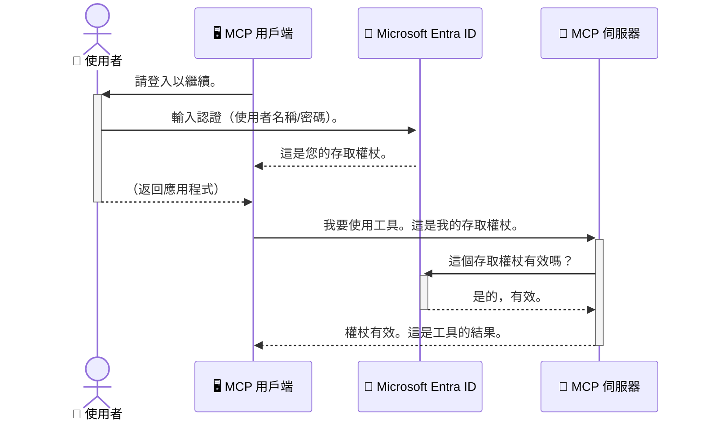

# 保護 AI 工作流程：用於模型上下文協議伺服器的 Entra ID 驗證

> [!NOTE]
> 本課程中的遠端伺服器程式碼保護舊有的 `/sse` 和 `/message` 端點，
> 並針對 MCP `2025-11-25` 版本。保持其身份及令牌驗證做法，
> 但對於新的實作，請使用相容於 `2026-07-28` 版本的可串流 HTTP 傳輸。


## 介紹
保護您的模型上下文協議（MCP）伺服器就像鎖好您家的大門一樣重要。若將 MCP 伺服器開放，您的工具和資料可能遭非授權存取，導致安全漏洞。Microsoft Entra ID 提供強大的雲端身份和存取管理解決方案，確保只有授權的使用者和應用程式能與您的 MCP 伺服器互動。在本節中，您將學會如何使用 Entra ID 驗證保護 AI 工作流程。

## 學習目標
本節結束後，您將能夠：

- 了解保護 MCP 伺服器的重要性。
- 解釋 Microsoft Entra ID 及 OAuth 2.0 驗證的基本原理。
- 辨識公開用戶端與機密用戶端的差異。
- 在本地（公開用戶端）及遠端（機密用戶端）MCP 伺服器場景中實作 Entra ID 驗證。
- 在開發 AI 工作流程時，應用安全最佳實踐。

## 安全性與 MCP

正如您不會將家門隨意開著，您也不應讓 MCP 伺服器隨意開放供任何人存取。保護您的 AI 工作流程對建立穩健、值得信賴且安全的應用程式至關重要。本章介紹如何利用 Microsoft Entra ID 來保護您的 MCP 伺服器，確保只有授權的使用者和應用程式能使用您的工具和資料。

## 為何 MCP 伺服器的安全性至關重要

想像您的 MCP 伺服器有一個工具能寄送電子郵件或存取客戶資料庫。若伺服器沒受到保護，任何人都可能使用該工具，導致資料未授權存取、垃圾郵件或其他惡意行為。

實作驗證能確保對伺服器的每個請求都經過驗證，確認請求的使用者或應用程式身份。這是保護 AI 工作流程的第一步，也是最重要的一步。

## Microsoft Entra ID 介紹

[**Microsoft Entra ID**](https://adoption.microsoft.com/microsoft-security/entra/) 是一項基於雲端的身份和存取管理服務。可以將它想像為您應用程式的百萬防護安全員。它負責複雜的使用者身份驗證（Authentication）及授權（Authorization）流程。

利用 Entra ID，您可以：

- 啟用使用者安全登入。
- 保護 API 和服務。
- 從中央位置管理存取政策。

對 MCP 伺服器而言，Entra ID 提供強大且被廣泛信賴的方案來管理誰可以使用您的伺服器功能。

---

## 了解奧妙：Entra ID 驗證如何運作

Entra ID 採用像 **OAuth 2.0** 這樣的開放標準來處理驗證。儘管細節可能複雜，其核心概念簡單，可以透過比喻理解。

### OAuth 2.0 溫和入門：代客鑰匙

將 OAuth 2.0 想像成您的車輛代客泊車服務。當您到餐廳時，不會給代客您的主鑰匙，而是給他一把<strong>代客鑰匙</strong>，這把鑰匙權限有限──可以發動車子與鎖門，但不能打開行李廂或手套箱。

在這個比喻中：

- <strong>您</strong> 是 <strong>使用者</strong>。
- <strong>您的車</strong> 是擁有寶貴工具和資料的 **MCP 伺服器**。
- <strong>代客</strong> 是 **Microsoft Entra ID**。
- <strong>泊車員</strong> 是 **MCP 用戶端**（嘗試存取伺服器的應用程式）。
- <strong>代客鑰匙</strong> 是 <strong>存取令牌</strong>。

存取令牌是一串安全的文字，使用者登入後 MCP 用戶端從 Entra ID 取得此令牌。用戶端在每次請求時會帶著它給 MCP 伺服器，伺服器就能驗證令牌，確認請求的合法性及用戶端擁有必要的權限，且全程不須處理您的真實憑證（如密碼）。

### 驗證流程

流程實際運作如下：



### Microsoft Authentication Library (MSAL) 介紹

在深入程式碼前，先介紹範例中會用到的重要元件：**Microsoft Authentication Library (MSAL)**。

MSAL 是微軟開發的函式庫，讓開發者更輕鬆處理驗證；您無需自行撰寫複雜的安全令牌管理、登入及會話更新程式碼，MSAL 將代為完成繁重工作。

推薦使用 MSAL 的理由：

- **安全可靠：** 實作業界標準協議及安全最佳實踐，降低程式碼漏洞風險。
- **簡化開發：** 抽象化 OAuth 2.0 與 OpenID Connect 協議的複雜性，只需少量程式碼即可加入強大驗證。
- **持續維護：** 微軟積極維護更新 MSAL 以因應新威脅及平台變更。

MSAL 支援多種語言與應用程式框架，包括 .NET、JavaScript/TypeScript、Python、Java、Go，以及 iOS 和 Android 等行動平台，讓您能在整個技術堆疊中採用一致的驗證模式。

想深入了解 MSAL，可以參考官方 [MSAL 概覽文件](https://learn.microsoft.com/entra/identity-platform/msal-overview)。

---

## 使用 Entra ID 保護您的 MCP 伺服器：逐步指南

現在，我們來看看如何用 Entra ID 保護本地 MCP 伺服器（透過 `stdio` 通訊）。本範例使用 <strong>公開用戶端</strong>，適用於在使用者機器上執行的應用程式，如桌面應用程式或本地開發伺服器。

### 情境一：使用公開用戶端保護本地 MCP 伺服器

此情境中，我們探討一個在本地運行，透過 `stdio` 通訊，且在允許使用工具前使用 Entra ID 驗證使用者的 MCP 伺服器。伺服器有一個工具會從 Microsoft Graph API 抓取使用者個人資料。

#### 1. 在 Entra ID 中設定應用程式

撰寫程式碼前，需先在 Microsoft Entra ID 中註冊您的應用程式。此作業告訴 Entra ID 您的應用程式並授權其使用驗證服務。

1. 前往 **[Microsoft Entra 入口網站](https://entra.microsoft.com/)**。
2. 點選 <strong>應用程式註冊</strong>，並按 <strong>新增註冊</strong>。
3. 為應用程式命名（例如「我的本地 MCP 伺服器」）。
4. 在 <strong>受支援的帳戶類型</strong> 選擇 <strong>僅此組織目錄中的帳戶</strong>。
5. 本範例中可將 **重新導向 URI** 留空。
6. 按 <strong>註冊</strong>。

註冊完成後，請記下 **應用程式（用戶端）ID** 與 **目錄（租用戶）ID**，程式碼會使用到。

#### 2. 程式碼說明

讓我們看看負責驗證的核心程式碼。完整範例程式碼存放於 [mcp-auth-servers GitHub 倉庫](https://github.com/Azure-Samples/mcp-auth-servers) 的 [Entra ID - Local - WAM](https://github.com/Azure-Samples/mcp-auth-servers/tree/main/src/entra-id-local-wam) 資料夾中。

**`AuthenticationService.cs`**

此類別處理與 Entra ID 的互動。

- **`CreateAsync`**：此方法初始化 MSAL 的 `PublicClientApplication`，並用您的應用程式 `clientId` 和 `tenantId` 設定。
- **`WithBroker`**：啟用使用中介服務（如 Windows Web Account Manager），提供更安全且無縫的單點登入體驗。
- **`AcquireTokenAsync`**：核心方法。它會嘗試靜默取得令牌（若使用者已有有效工作階段，則無需重新登入），若失敗則互動式提示使用者登入。

```csharp
// Simplified for clarity
public static async Task<AuthenticationService> CreateAsync(ILogger<AuthenticationService> logger)
{
    var msalClient = PublicClientApplicationBuilder
        .Create(_clientId) // Your Application (client) ID
        .WithAuthority(AadAuthorityAudience.AzureAdMyOrg)
        .WithTenantId(_tenantId) // Your Directory (tenant) ID
        .WithBroker(new BrokerOptions(BrokerOptions.OperatingSystems.Windows))
        .Build();

    // ... cache registration ...

    return new AuthenticationService(logger, msalClient);
}

public async Task<string> AcquireTokenAsync()
{
    try
    {
        // Try silent authentication first
        var accounts = await _msalClient.GetAccountsAsync();
        var account = accounts.FirstOrDefault();

        AuthenticationResult? result = null;

        if (account != null)
        {
            result = await _msalClient.AcquireTokenSilent(_scopes, account).ExecuteAsync();
        }
        else
        {
            // If no account, or silent fails, go interactive
            result = await _msalClient.AcquireTokenInteractive(_scopes).ExecuteAsync();
        }

        return result.AccessToken;
    }
    catch (Exception ex)
    {
        _logger.LogError(ex, "An error occurred while acquiring the token.");
        throw; // Optionally rethrow the exception for higher-level handling
    }
}
```

**`Program.cs`**

此處負責設定 MCP 伺服器及整合驗證服務。

- **`AddSingleton<AuthenticationService>`**：將 `AuthenticationService` 註冊至依賴注入容器，供應用程式其他部分（如工具）使用。
- **`GetUserDetailsFromGraph` 工具**：此工具需要 `AuthenticationService` 實例。在執行前呼叫 `authService.AcquireTokenAsync()` 取得有效存取令牌。驗證成功後，使用此令牌呼叫 Microsoft Graph API 取得使用者詳細資料。

```csharp
// Simplified for clarity
[McpServerTool(Name = "GetUserDetailsFromGraph")]
public static async Task<string> GetUserDetailsFromGraph(
    AuthenticationService authService)
{
    try
    {
        // This will trigger the authentication flow
        var accessToken = await authService.AcquireTokenAsync();

        // Use the token to create a GraphServiceClient
        var graphClient = new GraphServiceClient(
            new BaseBearerTokenAuthenticationProvider(new TokenProvider(authService)));

        var user = await graphClient.Me.GetAsync();

        return System.Text.Json.JsonSerializer.Serialize(user);
    }
    catch (Exception ex)
    {
        return $"Error: {ex.Message}";
    }
}
```

#### 3. 整體運作流程

1. MCP 用戶端嘗試使用 `GetUserDetailsFromGraph` 工具時，該工具先呼叫 `AcquireTokenAsync`。
2. `AcquireTokenAsync` 觸發 MSAL 庫檢查是否有有效令牌。
3. 若無令牌，MSAL 透過中介服務提示使用者以 Entra ID 帳戶登入。
4. 使用者登入後，Entra ID 發出存取令牌。
5. 工具收到令牌，並用於向 Microsoft Graph API 執行安全呼叫。
6. 使用者詳細資料回傳給 MCP 用戶端。

該流程確保只有經驗證的使用者能使用該工具，有效保護您的本地 MCP 伺服器。

### 情境二：使用機密用戶端保護遠端 MCP 伺服器

當您的 MCP 伺服器在遠端機器上運行（如雲端伺服器）且使用 HTTP Streaming 等通訊協定時，安全需求有所不同。此時，應使用 <strong>機密用戶端</strong> 與 <strong>授權碼流程</strong>。此方法更安全，因為應用程式的密鑰無需暴露於瀏覽器。

本範例使用基於 TypeScript 的 MCP 伺服器，並以 Express.js 處理 HTTP 請求。

#### 1. 在 Entra ID 中設定應用程式

Entra ID 的設定與公開用戶端相似，但有一個重要差異：您需要建立 <strong>用戶端祕密</strong>。

1. 前往 **[Microsoft Entra 入口網站](https://entra.microsoft.com/)**。
2. 在您的應用程式註冊中，切換到 <strong>憑證與祕密</strong> 分頁。
3. 點擊 <strong>新增用戶端祕密</strong>，輸入描述，點 <strong>新增</strong>。
4. **重要：** 立即複製祕密值，日後無法再查看。
5. 另外，您需要設定 **重新導向 URI**。轉到 <strong>驗證</strong> 分頁，點 <strong>新增平台</strong>，選擇 **Web**，並輸入應用程式的重新導向 URI（例如 `http://localhost:3001/auth/callback`）。

> **⚠️ 重要安全提示：** 在生產環境中，微軟強力推薦使用 <strong>無祕密驗證</strong> 方法，如 **受管理身份（Managed Identity）** 或 **工作負載身份聯邦（Workload Identity Federation）**，取代用戶端祕密。用戶端祕密存在安全風險，可能被洩漏或攻擊。受管理身份透過免於在程式碼或配置中存儲憑證，提供更安全的方案。
>
> 有關受管理身份及其實作的詳細資訊，請參閱 [Azure 資源的受管理身份概述](https://learn.microsoft.com/entra/identity/managed-identities-azure-resources/overview)。

#### 2. 程式碼說明

本範例採用基於會話的方式。使用者驗證後，伺服器將存取令牌與刷新令牌保存在會話中，並給予使用者一個會話令牌，後續請求便使用此令牌。完整範例程式碼存放於 [mcp-auth-servers GitHub 倉庫](https://github.com/Azure-Samples/mcp-auth-servers) 的 [Entra ID - Confidential client](https://github.com/Azure-Samples/mcp-auth-servers/tree/main/src/entra-id-cca-session) 資料夾中。

**`Server.ts`**

此檔案設定 Express 伺服器及 MCP 傳輸層。

- **`requireBearerAuth`**：中介軟體，用來保護 `/sse` 和 `/message` 端點。會檢查請求 `Authorization` 標頭中的有效承載令牌。
- **`EntraIdServerAuthProvider`**：自訂類別，實作 `McpServerAuthorizationProvider` 介面，負責處理 OAuth 2.0 流程。
- **`/auth/callback`**：用於處理使用者驗證後由 Entra ID 重導向的端點。交換授權碼取得存取令牌與刷新令牌。

```typescript
// 簡化以提高清晰度
const app = express();
const { server } = createServer();
const provider = new EntraIdServerAuthProvider();

// 保護 SSE 端點
app.get("/sse", requireBearerAuth({
  provider,
  requiredScopes: ["User.Read"]
}), async (req, res) => {
  // ... 連接到傳輸層 ...
});

// 保護訊息端點
app.post("/message", requireBearerAuth({
  provider,
  requiredScopes: ["User.Read"]
}), async (req, res) => {
  // ... 處理訊息 ...
});

// 處理 OAuth 2.0 回調
app.get("/auth/callback", (req, res) => {
  provider.handleCallback(req.query.code, req.query.state)
    .then(result => {
      // ... 處理成功或失敗 ...
    });
});
```

**`Tools.ts`**

定義 MCP 伺服器提供的工具。`getUserDetails` 工具與前例相似，但從會話中取得存取令牌。

```typescript
// 為清晰起見進行簡化
server.setRequestHandler(CallToolRequestSchema, async (request) => {
  const { name } = request.params;
  const context = request.params?.context as { token?: string } | undefined;
  const sessionToken = context?.token;

  if (name === ToolName.GET_USER_DETAILS) {
    if (!sessionToken) {
      throw new AuthenticationError("Authentication token is missing or invalid. Ensure the token is provided in the request context.");
    }

    // 從會話存儲中取得 Entra ID 令牌
    const tokenData = tokenStore.getToken(sessionToken);
    const entraIdToken = tokenData.accessToken;

    const graphClient = Client.init({
      authProvider: (done) => {
        done(null, entraIdToken);
      }
    });

    const user = await graphClient.api('/me').get();

    // ... 返回使用者詳細資料 ...
  }
});
```

**`auth/EntraIdServerAuthProvider.ts`**

該類別負責以下邏輯：

- 將使用者重導向至 Entra ID 登入頁。
- 交換授權碼取得存取令牌。
- 將令牌儲存至 `tokenStore`。
- 在存取令牌過期時執行刷新。


#### 3. 整體運作方式

1. 當使用者首次嘗試連接到 MCP 伺服器時，`requireBearerAuth` 中介軟體會發現他們沒有有效的會話，並將他們重新導向至 Entra ID 登入頁面。
2. 使用者使用他們的 Entra ID 帳戶登入。
3. Entra ID 將使用者重新導向回 `/auth/callback` 端點，附帶授權碼。
4. 伺服器將授權碼交換成存取權杖和重新整理權杖，儲存它們，並創建會話權杖傳送給用戶端。
5. 用戶端現在可以在所有未來針對 MCP 伺服器的請求中，在 `Authorization` 標頭中使用此會話權杖。
6. 當呼叫 `getUserDetails` 工具時，它會使用會話權杖查找 Entra ID 存取權杖，然後使用該權杖呼叫 Microsoft Graph API。

此流程比公共用戶端流程更複雜，但對於面向網際網路的端點是必要的。由於遠端 MCP 伺服器可公開透過網際網路存取，需要更強的安全措施以防止未授權存取及潛在攻擊。


## 安全最佳實踐

- **始終使用 HTTPS**：加密用戶端和伺服器之間的通訊，防止權杖遭攔截。
- **實施角色基礎存取控制 (RBAC)**：不僅檢查用戶 <em>是否</em> 已驗證；還要檢查他們 <em>被授權執行的行為</em>。您可以在 Entra ID 中定義角色，並在 MCP 伺服器中檢查這些角色。
- <strong>監控與審計</strong>：記錄所有驗證事件，便於偵測及回應可疑活動。
- <strong>處理速率限制與流量控制</strong>：Microsoft Graph 及其他 API 實施速率限制以防止濫用。在您的 MCP 伺服器中實作指數退避和重試邏輯，以優雅處理 HTTP 429（請求過多）回應。考慮快取常用資料以減少 API 呼叫。
- <strong>安全儲存權杖</strong>：安全地儲存存取權杖和重新整理權杖。針對本地應用程式，使用系統的安全儲存機制。對於伺服器應用程式，考慮使用加密儲存或安全金鑰管理服務，例如 Azure 金鑰保管庫。
- <strong>處理權杖過期</strong>：存取權杖有使用期限。實作自動權杖重新整理，使用重新整理權杖以維持無縫使用者體驗，而不需重新驗證。
- **考慮使用 Azure API 管理**：雖然直接在 MCP 伺服器中實作安全性可獲得細緻控制，但像 Azure API 管理這類 API 閘道可自動處理許多安全問題，包括驗證、授權、速率限制和監控。它們提供位於用戶端與 MCP 伺服器之間的集中安全層。更多有關如何與 MCP 搭配使用 API 閘道的資訊，請參閱我們的 [Azure API Management Your Auth Gateway For MCP Servers](https://techcommunity.microsoft.com/blog/integrationsonazureblog/azure-api-management-your-auth-gateway-for-mcp-servers/4402690)。


## 主要重點

- 保護您的 MCP 伺服器對保障您的資料與工具至關重要。
- Microsoft Entra ID 提供健全且可擴充的驗證與授權解決方案。
- 本地應用程式使用 <strong>公共用戶端</strong>，遠端伺服器使用 <strong>機密用戶端</strong>。
- <strong>授權碼流程</strong> 是網頁應用程式中最安全的選項。


## 練習

1. 想想你可能會建立怎樣的 MCP 伺服器。它會是本地伺服器還是遠端伺服器？
2. 根據您的答案，您會使用公共用戶端還是機密用戶端？
3. 您的 MCP 伺服器會要求哪些權限來對 Microsoft Graph 執行操作？


## 實作練習

### 練習 1：在 Entra ID 註冊應用程式
導航至 Microsoft Entra 入口網站。
為您的 MCP 伺服器註冊一個新應用程式。
記錄應用程式（用戶端）ID 和目錄（租戶）ID。

### 練習 2：保護本地 MCP 伺服器（公共用戶端）
- 依照程式碼範例整合 MSAL（Microsoft Authentication Library）進行用戶驗證。
- 透過呼叫從 Microsoft Graph 獲取使用者詳細資訊的 MCP 工具來測試驗證流程。

### 練習 3：保護遠端 MCP 伺服器（機密用戶端）
- 在 Entra ID 中註冊機密用戶端並建立用戶端密碼。
- 配置您的 Express.js MCP 伺服器使用授權碼流程。
- 測試受保護的端點並確認基於權杖的存取。

### 練習 4：應用安全最佳實踐
- 為您的本地或遠端伺服器啟用 HTTPS。
- 在伺服器邏輯中實作角色基礎存取控制 (RBAC)。
- 新增權杖過期處理及安全的權杖儲存。

## 資源

1. **MSAL 概述文件**  
   了解 Microsoft Authentication Library (MSAL) 如何於各平台實現安全的權杖取得：  
   [MSAL Overview on Microsoft Learn](https://learn.microsoft.com/en-gb/entra/msal/overview)

2. **Azure-Samples/mcp-auth-servers GitHub 倉庫**  
   MCP 伺服器的參考實作，展示驗證流程：  
   [Azure-Samples/mcp-auth-servers on GitHub](https://github.com/Azure-Samples/mcp-auth-servers)

3. **Azure 資源的託管身分識別概述**  
   了解如何使用系統或使用者指派的託管身分識別來消除密碼的需求：  
   [Managed Identities Overview on Microsoft Learn](https://learn.microsoft.com/en-us/entra/identity/managed-identities-azure-resources/)

4. **Azure API 管理：您的 MCP 伺服器驗證閘道**  
   深入探討如何利用 APIM 作為 MCP 伺服器的安全 OAuth2 閘道：  
   [Azure API Management Your Auth Gateway For MCP Servers](https://techcommunity.microsoft.com/blog/integrationsonazureblog/azure-api-management-your-auth-gateway-for-mcp-servers/4402690)

5. **Microsoft Graph 權限參考**  
   Microsoft Graph 委派權限和應用程式權限的完整清單：  
   [Microsoft Graph Permissions Reference](https://learn.microsoft.com/zh-tw/graph/permissions-reference)


## 學習成果
完成本節後，您將能：

- 說明為何驗證對 MCP 伺服器及 AI 工作流程非常重要。
- 設定並配置 Entra ID 驗證，適用於本地與遠端 MCP 伺服器場景。
- 根據您的伺服器部署選擇合適的用戶端類型（公共用戶端或機密用戶端）。
- 實施安全編碼最佳實踐，包括權杖儲存與角色基礎授權。
- 自信地保護您的 MCP 伺服器及其工具免於未授權存取。

## 下一步

- [5.13 Model Context Protocol (MCP) 與 Microsoft Foundry 整合](../mcp-foundry-agent-integration/README.md)

---

<!-- CO-OP TRANSLATOR DISCLAIMER START -->
**免責聲明**：
此文件已使用 AI 翻譯服務 [Co-op Translator](https://github.com/Azure/co-op-translator) 進行翻譯。雖然我們努力追求準確性，但請注意自動翻譯可能包含錯誤或不準確之處。原始文件的母語版本應視為權威來源。對於關鍵資訊，建議採用專業人工翻譯。我們不對因使用此翻譯所產生的任何誤解或誤譯承擔責任。
<!-- CO-OP TRANSLATOR DISCLAIMER END -->