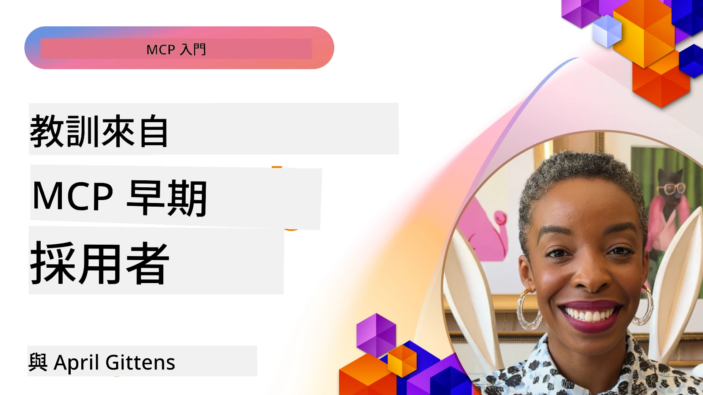

# 🌟 早期採用者的經驗教訓

[](https://youtu.be/jds7dSmNptE)

_(點擊上方圖片觀看本課程視頻)_

## 🎯 本模組涵蓋內容

本模組探討真實組織和開發人員如何利用模型上下文協議 (MCP) 解決實際挑戰並推動創新。透過詳細案例研究、實作專案以及實用範例，你將了解 MCP 如何實現安全、可擴展的 AI 整合，連接語言模型、工具與企業資料。

### 📚 MCP 實戰演練

想看到這些原則如何應用於可投入生產的工具嗎？請參閱我們的 [**10 個正在改變開發人員生產力的 Microsoft MCP 伺服器**](microsoft-mcp-servers.md)，展示你今天即可使用的真實 Microsoft MCP 伺服器。

## 概觀

本課程探討早期使用者如何利用模型上下文協議 (MCP) 解決業界真實挑戰並推動創新。透過詳細案例研究與實作專案，你將觀察 MCP 如何促成標準化、安全且可擴展的 AI 整合——以統一框架連接大型語言模型、工具與企業數據。你將獲得設計並建置 MCP 基礎解決方案的實務經驗，學習經過驗證的實作範式，以及發掘在生產環境部署 MCP 的最佳實務。課程也介紹新興趨勢、未來方向以及開源資源，幫助你走在 MCP 技術及其生態系統的前沿。

## 學習目標

- 分析不同行業中 MCP 的真實世界實作
- 設計並建置完整的 MCP 基礎應用程式
- 探索 MCP 技術中出現的趨勢與未來方向
- 在實際開發場景中應用最佳實踐

## 真實世界 MCP 實作案例

### 案例研究 1：企業客戶支持自動化

一家跨國企業實作了基於 MCP 的方案，標準化客戶支持系統中的 AI 互動，實現：

- 為多個大型語言模型供應商建立統一介面
- 維護部門間一致的提示管理
- 實施穩健的安全性與合規控制
- 根據特定需求輕鬆切換不同 AI 模型

**技術實作：**

```python
# 用於客戶支持的 Python MCP 伺服器實作
import logging
import asyncio
from modelcontextprotocol import create_server, ServerConfig
from modelcontextprotocol.server import MCPServer
from modelcontextprotocol.transports import create_http_transport
from modelcontextprotocol.resources import ResourceDefinition
from modelcontextprotocol.prompts import PromptDefinition
from modelcontextprotocol.tool import ToolDefinition

# 配置日誌記錄
logging.basicConfig(level=logging.INFO)

async def main():
    # 創建伺服器配置
    config = ServerConfig(
        name="Enterprise Customer Support Server",
        version="1.0.0",
        description="MCP server for handling customer support inquiries"
    )
    
    # 初始化 MCP 伺服器
    server = create_server(config)
    
    # 註冊知識庫資源
    server.resources.register(
        ResourceDefinition(
            name="customer_kb",
            description="Customer knowledge base documentation"
        ),
        lambda params: get_customer_documentation(params)
    )
    
    # 註冊提示模板
    server.prompts.register(
        PromptDefinition(
            name="support_template",
            description="Templates for customer support responses"
        ),
        lambda params: get_support_templates(params)
    )
    
    # 註冊支持工具
    server.tools.register(
        ToolDefinition(
            name="ticketing",
            description="Create and update support tickets"
        ),
        handle_ticketing_operations
    )
    
    # 使用 HTTP 傳輸啟動伺服器
    transport = create_http_transport(port=8080)
    await server.run(transport)

if __name__ == "__main__":
    asyncio.run(main())
```

**成果：** 模型成本降低 30%，回應一致性提升 45%，同時加強全球業務合規。

### 案例研究 2：醫療診斷助理

一家醫療提供者建立 MCP 架構以整合多個專科醫療 AI 模型，同時確保敏感病患資料受到保護：

- 無縫切換通用與專科醫療模型
- 嚴格的隱私控制與稽核機制
- 與現有電子病歷系統 (EHR) 集成
- 一致的醫療術語提示工程

**技術實作：**

```csharp
// C# MCP host application implementation in healthcare application
using Microsoft.Extensions.DependencyInjection;
using ModelContextProtocol.SDK.Client;
using ModelContextProtocol.SDK.Security;
using ModelContextProtocol.SDK.Resources;

public class DiagnosticAssistant
{
    private readonly MCPHostClient _mcpClient;
    private readonly PatientContext _patientContext;
    
    public DiagnosticAssistant(PatientContext patientContext)
    {
        _patientContext = patientContext;
        
        // Configure MCP client with healthcare-specific settings
        var clientOptions = new ClientOptions
        {
            Name = "Healthcare Diagnostic Assistant",
            Version = "1.0.0",
            Security = new SecurityOptions
            {
                Encryption = EncryptionLevel.Medical,
                AuditEnabled = true
            }
        };
        
        _mcpClient = new MCPHostClientBuilder()
            .WithOptions(clientOptions)
            .WithTransport(new HttpTransport("https://healthcare-mcp.example.org"))
            .WithAuthentication(new HIPAACompliantAuthProvider())
            .Build();
    }
    
    public async Task<DiagnosticSuggestion> GetDiagnosticAssistance(
        string symptoms, string patientHistory)
    {
        // Create request with appropriate resources and tool access
        var resourceRequest = new ResourceRequest
        {
            Name = "patient_records",
            Parameters = new Dictionary<string, object>
            {
                ["patientId"] = _patientContext.PatientId,
                ["requestingProvider"] = _patientContext.ProviderId
            }
        };
        
        // Request diagnostic assistance using appropriate prompt
        var response = await _mcpClient.SendPromptRequestAsync(
            promptName: "diagnostic_assistance",
            parameters: new Dictionary<string, object>
            {
                ["symptoms"] = symptoms,
                patientHistory = patientHistory,
                relevantGuidelines = _patientContext.GetRelevantGuidelines()
            });
            
        return DiagnosticSuggestion.FromMCPResponse(response);
    }
}
```

**成果：** 提升醫師診斷建議，同時全部符合 HIPAA 條款，大幅減少系統間的上下文切換。

### 案例研究 3：金融服務風險分析

一家金融機構利用 MCP 標準化各部門的風險分析流程：

- 為信用風險、詐欺偵測與投資風險模型創建統一介面
- 實施嚴格存取控制與模型版本管理
- 確保所有 AI 建議皆可稽核
- 在多元系統間維持一致的資料格式

**技術實作：**

```java
// 用於金融風險評估的 Java MCP 伺服器
import org.mcp.server.*;
import org.mcp.security.*;

public class FinancialRiskMCPServer {
    public static void main(String[] args) {
        // 建立具備金融合規功能的 MCP 伺服器
        MCPServer server = new MCPServerBuilder()
            .withModelProviders(
                new ModelProvider("risk-assessment-primary", new AzureOpenAIProvider()),
                new ModelProvider("risk-assessment-audit", new LocalLlamaProvider())
            )
            .withPromptTemplateDirectory("./compliance/templates")
            .withAccessControls(new SOCCompliantAccessControl())
            .withDataEncryption(EncryptionStandard.FINANCIAL_GRADE)
            .withVersionControl(true)
            .withAuditLogging(new DatabaseAuditLogger())
            .build();
            
        server.addRequestValidator(new FinancialDataValidator());
        server.addResponseFilter(new PII_RedactionFilter());
        
        server.start(9000);
        
        System.out.println("Financial Risk MCP Server running on port 9000");
    }
}
```

**成果：** 提升法規遵循效率，使模型部署周期加快 40%，提升部門間風險評估一致性。

### 案例研究 4：Microsoft Playwright MCP 伺服器用於瀏覽器自動化

Microsoft 開發了 [Playwright MCP 伺服器](https://github.com/microsoft/playwright-mcp) ，透過模型上下文協議實現安全、標準化的瀏覽器自動化。這個可投入生產的伺服器允許 AI 代理與大型語言模型在受控、可稽核且可擴展的方式下與網頁瀏覽器互動，支持自動化網頁測試、資料擷取及端對端工作流程等應用。

> **🎯 可投入生產的工具**
> 
> 本案例展示了你今天即可使用的真實 MCP 伺服器！欲知更多 Playwright MCP 伺服器及其他 9 個可投入生產的 Microsoft MCP 伺服器，請參閱我們的 [**Microsoft MCP 伺服器指南**](microsoft-mcp-servers.md#8--playwright-mcp-server)。

**主要功能：**
- 將瀏覽器自動化功能 (導航、表單填寫、截圖等) 以 MCP 工具形式暴露
- 實施嚴格存取控制與沙箱機制防止未授權操作
- 提供所有瀏覽器互動的詳細審計日誌
- 支援與 Azure OpenAI 及其他大型語言模型供應商集成來驅動代理自動化
- 支援 GitHub Copilot 的網頁瀏覽功能

**技術實作：**

```typescript
// TypeScript：在MCP伺服器中註冊Playwright瀏覽器自動化工具
import { createServer, ToolDefinition } from 'modelcontextprotocol';
import { launch } from 'playwright';

const server = createServer({
  name: 'Playwright MCP Server',
  version: '1.0.0',
  description: 'MCP server for browser automation using Playwright'
});

// 註冊一個用於導航到URL並截取螢幕截圖的工具
server.tools.register(
  new ToolDefinition({
    name: 'navigate_and_screenshot',
    description: 'Navigate to a URL and capture a screenshot',
    parameters: {
      url: { type: 'string', description: 'The URL to visit' }
    }
  }),
  async ({ url }) => {
    const browser = await launch();
    const page = await browser.newPage();
    await page.goto(url);
    const screenshot = await page.screenshot();
    await browser.close();
    return { screenshot };
  }
);

// 啟動MCP伺服器
server.listen(8080);
```

**成果：**

- 為 AI 代理與大型語言模型實現安全、程式化的瀏覽器自動化
- 降低手動測試工作負擔，提升網頁應用程式測試覆蓋率
- 提供可重用且可擴展的瀏覽器基礎工具整合架構於企業環境中
- 為 GitHub Copilot 提供網頁瀏覽能力

**參考資料：**

- [Playwright MCP 伺服器 GitHub 倉庫](https://github.com/microsoft/playwright-mcp)
- [Microsoft AI 和自動化解決方案](https://azure.microsoft.com/en-us/products/ai-services/)

### 案例研究 5：Azure MCP – 企業級模型上下文協議即服務

Azure MCP 伺服器 ([https://aka.ms/azmcp](https://aka.ms/azmcp)) 是 Microsoft 的受管企業級模型上下文協議實作，旨在提供可擴展、安全且合規的 MCP 伺服器功能，作為一項雲端服務。Azure MCP 讓組織能迅速部署、管理並整合 MCP 伺服器與 Azure AI、資料及安全服務，減少營運負擔並加速 AI 採用。

> **🎯 可投入生產的工具**
> 
> 這是一個你今天即可使用的真實 MCP 伺服器！請參閱我們的 [**Microsoft MCP 伺服器指南**](microsoft-mcp-servers.md) 了解 Microsoft Foundry MCP 伺服器的更多資訊。


- 完全受管的 MCP 伺服器託管，內建自動擴展、監控與安全
- 原生整合 Azure OpenAI、Azure AI 搜尋與其他 Azure 服務
- 透過 Microsoft Entra ID 提供企業身分驗證和授權
- 支援自訂工具、提示範本與資源連結器
- 遵守企業安全與法規要求

**技術實作：**

```yaml
# Example: Azure MCP server deployment configuration (YAML)
apiVersion: mcp.microsoft.com/v1
kind: McpServer
metadata:
  name: enterprise-mcp-server
spec:
  modelProviders:
    - name: azure-openai
      type: AzureOpenAI
      endpoint: https://<your-openai-resource>.openai.azure.com/
      apiKeySecret: <your-azure-keyvault-secret>
  tools:
    - name: document_search
      type: AzureAISearch
      endpoint: https://<your-search-resource>.search.windows.net/
      apiKeySecret: <your-azure-keyvault-secret>
  authentication:
    type: EntraID
    tenantId: <your-tenant-id>
  monitoring:
    enabled: true
    logAnalyticsWorkspace: <your-log-analytics-id>
```

**成果：**  
- 透過提供可即用且合規的 MCP 伺服器平台，縮短企業 AI 項目的價值實現時間
- 簡化大型語言模型、工具與企業資料源的整合
- 增強 MCP 工作負載的安全性、可觀察性及營運效率
- 依據 Azure SDK 最佳實務及現代身份驗證模式，提高程式碼品質

**參考資料：**  
- [Azure MCP 文件](https://aka.ms/azmcp)
- [Azure MCP 伺服器 GitHub 倉庫](https://github.com/Azure/azure-mcp)
- [Azure AI 服務](https://azure.microsoft.com/en-us/products/ai-services/)
- [Microsoft MCP 中心](https://mcp.azure.com)

## 案例研究 6：NLWeb
MCP（模型上下文協議）是聊天機器人和人工智慧助理與工具互動的新興協議。每個 NLWeb 實例也是一個 MCP 伺服器，支援一個核心方法 ask，用於以自然語言向網站提問。回傳的回答利用廣泛使用於描述網站資料的 schema.org 詞彙。簡而言之，MCP 就像是 NLWeb 對於 HTTP 之於 HTML 的關係。NLWeb 結合協議、Schema.org 格式及範例程式碼，協助網站快速建立這類端點，透過對話介面惠及使用者與透過自然代理間互動惠及機器。

NLWeb 包含兩個明確組成部分。
- 一個協議，非常簡單，利用 json 與 schema.org 格式回傳答案的自然語言介面。詳見 REST API 文件。
- 一個基於 (1) 的簡易實作，使用現有標記，適合可以抽象為項目清單的網站（產品、食譜、景點、評論等）。透過一套用戶介面元件，網站可輕鬆提供內容的對話式介面。詳見「聊天查詢的一生」文件了解詳細運作方式。
 
**參考資料：**  
- [Azure MCP 文件](https://aka.ms/azmcp)
- [NLWeb](https://github.com/microsoft/NlWeb)

### 案例研究 7：Microsoft Foundry MCP 伺服器—企業 AI 代理整合

Microsoft Foundry MCP 伺服器展示了如何在企業環境中使用 MCP 編排並管理 AI 代理與工作流程。透過與 Microsoft Foundry 結合，組織能標準化代理互動，利用 Foundry 的工作流程管理，並確保安全且可擴展的部署。

> **🎯 可投入生產的工具**
> 
> 這是你今天即可使用的真實 MCP 伺服器！欲知更多 Microsoft Foundry MCP 伺服器資訊，請參閱我們的 [**Microsoft MCP 伺服器指南**](microsoft-mcp-servers.md#9--microsoft-foundry-mcp-server)。

**主要功能：**
- 全面存取 Azure AI 生態系（含模型目錄與部署管理）
- 透過 Azure AI 搜尋的知識索引以支持 RAG（檢索增強生成）應用
- AI 模型性能與品質保證的評估工具
- 與 Microsoft Foundry 目錄與實驗室的尖端研究模型整合
- 生產場景下的代理管理與評估能力

**成果：**
- AI 代理工作流程的快速原型與穩健監控
- 與 Azure AI 服務的無縫整合以支持進階場景
- 建立、部署與監控代理流程的統一介面
- 強化企業安全、合規與營運效率
- 同時保持對複雜代理驅動流程的掌控，推動 AI 採用加速

**參考資料：**
- [Microsoft Foundry MCP 伺服器 GitHub 倉庫](https://github.com/azure-ai-foundry/mcp-foundry)
- [Azure AI 代理與 MCP 整合 (Microsoft Foundry 部落格)](https://devblogs.microsoft.com/foundry/integrating-azure-ai-agents-mcp/)

### 案例研究 8：Foundry MCP Playground — 實驗與原型製作

Foundry MCP Playground 提供一個即用環境，讓開發者能對 MCP 伺服器及 Microsoft Foundry 整合進行實驗。開發者能快速進行 AI 模型與代理工作流程的原型、測試與評估，利用 Microsoft Foundry 目錄與實驗室資源。此 Playground 簡化設置，提供範例專案並支持協作開發，使探索最佳實務與新場景輕鬆進行，無需大量基礎架構。此舉降低入門門檻，促進 MCP 及 Microsoft Foundry 生態系的創新與社群貢獻。

**參考資料：**

- [Foundry MCP Playground GitHub 倉庫](https://github.com/azure-ai-foundry/foundry-mcp-playground)

### 案例研究 9：Microsoft Learn Docs MCP 伺服器 — AI 助力文件存取

Microsoft Learn Docs MCP 伺服器為雲端託管服務，透過模型上下文協議為 AI 助理提供對官方 Microsoft 文件的即時存取。這個可投入生產的伺服器連接至完整的 Microsoft Learn 生態系，實現所有官方 Microsoft 資料的語意搜尋。

> **🎯 可投入生產的工具**
> 
> 這是你今天即可使用的真實 MCP 伺服器！欲知更多 Microsoft Learn Docs MCP 伺服器資訊，請參閱我們的 [**Microsoft MCP 伺服器指南**](microsoft-mcp-servers.md#1--microsoft-learn-docs-mcp-server)。

**主要功能：**
- 即時存取官方 Microsoft 文件、Azure 文件及 Microsoft 365 文件
- 先進的語意搜尋能理解上下文與意圖
- Microsoft Learn 內容發布時即時更新資訊
- 涵蓋 Microsoft Learn、Azure 文件與 Microsoft 365 多個來源
- 回傳最多 10 個高品質內容片段附帶文章標題與網址

**重要性說明：**
- 解決 Microsoft 技術中 AI 知識過時問題
- 確保 AI 助理能掌握最新 .NET、C#、Azure 及 Microsoft 365 功能
- 提供權威第一方資訊以確保正確的程式碼產生
- 對於快速演進的 Microsoft 技術開發人員至關重要

**成果：**
- 大幅提升創作 Microsoft 技術相關 AI 程式碼的準確度
- 減少搜尋最新文件與最佳實務的時間
- 利用上下文智慧文件檢索增強開發人員生產力
- 與開發工作流程無縫整合，無需離開 IDE

**參考資料：**
- [Microsoft Learn Docs MCP 伺服器 GitHub 倉庫](https://github.com/MicrosoftDocs/mcp)
- [Microsoft Learn 文件](https://learn.microsoft.com/)

## 實作專案

### 專案 1：建置多供應商 MCP 伺服器

**目標：** 建立可根據特定條件將請求路由至多個 AI 模型供應商的 MCP 伺服器。

**需求：**

- 支援至少三種不同模型供應商（例如 OpenAI、Anthropic、本地模型）
- 根據請求元資料實作路由機制
- 建立管理供應商憑證的設定系統
- 加入快取以優化效能與成本
- 建置簡易儀表板以監控使用狀況

**實作步驟：**

1. 設置基本 MCP 伺服器基礎架構
2. 為每個 AI 模型服務實作供應商適配器
3. 根據請求屬性編寫路由邏輯
4. 加入常見請求的快取機制
5. 開發監控儀表板
6. 使用多種請求模式進行測試

**技術：** 可選擇 Python (.NET/Java/Python 擇一)、使用 Redis 快取，並採用簡單的網頁框架建置儀表板。

### 專案 2：企業級提示管理系統

**目標：** 開發基於 MCP 的系統，用於管理、版本控制及部署整個組織的提示範本。

**需求：**


- 建立集中式提示範本庫
- 實作版本控制與審核工作流程
- 建立帶有範例輸入的範本測試功能
- 開發基於角色的存取控制
- 建立範本檢索與部署的 API

**實作步驟：**

1. 設計範本存儲的資料庫架構
2. 建立範本的 CRUD 操作核心 API
3. 實作版本控制系統
4. 建立審核工作流程
5. 開發測試框架
6. 建立簡易的網頁管理介面
7. 與 MCP 伺服器整合

**技術：** 您可自由選擇後端框架、SQL 或 NoSQL 資料庫，以及管理介面的前端框架。

### 專案 3：基於 MCP 的內容生成平台

**目標：** 建立一個利用 MCP 提供跨不同內容類型一致結果的內容生成平台。

**需求：**

- 支援多種內容格式（部落格文章、社群媒體、行銷文案）
- 實作基於範本生成並帶有自訂選項
- 建立內容審核與回饋系統
- 追蹤內容效能指標
- 支援內容版本控制與反覆優化

**實作步驟：**

1. 設置 MCP 用戶端基礎架構
2. 建立不同內容類型的範本
3. 建構內容生成流程
4. 實作審核系統
5. 開發效能指標追蹤系統
6. 建立範本管理與內容生成的使用者介面

**技術：** 您的首選程式語言、網頁框架及資料庫系統。

## MCP 技術的未來方向

### 新興趨勢

1. **多模態 MCP**
   - 擴展 MCP 以標準化與影像、音訊及影片模型的互動
   - 發展跨模態推理能力
   - 為不同模態制定標準化提示格式

2. **聯邦 MCP 基礎架構**
   - 分散式 MCP 網路，能跨組織共享資源
   - 用於安全模型共享的標準協議
   - 保護隱私的運算技術

3. **MCP 市集**
   - 用於分享及貨幣化 MCP 範本與外掛的生態系
   - 品質保證與認證流程
   - 與模型市集整合

4. **用於邊緣運算的 MCP**
   - 適用於資源受限邊緣裝置的 MCP 標準調整
   - 低頻寬環境的最佳化協議
   - 為物聯網生態系特製的 MCP 實作

5. <strong>法規框架</strong>
   - 為符合法規需求開發 MCP 擴充功能
   - 標準化審計軌跡與可解釋性介面
   - 與新興的 AI 治理框架整合

### 微軟的 MCP 解決方案

微軟與 Azure 已開發多個開源倉庫，協助開發者在不同場景實作 MCP：

#### Microsoft 組織

1. [playwright-mcp](https://github.com/microsoft/playwright-mcp) - 用於瀏覽器自動化與測試的 Playwright MCP 伺服器
2. [files-mcp-server](https://github.com/microsoft/files-mcp-server) - OneDrive MCP 伺服器實作，用於本地測試和社群貢獻
3. [NLWeb](https://github.com/microsoft/NlWeb) - NLWeb 是一系列開放協議及相關開源工具，主要聚焦於建立 AI 網絡的基礎層

#### Azure-Samples 組織

1. [mcp](https://github.com/Azure-Samples/mcp) - 提供多語言在 Azure 上建構及整合 MCP 伺服器的範例、工具與資源連結
2. [mcp-auth-servers](https://github.com/Azure-Samples/mcp-auth-servers) - 依現行 Model Context Protocol 規範示範認證的參考 MCP 伺服器
3. [remote-mcp-functions](https://github.com/Azure-Samples/remote-mcp-functions) - Azure Functions 的遠端 MCP 伺服器實作著陸頁，附語言專屬倉庫連結
4. [remote-mcp-functions-python](https://github.com/Azure-Samples/remote-mcp-functions-python) - 使用 Python 建置及部署自訂遠端 MCP 伺服器的快速入門範本
5. [remote-mcp-functions-dotnet](https://github.com/Azure-Samples/remote-mcp-functions-dotnet) - 使用 .NET/C# 建置及部署自訂遠端 MCP 伺服器的快速入門範本
6. [remote-mcp-functions-typescript](https://github.com/Azure-Samples/remote-mcp-functions-typescript) - 使用 TypeScript 建置及部署自訂遠端 MCP 伺服器的快速入門範本
7. [remote-mcp-apim-functions-python](https://github.com/Azure-Samples/remote-mcp-apim-functions-python) - 利用 Python 將 Azure API Management 作為通往遠端 MCP 伺服器的 AI 閘道
8. [AI-Gateway](https://github.com/Azure-Samples/AI-Gateway) - APIM ❤️ AI 實驗專案，包含 MCP 功能，整合 Azure OpenAI 與 AI Foundry

這些倉庫提供多樣的實作、範本與資源，能跨不同程式語言與 Azure 服務使用 Model Context Protocol，涵蓋基本伺服器實作、認證、雲端部署、企業整合等多種應用場景。

#### MCP 資源目錄

官方 Microsoft MCP 倉庫中的 [MCP 資源目錄](https://github.com/microsoft/mcp/tree/main/Resources) 提供經過策劃的範例資源、提示範本及工具定義，供 Model Context Protocol 伺服器使用。此目錄旨在幫助開發者透過可重用的構建模組及最佳實務範例快速啟動 MCP：

- **提示範本：** 適用於常見 AI 任務與場景的即用型提示範本，可依據您的 MCP 伺服器實作調整。
- **工具定義：** 標準化工具整合與調用的範例工具架構與元資料，適用於不同 MCP 伺服器。
- **資源範例：** 用於在 MCP 框架中連接資料源、API 和外部服務的資源定義範例。
- **參考實作：** 展示如何在真實 MCP 專案中組織資源、提示及工具的實務範例。

這些資源加速開發、促進標準化，並助於確保基於 MCP 架構解決方案的最佳實務。

#### MCP 資源目錄

- [MCP 資源（範例提示、工具及資源定義）](https://github.com/microsoft/mcp/tree/main/Resources)

### 研究機會

- MCP 框架中的高效提示優化技術
- 多租戶 MCP 部署的安全模型
- 不同 MCP 實作的效能基準測試
- MCP 伺服器的形式驗證方法

## 結論

Model Context Protocol (MCP) 正迅速塑造跨產業標準化、安全且可互操作的 AI 整合未來。透過本課中的案例研究與實作專案，您已看見包括微軟與 Azure 在內的早期採用者，如何運用 MCP 解決現實挑戰、加速 AI 採用並確保合規性、安全性與可擴展性。MCP 的模組化方法使組織能在統一且可審核的框架中連結大型語言模型、工具和企業資料。隨著 MCP 持續演進，積極與社群互動、探索開源資源並實踐最佳實務，將是打造穩健且符合未來需求 AI 解決方案的關鍵。

## 附加資源

- [MCP Foundry GitHub 倉庫](https://github.com/azure-ai-foundry/mcp-foundry)
- [Foundry MCP Playground](https://github.com/azure-ai-foundry/foundry-mcp-playground)
- [整合 Azure AI Agents 與 MCP（Microsoft Foundry 部落格）](https://devblogs.microsoft.com/foundry/integrating-azure-ai-agents-mcp/)
- [MCP GitHub 倉庫（微軟）](https://github.com/microsoft/mcp)
- [MCP 資源目錄（範例提示、工具及資源定義）](https://github.com/microsoft/mcp/tree/main/Resources)
- [MCP 社群與文件](https://modelcontextprotocol.io/introduction)
- [MCP 規範（2026-07-28）](https://modelcontextprotocol.io/specification/2026-07-28/)
- [Azure MCP 文件](https://aka.ms/azmcp)
- [OWASP MCP 前十大安全議題](https://microsoft.github.io/mcp-azure-security-guide/mcp/) - 安全最佳實務
- [Playwright MCP 伺服器 GitHub 倉庫](https://github.com/microsoft/playwright-mcp)
- [Files MCP 伺服器 (OneDrive)](https://github.com/microsoft/files-mcp-server)
- [Azure-Samples MCP](https://github.com/Azure-Samples/mcp)
- [MCP 認證伺服器 (Azure-Samples)](https://github.com/Azure-Samples/mcp-auth-servers)
- [遠端 MCP 函數 (Azure-Samples)](https://github.com/Azure-Samples/remote-mcp-functions)
- [遠端 MCP 函數 Python (Azure-Samples)](https://github.com/Azure-Samples/remote-mcp-functions-python)
- [遠端 MCP 函數 .NET (Azure-Samples)](https://github.com/Azure-Samples/remote-mcp-functions-dotnet)
- [遠端 MCP 函數 TypeScript (Azure-Samples)](https://github.com/Azure-Samples/remote-mcp-functions-typescript)
- [遠端 MCP APIM 函數 Python (Azure-Samples)](https://github.com/Azure-Samples/remote-mcp-apim-functions-python)
- [AI-Gateway (Azure-Samples)](https://github.com/Azure-Samples/AI-Gateway)
- [微軟 AI 與自動化解決方案](https://azure.microsoft.com/en-us/products/ai-services/)

## 練習題

1. 分析其中一個案例研究，並提出替代實作方案。
2. 選擇一個專案構想，建立詳細的技術規範。
3. 研究一個案例中未涵蓋的產業，概述 MCP 如何解決其特定挑戰。
4. 探索未來方向之一，為其擬定一個新的 MCP 擴充概念。

## 下一步

探索更多：[Microsoft MCP 伺服器](./microsoft-mcp-servers.md)

接續閱讀：[模組 8：最佳實務](../08-BestPractices/README.md)

---

<!-- CO-OP TRANSLATOR DISCLAIMER START -->
**免責聲明**：
此文件已使用 AI 翻譯服務 [Co-op Translator](https://github.com/Azure/co-op-translator) 進行翻譯。雖然我們努力追求準確性，但請注意自動翻譯可能包含錯誤或不準確之處。原始文件的母語版本應視為權威來源。對於關鍵資訊，建議採用專業人工翻譯。我們不對因使用此翻譯所產生的任何誤解或誤譯承擔責任。
<!-- CO-OP TRANSLATOR DISCLAIMER END -->