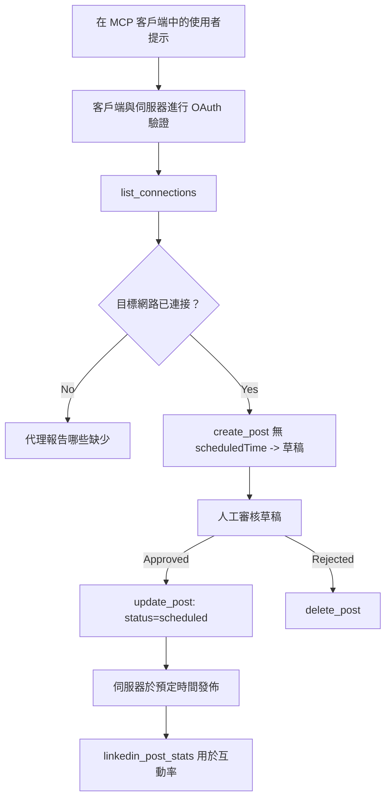

# 案例研究：從具有遠端 MCP 伺服器的代理人發佈到社群網路

> **免責聲明：** 有數個服務與開源專案可以發布到社群網路，團隊也可以直接整合每個網路的 API。以下情境提供了一個如何設計與使用具<strong>寫入能力的遠端 MCP 伺服器</strong>的實作範例。Publora 是一項商業服務，提供免費階層；本文所述的模式適用於任何代表用戶執行不可逆操作的 MCP 伺服器。

## 概述

代理人擅長撰寫內容，但不擅長發布。模型可以在數秒內撰寫發佈公告，但工作隨即停止：發布需要為每個網路使用不同的 API、OAuth 應用程式以及各異的媒體規則。大多數團隊透過手動將文字複製到瀏覽器解決這問題。

本案例研究探討如何使用單一遠端 MCP 伺服器完成最後一步，且—對於任何構建者更有用—分析一個<strong>具寫入能力</strong>伺服器必須做對的設計決策。資料讀取是寬容的。發布不是：錯誤的工具調用會被觀眾看見，且無法復原。

## 情境

一個小型開發者關係團隊在代理人內部（Claude、VS Code、Cursor — 客戶端不重要）撰寫貼文草稿。他們希望代理人能夠：

- 查看團隊已連接哪些社群帳號，
- 撰寫一篇貼文並保留為草稿以供人工審核，
- 附加圖片，
- 安排在多個網路上於選定時間發布，
- 並於之後報告發佈績效。

關鍵在於，他們希望代理人在仍於試驗階段時<em>無法</em>意外發布。

## 使用工具

- [Publora MCP 伺服器](https://github.com/publora/mcp-server) — 一個遠端 MCP 伺服器（`streamable-http`）提供發佈、排程、媒體和 LinkedIn 分析工具。在官方 MCP 登錄註冊為 `com.publora/mcp-server`。

## 逐步工作流程

1. **連接伺服器。** 支援 OAuth 的客戶端對伺服器自己的同意畫面完成帶 PKCE 的授權碼流程；非 OAuth 客戶端（例如無頭 CLI）使用 Publora API 金鑰放在標頭中。兩種路徑皆支援，取決於客戶端而非伺服器。
2. **列出連結。** 代理人呼叫 `list_connections` 並接收連結帳號及其識別碼。
3. **草擬。** 代理人呼叫 `create_post` <em>不帶</em>排定時間。貼文被儲存為草稿 — 不發佈。
4. **附加媒體。** 公開圖片 URL 在同一次呼叫中傳入；伺服器下載並驗證它們。
5. **排程。** 人工審核後，`update_post` 設定狀態為已排程並附上 ISO 8601 時間。
6. **衡量。** LinkedIn 貼文上線後，`linkedin_post_stats` 回傳互動數據。

## 範例提示

```text
Which social accounts do I have connected?
Draft a post announcing our new changelog page, attach the screenshot at
https://example.com/changelog.png, and keep it as a draft — do not publish it.
Once I approve, schedule it to LinkedIn and Bluesky for tomorrow at 09:00 UTC.
```

## Mermaid 流程圖



## 技術實作

以下教訓是本案例研究中可轉移的部分。

### 開放發現、驗證執行

`tools/list` 無需憑證提供服務；每個 `tools/call` 都須提供令牌
且若無提供，回傳帶有 `WWW-Authenticate` 標頭的 `401`，該標頭指向

受保護資源的元資料。伺服器的舊版端點也會回應
未驗證的 `initialize`，用於協定版本早於
`2026-07-28` 的客戶端；目前的客戶端不使用該握手程序。

這種特定於伺服器的分隔讓註冊表、目錄和客戶端能在沒有祕密的情況下檢查工具名稱、模式和註解，同時防止匿名執行。公開發現是一種部署選擇，而非 MCP 的要求；受保護的部署也可能會要求 `tools/list` 的授權。


### 註冊：動態客戶端註冊及其替代方案

伺服器會宣告 `/.well-known/oauth-protected-resource` 與 `/.well-known/oauth-authorization-server`，並支援帶有 PKCE (`S256`) 的授權碼流程、更新令牌及<strong>動態客戶端註冊</strong>。

動態註冊移除了傳統客戶端的手動步驟：若無此功能，每個客戶端都需要廠商預先發放的 `client_id`。


將其視為相容行為，而非應遵循的設計。`2026-07-28` 版本的規範棄用了動態客戶端註冊，轉而採用客戶端 ID 元資料文件，客戶端會在穩定的 HTTPS URL 上託管元資料文件，而該 URL 即為 `client_id`。動態註冊暫時仍可使用，但當今構建的伺服器應規劃導入 CIMD，並僅為舊版客戶端保留動態註冊。

### 工具註解不是裝飾

每個工具都帶有 `title` 與相關提示：`readOnlyHint`、`destructiveHint`、`idempotentHint`、`openWorldHint`。

投資於它們有兩個理由。首先，客戶端使用這些提示來決定需向使用者確認的項目 —— 客戶端可自動執行唯讀查詢，並在刪除前停下來等待批准。規範明確指出註解是非信任的提示，而非授權機制：它們塑造了客戶端提供的操作，並不阻止伺服器的任何行為，伺服器必須依然強制其自身規則。其次，主要的連接器目錄現在<em>要求</em>檢閱使用這些提示；缺少標題與提示的伺服器無論運作多好，都會被退回。

### 避免可被猜測的識別碼

平台識別碼是由 `list_connections` 回傳的不透明字串，且模式描述明確說明必須逐字複製，絕不可自行猜測。伺服器會拒絕其他字串。

模型很會胡亂猜測。任何能寫入的伺服器都應假設識別碼最終會被憑空想像出來，並讓該路徑盡早且響亮地失敗，而非以表面合理的值繼續執行。

### 發佈前先失敗且帶有可行動的訊息

某些社交網絡不接受純文字發文，必須附上圖片或影片。這會在排程時驗證，錯誤訊息會指出平台及缺失要求。

代理可從「Instagram 需要媒體——請附加圖片或影片」中復原，無需額外來回；而無法從範圍泛用的 `400` 錯誤復原。

### 讓重試安全

兩個用於建立內容的工具，`create_post` 和 `update_post`，接受冪等鍵：重複使用相同鍵與相同請求會重播原回應，而不會建立第二篇貼文。代理執行環境會於逾時時重試；若無冪等，緩慢響應將導致重複張貼。其他寫入工具——刪除、媒體步驟、LinkedIn 的回應與評論——則不接受冪等鍵，因此在這些工具上重試不會自動安全。了解哪些突變受保護，哪些則不重要。


### 提供一種測試且不發佈任何內容的方法


伺服器接受一個保留目標 `publora-playground`，該目標會被驗證並確認就像一個真實的目的地，然後被丟棄——不會有任何內容到達真實帳戶。它在工具結構本身中有所描述，任何客戶端都可以在無需憑證的情況下閱讀：`create_post` 的 `platforms` 欄位將其記錄為「一個不需要真實連線的連接測試目標——文章會被確認並丟棄，不會發布任何內容」。通過將其作為唯一條目傳入來調用此目標：`platforms: ["publora-playground"]`。

這被證明是整個介面中最有用的細節之一。連接器目錄的審查者、貢獻者和 CI 可以安全地運行完整的寫入路徑，對真實受眾毫無風險。任何具有不可逆操作的 MCP 伺服器都可從有文檔記錄的無操作目標中受益。

## 結果與影響

- 發布步驟從瀏覽器挪到了撰寫內容的會話中，且草稿優先的習慣讓人類持續參與運作。需要明確的是：草稿是一種慣例，而不是界限。相同的憑證可以排程或發布，因此任何需要真實批准關卡的人必須在工具介面外實施它——例如獨立的憑證，或伺服器前方的策略層。
- 每個網絡的差異——媒體需求、串連、回覆控制——只需在伺服器中處理一次，而不是每個與伺服器對話的代理都要處理。
- 同一伺服器支持多個 MCP 用戶端，無需預先發出憑證。
    現有用戶端可使用 Client ID Metadata 文件；DCR 仍作為舊用戶端的備援。
    供較舊用戶端使用。
- 上述設計限制同時受到連接器目錄審查者和用戶影響：標註、OAuth 和安全測試目標均至少由其中一方要求。

## 參考資料

- [Publora MCP Server (原始碼)](https://github.com/publora/mcp-server)
- [Publora API 及 MCP 文件](https://docs.publora.com)
- [MCP 登錄條目：`com.publora/mcp-server`](https://registry.modelcontextprotocol.io/v0/servers?search=com.publora/mcp-server)
- [MCP 規範 — 授權](https://modelcontextprotocol.io/specification/2026-07-28/basic/authorization)
- [MCP 規範 — 工具標註](https://modelcontextprotocol.io/docs/concepts/tools)

## 下一步

- 使用你正在建置的 MCP 伺服器，檢視這三項最廉價的改進：每個工具上的標註、每次寫入的冪等鍵，以及有文檔記錄的無操作目標。
- 嘗試公開發現拆分：針對無需憑證的公開遠端伺服器呼叫 `tools/list`，然後呼叫某個工具並檢查 `401` 挑戰。
- 思考「復原」在你的領域意義為何。發布有草稿和刪除；如果你的操作無法等同，則確認應該在工具設計中進行，而非提示中。

---

<!-- CO-OP TRANSLATOR DISCLAIMER START -->
**免責聲明**：
此文件已使用 AI 翻譯服務 [Co-op Translator](https://github.com/Azure/co-op-translator) 進行翻譯。雖然我們努力追求準確性，但請注意自動翻譯可能包含錯誤或不準確之處。原始文件的母語版本應視為權威來源。對於關鍵資訊，建議採用專業人工翻譯。我們不對因使用此翻譯所產生的任何誤解或誤譯承擔責任。
<!-- CO-OP TRANSLATOR DISCLAIMER END -->