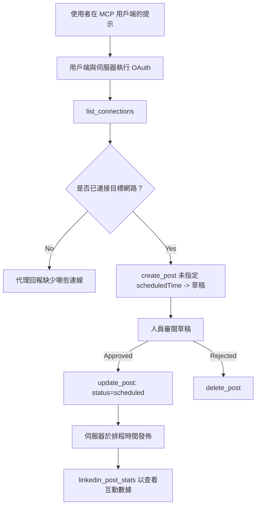

# 案例研究：從代理端透過遠端 MCP 伺服器發佈到社群網路

> **免責聲明：** 有多個服務與開源專案可以發佈至社群網路，團隊也可以直接整合各個網路的 API。以下情境為一個示範例子，說明如何設計與使用一個具有<strong>寫入能力的遠端 MCP 伺服器</strong>。Publora 是一個具有免費階層的商業服務；本文描述的模式適用於任何代表使用者執行不可逆操作的 MCP 伺服器。

## 概覽

代理擅長草擬內容，但不善於發佈。模型能在幾秒內寫出發佈公告，但工作隨即中止：發佈代表每個網路需要一個 API，每個網路需要一個 OAuth 應用，且每個網路都有不同的媒體規則。大多數團隊的解決方案是手動將文字複製貼到瀏覽器中。

本案例研究探討如何用一個遠端 MCP 伺服器完成最後一步，並且對於任何想打造此類伺服器的人更實用的是，探討一個<strong>具有寫入能力</strong>的伺服器必須正確判斷的設計決策。讀取資料相對寬容，發佈則不然：錯誤的工具呼叫會被觀眾看到，且不可撤銷。

## 情境

一個小型開發者關係團隊在代理 (Claude、VS Code、Cursor — 客戶端不重要) 中草擬貼文。他們希望代理能做到：

- 查看團隊連接了哪些社群帳號，
- 草擬貼文並保持草稿狀態，等待人工審核，
- 附加圖片，
- 在選定時間針對多個網路排程發佈，
- 並於稍後報告貼文成效。

關鍵是，他們希望代理在仍屬試驗階段時<em>無法</em>誤發佈。

## 使用工具

- [Publora MCP 伺服器](https://github.com/publora/mcp-server) — 一個遠端 MCP 伺服器 (`streamable-http`)，提供發佈、排程、媒體和 LinkedIn 分析工具。註冊於官方 MCP 註冊表，命名為 `com.publora/mcp-server`。

## 一步步工作流程

1. **連接伺服器。** 支援 OAuth 的用戶端通過服務端自己的同意頁完成 PKCE 授權碼流程；不支援的用戶端，如無頭 CLI，使用 Publora API 金鑰放在標頭。兩種路徑均支持，使用哪個端看用戶端，不是伺服器決定。
2. **列出連接。** 代理呼叫 `list_connections` 並收取已連接帳號和識別碼。
3. **草擬貼文。** 代理呼叫 `create_post` <em>不帶</em>排程時間。貼文被存成草稿—不會發佈。
4. **附加媒體。** 公開圖片 URL 同步帶入該呼叫；服務端下載並驗證圖片。
5. **排程。** 經人工核准後，`update_post` 設定狀態為排程並帶入 ISO 8601 時間。
6. **測量。** 對 LinkedIn，`linkedin_post_stats` 在貼文發佈後回傳互動數據。

## 範例提示

```text
Which social accounts do I have connected?
Draft a post announcing our new changelog page, attach the screenshot at
https://example.com/changelog.png, and keep it as a draft — do not publish it.
Once I approve, schedule it to LinkedIn and Bluesky for tomorrow at 09:00 UTC.
```

## Mermaid 流程圖



## 技術實作

以下教訓是此案例的普遍可移植部分。

### 開放發現，授權執行

`tools/list` 無需認證即可使用；每個 `tools/call` 都需要令牌，否則回傳帶有指向受保護資源元資料的 `WWW-Authenticate` 標頭的 `401`。 (伺服器亦接受未授權的 `initialize`，這對協議版本在 `2026-07-28` 之前的客戶端才有意義；該修訂版之後已移除握手。)

此分離在實務上很重要。註冊表、目錄和客戶端能在不持有秘密的情況下檢查工具表面 — 名稱、結構、註解 —，但沒有什麼能匿名<em>執行</em>。一個要求 `initialize` 須用令牌的伺服器對工具而言幾乎是隱形的；一個允許匿名 `tools/call` 的伺服器則是風險所在。

### 註冊：動態客戶端註冊與替代方案

伺服器公告 `/.well-known/oauth-protected-resource` 和 `/.well-known/oauth-authorization-server`，並支援帶 PKCE (`S256`) 的授權碼流程、更新令牌，與<strong>動態客戶端註冊</strong>。

動態註冊省去手動步驟：否則每個客戶端需事先發放 `client_id`，代表對供應商的額外頻道請求。

將此視為相容性行為而非推薦設計。 `2026-07-28` 版本規範棄用動態客戶端註冊，轉而採用 Client ID Metadata Documents，客戶端會在穩定 HTTPS URL 放置元資料文件，而該 URL 就是 `client_id`。DCR 現階段仍可運作，但新建伺服器應規劃 CIMD，僅對舊客戶端保留 DCR 支援。

### 工具註解非裝飾用途

每個工具附有 `title` 及適用提示：`readOnlyHint`、`destructiveHint`、`idempotentHint`、`openWorldHint`。

投資這些註解有兩個理由。首先，客戶端依據提示判斷向使用者確認的行為 — 可自動執行唯讀查詢，但刪除前須獲得批准。規範明確指示註解是非信任的提示，不是授權機制：它們塑造客戶端展示的行為，但伺服器仍須執行自身規則。其次，主要的連接目錄現在<em>強制要求</em>註解；缺乏標題與提示的伺服器不論功能再好都會被退回。

### 使識別碼不可自行杜撰

平台識別碼為 `list_connections` 回傳的難以辨識字串，架構說明明確指定必須逐字拷貝，絕不可猜測。伺服器拒絕其他任何形式。

模型善於猜測。任何有寫入能力的伺服器都應假設識別碼最終會被虛構，且該路徑必須在早期且清晰地失敗，而非操作貌似合理的值。

### 發佈前失敗，並提供可採取行動的訊息

有些網路拒絕只含文字的貼文，需附帶圖片或影片。此規則在排程時驗證，錯誤訊息會指明平台與缺少的要求。

代理能無須額外往返即回覆「Instagram 需媒體 — 請附加圖片或影片」的錯誤，無法處理通用 `400`。

### 確保重試安全

兩個創建內容的工具 `create_post` 與 `update_post` 支援冪等鍵：重複使用相同鍵與請求會重放相同回應，而非建立第二篇貼文。代理執行環境會在超時計時重試；若無冪等性，緩慢回應會變成重複發佈。其他寫入工具 — 刪除、媒體步驟、LinkedIn 互動與評論 — 不支援冪等鍵，重試不一定安全。知道自己所做修改中哪些被保護、哪些未被保護相當重要。

### 提供不會發佈的測試方法

伺服器接受保留目標 `publora-playground`，其經過驗證和確認就如同一般真實目標，但貼文會被丟棄 — 不會送達任何活躍帳號。此功能已寫在工具架構中，任何客戶端無須認證即可讀取：`create_post` 的 `platforms` 欄位將其描述為「一個不需真實連線的連線測試目標 — 貼文被確認並丟棄，未發佈任何內容」。呼叫此目標以唯一項目方式傳入：`platforms: ["publora-playground"]`。

這成為整個工具表面最有用的細節之一。連接目錄的檢視者、貢獻者和 CI 可以在不冒任何真實觀眾風險的情況下，完全測試寫入流程。任何具備不可逆行為的 MCP 伺服器都可受益於記錄完善的空操作目標。

## 成果與影響

- 發佈步驟從瀏覽器移至內容創作同對話中，且以草稿優先習慣確保人工介入。必須明確草稿的意義：草稿是慣例而非劃界。同一憑證同時擁有排程與發佈權限，若需真正的審核門檻，只能在工具表面外實施，如分開憑證或於伺服器前加策略層。
- 各網路差異 — 媒體需求、串連形態、回覆控制 — 由伺服器統一處理，而非每個代理個別實作。
- 同一伺服器可支持多個 MCP 客戶端，免去逐客戶端開發工作，因為發現是開放的，註冊是動態的。
- 上述設計限制既來自用戶需求，也受連接目錄評核影響：註解、OAuth 與安全測試目標皆為至少一方強制要求。

## 參考資料

- [Publora MCP Server (原始碼)](https://github.com/publora/mcp-server)
- [Publora API 與 MCP 文件](https://docs.publora.com)
- [MCP 註冊表條目：`com.publora/mcp-server`](https://registry.modelcontextprotocol.io/v0/servers?search=com.publora/mcp-server)
- [MCP 規範 — 授權](https://modelcontextprotocol.io/specification/draft/basic/authorization)
- [MCP 規範 — 工具註解](https://modelcontextprotocol.io/docs/concepts/tools)

## 後續方向

- 檢視你正在建置的 MCP 伺服器，先嘗試三個成本最低的改進：每個工具加註注解、每筆寫入加冪等鍵，還有一個紀錄良好、不執行操作的目標。
- 試試開放發現分離：在公用遠端伺服器呼叫 `tools/list` 無需認證，接著呼叫某工具並檢視 `401` 挑戰訊息。
- 想想你領域內「復原」代表什麼。發佈有草稿與刪除；若你的操作沒有類似等價物，確認應該放在工具設計，而非提示中。

---

<!-- CO-OP TRANSLATOR DISCLAIMER START -->
**免責聲明**：
此文件已使用 AI 翻譯服務 [Co-op Translator](https://github.com/Azure/co-op-translator) 進行翻譯。雖然我們努力追求準確性，但請注意自動翻譯可能包含錯誤或不準確之處。原始文件的母語版本應視為權威來源。對於關鍵資訊，建議採用專業人工翻譯。我們不對因使用此翻譯所產生的任何誤解或誤譯承擔責任。
<!-- CO-OP TRANSLATOR DISCLAIMER END -->