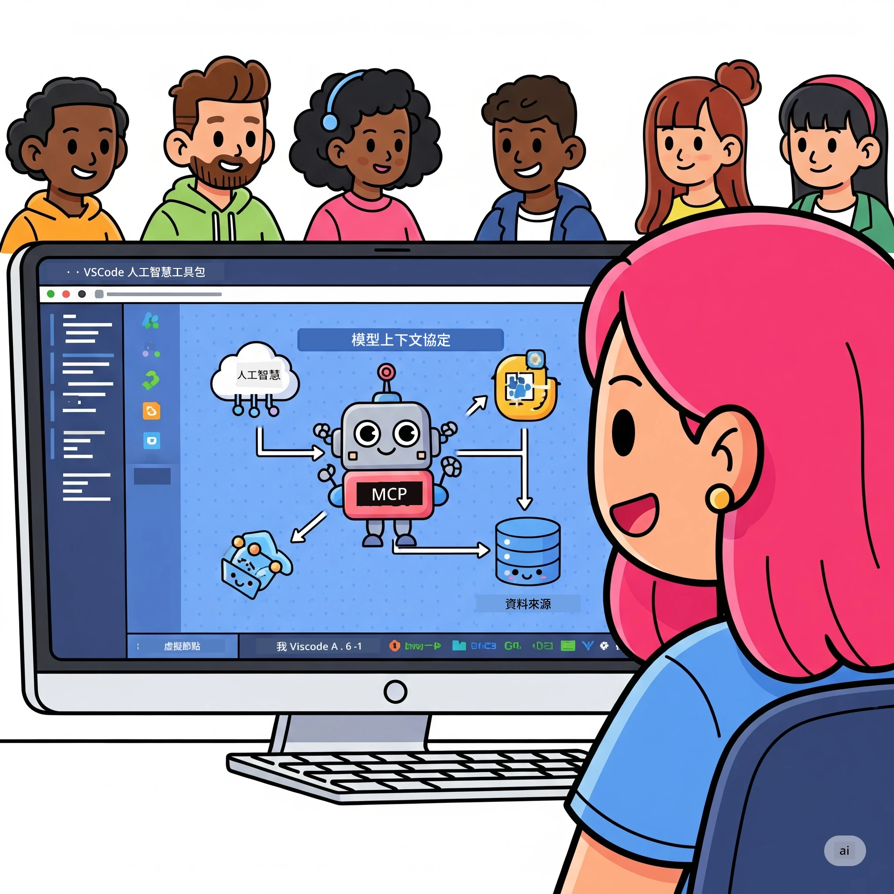
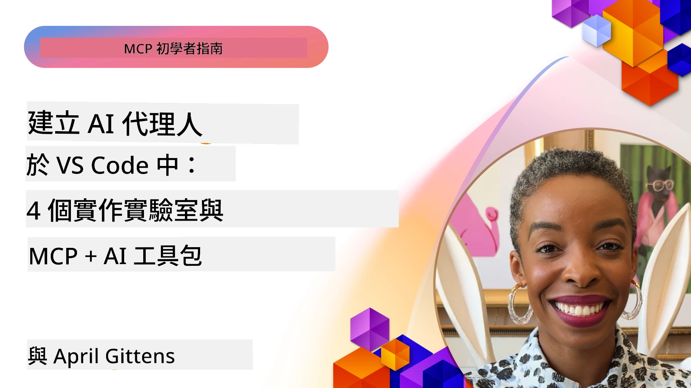

# 精簡 AI 工作流程：使用 Microsoft Foundry Toolkit 建立 MCP 伺服器

## 🎯 簡介

_(點擊上方圖片觀看本課程視訊)_

歡迎參加 **Model Context Protocol (MCP) 工作坊**！這個完整的實作工作坊結合了兩項尖端技術，徹底改變 AI 應用程式的開發方式：

> **相容性說明：** 本工作坊程式碼是基於 MCP
> `2025-11-25` 版本建構與測試，如上方徽章所示。請參考
> [最新 `2026-07-28` 規格](https://modelcontextprotocol.io/specification/2026-07-28/)
> 用於新協議實作，並在
> 遷移實作前查看 SDK 發布說明。

- **🔗 Model Context Protocol (MCP)**：一個無縫連接 AI 工具的開放標準
- **🛠️ Microsoft Foundry Toolkit VS Code 擴充功能**：微軟強大的 AI 開發擴充

### 🎓 您將學到什麼

完成本工作坊後，您將精通建構智能應用程式，連結 AI 模型及真實世界工具與服務。從自動化測試到自訂 API 整合，掌握解決複雜商業挑戰的實用技能。

## 🏗️ 技術架構

### 🔌 Model Context Protocol (MCP)

MCP 是 AI 的 **「USB-C」** — 一個通用標準，連接 AI 模型與外部工具及資料來源。

**✨ 主要特色：**

- 🔄 <strong>標準化整合</strong>：AI 與工具的通用介面
- 🏛️ <strong>靈活架構</strong>：支援本地與遠端伺服器透過 stdio/SSE 傳輸
- 🧰 <strong>豐富生態系</strong>：工具、提示與資源整合於單一協定
- 🔒 <strong>企業級準備</strong>：內建安全與可靠性

**🎯 為什麼 MCP 重要：**
就如 USB-C 解決纜線混亂，MCP 消弭 AI 整合複雜性。一個協定，無限可能。

### 🤖 Microsoft Foundry Toolkit VS Code 擴充功能

微軟的旗艦 AI 開發擴充，將 VS Code 轉化成 AI 強大平台。

**🚀 核心能力：**

- 📦 <strong>模型目錄</strong>：存取 Azure AI、GitHub、Hugging Face、Ollama 的模型
- ⚡ <strong>本地推論</strong>：ONNX 優化的 CPU/GPU/NPU 運算
- 🏗️ <strong>代理建構器</strong>：視覺化 AI 代理開發，整合 MCP
- 🎭 <strong>多模態</strong>：支援文字、影像與結構化輸出

**💡 開發優勢：**

- 零設定模型部署
- 視覺化提示工程
- 即時測試遊樂場
- 無縫整合 MCP 伺服器

## 📚 學習旅程

### [🚀 模組 1：Microsoft Foundry Toolkit 基礎](./lab1/README.md)

<strong>時長</strong>：15 分鐘

- 🛠️ 安裝與設定 Microsoft Foundry Toolkit VS Code 擴充
- 🗂️ 探索模型目錄（來自 GitHub、ONNX、OpenAI、Anthropic、Google 的 100+ 模型）
- 🎮 精通互動遊樂場進行即時模型測試
- 🤖 使用代理建構器打造您的第一個 AI 代理
- 📊 利用內建指標評估模型表現（F1、相關度、相似度、一致性）
- ⚡ 學習批次處理及多模態支援功能

**🎯 學習成果**：建立功能完整的 AI 代理，全面了解 Microsoft Foundry Toolkit 功能

### [🌐 模組 2：MCP 與 Microsoft Foundry Toolkit 基礎](./lab2/README.md)

<strong>時長</strong>：20 分鐘

- 🧠 精通 Model Context Protocol (MCP) 架構與概念
- 🌐 探索微軟 MCP 伺服器生態系
- 🤖 使用 Playwright MCP 伺服器建立瀏覽器自動化代理
- 🔧 整合 MCP 伺服器與 Microsoft Foundry Toolkit 代理建構器
- 📊 配置並測試代理中的 MCP 工具
- 🚀 匯出並部署具 MCP 功能的代理於生產環境

**🎯 學習成果**：部署一個結合外部工具的強化 AI 代理

### [🔧 模組 3：Microsoft Foundry Toolkit 進階 MCP 開發](./lab3/README.md)

<strong>時長</strong>：20 分鐘

- 💻 使用 Microsoft Foundry Toolkit 建立自訂 MCP 伺服器
- 🐍 設定並使用最新 MCP Python SDK (v1.9.3)
- 🔍 設置並運用 MCP Inspector 進行除錯
- 🛠️ 建立氣象 MCP 伺服器並實踐專業除錯工作流程
- 🧪 於代理建構器及 Inspector 環境中除錯 MCP 伺服器

**🎯 學習成果**：利用現代工具開發與除錯自訂 MCP 伺服器

### [🐙 模組 4：實務 MCP 開發—自訂 GitHub 克隆伺服器](./lab4/README.md)

<strong>時長</strong>：30 分鐘

- 🏗️ 建立真實世界的 GitHub 克隆 MCP 伺服器以支援開發流程
- 🔄 實作智慧型資源庫克隆，具驗證與錯誤處理
- 📁 打造智能目錄管理與 VS Code 整合
- 🤖 以自訂 MCP 工具使用 GitHub Copilot 代理模式
- 🛡️ 套用生產就緒的可靠性與跨平台相容性

**🎯 學習成果**：部署生產就緒 MCP 伺服器，優化真實開發流程

## 💡 實際應用與影響

### 🏢 企業應用場景

#### 🔄 DevOps 自動化

透過智能自動化轉型您的開發流程：

- <strong>智慧資源庫管理</strong>：AI 驅動的程式碼審查與合併決策
- **智能 CI/CD**：依程式碼變更自動化優化管道
- <strong>議題分流</strong>：自動化錯誤分類與指派

#### 🧪 品質保證革新

利用 AI 自動化提升測試：

- <strong>智能測試產生</strong>：自動創建完整測試套件
- <strong>視覺回歸測試</strong>：AI 驅動的 UI 變化偵測
- <strong>效能監控</strong>：主動問題識別與解決

#### 📊 資料流程智能化

建立更智慧的資料處理流程：

- **自適應 ETL 流程**：自我優化資料轉換
- <strong>異常偵測</strong>：即時資料品質監控
- <strong>智能路由</strong>：智慧化資料流管理

#### 🎧 客戶體驗提升

創造卓越客戶互動：

- <strong>上下文感知支援</strong>：具備客戶歷史存取的 AI 代理
- <strong>主動問題解決</strong>：預測型客戶服務
- <strong>多通路整合</strong>：跨平台統一 AI 體驗

## 🛠️ 先決條件與環境設置

### 💻 系統需求

| 組件 | 要求 | 備註 |
|-----------|-------------|-------|
| <strong>作業系統</strong> | Windows 10+、macOS 10.15+、Linux | 任何現代作業系統 |
| **Visual Studio Code** | 最新穩定版本 | 微軟 Foundry Toolkit 必需 |
| **Node.js** | v18.0+ 與 npm | 用於 MCP 伺服器開發 |
| **Python** | 3.10+ | 選用，用於 Python MCP 伺服器 |
| <strong>記憶體</strong> | 最低 8GB RAM | 建議 16GB 以支援本地模型 |

### 🔧 開發環境

#### 推薦 VS Code 擴充功能

- **Microsoft Foundry Toolkit** (ms-windows-ai-studio.windows-ai-studio)
- **Python** (ms-python.python)
- **Python 除錯器** (ms-python.debugpy)
- **GitHub Copilot** (GitHub.copilot) - 選用但很有幫助

#### 選用工具

- **uv**：現代 Python 套件管理器
- **MCP Inspector**：MCP 伺服器視覺化除錯工具
- **Playwright**：用於網頁自動化範例

## 🎖️ 學習成果與認證路徑

### 🏆 技能掌握清單

完成本工作坊，您將精通：

#### 🎯 核心能力

- [ ] **MCP 協定精通**：深入理解架構與實作模式
- [ ] **Microsoft Foundry Toolkit 精熟**：專家級快速開發使用技能
- [ ] <strong>自訂伺服器開發</strong>：建置、部署及維護生產用 MCP 伺服器
- [ ] <strong>工具整合卓越</strong>：順暢連接 AI 與現有開發流程
- [ ] <strong>問題解決應用</strong>：將所學技能運用於真實業務挑戰

#### 🔧 技術技能

- [ ] 設置並配置 Microsoft Foundry Toolkit VS Code 擴充
- [ ] 設計並實作自訂 MCP 伺服器
- [ ] 整合 GitHub 模型與 MCP 架構
- [ ] 構建 Playwright 自動化測試流程
- [ ] 部署生產用 AI 代理
- [ ] 除錯與優化 MCP 伺服器效能

#### 🚀 進階能力

- [ ] 架構企業級 AI 整合方案
- [ ] 實作 AI 應用安全最佳實踐
- [ ] 設計可擴充 MCP 伺服器架構
- [ ] 建立特定領域專用工具鏈
- [ ] 輔導他人 AI 原生開發

## 📖 其他資源

- [MCP 規範 (2026-07-28)](https://modelcontextprotocol.io/specification/2026-07-28/)
- [Microsoft Foundry Toolkit GitHub 程式庫](https://github.com/microsoft/vscode-ai-toolkit)
- [範例 MCP 伺服器集合](https://github.com/modelcontextprotocol/servers)
- [最佳實踐指南](https://modelcontextprotocol.io/docs/best-practices)
- [OWASP MCP 十大](https://microsoft.github.io/mcp-azure-security-guide/mcp/) - 安全最佳實務

---

**🚀 準備好徹底改變您的 AI 開發流程了嗎？**

讓我們一起利用 MCP 與 Microsoft Foundry Toolkit，打造智能應用的未來！

## 接下來步驟

繼續閱讀：[模組 11：MCP 伺服器實作實驗](../11-MCPServerHandsOnLabs/README.md)

---

<!-- CO-OP TRANSLATOR DISCLAIMER START -->
**免責聲明**：
此文件已使用 AI 翻譯服務 [Co-op Translator](https://github.com/Azure/co-op-translator) 進行翻譯。雖然我們努力追求準確性，但請注意自動翻譯可能包含錯誤或不準確之處。原始文件的母語版本應視為權威來源。對於關鍵資訊，建議採用專業人工翻譯。我們不對因使用此翻譯所產生的任何誤解或誤譯承擔責任。
<!-- CO-OP TRANSLATOR DISCLAIMER END -->