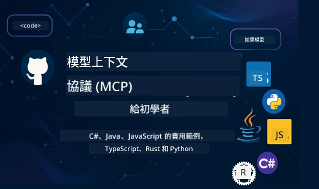

 

[](https://GitHub.com/microsoft/mcp-for-beginners/graphs/contributors)
[](https://GitHub.com/microsoft/mcp-for-beginners/issues)
[](https://GitHub.com/microsoft/mcp-for-beginners/pulls)
[](http://makeapullrequest.com)
[](https://mcptoplist.com/server/mcp.so%2Fmcp-for-beginners%2Fmicrosoft)

[](https://GitHub.com/microsoft/mcp-for-beginners/watchers)
[](https://GitHub.com/microsoft/mcp-for-beginners/fork)
[](https://GitHub.com/microsoft/mcp-for-beginners/stargazers)


[](https://discord.gg/nTYy5BXMWG)

按照以下步驟開始使用這些資源：
1. <strong>派生本儲存庫</strong>：點擊 [](https://GitHub.com/microsoft/mcp-for-beginners/fork)
2. <strong>複製儲存庫</strong>：   `git clone https://github.com/microsoft/mcp-for-beginners.git`
3. <strong>加入</strong> [](https://discord.gg/nTYy5BXMWG)


### 🌐 多語言支援

#### 透過 GitHub Action 支援（自動且隨時更新）

<!-- CO-OP TRANSLATOR LANGUAGES TABLE START -->
[Arabic](../ar/README.md) | [Bengali](../bn/README.md) | [Bulgarian](../bg/README.md) | [Burmese (Myanmar)](../my/README.md) | [Chinese (Simplified)](../zh-CN/README.md) | [Chinese (Traditional, Hong Kong)](../zh-HK/README.md) | [Chinese (Traditional, Macau)](../zh-MO/README.md) | [Chinese (Traditional, Taiwan)](./README.md) | [Croatian](../hr/README.md) | [Czech](../cs/README.md) | [Danish](../da/README.md) | [Dutch](../nl/README.md) | [Estonian](../et/README.md) | [Finnish](../fi/README.md) | [French](../fr/README.md) | [German](../de/README.md) | [Greek](../el/README.md) | [Hebrew](../he/README.md) | [Hindi](../hi/README.md) | [Hungarian](../hu/README.md) | [Indonesian](../id/README.md) | [Italian](../it/README.md) | [Japanese](../ja/README.md) | [Kannada](../kn/README.md) | [Khmer](../km/README.md) | [Korean](../ko/README.md) | [Lithuanian](../lt/README.md) | [Malay](../ms/README.md) | [Malayalam](../ml/README.md) | [Marathi](../mr/README.md) | [Nepali](../ne/README.md) | [Nigerian Pidgin](../pcm/README.md) | [Norwegian](../no/README.md) | [Persian (Farsi)](../fa/README.md) | [Polish](../pl/README.md) | [Portuguese (Brazil)](../pt-BR/README.md) | [Portuguese (Portugal)](../pt-PT/README.md) | [Punjabi (Gurmukhi)](../pa/README.md) | [Romanian](../ro/README.md) | [Russian](../ru/README.md) | [Serbian (Cyrillic)](../sr/README.md) | [Slovak](../sk/README.md) | [Slovenian](../sl/README.md) | [Spanish](../es/README.md) | [Swahili](../sw/README.md) | [Swedish](../sv/README.md) | [Tagalog (Filipino)](../tl/README.md) | [Tamil](../ta/README.md) | [Telugu](../te/README.md) | [Thai](../th/README.md) | [Turkish](../tr/README.md) | [Ukrainian](../uk/README.md) | [Urdu](../ur/README.md) | [Vietnamese](../vi/README.md)

> **偏好本地複製？**
>
> 本儲存庫包含 50 多種語言的翻譯，會大大增加下載大小。若想要在沒有翻譯的情況下複製，請使用稀疏檢出：
>
> **Bash / macOS / Linux：**
> ```bash
> git clone --filter=blob:none --sparse https://github.com/microsoft/mcp-for-beginners.git
> cd mcp-for-beginners
> git sparse-checkout set --no-cone '/*' '!translations' '!translated_images'
> ```
>
> **CMD (Windows)：**
> ```cmd
> git clone --filter=blob:none --sparse https://github.com/microsoft/mcp-for-beginners.git
> cd mcp-for-beginners
> git sparse-checkout set --no-cone "/*" "!translations" "!translated_images"
> ```
>
> 這樣能讓你以更快的速度下載，並得到完成課程所需的所有內容。
<!-- CO-OP TRANSLATOR LANGUAGES TABLE END -->

# 🚀 初學者的模型上下文協議（MCP）課程

## **透過 C#、Java、JavaScript、Rust、Python 和 TypeScript 的實作範例學習 MCP**

## 🧠 模型上下文協議課程概述
歡迎開始你的模型上下文協議之旅！如果你曾好奇 AI 應用程序如何與不同的工具和服務溝通，你即將發現這個優雅的解決方案，它正在改變開發者建構智慧系統的方式。

將 MCP 想像成 AI 應用程序的萬用翻譯器——就像 USB 埠讓你能將任何裝置連接到電腦一樣，MCP 讓 AI 模型能以標準化方式連接到任何工具或服務。無論你正在建立你的第一個聊天機器人或是在處理複雜的 AI 工作流程，理解 MCP 將賦予你製作更強大且更靈活應用的能力。

這個課程用耐心和細心設計你的學習旅程。我們會從你已經熟悉的簡單概念開始，逐步透過你喜愛的程式語言實作練習來累積技能。每個步驟都包含清楚的解釋、實際範例，以及豐富的鼓勵。

當你完成此旅程時，你將有信心自己建立 MCP 伺服器、將它們整合進流行的 AI 平台，並理解這項技術如何重塑 AI 開發的未來。讓我們一起開始這令人興奮的冒險吧！

### 官方文件與規範

這套課程與 **MCP 規範 2025-11-25**（最新穩定版）一致。MCP 規範使用日期版號（YYYY-MM-DD 格式）來確保協議版本的清楚追蹤。

> **展望未來：** 下一個規範版本的候選發行版 **2026-07-28** 預計於 2026 年 7 月 28 日發布。它使協議在傳輸層保持無狀態，正式化擴充框架（MCP 應用、任務）、強化授權，並廢除 Roots、Sampling 和 Logging。請參閱 [MCP 變更內容：2026-07-28 候選發行版](./01-CoreConcepts/mcp-2026-07-28-release-candidate.md) 完整說明。

這些資源隨著你的理解提升會愈加珍貴，但不需急著全部閱讀。請從你最有興趣的主題開始！
- 📘 [MCP 文件](https://modelcontextprotocol.io/) – 這是你的逐步教學和使用指南的首選資源。文件以初學者為對象，提供清楚的範例，讓你能自行跟隨學習。
- 📜 [MCP 規範](https://modelcontextprotocol.io/specification/2025-11-25) – 可將它視為你的完整參考手冊。在課程中，你會經常回來查閱特定細節和探索進階功能。
- 📜 [MCP 規範版本管理](https://modelcontextprotocol.io/specification/versioning) – 載有協議版本歷史與 MCP 如何使用基於日期的版本號（YYYY-MM-DD 格式）的資訊。
- 🧑‍💻 [MCP GitHub 儲存庫](https://github.com/modelcontextprotocol) – 在這可以找到多種語言的 SDK、工具及程式碼範例。就像一個充滿實用範例和現成元件的寶藏庫。
- 🌐 [MCP 社群](https://github.com/orgs/modelcontextprotocol/discussions) – 加入其他學習者和資深開發者的討論。這是一個支持性的社群，歡迎提問並自由分享知識。
  
## 學習目標

完成這套課程後，你將對新技能感到自信與興奮。你將達成以下目標：

• **理解 MCP 基礎**：你會明白模型上下文協議是什麼，為何它正在革新 AI 應用如何協同運作，透過比喻和實例幫助理解。

• **建立你的第一個 MCP 伺服器**：你將用自己喜愛的程式語言打造可運作的 MCP 伺服器，從簡單範例開始，逐步提升技能。

• **連結 AI 模型與真實工具**：學習如何銜接 AI 模型和實際服務，為你的應用賦予強大的新能力。

• <strong>實作安全最佳實務</strong>：了解如何維護 MCP 實作的安全，保護你的應用和用戶。

• <strong>自信部署</strong>：你會知道如何將 MCP 專案從開發階段帶到生產環境，掌握實務可行的部署策略。

• **加入 MCP 社群**：成為不斷壯大的開發者社群一員，共同塑造 AI 應用開發的未來。

## 基礎知識

在深入 MCP 細節前，我們先確保你熟悉一些基礎概念。別擔心，就算你不是這些領域的專家，我們會隨時說明所有你需要知道的內容！

### 理解協議（基石）

把協議想成談話的規則。當你打電話給朋友，你們都知道接聽時要說「哈囉」、輪流講話，結束時說「再見」。電腦程式也需要類似的規則才能有效溝通。

MCP 是一種協議——一組雙方同意遵守的規則，幫助 AI 模型與工具服務建立有效的「對話」。就像人類溝通有規則讓交流更順暢，MCP 也讓 AI 應用的通訊更可靠和強大。

### 用戶端-伺服器關係（程式如何協作）

你每天都在使用用戶端-伺服器關係！當你用瀏覽器（用戶端）造訪網站時，你連接的是提供頁面內容的網頁伺服器。瀏覽器知道如何請求資訊，伺服器知道如何回應。

在 MCP 中，我們有類似的關係：AI 模型充當請求資訊或動作的用戶端，而 MCP 伺服器提供這些能力。就像 AI 有一位能幫忙執行特定任務的助理（伺服器）。

### 為什麼標準化重要（讓一切協同運作）

想像如果每家汽車製造商的加油槍型狀都不一樣——你要為每輛車準備不同的轉接頭！標準化就是達成共識，讓各種設備無縫協作。

MCP 為 AI 應用提供了這樣的標準化。不用每個 AI 模型都要寫特殊程式碼來對接每個工具，MCP 創造了一種普遍的溝通方式。這意味著開發者只需打造一次工具，就能與多種 AI 系統相容。

## 🧭 你的學習路徑概覽

你的 MCP 旅程精心設計，讓你逐步建立信心與技能。每個階段引入新概念，同時強化你已學的內容。

### 🌱 基礎階段：理解基本概念（模組 0-2）

冒險從這裡開始！我們將用熟悉的比喻和簡易範例介紹 MCP 概念。你將了解 MCP 是什麼、為何存在，以及它如何融入 AI 開發的宏觀世界。


• **模組 0 - MCP 簡介**：我們將從探索 MCP 是什麼以及它為什麼對現代 AI 應用如此重要開始。你將看到 MCP 實際運作的真實範例，並了解它如何解決開發者常見的問題。

• **模組 1 - 核心概念解析**：在這裡你將學到 MCP 的基本組成要素。我們會使用大量類比和視覺範例，確保這些概念感覺自然且易於理解。

• **模組 2 - MCP 的安全性**：安全性聽起來可能令人畏懼，但我們會展示 MCP 如何包含內建的安全功能，並教授從一開始就保護你的應用的最佳實踐。

### 🔨 建置階段：建立你的第一個實作（模組 3）

現在真正有趣的部分開始了！你將親手建立實際的 MCP 伺服器和用戶端。別擔心——我們會從簡單開始，並引導你完成每一步。

這個模組包含多個實作指南，讓你可以使用喜愛的程式語言進行練習。你將創建第一個伺服器，構建能連接到它的用戶端，甚至整合流行的開發工具如 VS Code。

每個指南都附有完整的程式碼範例、疑難排解技巧，以及解釋為何我們做出特定設計決策。這一階段結束時，你將擁有可自豪的 MCP 實作成果！

### 🚀 成長階段：進階概念與實務應用（模組 4-5）

掌握基礎後，你將準備探索更複雜的 MCP 功能。我們將涵蓋實務實作策略、除錯技巧，以及像是多模態 AI 結合等進階主題。

你還將學習如何為生產環境擴展你的 MCP 實作，並與 Azure 等雲端平台整合。這些模組幫助你打造能應付現實需求的 MCP 解決方案。

### 🌟 大師階段：社群與專精（模組 6-11）

最後階段專注於加入 MCP 社群並專注於你最感興趣的領域。你會學習如何貢獻開源 MCP 專案、實作進階認證模式，還有建置完整的資料庫整合方案。

模組 11 特別值得一提——它是一個包含 13 個實作實驗室的完整動手學習路徑，教你建立具備 PostgreSQL 整合的生產級 MCP 伺服器。就像一個總結專案，綜合你所學的一切！

### 📚 完整課程結構

| 模組 | 主題 | 說明 | 連結 |
|--------|-------|-------------|------|
| **模組 0-3：基礎** | | | |
| 00 | MCP 簡介 | Model Context Protocol 及其在 AI 管線中的重要性概述 | [閱讀更多](./00-Introduction/README.md) |
| 01 | 核心概念解析 | 深入探討 MCP 核心概念 | [閱讀更多](./01-CoreConcepts/README.md) |
| 1.1 | MCP 的變化（2026-07-28 RC） | 無狀態協定、擴充框架與即將於下一版規範中棄用的功能 | [指南](./01-CoreConcepts/mcp-2026-07-28-release-candidate.md) |
| 02 | MCP 的安全性 | 安全威脅與最佳實踐 | [閱讀更多](./02-Security/README.md) |
| 03 | MCP 入門 | 環境設定、基本伺服器/用戶端、整合 | [閱讀更多](./03-GettingStarted/README.md) |
| **模組 3：建立你的第一個伺服器與用戶端** | | | |
| 3.1 | 第一個伺服器 | 建立你的第一個 MCP 伺服器 | [指南](./03-GettingStarted/01-first-server/README.md) |
| 3.2 | 第一個用戶端 | 開發基本 MCP 用戶端 | [指南](./03-GettingStarted/02-client/README.md) |
| 3.3 | 帶 LLM 的用戶端 | 整合大型語言模型 | [指南](./03-GettingStarted/03-llm-client/README.md) |
| 3.4 | VS Code 整合 | 在 VS Code 使用 MCP 伺服器 | [指南](./03-GettingStarted/04-vscode/README.md) |
| 3.5 | stdio 伺服器 | 使用 stdio 傳輸建立伺服器 | [指南](./03-GettingStarted/05-stdio-server/README.md) |
| 3.6 | HTTP 串流 | 在 MCP 中實作 HTTP 串流 | [指南](./03-GettingStarted/06-http-streaming/README.md) |
| 3.7 | Microsoft Foundry 工具組 | 使用 Microsoft Foundry 工具組搭配 MCP | [指南](./03-GettingStarted/07-aitk/README.md) |
| 3.8 | 測試 | 測試你的 MCP 伺服器實作 | [指南](./03-GettingStarted/08-testing/README.md) |
| 3.9 | 部署 | 將 MCP 伺服器部署到生產環境 | [指南](./03-GettingStarted/09-deployment/README.md) |
| 3.10 | 進階伺服器使用 | 利用進階伺服器實現高級功能及改善架構 | [指南](./03-GettingStarted/10-advanced/README.md) |
| 3.11 | 簡單認證 | 從基礎開始介紹認證與角色基礎存取控制（RBAC） | [指南](./03-GettingStarted/11-simple-auth/README.md) |
| 3.12 | MCP 主機 | 設定 Claude Desktop、Cursor、Cline 及其他 MCP 主機 | [指南](./03-GettingStarted/12-mcp-hosts/README.md) |
| 3.13 | MCP 檢查工具 | 使用 Inspector 工具除錯與測試 MCP 伺服器 | [指南](./03-GettingStarted/13-mcp-inspector/README.md) |
| 3.14 | 取樣 | 使用取樣技術與用戶端協作 | [指南](./03-GettingStarted/14-sampling/README.md) |
| 3.15 | MCP 應用程式 | 建立 MCP 應用程式 | [指南](./03-GettingStarted/15-mcp-apps/README.md) |
| **模組 4-5：實務與進階** | | | |
| 04 | 實務實作 | SDK、除錯、測試、可重用提示模板 | [閱讀更多](./04-PracticalImplementation/README.md) |
| 4.1 | 分頁 | 使用基於游標的分頁處理大量結果集 | [指南](./04-PracticalImplementation/pagination/README.md) |
| 05 | MCP 進階主題 | 多模態 AI、擴展、企業應用 | [閱讀更多](./05-AdvancedTopics/README.md) |
| 5.1 | Azure 整合 | MCP 與 Azure 的整合 | [指南](./05-AdvancedTopics/mcp-integration/README.md) |
| 5.2 | 多模態 | 處理多種模態 | [指南](./05-AdvancedTopics/mcp-multi-modality/README.md) |
| 5.3 | OAuth2 示範 | 實作 OAuth2 認證 | [指南](./05-AdvancedTopics/mcp-oauth2-demo/README.md) |
| 5.4 | 根上下文 | 理解與實作根上下文 | [指南](./05-AdvancedTopics/mcp-root-contexts/README.md) |
| 5.5 | 路由 | MCP 路由策略 | [指南](./05-AdvancedTopics/mcp-routing/README.md) |
| 5.6 | 取樣 | MCP 中的取樣技術 | [指南](./05-AdvancedTopics/mcp-sampling/README.md) |
| 5.7 | 擴展 | MCP 實作擴展 | [指南](./05-AdvancedTopics/mcp-scaling/README.md) |
| 5.8 | 安全性 | 進階安全考量 | [指南](./05-AdvancedTopics/mcp-security/README.md) |
| 5.9 | 網路搜尋 | 實作網路搜尋功能 | [指南](./05-AdvancedTopics/web-search-mcp/README.md) |
| 5.10 | 即時串流 | 建立即時串流功能 | [指南](./05-AdvancedTopics/mcp-realtimestreaming/README.md) |
| 5.11 | 即時搜尋 | 實作即時搜尋 | [指南](./05-AdvancedTopics/mcp-realtimesearch/README.md) |
| 5.12 | Entra ID 認證 | 使用 Microsoft Entra ID 認證 | [指南](./05-AdvancedTopics/mcp-security-entra/README.md) |
| 5.13 | Foundry 整合 | 與 Microsoft Foundry 整合 | [指南](./05-AdvancedTopics/mcp-foundry-agent-integration/README.md) |
| 5.14 | 上下文工程 | 有效上下文工程技術 | [指南](./05-AdvancedTopics/mcp-contextengineering/README.md) |
| 5.15 | MCP 自訂傳輸 | 自訂傳輸實作 | [指南](./05-AdvancedTopics/mcp-transport/README.md) |
| 5.16 | 協定功能 | 進度通知、取消、資源模板 | [指南](./05-AdvancedTopics/mcp-protocol-features/README.md) |
| 5.17 | 對抗式多代理推理 | 兩個代理使用共享 MCP 工具辯論對立立場，由裁判代理評估 | [指南](./05-AdvancedTopics/mcp-adversarial-agents/README.md) |
| **模組 6-10：社群與最佳實踐** | | | |
| 06 | 社群貢獻 | 如何為 MCP 生態系貢獻 | [指南](./06-CommunityContributions/README.md) |
| 07 | 早期採用心得 | 實際實作故事 | [指南](./07-LessonsfromEarlyAdoption/README.md) |
| 08 | MCP 最佳實踐 | 性能、容錯、韌性 | [指南](./08-BestPractices/README.md) |
| 09 | MCP 案例研究 | 實務實作範例 | [指南](./09-CaseStudy/README.md) |
| 10 | 實作工作坊 | 使用 Microsoft Foundry 工具組打造 MCP 伺服器 | [實驗室](./10-StreamliningAIWorkflowsBuildingAnMCPServerWithAIToolkit/README.md) |
| **模組 11：MCP 伺服器實作實驗室** | | | |
| 11 | MCP 伺服器資料庫整合 | 針對 PostgreSQL 整合的完整 13 個實驗室動手學習路徑 | [實驗室](./11-MCPServerHandsOnLabs/README.md) |
| 11.1 | 簡介 | 介紹具備資料庫整合的 MCP 與零售分析應用案例 | [實驗室 00](./11-MCPServerHandsOnLabs/00-Introduction/README.md) |
| 11.2 | 核心架構 | 理解 MCP 伺服器架構、資料庫層與安全模式 | [實驗室 01](./11-MCPServerHandsOnLabs/01-Architecture/README.md) |
| 11.3 | 安全與多租戶 | 行級安全、認證與多租戶資料存取 | [實驗室 02](./11-MCPServerHandsOnLabs/02-Security/README.md) |
| 11.4 | 環境設定 | 設定開發環境、Docker、Azure 資源 | [實驗室 03](./11-MCPServerHandsOnLabs/03-Setup/README.md) |
| 11.5 | 資料庫設計 | PostgreSQL 設定、零售架構設計與範例資料 | [實驗室 04](./11-MCPServerHandsOnLabs/04-Database/README.md) |
| 11.6 | MCP 伺服器實作 | 建構整合資料庫的 FastMCP 伺服器 | [實驗室 05](./11-MCPServerHandsOnLabs/05-MCP-Server/README.md) |
| 11.7 | 工具開發 | 創建資料庫查詢工具與架構檢視 | [實驗室 06](./11-MCPServerHandsOnLabs/06-Tools/README.md) |
| 11.8 | 語義搜尋 | 使用 Azure OpenAI 與 pgvector 實作向量嵌入 | [實驗室 07](./11-MCPServerHandsOnLabs/07-Semantic-Search/README.md) |
| 11.9 | 測試與除錯 | 測試策略、除錯工具及驗證方法 | [實驗室 08](./11-MCPServerHandsOnLabs/08-Testing/README.md) |
| 11.10 | VS Code 整合 | 設定 VS Code MCP 整合與 AI 聊天功能 | [實驗室 09](./11-MCPServerHandsOnLabs/09-VS-Code/README.md) |
| 11.11 | 部署策略 | Docker 部署、Azure 容器應用與擴展考量 | [實驗室 10](./11-MCPServerHandsOnLabs/10-Deployment/README.md) |
| 11.12 | 監控 | Application Insights、日誌、效能監控 | [實驗室 11](./11-MCPServerHandsOnLabs/11-Monitoring/README.md) |
| 11.13 | 最佳實踐 | 性能優化、安全強化與生產環境技巧 | [實驗室 12](./11-MCPServerHandsOnLabs/12-Best-Practices/README.md) |
| **模組 12：MCP 工具** | | | |
| 12.1 | 工具 | 在 Copilot App 中使用 MCP | [指南](./12-tooling/README.md) |

### 💻 範例程式專案

學習 MCP 最令人興奮的部分之一，就是看到你的程式技能逐步成長。我們設計的程式範例從簡單開始，隨著你理解深度提高逐漸變得更複雜。這裡是我們引介概念的方式——使用易於理解但展示真實 MCP 原則的程式碼，你不只會明白這段程式碼做了什麼，還會了解為何如此結構化，及其如何融入更大的 MCP 應用。

#### 基本 MCP 計算器範例

| 語言 | 說明 | 連結 |
|----------|-------------|------|

| C# | MCP 伺服器範例 | [檢視程式碼](./03-GettingStarted/samples/csharp/README.md) |
| Java | MCP 計算機 | [檢視程式碼](./03-GettingStarted/samples/java/calculator/README.md) |
| JavaScript | MCP 示範 | [檢視程式碼](./03-GettingStarted/samples/javascript/README.md) |
| Python | MCP 伺服器 | [檢視程式碼](../../03-GettingStarted/samples/python/mcp_calculator_server.py) |
| TypeScript | MCP 範例 | [檢視程式碼](./03-GettingStarted/samples/typescript/README.md) |
| Rust | MCP 範例 | [檢視程式碼](./03-GettingStarted/samples/rust/README.md) |

#### 進階 MCP 實作

| 語言 | 說明 | 連結 |
|----------|-------------|------|
| C# | 進階範例 | [檢視程式碼](./04-PracticalImplementation/samples/csharp/README.md) |
| Java 與 Spring | 容器應用範例 | [檢視程式碼](./04-PracticalImplementation/samples/java/containerapp/README.md) |
| JavaScript | 進階範例 | [檢視程式碼](./04-PracticalImplementation/samples/javascript/README.md) |
| Python | 複雜實作 | [檢視程式碼](./04-PracticalImplementation/samples/python/README.md) |
| TypeScript | 容器範例 | [檢視程式碼](./04-PracticalImplementation/samples/typescript/README.md) |


## 🎯 學習 MCP 的先決條件

為了充分利用此課程，您應該具備：

- 至少熟悉以下一種語言的基礎程式設計知識：C#、Java、JavaScript、Python 或 TypeScript
- 理解用戶端-伺服器模型和 API
- 熟悉 REST 與 HTTP 概念
- （選擇性）具備 AI/ML 概念背景

- 加入我們的社群討論以獲得支援

## 📚 學習指南與資源

此儲存庫包含多項資源，以幫助您有效導航和學習：

### 學習指南

提供一份完整的[學習指南](./study_guide.md)，協助您有效瀏覽此儲存庫。此視覺課程地圖展示所有主題的連結，並提供如何有效使用範例專案的指引。對於喜歡從整體視角學習的視覺型學習者特別有幫助。

指南包含：
- 顯示涵蓋所有主題的視覺課程地圖
- 各儲存庫章節的詳細解析
- 如何使用範例專案的指引
- 適合不同技能層級的推薦學習路徑
- 補充學習旅程的額外資源

### 變更紀錄

我們維護詳細的[變更紀錄](./changelog.md)，追蹤所有課程材料的重要更新，讓您隨時掌握最新改進與新增內容。
- 新增內容
- 結構調整
- 功能改進
- 文件更新

## 🛠️ 如何有效使用本課程

本指南的每堂課包含：

1. MCP 概念的清晰說明  
2. 多語言的即時程式碼範例  
3. 建立實際 MCP 應用的練習  
4. 提供給進階學習者的額外資源

### 跟著 C# 來學 MCP - 教學系列
一起學習 Model Context Protocol（MCP），這是一個前沿框架，用於標準化 AI 模型與用戶端應用程式間的互動。透過此為初學者量身打造的課程，我們將介紹 MCP，並引導您建立第一個 MCP 伺服器。
#### C#: [https://aka.ms/letslearnmcp-csharp](https://aka.ms/letslearnmcp-csharp)
#### Java: [https://aka.ms/letslearnmcp-java](https://aka.ms/letslearnmcp-java)
#### JavaScript: [https://aka.ms/letslearnmcp-javascript](https://aka.ms/letslearnmcp-javascript)
#### Python: [https://aka.ms/letslearnmcp-python](https://aka.ms/letslearnmcp-python)

## 🎓 您的 MCP 旅程開始了

恭喜！您剛踏出令人興奮的第一步，這將擴展您的程式設計能力，並連結到 AI 開發的尖端領域。

### 您已完成的部分

透過閱讀此介紹，您已開始建立 MCP 知識基礎。您了解 MCP 是什麼，為何重要，以及此課程如何支援您的學習旅程。這是一大成就，也是您在這項重要技術上專業旅程的開端。

### 未來的冒險

隨著您進展課程，請記住每位專家都曾是初學者。那些現在看似複雜的概念，透過練習與應用將變得駕輕就熟。每個小步驟都是邁向強大能力的基礎，將伴隨您的開發生涯。

### 您的支援網絡

您加入了一個熱衷於 MCP 且樂於助人的學習者與專家社群。無論您是卡在程式挑戰或想分享新發現，這個社群都會支持您的旅程。

若您在建立 AI 應用遇到困難或有疑問，加入其他學習者和經驗豐富開發者的討論吧。這裡是個友善的社群，歡迎提出問題並自由分享知識。

[](https://discord.gg/nTYy5BXMWG)

若您在使用過程中有產品反饋或錯誤，請造訪：

[](https://aka.ms/foundry/forum)

### 準備好了嗎？

您的 MCP 冒險現在開始！從模組 0 開始，體驗您的首次 MCP 實作，或探索範例專案，看看您將會建立什麼。記住——每位專家都是從您現在的位置開始的。只要有耐心與練習，您會對自己的成就感到驚豔。

歡迎進入 Model Context Protocol 開發世界。讓我們一起創造出不可思議的成果！

## 🤝 為學習社群做出貢獻

此課程隨著像您這樣的學習者貢獻而日益強大！無論是修正錯別字、建議更清楚的說明，或新增範例，您的貢獻都助其他初學者成功。

感謝微軟 MVP [Shivam Goyal](https://www.linkedin.com/in/shivam2003/) 貢獻程式碼範例。

貢獻流程設計友善且具支援性。大多數貢獻需要簽署貢獻者授權協議（CLA），自動化工具會順利引導您完成流程。

## 📜 開源學習

整個課程以 MIT [LICENSE](../../LICENSE) 授權，您可以自由使用、修改和分享。這支持我們讓 MCP 知識普及到全球開發者的使命。
## 🤝 貢獻指南

本專案歡迎貢獻與建議。大多數貢獻需您同意簽署
貢獻者授權協議（CLA），聲明您有權利且確實授權我們
使用您的貢獻。詳情請參閱 <https://cla.opensource.microsoft.com>。

當您提出 pull request 時，CLA 機器人會自動判定您是否需要提供
CLA 並適當標示 PR（例如狀態檢查、評論）。只要依照機器人指示操作即可。您只需在所有使用我們 CLA 的儲存庫中執行此程序一次。


更多資訊請參閱 [行為準則 FAQ](https://opensource.microsoft.com/codeofconduct/faq/) 或
聯絡 [opencode@microsoft.com](mailto:opencode@microsoft.com) 提問或反映意見。


---

*準備開始您的 MCP 旅程了嗎？請從[模組 00 - MCP 介紹](./00-Introduction/README.md) 開始，邁出第一步探索 Model Context Protocol 開發的精彩世界！*


## 🎒 其他課程
我們團隊還製作其他課程！請參考：

<!-- CO-OP TRANSLATOR OTHER COURSES START -->
### LangChain
[](https://aka.ms/langchain4j-for-beginners)
[](https://aka.ms/langchainjs-for-beginners?WT.mc_id=m365-94501-dwahlin)
[](https://github.com/microsoft/langchain-for-beginners?WT.mc_id=m365-94501-dwahlin)
---

### Azure / 邊緣運算 / MCP / 代理人
[](https://github.com/microsoft/AZD-for-beginners?WT.mc_id=academic-105485-koreyst)
[](https://github.com/microsoft/edgeai-for-beginners?WT.mc_id=academic-105485-koreyst)
[](https://github.com/microsoft/mcp-for-beginners?WT.mc_id=academic-105485-koreyst)
[](https://github.com/microsoft/ai-agents-for-beginners?WT.mc_id=academic-105485-koreyst)

---
 
### 生成式 AI 系列
[](https://github.com/microsoft/generative-ai-for-beginners?WT.mc_id=academic-105485-koreyst)
[-9333EA?style=for-the-badge&labelColor=E5E7EB&color=9333EA)](https://github.com/microsoft/Generative-AI-for-beginners-dotnet?WT.mc_id=academic-105485-koreyst)
[-C084FC?style=for-the-badge&labelColor=E5E7EB&color=C084FC)](https://github.com/microsoft/generative-ai-for-beginners-java?WT.mc_id=academic-105485-koreyst)
[-E879F9?style=for-the-badge&labelColor=E5E7EB&color=E879F9)](https://github.com/microsoft/generative-ai-with-javascript?WT.mc_id=academic-105485-koreyst)

---
 
### 核心學習
[](https://aka.ms/ml-beginners?WT.mc_id=academic-105485-koreyst)
[](https://aka.ms/datascience-beginners?WT.mc_id=academic-105485-koreyst)
[](https://aka.ms/ai-beginners?WT.mc_id=academic-105485-koreyst)

[](https://github.com/microsoft/Security-101?WT.mc_id=academic-96948-sayoung)
[](https://aka.ms/webdev-beginners?WT.mc_id=academic-105485-koreyst)
[](https://aka.ms/iot-beginners?WT.mc_id=academic-105485-koreyst)
[](https://github.com/microsoft/xr-development-for-beginners?WT.mc_id=academic-105485-koreyst)

---
 
### Copilot 系列
[](https://aka.ms/GitHubCopilotAI?WT.mc_id=academic-105485-koreyst)
[](https://github.com/microsoft/mastering-github-copilot-for-dotnet-csharp-developers?WT.mc_id=academic-105485-koreyst)
[](https://github.com/microsoft/CopilotAdventures?WT.mc_id=academic-105485-koreyst)
<!-- CO-OP TRANSLATOR OTHER COURSES END -->

---

<!-- CO-OP TRANSLATOR DISCLAIMER START -->
**免責聲明**：
此文件已使用 AI 翻譯服務 [Co-op Translator](https://github.com/Azure/co-op-translator) 進行翻譯。雖然我們努力追求準確性，但請注意自動翻譯可能包含錯誤或不準確之處。原始文件的母語版本應視為權威來源。對於關鍵資訊，建議採用專業人工翻譯。我們不對因使用此翻譯所產生的任何誤解或誤譯承擔責任。
<!-- CO-OP TRANSLATOR DISCLAIMER END -->